<article class="ltx_document ltx_pruned_first">

 

<section id="S1" class="ltx_section">
<h2 class="ltx_title ltx_title_section" id="introduction">
1 Introduction</h2>

Many contemporary machine learning workflows involve stochastic black-box optimization, where the objective is accessible only through noisy function evaluations. This regime arises in policy search with stochastic rollouts, simulation-based design and control, hardware-in-the-loop tuning, and hyperparameter optimization where training and validation induce intrinsic randomness.
In such problems, the dominant constraint is often a strict cap on the number of oracle queries, i.e., a fixed-budget protocol.
Consequently, evaluations spent on repeated measurement to denoise directly reduce the number of distinct candidates explored and the number of adaptive updates performed.

Among black-box optimizers, rank-based evolution strategies (ES), in particular
CMA-ES <cite class="ltx_cite ltx_citemacro_citep">(Hansen and Ostermeier, <a href="#bib.bib1" title="Completely derandomized self-adaptation in evolution strategies" class="ltx_ref">2001</a>)</cite>, are appealing because they require only relative comparisons of candidates and
inherit invariance that make them robust across problem scalings. However, their reliance on intra-generation ranking makes them especially sensitive to evaluation noise: if the objective values of a sampled population are
perturbed, the induced permutation of ranks changes, resulting misled updates using misranked “elites.” In other words, noisy evaluations turn into selection noise that directly perturbs the update direction.

A large body of work on noisy evolutionary optimization advocates allocating additional intra-generation evaluations, such as uniform $k$-fold resampling and aggregation, sequential sampling / racing, and uncertainty-handling
variants of CMA-ES, to stabilize ranks before updating
<cite class="ltx_cite ltx_citemacro_citep">(Jin and Branke, <a href="#bib.bib4" title="Evolutionary optimization in uncertain environments – a survey" class="ltx_ref">2005</a>; Rakshit et al., <a href="#bib.bib5" title="Noisy evolutionary optimization algorithms - a comprehensive survey" class="ltx_ref">2017</a>; Beyer and Sendhoff, <a href="#bib.bib31" title="Evolutionary algorithms in the presence of noise: to sample or not to sample" class="ltx_ref">2007</a>; Hansen et al., <a href="#bib.bib2" title="A method for handling uncertainty in evolutionary optimization with an application to feedback control of combustion" class="ltx_ref">2009</a>; Groves and Branke, <a href="#bib.bib33" title="Sequential sampling for noisy optimisation with CMA-ES" class="ltx_ref">2018</a>; Birattari et al., <a href="#bib.bib15" title="A racing algorithm for configuring metaheuristics" class="ltx_ref">2002</a>)</cite>.
These approaches typically prioritize per-generation fidelity:
approximate the noiseless ordering as closely as possible before applying the standard rank-based update.

However, under a fixed-budget protocol, fidelity comes with cost: evaluating each candidate multiple times reduces the number of generations inversely. This matters because the strength of CMA-ES comes from iterated distribution learning (mean, covariance, step-size adaptation) accumulated through many generations. In particular, update is mostly sensitive to the elite threshold due to truncation selection, where the borderline candidates have nearly indistinguishable objective values and achieving reliable selection via repeated evaluations can be more costly.

This paper argues for a complementary principle for fixed-budget noisy ES:
when ranking uncertainty is high, it can be more sample-efficient to keep the per-generation evaluation cost low, thereby preserving optimization depth, and to incorporate uncertainty directly into the selection weights. Concretely, we introduce <em class="ltx_emph ltx_font_italic">probabilistic elite membership</em> (PEM): rather than applying hard rank weights from
a single noisy ranking, we target the conditional expected rank weights given the sampled candidates. PEM can be viewed as a Rao–Blackwellization of the standard noisy rank-based update, which preserves the conditional mean update while reducing conditional update dispersion.

Computing PEM exactly would require extensive reevaluations per candidate, risking depth collapse. We therefore propose <em class="ltx_emph ltx_font_italic">residual-bootstrapped</em> PEM (RB-PEM), a practical estimator that uses only a
<em class="ltx_emph ltx_font_italic">capped, additive</em> reevaluation overhead per generation. Each generation evaluates every candidate once and uses a small targeted reevaluation set to calibrate the local noise model, then extracts standardized noise residuals and inserts them into a pooled residual bank that is reused
across generations. With this amortized residual pool, we can simulate many bootstrap rankings at essentially zero
evaluation cost <cite class="ltx_cite ltx_citemacro_citep">(Efron and Tibshirani, <a href="#bib.bib18" title="An introduction to the bootstrap" class="ltx_ref">1993</a>)</cite> and estimate expected weights accurately while keeping per-generation cost close to one evaluation per candidate. Since pooling residuals can fail under distributional mismatch, we decompose the pool-to-target mismatch into four falsifiable online-measurable components and use them as runtime diagnostics.

Depth-over-fidelity is not universally optimal: when rankings are already reliable, smoothing can weaken selection
pressure and any additional reevaluation becomes overhead. We therefore introduce a low-cost <em class="ltx_emph ltx_font_italic">probe-and-switch</em>
mechanism using a small probing budget to dynamically choose between standard CMA-ES and RB-PEM.

Our main contributions are:

<ul id="S1.I1" class="ltx_itemize">
<li id="S1.I1.i1" class="ltx_item" style="list-style-type:none;">
• 

We identify and formalize a <em class="ltx_emph ltx_font_italic">depth–fidelity</em> tradeoff for noisy rank-based
evolution strategies under strict evaluation budgets, clarifying when evaluation-stage uncertainty reduction can be
sample-inefficient.

</li>
<li id="S1.I1.i2" class="ltx_item" style="list-style-type:none;padding-top:1.0pt;">
• 

We introduce Probabilistic elite membership (PEM) as a principled selection-stage
target, which can be viewed as a Rao–Blackwell variance reduction.

</li>
<li id="S1.I1.i3" class="ltx_item" style="list-style-type:none;padding-top:1.0pt;">
• 

We design residual-bootstrapped PEM (RB-PEM) with capped per-generation overhead and an amortized residual pool, and provide theory and runtime checks that quantify and
diagnose residual pool mismatch.

</li>
<li id="S1.I1.i4" class="ltx_item" style="list-style-type:none;padding-top:1.0pt;">
• 

We propose the adaptive rule probe-and-switch to prevent negative transfer by reverting to standard
CMA-ES in low-misranking regimes.

</li>
<li id="S1.I1.i5" class="ltx_item" style="list-style-type:none;padding-top:1.0pt;">
• 

Across the COCO bbob-noisy suite and diverse external tasks (RL policy search and noisy hyperparameter optimization), RB-PEM consistently improves fixed-budget performance in high-misranking regimes, substantiating the thesis that integrating uncertainty at the selection stage can be more sample-efficient than reducing it at the evaluation stage.

</li>
</ul>

Section <a href="#S3" title="3 Preliminaries ‣ Depth over Fidelity in Fixed-Budget Noisy Evolution Strategies" class="ltx_ref">3</a> formalizes the fixed-budget protocol, noisy ranking, and the depth–fidelity tension.
Section <a href="#S4" title="4 Method: PEM, Residual Bootstrapping, and Probe-and-Switch ‣ Depth over Fidelity in Fixed-Budget Noisy Evolution Strategies" class="ltx_ref">4</a> presents PEM, residual bootstrapping, and probe-and-switch; Section <a href="#S5" title="5 Theory ‣ Depth over Fidelity in Fixed-Budget Noisy Evolution Strategies" class="ltx_ref">5</a> provides a
theoretical explanation based on conditional update dispersion; and Section <a href="#S6" title="6 Experiments ‣ Depth over Fidelity in Fixed-Budget Noisy Evolution Strategies" class="ltx_ref">6</a> evaluates the
resulting algorithms under strict budgets.

</section>
<section id="S2" class="ltx_section">
<h2 class="ltx_title ltx_title_section" id="related-work">
2 Related Work</h2>

Noise handling in ES.
Most noisy-ES methods modify how candidates are observed before applying a deterministic rank rule. Uniform resampling, racing, and sequential sampling spend extra evaluations to stabilize ranks <cite class="ltx_cite ltx_citemacro_citep">(Beyer and Sendhoff, <a href="#bib.bib31" title="Evolutionary algorithms in the presence of noise: to sample or not to sample" class="ltx_ref">2007</a>; Branke and Schmidt, <a href="#bib.bib60" title="Sequential sampling in noisy environments" class="ltx_ref">2004</a>; Groves and Branke, <a href="#bib.bib33" title="Sequential sampling for noisy optimisation with CMA-ES" class="ltx_ref">2018</a>; Birattari et al., <a href="#bib.bib15" title="A racing algorithm for configuring metaheuristics" class="ltx_ref">2002</a>)</cite>; UH-CMA-ES and RA-CMA-ES adapt reevaluations during the run <cite class="ltx_cite ltx_citemacro_citep">(Hansen et al., <a href="#bib.bib2" title="A method for handling uncertainty in evolutionary optimization with an application to feedback control of combustion" class="ltx_ref">2009</a>; Uchida et al., <a href="#bib.bib46" title="CMA-ES with adaptive reevaluation for multiplicative noise" class="ltx_ref">2024</a>)</cite>; PSA-CMA-ES increases population size <cite class="ltx_cite ltx_citemacro_citep">(Nishida and Akimoto, <a href="#bib.bib47" title="PSA-CMA-ES: CMA-ES with population size adaptation" class="ltx_ref">2018</a>)</cite>; and LRA-CMA-ES preserves generation count by attenuating CMA-ES learning rates to maintain signal-to-noise ratio <cite class="ltx_cite ltx_citemacro_citep">(Nomura et al., <a href="#bib.bib48" title="CMA-ES with learning rate adaptation" class="ltx_ref">2025</a>)</cite>, which in our experiments can reduce the effective mean learning rate to about $0.04$.
Surrogate-assisted ES and DTS-CMA-ES use learned objective/posterior models, including GP surrogates and expected recombination weights <cite class="ltx_cite ltx_citemacro_citep">(Bajer et al., <a href="#bib.bib50" title="Gaussian process surrogate models for the CMA evolution strategy" class="ltx_ref">2019</a>; Krause, <a href="#bib.bib49" title="Recombination weight based selection in the DTS-CMA-ES" class="ltx_ref">2022</a>)</cite>. Noisy BO similarly integrates uncertainty through global GP models and Monte-Carlo acquisitions such as LogEI/qNEI <cite class="ltx_cite ltx_citemacro_citep">(Balandat et al., <a href="#bib.bib51" title="BoTorch: a framework for efficient monte-carlo bayesian optimization" class="ltx_ref">2020</a>; Ament et al., <a href="#bib.bib52" title="Unexpected improvements to expected improvement for bayesian optimization" class="ltx_ref">2023</a>; Frazier, <a href="#bib.bib53" title="A tutorial on bayesian optimization" class="ltx_ref">2018</a>)</cite>; RB-PEM instead avoids global surrogate and acts directly on the rank-based ES update.

Ranking and selection, and our position.
R&amp;S also allocates noisy samples to compare alternatives <cite class="ltx_cite ltx_citemacro_citep">(Kim and Nelson, <a href="#bib.bib54" title="Recent advances in ranking and selection" class="ltx_ref">2007</a>; Hong et al., <a href="#bib.bib57" title="Review on ranking and selection: a new perspective" class="ltx_ref">2021</a>, <a href="#bib.bib58" title="Solving large-scale fixed-budget ranking and selection problems" class="ltx_ref">2022</a>)</cite>, with fixed-confidence, fixed-budget, and procedure-selection variants <cite class="ltx_cite ltx_citemacro_citep">(Branke et al., <a href="#bib.bib55" title="Selecting a selection procedure" class="ltx_ref">2007</a>; Frazier, <a href="#bib.bib56" title="A fully sequential elimination procedure for indifference-zone ranking and selection with tight bounds on probability of correct selection" class="ltx_ref">2014</a>; Pearce and Branke, <a href="#bib.bib59" title="Efficient expected improvement estimation for continuous multiple ranking and selection" class="ltx_ref">2017</a>)</cite>. R&amp;S targets correct selection within a fixed alternative set, while CMA-ES uses populations as adaptive distribution-learning steps. RB-PEM is complementary to observation-stage noise handling: it intervenes at selection by replacing hard ranks with probabilistic weights. To our knowledge, this stage has remained unaddressed in the noisy single-objective ES literature.
For top-$\mu$ truncation, $w_{i}^{\star}=\Pr(r_{i}\leq\mu\mid x_{1:\lambda})/\mu$, i.e., normalized elite-set membership; the conditional expected rank $\mathbb{E}[r_{i}\mid x_{1:\lambda}]$ is a different scalar and would discard the rank-weight map. For logarithmic CMA-ES weights, PEM estimates $\mathbb{E}[w(r_{i})\mid x_{1:\lambda}]$ directly, so internal reorderings among top-ranked candidates are included.

</section>
<section id="S3" class="ltx_section">
<h2 class="ltx_title ltx_title_section" id="preliminaries">
3 Preliminaries</h2>

<section id="S3.SS1" class="ltx_subsection">
<h3 class="ltx_title ltx_title_subsection" id="optimization-under-noisy-evaluations">
3.1 Optimization under Noisy Evaluations</h3>

We study fixed-budget stochastic black-box optimization. The goal is to minimize an unknown objective

<table id="S3.E1" class="ltx_equation ltx_eqn_table">

<tbody><tr class="ltx_equation ltx_eqn_row ltx_align_baseline">
<td class="ltx_eqn_cell ltx_eqn_center_padleft"></td>
<td class="ltx_eqn_cell ltx_align_center">$$\min_{x\in\mathbb{R}^{d}}f(x),$$</td>
<td class="ltx_eqn_cell ltx_eqn_center_padright"></td>
<td rowspan="1" class="ltx_eqn_cell ltx_eqn_eqno ltx_align_middle ltx_align_right">(1)</td>
</tr></tbody>
</table>

where $f:\mathbb{R}^{d}\to\mathbb{R}$ may be nonconvex and is accessed only through noisy function evaluations. More explicitly, each <em class="ltx_emph ltx_font_italic">oracle</em> call at a point $x\in\mathbb{R}^{d}$ returns a random scalar

<table id="S3.E2" class="ltx_equation ltx_eqn_table">

<tbody><tr class="ltx_equation ltx_eqn_row ltx_align_baseline">
<td class="ltx_eqn_cell ltx_eqn_center_padleft"></td>
<td class="ltx_eqn_cell ltx_align_center">$$y(x)\;=\;f(x)+\varepsilon(x),$$</td>
<td class="ltx_eqn_cell ltx_eqn_center_padright"></td>
<td rowspan="1" class="ltx_eqn_cell ltx_eqn_eqno ltx_align_middle ltx_align_right">(2)</td>
</tr></tbody>
</table>

where $\mathbb{E}[\varepsilon(x)]=0$ and $\mathrm{Var}(\varepsilon(x))=\sigma^{2}(x)&lt;\infty$.

We will mostly assume that repeated calls at the same point $x$ yield i.i.d. samples, and all oracle calls are conditionally independent given their query locations.

</section>
<section id="S3.SS2" class="ltx_subsection">
<h3 class="ltx_title ltx_title_subsection" id="fixed-budget-protocol">
3.2 Fixed-Budget Protocol</h3>

Fix a positive integer $B$ as an evaluation budget. An algorithm produces a sequence of query
locations $(x_{1},\dots,x_{B})$ adaptively, where each $x_{t}$ is a measurable function of history
$\{(x_{s},y_{s})\}_{s=1}^{t-1}$ and internal randomness. After querying $x_{t}$ it observes
$y_{t}\sim y(x_{t})$ and consumes one unit of budget. The algorithm must terminate once the $B$-th evaluation is
consumed and a recommendation $\hat{x}_{B}$.

For population-based evolution strategies, it is convenient to group oracle calls by “generation”.
At generation $t$ the algorithm proposes $\lambda$ candidates $(x_{t,1},\dots,x_{t,\lambda})$ and may allocate
$K_{t,i}\geq 1$ evaluations to candidate $i$, producing samples
$y_{t,i}^{(1)},\dots,y_{t,i}^{(K_{t,i})}$ with $y_{t,i}^{(j)}\sim y(x_{t,i})$ i.i.d.
The total number of oracle calls is

<table id="S3.E3" class="ltx_equation ltx_eqn_table">

<tbody><tr class="ltx_equation ltx_eqn_row ltx_align_baseline">
<td class="ltx_eqn_cell ltx_eqn_center_padleft"></td>
<td class="ltx_eqn_cell ltx_align_center">$$\sum_{t}\sum_{i=1}^{\lambda}K_{t,i}\;\leq\;B,$$</td>
<td class="ltx_eqn_cell ltx_eqn_center_padright"></td>
<td rowspan="1" class="ltx_eqn_cell ltx_eqn_eqno ltx_align_middle ltx_align_right">(3)</td>
</tr></tbody>
</table>

i.e., any resampling, re-evaluation, probing, or aggregation step is counted within the same budget.

The <em class="ltx_emph ltx_font_italic">simple regret</em> of a returned recommendation is

<table id="S3.E4" class="ltx_equation ltx_eqn_table">

<tbody><tr class="ltx_equation ltx_eqn_row ltx_align_baseline">
<td class="ltx_eqn_cell ltx_eqn_center_padleft"></td>
<td class="ltx_eqn_cell ltx_align_center">$$r_{B}\;=\;f(\hat{x}_{B})-f^{\star},\qquad f^{\star}\;=\;\inf_{x\in\mathbb{R}^{d}}f(x),$$</td>
<td class="ltx_eqn_cell ltx_eqn_center_padright"></td>
<td rowspan="1" class="ltx_eqn_cell ltx_eqn_eqno ltx_align_middle ltx_align_right">(4)</td>
</tr></tbody>
</table>

and we can measure fixed-budget performance by the expected simple regret $\mathbb{E}[r_{B}]$ under the joint randomness of oracle noise and sampling randomization of the algorithm.

</section>
<section id="S3.SS3" class="ltx_subsection">
<h3 class="ltx_title ltx_title_subsection" id="noisy-evaluation-and-misranking">
3.3 Noisy Evaluation and Misranking</h3>

We follow the standard CMA-ES sampling and ranking formalism specified in Appendix <a href="#A1" title="Appendix A CMA-ES Specification ‣ Depth over Fidelity in Fixed-Budget Noisy Evolution Strategies" class="ltx_ref">A</a> which
summarizes the definitions and mean-update relations (<a href="#A1.E27" title="In Appendix A CMA-ES Specification ‣ Depth over Fidelity in Fixed-Budget Noisy Evolution Strategies" class="ltx_ref">27</a>)–(<a href="#A1.E34" title="In Appendix A CMA-ES Specification ‣ Depth over Fidelity in Fixed-Budget Noisy Evolution Strategies" class="ltx_ref">34</a>) used throughout. Under the noisy oracle (Section <a href="#S3.SS1" title="3.1 Optimization under Noisy Evaluations ‣ 3 Preliminaries ‣ Depth over Fidelity in Fixed-Budget Noisy Evolution Strategies" class="ltx_ref">3.1</a>), an algorithm does not observe $f(x_{t,i})$ directly.
Instead, each evaluation returns

<table id="S3.E5" class="ltx_equation ltx_eqn_table">

<tbody><tr class="ltx_equation ltx_eqn_row ltx_align_baseline">
<td class="ltx_eqn_cell ltx_eqn_center_padleft"></td>
<td class="ltx_eqn_cell ltx_align_center">$$y_{t,i}\;=\;f(x_{t,i})+\varepsilon_{t,i},\qquad\mathbb{E}[\varepsilon_{t,i}\mid x_{t,i}]=0,$$</td>
<td class="ltx_eqn_cell ltx_eqn_center_padright"></td>
<td rowspan="1" class="ltx_eqn_cell ltx_eqn_eqno ltx_align_middle ltx_align_right">(5)</td>
</tr></tbody>
</table>

with i.i.d. noise across repeated calls at the same $x_{t,i}$.
The ranking is therefore induced by the noisy values $y_{t,i}$:
let $\hat{\pi}_{t}\in S_{\lambda}$ satisfy

<table id="S3.E6" class="ltx_equation ltx_eqn_table">

<tbody><tr class="ltx_equation ltx_eqn_row ltx_align_baseline">
<td class="ltx_eqn_cell ltx_eqn_center_padleft"></td>
<td class="ltx_eqn_cell ltx_align_center">$$y_{t,\hat{\pi}_{t}(1)}\leq y_{t,\hat{\pi}_{t}(2)}\leq\cdots\leq y_{t,\hat{\pi}_{t}(\lambda)}.$$</td>
<td class="ltx_eqn_cell ltx_eqn_center_padright"></td>
<td rowspan="1" class="ltx_eqn_cell ltx_eqn_eqno ltx_align_middle ltx_align_right">(6)</td>
</tr></tbody>
</table>

Accordingly, the rank-weighted step used by the algorithm becomes the random quantity

<table id="S3.E7" class="ltx_equation ltx_eqn_table">

<tbody><tr class="ltx_equation ltx_eqn_row ltx_align_baseline">
<td class="ltx_eqn_cell ltx_eqn_center_padleft"></td>
<td class="ltx_eqn_cell ltx_align_center">$$\hat{z}_{w,t}\;:=\;\sum_{j=1}^{\lambda}w(j)\,z_{t,\hat{\pi}_{t}(j)},$$</td>
<td class="ltx_eqn_cell ltx_eqn_center_padright"></td>
<td rowspan="1" class="ltx_eqn_cell ltx_eqn_eqno ltx_align_middle ltx_align_right">(7)</td>
</tr></tbody>
</table>

and the resulting mean update is

<table id="S3.E8" class="ltx_equation ltx_eqn_table">

<tbody><tr class="ltx_equation ltx_eqn_row ltx_align_baseline">
<td class="ltx_eqn_cell ltx_eqn_center_padleft"></td>
<td class="ltx_eqn_cell ltx_align_center">$$m_{t+1}\;=\;m_{t}+\eta_{m}\sigma_{t}A_{t}\hat{z}_{w,t}.$$</td>
<td class="ltx_eqn_cell ltx_eqn_center_padright"></td>
<td rowspan="1" class="ltx_eqn_cell ltx_eqn_eqno ltx_align_middle ltx_align_right">(8)</td>
</tr></tbody>
</table>

We call an iteration <em class="ltx_emph ltx_font_italic">misranked</em> if the noisy ordering differs from the true ordering, i.e.,
$\hat{\pi}_{t}\neq\pi_{t}^{\star}$ where $\pi_{t}^{\star}$ is defined by sorting $f(x_{t,i})$.
Equivalently, a misranking occurs whenever there exists a pair $(i,j)$ such that

<table id="S3.E9" class="ltx_equation ltx_eqn_table">

<tbody><tr class="ltx_equation ltx_eqn_row ltx_align_baseline">
<td class="ltx_eqn_cell ltx_eqn_center_padleft"></td>
<td class="ltx_eqn_cell ltx_align_center">$$f(x_{t,i})\leq f(x_{t,j})\quad\text{but}\quad y_{t,i}&gt;y_{t,j}.$$</td>
<td class="ltx_eqn_cell ltx_eqn_center_padright"></td>
<td rowspan="1" class="ltx_eqn_cell ltx_eqn_eqno ltx_align_middle ltx_align_right">(9)</td>
</tr></tbody>
</table>

Our analysis quantifies how such misrankings bias the rank-based update $\hat{z}_{w,t}$ relative to the
noiseless step $z_{w,t}$ in (<a href="#A1.E32" title="In Appendix A CMA-ES Specification ‣ Depth over Fidelity in Fixed-Budget Noisy Evolution Strategies" class="ltx_ref">32</a>).

</section>
<section id="S3.SS4" class="ltx_subsection">
<h3 class="ltx_title ltx_title_subsection" id="mainstream-noise-handling-under-fixed-budgets-fidelity-over-depth">
3.4 Mainstream Noise Handling under Fixed Budgets: Fidelity over Depth</h3>

In response to misranking in rank-based evolution strategies, common approaches replace each single noisy value $y_{t,i}$ with an <em class="ltx_emph ltx_font_italic">aggregated estimate</em>

<table id="S3.E10" class="ltx_equation ltx_eqn_table">

<tbody><tr class="ltx_equation ltx_eqn_row ltx_align_baseline">
<td class="ltx_eqn_cell ltx_eqn_center_padleft"></td>
<td class="ltx_eqn_cell ltx_align_center">$$\bar{y}_{t,i}:=\mathrm{Agg}\!\bigl(y_{t,i}^{(1)},\ldots,y_{t,i}^{(K_{t,i})}\bigr),\qquad K_{t,i}\geq 1,$$</td>
<td class="ltx_eqn_cell ltx_eqn_center_padright"></td>
<td rowspan="1" class="ltx_eqn_cell ltx_eqn_eqno ltx_align_middle ltx_align_right">(10)</td>
</tr></tbody>
</table>

and then rank candidates by $\bar{y}_{t,i}$ instead of $y_{t,i}$. Here $\mathrm{Agg}$ may be the sample mean/median/trimmed mean, and $K_{t,i}$ may be fixed (uniform resampling) or adaptively
chosen (uncertainty handling/sequential sampling). Let the <em class="ltx_emph ltx_font_italic">per-generation evaluation cost</em> be

<table id="S3.E11" class="ltx_equation ltx_eqn_table">

<tbody><tr class="ltx_equation ltx_eqn_row ltx_align_baseline">
<td class="ltx_eqn_cell ltx_eqn_center_padleft"></td>
<td class="ltx_eqn_cell ltx_align_center">$$C_{t}\;:=\;\sum_{i=1}^{\lambda}K_{t,i}.$$</td>
<td class="ltx_eqn_cell ltx_eqn_center_padright"></td>
<td rowspan="1" class="ltx_eqn_cell ltx_eqn_eqno ltx_align_middle ltx_align_right">(11)</td>
</tr></tbody>
</table>

Under the fixed budget $B$ (Section <a href="#S3.SS2" title="3.2 Fixed-Budget Protocol ‣ 3 Preliminaries ‣ Depth over Fidelity in Fixed-Budget Noisy Evolution Strategies" class="ltx_ref">3.2</a>), the number of completed distribution updates (<em class="ltx_emph ltx_font_italic">depth</em>) is

<table id="S3.E12" class="ltx_equation ltx_eqn_table">

<tbody><tr class="ltx_equation ltx_eqn_row ltx_align_baseline">
<td class="ltx_eqn_cell ltx_eqn_center_padleft"></td>
<td class="ltx_eqn_cell ltx_align_center">$$T(B)\;:=\;\max\Bigl\{T\in\mathbb{N}:\ \sum_{t=0}^{T-1}C_{t}\leq B\Bigr\}.$$</td>
<td class="ltx_eqn_cell ltx_eqn_center_padright"></td>
<td rowspan="1" class="ltx_eqn_cell ltx_eqn_eqno ltx_align_middle ltx_align_right">(12)</td>
</tr></tbody>
</table>

If every candidate is evaluated exactly $k$ times (and aggregated), then $K_{t,i}\equiv k$, hence $C_{t}=k\lambda$,
and the budget constraint immediately implies

<table id="S3.E13" class="ltx_equation ltx_eqn_table">

<tbody><tr class="ltx_equation ltx_eqn_row ltx_align_baseline">
<td class="ltx_eqn_cell ltx_eqn_center_padleft"></td>
<td class="ltx_eqn_cell ltx_align_center">$$T\;\leq\;\Bigl\lfloor\frac{B}{k\lambda}\Bigr\rfloor\;\approx\;\frac{B}{k\lambda}.$$</td>
<td class="ltx_eqn_cell ltx_eqn_center_padright"></td>
<td rowspan="1" class="ltx_eqn_cell ltx_eqn_eqno ltx_align_middle ltx_align_right">(13)</td>
</tr></tbody>
</table>

This bound is just budget accounting: each completed generation consumes $k\lambda$ oracle calls, so at most
$\lfloor B/(k\lambda)\rfloor$ generations can be executed.

Uniform resampling improves <em class="ltx_emph ltx_font_italic">fidelity</em> because aggregation reduces effective noise.
For intuition, suppose $\varepsilon(x)$ is conditionally sub-Gaussian with proxy variance $\sigma^{2}(x)$,
and $\mathrm{Agg}$ is the sample mean over $k$ i.i.d. samples, so
$\bar{y}_{t,i}=f(x_{t,i})+\bar{\varepsilon}_{t,i}$ with $\bar{\varepsilon}_{t,i}$ sub-Gaussian of scale
$\sigma(x_{t,i})/\sqrt{k}$. For a pair $(i,j)$ with true gap
$\Delta_{t,ij}:=f(x_{t,j})-f(x_{t,i})&gt;0$, we have

$$\displaystyle\Pr\left(\bar{y}_{t,i}&gt;\bar{y}_{t,j}\mid x_{t,i},x_{t,j}\right)=\Pr\left(\bar{\varepsilon}_{t,i}-\bar{\varepsilon}_{t,j}&gt;\Delta_{t,ij}\right) \displaystyle\leq   \displaystyle\exp\left(-\frac{k\,\Delta_{t,ij}^{2}}{2\bigl(\sigma^{2}(x_{t,i})+\sigma^{2}(x_{t,j})\bigr)}\right).$$

(14)

Thus, increasing $k$ can reduce pairwise misranking exponentially in $k$, <em class="ltx_emph ltx_font_italic">but only through the squared gap
$\Delta_{t,ij}^{2}$</em>. To push the above probability below a target $\delta$, it requires that

<table id="S3.E15" class="ltx_equation ltx_eqn_table">

<tbody><tr class="ltx_equation ltx_eqn_row ltx_align_baseline">
<td class="ltx_eqn_cell ltx_eqn_center_padleft"></td>
<td class="ltx_eqn_cell ltx_align_center">$$k\;=\;\Omega\!\left(\frac{\sigma^{2}(x_{t,i})+\sigma^{2}(x_{t,j})}{\Delta_{t,ij}^{2}}\,\log\!\frac{1}{\delta}\right).$$</td>
<td class="ltx_eqn_cell ltx_eqn_center_padright"></td>
<td rowspan="1" class="ltx_eqn_cell ltx_eqn_eqno ltx_align_middle ltx_align_right">(15)</td>
</tr></tbody>
</table>

The bottleneck is that the most consequential comparisons for rank-$\mu$ updates are those near the truncation
boundary ($r\approx\mu$), where gaps are typically small. As the population concentrates, these gaps can
shrink and make $k$ required for a fixed fidelity target potentially large by (<a href="#S3.E15" title="In 3.4 Mainstream Noise Handling under Fixed Budgets: Fidelity over Depth ‣ 3 Preliminaries ‣ Depth over Fidelity in Fixed-Budget Noisy Evolution Strategies" class="ltx_ref">15</a>). The above intuition indicates that robust aggregators can mitigate heavy tails and outliers, but they still require multiple oracle calls per candidate to reduce ranking uncertainty.

</section>
<section id="S3.SS5" class="ltx_subsection">
<h3 class="ltx_title ltx_title_subsection" id="depth-over-fidelity-a-fixed-budget-principle">
3.5 Depth over Fidelity: A Fixed-Budget Principle</h3>

Sections <a href="#S3.SS3" title="3.3 Noisy Evaluation and Misranking ‣ 3 Preliminaries ‣ Depth over Fidelity in Fixed-Budget Noisy Evolution Strategies" class="ltx_ref">3.3</a> and <a href="#S3.SS4" title="3.4 Mainstream Noise Handling under Fixed Budgets: Fidelity over Depth ‣ 3 Preliminaries ‣ Depth over Fidelity in Fixed-Budget Noisy Evolution Strategies" class="ltx_ref">3.4</a> reckon that the mainstream noise handling literature largely takes a <em class="ltx_emph ltx_font_italic">fidelity-over-depth</em> stance:
spend additional intra-generation evaluations (resampling) to make the induced ordering close to the noiseless one,
then apply the usual rank-based update. The key question in fixed-budget optimization is thus: <em class="ltx_emph ltx_font_italic">how much progress per resampling is gained by increasing fidelity?</em>

Extra evaluations reduce misranking probability, but the returns can be sharply diminishing. Indeed, by equation (<a href="#S3.E13" title="In 3.4 Mainstream Noise Handling under Fixed Budgets: Fidelity over Depth ‣ 3 Preliminaries ‣ Depth over Fidelity in Fixed-Budget Noisy Evolution Strategies" class="ltx_ref">13</a>) and (<a href="#S3.E15" title="In 3.4 Mainstream Noise Handling under Fixed Budgets: Fidelity over Depth ‣ 3 Preliminaries ‣ Depth over Fidelity in Fixed-Budget Noisy Evolution Strategies" class="ltx_ref">15</a>), the comparisons that matter most for rank-$\mu$ updates are those near the elite threshold ($r\approx\mu$), where $\Delta_{t,ij}$ is typically small, since as the population concentrates these gaps shrink. Thus, the $k$ needed for a fixed fidelity target can grow, collapsing depth through $T\propto 1/k$.

This exposes a fixed-budget tension: fidelity-first schemes can spend substantial budget resolving near threshold to approximate a deterministic top-$\mu$ decision, but the resulting loss in depth removes opportunities for
iterated adaptation (mean/covariance/step-size) that require many generations to accumulate. Under strict budgets, this can be a losing trade: resolving near threshold by driving misranking probability down may require a large multiplicative increase in evaluations per candidate, which collapses the optimization trajectory length.

This motivates a paradigm shift: instead of denoise-then-rank, we aim to integrate uncertainty at the
selection stage while keeping generations cheap. Concretely, if we have a <em class="ltx_emph ltx_font_italic">residual bootstrapping</em> approach that uses one base
evaluation per candidate plus a small (capped) number $K_{t}$ of targeted extra calls, yielding by (<a href="#S3.E11" title="In 3.4 Mainstream Noise Handling under Fixed Budgets: Fidelity over Depth ‣ 3 Preliminaries ‣ Depth over Fidelity in Fixed-Budget Noisy Evolution Strategies" class="ltx_ref">11</a>)

<table id="S3.E16" class="ltx_equation ltx_eqn_table">

<tbody><tr class="ltx_equation ltx_eqn_row ltx_align_baseline">
<td class="ltx_eqn_cell ltx_eqn_center_padleft"></td>
<td class="ltx_eqn_cell ltx_align_center">$$C_{t}=\lambda+K_{t},\qquad K_{t}\leq K_{\max}\ll\lambda,$$</td>
<td class="ltx_eqn_cell ltx_eqn_center_padright"></td>
<td rowspan="1" class="ltx_eqn_cell ltx_eqn_eqno ltx_align_middle ltx_align_right">(16)</td>
</tr></tbody>
</table>

then the depth scales as

<table id="S3.E17" class="ltx_equation ltx_eqn_table">

<tbody><tr class="ltx_equation ltx_eqn_row ltx_align_baseline">
<td class="ltx_eqn_cell ltx_eqn_center_padleft"></td>
<td class="ltx_eqn_cell ltx_align_center">$$T\approx\frac{B}{\lambda+\mathbb{E}[K_{t}]}\approx\frac{B}{\lambda}\quad\text{when }\mathbb{E}[K_{t}]\ll\lambda.$$</td>
<td class="ltx_eqn_cell ltx_eqn_center_padright"></td>
<td rowspan="1" class="ltx_eqn_cell ltx_eqn_eqno ltx_align_middle ltx_align_right">(17)</td>
</tr></tbody>
</table>

In practice, instead of denoising each $y_{t,i}$ until the ordering is reliable, we propagate uncertainty through
selection by replacing hard elite membership with probabilistic weights
$w_{i}^{\star}=\mathbb{E}[w(r_{i})\mid x_{1:\lambda}]$, and we allocate extra evaluations only when they have high marginal value near the threshold, maintaining $C_{t}=\lambda+K_{t}$ with $\mathbb{E}[K_{t}]\ll\lambda$. Sections <a href="#S4" title="4 Method: PEM, Residual Bootstrapping, and Probe-and-Switch ‣ Depth over Fidelity in Fixed-Budget Noisy Evolution Strategies" class="ltx_ref">4</a> and <a href="#S5" title="5 Theory ‣ Depth over Fidelity in Fixed-Budget Noisy Evolution Strategies" class="ltx_ref">5</a> develop an implementable mechanism and show how this depth-preserving treatment of uncertainty
translates into better fixed-budget performance.

</section>
</section>
<section id="S4" class="ltx_section">
<h2 class="ltx_title ltx_title_section" id="method-pem-residual-bootstrapping-and-probe-and-switch">
4 Method: PEM, Residual Bootstrapping, and Probe-and-Switch</h2>

Following the depth-over-fidelity spirit, our method implements <em class="ltx_emph ltx_font_italic">selection-stage uncertainty integration</em>: keep the baseline per-generation cost close to one evaluation per candidate, and spend a small capped number of additional evaluations to estimate how ranking noise should be integrated into the rank-weighted update. Concretely, we (i) define a principal target update via <em class="ltx_emph ltx_font_italic">probabilistic elite membership</em> (PEM), (ii) estimate PEM by <em class="ltx_emph ltx_font_italic">residual bootstrapping</em> with per-generation cost $C_{t}=\lambda+K_{t}$ and $K_{t}\leq K_{\max}\ll\lambda$, and (iii) avoid unnecessary overhead in low-misranking regimes following a <em class="ltx_emph ltx_font_italic">probe-and-switch</em> rule.

<section id="S4.SS1" class="ltx_subsection">
<h3 class="ltx_title ltx_title_subsection" id="probabilistic-elite-membership-pem">
4.1 Probabilistic Elite Membership (PEM)</h3>

For a generation $t$ and the sampled candidates $x_{t,1:\lambda}$, noisy values $y_{t,1:\lambda}$ induce random ranks
$r_{t,i}=\operatorname{rank}_{i}(y_{t,1:\lambda})$  (<a href="#A1.E29" title="In Appendix A CMA-ES Specification ‣ Depth over Fidelity in Fixed-Budget Noisy Evolution Strategies" class="ltx_ref">29</a>).
Standard rank-based CMA-ES updates use deterministic weights $w(r_{t,i})$, therefore the update direction is random even
conditional on $x_{t,1:\lambda}$ (Section <a href="#S3.SS3" title="3.3 Noisy Evaluation and Misranking ‣ 3 Preliminaries ‣ Depth over Fidelity in Fixed-Budget Noisy Evolution Strategies" class="ltx_ref">3.3</a>).

We define the PEM of candidate $i$ as the conditional expectation of its rank weight given
candidates:

<table id="S4.E18" class="ltx_equation ltx_eqn_table">

<tbody><tr class="ltx_equation ltx_eqn_row ltx_align_baseline">
<td class="ltx_eqn_cell ltx_eqn_center_padleft"></td>
<td class="ltx_eqn_cell ltx_align_center">$$w_{t,i}^{\star}\;:=\;\mathbb{E}\!\left[w(r_{t,i})\mid x_{t,1:\lambda}\right].$$</td>
<td class="ltx_eqn_cell ltx_eqn_center_padright"></td>
<td rowspan="1" class="ltx_eqn_cell ltx_eqn_eqno ltx_align_middle ltx_align_right">(18)</td>
</tr></tbody>
</table>

For the canonical top-$\mu$ truncation weights $w(r)=\frac{1}{\mu}\mathbf{1}\{r\leq\mu\}$, this has the probabilistic
interpretation

<table id="S4.Ex2" class="ltx_equation ltx_eqn_table">

<tbody><tr class="ltx_equation ltx_eqn_row ltx_align_baseline">
<td class="ltx_eqn_cell ltx_eqn_center_padleft"></td>
<td class="ltx_eqn_cell ltx_align_center">$$w_{t,i}^{\star}\;=\;\frac{1}{\mu}\Pr\!\left(r_{t,i}\leq\mu\,\middle|\,x_{t,1:\lambda}\right),$$</td>
<td class="ltx_eqn_cell ltx_eqn_center_padright"></td>
</tr></tbody>
</table>

i.e., candidates near the truncation receive fractional membership proportional to their probability of being selected. More generally, with $w_{k}:=w(k)$, $\delta_{k}:=w_{k}-w_{k+1}$, and $p_{t,i,k}:=\Pr(r_{t,i}\leq k\mid x_{t,1:\lambda})$,

<table id="S4.E19" class="ltx_equation ltx_eqn_table">

<tbody><tr class="ltx_equation ltx_eqn_row ltx_align_baseline">
<td class="ltx_eqn_cell ltx_eqn_center_padleft"></td>
<td class="ltx_eqn_cell ltx_align_center">$$w_{t,i}^{\star}=w_{\lambda}+\sum_{k=1}^{\lambda-1}\delta_{k}\,p_{t,i,k}.$$</td>
<td class="ltx_eqn_cell ltx_eqn_center_padright"></td>
<td rowspan="1" class="ltx_eqn_cell ltx_eqn_eqno ltx_align_middle ltx_align_right">(19)</td>
</tr></tbody>
</table>

Thus PEM is a weighted superposition of top-$k$ membership probabilities; for logarithmic weights, the largest adjacent drops occur at the very top of the ranking rather than only at the truncation boundary.

Let the one-step mean increment under a single noisy ranking be
$\Delta m_{t}(y):=\eta_{m}\sum_{i=1}^{\lambda}w(r_{t,i})(x_{t,i}-m_{t})$, so that (<a href="#A1.E30" title="In Appendix A CMA-ES Specification ‣ Depth over Fidelity in Fixed-Budget Noisy Evolution Strategies" class="ltx_ref">30</a>) becomes
$m_{t+1}=m_{t}+\Delta m_{t}(y)$.
PEM replaces the stochastic weights $w(r_{t,i})$ by $w_{t,i}^{\star}$:

<table id="S4.E20" class="ltx_equation ltx_eqn_table">

<tbody><tr class="ltx_equation ltx_eqn_row ltx_align_baseline">
<td class="ltx_eqn_cell ltx_eqn_center_padleft"></td>
<td class="ltx_eqn_cell ltx_align_center">$$\Delta m_{\text{PEM},t}\;:=\;\eta_{m}\sum_{i=1}^{\lambda}w_{t,i}^{\star}(x_{t,i}-m_{t}).$$</td>
<td class="ltx_eqn_cell ltx_eqn_center_padright"></td>
<td rowspan="1" class="ltx_eqn_cell ltx_eqn_eqno ltx_align_middle ltx_align_right">(20)</td>
</tr></tbody>
</table>

This update is deterministic for given $x_{t,1:\lambda}$ and integrates over ranking uncertainty.

<h6 class="ltx_title ltx_runin ltx_title_theorem">
Lemma 1.
</h6>

For the standard rank-based mean increment $\Delta m_{t}(y)$ defined above,

<table id="S4.E21" class="ltx_equation ltx_eqn_table">

<tbody><tr class="ltx_equation ltx_eqn_row ltx_align_baseline">
<td class="ltx_eqn_cell ltx_eqn_center_padleft"></td>
<td class="ltx_eqn_cell ltx_align_center">$$\mathbb{E}\!\left[\Delta m_{t}(y)\mid x_{t,1:\lambda}\right]\;=\;\Delta m_{\mathrm{PEM},t}.$$</td>
<td class="ltx_eqn_cell ltx_eqn_center_padright"></td>
<td rowspan="1" class="ltx_eqn_cell ltx_eqn_eqno ltx_align_middle ltx_align_right">(21)</td>
</tr></tbody>
</table>

<h6 class="ltx_title ltx_runin ltx_font_italic ltx_title_proof">Proof sketch.</h6>

Conditioning on $x_{t,1:\lambda}$ makes $(x_{t,i}-m_{t})$ deterministic; then taking conditional expectations linearly replaces $w(r_{t,i})$ by $\mathbb{E}[w(r_{t,i})\mid x_{t,1:\lambda}]=w_{t,i}^{\star}$.
∎

CMA-ES state updates depend on $y_{t,1:\lambda}$ only through rank-weighted statistics ((<a href="#A1.E32" title="In Appendix A CMA-ES Specification ‣ Depth over Fidelity in Fixed-Budget Noisy Evolution Strategies" class="ltx_ref">32</a>)–(<a href="#A1.E34" title="In Appendix A CMA-ES Specification ‣ Depth over Fidelity in Fixed-Budget Noisy Evolution Strategies" class="ltx_ref">34</a>)). In our implementation, PEM is applied by replacing each occurrence of $w(r_{t,i})$ with an estimate of $w_{t,i}^{\star}$.

</section>
<section id="S4.SS2" class="ltx_subsection">
<h3 class="ltx_title ltx_title_subsection" id="residual-bootstrapped-pem-rb-pem">
4.2 Residual Bootstrapped PEM (RB-PEM)</h3>

Computing PEM $w_{t,i}^{\star}$ exactly would require extensive reevaluations per candidate, risking depth collapse (<a href="#S3.E13" title="In 3.4 Mainstream Noise Handling under Fixed Budgets: Fidelity over Depth ‣ 3 Preliminaries ‣ Depth over Fidelity in Fixed-Budget Noisy Evolution Strategies" class="ltx_ref">13</a>). Residual bootstrapping estimates
$w_{t,i}^{\star}$ with a capped reevaluation budget per generation as (<a href="#S3.E16" title="In 3.5 Depth over Fidelity: A Fixed-Budget Principle ‣ 3 Preliminaries ‣ Depth over Fidelity in Fixed-Budget Noisy Evolution Strategies" class="ltx_ref">16</a>), in which $K_{t}\leq K_{\max}\ll\lambda$ counts only additional reevaluations used to calibrate the bootstrap noise model. As shown by (<a href="#S3.E17" title="In 3.5 Depth over Fidelity: A Fixed-Budget Principle ‣ 3 Preliminaries ‣ Depth over Fidelity in Fixed-Budget Noisy Evolution Strategies" class="ltx_ref">17</a>), this keeps the depth close to $B/\lambda$ whenever $\mathbb{E}[K_{t}]\ll\lambda$.

In Bayesian context, $w_{t,i}^{\star}$ is a posterior expectation of a rank weight under the local evaluation-noise law. A parametric Bayesian alternative would sample latent values from a fitted likelihood/posterior, rank them, and average $w(\cdot)$ over those ranks. RB-PEM uses the same Monte Carlo structure, but draws synthetic values from a nonparametric residual pool. This avoids specifying a likelihood for non-Gaussian, heteroscedastic, or state-dependent noise, amortizes noise information across generations, and uses the same bootstrap rankings for any choice of $w$.

In practice, residual bootstrapping combines two complementary design principles aligned with the fixed-budget protocol, see Appendix <a href="#A2" title="Appendix B Residual Bootstrapping Implementation Details ‣ Depth over Fidelity in Fixed-Budget Noisy Evolution Strategies" class="ltx_ref">B</a> for details of implementation. Note that residual bootstrapping could have statistical risk of <em class="ltx_emph ltx_font_italic">residual-pool mismatch</em> due to finite pool size, nonstationary drift, covariate-dependent shape changes, or misspecified center/scale standardization. A convenient way to quantify mismatch is the Wasserstein-1 distance $W_{1}(\widehat{D}_{t},D_{t})$ between the pool and a target distribution $D_{t}$. Detailed diagnostics and mismatch decompositions are deferred to Appendix <a href="#A3" title="Appendix C Residual Pool Theory and Diagnostics ‣ Depth over Fidelity in Fixed-Budget Noisy Evolution Strategies" class="ltx_ref">C</a>. Empirical
tests can be found in Appendix <a href="#A6" title="Appendix F Additional Experiments ‣ Depth over Fidelity in Fixed-Budget Noisy Evolution Strategies" class="ltx_ref">F</a>.

</section>
<section id="S4.SS3" class="ltx_subsection">
<h3 class="ltx_title ltx_title_subsection" id="probe-and-switch">
4.3 Probe-and-Switch</h3>

Residual bootstrapping is designed for <em class="ltx_emph ltx_font_italic">high-misranking</em> regimes. When the ranking is already stable, smoothing can weaken selection pressure and the reevaluation budget $K_{t}$ becomes overhead. We therefore use a low-cost probe to decide whether to run RB-PEM or to run standard CMA-ES. See Appendix <a href="#A4" title="Appendix D Decision-Theoretic Analysis for Probe-and-Switch ‣ Depth over Fidelity in Fixed-Budget Noisy Evolution Strategies" class="ltx_ref">D</a> for details.

</section>
</section>
<section id="S5" class="ltx_section">
<h2 class="ltx_title ltx_title_section" id="theory">
5 Theory</h2>

This section sets a theoretical foundation for our method, which clearly shows the following:
(i) PEM can be viewed as a <em class="ltx_emph ltx_font_italic">Rao–Blackwellization</em> <cite class="ltx_cite ltx_citemacro_citet">Lehmann and Casella (<a href="#bib.bib65" title="Theory of point estimation" class="ltx_ref">1998</a>); Casella and Berger (<a href="#bib.bib64" title="Statistical inference" class="ltx_ref">2002</a>)</cite> of the standard noisy rank-based update; (ii) under <em class="ltx_emph ltx_font_italic">local curvature</em>, conditional update dispersion incurs an inevitable expected objective loss; (iii) RB-PEM is effective whenever the residual pool distribution is close (in $W_{1}$) to the local standardized noise distribution and <em class="ltx_emph ltx_font_italic">near ties</em> are rare.

<section id="S5.SS1" class="ltx_subsection">
<h3 class="ltx_title ltx_title_subsection" id="pem-as-the-conditional-mean-update">
5.1 PEM as the Conditional Mean Update</h3>

Lemma <a href="#Thmlemma1" title="Lemma 1. ‣ 4.1 Probabilistic Elite Membership (PEM) ‣ 4 Method: PEM, Residual Bootstrapping, and Probe-and-Switch ‣ Depth over Fidelity in Fixed-Budget Noisy Evolution Strategies" class="ltx_ref">1</a> already states the key identity:
$\Delta m_{\mathrm{PEM}}=\mathbb{E}[\Delta m(y)\mid x_{1:\lambda}]$.
This identity can be simply viewed as a Rao–Blackwellization with respect to evaluation noise:
conditioning on the candidate set integrates out ranking randomness without changing the conditional mean update.

<h6 class="ltx_title ltx_runin ltx_title_theorem">
Lemma 2.
</h6>

Let $\Delta m(y)\in\mathbb{R}^{d}$ be any square-integrable random update and let $\mathcal{G}:=\sigma(x_{1:\lambda})$ be the $\sigma$-field generated by the sampled candidates.
Then among all $\mathcal{G}$-measurable (candidate-deterministic) vectors $a(x_{1:\lambda})$,

$$\displaystyle\Delta m_{\mathrm{PEM}}=\mathbb{E}[\Delta m(y)\mid\mathcal{G}] \displaystyle=   \displaystyle\arg\min_{a\in\mathcal{G}\text{-measurable}}\mathbb{E}\!\left[\|\Delta m(y)-a\|^{2}\mid\mathcal{G}\right].$$

(22)

</section>
<section id="S5.SS2" class="ltx_subsection">
<h3 class="ltx_title ltx_title_subsection" id="update-dispersion-induces-curvature-loss">
5.2 Update Dispersion Induces Curvature Loss</h3>

The next result quantifies how evaluation noise manifests itself as <em class="ltx_emph ltx_font_italic">curvature loss</em>: even when the conditional mean update is unchanged, a dispersed (random) update incurs extra expected objective value in a locally curved region.

<h6 class="ltx_title ltx_runin ltx_title_theorem">
Theorem 1.
</h6>

Let $X=m+\Delta m(y)$ and $\bar{X}=\mathbb{E}[X\mid x_{1:\lambda}]=m+\Delta m_{\mathrm{PEM}}$.
Then under Assumption <a href="#Thmassumption1" title="Assumption 1 (Localized strong convexity with localization). ‣ C.2 From Distribution Mismatch to PEM ‣ Appendix C Residual Pool Theory and Diagnostics ‣ Depth over Fidelity in Fixed-Budget Noisy Evolution Strategies" class="ltx_ref">1</a> (Appendix <a href="#A3" title="Appendix C Residual Pool Theory and Diagnostics ‣ Depth over Fidelity in Fixed-Budget Noisy Evolution Strategies" class="ltx_ref">C</a>),

<table id="S5.E23" class="ltx_equation ltx_eqn_table">

<tbody><tr class="ltx_equation ltx_eqn_row ltx_align_baseline">
<td class="ltx_eqn_cell ltx_eqn_center_padleft"></td>
<td class="ltx_eqn_cell ltx_align_center">$$\mathbb{E}\left[f(X)\mid x_{1:\lambda}\right]\geq f(\bar{X})+\frac{\alpha}{2}\,\mathbb{E}\!\left[\|X-\bar{X}\|^{2}\mid x_{1:\lambda}\right].$$</td>
<td class="ltx_eqn_cell ltx_eqn_center_padright"></td>
<td rowspan="1" class="ltx_eqn_cell ltx_eqn_eqno ltx_align_middle ltx_align_right">(23)</td>
</tr></tbody>
</table>

Theorem <a href="#Thmtheorem1" title="Theorem 1. ‣ 5.2 Update Dispersion Induces Curvature Loss ‣ 5 Theory ‣ Depth over Fidelity in Fixed-Budget Noisy Evolution Strategies" class="ltx_ref">1</a> shows that,
under the strong-convexity Assumption <a href="#Thmassumption1" title="Assumption 1 (Localized strong convexity with localization). ‣ C.2 From Distribution Mismatch to PEM ‣ Appendix C Residual Pool Theory and Diagnostics ‣ Depth over Fidelity in Fixed-Budget Noisy Evolution Strategies" class="ltx_ref">1</a>, dispersion incurs a Jensen gap (see the proof in Appendix <a href="#A5" title="Appendix E Additional Theory Details ‣ Depth over Fidelity in Fixed-Budget Noisy Evolution Strategies" class="ltx_ref">E</a>). Note that for $\alpha=0$ (mere convexity), Theorem <a href="#Thmtheorem1" title="Theorem 1. ‣ 5.2 Update Dispersion Induces Curvature Loss ‣ 5 Theory ‣ Depth over Fidelity in Fixed-Budget Noisy Evolution Strategies" class="ltx_ref">1</a> reduces to the conditional Jensen inequality
$\mathbb{E}[f(X)\mid x_{1:\lambda}]\geq f(\bar{X})$. Equation (<a href="#S5.E23" title="In Theorem 1. ‣ 5.2 Update Dispersion Induces Curvature Loss ‣ 5 Theory ‣ Depth over Fidelity in Fixed-Budget Noisy Evolution Strategies" class="ltx_ref">23</a>) says that even if a noisy rank-based strategy has the same conditional mean update as PEM, its conditional dispersion still creates an inevitable <em class="ltx_emph ltx_font_italic">expected objective penalty</em>.
This turns “ranking noise” into an explicit per-generation loss term proportional to $\mathbb{E}[\|X-\bar{X}\|^{2}\mid x_{1:\lambda}]$.

</section>
<section id="S5.SS3" class="ltx_subsection">
<h3 class="ltx_title ltx_title_subsection" id="fixed-budget-prediction-per-evaluation-dispersion-matters">
5.3 Fixed-Budget Prediction: Per-Evaluation Dispersion Matters</h3>

We now translate Theorem <a href="#Thmtheorem1" title="Theorem 1. ‣ 5.2 Update Dispersion Induces Curvature Loss ‣ 5 Theory ‣ Depth over Fidelity in Fixed-Budget Noisy Evolution Strategies" class="ltx_ref">1</a> into a fixed-budget comparison. The key point is that, under the fixed-budget protocol, dispersion per evaluation outweighs dispersion per generation. Theorem <a href="#Thmtheorem1" title="Theorem 1. ‣ 5.2 Update Dispersion Induces Curvature Loss ‣ 5 Theory ‣ Depth over Fidelity in Fixed-Budget Noisy Evolution Strategies" class="ltx_ref">1</a> shows that, on a region where $f$ is locally $\alpha$-strongly convex,
conditional update dispersion produces a local expected objective penalty of at least
$\frac{\alpha}{2}\mathbb{E}[\|X-\bar{X}\|^{2}\mid x_{1:\lambda}]$ in that generation.
Proposition <a href="#Thmproposition1" title="Proposition 1. ‣ C.1 Fixed-Budget Condition (“Money Plot” Prediction) ‣ Appendix C Residual Pool Theory and Diagnostics ‣ Depth over Fidelity in Fixed-Budget Noisy Evolution Strategies" class="ltx_ref">1</a> in Appendix <a href="#A3" title="Appendix C Residual Pool Theory and Diagnostics ‣ Depth over Fidelity in Fixed-Budget Noisy Evolution Strategies" class="ltx_ref">C</a> shows that any additional reevaluation overhead reduces depth $T$ under a fixed budget.
Consequently, in strictly fixed-budget regimes, the relevant efficiency notion is how much conditional dispersion is reduced <em class="ltx_emph ltx_font_italic">per additional oracle call</em>.
Our approach targets dispersion reduction by integrating ranking uncertainty at the selection stage via PEM,
while keeping the reevaluation overhead $K_{t}$ capped and reusable.

</section>
<section id="S5.SS4" class="ltx_subsection">
<h3 class="ltx_title ltx_title_subsection" id="residual-bootstrapping-approximation-of-pem">
5.4 Residual Bootstrapping Approximation of PEM</h3>

Residual bootstrapping approximates $w_{i}^{\star}=\mathbb{E}[w(r_{i})\mid x_{1:\lambda}]$ by simulating many pseudo-rankings from a fitted noise model.
This subsection makes explicit when this approximation is accurate.

Let $w:\{1,\ldots,\lambda\}\to\mathbb{R}$ be the deterministic rank-weight map, and define
$\|w\|_{\infty}:=\max_{k}|w(k)|$ and $\Delta_{w}:=\max_{k}|w(k+1)-w(k)|$.
For a fixed candidate set $\{x_{1:\lambda}\}$, define the “true” expected rank weight under $D_{t}$ similarly with (<a href="#S4.E18" title="In 4.1 Probabilistic Elite Membership (PEM) ‣ 4 Method: PEM, Residual Bootstrapping, and Probe-and-Switch ‣ Depth over Fidelity in Fixed-Budget Noisy Evolution Strategies" class="ltx_ref">18</a>) as

<table id="S5.Ex4" class="ltx_equation ltx_eqn_table">

<tbody><tr class="ltx_equation ltx_eqn_row ltx_align_baseline">
<td class="ltx_eqn_cell ltx_eqn_center_padleft"></td>
<td class="ltx_eqn_cell ltx_align_center">$$w_{i}^{\star} = \mathbb{E}\!\left[w\!\left(\operatorname{rank}_{i}(y_{1:\lambda})\right)\middle|x_{1:\lambda}\right],$$</td>
<td class="ltx_eqn_cell ltx_eqn_center_padright"></td>
</tr></tbody>
</table>

and define the analogous bootstrap expectation

<table id="S5.Ex5" class="ltx_equation ltx_eqn_table">

<tbody><tr class="ltx_equation ltx_eqn_row ltx_align_baseline">
<td class="ltx_eqn_cell ltx_eqn_center_padleft"></td>
<td class="ltx_eqn_cell ltx_align_center">$$\widetilde{w}_{i} = \mathbb{E}\!\left[w\!\left(\operatorname{rank}_{i}(\tilde{y}_{1:\lambda})\right)\middle|x_{1:\lambda}\right],\quad\tilde{y}_{i}:=f(x_{i})+s(x_{i})\,\hat{\varepsilon}_{i}.$$</td>
<td class="ltx_eqn_cell ltx_eqn_center_padright"></td>
</tr></tbody>
</table>

The key difficulty is that ranks are discontinuous functions of the noise vector.
In Appendix <a href="#A3" title="Appendix C Residual Pool Theory and Diagnostics ‣ Depth over Fidelity in Fixed-Budget Noisy Evolution Strategies" class="ltx_ref">C</a>, under reasonable assumptions (Assumption <a href="#Thmassumption2" title="Assumption 2 (Standing noise factorization). ‣ C.2 From Distribution Mismatch to PEM ‣ Appendix C Residual Pool Theory and Diagnostics ‣ Depth over Fidelity in Fixed-Budget Noisy Evolution Strategies" class="ltx_ref">2</a> and <a href="#Thmassumption3" title="Assumption 3 (Anti-concentration of pairwise gaps). ‣ C.2 From Distribution Mismatch to PEM ‣ Appendix C Residual Pool Theory and Diagnostics ‣ Depth over Fidelity in Fixed-Budget Noisy Evolution Strategies" class="ltx_ref">3</a>), Proposition <a href="#Thmproposition2" title="Proposition 2. ‣ C.2 From Distribution Mismatch to PEM ‣ Appendix C Residual Pool Theory and Diagnostics ‣ Depth over Fidelity in Fixed-Budget Noisy Evolution Strategies" class="ltx_ref">2</a> reduces RB-PEM inaccuracy to the Wasserstein mismatch $W_{1}(\widehat{D}_{t},D_{t})$. Then Proposition <a href="#Thmproposition3" title="Proposition 3. ‣ C.3 Adaptive Residual Pool Concentration ‣ Appendix C Residual Pool Theory and Diagnostics ‣ Depth over Fidelity in Fixed-Budget Noisy Evolution Strategies" class="ltx_ref">3</a> shows how this mismatch decomposes into a finite-pool term plus three bias terms. Combined with Proposition <a href="#Thmproposition4" title="Proposition 4. ‣ C.4 A Drift-Aware Mismatch Decomposition (Four Observable Terms) ‣ Appendix C Residual Pool Theory and Diagnostics ‣ Depth over Fidelity in Fixed-Budget Noisy Evolution Strategies" class="ltx_ref">4</a>, this yields a concrete checkable route from residual-pool mismatch to expected-weight error. Together with Theorem <a href="#Thmtheorem1" title="Theorem 1. ‣ 5.2 Update Dispersion Induces Curvature Loss ‣ 5 Theory ‣ Depth over Fidelity in Fixed-Budget Noisy Evolution Strategies" class="ltx_ref">1</a>, this supports the depth-over-fidelity mechanism: under fixed budgets, a small additive overhead $K_{t}$ is worthwhile precisely when it reduces conditional update dispersion enough to offset its cost.

</section>
<section id="S5.SS5" class="ltx_subsection">
<h3 class="ltx_title ltx_title_subsection" id="decision-theory-for-probe-and-switch">
5.5 Decision Theory for Probe-and-Switch</h3>

Define the conditional advantage of RB-PEM over CMA-ES given probe value $p$ as

<table id="S5.E24" class="ltx_equation ltx_eqn_table">

<tbody><tr class="ltx_equation ltx_eqn_row ltx_align_baseline">
<td class="ltx_eqn_cell ltx_eqn_center_padleft"></td>
<td class="ltx_eqn_cell ltx_align_center">$$\Delta(p)\;\triangleq\;\mathbb{E}[L_{0}-L_{1}\mid P=p].$$</td>
<td class="ltx_eqn_cell ltx_eqn_center_padright"></td>
<td rowspan="1" class="ltx_eqn_cell ltx_eqn_eqno ltx_align_middle ltx_align_right">(24)</td>
</tr></tbody>
</table>

Thus, $\Delta(p)&gt;0$ means RB-PEM has lower conditional expected loss. Proposition <a href="#Thmproposition5" title="Proposition 5. ‣ Appendix D Decision-Theoretic Analysis for Probe-and-Switch ‣ Depth over Fidelity in Fixed-Budget Noisy Evolution Strategies" class="ltx_ref">5</a> of Appendix <a href="#A4" title="Appendix D Decision-Theoretic Analysis for Probe-and-Switch ‣ Depth over Fidelity in Fixed-Budget Noisy Evolution Strategies" class="ltx_ref">D</a> indicates that wherever $\Delta(p)$ has sign alternating provides a potential switch threshold.

</section>
</section>
<section id="S6" class="ltx_section">
<h2 class="ltx_title ltx_title_section" id="experiments">
6 Experiments</h2>

<section id="S6.SS1" class="ltx_subsection">
<h3 class="ltx_title ltx_title_subsection" id="experimental-setup">
6.1 Experimental Setup</h3>

All comparisons follow the fixed $B$ budget accounting of (<a href="#S3.E3" title="In 3.2 Fixed-Budget Protocol ‣ 3 Preliminaries ‣ Depth over Fidelity in Fixed-Budget Noisy Evolution Strategies" class="ltx_ref">3</a>).
Performance is measured by the simple regret (<a href="#S3.E4" title="In 3.2 Fixed-Budget Protocol ‣ 3 Preliminaries ‣ Depth over Fidelity in Fixed-Budget Noisy Evolution Strategies" class="ltx_ref">4</a>) of the final
recommendation $\hat{x}_{B}$.
We report $\log_{10}(f(\hat{x}_{B})-f^{\star})$ throughout, where smaller values indicate better performance.

Our primary benchmark is the bbob-noisy suite from COCO, comprising 30 functions
$\times$ 15 instances $\times$ 3 dimensions ($d\in\{10,20,40\}$), yielding 450 problem
instances per dimension.
Unless otherwise stated, we use the default CMA-ES population size
$\lambda=4+\lfloor 3\ln d\rfloor$ (giving $\lambda{=}15$, $\mu{=}7$ at $d{=}40$) and identical initialization across methods. RB-PEM uses bootstrap size $B_{\mathrm{boot}}{=}32$ and reevaluation cap $K_{\max}{=}1$ throughout.
Table <a href="#S6.T1" title="Table 1 ‣ 6.5 Comprehensive Comparison ‣ 6 Experiments ‣ Depth over Fidelity in Fixed-Budget Noisy Evolution Strategies" class="ltx_ref">1</a> reports aggregate win/loss counts on all 30 functions
at $B=200d$; following the probe-statistic clustering rule (Appendix <a href="#A6.SS12" title="F.12 Complete Results on High-Misranking COCO Functions ‣ Appendix F Additional Experiments ‣ Depth over Fidelity in Fixed-Budget Noisy Evolution Strategies" class="ltx_ref">F.12</a>),
Figures <a href="#S6.F1" title="Figure 1 ‣ 6.2 Main Results on COCO bbob-noisy ‣ 6 Experiments ‣ Depth over Fidelity in Fixed-Budget Noisy Evolution Strategies" class="ltx_ref">1</a>–<a href="#S6.F2" title="Figure 2 ‣ 6.3 Depth–Fidelity Trade-off ‣ 6 Experiments ‣ Depth over Fidelity in Fixed-Budget Noisy Evolution Strategies" class="ltx_ref">2</a> and the appendix ablations focus on a
high-misranking subset of 15 functions at $d=40$ with $B=100d$, where misranking dominates.

Baselines include:
(i) vanilla CMA-ES; (ii) fixed-$k$ resampling (Res.($k$)) with $k\in\{5,10\}$; (iii) UH-CMA-ES; and (iv) RB-PEM. There are six external tasks with 50 random seeds each: LQR control, Breast Cancer classification, Digits recognition, CartPole-HT (heavy-tailed),
standard CartPole, and Pendulum (Table <a href="#S6.T1" title="Table 1 ‣ 6.5 Comprehensive Comparison ‣ 6 Experiments ‣ Depth over Fidelity in Fixed-Budget Noisy Evolution Strategies" class="ltx_ref">1</a>).

Reproducibility. We provide one-click reproducible source code at <a href="https://github.com/sichen-wang/Depth-over-Fidelity_ICML2026" title="" class="ltx_ref ltx_url ltx_font_typewriter">https://github.com/sichen-wang/Depth-over-Fidelity_ICML2026</a>.

</section>
<section id="S6.SS2" class="ltx_subsection">
<h3 class="ltx_title ltx_title_subsection" id="main-results-on-coco-bbob-noisy">
6.2 Main Results on COCO bbob-noisy</h3>

Figure <a href="#S6.F1" title="Figure 1 ‣ 6.2 Main Results on COCO bbob-noisy ‣ 6 Experiments ‣ Depth over Fidelity in Fixed-Budget Noisy Evolution Strategies" class="ltx_ref">1</a> presents fixed-budget convergence curves on four representative
bbob-noisy functions, showing that RB-PEM achieves substantially lower final
regret than evaluation-stage denoising baselines while maintaining near-maximal depth.
A key observation is that depth markers are almost non-overlapping across methods:
in these high-misranking regimes, greater depth strongly correlates with better final performance,
supporting our depth-over-fidelity thesis.

<figure id="S6.F1" class="ltx_figure">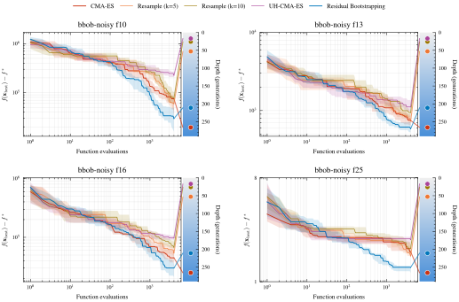
<figcaption class="ltx_caption ltx_centering">Figure 1: RB-PEM improves fixed-budget progress on COCO bbob-noisy.
Median (solid) and interquartile range (shaded) of $\log_{10}(f(\hat{x})-f^{\star})$ versus evaluations on four representative high-misranking functions (f110, f113, f116, f125; $d=40$, $B=100d$, 15 instances each).
Right-side markers indicate the number of completed CMA-ES generations (depth).
Methods that preserve depth (CMA-ES, RB-PEM) generally achieve lower final regret; among these, RB-PEM further improves by integrating ranking uncertainty at the selection stage rather than spending evaluations on per-candidate denoising.
Evaluation-stage baselines (Resample, UH-CMA-ES) sacrifice depth for per-generation fidelity, resulting in higher final regret despite cleaner intra-generation rankings.
<em class="ltx_emph ltx_font_italic">Protocol:</em> Each of the 15 COCO instances is run once per method (no repeated seeds); lines show the median and shading spans the 25th–75th percentile (IQR) across instances.</figcaption>
</figure>
</section>
<section id="S6.SS3" class="ltx_subsection">
<h3 class="ltx_title ltx_title_subsection" id="depthfidelity-trade-off">
6.3 Depth–Fidelity Trade-off</h3>

<figure id="S6.F2" class="ltx_figure">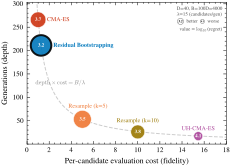
<figcaption class="ltx_caption ltx_centering">Figure 2: Depth–fidelity trade-off under a fixed budget.
Each method is plotted by its average per-candidate evaluation cost (fidelity, $x$-axis) and number of completed generations (depth, $y$-axis) on the high-misranking COCO bbob-noisy subset ($d=40$, $B=100d$, 225 problems = 15 functions $\times$ 15 instances).
Bubble annotations encode the median final $\log_{10}$ regret (smaller is better).
The grey hyperbola marks the budget constraint $\text{depth}\times\text{cost}\approx B/\lambda$: higher fidelity necessarily reduces depth.
RB-PEM achieves the lowest regret while remaining in the low-cost / high-depth region, supporting the thesis that selection-stage uncertainty integration is more sample-efficient than evaluation-stage denoising under strict budgets.
<em class="ltx_emph ltx_font_italic">Protocol:</em> Each instance is run once per method; each bubble represents one method and its annotation reports the median final regret across all 225 instances.</figcaption>
</figure>

Figure <a href="#S6.F2" title="Figure 2 ‣ 6.3 Depth–Fidelity Trade-off ‣ 6 Experiments ‣ Depth over Fidelity in Fixed-Budget Noisy Evolution Strategies" class="ltx_ref">2</a> confirms the depth–fidelity trade-off of Section <a href="#S3.SS4" title="3.4 Mainstream Noise Handling under Fixed Budgets: Fidelity over Depth ‣ 3 Preliminaries ‣ Depth over Fidelity in Fixed-Budget Noisy Evolution Strategies" class="ltx_ref">3.4</a> empirically: under a fixed budget the baselines spread along the depth–fidelity frontier, and RB-PEM occupies the low-cost/high-depth corner that minimizes regret.

</section>
<section id="S6.SS4" class="ltx_subsection">
<h3 class="ltx_title ltx_title_subsection" id="probe-and-switch-evaluation">
6.4 Probe-and-Switch Evaluation</h3>

Figure <a href="#S6.F3" title="Figure 3 ‣ 6.4 Probe-and-Switch Evaluation ‣ 6 Experiments ‣ Depth over Fidelity in Fixed-Budget Noisy Evolution Strategies" class="ltx_ref">3</a> shows RB-PEM excelling under severe ranking noise (e.g., heavy-tailed RL rollouts, noisy HPO) but slipping below vanilla CMA-ES on low-misranking tasks, where its extra smoothing and reevaluations become unnecessary overhead—motivating an adaptive policy.

<figure id="S6.F3" class="ltx_figure">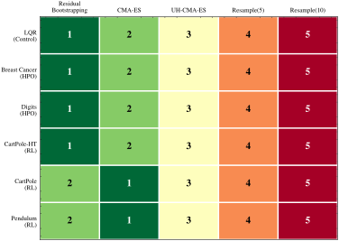
<figcaption class="ltx_caption ltx_centering">Figure 3: Task-level algorithm ranking (1 = best).
Median rank across instances for each method (columns) on each task (rows): 15 high-misranking COCO bbob-noisy functions and six external tasks ($d=40$, $B=100d$ for COCO; task-specific budgets otherwise; darker is better).
RB-PEM ranks first on most high-misranking tasks but underperforms CMA-ES on low-misranking tasks (e.g., CartPole, Pendulum), where the bootstrap overhead outweighs the smoothing benefit.
This pattern motivates probe-and-switch (Section <a href="#S5.SS5" title="5.5 Decision Theory for Probe-and-Switch ‣ 5 Theory ‣ Depth over Fidelity in Fixed-Budget Noisy Evolution Strategies" class="ltx_ref">5.5</a>).
<em class="ltx_emph ltx_font_italic">Protocol:</em> 1 run per COCO instance (15 each), 50 seeds per external task (Appendix: per-task budgets/noise); ranks use each task’s median objective.</figcaption>
</figure>

We verify that the high-misranking subset used in
Figures <a href="#S6.F1" title="Figure 1 ‣ 6.2 Main Results on COCO bbob-noisy ‣ 6 Experiments ‣ Depth over Fidelity in Fixed-Budget Noisy Evolution Strategies" class="ltx_ref">1</a>–<a href="#S6.F3" title="Figure 3 ‣ 6.4 Probe-and-Switch Evaluation ‣ 6 Experiments ‣ Depth over Fidelity in Fixed-Budget Noisy Evolution Strategies" class="ltx_ref">3</a> is not a post-hoc
selection: Figure <a href="#S6.F4" title="Figure 4 ‣ 6.4 Probe-and-Switch Evaluation ‣ 6 Experiments ‣ Depth over Fidelity in Fixed-Budget Noisy Evolution Strategies" class="ltx_ref">4</a> sorts all 30 bbob-noisy
functions by the probe statistic $P$ and reveals a sharply bimodal structure
(gap $0.145$, $\approx 3\times$ either cluster’s width) that yields the same
partition for any $\tau_{\text{cluster}}\in[0.16,0.29]$. The probe also
predicts <em class="ltx_emph ltx_font_italic">when</em> uncertainty integration helps: RB-PEM and Probe-and-Switch
lead on the high-misranking cluster but stay within roughly one rank of the
others on the low-misranking cluster.

<figure id="S6.F4" class="ltx_figure">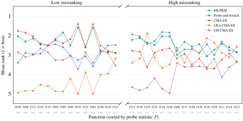
<figcaption class="ltx_caption ltx_centering">Figure 4: Per-function ranking across all 30 bbob-noisy
functions reveals a bimodal misranking structure that defines the
high-misranking subset.
Mean rank (1 = best) of five methods, sorted by the median probe statistic
$P$ (Eq. (<a href="#A4.E56" title="In Appendix D Decision-Theoretic Analysis for Probe-and-Switch ‣ Depth over Fidelity in Fixed-Budget Noisy Evolution Strategies" class="ltx_ref">56</a>)). The $P$-values are sharply bimodal:
14 <em class="ltx_emph ltx_font_italic">low-misranking</em> functions cluster in $P\in[0.00,0.15]$ (left) and
15 <em class="ltx_emph ltx_font_italic">high-misranking</em> ones in $P\in[0.30,0.35]$ (right), separated by a
gap of $0.145$ ($\approx 3\times$ either cluster’s width), so any threshold
$\tau_{\text{cluster}}\in[0.16,0.29]$ produces the same partition.
RB-PEM and Probe-and-Switch rank first or second on the
high-misranking cluster, while LRA-CMA-ES and UH-CMA-ES trail; on the
low-misranking cluster all five methods are within roughly one rank.
We exclude f107 (high $P$ from step-ellipsoidal structure, not noise);
the remaining 15 functions are the subset used in
Figures <a href="#S6.F1" title="Figure 1 ‣ 6.2 Main Results on COCO bbob-noisy ‣ 6 Experiments ‣ Depth over Fidelity in Fixed-Budget Noisy Evolution Strategies" class="ltx_ref">1</a>–<a href="#S6.F3" title="Figure 3 ‣ 6.4 Probe-and-Switch Evaluation ‣ 6 Experiments ‣ Depth over Fidelity in Fixed-Budget Noisy Evolution Strategies" class="ltx_ref">3</a> and the appendix ablations.
<em class="ltx_emph ltx_font_italic">Protocol:</em> $B{=}100d$; mean rank averaged over
$d\in\{10,20,40\}\times 15$ instances per function. Probe $P$ computed at
$d{=}40$ from 20 ES-sampled candidate sets with $(\lambda,\mu)=(32,8)$.</figcaption>
</figure>

Figure <a href="#S6.F5" title="Figure 5 ‣ 6.4 Probe-and-Switch Evaluation ‣ 6 Experiments ‣ Depth over Fidelity in Fixed-Budget Noisy Evolution Strategies" class="ltx_ref">5</a> plots the conditional advantage
$\Delta(p)=\mathbb{E}[L_{0}-L_{1}\mid P=p]$ against the probe statistic $P$.
The curve exhibits approximate <em class="ltx_emph ltx_font_italic">single crossing</em>—$\Delta(p)&lt;0$ for small $P$ (stable ranks) and $\Delta(p)&gt;0$ beyond a threshold—which
enables a probe-and-switch policy: route tasks with $P\geq\tau$ ($\tau=0.12$) to RB-PEM and
the rest to CMA-ES, yielding purely positive improvement under the model of
Section <a href="#S5.SS5" title="5.5 Decision Theory for Probe-and-Switch ‣ 5 Theory ‣ Depth over Fidelity in Fixed-Budget Noisy Evolution Strategies" class="ltx_ref">5.5</a>.

<figure id="S6.F5" class="ltx_figure">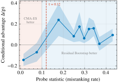
<figcaption class="ltx_caption ltx_centering">Figure 5: Conditional advantage and single crossing.
Estimated $\Delta(p)=\mathbb{E}[L_{\mathrm{CMA}}-L_{\mathrm{RB\text{-}PEM}}\mid P=p]$ vs. the probe statistic $P$ (normalized rank disagreement, Eq. (<a href="#A4.E56" title="In Appendix D Decision-Theoretic Analysis for Probe-and-Switch ‣ Depth over Fidelity in Fixed-Budget Noisy Evolution Strategies" class="ltx_ref">56</a>)) on all 30 COCO bbob-noisy functions ($d=40$, $B=500d$); positive $\Delta$ favors RB-PEM.
The curve crosses zero once near $\tau=0.12$ (dashed line), giving a threshold rule (RB-PEM when $P\geq\tau$, else CMA-ES) that is Bayes-optimal under single crossing (Proposition <a href="#Thmproposition5" title="Proposition 5. ‣ Appendix D Decision-Theoretic Analysis for Probe-and-Switch ‣ Depth over Fidelity in Fixed-Budget Noisy Evolution Strategies" class="ltx_ref">5</a>).
<em class="ltx_emph ltx_font_italic">Protocol:</em> 450 problems (30 functions $\times$ 15 instances), 1 run each; bin means over 12 quantile bins, error bars $\pm 1.96\,\mathrm{SE}$ (95% CI).</figcaption>
</figure>

Scanning thresholds on COCO identifies two robust operating points: an aggressive $\tau=0.12$ (switch more often) and a conservative $\tau=0.22$ (switch only under strong misranking evidence).
Figure <a href="#S6.F6" title="Figure 6 ‣ 6.4 Probe-and-Switch Evaluation ‣ 6 Experiments ‣ Depth over Fidelity in Fixed-Budget Noisy Evolution Strategies" class="ltx_ref">6</a> shows these COCO-calibrated thresholds transfer reasonably to external tasks, though new domains may warrant re-tuning.

<figure id="S6.F6" class="ltx_figure">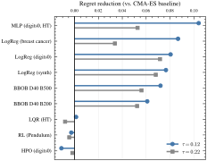
<figcaption class="ltx_caption ltx_centering">Figure 6: Threshold transfer to external tasks.
Regret reduction of Probe-and-Switch relative to CMA-ES on nine transfer targets (COCO and external), using COCO-calibrated thresholds $\tau\in\{0.12,\,0.22\}$ without per-task re-tuning.
The aggressive $\tau=0.12$ activates RB-PEM more often, yielding larger reductions on high-misranking tasks (e.g., LQR, MLP), while the conservative $\tau=0.22$ mitigates negative transfer on low-misranking ones (e.g., HPO, Pendulum).
<em class="ltx_emph ltx_font_italic">Protocol:</em> mean regret reduction per target (over instances/seeds), ordered by $\Delta(\tau{=}0.12)$; 1 run per COCO instance, 50 seeds per external task.</figcaption>
</figure>
</section>
<section id="S6.SS5" class="ltx_subsection">
<h3 class="ltx_title ltx_title_subsection" id="comprehensive-comparison">
6.5 Comprehensive Comparison</h3>

Table <a href="#S6.T1" title="Table 1 ‣ 6.5 Comprehensive Comparison ‣ 6 Experiments ‣ Depth over Fidelity in Fixed-Budget Noisy Evolution Strategies" class="ltx_ref">1</a> reports pairwise win/loss counts for probe-and-switch against each competitor across COCO and six external tasks. It wins decisively against all evaluation-stage baselines (Res.(10), Res.(5), UH-CMA-ES; all above 77%) and holds a moderate advantage over its constituent algorithms (CMA-ES, RB-PEM), indicating that the switch reliably activates the beneficial mode without unnecessary overhead. Its significance against CMA-ES strengthens with dimension, consistent with misranking becoming more problematic in higher dimensions; on external tasks it tracks RB-PEM under high rank instability and defaults to CMA-ES otherwise.

<figure id="S6.T1" class="ltx_table">
<table class="ltx_tabular ltx_centering ltx_align_middle">
<tbody class="ltx_tbody">
<tr class="ltx_tr">
<td class="ltx_td ltx_border_tt" style="padding:0.35pt 2.8pt;"></td>
<td class="ltx_td ltx_align_center ltx_border_tt" style="padding:0.35pt 2.8pt;" colspan="2">

vs
Res.(10)

</td>
<td class="ltx_td ltx_align_center ltx_border_tt" style="padding:0.35pt 2.8pt;" colspan="2">

vs
Res.(5)

</td>
<td class="ltx_td ltx_align_center ltx_border_tt" style="padding:0.35pt 2.8pt;" colspan="2">

vs
UH-CMA-ES

</td>
<td class="ltx_td ltx_align_center ltx_border_tt" style="padding:0.35pt 2.8pt;" colspan="2">

vs
CMA-ES

</td>
<td class="ltx_td ltx_align_center ltx_border_tt" style="padding:0.35pt 2.8pt;" colspan="2">

vs
RB-PEM

</td>
</tr>
<tr class="ltx_tr">
<td class="ltx_td ltx_align_left ltx_border_t" style="padding:0.35pt 2.8pt;" colspan="11">COCO benchmark (30 functions $\times$ 15 instances per dim, $B=200d$)</td>
</tr>
<tr class="ltx_tr">
<td class="ltx_td ltx_align_left" style="padding:0.35pt 2.8pt;">$d=10$</td>
<td class="ltx_td ltx_nopad_r ltx_align_right" style="padding:0.35pt 2.8pt;">
390/
</td>
<td class="ltx_td ltx_nopad_l ltx_align_left" style="padding:0.35pt 2.8pt;">60***</td>
<td class="ltx_td ltx_nopad_r ltx_align_right" style="padding:0.35pt 2.8pt;">
364/
</td>
<td class="ltx_td ltx_nopad_l ltx_align_left" style="padding:0.35pt 2.8pt;">86***</td>
<td class="ltx_td ltx_nopad_r ltx_align_right" style="padding:0.35pt 2.8pt;">
359/
</td>
<td class="ltx_td ltx_nopad_l ltx_align_left" style="padding:0.35pt 2.8pt;">91***</td>
<td class="ltx_td ltx_nopad_r ltx_align_right" style="padding:0.35pt 2.8pt;">
230/
</td>
<td class="ltx_td ltx_nopad_l ltx_align_left" style="padding:0.35pt 2.8pt;">210</td>
<td class="ltx_td ltx_nopad_r ltx_align_right" style="padding:0.35pt 2.8pt;">
281/
</td>
<td class="ltx_td ltx_nopad_l ltx_nopad_r ltx_align_left" style="padding:0.35pt 2.8pt;">169***</td>
</tr>
<tr class="ltx_tr">
<td class="ltx_td ltx_align_left" style="padding:0.35pt 2.8pt;">$d=20$</td>
<td class="ltx_td ltx_nopad_r ltx_align_right" style="padding:0.35pt 2.8pt;">
373/
</td>
<td class="ltx_td ltx_nopad_l ltx_align_left" style="padding:0.35pt 2.8pt;">77***</td>
<td class="ltx_td ltx_nopad_r ltx_align_right" style="padding:0.35pt 2.8pt;">
356/
</td>
<td class="ltx_td ltx_nopad_l ltx_align_left" style="padding:0.35pt 2.8pt;">94***</td>
<td class="ltx_td ltx_nopad_r ltx_align_right" style="padding:0.35pt 2.8pt;">
368/
</td>
<td class="ltx_td ltx_nopad_l ltx_align_left" style="padding:0.35pt 2.8pt;">82***</td>
<td class="ltx_td ltx_nopad_r ltx_align_right" style="padding:0.35pt 2.8pt;">
239/
</td>
<td class="ltx_td ltx_nopad_l ltx_align_left" style="padding:0.35pt 2.8pt;">195*</td>
<td class="ltx_td ltx_nopad_r ltx_align_right" style="padding:0.35pt 2.8pt;">
269/
</td>
<td class="ltx_td ltx_nopad_l ltx_nopad_r ltx_align_left" style="padding:0.35pt 2.8pt;">181***</td>
</tr>
<tr class="ltx_tr">
<td class="ltx_td ltx_align_left" style="padding:0.35pt 2.8pt;">$d=40$</td>
<td class="ltx_td ltx_nopad_r ltx_align_right" style="padding:0.35pt 2.8pt;">
363/
</td>
<td class="ltx_td ltx_nopad_l ltx_align_left" style="padding:0.35pt 2.8pt;">87***</td>
<td class="ltx_td ltx_nopad_r ltx_align_right" style="padding:0.35pt 2.8pt;">
347/
</td>
<td class="ltx_td ltx_nopad_l ltx_align_left" style="padding:0.35pt 2.8pt;">103***</td>
<td class="ltx_td ltx_nopad_r ltx_align_right" style="padding:0.35pt 2.8pt;">
359/
</td>
<td class="ltx_td ltx_nopad_l ltx_align_left" style="padding:0.35pt 2.8pt;">91***</td>
<td class="ltx_td ltx_nopad_r ltx_align_right" style="padding:0.35pt 2.8pt;">
257/
</td>
<td class="ltx_td ltx_nopad_l ltx_align_left" style="padding:0.35pt 2.8pt;">170**</td>
<td class="ltx_td ltx_nopad_r ltx_align_right" style="padding:0.35pt 2.8pt;">
270/
</td>
<td class="ltx_td ltx_nopad_l ltx_nopad_r ltx_align_left" style="padding:0.35pt 2.8pt;">180***</td>
</tr>
<tr class="ltx_tr">
<td class="ltx_td ltx_align_left ltx_border_t" style="padding:0.35pt 2.8pt;" colspan="11">External tasks (50 seeds each)</td>
</tr>
<tr class="ltx_tr">
<td class="ltx_td ltx_align_left" style="padding:0.35pt 2.8pt;">LQR</td>
<td class="ltx_td ltx_nopad_r ltx_align_right" style="padding:0.35pt 2.8pt;">
50/
</td>
<td class="ltx_td ltx_nopad_l ltx_align_left" style="padding:0.35pt 2.8pt;">0***</td>
<td class="ltx_td ltx_nopad_r ltx_align_right" style="padding:0.35pt 2.8pt;">
46/
</td>
<td class="ltx_td ltx_nopad_l ltx_align_left" style="padding:0.35pt 2.8pt;">4***</td>
<td class="ltx_td ltx_nopad_r ltx_align_right" style="padding:0.35pt 2.8pt;">
46/
</td>
<td class="ltx_td ltx_nopad_l ltx_align_left" style="padding:0.35pt 2.8pt;">4***</td>
<td class="ltx_td ltx_nopad_r ltx_align_right" style="padding:0.35pt 2.8pt;">
31/
</td>
<td class="ltx_td ltx_nopad_l ltx_align_left" style="padding:0.35pt 2.8pt;">19</td>
<td class="ltx_td ltx_nopad_r ltx_align_right" style="padding:0.35pt 2.8pt;">23/</td>
<td class="ltx_td ltx_nopad_l ltx_nopad_r ltx_align_left" style="padding:0.35pt 2.8pt;">27</td>
</tr>
<tr class="ltx_tr">
<td class="ltx_td ltx_align_left" style="padding:0.35pt 2.8pt;">Breast Cancer</td>
<td class="ltx_td ltx_nopad_r ltx_align_right" style="padding:0.35pt 2.8pt;">
50/
</td>
<td class="ltx_td ltx_nopad_l ltx_align_left" style="padding:0.35pt 2.8pt;">0***</td>
<td class="ltx_td ltx_nopad_r ltx_align_right" style="padding:0.35pt 2.8pt;">
37/
</td>
<td class="ltx_td ltx_nopad_l ltx_align_left" style="padding:0.35pt 2.8pt;">13***</td>
<td class="ltx_td ltx_nopad_r ltx_align_right" style="padding:0.35pt 2.8pt;">25/</td>
<td class="ltx_td ltx_nopad_l ltx_align_left" style="padding:0.35pt 2.8pt;">25</td>
<td class="ltx_td ltx_nopad_r ltx_align_right" style="padding:0.35pt 2.8pt;">20/</td>
<td class="ltx_td ltx_nopad_l ltx_align_left" style="padding:0.35pt 2.8pt;">29</td>
<td class="ltx_td ltx_nopad_r ltx_align_right" style="padding:0.35pt 2.8pt;">22/</td>
<td class="ltx_td ltx_nopad_l ltx_nopad_r ltx_align_left" style="padding:0.35pt 2.8pt;">28</td>
</tr>
<tr class="ltx_tr">
<td class="ltx_td ltx_align_left" style="padding:0.35pt 2.8pt;">Digits</td>
<td class="ltx_td ltx_nopad_r ltx_align_right" style="padding:0.35pt 2.8pt;">
49/
</td>
<td class="ltx_td ltx_nopad_l ltx_align_left" style="padding:0.35pt 2.8pt;">1***</td>
<td class="ltx_td ltx_nopad_r ltx_align_right" style="padding:0.35pt 2.8pt;">
40/
</td>
<td class="ltx_td ltx_nopad_l ltx_align_left" style="padding:0.35pt 2.8pt;">10***</td>
<td class="ltx_td ltx_nopad_r ltx_align_right" style="padding:0.35pt 2.8pt;">
31/
</td>
<td class="ltx_td ltx_nopad_l ltx_align_left" style="padding:0.35pt 2.8pt;">19</td>
<td class="ltx_td ltx_nopad_r ltx_align_right" style="padding:0.35pt 2.8pt;">17/</td>
<td class="ltx_td ltx_nopad_l ltx_align_left" style="padding:0.35pt 2.8pt;">
33*
</td>
<td class="ltx_td ltx_nopad_r ltx_align_right" style="padding:0.35pt 2.8pt;">17/</td>
<td class="ltx_td ltx_nopad_l ltx_nopad_r ltx_align_left" style="padding:0.35pt 2.8pt;">
33*
</td>
</tr>
<tr class="ltx_tr">
<td class="ltx_td ltx_align_left" style="padding:0.35pt 2.8pt;">CartPole-HT</td>
<td class="ltx_td ltx_nopad_r ltx_align_right" style="padding:0.35pt 2.8pt;">
48/
</td>
<td class="ltx_td ltx_nopad_l ltx_align_left" style="padding:0.35pt 2.8pt;">2***</td>
<td class="ltx_td ltx_nopad_r ltx_align_right" style="padding:0.35pt 2.8pt;">
43/
</td>
<td class="ltx_td ltx_nopad_l ltx_align_left" style="padding:0.35pt 2.8pt;">6***</td>
<td class="ltx_td ltx_nopad_r ltx_align_right" style="padding:0.35pt 2.8pt;">
30/
</td>
<td class="ltx_td ltx_nopad_l ltx_align_left" style="padding:0.35pt 2.8pt;">19</td>
<td class="ltx_td ltx_nopad_r ltx_align_right" style="padding:0.35pt 2.8pt;">21/</td>
<td class="ltx_td ltx_nopad_l ltx_align_left" style="padding:0.35pt 2.8pt;">23</td>
<td class="ltx_td ltx_nopad_r ltx_align_right" style="padding:0.35pt 2.8pt;">20/</td>
<td class="ltx_td ltx_nopad_l ltx_nopad_r ltx_align_left" style="padding:0.35pt 2.8pt;">24</td>
</tr>
<tr class="ltx_tr">
<td class="ltx_td ltx_align_left" style="padding:0.35pt 2.8pt;">CartPole</td>
<td class="ltx_td ltx_nopad_r ltx_align_right" style="padding:0.35pt 2.8pt;">
44/
</td>
<td class="ltx_td ltx_nopad_l ltx_align_left" style="padding:0.35pt 2.8pt;">6***</td>
<td class="ltx_td ltx_nopad_r ltx_align_right" style="padding:0.35pt 2.8pt;">
36/
</td>
<td class="ltx_td ltx_nopad_l ltx_align_left" style="padding:0.35pt 2.8pt;">14**</td>
<td class="ltx_td ltx_nopad_r ltx_align_right" style="padding:0.35pt 2.8pt;">
26/
</td>
<td class="ltx_td ltx_nopad_l ltx_align_left" style="padding:0.35pt 2.8pt;">24</td>
<td class="ltx_td ltx_nopad_r ltx_align_right" style="padding:0.35pt 2.8pt;">19/</td>
<td class="ltx_td ltx_nopad_l ltx_align_left" style="padding:0.35pt 2.8pt;">30</td>
<td class="ltx_td ltx_nopad_r ltx_align_right" style="padding:0.35pt 2.8pt;">21/</td>
<td class="ltx_td ltx_nopad_l ltx_nopad_r ltx_align_left" style="padding:0.35pt 2.8pt;">27</td>
</tr>
<tr class="ltx_tr">
<td class="ltx_td ltx_align_left" style="padding:0.35pt 2.8pt;">Pendulum</td>
<td class="ltx_td ltx_nopad_r ltx_align_right" style="padding:0.35pt 2.8pt;">
46/
</td>
<td class="ltx_td ltx_nopad_l ltx_align_left" style="padding:0.35pt 2.8pt;">4***</td>
<td class="ltx_td ltx_nopad_r ltx_align_right" style="padding:0.35pt 2.8pt;">
38/
</td>
<td class="ltx_td ltx_nopad_l ltx_align_left" style="padding:0.35pt 2.8pt;">11***</td>
<td class="ltx_td ltx_nopad_r ltx_align_right" style="padding:0.35pt 2.8pt;">
32/
</td>
<td class="ltx_td ltx_nopad_l ltx_align_left" style="padding:0.35pt 2.8pt;">18</td>
<td class="ltx_td ltx_nopad_r ltx_align_right" style="padding:0.35pt 2.8pt;">
31/
</td>
<td class="ltx_td ltx_nopad_l ltx_align_left" style="padding:0.35pt 2.8pt;">19</td>
<td class="ltx_td ltx_nopad_r ltx_align_right" style="padding:0.35pt 2.8pt;">
31/
</td>
<td class="ltx_td ltx_nopad_l ltx_nopad_r ltx_align_left" style="padding:0.35pt 2.8pt;">19</td>
</tr>
<tr class="ltx_tr">
<td class="ltx_td ltx_align_left ltx_border_t" style="padding:0.35pt 2.8pt;">Total W/L</td>
<td class="ltx_td ltx_nopad_r ltx_align_right ltx_border_t" style="padding:0.35pt 2.8pt;">
1413/
</td>
<td class="ltx_td ltx_nopad_l ltx_align_left ltx_border_t" style="padding:0.35pt 2.8pt;">237</td>
<td class="ltx_td ltx_nopad_r ltx_align_right ltx_border_t" style="padding:0.35pt 2.8pt;">
1307/
</td>
<td class="ltx_td ltx_nopad_l ltx_align_left ltx_border_t" style="padding:0.35pt 2.8pt;">341</td>
<td class="ltx_td ltx_nopad_r ltx_align_right ltx_border_t" style="padding:0.35pt 2.8pt;">
1276/
</td>
<td class="ltx_td ltx_nopad_l ltx_align_left ltx_border_t" style="padding:0.35pt 2.8pt;">373</td>
<td class="ltx_td ltx_nopad_r ltx_align_right ltx_border_t" style="padding:0.35pt 2.8pt;">
865/
</td>
<td class="ltx_td ltx_nopad_l ltx_align_left ltx_border_t" style="padding:0.35pt 2.8pt;">728</td>
<td class="ltx_td ltx_nopad_r ltx_align_right ltx_border_t" style="padding:0.35pt 2.8pt;">
954/
</td>
<td class="ltx_td ltx_nopad_l ltx_nopad_r ltx_align_left ltx_border_t" style="padding:0.35pt 2.8pt;">688</td>
</tr>
<tr class="ltx_tr">
<td class="ltx_td ltx_align_left ltx_border_bb" style="padding:0.35pt 2.8pt;">Win Rate</td>
<td class="ltx_td ltx_align_center ltx_border_bb" style="padding:0.35pt 2.8pt;" colspan="2">85.6%</td>
<td class="ltx_td ltx_align_center ltx_border_bb" style="padding:0.35pt 2.8pt;" colspan="2">79.3%</td>
<td class="ltx_td ltx_align_center ltx_border_bb" style="padding:0.35pt 2.8pt;" colspan="2">77.4%</td>
<td class="ltx_td ltx_align_center ltx_border_bb" style="padding:0.35pt 2.8pt;" colspan="2">54.3%</td>
<td class="ltx_td ltx_align_center ltx_border_bb" style="padding:0.35pt 2.8pt;" colspan="2">58.1%</td>
</tr>
</tbody>
</table>
<figcaption class="ltx_caption ltx_centering" style="font-size:70%;">Table 1: Probe-and-Switch vs. competitors: pairwise win/loss (W/L) counts on COCO bbob-noisy (30 functions $\times$ 15 instances per dim, $B=200d$, $d\in\{10,20,40\}$) and six external tasks (50 seeds each).
Bold indicates Probe-and-Switch wins ($W&gt;L$).
Stars denote two-sided Wilcoxon signed-rank significance: ***$p{&lt;}0.001$, **$p{&lt;}0.01$, *$p{&lt;}0.05$.
Res.($k$): $k$-fold fixed resampling; RB-PEM: residual-bootstrap PEM without probe-and-switch.
<em class="ltx_emph ltx_font_italic">Protocol:</em> Probe-and-Switch uses threshold $\tau{=}0.12$; each COCO instance is run once per method and each external task with 50 independent seeds.</figcaption>
</figure>

Appendix <a href="#A6" title="Appendix F Additional Experiments ‣ Depth over Fidelity in Fixed-Budget Noisy Evolution Strategies" class="ltx_ref">F</a> provides controlled mechanism checks:
(i) tests linking higher misranking to larger update dispersion and objective loss, and
(ii) ablations confirming RB-PEM’s persistent gain under tightly capped reevaluation, supporting the “selection-stage integration” interpretation.

</section>
</section>
<section id="S7" class="ltx_section">
<h2 class="ltx_title ltx_title_section" id="conclusion">
7 Conclusion</h2>

In strictly fixed-budget noisy black-box optimization, the cost of improving intra-generation ranking fidelity is paid
in reduced <em class="ltx_emph ltx_font_italic">depth</em>: every additional evaluation spent on denoising or resampling shortens the number of
distribution updates that can be executed before the budget is exhausted.
By making this accounting explicit, we formalized a depth–fidelity trade-off for noisy rank-based evolution
strategies and argued that, in high-misranking regimes, the lost depth can dominate the gains from per-generation
fidelity.

We operationalized <em class="ltx_emph ltx_font_italic">selection-stage uncertainty integration</em> as
<em class="ltx_emph ltx_font_italic">probabilistic elite membership</em> (PEM)—a Rao–Blackwellization of the
noisy rank-based update that replaces hard rank assignments with expected
rank weights, preserving the mean update while reducing its dispersion.
We approximated PEM at near-unit cost via <em class="ltx_emph ltx_font_italic">residual-bootstrapped PEM</em>
(RB-PEM), which calibrates a local noise model from a small capped reevaluation
set, amortized across generations via pooled residuals and backed by a
falsifiable mismatch decomposition and runtime diagnostics; a low-cost
<em class="ltx_emph ltx_font_italic">probe-and-switch</em> policy reverts to vanilla CMA-ES when ranks are stable.

Our theory clarifies why depth-preserving uncertainty integration can win: under local curvature, conditional update
dispersion induces an unavoidable expected objective penalty, making <em class="ltx_emph ltx_font_italic">dispersion reduction per oracle call</em> the
relevant efficiency metric in fixed-budget regimes.
Empirically, RB-PEM achieves consistently steeper fixed-budget progress on the COCO bbob-noisy suite and diverse
external tasks, outperforming evaluation-stage denoising baselines whose higher per-generation costs collapse depth,
while probe-and-switch improves robustness across regimes.

Overall, the results support a testable thesis:
<em class="ltx_emph ltx_font_italic">when budgets are strict and ranking uncertainty is high, integrating uncertainty into selection is more
sample-efficient than spending evaluations to eliminate it</em>.
Promising directions include extending the residual model to correlated and nonstationary noise, and porting depth-over-fidelity to other population-based optimizers.

</section>
<section id="Sx1" class="ltx_section">
<h2 class="ltx_title ltx_title_section" id="impact-statement">Impact Statement</h2>

RB-PEM enables noisy black-box optimizers to extract more progress from a fixed number of evaluations, which directly reduces the computational cost of tasks such as RL policy search with stochastic rollouts and hyperparameter optimization with noisy validation. As a general-purpose algorithmic improvement, it inherits the dual-use profile common to all black-box optimizers; we are not aware of any application-specific risks particular to our method.

</section>
<section id="Sx2" class="ltx_section">
<h2 class="ltx_title ltx_title_section" id="acknowledgments">Acknowledgments</h2>

The first author would like to thank his parents for their unwavering support and encouragement; his algorithm competition coaches Wenwu Wang and Yuan Sun, who sparked his interest in computer science; his ICPC teammates Zhang Chen, An Yan, and Yuqi Peng, and the many fellow competitors who accompanied him through eight years of algorithmic contests; Prof. Xiaoying Tang and the members of T-Lab at CUHK-Shenzhen, who patiently guided a newcomer into academic research; and Siyuan Xu, whose support and companionship sustained him throughout.

This work is supported by Guangdong Province (No. 2023QN10X215), 2023 Shenzhen National Science Foundation (No. 20231128220938001), Shenzhen Science and Technology Program (No. JCYJ20241202130548062), the Natural Science Foundation of Shenzhen (No. JCYJ20230807142703006), and the Key Research Platforms and Projects of the Guangdong Provincial Department of Education (No.2023ZDZX1034).

</section>
<section id="bib" class="ltx_bibliography">
<h2 class="ltx_title ltx_title_bibliography" id="references">References</h2>

<ul id="bib.L1" class="ltx_biblist">
<li id="bib.bib52" class="ltx_bibitem ltx_bib_inproceedings">
S. Ament, S. Daulton, D. Eriksson, M. Balandat, and E. Bakshy (2023)
Unexpected improvements to expected improvement for bayesian optimization.

In Advances in Neural Information Processing Systems,

Vol. 36,  pp. 20577–20612.

Cited by: <a href="#S2.p1" title="2 Related Work ‣ Depth over Fidelity in Fixed-Budget Noisy Evolution Strategies" class="ltx_ref">§2</a>.

</li>
<li id="bib.bib61" class="ltx_bibitem ltx_bib_article">
K. Azuma (1967)
Weighted sums of certain dependent random variables.

Tohoku Mathematical Journal, Second Series 19 (3),  pp. 357–367.

External Links: <a href="https://dx.doi.org/10.2748/tmj/1178243286" title="" class="ltx_ref doi ltx_bib_external">Document</a>,
<a href="https://doi.org/10.2748/tmj/1178243286" title="" class="ltx_ref ltx_bib_external">Link</a>

Cited by: <a href="#A3.SS3.p1" title="C.3 Adaptive Residual Pool Concentration ‣ Appendix C Residual Pool Theory and Diagnostics ‣ Depth over Fidelity in Fixed-Budget Noisy Evolution Strategies" class="ltx_ref">§C.3</a>.

</li>
<li id="bib.bib50" class="ltx_bibitem ltx_bib_article">
L. Bajer, Z. Pitra, J. Repický, and M. Holeňa (2019)
Gaussian process surrogate models for the CMA evolution strategy.

Evolutionary Computation 27 (4),  pp. 665–697.

External Links: <a href="https://dx.doi.org/10.1162/evco%5Fa%5F00244" title="" class="ltx_ref doi ltx_bib_external">Document</a>

Cited by: <a href="#S2.p1" title="2 Related Work ‣ Depth over Fidelity in Fixed-Budget Noisy Evolution Strategies" class="ltx_ref">§2</a>.

</li>
<li id="bib.bib51" class="ltx_bibitem ltx_bib_inproceedings">
M. Balandat, B. Karrer, D. R. Jiang, S. Daulton, B. Letham, A. G. Wilson, and E. Bakshy (2020)
BoTorch: a framework for efficient monte-carlo bayesian optimization.

In Advances in Neural Information Processing Systems,

Vol. 33.

Cited by: <a href="#S2.p1" title="2 Related Work ‣ Depth over Fidelity in Fixed-Budget Noisy Evolution Strategies" class="ltx_ref">§2</a>.

</li>
<li id="bib.bib31" class="ltx_bibitem ltx_bib_inproceedings">
H. Beyer and B. Sendhoff (2007)
Evolutionary algorithms in the presence of noise: to sample or not to sample.

In Proceedings of the IEEE Symposium on Foundations of Computational Intelligence (FOCI) 2007,

 pp. 17–24.

External Links: <a href="https://dx.doi.org/10.1109/FOCI.2007.372142" title="" class="ltx_ref doi ltx_bib_external">Document</a>,
<a href="https://doi.org/10.1109/FOCI.2007.372142" title="" class="ltx_ref ltx_bib_external">Link</a>

Cited by: <a href="#S1.p3" title="1 Introduction ‣ Depth over Fidelity in Fixed-Budget Noisy Evolution Strategies" class="ltx_ref">§1</a>,
<a href="#S2.p1" title="2 Related Work ‣ Depth over Fidelity in Fixed-Budget Noisy Evolution Strategies" class="ltx_ref">§2</a>.

</li>
<li id="bib.bib15" class="ltx_bibitem ltx_bib_inproceedings">
M. Birattari, T. Stützle, L. Paquete, and K. Varrentrapp (2002)
A racing algorithm for configuring metaheuristics.

In Genetic and Evolutionary Computation Conference (GECCO 2002),

 pp. 11–18.

Cited by: <a href="#S1.p3" title="1 Introduction ‣ Depth over Fidelity in Fixed-Budget Noisy Evolution Strategies" class="ltx_ref">§1</a>,
<a href="#S2.p1" title="2 Related Work ‣ Depth over Fidelity in Fixed-Budget Noisy Evolution Strategies" class="ltx_ref">§2</a>.

</li>
<li id="bib.bib20" class="ltx_bibitem ltx_bib_book">
S. Boucheron, G. Lugosi, and P. Massart (2013)
Concentration inequalities: a nonasymptotic theory of independence.

 Oxford University Press.

Cited by: <a href="#A3.SS3.p1" title="C.3 Adaptive Residual Pool Concentration ‣ Appendix C Residual Pool Theory and Diagnostics ‣ Depth over Fidelity in Fixed-Budget Noisy Evolution Strategies" class="ltx_ref">§C.3</a>.

</li>
<li id="bib.bib55" class="ltx_bibitem ltx_bib_article">
J. Branke, S. E. Chick, and C. Schmidt (2007)
Selecting a selection procedure.

Management Science 53 (12),  pp. 1916–1932.

External Links: <a href="https://dx.doi.org/10.1287/mnsc.1070.0721" title="" class="ltx_ref doi ltx_bib_external">Document</a>

Cited by: <a href="#S2.p2" title="2 Related Work ‣ Depth over Fidelity in Fixed-Budget Noisy Evolution Strategies" class="ltx_ref">§2</a>.

</li>
<li id="bib.bib60" class="ltx_bibitem ltx_bib_inproceedings">
J. Branke and C. Schmidt (2004)
Sequential sampling in noisy environments.

In Parallel Problem Solving from Nature - PPSN VIII (PPSN 2004),

Lecture Notes in Computer Science, Vol. 3242,  pp. 202–211.

External Links: <a href="https://dx.doi.org/10.1007/978-3-540-30217-9%5F21" title="" class="ltx_ref doi ltx_bib_external">Document</a>,
<a href="https://doi.org/10.1007/978-3-540-30217-9_21" title="" class="ltx_ref ltx_bib_external">Link</a>

Cited by: <a href="#S2.p1" title="2 Related Work ‣ Depth over Fidelity in Fixed-Budget Noisy Evolution Strategies" class="ltx_ref">§2</a>.

</li>
<li id="bib.bib64" class="ltx_bibitem ltx_bib_book">
G. Casella and R. L. Berger (2002)
Statistical inference.

2nd edition,  Duxbury.

External Links: ISBN 9780534243128

Cited by: <a href="#A5.p2" title="Appendix E Additional Theory Details ‣ Depth over Fidelity in Fixed-Budget Noisy Evolution Strategies" class="ltx_ref">Appendix E</a>,
<a href="#S5.p1" title="5 Theory ‣ Depth over Fidelity in Fixed-Budget Noisy Evolution Strategies" class="ltx_ref">§5</a>.

</li>
<li id="bib.bib24" class="ltx_bibitem ltx_bib_article">
P. Diaconis and R. L. Graham (1977)
Spearman’s footrule as a measure of disarray.

Journal of the Royal Statistical Society, Series B (Statistical Methodology) 39 (2),  pp. 262–268.

Cited by: <a href="#A4.p4" title="Appendix D Decision-Theoretic Analysis for Probe-and-Switch ‣ Depth over Fidelity in Fixed-Budget Noisy Evolution Strategies" class="ltx_ref">Appendix D</a>.

</li>
<li id="bib.bib18" class="ltx_bibitem ltx_bib_book">
B. Efron and R. J. Tibshirani (1993)
An introduction to the bootstrap.

 Chapman and Hall/CRC.

Cited by: <a href="#S1.p6" title="1 Introduction ‣ Depth over Fidelity in Fixed-Budget Noisy Evolution Strategies" class="ltx_ref">§1</a>.

</li>
<li id="bib.bib56" class="ltx_bibitem ltx_bib_article">
P. I. Frazier (2014)
A fully sequential elimination procedure for indifference-zone ranking and selection with tight bounds on probability of correct selection.

Operations Research 62 (4),  pp. 926–942.

External Links: <a href="https://dx.doi.org/10.1287/opre.2014.1282" title="" class="ltx_ref doi ltx_bib_external">Document</a>

Cited by: <a href="#S2.p2" title="2 Related Work ‣ Depth over Fidelity in Fixed-Budget Noisy Evolution Strategies" class="ltx_ref">§2</a>.

</li>
<li id="bib.bib53" class="ltx_bibitem ltx_bib_article">
P. I. Frazier (2018)
A tutorial on bayesian optimization.

arXiv preprint arXiv:1807.02811.

External Links: 1807.02811

Cited by: <a href="#S2.p1" title="2 Related Work ‣ Depth over Fidelity in Fixed-Budget Noisy Evolution Strategies" class="ltx_ref">§2</a>.

</li>
<li id="bib.bib33" class="ltx_bibitem ltx_bib_inproceedings">
M. J. Groves and J. Branke (2018)
Sequential sampling for noisy optimisation with CMA-ES.

In Proceedings of the Genetic and Evolutionary Computation Conference (GECCO) 2018,

 pp. 1023–1030.

External Links: <a href="https://dx.doi.org/10.1145/3205455.3205559" title="" class="ltx_ref doi ltx_bib_external">Document</a>,
<a href="https://doi.org/10.1145/3205455.3205559" title="" class="ltx_ref ltx_bib_external">Link</a>

Cited by: <a href="#S1.p3" title="1 Introduction ‣ Depth over Fidelity in Fixed-Budget Noisy Evolution Strategies" class="ltx_ref">§1</a>,
<a href="#S2.p1" title="2 Related Work ‣ Depth over Fidelity in Fixed-Budget Noisy Evolution Strategies" class="ltx_ref">§2</a>.

</li>
<li id="bib.bib2" class="ltx_bibitem ltx_bib_article">
N. Hansen, A. S. P. Niederberger, L. Guzzella, and P. Koumoutsakos (2009)
A method for handling uncertainty in evolutionary optimization with an application to feedback control of combustion.

IEEE Transactions on Evolutionary Computation 13 (1),  pp. 180–197.

Cited by: <a href="#S1.p3" title="1 Introduction ‣ Depth over Fidelity in Fixed-Budget Noisy Evolution Strategies" class="ltx_ref">§1</a>,
<a href="#S2.p1" title="2 Related Work ‣ Depth over Fidelity in Fixed-Budget Noisy Evolution Strategies" class="ltx_ref">§2</a>.

</li>
<li id="bib.bib1" class="ltx_bibitem ltx_bib_article">
N. Hansen and A. Ostermeier (2001)
Completely derandomized self-adaptation in evolution strategies.

Evolutionary Computation 9 (2),  pp. 159–195.

Cited by: <a href="#A1.p2" title="Appendix A CMA-ES Specification ‣ Depth over Fidelity in Fixed-Budget Noisy Evolution Strategies" class="ltx_ref">Appendix A</a>,
<a href="#S1.p2" title="1 Introduction ‣ Depth over Fidelity in Fixed-Budget Noisy Evolution Strategies" class="ltx_ref">§1</a>.

</li>
<li id="bib.bib62" class="ltx_bibitem ltx_bib_article">
W. Hoeffding (1963)
Probability inequalities for sums of bounded random variables.

Journal of the American Statistical Association 58 (301),  pp. 13–30.

External Links: <a href="https://dx.doi.org/10.1080/01621459.1963.10500830" title="" class="ltx_ref doi ltx_bib_external">Document</a>,
<a href="https://doi.org/10.1080/01621459.1963.10500830" title="" class="ltx_ref ltx_bib_external">Link</a>

Cited by: <a href="#A3.SS3.p1" title="C.3 Adaptive Residual Pool Concentration ‣ Appendix C Residual Pool Theory and Diagnostics ‣ Depth over Fidelity in Fixed-Budget Noisy Evolution Strategies" class="ltx_ref">§C.3</a>.

</li>
<li id="bib.bib57" class="ltx_bibitem ltx_bib_article">
L. J. Hong, W. Fan, and J. Luo (2021)
Review on ranking and selection: a new perspective.

Frontiers of Engineering Management 8,  pp. 321–343.

External Links: <a href="https://dx.doi.org/10.1007/s42524-021-0152-6" title="" class="ltx_ref doi ltx_bib_external">Document</a>

Cited by: <a href="#S2.p2" title="2 Related Work ‣ Depth over Fidelity in Fixed-Budget Noisy Evolution Strategies" class="ltx_ref">§2</a>.

</li>
<li id="bib.bib58" class="ltx_bibitem ltx_bib_article">
L. J. Hong, G. Jiang, and Y. Zhong (2022)
Solving large-scale fixed-budget ranking and selection problems.

INFORMS Journal on Computing 34 (6),  pp. 2930–2949.

External Links: <a href="https://dx.doi.org/10.1287/ijoc.2022.1221" title="" class="ltx_ref doi ltx_bib_external">Document</a>

Cited by: <a href="#S2.p2" title="2 Related Work ‣ Depth over Fidelity in Fixed-Budget Noisy Evolution Strategies" class="ltx_ref">§2</a>.

</li>
<li id="bib.bib4" class="ltx_bibitem ltx_bib_article">
Y. Jin and J. Branke (2005)
Evolutionary optimization in uncertain environments – a survey.

IEEE Transactions on Evolutionary Computation 9 (3),  pp. 303–317.

External Links: <a href="https://dx.doi.org/10.1109/TEVC.2005.846356" title="" class="ltx_ref doi ltx_bib_external">Document</a>,
<a href="https://doi.org/10.1109/TEVC.2005.846356" title="" class="ltx_ref ltx_bib_external">Link</a>

Cited by: <a href="#S1.p3" title="1 Introduction ‣ Depth over Fidelity in Fixed-Budget Noisy Evolution Strategies" class="ltx_ref">§1</a>.

</li>
<li id="bib.bib54" class="ltx_bibitem ltx_bib_inproceedings">
S. Kim and B. L. Nelson (2007)
Recent advances in ranking and selection.

In Proceedings of the Winter Simulation Conference,

 pp. 162–172.

External Links: <a href="https://dx.doi.org/10.1109/WSC.2007.4419598" title="" class="ltx_ref doi ltx_bib_external">Document</a>

Cited by: <a href="#S2.p2" title="2 Related Work ‣ Depth over Fidelity in Fixed-Budget Noisy Evolution Strategies" class="ltx_ref">§2</a>.

</li>
<li id="bib.bib49" class="ltx_bibitem ltx_bib_inproceedings">
O. Krause (2022)
Recombination weight based selection in the DTS-CMA-ES.

In Parallel Problem Solving from Nature – PPSN XVII,

Lecture Notes in Computer Science,  pp. 295–308.

External Links: <a href="https://dx.doi.org/10.1007/978-3-031-14721-0%5F21" title="" class="ltx_ref doi ltx_bib_external">Document</a>

Cited by: <a href="#S2.p1" title="2 Related Work ‣ Depth over Fidelity in Fixed-Budget Noisy Evolution Strategies" class="ltx_ref">§2</a>.

</li>
<li id="bib.bib65" class="ltx_bibitem ltx_bib_book">
E. L. Lehmann and G. Casella (1998)
Theory of point estimation.

2 edition,  Springer.

External Links: ISBN 9780387985022

Cited by: <a href="#A5.p2" title="Appendix E Additional Theory Details ‣ Depth over Fidelity in Fixed-Budget Noisy Evolution Strategies" class="ltx_ref">Appendix E</a>,
<a href="#S5.p1" title="5 Theory ‣ Depth over Fidelity in Fixed-Budget Noisy Evolution Strategies" class="ltx_ref">§5</a>.

</li>
<li id="bib.bib47" class="ltx_bibitem ltx_bib_inproceedings">
K. Nishida and Y. Akimoto (2018)
PSA-CMA-ES: CMA-ES with population size adaptation.

In Proceedings of the Genetic and Evolutionary Computation Conference,

GECCO ’18,  pp. 865–872.

External Links: <a href="https://dx.doi.org/10.1145/3205455.3205467" title="" class="ltx_ref doi ltx_bib_external">Document</a>

Cited by: <a href="#S2.p1" title="2 Related Work ‣ Depth over Fidelity in Fixed-Budget Noisy Evolution Strategies" class="ltx_ref">§2</a>.

</li>
<li id="bib.bib48" class="ltx_bibitem ltx_bib_article">
M. Nomura, Y. Akimoto, and I. Ono (2025)
CMA-ES with learning rate adaptation.

ACM Transactions on Evolutionary Learning and Optimization 5 (1),  pp. 1–28.

External Links: <a href="https://dx.doi.org/10.1145/3698203" title="" class="ltx_ref doi ltx_bib_external">Document</a>

Cited by: <a href="#S2.p1" title="2 Related Work ‣ Depth over Fidelity in Fixed-Budget Noisy Evolution Strategies" class="ltx_ref">§2</a>.

</li>
<li id="bib.bib59" class="ltx_bibitem ltx_bib_inproceedings">
M. Pearce and J. Branke (2017)
Efficient expected improvement estimation for continuous multiple ranking and selection.

In Proceedings of the Winter Simulation Conference,

 pp. 2161–2172.

Cited by: <a href="#S2.p2" title="2 Related Work ‣ Depth over Fidelity in Fixed-Budget Noisy Evolution Strategies" class="ltx_ref">§2</a>.

</li>
<li id="bib.bib5" class="ltx_bibitem ltx_bib_article">
P. Rakshit, A. Konar, and S. Das (2017)
Noisy evolutionary optimization algorithms - a comprehensive survey.

Swarm and Evolutionary Computation 33,  pp. 18–45.

External Links: <a href="https://dx.doi.org/10.1016/J.SWEVO.2016.09.002" title="" class="ltx_ref doi ltx_bib_external">Document</a>,
<a href="https://doi.org/10.1016/J.SWEVO.2016.09.002" title="" class="ltx_ref ltx_bib_external">Link</a>

Cited by: <a href="#S1.p3" title="1 Introduction ‣ Depth over Fidelity in Fixed-Budget Noisy Evolution Strategies" class="ltx_ref">§1</a>.

</li>
<li id="bib.bib46" class="ltx_bibitem ltx_bib_inproceedings">
K. Uchida, K. Nishihara, and S. Shirakawa (2024)
CMA-ES with adaptive reevaluation for multiplicative noise.

In Proceedings of the Genetic and Evolutionary Computation Conference,

GECCO ’24,  pp. 731–739.

External Links: <a href="https://dx.doi.org/10.1145/3638529.3654182" title="" class="ltx_ref doi ltx_bib_external">Document</a>

Cited by: <a href="#S2.p1" title="2 Related Work ‣ Depth over Fidelity in Fixed-Budget Noisy Evolution Strategies" class="ltx_ref">§2</a>.

</li>
<li id="bib.bib21" class="ltx_bibitem ltx_bib_book">
A. W. van der Vaart and J. A. Wellner (1996)
Weak convergence and empirical processes: with applications to statistics.

 Springer.

Cited by: <a href="#A3.SS3.p1" title="C.3 Adaptive Residual Pool Concentration ‣ Appendix C Residual Pool Theory and Diagnostics ‣ Depth over Fidelity in Fixed-Budget Noisy Evolution Strategies" class="ltx_ref">§C.3</a>.

</li>
<li id="bib.bib19" class="ltx_bibitem ltx_bib_book">
C. Villani (2008)
Optimal transport: old and new.

Grundlehren der mathematischen Wissenschaften, Vol. 338,  Springer.

Cited by: <a href="#A3.SS2.SSS0.Px2.p3" title="Weight-aware targeted reevaluation. ‣ C.2 From Distribution Mismatch to PEM ‣ Appendix C Residual Pool Theory and Diagnostics ‣ Depth over Fidelity in Fixed-Budget Noisy Evolution Strategies" class="ltx_ref">§C.2</a>,
<a href="#A3.SS3.p1" title="C.3 Adaptive Residual Pool Concentration ‣ Appendix C Residual Pool Theory and Diagnostics ‣ Depth over Fidelity in Fixed-Budget Noisy Evolution Strategies" class="ltx_ref">§C.3</a>.

</li>
<li id="bib.bib63" class="ltx_bibitem ltx_bib_book">
D. Williams (1991)
Probability with martingales.

 Cambridge University Press.

External Links: ISBN 9780521406055

Cited by: <a href="#A3.SS1.p2" title="C.1 Fixed-Budget Condition (“Money Plot” Prediction) ‣ Appendix C Residual Pool Theory and Diagnostics ‣ Depth over Fidelity in Fixed-Budget Noisy Evolution Strategies" class="ltx_ref">§C.1</a>.

</li>
</ul>
</section>

<section id="A1" class="ltx_appendix">
<h2 class="ltx_title ltx_title_appendix" id="cma-es-specification">
Appendix A CMA-ES Specification</h2>

Covariance matrix adaptation evolution strategy (CMA-ES) maintains a Gaussian search distribution

<table id="A1.E25" class="ltx_equation ltx_eqn_table">

<tbody><tr class="ltx_equation ltx_eqn_row ltx_align_baseline">
<td class="ltx_eqn_cell ltx_eqn_center_padleft"></td>
<td class="ltx_eqn_cell ltx_align_center">$$x\sim\mathcal{N}\!\left(m_{t},\;\sigma_{t}^{2}C_{t}\right),$$</td>
<td class="ltx_eqn_cell ltx_eqn_center_padright"></td>
<td rowspan="1" class="ltx_eqn_cell ltx_eqn_eqno ltx_align_middle ltx_align_right">(25)</td>
</tr></tbody>
</table>

parameterized by mean $m_{t}\in\mathbb{R}^{d}$, global step-size $\sigma_{t}&gt;0$, and covariance $C_{t}\in\mathbb{R}^{d\times d}$.
More explicitly, it samples $\lambda$ candidates by drawing standardized
steps $z_{t,i}$ and mapping them through a factor $A_{t}$ of $C_{t}$ as follows:

$$\begin{aligned}
\displaystyle z_{t,i} &amp; \displaystyle\sim\mathcal{N}(0,I_{d}),\quad i=1,\dots,\lambda, \\
\displaystyle x_{t,i} &amp; \displaystyle=m_{t}+\sigma_{t}A_{t}z_{t,i},\quad A_{t}A_{t}^{\top}=C_{t}.
\end{aligned}$$

(26) (27)

The mean $m_{t}$ is updated according to the reordering of observed values. Let $\pi_{t}\in S_{\lambda}$ be a permutation such that

<table id="A1.E28" class="ltx_equation ltx_eqn_table">

<tbody><tr class="ltx_equation ltx_eqn_row ltx_align_baseline">
<td class="ltx_eqn_cell ltx_eqn_center_padleft"></td>
<td class="ltx_eqn_cell ltx_align_center">$$y_{t,\pi_{t}(1)}\leq y_{t,\pi_{t}(2)}\leq\cdots\leq y_{t,\pi_{t}(\lambda)},$$</td>
<td class="ltx_eqn_cell ltx_eqn_center_padright"></td>
<td rowspan="1" class="ltx_eqn_cell ltx_eqn_eqno ltx_align_middle ltx_align_right">(28)</td>
</tr></tbody>
</table>

with ties broken deterministically (e.g., by index). The rank of individual $i$ is
$r_{t,i}\in\{1,\dots,\lambda\}$ defined by $\pi_{t}(r_{t,i})=i$. Equivalently, for each candidate $i\in\{1,\dots,\lambda\}$ we define its rank by

<table id="A1.E29" class="ltx_equation ltx_eqn_table">

<tbody><tr class="ltx_equation ltx_eqn_row ltx_align_baseline">
<td class="ltx_eqn_cell ltx_eqn_center_padleft"></td>
<td class="ltx_eqn_cell ltx_align_center">$$r_{t,i}:=1+\sum_{j=1}^{\lambda}\mathbf{1}\!\left\{\,y_{t,j}&lt;y_{t,i}\right\}+\sum_{j=1}^{\lambda}\mathbf{1}\!\left\{\,y_{t,j}=y_{t,i},j&lt;i\right\},$$</td>
<td class="ltx_eqn_cell ltx_eqn_center_padright"></td>
<td rowspan="1" class="ltx_eqn_cell ltx_eqn_eqno ltx_align_middle ltx_align_right">(29)</td>
</tr></tbody>
</table>

so that $r_{t,i}\in\{1,\dots,\lambda\}$ and $\pi_{t}(r_{t,i})=i$ (ties are broken by index). Then the mean is updated by

$$\displaystyle m_{t+1}   \displaystyle=m_{t}+\eta_{m}\sum_{i=1}^{\lambda}w(r_{t,i})(x_{t,i}-m_{t}),$$

(30)

where $w:\{1,\ldots,\lambda\}\to\mathbb{R}$ is a deterministic rank-weight map. For the mean update in standard positive-weight CMA-ES, these weights are nonnegative and normalized, $\sum_{j=1}^{\lambda}w(j)=1$. The default choice in modern CMA-ES implementations is the positive logarithmic recombination weight

<table id="A1.E31" class="ltx_equation ltx_eqn_table">

<tbody><tr class="ltx_equation ltx_eqn_row ltx_align_baseline">
<td class="ltx_eqn_cell ltx_eqn_center_padleft"></td>
<td class="ltx_eqn_cell ltx_align_center">$$w(j)=\frac{\max\{\log(\mu+1/2)-\log j,\,0\}}{\sum_{\ell=1}^{\mu}\big(\log(\mu+1/2)-\log\ell\big)},\qquad j=1,\ldots,\lambda.$$</td>
<td class="ltx_eqn_cell ltx_eqn_center_padright"></td>
<td rowspan="1" class="ltx_eqn_cell ltx_eqn_eqno ltx_align_middle ltx_align_right">(31)</td>
</tr></tbody>
</table>

Uniform top-$\mu$ truncation, $w(j)=\frac{1}{\mu}\mathbf{1}\{j\leq\mu\}$, is an older/intermediate-recombination special case and is used in this paper only when explicitly stated as a pedagogical example. Finally, the remaining state variables $(\sigma_{t},C_{t})$ are updated using the standard cumulative step-size and covariance adaptation rules <cite class="ltx_cite ltx_citemacro_citep">(Hansen and Ostermeier, <a href="#bib.bib1" title="Completely derandomized self-adaptation in evolution strategies" class="ltx_ref">2001</a>)</cite>.

Define the rank-weighted step in standardized coordinates

<table id="A1.E32" class="ltx_equation ltx_eqn_table">

<tbody><tr class="ltx_equation ltx_eqn_row ltx_align_baseline">
<td class="ltx_eqn_cell ltx_eqn_center_padleft"></td>
<td class="ltx_eqn_cell ltx_align_center">$$z_{w,t}\;:=\;\sum_{i=1}^{\lambda}w(r_{t,i})\,z_{t,i}\;=\;\sum_{j=1}^{\lambda}w(j)\,z_{t,\pi_{t}(j)}.$$</td>
<td class="ltx_eqn_cell ltx_eqn_center_padright"></td>
<td rowspan="1" class="ltx_eqn_cell ltx_eqn_eqno ltx_align_middle ltx_align_right">(32)</td>
</tr></tbody>
</table>

The corresponding recombination point is

<table id="A1.E33" class="ltx_equation ltx_eqn_table">

<tbody><tr class="ltx_equation ltx_eqn_row ltx_align_baseline">
<td class="ltx_eqn_cell ltx_eqn_center_padleft"></td>
<td class="ltx_eqn_cell ltx_align_center">$$x_{w,t}\;:=\;\sum_{j=1}^{\lambda}w(j)\,x_{t,\pi_{t}(j)}\;=\;m_{t}+\sigma_{t}A_{t}z_{w,t}.$$</td>
<td class="ltx_eqn_cell ltx_eqn_center_padright"></td>
<td rowspan="1" class="ltx_eqn_cell ltx_eqn_eqno ltx_align_middle ltx_align_right">(33)</td>
</tr></tbody>
</table>

Thus the mean update (<a href="#A1.E30" title="In Appendix A CMA-ES Specification ‣ Depth over Fidelity in Fixed-Budget Noisy Evolution Strategies" class="ltx_ref">30</a>) can be written equivalently as

<table id="A1.E34" class="ltx_equation ltx_eqn_table">

<tbody><tr class="ltx_equation ltx_eqn_row ltx_align_baseline">
<td class="ltx_eqn_cell ltx_eqn_center_padleft"></td>
<td class="ltx_eqn_cell ltx_align_center">$$m_{t+1}\;=\;m_{t}+\eta_{m}\,(x_{w,t}-m_{t})\;=\;m_{t}+\eta_{m}\,\sigma_{t}A_{t}z_{w,t}.$$</td>
<td class="ltx_eqn_cell ltx_eqn_center_padright"></td>
<td rowspan="1" class="ltx_eqn_cell ltx_eqn_eqno ltx_align_middle ltx_align_right">(34)</td>
</tr></tbody>
</table>

Crucially, the update depends on the observed values only through their <em class="ltx_emph ltx_font_italic">relative ordering</em> (<a href="#A1.E28" title="In Appendix A CMA-ES Specification ‣ Depth over Fidelity in Fixed-Budget Noisy Evolution Strategies" class="ltx_ref">28</a>);
under noisy evaluations, the ranks $r_{t,i}$ (and hence $z_{w,t}$) are random even conditional on the queried points.

</section>
<section id="A2" class="ltx_appendix">
<h2 class="ltx_title ltx_title_appendix" id="residual-bootstrapping-implementation-details">
Appendix B Residual Bootstrapping Implementation Details</h2>

Implementing residual bootstrapping follows:

Step 1: targeted reevaluation and robust residuals. After one baseline evaluation $y_{t,i}$ for each candidate, we form the observed ranks $\hat{r}_{t,i}$ (Section <a href="#S3.SS3" title="3.3 Noisy Evaluation and Misranking ‣ 3 Preliminaries ‣ Depth over Fidelity in Fixed-Budget Noisy Evolution Strategies" class="ltx_ref">3.3</a>) and select a small reevaluation set $\mathcal{B}_{t}$ subject to the cap $K_{t}\leq K_{\max}$. For uniform top-$\mu$ weights, the weight-instability criterion of Appendix <a href="#A3" title="Appendix C Residual Pool Theory and Diagnostics ‣ Depth over Fidelity in Fixed-Budget Noisy Evolution Strategies" class="ltx_ref">C</a> reduces to a narrow boundary band, for example $\hat{r}_{t,i}\in\{\mu-1,\mu,\mu+1\}$. For non-uniform monotone weights, the same criterion ranks candidates by bootstrap instability of $w(\tilde{r}_{t,i})$ and can include uncertain top-ranked candidates as well. We allocate $R_{t,i}$ additional independent reevaluations to each $i\in\mathcal{B}_{t}$ with $\sum_{i\in\mathcal{B}_{t}}R_{t,i}=K_{t}$ and $K_{t}\leq K_{\max}$. Let $y_{t,i}^{(1)}:=y_{t,i}$ and $y_{t,i}^{(2)},\ldots,y_{t,i}^{(1+R_{t,i})}$ denote these samples. We compute a robust per-candidate median over reevaluated points,

<table id="A2.Ex6" class="ltx_equation ltx_eqn_table">

<tbody><tr class="ltx_equation ltx_eqn_row ltx_align_baseline">
<td class="ltx_eqn_cell ltx_eqn_center_padleft"></td>
<td class="ltx_eqn_cell ltx_align_center">$$\tilde{m}_{t,i}\;:=\;\mathrm{median}_{1\leq k\leq 1+R_{t,i}}\,y_{t,i}^{(k)},\qquad i\in\mathcal{B}_{t},$$</td>
<td class="ltx_eqn_cell ltx_eqn_center_padright"></td>
</tr></tbody>
</table>

and residuals $\epsilon_{t,i}^{(k)}:=y_{t,i}^{(k)}-\tilde{m}_{t,i}$.

Step 2: denoised centering model $\hat{f}_{t}(\cdot)$ (cross-fitted). The bootstrap values should be centered at an estimate of the latent mean $f(x)$, not at the particular noisy draw $y_{t,i}$, otherwise the bootstrap targets a noise-convolved distribution. We fit a lightweight predictor $\hat{f}_{t}(\cdot)$ in standardized CMA-ES coordinates $z_{t,i}=(x_{t,i}-m_{t})/\sigma_{t}$
using the same $m_{t},\sigma_{t}$ as in sampling (Appendix <a href="#A1" title="Appendix A CMA-ES Specification ‣ Depth over Fidelity in Fixed-Budget Noisy Evolution Strategies" class="ltx_ref">A</a>),
with <em class="ltx_emph ltx_font_italic">cross-fitting</em> so that $\hat{f}_{t}(x_{t,i})$ does not reuse $y_{t,i}$ when generating bootstrap values for candidate $i$.
A concrete instantiation is a two-fold ridge regression on pseudo-labels that use $\tilde{m}_{t,i}$ for $i\in\mathcal{B}_{t}$ and $y_{t,i}$ otherwise. See
full details of implementation in Appendix.

Step 3: optional input-dependent noise scaling $\hat{s}_{t}(\cdot)$ and winsorization.
To accommodate state-dependent noise scales, we optionally fit a simple scale model $\hat{s}_{t}(x)$ using only boundary points, for example, a two-parameter linear model in $|\hat{f}_{t}(x)|$, and we winsorize standardized residuals at a fixed threshold $M$. If input-dependent noise is weak or unknown, one may set $\hat{s}_{t}(\cdot)\equiv\hat{s}_{t}$ constant.

Step 4: residual pool $\widehat{D}_{t}$ amortized across time. We insert winsorized standardized residuals into a pool:

<table id="A2.Ex7" class="ltx_equation ltx_eqn_table">

<tbody><tr class="ltx_equation ltx_eqn_row ltx_align_baseline">
<td class="ltx_eqn_cell ltx_eqn_center_padleft"></td>
<td class="ltx_eqn_cell ltx_align_center">$$\hat{z}_{t,i}^{(k)}\;:=\;\operatorname{clip}\!\left(\frac{\epsilon_{t,i}^{(k)}}{\hat{s}_{t}(x_{t,i})},\,[-M,M]\right),\qquad i\in\mathcal{B}_{t},$$</td>
<td class="ltx_eqn_cell ltx_eqn_center_padright"></td>
</tr></tbody>
</table>

and let $\widehat{D}_{t}$ denote the empirical distribution of all pooled residuals collected up to generation $t$. This amortization is the main reason why residual bootstrapping can run many bootstrap rankings without consuming additional calls.

Step 5: bootstrap rankings and expected weights.
Given $\hat{f}_{t}(\cdot)$, $\hat{s}_{t}(\cdot)$, and $\widehat{D}_{t}$, we generate synthetic noisy values

<table id="A2.E35" class="ltx_equation ltx_eqn_table">

<tbody><tr class="ltx_equation ltx_eqn_row ltx_align_baseline">
<td class="ltx_eqn_cell ltx_eqn_center_padleft"></td>
<td class="ltx_eqn_cell ltx_align_center">$$\tilde{y}_{t,i}^{(b)}\;=\;\hat{f}_{t}(x_{t,i})\;+\;\hat{s}_{t}(x_{t,i})\,z^{(b)}_{t,i},\quad z^{(b)}_{t,i}\stackrel{{\scriptstyle iid}}{{\sim}}\widehat{D}_{t}.$$</td>
<td class="ltx_eqn_cell ltx_eqn_center_padright"></td>
<td rowspan="1" class="ltx_eqn_cell ltx_eqn_eqno ltx_align_middle ltx_align_right">(35)</td>
</tr></tbody>
</table>

For each bootstrap replicate $b=1,\ldots,B_{\text{boot}}$, we compute the induced ranks $\tilde{r}_{t,i}^{(b)}=\operatorname{rank}_{i}(\tilde{y}_{t,1:\lambda}^{(b)})$
and estimate expected rank weights by averaging:

<table id="A2.E36" class="ltx_equation ltx_eqn_table">

<tbody><tr class="ltx_equation ltx_eqn_row ltx_align_baseline">
<td class="ltx_eqn_cell ltx_eqn_center_padleft"></td>
<td class="ltx_eqn_cell ltx_align_center">$$\hat{w}_{t,i}\;=\;\frac{1}{B_{\text{boot}}}\sum_{b=1}^{B_{\text{boot}}}w(\tilde{r}_{t,i}^{(b)}).$$</td>
<td class="ltx_eqn_cell ltx_eqn_center_padright"></td>
<td rowspan="1" class="ltx_eqn_cell ltx_eqn_eqno ltx_align_middle ltx_align_right">(36)</td>
</tr></tbody>
</table>

It only requires sorting synthetic values, since it is free evaluation-wise once $\widehat{D}_{t}$ is built.

In summary, residual bootstrapping provides averaging estimates $\hat{w}_{t,i}$ of the PEM target weights $w_{t,i}^{\star}$ (<a href="#S4.E18" title="In 4.1 Probabilistic Elite Membership (PEM) ‣ 4 Method: PEM, Residual Bootstrapping, and Probe-and-Switch ‣ Depth over Fidelity in Fixed-Budget Noisy Evolution Strategies" class="ltx_ref">18</a>) via bootstrap pseudo-rankings, which are then used as a drop-in replacement for $w(r_{t,i})$ in the mean update (<a href="#A1.E30" title="In Appendix A CMA-ES Specification ‣ Depth over Fidelity in Fixed-Budget Noisy Evolution Strategies" class="ltx_ref">30</a>) and any other rank-weighted CMA-ES statistics. Crucially, this preserves the <em class="ltx_emph ltx_font_italic">one-evaluation-per-candidate</em> baseline and spends the capped overhead $K_{t}$ only to calibrate the bootstrap noise model, yielding the per-generation evaluation cost $C_{t}=\lambda+K_{t}$ in (<a href="#S3.E16" title="In 3.5 Depth over Fidelity: A Fixed-Budget Principle ‣ 3 Preliminaries ‣ Depth over Fidelity in Fixed-Budget Noisy Evolution Strategies" class="ltx_ref">16</a>). This design also cleanly separates <em class="ltx_emph ltx_font_italic">evaluation-cost knobs</em>, which directly affect $C_{t}$ ($K_{\max}$ and the boundary bandwidth defining $\mathcal{B}_{t}$), from <em class="ltx_emph ltx_font_italic">compute-only knobs</em> (the number of bootstrap replicates $B_{\text{boot}}$), which can be increased to stabilize $\hat{w}_{t,i}$ without changing the budget accounting in (<a href="#S3.E16" title="In 3.5 Depth over Fidelity: A Fixed-Budget Principle ‣ 3 Preliminaries ‣ Depth over Fidelity in Fixed-Budget Noisy Evolution Strategies" class="ltx_ref">16</a>).

</section>
<section id="A3" class="ltx_appendix">
<h2 class="ltx_title ltx_title_appendix" id="residual-pool-theory-and-diagnostics">
Appendix C Residual Pool Theory and Diagnostics</h2>

<section id="A3.SS1" class="ltx_subsection">
<h3 class="ltx_title ltx_title_subsection" id="fixed-budget-condition-money-plot-prediction">
C.1 Fixed-Budget Condition (“Money Plot” Prediction)</h3>

<h6 class="ltx_title ltx_runin ltx_title_theorem">
Proposition 1.
</h6>

Let $B$ be the total number of allowed oracle calls and let the per-generation cost be $C_{t}=\lambda+K_{t}$ with $K_{t}\in[0,K_{\max}]$.
Then the number of completed generations $T$ satisfies

<table id="A3.E37" class="ltx_equation ltx_eqn_table">

<tbody><tr class="ltx_equation ltx_eqn_row ltx_align_baseline">
<td class="ltx_eqn_cell ltx_eqn_center_padleft"></td>
<td class="ltx_eqn_cell ltx_align_center">$$\left\lfloor\frac{B}{\lambda+K_{\max}}\right\rfloor\;\leq\;T\;\leq\;\left\lfloor\frac{B}{\lambda}\right\rfloor.$$</td>
<td class="ltx_eqn_cell ltx_eqn_center_padright"></td>
<td rowspan="1" class="ltx_eqn_cell ltx_eqn_eqno ltx_align_middle ltx_align_right">(37)</td>
</tr></tbody>
</table>

In addition, if $(K_{t})_{t\geq 0}$ is i.i.d. with $\mathbb{E}[K_{t}]&lt;\infty$, then for large budgets one has the approximation

<table id="A3.E38" class="ltx_equation ltx_eqn_table">

<tbody><tr class="ltx_equation ltx_eqn_row ltx_align_baseline">
<td class="ltx_eqn_cell ltx_eqn_center_padleft"></td>
<td class="ltx_eqn_cell ltx_align_center">$$\mathbb{E}[T]\;\approx\;\frac{B}{\lambda+\mathbb{E}[K_{t}]}.$$</td>
<td class="ltx_eqn_cell ltx_eqn_center_padright"></td>
<td rowspan="1" class="ltx_eqn_cell ltx_eqn_eqno ltx_align_middle ltx_align_right">(38)</td>
</tr></tbody>
</table>

<h6 class="ltx_title ltx_runin ltx_font_italic ltx_title_proof">Proof of Proposition <a href="#Thmproposition1" title="Proposition 1. ‣ C.1 Fixed-Budget Condition (“Money Plot” Prediction) ‣ Appendix C Residual Pool Theory and Diagnostics ‣ Depth over Fidelity in Fixed-Budget Noisy Evolution Strategies" class="ltx_ref">1</a>.</h6>

The bounds (<a href="#A3.E37" title="In Proposition 1. ‣ C.1 Fixed-Budget Condition (“Money Plot” Prediction) ‣ Appendix C Residual Pool Theory and Diagnostics ‣ Depth over Fidelity in Fixed-Budget Noisy Evolution Strategies" class="ltx_ref">37</a>) are immediate from $\lambda\leq C_{t}\leq\lambda+K_{\max}$ and
$\sum_{t=0}^{T-1}C_{t}\leq B$.

For (<a href="#A3.E38" title="In Proposition 1. ‣ C.1 Fixed-Budget Condition (“Money Plot” Prediction) ‣ Appendix C Residual Pool Theory and Diagnostics ‣ Depth over Fidelity in Fixed-Budget Noisy Evolution Strategies" class="ltx_ref">38</a>), assume $(C_{t})_{t\geq 0}$ are i.i.d. with $\mu:=\mathbb{E}[C_{0}]&lt;\infty$.
Define $S_{n}:=\sum_{t=0}^{n-1}C_{t}$ and the stopping time $T:=\max\{n:\,S_{n}\leq B\}$.
Since $C_{t}\geq\lambda&gt;0$, we have $T\leq\lfloor B/\lambda\rfloor$, hence $T$ is bounded.
Let $M_{n}:=S_{n}-n\mu$. Then $(M_{n})$ is a martingale, so by optional stopping,
$\mathbb{E}[M_{T}]=\mathbb{E}[M_{0}]=0$ and therefore $\mathbb{E}[S_{T}]=\mu\,\mathbb{E}[T]$ (Wald’s identity <cite class="ltx_cite ltx_citemacro_citep">(Williams, <a href="#bib.bib63" title="Probability with martingales" class="ltx_ref">1991</a>)</cite>).
Because $S_{T}\leq B&lt;S_{T+1}$, we get
$\mu\,\mathbb{E}[T]=\mathbb{E}[S_{T}]\leq B$ and $B&lt;\mathbb{E}[S_{T+1}]=\mu\,\mathbb{E}[T+1]=\mu(\mathbb{E}[T]+1)$,
so $B/\mu-1&lt;\mathbb{E}[T]\leq B/\mu$.
With $\mu=\lambda+\mathbb{E}[K_{t}]$ in condition, this yields $\mathbb{E}[T]=B/(\lambda+\mathbb{E}[K_{t}])+O(1)$, proving
(<a href="#A3.E38" title="In Proposition 1. ‣ C.1 Fixed-Budget Condition (“Money Plot” Prediction) ‣ Appendix C Residual Pool Theory and Diagnostics ‣ Depth over Fidelity in Fixed-Budget Noisy Evolution Strategies" class="ltx_ref">38</a>) for large $B$.
∎

</section>
<section id="A3.SS2" class="ltx_subsection">
<h3 class="ltx_title ltx_title_subsection" id="from-distribution-mismatch-to-pem">
C.2 From Distribution Mismatch to PEM</h3>

<h6 class="ltx_title ltx_runin ltx_title_theorem">
Assumption 1 (Localized strong convexity with localization).
</h6>

For any fixed candidate set $x_{1:\lambda}$, random updated point
$X:=m+\Delta m(y)$ and its conditional mean $\bar{X}:=\mathbb{E}[X\mid x_{1:\lambda}]=m+\Delta m_{\mathrm{PEM}}$, there always exists a <em class="ltx_emph ltx_font_italic">convex</em> set $\mathcal{C}\subset\mathbb{R}^{d}$ such that:
(i) $f$ is $\alpha$-strongly convex on $\mathcal{C}$, and
(ii) $X,\bar{X}\in\mathcal{C}$ almost surely (conditional on $x_{1:\lambda}$).

Note that Assumption <a href="#Thmassumption1" title="Assumption 1 (Localized strong convexity with localization). ‣ C.2 From Distribution Mismatch to PEM ‣ Appendix C Residual Pool Theory and Diagnostics ‣ Depth over Fidelity in Fixed-Budget Noisy Evolution Strategies" class="ltx_ref">1</a> does not require global convexity. It only requires that the random update and its conditional mean stay inside a region where $f$ has curvature.
A typical special case is: $f$ is $\alpha$-strongly convex on a ball $B(m,r)$ and the update is localized by design, for example, via step-size control or explicit clipping, so that $\|X-m\|\leq r$ and $\|\bar{X}-m\|\leq r$.

<h6 class="ltx_title ltx_runin ltx_title_theorem">
Assumption 2 (Standing noise factorization).
</h6>

Conditional on the candidate set and history, evaluation noise is independent across candidates and has a common standardized marginal distribution.

Concretely, we assume

<table id="A3.E39" class="ltx_equation ltx_eqn_table">

<tbody><tr class="ltx_equation ltx_eqn_row ltx_align_baseline">
<td class="ltx_eqn_cell ltx_eqn_center_padleft"></td>
<td class="ltx_eqn_cell ltx_align_center">$$y_{i}\;=\;f(x_{i})+s(x_{i})\,\varepsilon_{i},\qquad\varepsilon_{i}\stackrel{{\scriptstyle\text{i.i.d.}}}{{\sim}}D_{t},$$</td>
<td class="ltx_eqn_cell ltx_eqn_center_padright"></td>
<td rowspan="1" class="ltx_eqn_cell ltx_eqn_eqno ltx_align_middle ltx_align_right">(39)</td>
</tr></tbody>
</table>

and the bootstrap draws satisfy $\hat{\varepsilon}_{i}\stackrel{{\scriptstyle\text{i.i.d.}}}{{\sim}}\widehat{D}_{t}$.
If there is strong cross-candidate correlation or if the standardized shape depends sharply on $x$, then expected rank weights depend on the joint law of $(\varepsilon_{1},\ldots,\varepsilon_{\lambda})$ and a univariate residual pool is insufficient.

<h6 class="ltx_title ltx_runin ltx_title_theorem">
Assumption 3 (Anti-concentration of pairwise gaps).
</h6>

Conditional on $x_{1:\lambda}$, for each $i\neq j$ the true gap
$G_{ij}:=y_{i}-y_{j}$
admits a density $p_{ij}$ in a neighborhood of $0$ with

<table id="A3.E40" class="ltx_equation ltx_eqn_table">

<tbody><tr class="ltx_equation ltx_eqn_row ltx_align_baseline">
<td class="ltx_eqn_cell ltx_eqn_center_padleft"></td>
<td class="ltx_eqn_cell ltx_align_center">$$\sup_{|u|\leq 1}p_{ij}(u)\;\leq\;L_{ij}\;&lt;\;\infty.$$</td>
<td class="ltx_eqn_cell ltx_eqn_center_padright"></td>
<td rowspan="1" class="ltx_eqn_cell ltx_eqn_eqno ltx_align_middle ltx_align_right">(40)</td>
</tr></tbody>
</table>

Equivalently, for either gap $H_{ij}\in\{G_{ij},\widetilde{G}_{ij}\}$ and all $\eta\in(0,1]$,

<table id="A3.E41" class="ltx_equation ltx_eqn_table">

<tbody><tr class="ltx_equation ltx_eqn_row ltx_align_baseline">
<td class="ltx_eqn_cell ltx_eqn_center_padleft"></td>
<td class="ltx_eqn_cell ltx_align_center">$$\Pr\!\left(|H_{ij}|\leq\eta\,\middle|\,x_{1:\lambda}\right)\;\leq\;2\eta\,L_{ij}.$$</td>
<td class="ltx_eqn_cell ltx_eqn_center_padright"></td>
<td rowspan="1" class="ltx_eqn_cell ltx_eqn_eqno ltx_align_middle ltx_align_right">(41)</td>
</tr></tbody>
</table>

<h6 class="ltx_title ltx_runin ltx_title_theorem">
Proposition 2.
</h6>

Suppose both $D_{t}$ and $\widehat{D}_{t}$ are winsorized on $[-M,M]$. Then,
under Assumption <a href="#Thmassumption2" title="Assumption 2 (Standing noise factorization). ‣ C.2 From Distribution Mismatch to PEM ‣ Appendix C Residual Pool Theory and Diagnostics ‣ Depth over Fidelity in Fixed-Budget Noisy Evolution Strategies" class="ltx_ref">2</a> (<a href="#A3.E39" title="In C.2 From Distribution Mismatch to PEM ‣ Appendix C Residual Pool Theory and Diagnostics ‣ Depth over Fidelity in Fixed-Budget Noisy Evolution Strategies" class="ltx_ref">39</a>) and Assumption <a href="#Thmassumption3" title="Assumption 3 (Anti-concentration of pairwise gaps). ‣ C.2 From Distribution Mismatch to PEM ‣ Appendix C Residual Pool Theory and Diagnostics ‣ Depth over Fidelity in Fixed-Budget Noisy Evolution Strategies" class="ltx_ref">3</a>, for any smoothing scale $\eta\in(0,1]$,

$$\displaystyle|\widetilde{w}_{i}-w_{i}^{\star}|\leq\frac{\|w\|_{\infty}}{\eta}\Big(\textstyle\sum_{j=1}^{\lambda}s(x_{j})\Big)\,W_{1}(D_{t},\widehat{D}_{t})+4\Delta_{w}\,\eta\sum_{j\neq i}L_{ij}.$$

(42)

The second term in (<a href="#A3.E42" title="In Proposition 2. ‣ C.2 From Distribution Mismatch to PEM ‣ Appendix C Residual Pool Theory and Diagnostics ‣ Depth over Fidelity in Fixed-Budget Noisy Evolution Strategies" class="ltx_ref">42</a>) scales with the mass of pairwise gaps near $0$.
It is small when candidate scores are well separated (large $|f(x_{i})-f(x_{j})|$ relative to noise), or when the gap distribution has a moderate density bound near $0$.
The statement is already for a general deterministic $w$: the weight map enters only through $\|w\|_{\infty}$ in the smooth mismatch term and through the adjacent-drop scale $\Delta_{w}$ in the near-tie term.

<section id="A3.SS2.SSS0.Px1" class="ltx_paragraph">
<h4 class="ltx_title ltx_title_paragraph" id="specialization-to-standard-logarithmic-cma-es-weights">Specialization to standard logarithmic CMA-ES weights.</h4>

For (<a href="#A1.E31" title="In Appendix A CMA-ES Specification ‣ Depth over Fidelity in Fixed-Budget Noisy Evolution Strategies" class="ltx_ref">31</a>), let
$Z_{\mu}:=\sum_{\ell=1}^{\mu}(\log(\mu+1/2)-\log\ell)$.
Then

$$\begin{aligned}
\displaystyle\delta_{k} &amp; \displaystyle=\frac{\log(1+1/k)}{Z_{\mu}}, &amp; \displaystyle k=1,\ldots,\mu-1, \\
\displaystyle\delta_{\mu} &amp; \displaystyle=\frac{\log(1+1/(2\mu))}{Z_{\mu}},\qquad\delta_{k}=0, &amp; \displaystyle k&gt;\mu.
\end{aligned}$$

(43) (44)

Since $Z_{\mu}=\mu+O(\log\mu)$, we have

<table id="A3.E45" class="ltx_equation ltx_eqn_table">

<tbody><tr class="ltx_equation ltx_eqn_row ltx_align_baseline">
<td class="ltx_eqn_cell ltx_eqn_center_padleft"></td>
<td class="ltx_eqn_cell ltx_align_center">$$\|w\|_{\infty}=\Theta\!\left(\frac{\log\mu}{\mu}\right),\qquad\Delta_{w}=\delta_{1}=\Theta\!\left(\frac{1}{\mu}\right).$$</td>
<td class="ltx_eqn_cell ltx_eqn_center_padright"></td>
<td rowspan="1" class="ltx_eqn_cell ltx_eqn_eqno ltx_align_middle ltx_align_right">(45)</td>
</tr></tbody>
</table>

Substituting into Proposition <a href="#Thmproposition2" title="Proposition 2. ‣ C.2 From Distribution Mismatch to PEM ‣ Appendix C Residual Pool Theory and Diagnostics ‣ Depth over Fidelity in Fixed-Budget Noisy Evolution Strategies" class="ltx_ref">2</a>, and writing $S_{x}:=\sum_{j=1}^{\lambda}s(x_{j})$ and $A_{i}:=\sum_{j\neq i}L_{ij}$, gives

<table id="A3.E46" class="ltx_equation ltx_eqn_table">

<tbody><tr class="ltx_equation ltx_eqn_row ltx_align_baseline">
<td class="ltx_eqn_cell ltx_eqn_center_padleft"></td>
<td class="ltx_eqn_cell ltx_align_center">$$|\widetilde{w}_{i}-w_{i}^{\star}|\leq C_{1}\frac{\log\mu}{\mu}\frac{S_{x}}{\eta}W_{1}(D_{t},\widehat{D}_{t})+C_{2}\frac{\eta}{\mu}A_{i}$$</td>
<td class="ltx_eqn_cell ltx_eqn_center_padright"></td>
<td rowspan="1" class="ltx_eqn_cell ltx_eqn_eqno ltx_align_middle ltx_align_right">(46)</td>
</tr></tbody>
</table>

for absolute constants $C_{1},C_{2}&gt;0$. Hence Proposition <a href="#Thmproposition2" title="Proposition 2. ‣ C.2 From Distribution Mismatch to PEM ‣ Appendix C Residual Pool Theory and Diagnostics ‣ Depth over Fidelity in Fixed-Budget Noisy Evolution Strategies" class="ltx_ref">2</a> does not rely on uniform truncation: logarithmic weights preserve the same two-term structure, with a mild logarithmic factor only in the Wasserstein mismatch term. Uniform top-$\mu$ weights instead have $\|w\|_{\infty}=\Delta_{w}=1/\mu$ and concentrate all adjacent-drop mass at $k=\mu$.

</section>
<section id="A3.SS2.SSS0.Px2" class="ltx_paragraph">
<h4 class="ltx_title ltx_title_paragraph" id="weight-aware-targeted-reevaluation">Weight-aware targeted reevaluation.</h4>

The same multi-cutoff representation gives a natural general-weight version of the boundary set in Appendix <a href="#A2" title="Appendix B Residual Bootstrapping Implementation Details ‣ Depth over Fidelity in Fixed-Budget Noisy Evolution Strategies" class="ltx_ref">B</a>. Conditional on the fitted bootstrap model, define

<table id="A3.E47" class="ltx_equation ltx_eqn_table">

<tbody><tr class="ltx_equation ltx_eqn_row ltx_align_baseline">
<td class="ltx_eqn_cell ltx_eqn_center_padleft"></td>
<td class="ltx_eqn_cell ltx_align_center">$$U_{t,i}:=\mathrm{Var}\!\left(w(\tilde{r}_{t,i})\mid x_{1:\lambda},\hat{f}_{t},\hat{s}_{t},\widehat{D}_{t}\right),$$</td>
<td class="ltx_eqn_cell ltx_eqn_center_padright"></td>
<td rowspan="1" class="ltx_eqn_cell ltx_eqn_eqno ltx_align_middle ltx_align_right">(47)</td>
</tr></tbody>
</table>

and let $\tilde{p}_{t,i,k}:=\Pr(\tilde{r}_{t,i}\leq k\mid x_{1:\lambda},\hat{f}_{t},\hat{s}_{t},\widehat{D}_{t})$.
Since the events $\{\tilde{r}_{t,i}\leq k\}$ are nested,

<table id="A3.E48" class="ltx_equation ltx_eqn_table">

<tbody><tr class="ltx_equation ltx_eqn_row ltx_align_baseline">
<td class="ltx_eqn_cell ltx_eqn_center_padleft"></td>
<td class="ltx_eqn_cell ltx_align_center">$$U_{t,i}=\sum_{k=1}^{\lambda-1}\sum_{\ell=1}^{\lambda-1}\delta_{k}\delta_{\ell}\left(\tilde{p}_{t,i,\min(k,\ell)}-\tilde{p}_{t,i,k}\tilde{p}_{t,i,\ell}\right).$$</td>
<td class="ltx_eqn_cell ltx_eqn_center_padright"></td>
<td rowspan="1" class="ltx_eqn_cell ltx_eqn_eqno ltx_align_middle ltx_align_right">(48)</td>
</tr></tbody>
</table>

For uniform top-$\mu$ truncation this reduces to
$U_{t,i}=\mu^{-2}\tilde{p}_{t,i,\mu}(1-\tilde{p}_{t,i,\mu})$, maximized near the elite boundary. For logarithmic weights, multiple $\delta_{k}$ are positive and largest near $k=1$, so uncertainty among highly ranked candidates contributes directly. Selecting reevaluations by the largest $U_{t,i}$ is therefore a weight-aware extension of the boundary heuristic; it recovers the original boundary rule in the one-cutoff case and expands the set toward top-ranked candidates when logarithmic weights are used.

<h6 class="ltx_title ltx_runin ltx_font_italic ltx_title_proof">Proof of Proposition <a href="#Thmproposition2" title="Proposition 2. ‣ C.2 From Distribution Mismatch to PEM ‣ Appendix C Residual Pool Theory and Diagnostics ‣ Depth over Fidelity in Fixed-Budget Noisy Evolution Strategies" class="ltx_ref">2</a>.</h6>

Step 1 (smoothing). Let $\xi\in\mathbb{R}^{\lambda}$ have i.i.d. coordinates $\xi_{k}\sim\mathrm{Unif}[-\eta/2,\eta/2]$.
Define the smoothed functional
$g_{i,\eta}(u):=\mathbb{E}_{\xi}\!\left[w\!\left(\operatorname{rank}_{i}(u+\xi)\right)\right]$
for $u\in\mathbb{R}^{\lambda}$.
This is the average of the bounded function $u\mapsto w(\operatorname{rank}_{i}(u))$ over an $\ell_{\infty}$ cube of side length $\eta$.
Therefore $g_{i,\eta}$ is $(\|w\|_{\infty}/\eta)$-Lipschitz w.r.t. $\|\cdot\|_{1}$:
shifting the cube by $\delta$ changes at most a $\|\delta\|_{1}/\eta$ fraction of its volume, so the cube-averaged value can change by at most $\|w\|_{\infty}\|\delta\|_{1}/\eta$.

Step 2 (Wasserstein control of the smoothed mismatch).
Let $Y:=(y_{1},\ldots,y_{\lambda})$ and $\widetilde{Y}:=(\tilde{y}_{1},\ldots,\tilde{y}_{\lambda})$.
By Kantorovich–Rubinstein duality <cite class="ltx_cite ltx_citemacro_citep">(Villani, <a href="#bib.bib19" title="Optimal transport: old and new" class="ltx_ref">2008</a>)</cite>,

$$\displaystyle\big|\mathbb{E}[g_{i,\eta}(Y)\mid x_{1:\lambda}]-\mathbb{E}[g_{i,\eta}(\widetilde{Y})\mid x_{1:\lambda}]\big|\leq\mathrm{Lip}(g_{i,\eta})\cdot W_{1}(\mathcal{L}(Y\mid x_{1:\lambda}),\mathcal{L}(\widetilde{Y}\mid x_{1:\lambda})),$$

where $W_{1}$ on $\mathbb{R}^{\lambda}$ uses cost $\|u-v\|_{1}$.
Under (<a href="#A3.E39" title="In C.2 From Distribution Mismatch to PEM ‣ Appendix C Residual Pool Theory and Diagnostics ‣ Depth over Fidelity in Fixed-Budget Noisy Evolution Strategies" class="ltx_ref">39</a>), couple each $(\varepsilon_{i},\hat{\varepsilon}_{i})$ using an optimal 1D coupling achieving $W_{1}(D_{t},\widehat{D}_{t})$ and couple coordinates independently.
Then

$$\displaystyle\mathbb{E}\left[\|Y-\widetilde{Y}\|_{1}\mid x_{1:\lambda}\right]=\sum_{j=1}^{\lambda}s(x_{j})\,\mathbb{E}\left[|\varepsilon_{j}-\hat{\varepsilon}_{j}|\right]=\Big(\sum_{j=1}^{\lambda}s(x_{j})\Big)\,W_{1}(D_{t},\widehat{D}_{t}),$$

so $W_{1}(\mathcal{L}(Y\mid x_{1:\lambda}),\mathcal{L}(\widetilde{Y}\mid x_{1:\lambda}))$ is bounded by the same quantity.

Step 3 (smoothing bias is a near-tie term).
If $|G_{ij}|&gt;\eta$ for all $j\neq i$, then adding $\xi\in[-\eta/2,\eta/2]^{\lambda}$ cannot change the sign of any pairwise gap involving $i$, hence it cannot change $\operatorname{rank}_{i}$.
Therefore
$w(\operatorname{rank}_{i}(Y))\neq w(\operatorname{rank}_{i}(Y+\xi))$
is only possible if $|G_{ij}|\leq\eta$ for some $j\neq i$.
Moreover, each adjacent rank crossing changes $w(\operatorname{rank}_{i})$ by at most $\Delta_{w}$; summing over possible crossings involving $i$ gives a bound that is independent of the particular shape of $w$.
Thus,

<table id="A3.Ex10" class="ltx_equation ltx_eqn_table">

<tbody><tr class="ltx_equation ltx_eqn_row ltx_align_baseline">
<td class="ltx_eqn_cell ltx_eqn_center_padleft"></td>
<td class="ltx_eqn_cell ltx_align_center">$$\big|w(\operatorname{rank}_{i}(Y))-g_{i,\eta}(Y)\big|\leq\Delta_{w}\sum_{j\neq i}\mathbf{1}\{|G_{ij}|\leq\eta\},$$</td>
<td class="ltx_eqn_cell ltx_eqn_center_padright"></td>
</tr></tbody>
</table>

and likewise for $\widetilde{Y}$.
Taking expectations and applying (<a href="#A3.E41" title="In Assumption 3 (Anti-concentration of pairwise gaps). ‣ C.2 From Distribution Mismatch to PEM ‣ Appendix C Residual Pool Theory and Diagnostics ‣ Depth over Fidelity in Fixed-Budget Noisy Evolution Strategies" class="ltx_ref">41</a>) yields the second term in (<a href="#A3.E42" title="In Proposition 2. ‣ C.2 From Distribution Mismatch to PEM ‣ Appendix C Residual Pool Theory and Diagnostics ‣ Depth over Fidelity in Fixed-Budget Noisy Evolution Strategies" class="ltx_ref">42</a>).
∎

</section>
</section>
<section id="A3.SS3" class="ltx_subsection">
<h3 class="ltx_title ltx_title_subsection" id="adaptive-residual-pool-concentration">
C.3 Adaptive Residual Pool Concentration</h3>

<h6 class="ltx_title ltx_runin ltx_title_theorem">
Proposition 3.
</h6>

Let $\{\widehat{z}_{n}\}_{n=1}^{N_{t}}$ be the standardized residuals stored in the pool up to time $t$, with $|\widehat{z}_{n}|\leq M$ winsorized.
Let $\mathcal{F}_{n}$ denote the filtration revealing the history up to the creation of $\widehat{z}_{n}$.
Assume conditional independence in the sense that $\widehat{z}_{n}$ is independent of $\{\widehat{z}_{m}:m&lt;n\}$ given $\mathcal{F}_{n-1}$.
Define the <em class="ltx_emph ltx_font_upright">path-average</em> distribution
$\overline{D}_{t}:=\frac{1}{N_{t}}\sum_{n=1}^{N_{t}}\mathcal{L}(\widehat{z}_{n}\mid\mathcal{F}_{n-1})$
and the empirical pool distribution $\widehat{D}_{t}:=\frac{1}{N_{t}}\sum_{n=1}^{N_{t}}\delta_{\widehat{z}_{n}}$.
Then there exists a constant $C&gt;0$ such that, for any $\delta\in(0,1)$,

<table id="A3.E49" class="ltx_equation ltx_eqn_table">

<tbody><tr class="ltx_equation ltx_eqn_row ltx_align_baseline">
<td class="ltx_eqn_cell ltx_eqn_center_padleft"></td>
<td class="ltx_eqn_cell ltx_align_center">$$W_{1}(\widehat{D}_{t},\overline{D}_{t})\leq C\,M\,\sqrt{\frac{\log(1/\delta)}{N_{t}}}$$</td>
<td class="ltx_eqn_cell ltx_eqn_center_padright"></td>
<td rowspan="1" class="ltx_eqn_cell ltx_eqn_eqno ltx_align_middle ltx_align_right">(49)</td>
</tr></tbody>
</table>

with probability at least $1-\delta$.

<h6 class="ltx_title ltx_runin ltx_font_italic ltx_title_proof">Proof of Proposition <a href="#Thmproposition3" title="Proposition 3. ‣ C.3 Adaptive Residual Pool Concentration ‣ Appendix C Residual Pool Theory and Diagnostics ‣ Depth over Fidelity in Fixed-Budget Noisy Evolution Strategies" class="ltx_ref">3</a>.</h6>

We use the Kantorovich–Rubinstein dual representation <cite class="ltx_cite ltx_citemacro_citep">(Villani, <a href="#bib.bib19" title="Optimal transport: old and new" class="ltx_ref">2008</a>)</cite>:

$$\displaystyle W_{1}(\widehat{D}_{t},\overline{D}_{t})=\sup_{\mathrm{Lip}(\varphi)\leq 1}\left|\frac{1}{N_{t}}\sum_{n=1}^{N_{t}}\varphi(\widehat{z}_{n})-\frac{1}{N_{t}}\sum_{n=1}^{N_{t}}\mathbb{E}[\varphi(\widehat{z}_{n})\mid\mathcal{F}_{n-1}]\right|.$$

Fix a 1-Lipschitz $\varphi$ with $\varphi(0)=0$.
Then $|\varphi(\widehat{z}_{n})|\leq M$ and

<table id="A3.Ex12" class="ltx_equation ltx_eqn_table">

<tbody><tr class="ltx_equation ltx_eqn_row ltx_align_baseline">
<td class="ltx_eqn_cell ltx_eqn_center_padleft"></td>
<td class="ltx_eqn_cell ltx_align_center">$$d_{n}:=\varphi(\widehat{z}_{n})-\mathbb{E}[\varphi(\widehat{z}_{n})\mid\mathcal{F}_{n-1}]$$</td>
<td class="ltx_eqn_cell ltx_eqn_center_padright"></td>
</tr></tbody>
</table>

is a bounded martingale difference with $|d_{n}|\leq 2M$.
Azuma–Hoeffding (<cite class="ltx_cite ltx_citemacro_citep">(Azuma, <a href="#bib.bib61" title="Weighted sums of certain dependent random variables" class="ltx_ref">1967</a>)</cite>, <cite class="ltx_cite ltx_citemacro_citep">(Hoeffding, <a href="#bib.bib62" title="Probability inequalities for sums of bounded random variables" class="ltx_ref">1963</a>)</cite>) therefore yields, for any $t&gt;0$,

<table id="A3.Ex13" class="ltx_equation ltx_eqn_table">

<tbody><tr class="ltx_equation ltx_eqn_row ltx_align_baseline">
<td class="ltx_eqn_cell ltx_eqn_center_padleft"></td>
<td class="ltx_eqn_cell ltx_align_center">$$\Pr\!\left(\left|\frac{1}{N_{t}}\sum_{n=1}^{N_{t}}d_{n}\right|\geq t\right)\leq 2\exp\!\left(-\frac{N_{t}t^{2}}{8M^{2}}\right).$$</td>
<td class="ltx_eqn_cell ltx_eqn_center_padright"></td>
</tr></tbody>
</table>

To pass from a fixed $\varphi$ to the supremum over all 1-Lipschitz functions, cover the unit-Lipschitz class on $[-M,M]$ by an $\varepsilon$-net in $\|\cdot\|_{\infty}$ (piecewise-linear interpolation on a uniform grid suffices) and apply a union bound; see, e.g., <cite class="ltx_cite ltx_citemacro_citet">van der Vaart and Wellner (<a href="#bib.bib21" title="Weak convergence and empirical processes: with applications to statistics" class="ltx_ref">1996</a>); Boucheron et al. (<a href="#bib.bib20" title="Concentration inequalities: a nonasymptotic theory of independence" class="ltx_ref">2013</a>)</cite>.
Choosing $\varepsilon$ on the order of $1/\sqrt{N_{t}}$ gives (<a href="#A3.E49" title="In Proposition 3. ‣ C.3 Adaptive Residual Pool Concentration ‣ Appendix C Residual Pool Theory and Diagnostics ‣ Depth over Fidelity in Fixed-Budget Noisy Evolution Strategies" class="ltx_ref">49</a>).
∎

</section>
<section id="A3.SS4" class="ltx_subsection">
<h3 class="ltx_title ltx_title_subsection" id="a-drift-aware-mismatch-decomposition-four-observable-terms">
C.4 A Drift-Aware Mismatch Decomposition (Four Observable Terms)</h3>

<h6 class="ltx_title ltx_runin ltx_title_theorem">
Proposition 4.
</h6>

Assume winsorization at level $M$.
Let $\widehat{D}_{t}$ and $\overline{D}_{t}$ be the empirical pool and path-average distributions from Proposition <a href="#Thmproposition3" title="Proposition 3. ‣ C.3 Adaptive Residual Pool Concentration ‣ Appendix C Residual Pool Theory and Diagnostics ‣ Depth over Fidelity in Fixed-Budget Noisy Evolution Strategies" class="ltx_ref">3</a>.
For each stored residual index $n\in\{1,\ldots,N_{t}\}$, let $\tau_{n}$ denote the generation at which $\widehat{z}_{n}$ was created (so $\tau_{n}$ is $\mathcal{F}_{n-1}$-measurable),
and define the corresponding <em class="ltx_emph ltx_font_upright">ideal</em> (oracle) standardized residual

<table id="A3.E50" class="ltx_equation ltx_eqn_table">

<tbody><tr class="ltx_equation ltx_eqn_row ltx_align_baseline">
<td class="ltx_eqn_cell ltx_eqn_center_padleft"></td>
<td class="ltx_eqn_cell ltx_align_center">$$z_{n}^{\star}\;:=\;\operatorname{clip}\!\left(\frac{y_{n}-f(x_{n})}{s(x_{n})},\,[-M,M]\right),$$</td>
<td class="ltx_eqn_cell ltx_eqn_center_padright"></td>
<td rowspan="1" class="ltx_eqn_cell ltx_eqn_eqno ltx_align_middle ltx_align_right">(50)</td>
</tr></tbody>
</table>

with conditional law $Q_{n}:=\mathcal{L}(z_{n}^{\star}\mid\mathcal{F}_{n-1})$. Let the ideal path-average distribution be $\overline{D}_{t}^{\star}:=\frac{1}{N_{t}}\sum_{n=1}^{N_{t}}Q_{n}$.
Let $D_{\tau}$ denote a <em class="ltx_emph ltx_font_upright">per-generation</em> target law for ideal residuals at generation $\tau$ (e.g., the conditional law of (<a href="#A3.E50" title="In Proposition 4. ‣ C.4 A Drift-Aware Mismatch Decomposition (Four Observable Terms) ‣ Appendix C Residual Pool Theory and Diagnostics ‣ Depth over Fidelity in Fixed-Budget Noisy Evolution Strategies" class="ltx_ref">50</a>) when $x$ is drawn from the boundary set at generation $\tau$).
Then for any reference generation $t$,

$$\displaystyle W_{1}(\widehat{D}_{t},D_{t})\leq\underbrace{W_{1}(\widehat{D}_{t},\overline{D}_{t})}_{\text{(I) finite pool}}+\underbrace{\mathrm{StdErr}_{t}}_{\text{(II) standardization}}+\underbrace{\kappa_{t}^{\mathrm{shape}}}_{\text{(III) shape shift}}+\underbrace{\mathrm{Drift}_{t}}_{\text{(IV) drift}},$$

(51)

where

$$\begin{aligned}
\displaystyle\mathrm{StdErr}_{t} &amp; \displaystyle:=W_{1}(\overline{D}_{t},\overline{D}_{t}^{\star}), \\
\displaystyle\kappa_{t}^{\mathrm{shape}} &amp; \displaystyle:=\frac{1}{N_{t}}\sum_{n=1}^{N_{t}}W_{1}(Q_{n},D_{\tau_{n}}), \\
\displaystyle\mathrm{Drift}_{t} &amp; \displaystyle:=\frac{1}{N_{t}}\sum_{n=1}^{N_{t}}W_{1}(D_{\tau_{n}},D_{t}).
\end{aligned}$$

(52) (53) (54)

<h6 class="ltx_title ltx_runin ltx_font_italic ltx_title_proof">Proof of Proposition <a href="#Thmproposition4" title="Proposition 4. ‣ C.4 A Drift-Aware Mismatch Decomposition (Four Observable Terms) ‣ Appendix C Residual Pool Theory and Diagnostics ‣ Depth over Fidelity in Fixed-Budget Noisy Evolution Strategies" class="ltx_ref">4</a>.</h6>

Apply the triangle inequality twice:

$$\displaystyle W_{1}(\widehat{D}_{t},D_{t})   \displaystyle\leq W_{1}(\widehat{D}_{t},\overline{D}_{t})+W_{1}(\overline{D}_{t},D_{t}) \displaystyle\leq W_{1}(\widehat{D}_{t},\overline{D}_{t})+W_{1}(\overline{D}_{t},\overline{D}_{t}^{\star})+W_{1}(\overline{D}_{t}^{\star},D_{t}).$$

This yields term (I) and the definition of $\mathrm{StdErr}_{t}$ in (<a href="#A3.E52" title="In Proposition 4. ‣ C.4 A Drift-Aware Mismatch Decomposition (Four Observable Terms) ‣ Appendix C Residual Pool Theory and Diagnostics ‣ Depth over Fidelity in Fixed-Budget Noisy Evolution Strategies" class="ltx_ref">52</a>).
To bound the remaining term, use convexity of $W_{1}$ in its first argument (mixture subadditivity):

$$\displaystyle W_{1}(\overline{D}_{t}^{\star},D_{t})=W_{1}\!\left(\frac{1}{N_{t}}\sum_{n=1}^{N_{t}}Q_{n},\,D_{t}\right)\leq\frac{1}{N_{t}}\sum_{n=1}^{N_{t}}W_{1}(Q_{n},D_{t}).$$

For each $n$, applying the triangle inequality $W_{1}(Q_{n},D_{t})\leq W_{1}(Q_{n},D_{\tau_{n}})+W_{1}(D_{\tau_{n}},D_{t})$ and average gives (<a href="#A3.E53" title="In Proposition 4. ‣ C.4 A Drift-Aware Mismatch Decomposition (Four Observable Terms) ‣ Appendix C Residual Pool Theory and Diagnostics ‣ Depth over Fidelity in Fixed-Budget Noisy Evolution Strategies" class="ltx_ref">53</a>)–(<a href="#A3.E54" title="In Proposition 4. ‣ C.4 A Drift-Aware Mismatch Decomposition (Four Observable Terms) ‣ Appendix C Residual Pool Theory and Diagnostics ‣ Depth over Fidelity in Fixed-Budget Noisy Evolution Strategies" class="ltx_ref">54</a>).
∎

To make $\mathrm{StdErr}_{t}$ explicit, suppose the stored residual uses estimated center/scale, $\widehat{z}_{n}=\operatorname{clip}((y_{n}-\widehat{f}(x_{n}))/\widehat{s}(x_{n}),[-M,M])$,
while the ideal residual is (<a href="#A3.E50" title="In Proposition 4. ‣ C.4 A Drift-Aware Mismatch Decomposition (Four Observable Terms) ‣ Appendix C Residual Pool Theory and Diagnostics ‣ Depth over Fidelity in Fixed-Budget Noisy Evolution Strategies" class="ltx_ref">50</a>).
Since $\operatorname{clip}(\cdot,[-M,M])$ is 1-Lipschitz and $W_{1}(P,Q)\leq\mathbb{E}|X-Y|$ for any coupling $(X,Y)$ of $P,Q$,
one convenient bound is

$$\displaystyle\mathrm{StdErr}_{t}   \displaystyle\leq\;\frac{1}{N_{t}}\sum_{n=1}^{N_{t}}\mathbb{E}\!\left[|\alpha_{n}|+\left|\beta_{n}\right|\cdot|\varepsilon_{n}|\;\middle|\;\mathcal{F}_{n-1}\right],$$

(55)

where $y_{n}=f(x_{n})+s(x_{n})\varepsilon_{n}$, $\alpha_{n}=\frac{f(x_{n})-\widehat{f}(x_{n})}{\widehat{s}(x_{n})}$ and $\beta_{n}=\frac{s(x_{n})-\widehat{s}(x_{n})}{\widehat{s}(x_{n})}$. Under winsorization $|\varepsilon_{n}|\leq M$, the second term is bounded by $M\,|s-\widehat{s}|/\widehat{s}$.

</section>
<section id="A3.SS5" class="ltx_subsection">
<h3 class="ltx_title ltx_title_subsection" id="assumptions-and-diagnostics">
C.5 Assumptions and Diagnostics</h3>

We keep the assumptions explicit and map each to a simple diagnostic, so the theory is falsifiable. See table <a href="#A5.T3" title="Table 3 ‣ Appendix E Additional Theory Details ‣ Depth over Fidelity in Fixed-Budget Noisy Evolution Strategies" class="ltx_ref">3</a> for details.

<figure id="A3.T2" class="ltx_table">
<figcaption class="ltx_caption ltx_centering">Table 2: Diagnostics toolbox: mapping modeling assumptions to loggable statistics.</figcaption>
<table class="ltx_tabular ltx_centering ltx_guessed_headers ltx_align_middle">
<thead class="ltx_thead">
<tr class="ltx_tr">
<th class="ltx_td ltx_align_justify ltx_align_top ltx_th ltx_th_column ltx_border_tt">

Assumption / term

</th>
<th class="ltx_td ltx_align_justify ltx_align_top ltx_th ltx_th_column ltx_border_tt">

Diagnostic (loggable)

</th>
<th class="ltx_td ltx_nopad_r ltx_align_justify ltx_align_top ltx_th ltx_th_column ltx_border_tt">

Failure mode indicator

</th>
</tr>
</thead>
<tbody class="ltx_tbody">
<tr class="ltx_tr">
<td class="ltx_td ltx_align_justify ltx_align_top ltx_border_t">

Conditional independence (or weak cross-candidate correlation)

</td>
<td class="ltx_td ltx_align_justify ltx_align_top ltx_border_t">

Cross-candidate correlation of standardized residuals within a generation

</td>
<td class="ltx_td ltx_nopad_r ltx_align_justify ltx_align_top ltx_border_t">

Strong common random numbers / shared shocks

</td>
</tr>
<tr class="ltx_tr">
<td class="ltx_td ltx_align_justify ltx_align_top">

Heavy tails handled by winsorization ($|\widehat{z}|\leq M$)

</td>
<td class="ltx_td ltx_align_justify ltx_align_top">

Clipping saturation rate $\Pr(|\widehat{z}|=M)$

</td>
<td class="ltx_td ltx_nopad_r ltx_align_justify ltx_align_top">

If large, analysis applies only to winsorized noise

</td>
</tr>
<tr class="ltx_tr">
<td class="ltx_td ltx_align_justify ltx_align_top">

Finite pool size error

</td>
<td class="ltx_td ltx_align_justify ltx_align_top">

Pool size $N_{t}$ (and bootstrap samples $B$)

</td>
<td class="ltx_td ltx_nopad_r ltx_align_justify ltx_align_top">

Small $N_{t}$ yields high Wasserstein-1 ($W_{1}$) estimation error

</td>
</tr>
<tr class="ltx_tr">
<td class="ltx_td ltx_align_justify ltx_align_top">

Shape / covariate shift

</td>
<td class="ltx_td ltx_align_justify ltx_align_top">

Bucket by $|\widehat{m}|$ and compare buckets via KS / $W_{1}$

</td>
<td class="ltx_td ltx_nopad_r ltx_align_justify ltx_align_top">

Strong state-dependent noise shape not captured by standardization

</td>
</tr>
<tr class="ltx_tr">
<td class="ltx_td ltx_align_justify ltx_align_top">

Drift / nonstationarity

</td>
<td class="ltx_td ltx_align_justify ltx_align_top">

Sliding-window $W_{1}$ between recent pool slices

</td>
<td class="ltx_td ltx_nopad_r ltx_align_justify ltx_align_top">

Rapid drift breaks pooling across time

</td>
</tr>
<tr class="ltx_tr">
<td class="ltx_td ltx_align_justify ltx_align_top">

Standardization error

</td>
<td class="ltx_td ltx_align_justify ltx_align_top">

Split-median center stability; held-out scale CV

</td>
<td class="ltx_td ltx_nopad_r ltx_align_justify ltx_align_top">

Poor center/scale estimates induce systematic bias

</td>
</tr>
<tr class="ltx_tr">
<td class="ltx_td ltx_align_justify ltx_align_top ltx_border_bb">

Anti-concentration (few near ties)

</td>
<td class="ltx_td ltx_align_justify ltx_align_top ltx_border_bb">

Mass of pairwise gaps near $0$

</td>
<td class="ltx_td ltx_nopad_r ltx_align_justify ltx_align_top ltx_border_bb">

Near-ties make rank-based updates unstable

</td>
</tr>
</tbody>
</table>
</figure>
</section>
</section>
<section id="A4" class="ltx_appendix">
<h2 class="ltx_title ltx_title_appendix" id="decision-theoretic-analysis-for-probe-and-switch">
Appendix D Decision-Theoretic Analysis for Probe-and-Switch</h2>

In practice, before optimization (or at a designated checkpoint), we sample a probe population from the current search distribution, evaluate each probe point twice
with independent oracle noise, and compute a rank-disagreement statistic:

<table id="A4.E56" class="ltx_equation ltx_eqn_table">

<tbody><tr class="ltx_equation ltx_eqn_row ltx_align_baseline">
<td class="ltx_eqn_cell ltx_eqn_center_padleft"></td>
<td class="ltx_eqn_cell ltx_align_center">$$P\;:=\;\frac{1}{\lambda^{2}}\sum_{i=1}^{\lambda}\left|r_{i}^{(a)}-r_{i}^{(b)}\right|\;\in\;[0,1/2].$$</td>
<td class="ltx_eqn_cell ltx_eqn_center_padright"></td>
<td rowspan="1" class="ltx_eqn_cell ltx_eqn_eqno ltx_align_middle ltx_align_right">(56)</td>
</tr></tbody>
</table>

Here, $r_{i}^{(a)}$ and $r_{i}^{(b)}$ are the ranks of the same candidate under the two independent evaluation vectors. The probe consumes $2\lambda$ evaluations, reducing the remaining optimization budget to $B-2\lambda$. Then, given a threshold $\tau\in[0,1/2]$, we run RB-PEM if $P\geq\tau$ and otherwise run standard CMA-ES (with one evaluation per candidate and no bootstrap).
This policy is explicitly budgeted: it pays a fixed probe cost up front, and it pays the RB-PEM overhead $K_{t}$ only in regimes where the probe indicates that
intra-generation ranking uncertainty is substantial.

After paying a probe cost of $2\lambda$ evaluations, we must choose one of two actions
$a\in\{0,1\}$ for the remaining budget: $a=0$ runs CMA-ES, and $a=1$ runs RB-PEM.
Let $L_{a}$ denote the random loss (e.g., final noise-free best value) obtained by action $a$
under the remaining budget, and let $P\in[0,1/2]$ be the probe statistic
(Eq. (<a href="#A4.E56" title="In Appendix D Decision-Theoretic Analysis for Probe-and-Switch ‣ Depth over Fidelity in Fixed-Budget Noisy Evolution Strategies" class="ltx_ref">56</a>)).
A decision rule is any measurable map $\pi:[0,1/2]\to\{0,1\}$, and its risk is
$\mathcal{R}(\pi)=\mathbb{E}[L_{\pi(P)}]$.

<h6 class="ltx_title ltx_runin ltx_title_theorem">
Proposition 5.
</h6>

Among all decision rules that depend only on $P$, the Bayes-optimal rule is

<table id="A4.E57" class="ltx_equation ltx_eqn_table">

<tbody><tr class="ltx_equation ltx_eqn_row ltx_align_baseline">
<td class="ltx_eqn_cell ltx_eqn_center_padleft"></td>
<td class="ltx_eqn_cell ltx_align_center">$$\pi^{\star}(p)=\mathbf{1}\{\Delta(p)\geq 0\}.$$</td>
<td class="ltx_eqn_cell ltx_eqn_center_padright"></td>
<td rowspan="1" class="ltx_eqn_cell ltx_eqn_eqno ltx_align_middle ltx_align_right">(57)</td>
</tr></tbody>
</table>

If $\Delta(\cdot)$ is continuous and has a single crossing, i.e., there exists $p^{\star}$ such that
$\Delta(p)\leq 0$ for $p\leq p^{\star}$ and $\Delta(p)\geq 0$ for $p\geq p^{\star}$,
then $\pi^{\star}$ is a threshold rule $\pi^{\star}(p)=\mathbf{1}\{p\geq p^{\star}\}$.

<h6 class="ltx_title ltx_runin ltx_font_italic ltx_title_proof">Proof.</h6>

By iterated expectation,
$\mathcal{R}(\pi)=\mathbb{E}[\mathbb{E}[L_{\pi(P)}\mid P]]$.
For each realized $P=p$, the inner conditional expectation is minimized by choosing the action
with smaller conditional expected loss. This yields $\pi^{\star}(p)=\mathbf{1}\{\Delta(p)\geq 0\}$.
If $\Delta(\cdot)$ single-crosses, the set $\{p:\Delta(p)\geq 0\}$ is an interval $[p^{\star},1/2]$,
hence $\pi^{\star}$ is a threshold.
∎

A sufficient structural condition for a monotone/threshold rule is that (i) the relative benefit of
RB-PEM increases with an underlying misranking-severity parameter, and (ii) the probe statistic $P$
is stochastically increasing in that parameter (e.g., a monotone likelihood ratio signal).
In our setting, $P$ is a rank-disagreement proxy that is constant-factor equivalent to Kendall
discordance <cite class="ltx_cite ltx_citemacro_citep">(Diaconis and Graham, <a href="#bib.bib24" title="Spearman’s footrule as a measure of disarray" class="ltx_ref">1977</a>)</cite>, and our mechanism analysis links higher misranking to larger
update dispersion and curvature loss. We empirically validate approximate single-crossing behavior
in our core COCO regime.

</section>
<section id="A5" class="ltx_appendix">
<h2 class="ltx_title ltx_title_appendix" id="additional-theory-details">
Appendix E Additional Theory Details</h2>

<h6 class="ltx_title ltx_runin ltx_font_italic ltx_title_proof">Proof of Lemma <a href="#Thmlemma2" title="Lemma 2. ‣ 5.1 PEM as the Conditional Mean Update ‣ 5 Theory ‣ Depth over Fidelity in Fixed-Budget Noisy Evolution Strategies" class="ltx_ref">2</a>.</h6>

For any $\mathcal{G}$-measurable $a$,

$$\displaystyle\mathbb{E}\left[\|\Delta m-a\|^{2}\mid\mathcal{G}\right]=\mathbb{E}\left[\|\Delta m-\mathbb{E}[\Delta m\mid\mathcal{G}]\|^{2}\mid\mathcal{G}\right]+\|a-\mathbb{E}[\Delta m\mid\mathcal{G}]\|^{2},$$

by $\mathbb{E}[(\Delta m-\mathbb{E}[\Delta m\mid\mathcal{G}])^{\top}(a-\mathbb{E}[\Delta m\mid\mathcal{G}])\mid\mathcal{G}]=0$.
∎

Lemma <a href="#Thmlemma2" title="Lemma 2. ‣ 5.1 PEM as the Conditional Mean Update ‣ 5 Theory ‣ Depth over Fidelity in Fixed-Budget Noisy Evolution Strategies" class="ltx_ref">2</a> is the same “conditioning improves an estimator” principle behind the classical Rao–Blackwell theorem; see, e.g., <cite class="ltx_cite ltx_citemacro_citet">Lehmann and Casella (<a href="#bib.bib65" title="Theory of point estimation" class="ltx_ref">1998</a>); Casella and Berger (<a href="#bib.bib64" title="Statistical inference" class="ltx_ref">2002</a>)</cite>.
Here the $\sigma$-field $\mathcal{G}$ is generated by the candidate set (and hence contains all information unrelated to evaluation noise), so $\Delta m_{\mathrm{PEM}}$ is the variance-reduced update that averages only over ranking uncertainty.

<h6 class="ltx_title ltx_runin ltx_font_italic ltx_title_proof">Proof of Theorem <a href="#Thmtheorem1" title="Theorem 1. ‣ 5.2 Update Dispersion Induces Curvature Loss ‣ 5 Theory ‣ Depth over Fidelity in Fixed-Budget Noisy Evolution Strategies" class="ltx_ref">1</a>.</h6>

Since $f$ is $\alpha$-strongly convex on the convex set $\mathcal{C}$, for any $u,v\in\mathcal{C}$,

<table id="A5.E58" class="ltx_equation ltx_eqn_table">

<tbody><tr class="ltx_equation ltx_eqn_row ltx_align_baseline">
<td class="ltx_eqn_cell ltx_eqn_center_padleft"></td>
<td class="ltx_eqn_cell ltx_align_center">$$f(u)\;\geq\;f(v)+\langle\nabla f(v),u-v\rangle+\frac{\alpha}{2}\|u-v\|^{2}.$$</td>
<td class="ltx_eqn_cell ltx_eqn_center_padright"></td>
<td rowspan="1" class="ltx_eqn_cell ltx_eqn_eqno ltx_align_middle ltx_align_right">(58)</td>
</tr></tbody>
</table>

Apply (<a href="#A5.E58" title="In Appendix E Additional Theory Details ‣ Depth over Fidelity in Fixed-Budget Noisy Evolution Strategies" class="ltx_ref">58</a>) with $u=X$ and $v=\bar{X}$, which is valid by Assumption <a href="#Thmassumption1" title="Assumption 1 (Localized strong convexity with localization). ‣ C.2 From Distribution Mismatch to PEM ‣ Appendix C Residual Pool Theory and Diagnostics ‣ Depth over Fidelity in Fixed-Budget Noisy Evolution Strategies" class="ltx_ref">1</a>(ii), and take conditional expectation:

$$\displaystyle\mathbb{E}\left[f(X)\mid x_{1:\lambda}\right]\geq f(\bar{X})+\left\langle\nabla f(\bar{X}),\mathbb{E}\left[X-\bar{X}\mid x_{1:\lambda}\right]\right\rangle+\frac{\alpha}{2}\mathbb{E}\left[\|X-\bar{X}\|^{2}\mid x_{1:\lambda}\right].$$

The middle term vanishes because $\mathbb{E}\left[X-\bar{X}\mid x_{1:\lambda}\right]=0$ by the definition of $\bar{X}$.
∎

<figure id="A5.T3" class="ltx_table">
<table class="ltx_tabular ltx_centering ltx_guessed_headers ltx_align_middle">
<thead class="ltx_thead">
<tr class="ltx_tr">
<th class="ltx_td ltx_align_justify ltx_align_top ltx_th ltx_th_column ltx_border_tt" style="padding:0.65pt 3.0pt;">

ID

</th>
<th class="ltx_td ltx_align_justify ltx_align_top ltx_th ltx_th_column ltx_border_tt" style="padding:0.65pt 3.0pt;">

Figure/Table

</th>
<th class="ltx_td ltx_nopad_r ltx_align_justify ltx_align_top ltx_th ltx_th_column ltx_border_tt" style="padding:0.65pt 3.0pt;">

What it demonstrates (and why it matters)

</th>
</tr>
</thead>
<tbody class="ltx_tbody">
<tr class="ltx_tr">
<td class="ltx_td ltx_align_justify ltx_align_top ltx_border_t" style="padding:0.65pt 3.0pt;">

F1

</td>
<td class="ltx_td ltx_align_justify ltx_align_top ltx_border_t" style="padding:0.65pt 3.0pt;">

Fig. <a href="#A6.F7" title="Figure 7 ‣ F.1 Mechanism Validation on a Controlled Quadratic ‣ Appendix F Additional Experiments ‣ Depth over Fidelity in Fixed-Budget Noisy Evolution Strategies" class="ltx_ref" style="font-size:90%;">7</a>

</td>
<td class="ltx_td ltx_nopad_r ltx_align_justify ltx_align_top ltx_border_t" style="padding:0.65pt 3.0pt;">

A controlled mechanism chain:
more misranking $\Rightarrow$ larger update dispersion $\Rightarrow$ larger curvature-induced loss, matching Theorem <a href="#Thmtheorem1" title="Theorem 1. ‣ 5.2 Update Dispersion Induces Curvature Loss ‣ 5 Theory ‣ Depth over Fidelity in Fixed-Budget Noisy Evolution Strategies" class="ltx_ref" style="font-size:90%;">1</a>.

</td>
</tr>
<tr class="ltx_tr">
<td class="ltx_td ltx_align_justify ltx_align_top" style="padding:0.65pt 3.0pt;">

F2

</td>
<td class="ltx_td ltx_align_justify ltx_align_top" style="padding:0.65pt 3.0pt;">

Fig. <a href="#A6.F8" title="Figure 8 ‣ F.1 Mechanism Validation on a Controlled Quadratic ‣ Appendix F Additional Experiments ‣ Depth over Fidelity in Fixed-Budget Noisy Evolution Strategies" class="ltx_ref" style="font-size:90%;">8</a>; Tab. <a href="#A6.T4" title="Table 4 ‣ F.3 Log-Weight Ablation ‣ Appendix F Additional Experiments ‣ Depth over Fidelity in Fixed-Budget Noisy Evolution Strategies" class="ltx_ref" style="font-size:90%;">4</a>

</td>
<td class="ltx_td ltx_nopad_r ltx_align_justify ltx_align_top" style="padding:0.65pt 3.0pt;">

RB-PEM gains are robust to estimator knobs and to the bootstrap-internal weight map, and persist even when boundary reevaluation overhead is disabled ($K_{\max}=0$), ruling out “hidden resampling” or a special weight parametrization as the main driver.

</td>
</tr>
<tr class="ltx_tr">
<td class="ltx_td ltx_align_justify ltx_align_top" style="padding:0.65pt 3.0pt;">

F3

</td>
<td class="ltx_td ltx_align_justify ltx_align_top" style="padding:0.65pt 3.0pt;">

Fig. <a href="#A6.F9" title="Figure 9 ‣ F.4 Residual-Pool Diagnostic Snapshots ‣ Appendix F Additional Experiments ‣ Depth over Fidelity in Fixed-Budget Noisy Evolution Strategies" class="ltx_ref" style="font-size:90%;">9</a>

</td>
<td class="ltx_td ltx_nopad_r ltx_align_justify ltx_align_top" style="padding:0.65pt 3.0pt;">

Online diagnostics separate successes from failures and reveal <em class="ltx_emph ltx_font_italic" style="font-size:90%;">which</em> assumptions break; failures often manifest as <em class="ltx_emph ltx_font_italic" style="font-size:90%;">depth collapse</em> due to excessive boundary reevaluations.

</td>
</tr>
<tr class="ltx_tr">
<td class="ltx_td ltx_align_justify ltx_align_top" style="padding:0.65pt 3.0pt;">

F4

</td>
<td class="ltx_td ltx_align_justify ltx_align_top" style="padding:0.65pt 3.0pt;">

Fig. <a href="#A6.F10" title="Figure 10 ‣ F.4 Residual-Pool Diagnostic Snapshots ‣ Appendix F Additional Experiments ‣ Depth over Fidelity in Fixed-Budget Noisy Evolution Strategies" class="ltx_ref" style="font-size:90%;">10</a>

</td>
<td class="ltx_td ltx_nopad_r ltx_align_justify ltx_align_top" style="padding:0.65pt 3.0pt;">

The rank-disagreement statistic used by the probe is tightly related to Kendall discordance and top-$\mu$ elite disagreement; empirically, the theoretical bounds are never violated.

</td>
</tr>
<tr class="ltx_tr">
<td class="ltx_td ltx_align_justify ltx_align_top" style="padding:0.65pt 3.0pt;">

F5

</td>
<td class="ltx_td ltx_align_justify ltx_align_top" style="padding:0.65pt 3.0pt;">

Fig. <a href="#A6.F11" title="Figure 11 ‣ F.6 Variance Does Not Equal Misranking (A Counterexample) ‣ Appendix F Additional Experiments ‣ Depth over Fidelity in Fixed-Budget Noisy Evolution Strategies" class="ltx_ref" style="font-size:90%;">11</a>

</td>
<td class="ltx_td ltx_nopad_r ltx_align_justify ltx_align_top" style="padding:0.65pt 3.0pt;">

A counterexample where local variance is <em class="ltx_emph ltx_font_italic" style="font-size:90%;">zero</em> but misranking is large; misranking-based probe succeeds while variance-based probe fails, justifying our probe design.

</td>
</tr>
<tr class="ltx_tr">
<td class="ltx_td ltx_align_justify ltx_align_top" style="padding:0.65pt 3.0pt;">

F6

</td>
<td class="ltx_td ltx_align_justify ltx_align_top" style="padding:0.65pt 3.0pt;">

Fig. <a href="#A6.F12" title="Figure 12 ‣ F.7 Probe Calibration Curves ‣ Appendix F Additional Experiments ‣ Depth over Fidelity in Fixed-Budget Noisy Evolution Strategies" class="ltx_ref" style="font-size:90%;">12</a>

</td>
<td class="ltx_td ltx_nopad_r ltx_align_justify ltx_align_top" style="padding:0.65pt 3.0pt;">

Calibration curves: $\Pr(\text{RB-PEM wins}\mid P)$ is monotone in the probe statistic $P$, supporting a threshold rule as in Prop. <a href="#Thmproposition5" title="Proposition 5. ‣ Appendix D Decision-Theoretic Analysis for Probe-and-Switch ‣ Depth over Fidelity in Fixed-Budget Noisy Evolution Strategies" class="ltx_ref" style="font-size:90%;">5</a>.

</td>
</tr>
<tr class="ltx_tr">
<td class="ltx_td ltx_align_justify ltx_align_top" style="padding:0.65pt 3.0pt;">

F7

</td>
<td class="ltx_td ltx_align_justify ltx_align_top" style="padding:0.65pt 3.0pt;">

Fig. <a href="#A6.F13" title="Figure 13 ‣ F.7 Probe Calibration Curves ‣ Appendix F Additional Experiments ‣ Depth over Fidelity in Fixed-Budget Noisy Evolution Strategies" class="ltx_ref" style="font-size:90%;">13</a>

</td>
<td class="ltx_td ltx_nopad_r ltx_align_justify ltx_align_top" style="padding:0.65pt 3.0pt;">

Probe budget vs. reliability: small probes already discriminate well (AUC $\approx 0.71$ at $\lambda{=}4$) and saturate near the default population size.

</td>
</tr>
<tr class="ltx_tr">
<td class="ltx_td ltx_align_justify ltx_align_top" style="padding:0.65pt 3.0pt;">

F8

</td>
<td class="ltx_td ltx_align_justify ltx_align_top" style="padding:0.65pt 3.0pt;">

Fig. <a href="#A6.F14" title="Figure 14 ‣ F.9 Threshold Sensitivity Analysis ‣ Appendix F Additional Experiments ‣ Depth over Fidelity in Fixed-Budget Noisy Evolution Strategies" class="ltx_ref" style="font-size:90%;">14</a>

</td>
<td class="ltx_td ltx_nopad_r ltx_align_justify ltx_align_top" style="padding:0.65pt 3.0pt;">

Threshold choice is not brittle: accuracy and decision regret exhibit a broad plateau; misranking probe dominates a variance proxy across thresholds.

</td>
</tr>
<tr class="ltx_tr">
<td class="ltx_td ltx_align_justify ltx_align_top" style="padding:0.65pt 3.0pt;">

F9

</td>
<td class="ltx_td ltx_align_justify ltx_align_top" style="padding:0.65pt 3.0pt;">

Fig. <a href="#A6.F15" title="Figure 15 ‣ F.10 Depth–Fidelity Robustness and UH-CMA-ES Sensitivity ‣ Appendix F Additional Experiments ‣ Depth over Fidelity in Fixed-Budget Noisy Evolution Strategies" class="ltx_ref" style="font-size:90%;">15</a>

</td>
<td class="ltx_td ltx_nopad_r ltx_align_justify ltx_align_top" style="padding:0.65pt 3.0pt;">

Depth–fidelity robustness across budgets/dimensions and a UH-CMA-ES sweep showing evaluation-stage reevaluation is structurally disadvantaged under fixed budget.

</td>
</tr>
<tr class="ltx_tr">
<td class="ltx_td ltx_align_justify ltx_align_top" style="padding:0.65pt 3.0pt;">

F10

</td>
<td class="ltx_td ltx_align_justify ltx_align_top" style="padding:0.65pt 3.0pt;">

Fig. <a href="#A6.F16" title="Figure 16 ‣ F.11 External Validity on a Nonconvex Real-Data Task ‣ Appendix F Additional Experiments ‣ Depth over Fidelity in Fixed-Budget Noisy Evolution Strategies" class="ltx_ref" style="font-size:90%;">16</a>

</td>
<td class="ltx_td ltx_nopad_r ltx_align_justify ltx_align_top" style="padding:0.65pt 3.0pt;">

External validity on a nonconvex real-data task; warmstarting can eliminate probe overhead when evaluations are effectively deterministic.

</td>
</tr>
<tr class="ltx_tr">
<td class="ltx_td ltx_align_justify ltx_align_top" style="padding:0.65pt 3.0pt;">

F11

</td>
<td class="ltx_td ltx_align_justify ltx_align_top" style="padding:0.65pt 3.0pt;">

Tab. <a href="#A6.T5" title="Table 5 ‣ F.12 Complete Results on High-Misranking COCO Functions ‣ Appendix F Additional Experiments ‣ Depth over Fidelity in Fixed-Budget Noisy Evolution Strategies" class="ltx_ref" style="font-size:90%;">5</a>

</td>
<td class="ltx_td ltx_nopad_r ltx_align_justify ltx_align_top" style="padding:0.65pt 3.0pt;">

Complete COCO results on the high-misranking function class, demonstrating the main-text pattern is not cherry-picked.

</td>
</tr>
<tr class="ltx_tr">
<td class="ltx_td ltx_align_justify ltx_align_top ltx_border_bb" style="padding:0.65pt 3.0pt;">

F12

</td>
<td class="ltx_td ltx_align_justify ltx_align_top ltx_border_bb" style="padding:0.65pt 3.0pt;">

Tabs. <a href="#A6.T6" title="Table 6 ‣ F.13 All-Function Breakdowns by Probe Regime and Noise Family ‣ Appendix F Additional Experiments ‣ Depth over Fidelity in Fixed-Budget Noisy Evolution Strategies" class="ltx_ref" style="font-size:90%;">6</a>–<a href="#A6.T7" title="Table 7 ‣ F.13 All-Function Breakdowns by Probe Regime and Noise Family ‣ Appendix F Additional Experiments ‣ Depth over Fidelity in Fixed-Budget Noisy Evolution Strategies" class="ltx_ref" style="font-size:90%;">7</a>

</td>
<td class="ltx_td ltx_nopad_r ltx_align_justify ltx_align_top ltx_border_bb" style="padding:0.65pt 3.0pt;">

All-function breakdowns by probe-defined regime and noise family, showing where selection-stage smoothing helps and where probe-and-switch avoids unnecessary overhead.

</td>
</tr>
</tbody>
</table>
<figcaption class="ltx_caption ltx_centering" style="font-size:90%;">Table 3: Appendix experiment roadmap. Each experiment targets a distinct link in the paper’s argument:
(i) depth-over-fidelity mechanism (F1, F9, F11), (ii) RB-PEM validity and robustness (F2–F4),
and (iii) probe-and-switch design and tuning (F5–F8, F10).</figcaption>
</figure>
</section>
<section id="A6" class="ltx_appendix">
<h2 class="ltx_title ltx_title_appendix" id="additional-experiments">
Appendix F Additional Experiments</h2>

This appendix provides supplementary experimental evidence supporting the paper’s central thesis:
under strict fixed evaluation budgets, the dominant efficiency bottleneck for noisy rank-based evolution strategies is often
<em class="ltx_emph ltx_font_italic">update quality per oracle call</em>, not update quality per generation.
Accordingly, methods that spend budget on <em class="ltx_emph ltx_font_italic">evaluation-stage</em> denoising (e.g., uniform resampling or
uncertainty-handling reevaluations) can lose by collapsing <em class="ltx_emph ltx_font_italic">depth</em> (the number of completed generations),
while <em class="ltx_emph ltx_font_italic">selection-stage</em> uncertainty integration (RB-PEM) can improve performance at near-maximal depth.
We also provide targeted evidence for the design of our probe-and-switch policy.

Note that relative to the earlier experimental plan, we (i) removed the planned transfer-matrix experiment, and
(ii) merged the prior “budget grid” and “UH maxevals sweep” into a single robustness study.
To avoid gaps and to make cross-referencing unambiguous, we renumber the appendix experiments sequentially as
F1–F11 below.

Table <a href="#A5.T3" title="Table 3 ‣ Appendix E Additional Theory Details ‣ Depth over Fidelity in Fixed-Budget Noisy Evolution Strategies" class="ltx_ref">3</a> summarizes the role of each appendix experiment and the key
alternative explanation it addresses.

<section id="A6.SS1" class="ltx_subsection">
<h3 class="ltx_title ltx_title_subsection" id="mechanism-validation-on-a-controlled-quadratic">
F.1 Mechanism Validation on a Controlled Quadratic</h3>

Theorem <a href="#Thmtheorem1" title="Theorem 1. ‣ 5.2 Update Dispersion Induces Curvature Loss ‣ 5 Theory ‣ Depth over Fidelity in Fixed-Budget Noisy Evolution Strategies" class="ltx_ref">1</a> formalizes the key mechanism behind “depth over fidelity”:
under local curvature, conditional update dispersion incurs an unavoidable Jensen gap, so reducing dispersion
can improve expected progress per oracle call.
This experiment tests the full mechanism chain in the simplest setting where the curvature penalty is
analytically transparent.

Setup.
We use a strongly convex quadratic $f(x)=\frac{1}{2}\|x\|^{2}$ (strong convexity parameter $\alpha=1$) and sample
$\lambda=16$ candidates in $d=40$ dimensions (truncation $\mu=8$).
For each of 200 independently sampled candidate sets, we draw <em class="ltx_emph ltx_font_italic">two</em> independent noisy evaluation vectors
(with additive Gaussian noise of standard deviation $\sigma_{\mathrm{noise}}=1.0$), producing two induced rankings.
We measure:
(i) a two-draw rank-disagreement score $M_{\mathrm{RD}}$ (same structure as the probe statistic $P$ in
Eq. (<a href="#A4.E56" title="In Appendix D Decision-Theoretic Analysis for Probe-and-Switch ‣ Depth over Fidelity in Fixed-Budget Noisy Evolution Strategies" class="ltx_ref">56</a>));
(ii) <em class="ltx_emph ltx_font_italic">update dispersion</em> $\|\Delta m^{(a)}-\Delta m^{(b)}\|^{2}$ under the two rankings; and
(iii) the <em class="ltx_emph ltx_font_italic">curvature loss</em> (Jensen gap) $\mathbb{E}[f(m+\Delta m)]-f(m+\mathbb{E}[\Delta m])$, estimated via Monte Carlo
(256 draws per candidate set).

Results and interpretation.
Figure <a href="#A6.F7" title="Figure 7 ‣ F.1 Mechanism Validation on a Controlled Quadratic ‣ Appendix F Additional Experiments ‣ Depth over Fidelity in Fixed-Budget Noisy Evolution Strategies" class="ltx_ref">7</a> verifies both links in the chain.
First, dispersion increases with misranking (Pearson $r=0.45$; Fig. <a href="#A6.F7" title="Figure 7 ‣ F.1 Mechanism Validation on a Controlled Quadratic ‣ Appendix F Additional Experiments ‣ Depth over Fidelity in Fixed-Budget Noisy Evolution Strategies" class="ltx_ref">7</a>a),
showing that ranking noise is directly converted into update randomness by truncation selection.
Second, the curvature loss matches the quadratic identity
$\mathbb{E}[f(m+\Delta m)]-f(m+\mathbb{E}[\Delta m])=\tfrac{1}{2}\mathrm{Var}(\Delta m)$ exactly (slope 1; Fig. <a href="#A6.F7" title="Figure 7 ‣ F.1 Mechanism Validation on a Controlled Quadratic ‣ Appendix F Additional Experiments ‣ Depth over Fidelity in Fixed-Budget Noisy Evolution Strategies" class="ltx_ref">7</a>b).
Together, these results give a controlled, falsifiable confirmation of the theoretical story:
misranking is not merely “label noise”, it induces update dispersion, and under curvature that dispersion
translates into real expected objective loss.

<figure id="A6.F7" class="ltx_figure">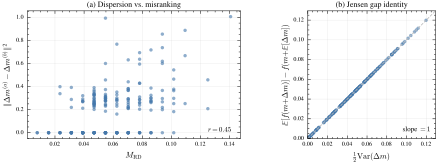
<figcaption class="ltx_caption ltx_centering">Figure 7: Mechanism validation on a strongly convex quadratic.
(a) Update dispersion $\|\Delta m^{(a)}-\Delta m^{(b)}\|^{2}$ grows with two-draw misranking $M_{\mathrm{RD}}$ (Pearson $r=0.45$).
(b) For quadratic objectives, the Jensen gap equals $\tfrac{1}{2}\mathrm{Var}(\Delta m)$ exactly (slope 1), confirming that dispersion translates into expected loss under curvature.
<em class="ltx_emph ltx_font_italic">Protocol:</em> $d{=}40$, $\lambda{=}16$, $\mu{=}8$, $\sigma_{\mathrm{noise}}{=}1.0$.
200 independently sampled candidate sets; 256 Monte Carlo draws per set.
This is a single-step analysis (no optimization loop).</figcaption>
</figure>
<figure id="A6.F8" class="ltx_figure">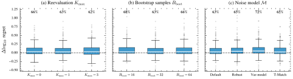
<figcaption class="ltx_caption ltx_centering" style="font-size:80%;">Figure 8: Estimator ablations on the high-misranking COCO subset ($d{=}40$, $B{=}100d$, 225 problems).
Boxplots show per-instance $\Delta\log_{10}$ regret relative to CMA-ES; the dashed line marks parity.
Percentages report win rates (fraction with $\Delta&gt;0$).
(a) Reevaluation cap $K_{\max}$: gains persist even at $K_{\max}{=}0$ (no boundary reevaluations).
(b) Bootstrap samples $B_{\mathrm{boot}}$: stable across 16–64.
(c) Noise-model choice: all variants improve; variance-based modeling yields the highest win rate (72%).
<em class="ltx_emph ltx_font_italic">Protocol:</em> $\lambda{=}15$, $\mu{=}7$. Non-ablated hyperparameters held at defaults ($B_{\mathrm{boot}}{=}32$, $K_{\max}{=}1$).
225 problems (15 functions $\times$ 15 instances), each run once per method.
Boxes show the median (center line) and interquartile range (IQR); whiskers extend to $1.5\times$ IQR; outliers plotted individually.</figcaption>
</figure>
</section>
<section id="A6.SS2" class="ltx_subsection">
<h3 class="ltx_title ltx_title_subsection" id="rb-pem-estimator-ablations">
F.2 RB-PEM Estimator Ablations</h3>

A natural concern is that RB-PEM’s gains might be fragile (driven by a narrow hyperparameter choice), or
they might simply reflect spending extra evaluations near the truncation boundary (i.e., implicit resampling).
This ablation isolates these possibilities.

Setup. We evaluate RB-PEM variants on the COCO bbob-noisy high-misranking subset at $d=40$ and budget $B=100d$
(225 problems: 15 functions $\times$ 15 instances).
For each problem instance, we report
$\Delta\log_{10}\text{regret}=\log_{10}(f(\hat{x}_{B})-f^{\star})_{\text{CMA}}-\log_{10}(f(\hat{x}_{B})-f^{\star})_{\text{variant}}$,
so $\Delta&gt;0$ means the variant improves over CMA-ES.
Figure <a href="#A6.F8" title="Figure 8 ‣ F.1 Mechanism Validation on a Controlled Quadratic ‣ Appendix F Additional Experiments ‣ Depth over Fidelity in Fixed-Budget Noisy Evolution Strategies" class="ltx_ref">8</a> sweeps:
(a) boundary reevaluation cap $K_{\max}\in\{0,1,3\}$;
(b) bootstrap sample count $B_{\mathrm{boot}}\in\{16,32,64\}$;
(c) noise-model variants used inside the bootstrap weight estimator.

Results and interpretation.
All variants exhibit positive median improvements and clear majority win rates (62–72%; Fig. <a href="#A6.F8" title="Figure 8 ‣ F.1 Mechanism Validation on a Controlled Quadratic ‣ Appendix F Additional Experiments ‣ Depth over Fidelity in Fixed-Budget Noisy Evolution Strategies" class="ltx_ref">8</a>).
Two implications are especially important.
First, the improvement persists at $K_{\max}=0$ (66% win rate), where RB-PEM operates with essentially the
same per-generation evaluation cost as vanilla CMA-ES.
This strongly disfavors the hypothesis that RB-PEM wins primarily by spending extra evaluations at the boundary.
Instead, it supports the intended interpretation: the main gain comes from how uncertainty is used
(selection-stage smoothing of the rank weights), not from brute-force denoising.
Second, performance is stable across bootstrap counts and across several plausible noise models, suggesting that the
estimator is not brittle and that modest Monte Carlo effort (e.g., $B_{\mathrm{boot}}\approx 32$) is sufficient.

</section>
<section id="A6.SS3" class="ltx_subsection">
<h3 class="ltx_title ltx_title_subsection" id="log-weight-ablation">
F.3 Log-Weight Ablation</h3>

The CMA-ES baseline uses its standard logarithmic recombination weights throughout.
Our default RB-PEM estimator uses a smooth power-lift weight map inside the bootstrap, and Probe-and-Switch inherits this default when it switches to RB-PEM.
This ablation asks whether the gains depend on that bootstrap-internal choice.
We rerun matched variants that replace only the bootstrap-internal map with the standard CMA-ES log weights from (<a href="#A1.E31" title="In Appendix A CMA-ES Specification ‣ Depth over Fidelity in Fixed-Budget Noisy Evolution Strategies" class="ltx_ref">31</a>), holding seeds, candidate populations, budgets, and all other hyperparameters fixed.

<figure id="A6.T4" class="ltx_table">
<table class="ltx_tabular ltx_centering ltx_guessed_headers ltx_align_middle">
<thead class="ltx_thead">
<tr class="ltx_tr">
<th class="ltx_td ltx_align_left ltx_th ltx_th_column ltx_border_tt" style="padding:0.55pt 5.0pt;">Method (vs. CMA-ES)</th>
<th class="ltx_td ltx_align_center ltx_th ltx_th_column ltx_border_tt" style="padding:0.55pt 5.0pt;">$B=20d$</th>
<th class="ltx_td ltx_align_center ltx_th ltx_th_column ltx_border_tt" style="padding:0.55pt 5.0pt;">$B=50d$</th>
<th class="ltx_td ltx_align_center ltx_th ltx_th_column ltx_border_tt" style="padding:0.55pt 5.0pt;">$B=100d$</th>
<th class="ltx_td ltx_align_center ltx_th ltx_th_column ltx_border_tt" style="padding:0.55pt 5.0pt;">$B=200d$</th>
</tr>
</thead>
<tbody class="ltx_tbody">
<tr class="ltx_tr">
<td class="ltx_td ltx_align_left ltx_border_t" style="padding:0.55pt 5.0pt;">RB-PEM (power-lift)</td>
<td class="ltx_td ltx_align_center ltx_border_t" style="padding:0.55pt 5.0pt;">65.6%</td>
<td class="ltx_td ltx_align_center ltx_border_t" style="padding:0.55pt 5.0pt;">69.5%</td>
<td class="ltx_td ltx_align_center ltx_border_t" style="padding:0.55pt 5.0pt;">68.1%</td>
<td class="ltx_td ltx_align_center ltx_border_t" style="padding:0.55pt 5.0pt;">62.2%</td>
</tr>
<tr class="ltx_tr">
<td class="ltx_td ltx_align_left" style="padding:0.55pt 5.0pt;">RB-PEM (log-weight)</td>
<td class="ltx_td ltx_align_center" style="padding:0.55pt 5.0pt;">63.7%</td>
<td class="ltx_td ltx_align_center" style="padding:0.55pt 5.0pt;">66.4%</td>
<td class="ltx_td ltx_align_center" style="padding:0.55pt 5.0pt;">67.7%</td>
<td class="ltx_td ltx_align_center" style="padding:0.55pt 5.0pt;">62.2%</td>
</tr>
<tr class="ltx_tr">
<td class="ltx_td ltx_align_left" style="padding:0.55pt 5.0pt;">Probe-and-Switch (power-lift)</td>
<td class="ltx_td ltx_align_center" style="padding:0.55pt 5.0pt;">63.7%</td>
<td class="ltx_td ltx_align_center" style="padding:0.55pt 5.0pt;">67.3%</td>
<td class="ltx_td ltx_align_center" style="padding:0.55pt 5.0pt;">65.2%</td>
<td class="ltx_td ltx_align_center" style="padding:0.55pt 5.0pt;">65.3%</td>
</tr>
<tr class="ltx_tr">
<td class="ltx_td ltx_align_left ltx_border_bb" style="padding:0.55pt 5.0pt;">Probe-and-Switch (log-weight)</td>
<td class="ltx_td ltx_align_center ltx_border_bb" style="padding:0.55pt 5.0pt;">61.2%</td>
<td class="ltx_td ltx_align_center ltx_border_bb" style="padding:0.55pt 5.0pt;">62.4%</td>
<td class="ltx_td ltx_align_center ltx_border_bb" style="padding:0.55pt 5.0pt;">65.3%</td>
<td class="ltx_td ltx_align_center ltx_border_bb" style="padding:0.55pt 5.0pt;">62.5%</td>
</tr>
</tbody>
</table>
<figcaption class="ltx_caption ltx_centering" style="font-size:90%;">Table 4: Log-weight ablation.
Win rates against CMA-ES on the high-misranking COCO subset across four budgets.
The CMA-ES baseline uses standard logarithmic recombination weights in every row; the ablation changes only the bootstrap-internal weight map used by RB-PEM, either directly or inside Probe-and-Switch.
The maximum gap between each default method and its log-weight counterpart is $3.1$ percentage points, indicating that the expected-weight mechanism is not tied to the power-lift parametrization.
<em class="ltx_emph ltx_font_italic">Protocol:</em> 15 high-misranking functions $\times$ 15 instances $\times$ 3 dimensions = 675 matched problems per budget; $B_{\mathrm{boot}}{=}32$, $K_{\max}{=}1$, and shared seeds/candidate populations across paired variants.</figcaption>
</figure>

Direct head-to-head comparisons also show near parity between the two bootstrap-internal weight maps: RB-PEM (log-weight) wins against RB-PEM (power-lift) on roughly $44\%$ of matched high-misranking problems, with median regret differences around $10^{-3}$.
Median wall-clock overheads at $d=40$, $B=100d$ are similar as well: $1.70\times$, $1.64\times$, $1.66\times$, and $1.62\times$ CMA-ES for RB-PEM (power-lift), RB-PEM (log-weight), Probe-and-Switch (power-lift), and Probe-and-Switch (log-weight), respectively.

</section>
<section id="A6.SS4" class="ltx_subsection">
<h3 class="ltx_title ltx_title_subsection" id="residual-pool-diagnostic-snapshots">
F.4 Residual-Pool Diagnostic Snapshots</h3>

RB-PEM relies on reusing a pooled residual distribution; Appendix <a href="#A3" title="Appendix C Residual Pool Theory and Diagnostics ‣ Depth over Fidelity in Fixed-Budget Noisy Evolution Strategies" class="ltx_ref">C</a> shows that
residual-pool mismatch can be decomposed into multiple falsifiable components.
This experiment asks whether our diagnostics meaningfully distinguish successful runs from failures and whether they
identify the relevant mismatch mode.

Setup. On the same 225 high-misranking COCO problems ($d=40$, $B=100d$), we compare RB-PEM against a representative
evaluation-stage baseline (UH-CMA-ES with a conservative reevaluation budget).
We label each run as <em class="ltx_emph ltx_font_italic">good</em> if RB-PEM achieves lower final regret and <em class="ltx_emph ltx_font_italic">bad</em> otherwise (193 good, 32 bad).
We then compare four per-run diagnostic summaries (defined in Appendix <a href="#A3" title="Appendix C Residual Pool Theory and Diagnostics ‣ Depth over Fidelity in Fixed-Budget Noisy Evolution Strategies" class="ltx_ref">C</a>):
drift $W_{1}$, shape $W_{1}$, scale $R^{2}$, and a centering-stability metric (“center rel”).

Results: diagnostics isolate specific failure modes.
Figure <a href="#A6.F9" title="Figure 9 ‣ F.4 Residual-Pool Diagnostic Snapshots ‣ Appendix F Additional Experiments ‣ Depth over Fidelity in Fixed-Budget Noisy Evolution Strategies" class="ltx_ref">9</a>a shows that <em class="ltx_emph ltx_font_italic">shape</em> mismatch and <em class="ltx_emph ltx_font_italic">centering</em> instability are the dominant
distinguishers between good and bad runs:
one-sided Mann–Whitney tests detect significant separation for shape $W_{1}$ ($p=0.003$) and center rel ($p=0.001$),
while drift and scale do not separate at conventional levels.
This selective pattern is desirable: rather than firing a generic alarm, the diagnostics point to a concrete
assumption violation (“residuals are well-standardized and shape-stable”) as the likely culprit in failures.

Results: failures often manifest as depth collapse.
Figure <a href="#A6.F9" title="Figure 9 ‣ F.4 Residual-Pool Diagnostic Snapshots ‣ Appendix F Additional Experiments ‣ Depth over Fidelity in Fixed-Budget Noisy Evolution Strategies" class="ltx_ref">9</a>b shows per-generation traces of shape $W_{1}$ for a representative good and bad case.
The bad case exhausts its fixed budget by generation 129, while the good case continues to generation 211
($\Delta T=82$ generations; 39% of depth lost).
This illustrates a concrete failure pathway that is consistent with the paper’s depth accounting:
instability in standardization can increase boundary reevaluations (raising $K_{t}$), which directly consumes budget and
eliminates the depth advantage RB-PEM is designed to preserve.

<figure id="A6.F9" class="ltx_figure">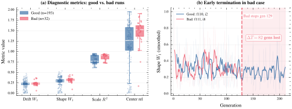
<figcaption class="ltx_caption ltx_centering">Figure 9: Diagnostics make residual-pool assumptions falsifiable.
(a) Boxplots of four diagnostic summaries for <em class="ltx_emph ltx_font_italic">good</em> runs ($n=193$, RB-PEM wins) vs. <em class="ltx_emph ltx_font_italic">bad</em> runs ($n=32$, RB-PEM loses) on the COCO high-misranking subset ($d=40$, $B=100d$).
Shape $W_{1}$ ($p=0.003$) and centering stability ($p=0.001$) significantly separate the two groups (one-sided Mann–Whitney); drift and scale do not, indicating that shape mismatch and standardization instability are the dominant failure modes.
(b) Per-generation traces of shape $W_{1}$ (faint: raw; solid: smoothed) for a representative good and bad run.
The bad run terminates at generation 129, losing $\Delta T=82$ generations (39% of depth) relative to the good run (generation 211), illustrating how pool mismatch triggers depth collapse—the same mechanism the paper’s budget accounting predicts.
<em class="ltx_emph ltx_font_italic">Protocol:</em> $\lambda{=}15$, $\mu{=}7$, $B_{\mathrm{boot}}{=}32$, $K_{\max}{=}1$.
225 problems (15 functions $\times$ 15 instances), each run once.
Boxes show the median and IQR; whiskers extend to $1.5\times$ IQR; boxplot outlier markers suppressed. Individual data points overlaid as jittered scatter.</figcaption>
</figure>
<figure id="A6.F10" class="ltx_figure">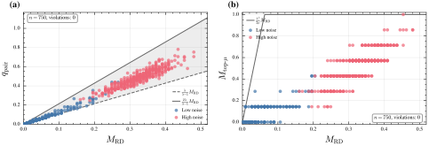
<figcaption class="ltx_caption ltx_centering">Figure 10: Empirical validation of sandwich bounds for rank disagreement.
(a) Kendall discordance $q_{\mathrm{pair}}$ vs. $M_{\mathrm{RD}}$; (b) top-$\mu$ disagreement $M_{\mathrm{top}\mu}$ vs. $M_{\mathrm{RD}}$.
Grey lines indicate the bounds in Eq. (<a href="#A6.E59" title="In F.5 Interpreting the Rank-Disagreement Probe via Sandwich Bounds ‣ Appendix F Additional Experiments ‣ Depth over Fidelity in Fixed-Budget Noisy Evolution Strategies" class="ltx_ref">59</a>). Zero violations.
<em class="ltx_emph ltx_font_italic">Protocol:</em> $d{=}40$, $\lambda{=}15$, $\mu{=}7$.
750 candidate sets from COCO bbob-noisy (30 functions $\times$ 1 instance $\times$ 25 candidate sets per function), sampled via CMA-ES evolution.</figcaption>
</figure>
</section>
<section id="A6.SS5" class="ltx_subsection">
<h3 class="ltx_title ltx_title_subsection" id="interpreting-the-rank-disagreement-probe-via-sandwich-bounds">
F.5 Interpreting the Rank-Disagreement Probe via Sandwich Bounds</h3>

Probe-and-switch (Appendix <a href="#A4" title="Appendix D Decision-Theoretic Analysis for Probe-and-Switch ‣ Depth over Fidelity in Fixed-Budget Noisy Evolution Strategies" class="ltx_ref">D</a>) uses a rank-disagreement statistic
$P=\frac{1}{\lambda^{2}}\sum_{i}|r_{i}^{(a)}-r_{i}^{(b)}|$ (Eq. (<a href="#A4.E56" title="In Appendix D Decision-Theoretic Analysis for Probe-and-Switch ‣ Depth over Fidelity in Fixed-Budget Noisy Evolution Strategies" class="ltx_ref">56</a>)).
This statistic is essentially a normalized Spearman footrule distance between two permutations.
To connect it to more familiar notions of misranking, we relate it to:
(i) Kendall discordance (fraction of discordant pairs) and
(ii) <em class="ltx_emph ltx_font_italic">elite disagreement</em> (how often the top-$\mu$ set changes),
which directly governs truncation selection.

Theoretical relations.
Let $q_{\mathrm{pair}}\in[0,1]$ be the fraction of discordant pairs between the two induced rankings (Kendall),
and let $M_{\mathrm{top}\mu}\in[0,1]$ be the fraction of indices whose membership in the top-$\mu$ set differs.
Standard inequalities between footrule and Kendall distances imply constant-factor bounds of the form

<table id="A6.E59" class="ltx_equation ltx_eqn_table">

<tbody><tr class="ltx_equation ltx_eqn_row ltx_align_baseline">
<td class="ltx_eqn_cell ltx_eqn_center_padleft"></td>
<td class="ltx_eqn_cell ltx_align_center">$$\frac{\lambda}{\lambda-1}M_{\mathrm{RD}}\;\leq\;q_{\mathrm{pair}}\;\leq\;\frac{2\lambda}{\lambda-1}M_{\mathrm{RD}},\qquad M_{\mathrm{top}\mu}\;\leq\;\frac{\lambda^{2}}{2\mu}M_{\mathrm{RD}},$$</td>
<td class="ltx_eqn_cell ltx_eqn_center_padright"></td>
<td rowspan="1" class="ltx_eqn_cell ltx_eqn_eqno ltx_align_middle ltx_align_right">(59)</td>
</tr></tbody>
</table>

where $M_{\mathrm{RD}}$ is the two-draw rank-disagreement score (numerically the same object as $P$ up to notation).

Empirical validation.
We sample 750 candidate sets from COCO bbob-noisy at $d=40$ with the default $\lambda=15$ and $\mu=7$.
Figure <a href="#A6.F10" title="Figure 10 ‣ F.4 Residual-Pool Diagnostic Snapshots ‣ Appendix F Additional Experiments ‣ Depth over Fidelity in Fixed-Budget Noisy Evolution Strategies" class="ltx_ref">10</a> shows $(q_{\mathrm{pair}},M_{\mathrm{top}\mu})$ versus $M_{\mathrm{RD}}$ together with
the bounds in Eq. (<a href="#A6.E59" title="In F.5 Interpreting the Rank-Disagreement Probe via Sandwich Bounds ‣ Appendix F Additional Experiments ‣ Depth over Fidelity in Fixed-Budget Noisy Evolution Strategies" class="ltx_ref">59</a>).
There are zero violations out of 750 points.
This supports two practical interpretations:
(i) $M_{\mathrm{RD}}$ is a scale-consistent proxy for overall rank instability (Kendall discordance), and
(ii) large $M_{\mathrm{RD}}$ implies nontrivial instability of the top-$\mu$ set, which is precisely the part of the ranking
that affects CMA-ES updates most strongly.

</section>
<section id="A6.SS6" class="ltx_subsection">
<h3 class="ltx_title ltx_title_subsection" id="variance-does-not-equal-misranking-a-counterexample">
F.6 Variance Does Not Equal Misranking (A Counterexample)</h3>

A tempting simplification would be to trigger switching based on a <em class="ltx_emph ltx_font_italic">variance probe</em> (estimate the noise variance
at a point and switch when it is large).
This experiment constructs a clean counterexample showing that variance at a single location can be arbitrarily
misleading for rank-based ES, while rank disagreement remains reliable.

Radial (state-dependent) noise model.
We consider heteroscedastic noise with scale increasing with distance to an initial reference point $x_{0}$:
$\sigma_{\mathrm{eff}}(x)=\sigma\|x-x_{0}\|_{\mathrm{RMS}}$.
Under this model, evaluations <em class="ltx_emph ltx_font_italic">at</em> $x_{0}$ are effectively noiseless, but ES candidates sampled away from $x_{0}$
experience substantial noise—exactly where misranking matters.

Probe decoupling.
Figure <a href="#A6.F11" title="Figure 11 ‣ F.6 Variance Does Not Equal Misranking (A Counterexample) ‣ Appendix F Additional Experiments ‣ Depth over Fidelity in Fixed-Budget Noisy Evolution Strategies" class="ltx_ref">11</a>a shows the key pathology:
the variance probe stays at machine precision across all 54 problem instances (it never triggers),
while the rank-disagreement probe $M_{\mathrm{RD}}$ spans a wide range and triggers on 49/54 problems
(at $\tau=0.12$).
Thus, variance can be <em class="ltx_emph ltx_font_italic">decoupled</em> from the misranking regime experienced by the candidate population.

Algorithmic consequence.
This decoupling changes decisions.
Figure <a href="#A6.F11" title="Figure 11 ‣ F.6 Variance Does Not Equal Misranking (A Counterexample) ‣ Appendix F Additional Experiments ‣ Depth over Fidelity in Fixed-Budget Noisy Evolution Strategies" class="ltx_ref">11</a>b compares probe-and-switch using misranking detection (MR) versus a variance-based
variant (Var). Misranking-based switching wins on 39/54 problems ($p=0.0007$, sign test).
This provides direct support for our design choice in Appendix <a href="#A4" title="Appendix D Decision-Theoretic Analysis for Probe-and-Switch ‣ Depth over Fidelity in Fixed-Budget Noisy Evolution Strategies" class="ltx_ref">D</a>: a probe should measure ranking
instability <em class="ltx_emph ltx_font_italic">in the current search distribution</em>, not variance at an arbitrary point.

<figure id="A6.F11" class="ltx_figure">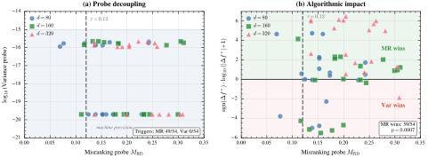
<figcaption class="ltx_caption ltx_centering">Figure 11: Variance $\neq$ misranking under radial noise.
(a) The variance probe is near machine precision while the misranking probe varies widely; triggers: MR 49/54, Var 0/54.
(b) Switching decisions: MR-based probe-and-switch outperforms variance-based (MR wins 39/54; $p=0.0007$).
<em class="ltx_emph ltx_font_italic">Protocol:</em> Radial noise $\sigma_{\mathrm{eff}}(x)=0.5\|x-x_{0}\|$, $d\in\{80,160,320\}$, $B=200d$, $B_{\mathrm{boot}}{=}32$, $K_{\max}{=}1$.
$\lambda$ follows the CMA-ES default at each $d$ (17, 19, 21).
54 problems (6 functions $\times$ 3 instances $\times$ 3 dimensions), each run once per method.</figcaption>
</figure>
</section>
<section id="A6.SS7" class="ltx_subsection">
<h3 class="ltx_title ltx_title_subsection" id="probe-calibration-curves">
F.7 Probe Calibration Curves</h3>

Proposition <a href="#Thmproposition5" title="Proposition 5. ‣ Appendix D Decision-Theoretic Analysis for Probe-and-Switch ‣ Depth over Fidelity in Fixed-Budget Noisy Evolution Strategies" class="ltx_ref">5</a> shows that if the conditional advantage $\Delta(p)$ single-crosses,
then a <em class="ltx_emph ltx_font_italic">threshold</em> rule in the probe statistic $P$ is Bayes-optimal among rules depending only on $P$.
This experiment empirically checks whether $P$ behaves as a calibrated predictor of when RB-PEM wins.

Setup.
We compute the probe statistic $P$ (Eq. (<a href="#A4.E56" title="In Appendix D Decision-Theoretic Analysis for Probe-and-Switch ‣ Depth over Fidelity in Fixed-Budget Noisy Evolution Strategies" class="ltx_ref">56</a>)) and bin problems into quantiles of $P$.
Within each bin we estimate the empirical win rate of RB-PEM over CMA-ES, with 95% Wilson score intervals.
To test generalization and avoid within-suite leakage, we evaluate on a held-out test split of instances
(instances 6–15), using thresholds calibrated on instances 1–5.
We report two representative budgets to illustrate budget dependence.

Results and interpretation.
Figure <a href="#A6.F12" title="Figure 12 ‣ F.7 Probe Calibration Curves ‣ Appendix F Additional Experiments ‣ Depth over Fidelity in Fixed-Budget Noisy Evolution Strategies" class="ltx_ref">12</a> shows a clear monotone trend:
at low $P$ (stable ranks), RB-PEM wins with probability well below 0.5 (CMA-ES is preferred);
at high $P$, RB-PEM wins with probability 0.7–0.8.
The calibrated thresholds (vertical dashed lines) fall near the empirical 0.5 crossing, aligning with the
decision-theoretic interpretation: the probe is measuring a quantity that is predictive of the algorithm crossover.
The threshold shifts with budget in the expected direction: when the remaining budget is larger, the relative cost of
RB-PEM’s bounded overhead is smaller, so switching becomes beneficial at lower misranking levels.

<figure id="A6.F12" class="ltx_figure">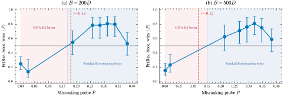
<figcaption class="ltx_caption ltx_centering">Figure 12: Probe calibration curves.
Empirical $\Pr(\text{RB-PEM wins}\mid P)$ versus probe statistic $P$ (quantile bins; 95% Wilson intervals).
Shaded regions indicate which algorithm is preferred; the vertical dashed line is the calibrated threshold.
The win probability increases monotonically with $P$, supporting a threshold decision rule.
<em class="ltx_emph ltx_font_italic">Protocol:</em> $d{=}40$, $\lambda{=}15$, $\mu{=}7$, $B_{\mathrm{boot}}{=}32$, $K_{\max}{=}1$.
Two budget levels: $B{=}200d$ and $B{=}500d$. 450 problems per budget (30 functions $\times$ 15 instances), each run once.
Calibration uses instances 1–5 (train) and 6–15 (test).</figcaption>
</figure>
<figure id="A6.F13" class="ltx_figure">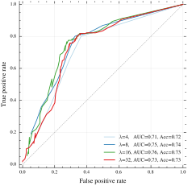
<figcaption class="ltx_caption ltx_centering">Figure 13: Probe budget vs. ROC.
ROC curves for different probe population sizes $\lambda$ on COCO bbob-noisy ($d{=}40$, $B{=}200d$).
Legend: AUC and accuracy at the displayed operating point. Reliability improves up to $\lambda\approx 16$ and then saturates.
<em class="ltx_emph ltx_font_italic">Protocol:</em> $B_{\mathrm{boot}}{=}32$, $K_{\max}{=}1$.
30 functions $\times$ 15 instances = 450 problems per $\lambda$ value, each run once.
$\lambda\in\{4,8,16,32\}$; $\mu{=}\lfloor\lambda/2\rfloor$. Operating point: $\tau{=}0.12$.</figcaption>
</figure>
</section>
<section id="A6.SS8" class="ltx_subsection">
<h3 class="ltx_title ltx_title_subsection" id="probe-reliability-versus-probe-budget">
F.8 Probe Reliability versus Probe Budget</h3>

The probe costs $2\lambda$ evaluations, so it must be informative at modest budgets.
This experiment quantifies the classification quality of the probe as we vary its cost by changing $\lambda$.

Setup.
We sweep probe population sizes $\lambda\in\{4,8,16,32\}$.
For each setting we compute $P$ and evaluate its ability to classify problems where RB-PEM beats CMA-ES
(ground-truth labels from full runs) on 450 COCO problems at $d=40$, $B=200d$.
We report ROC curves; the legend lists AUC and accuracy at a representative threshold.

Results and interpretation.
Figure <a href="#A6.F13" title="Figure 13 ‣ F.7 Probe Calibration Curves ‣ Appendix F Additional Experiments ‣ Depth over Fidelity in Fixed-Budget Noisy Evolution Strategies" class="ltx_ref">13</a> shows that even the cheapest probe ($\lambda=4$, cost 8 evaluations) is strongly
informative (AUC 0.71, accuracy 0.72), and performance improves up to $\lambda\approx 16$ (AUC 0.76).
Increasing probe cost further does not help (AUC drops to 0.73 at $\lambda=32$), indicating diminishing returns and a
clear cost-effectiveness plateau.
This justifies using a modest probe budget comparable to the default ES population size.

</section>
<section id="A6.SS9" class="ltx_subsection">
<h3 class="ltx_title ltx_title_subsection" id="threshold-sensitivity-analysis">
F.9 Threshold Sensitivity Analysis</h3>

Probe-and-switch introduces a single scalar hyperparameter: the switching threshold $\tau$.
A practical method should not require fragile tuning.
This experiment evaluates (i) how accuracy depends on $\tau$ and (ii) how much regret is incurred by choosing a
suboptimal threshold.

Setup.
We sweep $\tau\in[0,0.30]$ and evaluate classification accuracy of the misranking probe (MR) and a variance proxy
(Var) at two budgets.
We also compute <em class="ltx_emph ltx_font_italic">decision regret</em>: the mean $\log_{10}$ performance gap to an oracle that always chooses the
better of CMA-ES and RB-PEM for each problem instance.
We report both the train split (instances 1–5) and the held-out test split (instances 6–15).

Results and interpretation.
Figure <a href="#A6.F14" title="Figure 14 ‣ F.9 Threshold Sensitivity Analysis ‣ Appendix F Additional Experiments ‣ Depth over Fidelity in Fixed-Budget Noisy Evolution Strategies" class="ltx_ref">14</a>a shows a broad accuracy plateau: for MR, accuracy varies by only
$\approx 2$ percentage points over $\tau\in[0.08,0.18]$.
Across all thresholds, MR outperforms Var by roughly 5–6 percentage points, reinforcing the necessity of
rank-based probing (cf. F5).
Figure <a href="#A6.F14" title="Figure 14 ‣ F.9 Threshold Sensitivity Analysis ‣ Appendix F Additional Experiments ‣ Depth over Fidelity in Fixed-Budget Noisy Evolution Strategies" class="ltx_ref">14</a>b shows that decision regret is highly asymmetric:
very small $\tau$ causes <em class="ltx_emph ltx_font_italic">over-switching</em> (unnecessary RB-PEM overhead on low-misranking problems),
while very large $\tau$ causes <em class="ltx_emph ltx_font_italic">under-switching</em> (missing beneficial RB-PEM deployments).
Importantly, the regret curve is also flat across the plateau, so near-optimal decisions do not require precise
threshold tuning; $\tau=0.12$ lies safely in the robust region.

<figure id="A6.F14" class="ltx_figure">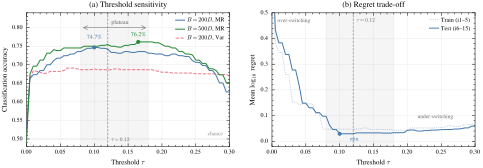
<figcaption class="ltx_caption ltx_centering">Figure 14: Threshold sensitivity.
(a) Classification accuracy vs. threshold $\tau$: MR exhibits a broad plateau and outperforms Var.
(b) Decision regret vs. $\tau$: over-switching dominates at small $\tau$, under-switching at large $\tau$; the minimum lies within the accuracy plateau, showing robust tuning.
<em class="ltx_emph ltx_font_italic">Protocol:</em> $d{=}40$, $\lambda{=}15$, $\mu{=}7$, $B_{\mathrm{boot}}{=}32$, $K_{\max}{=}1$.
Two budget levels: $B{=}200d$ and $B{=}500d$. 450 problems per budget (30 functions $\times$ 15 instances), each run once.
Accuracy is the proportion of problems correctly routed; decision regret is the mean $\log_{10}$ performance gap to an oracle selector.</figcaption>
</figure>
</section>
<section id="A6.SS10" class="ltx_subsection">
<h3 class="ltx_title ltx_title_subsection" id="depthfidelity-robustness-and-uh-cma-es-sensitivity">
F.10 Depth–Fidelity Robustness and UH-CMA-ES Sensitivity</h3>

The main paper argues that under fixed budget, evaluation-stage denoising is structurally disadvantaged because it
reduces depth.
This section provides two complementary robustness checks:
(a) whether RB-PEM’s advantage persists across budgets and dimensions, and
(b) whether UH-CMA-ES can be “rescued” by tuning its maxevals parameter.

a: Budget and dimension robustness.
Figure <a href="#A6.F15" title="Figure 15 ‣ F.10 Depth–Fidelity Robustness and UH-CMA-ES Sensitivity ‣ Appendix F Additional Experiments ‣ Depth over Fidelity in Fixed-Budget Noisy Evolution Strategies" class="ltx_ref">15</a>a reports win rates of RB-PEM against three baselines across
budgets $B\in\{50d,100d,200d\}$ and dimensions $d\in\{20,40\}$ (225 high-misranking COCO problems per setting).
RB-PEM wins decisively against UH-CMA-ES (roughly 79–94%) and against Resample($k{=}10$) (roughly 78–83%) in
every regime, and maintains majority wins even against vanilla CMA-ES.
The advantage is larger at $d=40$ than at $d=20$, consistent with misranking becoming more damaging in higher
dimensions and with the paper’s empirical observation that depth becomes increasingly predictive of performance as
misranking increases.

b: UH-CMA-ES maxevals sweep.
Figure <a href="#A6.F15" title="Figure 15 ‣ F.10 Depth–Fidelity Robustness and UH-CMA-ES Sensitivity ‣ Appendix F Additional Experiments ‣ Depth over Fidelity in Fixed-Budget Noisy Evolution Strategies" class="ltx_ref">15</a>b sweeps maxevals$\in\{1,10,30\}$.
Across both budgets, UH-CMA-ES remains far below the 50% parity line versus CMA-ES and versus probe-and-switch.
Moreover, increasing maxevals monotonically <em class="ltx_emph ltx_font_italic">reduces</em> UH-CMA-ES win rate: allocating more reevaluations
per generation worsens fixed-budget performance.
This supports the interpretation that UH-CMA-ES’s underperformance is not a tuning artifact but a depth-loss effect.

<figure id="A6.F15" class="ltx_figure">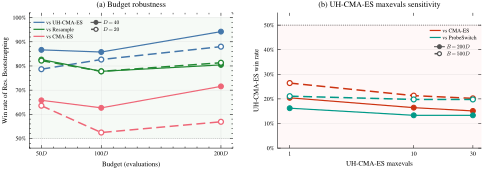
<figcaption class="ltx_caption ltx_centering">Figure 15: Depth–fidelity robustness and baseline sensitivity.
(a) Win rate of RB-PEM across budgets and dimensions against UH-CMA-ES, Resample($k{=}10$), and CMA-ES.
(b) UH-CMA-ES win rate vs. CMA-ES and vs. Probe-and-Switch ($\tau{=}0.12$) as a function of maxevals; all values are far below parity, and larger maxevals further degrades performance.
<em class="ltx_emph ltx_font_italic">Protocol:</em> $B_{\mathrm{boot}}{=}32$, $K_{\max}{=}1$.
Panel (a): $d\in\{20,40\}$, $B\in\{50d,100d,200d\}$, 15 high-misranking functions $\times$ 15 instances = 225 problems per (budget, dimension) pair, each run once.
Panel (b): $d{=}40$, $B\in\{200d,500d\}$, 30 functions $\times$ 15 instances = 450 problems per budget, each run once; maxevals$\in\{1,10,30\}$.</figcaption>
</figure>
</section>
<section id="A6.SS11" class="ltx_subsection">
<h3 class="ltx_title ltx_title_subsection" id="external-validity-on-a-nonconvex-real-data-task">
F.11 External Validity on a Nonconvex Real-Data Task</h3>

The COCO suite is synthetic and largely separable from end-to-end ML pipelines.
This experiment tests whether the probe-and-switch principle generalizes to a small nonconvex real-data task where
noise is induced by stochastic mini-batching.

Setup.
We train a single-hidden-layer MLP (4 hidden units) on the digits0 binary classification task
(digit 0 vs. non-0), with $n=256$ samples and $d=265$ parameters.
We control ranking noise via mini-batch size $B_{\mathrm{batch}}\in\{4,16,256\}$ (smaller batches $\Rightarrow$ noisier
objective values $\Rightarrow$ more misranking).
We compare CMA-ES, probe-and-switch, and a <em class="ltx_emph ltx_font_italic">warmstart</em> variant that reuses the probe evaluations as part of the
first generation, thereby removing the probe’s opportunity cost when the probe indicates “no switch.”
All methods use the same total budget $B=40d=10{,}600$ and 50 random seeds.

Results and interpretation.
Figure <a href="#A6.F16" title="Figure 16 ‣ F.11 External Validity on a Nonconvex Real-Data Task ‣ Appendix F Additional Experiments ‣ Depth over Fidelity in Fixed-Budget Noisy Evolution Strategies" class="ltx_ref">16</a> shows three regimes.
<em class="ltx_emph ltx_font_italic">Moderate noise</em> ($B_{\mathrm{batch}}=16$, $M_{\mathrm{RD}}\in[0.13,0.34]$): probe-and-switch improves over CMA-ES
(66% win rate) and warmstart is stronger still (76% win rate), consistent with the paper’s main claim that selection-stage
uncertainty integration is most beneficial in high-misranking regimes.
<em class="ltx_emph ltx_font_italic">Extreme noise</em> ($B_{\mathrm{batch}}=4$): both variants are near parity (54% win rate), suggesting a saturation regime
where all methods are heavily noise-limited.
Deterministic ($B_{\mathrm{batch}}=256$, $M_{\mathrm{RD}}=0$): warmstart matches CMA-ES almost exactly (48/50 ties,
i.e., 96%), demonstrating that the probe can correctly detect “no misranking” and that warmstarting can remove probe cost
when switching is unnecessary.
Overall, this nonconvex experiment supports the external validity of probe-and-switch and highlights warmstarting as a
simple practical refinement in low-noise settings.

<figure id="A6.F16" class="ltx_figure">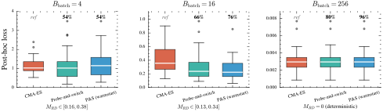
<figcaption class="ltx_caption ltx_centering">Figure 16: MLP training on digits0 (nonconvex).
Final post-hoc loss (lower is better) across 50 seeds at fixed budget $B=40d$.
Numbers above boxes indicate the fraction of seeds on which the method improves upon (or ties with) CMA-ES.
Left: $B_{\mathrm{batch}}=4$ (extreme noise); Center: $B_{\mathrm{batch}}=16$ (moderate noise); Right: $B_{\mathrm{batch}}=256$ (deterministic).
<em class="ltx_emph ltx_font_italic">Protocol:</em> $d{=}265$, $\lambda{=}20$ (CMA-ES default), $\mu{=}10$, $B_{\mathrm{boot}}{=}32$, $K_{\max}{=}1$.
50 independent seeds per (method, batch-size) pair.
Boxes show the median (center line) and IQR; whiskers extend to $1.5\times$ IQR; outliers plotted individually.</figcaption>
</figure>
</section>
<section id="A6.SS12" class="ltx_subsection">
<h3 class="ltx_title ltx_title_subsection" id="complete-results-on-high-misranking-coco-functions">
F.12 Complete Results on High-Misranking COCO Functions</h3>

The main text visualizes convergence on a small set of representative functions.
Table <a href="#A6.T5" title="Table 5 ‣ F.12 Complete Results on High-Misranking COCO Functions ‣ Appendix F Additional Experiments ‣ Depth over Fidelity in Fixed-Budget Noisy Evolution Strategies" class="ltx_ref">5</a> provides the complete per-function summary on the full high-misranking
function class used throughout the paper, to verify that the reported gains are not an artifact of selective
function choice.

Setup.
We report median final $\log_{10}$ regret at budget $B=100d$ for $d=40$ across 15 instances per function.
We compare CMA-ES, UH-CMA-ES, RB-PEM, and probe-and-switch (bold indicates the best median per function).

Results and interpretation.
Two patterns stand out.
First, RB-PEM and probe-and-switch <em class="ltx_emph ltx_font_italic">dominate</em> UH-CMA-ES across the entire class (no exceptions),
reinforcing the depth-fidelity argument: evaluation-stage reevaluation is consistently uncompetitive under strict budgets.
Second, selection-stage methods usually outperform vanilla CMA-ES, with the largest gains on the functions where the
noisy ranking is most unstable (e.g., f110, f111, f116).
On the few functions where CMA-ES is marginally better, the gaps are small, consistent with a low-misranking regime
where smoothing and any additional overhead bring limited benefit.
This table therefore complements the main-text figures by showing that the “selection-stage wins” pattern is broad
and not cherry-picked.

<figure id="A6.T5" class="ltx_table">
<figcaption class="ltx_caption ltx_centering">Table 5: Median $\log_{10}$ regret at $B=100d$ across all 15 high-misranking COCO functions ($d{=}40$, 15 instances each). Bold: lowest per function.
<em class="ltx_emph ltx_font_italic">Protocol:</em> $\lambda{=}15$, $\mu{=}7$, $B_{\mathrm{boot}}{=}32$, $K_{\max}{=}1$. Probe-and-Switch uses $\tau{=}0.12$.
Each instance is run once per method; the reported statistic is the median across 15 instances.</figcaption>
<table class="ltx_tabular ltx_centering ltx_guessed_headers ltx_align_middle">
<thead class="ltx_thead">
<tr class="ltx_tr">
<th class="ltx_td ltx_th ltx_th_row ltx_border_tt" style="padding-left:5.0pt;padding-right:5.0pt;"></th>
<th class="ltx_td ltx_align_center ltx_th ltx_th_column ltx_border_tt" style="padding-left:5.0pt;padding-right:5.0pt;" colspan="2">Baselines</th>
<th class="ltx_td ltx_align_center ltx_th ltx_th_column ltx_border_tt" style="padding-left:5.0pt;padding-right:5.0pt;" colspan="2">Selection-stage</th>
</tr>
<tr class="ltx_tr">
<th class="ltx_td ltx_align_left ltx_th ltx_th_column ltx_th_row" style="padding-left:5.0pt;padding-right:5.0pt;">Function</th>
<th class="ltx_td ltx_align_center ltx_th ltx_th_column ltx_border_t" style="padding-left:5.0pt;padding-right:5.0pt;">CMA-ES</th>
<th class="ltx_td ltx_align_center ltx_th ltx_th_column ltx_border_t" style="padding-left:5.0pt;padding-right:5.0pt;">UH-CMA-ES</th>
<th class="ltx_td ltx_align_center ltx_th ltx_th_column ltx_border_t" style="padding-left:5.0pt;padding-right:5.0pt;">RB-PEM</th>
<th class="ltx_td ltx_align_center ltx_th ltx_th_column ltx_border_t" style="padding-left:5.0pt;padding-right:5.0pt;">Probe-and-switch</th>
</tr>
</thead>
<tbody class="ltx_tbody">
<tr class="ltx_tr">
<th class="ltx_td ltx_align_left ltx_th ltx_th_row ltx_border_t" style="padding-left:5.0pt;padding-right:5.0pt;">f108</th>
<td class="ltx_td ltx_align_center ltx_border_t" style="padding-left:5.0pt;padding-right:5.0pt;">2.39</td>
<td class="ltx_td ltx_align_center ltx_border_t" style="padding-left:5.0pt;padding-right:5.0pt;">2.46</td>
<td class="ltx_td ltx_align_center ltx_border_t" style="padding-left:5.0pt;padding-right:5.0pt;">2.37</td>
<td class="ltx_td ltx_align_center ltx_border_t" style="padding-left:5.0pt;padding-right:5.0pt;">2.36</td>
</tr>
<tr class="ltx_tr">
<th class="ltx_td ltx_align_left ltx_th ltx_th_row" style="padding-left:5.0pt;padding-right:5.0pt;">f110</th>
<td class="ltx_td ltx_align_center" style="padding-left:5.0pt;padding-right:5.0pt;">4.87</td>
<td class="ltx_td ltx_align_center" style="padding-left:5.0pt;padding-right:5.0pt;">5.35</td>
<td class="ltx_td ltx_align_center" style="padding-left:5.0pt;padding-right:5.0pt;">4.47</td>
<td class="ltx_td ltx_align_center" style="padding-left:5.0pt;padding-right:5.0pt;">4.53</td>
</tr>
<tr class="ltx_tr">
<th class="ltx_td ltx_align_left ltx_th ltx_th_row" style="padding-left:5.0pt;padding-right:5.0pt;">f111</th>
<td class="ltx_td ltx_align_center" style="padding-left:5.0pt;padding-right:5.0pt;">5.22</td>
<td class="ltx_td ltx_align_center" style="padding-left:5.0pt;padding-right:5.0pt;">5.48</td>
<td class="ltx_td ltx_align_center" style="padding-left:5.0pt;padding-right:5.0pt;">5.11</td>
<td class="ltx_td ltx_align_center" style="padding-left:5.0pt;padding-right:5.0pt;">5.09</td>
</tr>
<tr class="ltx_tr">
<th class="ltx_td ltx_align_left ltx_th ltx_th_row" style="padding-left:5.0pt;padding-right:5.0pt;">f113</th>
<td class="ltx_td ltx_align_center" style="padding-left:5.0pt;padding-right:5.0pt;">2.87</td>
<td class="ltx_td ltx_align_center" style="padding-left:5.0pt;padding-right:5.0pt;">3.05</td>
<td class="ltx_td ltx_align_center" style="padding-left:5.0pt;padding-right:5.0pt;">2.77</td>
<td class="ltx_td ltx_align_center" style="padding-left:5.0pt;padding-right:5.0pt;">2.75</td>
</tr>
<tr class="ltx_tr">
<th class="ltx_td ltx_align_left ltx_th ltx_th_row" style="padding-left:5.0pt;padding-right:5.0pt;">f114</th>
<td class="ltx_td ltx_align_center" style="padding-left:5.0pt;padding-right:5.0pt;">3.03</td>
<td class="ltx_td ltx_align_center" style="padding-left:5.0pt;padding-right:5.0pt;">3.16</td>
<td class="ltx_td ltx_align_center" style="padding-left:5.0pt;padding-right:5.0pt;">3.13</td>
<td class="ltx_td ltx_align_center" style="padding-left:5.0pt;padding-right:5.0pt;">3.06</td>
</tr>
<tr class="ltx_tr">
<th class="ltx_td ltx_align_left ltx_th ltx_th_row" style="padding-left:5.0pt;padding-right:5.0pt;">f116</th>
<td class="ltx_td ltx_align_center" style="padding-left:5.0pt;padding-right:5.0pt;">4.65</td>
<td class="ltx_td ltx_align_center" style="padding-left:5.0pt;padding-right:5.0pt;">4.99</td>
<td class="ltx_td ltx_align_center" style="padding-left:5.0pt;padding-right:5.0pt;">4.48</td>
<td class="ltx_td ltx_align_center" style="padding-left:5.0pt;padding-right:5.0pt;">4.54</td>
</tr>
<tr class="ltx_tr">
<th class="ltx_td ltx_align_left ltx_th ltx_th_row" style="padding-left:5.0pt;padding-right:5.0pt;">f117</th>
<td class="ltx_td ltx_align_center" style="padding-left:5.0pt;padding-right:5.0pt;">4.93</td>
<td class="ltx_td ltx_align_center" style="padding-left:5.0pt;padding-right:5.0pt;">4.98</td>
<td class="ltx_td ltx_align_center" style="padding-left:5.0pt;padding-right:5.0pt;">4.90</td>
<td class="ltx_td ltx_align_center" style="padding-left:5.0pt;padding-right:5.0pt;">4.89</td>
</tr>
<tr class="ltx_tr">
<th class="ltx_td ltx_align_left ltx_th ltx_th_row" style="padding-left:5.0pt;padding-right:5.0pt;">f119</th>
<td class="ltx_td ltx_align_center" style="padding-left:5.0pt;padding-right:5.0pt;">1.58</td>
<td class="ltx_td ltx_align_center" style="padding-left:5.0pt;padding-right:5.0pt;">1.74</td>
<td class="ltx_td ltx_align_center" style="padding-left:5.0pt;padding-right:5.0pt;">1.53</td>
<td class="ltx_td ltx_align_center" style="padding-left:5.0pt;padding-right:5.0pt;">1.50</td>
</tr>
<tr class="ltx_tr">
<th class="ltx_td ltx_align_left ltx_th ltx_th_row" style="padding-left:5.0pt;padding-right:5.0pt;">f120</th>
<td class="ltx_td ltx_align_center" style="padding-left:5.0pt;padding-right:5.0pt;">1.73</td>
<td class="ltx_td ltx_align_center" style="padding-left:5.0pt;padding-right:5.0pt;">1.84</td>
<td class="ltx_td ltx_align_center" style="padding-left:5.0pt;padding-right:5.0pt;">1.69</td>
<td class="ltx_td ltx_align_center" style="padding-left:5.0pt;padding-right:5.0pt;">1.68</td>
</tr>
<tr class="ltx_tr">
<th class="ltx_td ltx_align_left ltx_th ltx_th_row" style="padding-left:5.0pt;padding-right:5.0pt;">f122</th>
<td class="ltx_td ltx_align_center" style="padding-left:5.0pt;padding-right:5.0pt;">1.04</td>
<td class="ltx_td ltx_align_center" style="padding-left:5.0pt;padding-right:5.0pt;">1.14</td>
<td class="ltx_td ltx_align_center" style="padding-left:5.0pt;padding-right:5.0pt;">1.03</td>
<td class="ltx_td ltx_align_center" style="padding-left:5.0pt;padding-right:5.0pt;">1.04</td>
</tr>
<tr class="ltx_tr">
<th class="ltx_td ltx_align_left ltx_th ltx_th_row" style="padding-left:5.0pt;padding-right:5.0pt;">f123</th>
<td class="ltx_td ltx_align_center" style="padding-left:5.0pt;padding-right:5.0pt;">1.13</td>
<td class="ltx_td ltx_align_center" style="padding-left:5.0pt;padding-right:5.0pt;">1.19</td>
<td class="ltx_td ltx_align_center" style="padding-left:5.0pt;padding-right:5.0pt;">1.15</td>
<td class="ltx_td ltx_align_center" style="padding-left:5.0pt;padding-right:5.0pt;">1.15</td>
</tr>
<tr class="ltx_tr">
<th class="ltx_td ltx_align_left ltx_th ltx_th_row" style="padding-left:5.0pt;padding-right:5.0pt;">f125</th>
<td class="ltx_td ltx_align_center" style="padding-left:5.0pt;padding-right:5.0pt;">0.26</td>
<td class="ltx_td ltx_align_center" style="padding-left:5.0pt;padding-right:5.0pt;">0.36</td>
<td class="ltx_td ltx_align_center" style="padding-left:5.0pt;padding-right:5.0pt;">0.12</td>
<td class="ltx_td ltx_align_center" style="padding-left:5.0pt;padding-right:5.0pt;">0.10</td>
</tr>
<tr class="ltx_tr">
<th class="ltx_td ltx_align_left ltx_th ltx_th_row" style="padding-left:5.0pt;padding-right:5.0pt;">f126</th>
<td class="ltx_td ltx_align_center" style="padding-left:5.0pt;padding-right:5.0pt;">0.32</td>
<td class="ltx_td ltx_align_center" style="padding-left:5.0pt;padding-right:5.0pt;">0.39</td>
<td class="ltx_td ltx_align_center" style="padding-left:5.0pt;padding-right:5.0pt;">0.22</td>
<td class="ltx_td ltx_align_center" style="padding-left:5.0pt;padding-right:5.0pt;">0.21</td>
</tr>
<tr class="ltx_tr">
<th class="ltx_td ltx_align_left ltx_th ltx_th_row" style="padding-left:5.0pt;padding-right:5.0pt;">f128</th>
<td class="ltx_td ltx_align_center" style="padding-left:5.0pt;padding-right:5.0pt;">1.91</td>
<td class="ltx_td ltx_align_center" style="padding-left:5.0pt;padding-right:5.0pt;">1.92</td>
<td class="ltx_td ltx_align_center" style="padding-left:5.0pt;padding-right:5.0pt;">1.91</td>
<td class="ltx_td ltx_align_center" style="padding-left:5.0pt;padding-right:5.0pt;">1.90</td>
</tr>
<tr class="ltx_tr">
<th class="ltx_td ltx_align_left ltx_th ltx_th_row ltx_border_bb" style="padding-left:5.0pt;padding-right:5.0pt;">f129</th>
<td class="ltx_td ltx_align_center ltx_border_bb" style="padding-left:5.0pt;padding-right:5.0pt;">1.91</td>
<td class="ltx_td ltx_align_center ltx_border_bb" style="padding-left:5.0pt;padding-right:5.0pt;">1.91</td>
<td class="ltx_td ltx_align_center ltx_border_bb" style="padding-left:5.0pt;padding-right:5.0pt;">1.91</td>
<td class="ltx_td ltx_align_center ltx_border_bb" style="padding-left:5.0pt;padding-right:5.0pt;">1.91</td>
</tr>
</tbody>
</table>
</figure>
</section>
<section id="A6.SS13" class="ltx_subsection">
<h3 class="ltx_title ltx_title_subsection" id="all-function-breakdowns-by-probe-regime-and-noise-family">
F.13 All-Function Breakdowns by Probe Regime and Noise Family</h3>

Table <a href="#S6.T1" title="Table 1 ‣ 6.5 Comprehensive Comparison ‣ 6 Experiments ‣ Depth over Fidelity in Fixed-Budget Noisy Evolution Strategies" class="ltx_ref">1</a> and Fig. <a href="#S6.F4" title="Figure 4 ‣ 6.4 Probe-and-Switch Evaluation ‣ 6 Experiments ‣ Depth over Fidelity in Fixed-Budget Noisy Evolution Strategies" class="ltx_ref">4</a> report all-function evidence; here we unpack where those gains arise.
The probe statistic separates bbob-noisy into a selected high-misranking subset and a more stable complement.
Table <a href="#A6.T6" title="Table 6 ‣ F.13 All-Function Breakdowns by Probe Regime and Noise Family ‣ Appendix F Additional Experiments ‣ Depth over Fidelity in Fixed-Budget Noisy Evolution Strategies" class="ltx_ref">6</a> quantifies this split at $B=100d$.
Always-on RB-PEM is strongest on the selected high-misranking functions but can be harmful on the complement, where smoothing and reevaluation overhead are often unnecessary.
Probe-and-Switch preserves most of the high-misranking gain while reverting toward CMA-ES on the complement.

<figure id="A6.T6" class="ltx_table">
<table class="ltx_tabular ltx_centering ltx_guessed_headers ltx_align_middle">
<thead class="ltx_thead">
<tr class="ltx_tr">
<th class="ltx_td ltx_align_left ltx_th ltx_th_column ltx_th_row ltx_border_tt" style="padding:0.6pt 7.0pt;">Method (vs. CMA-ES)</th>
<th class="ltx_td ltx_align_center ltx_th ltx_th_column ltx_border_tt" style="padding:0.6pt 7.0pt;">Selected high-misranking 15f</th>
<th class="ltx_td ltx_align_center ltx_th ltx_th_column ltx_border_tt" style="padding:0.6pt 7.0pt;">Complement 15f</th>
</tr>
</thead>
<tbody class="ltx_tbody">
<tr class="ltx_tr">
<th class="ltx_td ltx_align_left ltx_th ltx_th_row ltx_border_t" style="padding:0.6pt 7.0pt;">RB-PEM</th>
<td class="ltx_td ltx_align_center ltx_border_t" style="padding:0.6pt 7.0pt;">68.1% (460/675)</td>
<td class="ltx_td ltx_align_center ltx_border_t" style="padding:0.6pt 7.0pt;">35.3% (238/675)</td>
</tr>
<tr class="ltx_tr">
<th class="ltx_td ltx_align_left ltx_th ltx_th_row" style="padding:0.6pt 7.0pt;">RB-PEM (log-weight)</th>
<td class="ltx_td ltx_align_center" style="padding:0.6pt 7.0pt;">67.7% (457/675)</td>
<td class="ltx_td ltx_align_center" style="padding:0.6pt 7.0pt;">37.3% (252/675)</td>
</tr>
<tr class="ltx_tr">
<th class="ltx_td ltx_align_left ltx_th ltx_th_row" style="padding:0.6pt 7.0pt;">Probe-and-Switch</th>
<td class="ltx_td ltx_align_center" style="padding:0.6pt 7.0pt;">65.2% (440/675)</td>
<td class="ltx_td ltx_align_center" style="padding:0.6pt 7.0pt;">47.4% (320/675)</td>
</tr>
<tr class="ltx_tr">
<th class="ltx_td ltx_align_left ltx_th ltx_th_row ltx_border_bb" style="padding:0.6pt 7.0pt;">Probe-and-Switch (log-weight)</th>
<td class="ltx_td ltx_align_center ltx_border_bb" style="padding:0.6pt 7.0pt;">65.3% (441/675)</td>
<td class="ltx_td ltx_align_center ltx_border_bb" style="padding:0.6pt 7.0pt;">46.1% (311/675)</td>
</tr>
</tbody>
</table>
<figcaption class="ltx_caption ltx_centering">Table 6: High-misranking versus complement breakdown.
Win rates against CMA-ES at $B=100d$ after splitting all 30 COCO bbob-noisy functions by the probe-based partition of Fig. <a href="#S6.F4" title="Figure 4 ‣ 6.4 Probe-and-Switch Evaluation ‣ 6 Experiments ‣ Depth over Fidelity in Fixed-Budget Noisy Evolution Strategies" class="ltx_ref">4</a>.
RB-PEM variants win decisively on the selected high-misranking subset but lose on the complement, while Probe-and-Switch stays near parity there by reverting to CMA-ES when rankings are stable.
<em class="ltx_emph ltx_font_italic">Protocol:</em> $d\in\{10,20,40\}$, 15 instances per function, one run per method, 675 matched problems per column.
The selected high-misranking column is the 15-function subset used throughout the paper; the complement contains the 14 low-misranking functions plus f107, whose large probe value is structural rather than noise-induced.</figcaption>
</figure>

Table <a href="#A6.T7" title="Table 7 ‣ F.13 All-Function Breakdowns by Probe Regime and Noise Family ‣ Appendix F Additional Experiments ‣ Depth over Fidelity in Fixed-Budget Noisy Evolution Strategies" class="ltx_ref">7</a> gives an orthogonal view by COCO noise family.
The moderate-Gaussian group is mostly stable-ranking, so always-on RB-PEM often pays overhead without enough ranking uncertainty to offset it.
By contrast, the severe Gaussian, Cauchy, and multimodal groups contain regimes where selection-stage smoothing is more useful.
The Cauchy row should be read as an empirical stress test: raw Cauchy noise violates the finite-variance assumption, while the implementation clips standardized residuals to $[-M,M]$ and therefore bootstraps from a winsorized working distribution.

<figure id="A6.T7" class="ltx_table">
<table class="ltx_tabular ltx_centering ltx_guessed_headers ltx_align_middle">
<thead class="ltx_thead">
<tr class="ltx_tr">
<th class="ltx_td ltx_align_left ltx_th ltx_th_column ltx_th_row ltx_border_tt" style="padding:0.6pt 7.0pt;">Noise family</th>
<th class="ltx_td ltx_align_left ltx_th ltx_th_column ltx_th_row ltx_border_tt" style="padding:0.6pt 7.0pt;">Functions</th>
<th class="ltx_td ltx_align_center ltx_th ltx_th_column ltx_border_tt" style="padding:0.6pt 7.0pt;">Win/Loss</th>
<th class="ltx_td ltx_align_center ltx_th ltx_th_column ltx_border_tt" style="padding:0.6pt 7.0pt;">Win rate</th>
</tr>
</thead>
<tbody class="ltx_tbody">
<tr class="ltx_tr">
<th class="ltx_td ltx_align_left ltx_th ltx_th_row ltx_border_t" style="padding:0.6pt 7.0pt;">Moderate Gaussian</th>
<th class="ltx_td ltx_align_left ltx_th ltx_th_row ltx_border_t" style="padding:0.6pt 7.0pt;">f101–f109</th>
<td class="ltx_td ltx_align_center ltx_border_t" style="padding:0.6pt 7.0pt;">40/95</td>
<td class="ltx_td ltx_align_center ltx_border_t" style="padding:0.6pt 7.0pt;">29.6%</td>
</tr>
<tr class="ltx_tr">
<th class="ltx_td ltx_align_left ltx_th ltx_th_row" style="padding:0.6pt 7.0pt;">Severe Gaussian</th>
<th class="ltx_td ltx_align_left ltx_th ltx_th_row" style="padding:0.6pt 7.0pt;">f110–f118</th>
<td class="ltx_td ltx_align_center" style="padding:0.6pt 7.0pt;">87/48</td>
<td class="ltx_td ltx_align_center" style="padding:0.6pt 7.0pt;">64.4%</td>
</tr>
<tr class="ltx_tr">
<th class="ltx_td ltx_align_left ltx_th ltx_th_row" style="padding:0.6pt 7.0pt;">Severe Cauchy</th>
<th class="ltx_td ltx_align_left ltx_th ltx_th_row" style="padding:0.6pt 7.0pt;">f119–f124</th>
<td class="ltx_td ltx_align_center" style="padding:0.6pt 7.0pt;">55/35</td>
<td class="ltx_td ltx_align_center" style="padding:0.6pt 7.0pt;">61.1%</td>
</tr>
<tr class="ltx_tr">
<th class="ltx_td ltx_align_left ltx_th ltx_th_row ltx_border_bb" style="padding:0.6pt 7.0pt;">Severe + multimodal</th>
<th class="ltx_td ltx_align_left ltx_th ltx_th_row ltx_border_bb" style="padding:0.6pt 7.0pt;">f125–f130</th>
<td class="ltx_td ltx_align_center ltx_border_bb" style="padding:0.6pt 7.0pt;">61/29</td>
<td class="ltx_td ltx_align_center ltx_border_bb" style="padding:0.6pt 7.0pt;">67.8%</td>
</tr>
</tbody>
</table>
<figcaption class="ltx_caption ltx_centering">Table 7: Noise-family breakdown for RB-PEM (log-weight).
Win/loss counts and win rates against CMA-ES at $B=100d$, grouped by the COCO bbob-noisy noise families.
Gains concentrate in the severe Gaussian, severe Cauchy, and multimodal families, whereas the mostly stable moderate-Gaussian family is less favorable to always-on smoothing.
<em class="ltx_emph ltx_font_italic">Protocol:</em> $d=40$, 15 instances per function, one run per method.
The Cauchy row is an empirical robustness check for the implemented winsorized residual pool, which clips standardized residuals to $[-M,M]$; it is not a claim that the raw Cauchy noise satisfies the finite-variance theory.</figcaption>
</figure>

Practical takeaway.
Across the appendix, the empirical message is consistent with the theoretical one: when ranking noise is substantial,
it is more sample-efficient (under a strict budget) to integrate uncertainty into selection weights (RB-PEM) than
to spend evaluations trying to eliminate it, and a low-cost rank-disagreement probe provides a robust mechanism for
avoiding overhead in low-misranking regimes.

</section>
</section>
</article>
