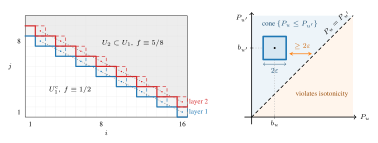
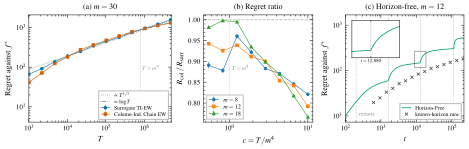
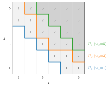

<article class="ltx_document ltx_authors_1line">

<section id="S1" class="ltx_section">
<h2 class="ltx_title ltx_title_section" id="introduction">
1 Introduction</h2>

In online isotonic regression, a learner faces an adversary over a finite partially ordered domain: at each of $T$ rounds the learner observes a query point, predicts $\hat{y}_{t}\in[0,1]\text{,}$ and incurs the squared loss $(\hat{y}_{t}-y_{t})^{2}$ once the label $y_{t}\in[0,1]$ is revealed; its regret is the cumulative loss minus that of the best isotonic function in hindsight, nondecreasing along the partial order. On the chain, the totally ordered case, <cite class="ltx_cite ltx_citemacro_citet">Kotłowski et al. (<a href="#bib.bib2" title="Online isotonic regression" class="ltx_ref">2016</a>)</cite> determined the minimax regret up to logarithmic factors; beyond it, <cite class="ltx_cite ltx_citemacro_citet">Kotłowski et al. (<a href="#bib.bib3" title="Random permutation online isotonic regression" class="ltx_ref">2017</a>)</cite> posed the design of efficient algorithms as a central open problem, and no $\Theta$-level resolution has appeared since. This paper settles the problem on the product orders $[m]^{d}=\{1,\ldots,m\}^{d}\text{,}$ for every fixed dimension $d\geq 2\text{:}$ the minimax regret is characterized at the $\Theta$ level, the characterization is matched in polynomial time, and both statements hold across a family of losses whose boundary we locate. Queries may recur, relaxing the earlier protocols in which each point arrives once <cite class="ltx_cite ltx_citemacro_citep">(Kotłowski et al., <a href="#bib.bib2" title="Online isotonic regression" class="ltx_ref">2016</a>, <a href="#bib.bib3" title="Random permutation online isotonic regression" class="ltx_ref">2017</a>)</cite>, a choice natural for streaming (<a href="#S2.SS1" title="2.1 Setup ‣ 2 The Complexity Formula and the Universal Upper Bound ‣ The Minimax Rate of Online Isotonic Regression on Product Orders" class="ltx_ref">Section 2.1</a>); <a href="#S6" title="6 Discussion ‣ The Minimax Rate of Online Isotonic Regression on Product Orders" class="ltx_ref">Section 6</a> compares the protocols.

<section id="S1.SS0.SSS0.Px1" class="ltx_paragraph">
<h5 class="ltx_title ltx_title_paragraph">Applications.</h5>

Two scenarios motivate the multivariate setting. Two-feature probability calibration is the multivariate form of classical isotonic calibration <cite class="ltx_cite ltx_citemacro_citep">(Zadrozny and Elkan, <a href="#bib.bib17" title="Transforming classifier scores into accurate multiclass probability estimates" class="ltx_ref">2002</a>; Niculescu-Mizil and Caruana, <a href="#bib.bib18" title="Predicting good probabilities with supervised learning" class="ltx_ref">2005</a>; Berta et al., <a href="#bib.bib19" title="Classifier calibration with ROC-regularized isotonic regression" class="ltx_ref">2024</a>)</cite>: the calibrated probability of a deployed classifier is jointly nondecreasing in the model score and in an ordinal covariate. Its natural loss, the entropic (log) loss, is part of the characterization. On UCI Adult, learning on the score-by-covariate grid beats both calibration along the score alone and an unstructured per-cell mean on 20 of 20 splits (<a href="#A1" title="Appendix A Experiments ‣ The Minimax Rate of Online Isotonic Regression on Product Orders" class="ltx_ref">Appendix A</a>). In combination dose-finding, the toxicity probability of a two-agent therapy is monotone in each dose, and the surface is learned along the treatment trajectory <cite class="ltx_cite ltx_citemacro_citep">(Conaway et al., <a href="#bib.bib20" title="Designs for single- or multiple-agent phase I trials" class="ltx_ref">2004</a>; Wages et al., <a href="#bib.bib21" title="Continual reassessment method for partial ordering" class="ltx_ref">2011</a>)</cite>.

</section>
<section id="S1.SS0.SSS0.Px2" class="ltx_paragraph">
<h5 class="ltx_title ltx_title_paragraph">Main results.</h5>

The minimax regret under squared loss is, for every fixed $d\geq 2$ and all integers $m\geq 2\text{,}$ $T\geq 1$ (<a href="#Thmtheorem2" title="Theorem 2 (Main Theorem). ‣ 3.2 The Main Theorem ‣ 3 Matching Lower Bounds and the Characterization ‣ The Minimax Rate of Online Isotonic Regression on Product Orders" class="ltx_ref">Theorem 2</a>),

<table id="S1.Ex2" class="ltx_equation ltx_eqn_table">

<tbody><tr class="ltx_equation ltx_eqn_row ltx_align_baseline">
<td class="ltx_eqn_cell ltx_eqn_center_padleft"></td>
<td class="ltx_eqn_cell ltx_align_center">$$R_{T}^{*}\bigl([m]^{d}\bigr)\;=\;\Theta_{d}\!\left(\min\!\left\{T,\;\inf_{K\in\mathbb{N}_{+}}\!\Bigl[\,2\,H_{[m]^{d}}(K)\,+\,\frac{T}{4K^{2}}\,\Bigr]\right\}\right),\quad H_{\mathcal{P}}(K)\;:=\;\log\Omega(\mathcal{P},K{+}1),$$</td>
<td class="ltx_eqn_cell ltx_eqn_center_padright"></td>
</tr></tbody>
</table>

where, for a finite poset $\mathcal{P}\text{,}$ $\Omega(\mathcal{P},N)$ counts the order-preserving maps into $\{1,\ldots,N\}\text{,}$ the order polynomial of <cite class="ltx_cite ltx_citemacro_citet">Stanley (<a href="#bib.bib6" title="A chromatic-like polynomial for ordered sets" class="ltx_ref">1970</a>)</cite>. The formula balances the two costs of learning on the value grid $\{0,1/K,\ldots,1\}\text{:}$ $H_{[m]^{d}}(K)$ is, up to a factor of two in the resolution, the sup-norm metric entropy of the comparator class, and $T/(4K^{2})$ is the cost of rounding the hindsight optimum onto the grid once its first-order term is canceled (<a href="#S2" title="2 The Complexity Formula and the Universal Upper Bound ‣ The Minimax Rate of Online Isotonic Regression on Product Orders" class="ltx_ref">Section 2</a>). It unfolds into a three-phase law (<a href="#Thmtheorem3" title="Corollary 3 (Three-Phase Scaling Law). ‣ 3.3 The Three Phases and the Phase Criterion ‣ 3 Matching Lower Bounds and the Characterization ‣ The Minimax Rate of Online Isotonic Regression on Product Orders" class="ltx_ref">Corollary 3</a>): $\Theta_{d}(T)$ for $T\lesssim_{d}m^{d-1}$ (Phase 0); $\Theta_{d}(m^{2(d-1)/3}\,T^{1/3})$ for $m^{d-1}\lesssim_{d}T\lesssim_{d}m^{d+2}$ (Phase 1); and $\Theta_{d}(m^{d}[1+\log(T/m^{d+2})])$ beyond (Phase 2), where the grid has decoupled into $m^{d}$ scalar estimation problems. The upper bound in the display holds on every finite poset and, with loss-dependent constants, for every smooth exp-concave loss (<a href="#Thmtheorem1" title="Theorem 1 (Universal Upper Bound). ‣ 2.3 Level-Set Stationarity and the Upper Bound ‣ 2 The Complexity Formula and the Universal Upper Bound ‣ The Minimax Rate of Online Isotonic Regression on Product Orders" class="ltx_ref">Theorem 1</a>); the grids are where we match it. Rectangles $[a]\times[b]$ add a fourth sector that the substitution $m\mapsto\sqrt{ab}$ misses, and the characterization persists at every fixed aspect ratio (<a href="#Thmtheorem66" title="Proposition 66 (Rectangles). ‣ K.5 Rectangles ‣ Appendix K Structured Posets: Proofs ‣ The Minimax Rate of Online Isotonic Regression on Product Orders" class="ltx_ref">Proposition 66</a>). The intermediate phase carries no logarithmic factor; on the chain it does (<a href="#Thmtheorem46" title="Theorem 46 (Chain Complete Minimax). ‣ Order polynomial of the chain. ‣ I.1 Setup and Main Theorem ‣ Appendix I Chain Complete Minimax ‣ The Minimax Rate of Online Isotonic Regression on Product Orders" class="ltx_ref">Theorem 46</a>), and <a href="#S2.SS2" title="2.2 The Order Polynomial Is the Metric Entropy ‣ 2 The Complexity Formula and the Universal Upper Bound ‣ The Minimax Rate of Online Isotonic Regression on Product Orders" class="ltx_ref">Section 2.2</a> traces the difference to the entropy at coarse scales.

The law is stable in the loss: every smooth, exp-concave, strongly proper, bounded loss obeys the same characterization, and so does the entropic loss of calibration, the loss entering only through the constants (<a href="#Thmtheorem2" title="Theorem 2 (Main Theorem). ‣ 3.2 The Main Theorem ‣ 3 Matching Lower Bounds and the Characterization ‣ The Minimax Rate of Online Isotonic Regression on Product Orders" class="ltx_ref">Theorem 2</a>). Absolute and pinball losses change the rate: they obey a square-root law in which resolution plays no part, $\Theta_{d}(\min\{T,\sqrt{m^{d-1}T}\})$ for the absolute loss (<a href="#Thmtheorem56" title="Theorem 56 (Pinball and Absolute Losses on Grids). ‣ J.5 Lipschitz Losses ‣ Appendix J Convex Losses: Proofs ‣ The Minimax Rate of Online Isotonic Regression on Product Orders" class="ltx_ref">Theorem 56</a>). On the algorithmic side, two complementary planar engines (Column-Independent Chain EW and Surrogate Threshold-Indexed EW), a rate-doubling wrapper, and a slicing step combine into a horizon-free polynomial-time learner, rate-optimal for every loss of the <a href="#Thmtheorem2" title="Theorem 2 (Main Theorem). ‣ 3.2 The Main Theorem ‣ 3 Matching Lower Bounds and the Characterization ‣ The Minimax Rate of Online Isotonic Regression on Product Orders" class="ltx_ref">Theorem 2</a> family and every fixed dimension (<a href="#Thmtheorem7" title="Theorem 7 (Slicing). ‣ 5.4 Every Fixed Dimension, Every Loss ‣ 5 Polynomial-Time Algorithms ‣ The Minimax Rate of Online Isotonic Regression on Product Orders" class="ltx_ref">Theorem 7</a>).

</section>
<section id="S1.SS0.SSS0.Px3" class="ltx_paragraph">
<h5 class="ltx_title ltx_title_paragraph">Technical contributions.</h5>

The characterization rests on a small set of mechanisms. For the upper bound, the isotonic fit is stationary on each of its level sets, so rounding onto a resolution-$K$ grid costs $T/K^{2}$ rather than $T/K\text{;}$ aggregation then prices learning at $H_{\mathcal{P}}(K)\text{,}$ and nothing beyond the poset structure is used (<a href="#S2" title="2 The Complexity Formula and the Universal Upper Bound ‣ The Minimax Rate of Online Isotonic Regression on Product Orders" class="ltx_ref">Section 2</a>). The lower bounds come from two general-poset mechanisms (<a href="#S3.SS1" title="3.1 Two Mechanisms ‣ 3 Matching Lower Bounds and the Characterization ‣ The Minimax Rate of Online Isotonic Regression on Product Orders" class="ltx_ref">Section 3.1</a>): independent fair bits toggled across nested frontiers at large central rank levels, which decouple the game into two-point Bernoulli tests, and an independent continuous prior around a strictly isotonic core, which factorizes the posterior cell by cell and feeds the van Trees inequality. On the algorithmic side, for polynomial-time strip decompositions of the grid, every bound the standard exp-concave analysis yields carries a $(\log m)^{2/3}$ entropy overhead through the bulk of the intermediate phase (<a href="#Thmtheorem44" title="Theorem 44 (Strip-Independent Transfer-Matrix Lower Bound). ‣ G.2 Main Theorem and Proof ‣ Appendix G Strip-Independent Transfer-Matrix Lower Bound ‣ The Minimax Rate of Online Isotonic Regression on Product Orders" class="ltx_ref">Theorem 44</a>). Decomposing by threshold layer removes it: exponential weights factorize across the layers of a discretized isotonic function once the nesting constraint is dropped, a surrogate loss dominates the true loss and is exact whenever the layers do nest, and each layer’s prediction is a single $O(m^{2})$ dynamic program (<a href="#S5.SS2" title="5.2 Surrogate Threshold-Indexed Exponential Weights ‣ 5 Polynomial-Time Algorithms ‣ The Minimax Rate of Online Isotonic Regression on Product Orders" class="ltx_ref">Section 5.2</a>). Two choices complete the algorithm: the wrapper doubles the regret budget rather than time, since geometric time epochs forfeit the logarithmic phase; and the slices are planes, the smallest that cost no entropy (<a href="#S5.SS3" title="5.3 Combined Strategy and Horizon-Free Wrapper ‣ 5 Polynomial-Time Algorithms ‣ The Minimax Rate of Online Isotonic Regression on Product Orders" class="ltx_ref">Sections 5.3</a> and <a href="#S5.SS4" title="5.4 Every Fixed Dimension, Every Loss ‣ 5 Polynomial-Time Algorithms ‣ The Minimax Rate of Online Isotonic Regression on Product Orders" class="ltx_ref">5.4</a>).

</section>
<section id="S1.SS0.SSS0.Px4" class="ltx_paragraph">
<h5 class="ltx_title ltx_title_paragraph">Related work.</h5>

<cite class="ltx_cite ltx_citemacro_citet">Kotłowski et al. (<a href="#bib.bib2" title="Online isotonic regression" class="ltx_ref">2016</a>)</cite> and <cite class="ltx_cite ltx_citemacro_citet">Kotłowski et al. (<a href="#bib.bib3" title="Random permutation online isotonic regression" class="ltx_ref">2017</a>)</cite> are the direct predecessors, on the chain and its random-permutation model. Once an entropy estimate is supplied, the framework of <cite class="ltx_cite ltx_citemacro_citet">Rakhlin and Sridharan (<a href="#bib.bib16" title="Online non-parametric regression" class="ltx_ref">2014</a>)</cite> gives the rate as an upper bound and the chaining algorithm of <cite class="ltx_cite ltx_citemacro_citet">Gaillard and Gerchinovitz (<a href="#bib.bib23" title="A chaining algorithm for online nonparametric regression" class="ltx_ref">2015</a>)</cite> attains $O_{d}(m^{2(d-1)/3}\,T^{1/3})$ in Phase 1. What the generic route does not supply is the estimate itself, the matching lower bounds, and a polynomial-time implementation: the covers involved have cardinality $e^{\Theta_{d}(m^{d-1}K)}\text{,}$ and the surrogate engine never materializes one. The adaptive online algorithms of <cite class="ltx_cite ltx_citemacro_citet">Liautaud et al. (<a href="#bib.bib24" title="Minimax-optimal and locally-adaptive online nonparametric regression" class="ltx_ref">2025b</a>, <a href="#bib.bib25" title="Minimax adaptive online nonparametric regression over Besov spaces" class="ltx_ref">a</a>)</cite> operate above the continuity threshold $s&gt;d/p$ of the Besov scale $B^{s}_{p,q}\text{,}$ while monotone surfaces may jump across a monotone curve. On the plane the comparison is exact through embeddings whose norms grow with the design: every fixed integer smoothness $s$ forces an ambient norm of order $m^{s}\text{,}$ so the guarantee a smoothness ball can transfer, $m^{2s/(s+1)}\,T^{1/(s+1)}$ up to logarithms, stays polynomially above the isotonic $m^{2/3}T^{1/3}$ throughout Phase 1 (<a href="#A12" title="Appendix L Metric Entropy and the Nonparametric Position ‣ The Minimax Rate of Online Isotonic Regression on Product Orders" class="ltx_ref">Appendix L</a>). Batch isotonic regression on grids <cite class="ltx_cite ltx_citemacro_citep">(Chatterjee et al., <a href="#bib.bib4" title="On matrix estimation under monotonicity constraints" class="ltx_ref">2018</a>)</cite> studies $L_{2}$ estimation risk, a different quantity from online regret. Ignoring the order entirely, exp-concave aggregation over a fine value grid <cite class="ltx_cite ltx_citemacro_citep">(Vovk, <a href="#bib.bib15" title="A game of prediction with expert advice" class="ltx_ref">1998</a>; Cesa-Bianchi and Lugosi, <a href="#bib.bib1" title="Prediction, learning, and games" class="ltx_ref">2006</a>)</cite> pays $O_{d}(m^{d}\log T)\text{,}$ matching the law only deep in its logarithmic phase. The combinatorial and Bayesian inputs are classical: MacMahon’s box formula <cite class="ltx_cite ltx_citemacro_citep">(MacMahon, <a href="#bib.bib7" title="Combinatory analysis" class="ltx_ref">1916</a>)</cite> behind the planar constants, and the van Trees inequality <cite class="ltx_cite ltx_citemacro_citep">(Gill and Levit, <a href="#bib.bib8" title="Applications of the van Trees inequality: a Bayesian Cramér–Rao bound" class="ltx_ref">1995</a>)</cite> behind the deep-phase lower bound.

</section>
</section>
<section id="S2" class="ltx_section">
<h2 class="ltx_title ltx_title_section" id="the-complexity-formula-and-the-universal-upper-bound">
2 The Complexity Formula and the Universal Upper Bound</h2>

Our characterization is assembled from four components: a universal upper bound, proved here for every finite poset and for the loss class fixed below; two lower-bound mechanisms, developed in <a href="#S3" title="3 Matching Lower Bounds and the Characterization ‣ The Minimax Rate of Online Isotonic Regression on Product Orders" class="ltx_ref">Section 3</a>; and a merging step that collapses the resulting families of bounds into a single tight envelope (<a href="#S3.SS2" title="3.2 The Main Theorem ‣ 3 Matching Lower Bounds and the Characterization ‣ The Minimax Rate of Online Isotonic Regression on Product Orders" class="ltx_ref">Section 3.2</a>, with explicit planar constants in <a href="#A4" title="Appendix D Bridge Lemma ‣ The Minimax Rate of Online Isotonic Regression on Product Orders" class="ltx_ref">Appendix D</a>). This section also fixes what the complexity formula measures: the order polynomial is the metric entropy of the comparator class.

<section id="S2.SS1" class="ltx_subsection">
<h3 class="ltx_title ltx_title_subsection" id="setup">
2.1 Setup</h3>

Let $(\mathcal{P},\preceq)$ be a finite poset with $n:=|\mathcal{P}|\text{.}$ Over $T$ rounds, the adversary chooses $(x_{t},y_{t})\in\mathcal{P}\times[0,1]\text{,}$ with repeated query points allowed, and reveals $x_{t}\text{;}$ the learner predicts $\hat{y}_{t}\in[0,1]\text{,}$ then observes $y_{t}$ and incurs $\ell(\hat{y}_{t},y_{t})\text{.}$ The comparator class consists of the isotonic functions

<table id="S2.Ex3" class="ltx_equation ltx_eqn_table">

<tbody><tr class="ltx_equation ltx_eqn_row ltx_align_baseline">
<td class="ltx_eqn_cell ltx_eqn_center_padleft"></td>
<td class="ltx_eqn_cell ltx_align_center">$$\mathcal{F}_{\mathcal{P}}^{\uparrow}\;:=\;\bigl\{f:\mathcal{P}\to[0,1]\;:\;u\preceq v\Rightarrow f(u)\leq f(v)\bigr\},$$</td>
<td class="ltx_eqn_cell ltx_eqn_center_padright"></td>
</tr></tbody>
</table>

the regret is $R_{T}:=\sum_{t=1}^{T}\ell(\hat{y}_{t},y_{t})-\min_{f\in\mathcal{F}_{\mathcal{P}}^{\uparrow}}\sum_{t=1}^{T}\ell(f(x_{t}),y_{t})\text{,}$ and the minimax regret $R_{T}^{*}(\mathcal{P},\ell):=\inf\sup\mathbb{E}[R_{T}]$ takes the infimum over (possibly randomized) learner strategies and the supremum over (oblivious or adaptive) adversary sequences <cite class="ltx_cite ltx_citemacro_citep">(Cesa-Bianchi and Lugosi, <a href="#bib.bib1" title="Prediction, learning, and games" class="ltx_ref">2006</a>)</cite>. Every upper bound below holds pathwise, on each individual sequence, and is achieved by a deterministic learner; every lower bound is proved via Yao’s principle <cite class="ltx_cite ltx_citemacro_citep">(Yao, <a href="#bib.bib5" title="Probabilistic computations: toward a unified measure of complexity" class="ltx_ref">1977</a>)</cite> against a randomized oblivious adversary and extends automatically to adaptive ones. When the loss is omitted it is the squared loss: $R_{T}^{*}(\mathcal{P}):=R_{T}^{*}(\mathcal{P},\ell_{\mathrm{sq}})$ with $\ell_{\mathrm{sq}}(p,y):=(p-y)^{2}\text{.}$ We reserve $m$ for the side length of the grid $[m]^{d}:=\{1,\ldots,m\}^{d}$ under the product order; $K\in\mathbb{N}_{+}$ denotes a discretization level with grid $G_{K}:=\{0,1/K,\ldots,1\}\text{;}$ logarithms are natural.

Throughout, a loss is a function $\ell:[0,1]^{2}\to[0,\infty]$ whose first argument is the prediction, with $\ell(\cdot,y)$ convex on $[0,1]$ for every $y\text{.}$ We call $\ell$ <em class="ltx_emph ltx_font_italic">curved</em> with parameters $(\eta,\beta,\alpha,\Lambda)$ if for every $y$ the map $p\mapsto e^{-\eta\ell(p,y)}$ is concave on $[0,1]$ ($\eta$-exp-concavity) and the derivative $\partial_{1}\ell(\cdot,y)$ in the prediction is $\beta$-Lipschitz ($\beta$-smoothness); if $0\leq\ell\leq\Lambda$ on $[0,1]^{2}\text{;}$ and if $\ell$ is <em class="ltx_emph ltx_font_italic">$\alpha$-strongly proper on $[\tfrac{1}{4},\tfrac{3}{4}]$</em>, meaning

<table id="S2.E1" class="ltx_equation ltx_eqn_table">

<tbody><tr class="ltx_equation ltx_eqn_row ltx_align_baseline">
<td class="ltx_eqn_cell ltx_eqn_center_padleft"></td>
<td class="ltx_eqn_cell ltx_align_center">$$\mathbb{E}_{Y\sim\mathrm{Ber}(p)}\bigl[\ell(q,Y)-\ell(p,Y)\bigr]\;\geq\;\alpha\,(p-q)^{2}\qquad\text{for all }p\in\bigl[\tfrac{1}{4},\tfrac{3}{4}\bigr],\ q\in[0,1],$$</td>
<td class="ltx_eqn_cell ltx_eqn_center_padright"></td>
<td rowspan="1" class="ltx_eqn_cell ltx_eqn_eqno ltx_align_middle ltx_align_right">(1)</td>
</tr></tbody>
</table>

the interior form of strong properness <cite class="ltx_cite ltx_citemacro_citep">(Agarwal, <a href="#bib.bib22" title="Surrogate regret bounds for bipartite ranking via strongly proper losses" class="ltx_ref">2014</a>)</cite>. Exp-concavity and smoothness drive the upper bounds; strong properness and boundedness enter only the lower bounds. The squared loss is curved with $(\eta,\beta,\alpha,\Lambda)=(\tfrac{1}{2},2,1,1)$ and attains equality in (<a href="#S2.E1" title="Equation 1 ‣ 2.1 Setup ‣ 2 The Complexity Formula and the Universal Upper Bound ‣ The Minimax Rate of Online Isotonic Regression on Product Orders" class="ltx_ref">1</a>). The entropic loss $\ell_{\log}(p,y):=-y\log p-(1-y)\log(1-p)\text{,}$ the natural loss for probability calibration, is not smooth; <a href="#Thmtheorem55" title="Theorem 55 (Entropic Upper Bound). ‣ J.4 The Entropic Loss ‣ Appendix J Convex Losses: Proofs ‣ The Minimax Rate of Online Isotonic Regression on Product Orders" class="ltx_ref">Theorem 55</a> treats it separately.

</section>
<section id="S2.SS2" class="ltx_subsection">
<h3 class="ltx_title ltx_title_subsection" id="the-order-polynomial-is-the-metric-entropy">
2.2 The Order Polynomial Is the Metric Entropy</h3>

For $N\in\mathbb{N}_{+}\text{,}$ let $\Omega(\mathcal{P},N)$ denote the number of order-preserving maps $\mathcal{P}\to\{1,\ldots,N\}\text{,}$ the <em class="ltx_emph ltx_font_italic">order polynomial</em> of $\mathcal{P}$ <cite class="ltx_cite ltx_citemacro_citep">(Stanley, <a href="#bib.bib6" title="A chromatic-like polynomial for ordered sets" class="ltx_ref">1970</a>)</cite>. Under the rescaling $k\mapsto(k-1)/K\text{,}$ the maps counted by $\Omega(\mathcal{P},K{+}1)$ are exactly the isotonic functions valued in $G_{K}\text{,}$ and we measure complexity on the logarithmic scale:

<table id="S2.Ex4" class="ltx_equation ltx_eqn_table">

<tbody><tr class="ltx_equation ltx_eqn_row ltx_align_baseline">
<td class="ltx_eqn_cell ltx_eqn_center_padleft"></td>
<td class="ltx_eqn_cell ltx_align_center">$$H_{\mathcal{P}}(K)\;:=\;\log\Omega(\mathcal{P},K{+}1).$$</td>
<td class="ltx_eqn_cell ltx_eqn_center_padright"></td>
</tr></tbody>
</table>

On the chain, $\Omega([n],K{+}1)=\binom{n+K}{K}\text{,}$ the number of non-decreasing $G_{K}$-valued sequences of length $n\text{.}$

The complexity measure is a familiar object in disguise. Write $N_{\infty}(\varepsilon,\mathcal{F}_{\mathcal{P}}^{\uparrow})$ for the smallest number of sup-norm $\varepsilon$-balls in $[0,1]^{\mathcal{P}}$ covering $\mathcal{F}_{\mathcal{P}}^{\uparrow}\text{;}$ up to a factor of two in the resolution, $H_{\mathcal{P}}$ is that metric entropy: $H_{\mathcal{P}}(K_{-})\leq\log N_{\infty}(\varepsilon,\mathcal{F}_{\mathcal{P}}^{\uparrow})\leq H_{\mathcal{P}}(K_{+})$ for $0&lt;\varepsilon&lt;\tfrac{1}{2}\text{,}$ at $K_{+}:=\lceil\tfrac{1}{2\varepsilon}\rceil$ and $K_{-}:=K_{+}-1$ (<a href="#Thmtheorem68" title="Proposition 68 (Entropy Equivalence). ‣ L.1 The Entropy Sandwich ‣ Appendix L Metric Entropy and the Nonparametric Position ‣ The Minimax Rate of Online Isotonic Regression on Product Orders" class="ltx_ref">Proposition 68</a>). Monotone rounding onto $G_{K_{+}}$ moves every isotonic function by at most $\tfrac{1}{2K_{+}}\leq\varepsilon\text{,}$ giving the cover; two distinct $G_{K_{-}}$-valued isotonic functions are more than $2\varepsilon$ apart in sup norm, so no $\varepsilon$-ball contains two. <a href="#A12" title="Appendix L Metric Entropy and the Nonparametric Position ‣ The Minimax Rate of Online Isotonic Regression on Product Orders" class="ltx_ref">Appendix L</a> records the details, together with the position of this entropy law among the classical nonparametric scales.

On grids the law has two regimes: for every fixed $d\geq 2\text{,}$ uniformly over $m\geq 2$ and $K\geq 1\text{,}$

<table id="S2.Ex5" class="ltx_equation ltx_eqn_table">

<tbody><tr class="ltx_equation ltx_eqn_row ltx_align_baseline">
<td class="ltx_eqn_cell ltx_eqn_center_padleft"></td>
<td class="ltx_eqn_cell ltx_align_center">$$H_{[m]^{d}}(K)\;=\;\begin{cases}\Theta_{d}\bigl(m^{d-1}K\bigr),&amp;1\leq K\leq m,\\[2.84526pt] \Theta_{d}\bigl(m^{d}\bigl[1+\log\tfrac{K}{m}\bigr]\bigr),&amp;K\geq m\end{cases}$$</td>
<td class="ltx_eqn_cell ltx_eqn_center_padright"></td>
</tr></tbody>
</table>

(<a href="#Thmtheorem62" title="Lemma 62 (Grid Entropy). ‣ K.2 Grid Entropy ‣ Appendix K Structured Posets: Proofs ‣ The Minimax Rate of Online Isotonic Regression on Product Orders" class="ltx_ref">Lemma 62</a>, proved in <a href="#A11" title="Appendix K Structured Posets: Proofs ‣ The Minimax Rate of Online Isotonic Regression on Product Orders" class="ltx_ref">Appendix K</a>). In metric-entropy form, via <a href="#Thmtheorem68" title="Proposition 68 (Entropy Equivalence). ‣ L.1 The Entropy Sandwich ‣ Appendix L Metric Entropy and the Nonparametric Position ‣ The Minimax Rate of Online Isotonic Regression on Product Orders" class="ltx_ref">Proposition 68</a>, this reads $\log N_{\infty}(\varepsilon,\mathcal{F}_{[m]^{d}}^{\uparrow})=\Theta_{d}(m^{d-1}/\varepsilon)$ for $1/m\lesssim\varepsilon&lt;\tfrac{1}{2}$ and $\Theta_{d}(m^{d}[1+\log\tfrac{1}{m\varepsilon}])$ below that scale. At coarse scales the entropy is linear in $1/\varepsilon\text{,}$ with no logarithmic correction. The chain differs exactly there: $\log N_{\infty}(\varepsilon,\mathcal{F}_{[n]}^{\uparrow})=\Theta(\varepsilon^{-1}\log(en\varepsilon))$ for $\varepsilon\gtrsim 1/n\text{,}$ and this logarithm is the entropic source of the logarithmic factor that the chain’s rate carries at intermediate horizons (<a href="#Thmtheorem46" title="Theorem 46 (Chain Complete Minimax). ‣ Order polynomial of the chain. ‣ I.1 Setup and Main Theorem ‣ Appendix I Chain Complete Minimax ‣ The Minimax Rate of Online Isotonic Regression on Product Orders" class="ltx_ref">Theorem 46</a>) and that grids of every dimension avoid. The same law governs the sequential covering numbers of <cite class="ltx_cite ltx_citemacro_citet">Rakhlin and Sridharan (<a href="#bib.bib16" title="Online non-parametric regression" class="ltx_ref">2014</a>)</cite>, which coincide with the metric ones for horizons of at least $|\mathcal{P}|$ (<a href="#A12" title="Appendix L Metric Entropy and the Nonparametric Position ‣ The Minimax Rate of Online Isotonic Regression on Product Orders" class="ltx_ref">Appendix L</a>).

</section>
<section id="S2.SS3" class="ltx_subsection">
<h3 class="ltx_title ltx_title_subsection" id="level-set-stationarity-and-the-upper-bound">
2.3 Level-Set Stationarity and the Upper Bound</h3>

The upper bound has two costs: aggregating over the grid class, and rounding the hindsight optimum onto it. Aggregation is standard: running exponential weights over the $\Omega(\mathcal{P},K{+}1)$ grid-valued isotonic functions costs $\tfrac{1}{\eta}H_{\mathcal{P}}(K)$ for an $\eta$-exp-concave loss. Rounding is where the exponent is decided: it moves each comparator value by at most $\tfrac{1}{2K}\text{,}$ so a first-order estimate pays $O(T/K)\text{;}$ reaching $T/K^{2}$ requires the first-order term to cancel. The cancellation is a property of the isotonic fit itself, valid for every differentiable convex loss: on each of its level sets, the fitted value is stationary.

Let $f^{*}$ minimize the comparator loss $\sum_{t=1}^{T}\ell(f(x_{t}),y_{t})$ over $\mathcal{F}_{\mathcal{P}}^{\uparrow}\text{,}$ write $w_{u}:=|\{t:x_{t}=u\}|$ and $B_{c}:=\{u\in\mathcal{P}:w_{u}&gt;0,\ f^{*}(u)=c\}$ for the queried part of a level set of $f^{*}\text{,}$ and set $w_{B_{c}}:=\sum_{u\in B_{c}}w_{u}\text{.}$ Then

<table id="S2.Ex6" class="ltx_equation ltx_eqn_table">

<tbody><tr class="ltx_equation ltx_eqn_row ltx_align_baseline">
<td class="ltx_eqn_cell ltx_eqn_center_padleft"></td>
<td class="ltx_eqn_cell ltx_align_center">$$\sum_{t\,:\,x_{t}\in B_{c}}\partial_{1}\ell(c,y_{t})\;=\;0\qquad\text{for every }c\in(0,1),$$</td>
<td class="ltx_eqn_cell ltx_eqn_center_padright"></td>
</tr></tbody>
</table>

the one-sided sums being nonnegative at $c=0$ and nonpositive at $c=1$ (<a href="#Thmtheorem50" title="Lemma 50 (Level-Set Stationarity). ‣ J.1 Level-Set Stationarity ‣ Appendix J Convex Losses: Proofs ‣ The Minimax Rate of Online Isotonic Regression on Product Orders" class="ltx_ref">Lemma 50</a>). The proof shifts the <em class="ltx_emph ltx_font_italic">complete</em> level set, unqueried elements included, by $\pm\epsilon\text{:}$ strict relations across its boundary have positive gaps, so the shifted function stays isotonic, and $\epsilon=0$ minimizes a differentiable function of one variable (<a href="#A10" title="Appendix J Convex Losses: Proofs ‣ The Minimax Rate of Online Isotonic Regression on Product Orders" class="ltx_ref">Appendix J</a>). For the squared loss this sharpens to the exact zero-mean identity $\sum_{t:x_{t}\in B_{c}}(f^{*}(x_{t})-y_{t})=0$ at every fitted level (<a href="#Thmtheorem8" title="Lemma 8 (Block Residual). ‣ Recall. ‣ Appendix B Block Residual Property ‣ The Minimax Rate of Online Isotonic Regression on Product Orders" class="ltx_ref">Lemma 8</a>), which on the chain is the classical pooled-averaging property through which <cite class="ltx_cite ltx_citemacro_citet">Kotłowski et al. (<a href="#bib.bib2" title="Online isotonic regression" class="ltx_ref">2016</a>)</cite> dispense with chaining; on a general poset a level set need not be connected, and the identity survives by summing over the complete level set. Together with the aggregation step, stationarity yields the upper bound.

<h6 class="ltx_title ltx_runin ltx_title_theorem">
Theorem 1 (Universal Upper Bound).
</h6>

Fix a finite poset $\mathcal{P}\text{,}$ an integer $T\geq 1\text{,}$ and a loss $\ell$ with $\ell(\cdot,y)$ convex, $\eta$-exp-concave, and $\beta$-smooth on $[0,1]$ for every $y\text{.}$ There exists a deterministic online learner achieving, for every sequence $(x_{t},y_{t})_{t=1}^{T}\in\mathcal{P}\times[0,1]\text{,}$

<table id="S2.Ex7" class="ltx_equation ltx_eqn_table">

<tbody><tr class="ltx_equation ltx_eqn_row ltx_align_baseline">
<td class="ltx_eqn_cell ltx_eqn_center_padleft"></td>
<td class="ltx_eqn_cell ltx_align_center">$$R_{T}\;\leq\;\inf_{K\in\mathbb{N}_{+}}\Bigl\{\,\tfrac{1}{\eta}\,H_{\mathcal{P}}(K)+\tfrac{\beta T}{8K^{2}}\,\Bigr\}.$$</td>
<td class="ltx_eqn_cell ltx_eqn_center_padright"></td>
</tr></tbody>
</table>

For the squared loss, with $(\eta,\beta)=(\tfrac{1}{2},2)\text{,}$ this reads

<table id="S2.E2" class="ltx_equation ltx_eqn_table">

<tbody><tr class="ltx_equation ltx_eqn_row ltx_align_baseline">
<td class="ltx_eqn_cell ltx_eqn_center_padleft"></td>
<td class="ltx_eqn_cell ltx_align_center">$$R_{T}\;\leq\;\Psi_{\mathcal{P}}(T)\;:=\;\inf_{K\in\mathbb{N}_{+}}\Bigl\{\,2H_{\mathcal{P}}(K)+\frac{T}{4K^{2}}\,\Bigr\},$$</td>
<td class="ltx_eqn_cell ltx_eqn_center_padright"></td>
<td rowspan="1" class="ltx_eqn_cell ltx_eqn_eqno ltx_align_middle ltx_align_right">(2)</td>
</tr></tbody>
</table>

and in particular $R_{T}^{*}(\mathcal{P})\leq\Psi_{\mathcal{P}}(T)\text{.}$

The two loss parameters enter homogeneously. Write $G(a,b):=\inf_{K\in\mathbb{N}_{+}}\{aH_{\mathcal{P}}(K)+b\,T/K^{2}\}\text{,}$ so that $\Psi_{\mathcal{P}}(T)=G(2,\tfrac{1}{4})$ while <a href="#Thmtheorem1" title="Theorem 1 (Universal Upper Bound). ‣ 2.3 Level-Set Stationarity and the Upper Bound ‣ 2 The Complexity Formula and the Universal Upper Bound ‣ The Minimax Rate of Online Isotonic Regression on Product Orders" class="ltx_ref">Theorem 1</a> gives $G(\tfrac{1}{\eta},\tfrac{\beta}{8})\text{.}$ Monotonicity and positive homogeneity in $(a,b)$ then place the latter between $\min\{\tfrac{1}{2\eta},\tfrac{\beta}{2}\}\,\Psi_{\mathcal{P}}(T)$ and $\max\{\tfrac{1}{2\eta},\tfrac{\beta}{2}\}\,\Psi_{\mathcal{P}}(T)\text{:}$ across the curved class, the loss moves the upper bound by a constant factor only.

The entropic loss of calibration obeys the same envelope. Being $1$-exp-concave with curvature diverging at the endpoints, it lies outside <a href="#Thmtheorem1" title="Theorem 1 (Universal Upper Bound). ‣ 2.3 Level-Set Stationarity and the Upper Bound ‣ 2 The Complexity Formula and the Universal Upper Bound ‣ The Minimax Rate of Online Isotonic Regression on Product Orders" class="ltx_ref">Theorem 1</a>, and two ingredients replace smoothness. The rounding cost becomes exact: replacing a fitted level $c$ by $z$ costs precisely $w_{B_{c}}\mathrm{kl}(c\,\|\,z)$ with $\mathrm{kl}$ the binary Kullback–Leibler divergence, the Bregman block identity that <a href="#Thmtheorem50" title="Lemma 50 (Level-Set Stationarity). ‣ J.1 Level-Set Stationarity ‣ Appendix J Convex Losses: Proofs ‣ The Minimax Rate of Online Isotonic Regression on Product Orders" class="ltx_ref">Lemma 50</a> yields for $\ell_{\log}\text{;}$ and the right grid is nonuniform, the arcsine levels $\sin^{2}\bigl(\tfrac{(2k+1)\pi}{4(K+1)}\bigr)\text{,}$ $k=0,\ldots,K\text{,}$ of <cite class="ltx_cite ltx_citemacro_citet">Kotłowski et al. (<a href="#bib.bib2" title="Online isotonic regression" class="ltx_ref">2016</a>, Section 7.1)</cite> having KL covering radius below $14/K^{2}$ under monotone rounding. Aggregating at rate $1$ over the $\Omega(\mathcal{P},K{+}1)$ isotonic maps into those levels gives $R_{T}\leq\inf_{K}\{H_{\mathcal{P}}(K)+14\,T/K^{2}\}\text{,}$ again $\Theta(\Psi_{\mathcal{P}}(T))$ by the comparison above (<a href="#Thmtheorem55" title="Theorem 55 (Entropic Upper Bound). ‣ J.4 The Entropic Loss ‣ Appendix J Convex Losses: Proofs ‣ The Minimax Rate of Online Isotonic Regression on Product Orders" class="ltx_ref">Theorem 55</a> in <a href="#A10" title="Appendix J Convex Losses: Proofs ‣ The Minimax Rate of Online Isotonic Regression on Product Orders" class="ltx_ref">Appendix J</a>).

</section>
</section>
<section id="S3" class="ltx_section">
<h2 class="ltx_title ltx_title_section" id="matching-lower-bounds-and-the-characterization">
3 Matching Lower Bounds and the Characterization</h2>

<section id="S3.SS1" class="ltx_subsection">
<h3 class="ltx_title ltx_title_subsection" id="two-mechanisms">
3.1 Two Mechanisms</h3>

Our first mechanism supplies what the generic route to online nonparametric lower bounds lacks on this class: a family of isotonic functions realizing a shattering with equalities and with independent coordinates. The relevant fat-shattering branch <cite class="ltx_cite ltx_citemacro_citep">(Rakhlin and Sridharan, <a href="#bib.bib16" title="Online non-parametric regression" class="ltx_ref">2014</a>, Theorem 3)</cite> concerns a modified class, its proof adjoining external functions that need not be isotonic. Below the design resolution $1/m$ the class contains no such family, and our second mechanism argues directly with a continuous prior (<a href="#A12" title="Appendix L Metric Entropy and the Nonparametric Position ‣ The Minimax Rate of Online Isotonic Regression on Product Orders" class="ltx_ref">Appendix L</a>).

Both mechanisms are randomized isotonic adversaries whose posteriors factorize. Mechanism I needs a graded order with many large consecutive central rank levels: independent fair bits toggle the points of $K$ such levels across $K$ nested frontiers, every realization of the bits yields an isotonic function, and each probed point’s value depends on its own bit alone (<em class="ltx_emph ltx_font_italic">Complete Isolation</em>), so the game decouples into independent two-point Bernoulli tests. Mechanism II needs a <em class="ltx_emph ltx_font_italic">separated core</em>, an isotonic $b:\mathcal{P}\to[\tfrac{1}{3},\tfrac{2}{3}]$ that rises by at least $4\varepsilon$ across every strict relation: perturbing each value of $b$ independently by at most $\varepsilon$ keeps every realization inside the isotonic cone, the posterior factorizes across points, and the van Trees inequality <cite class="ltx_cite ltx_citemacro_citep">(Gill and Levit, <a href="#bib.bib8" title="Applications of the van Trees inequality: a Bayesian Cramér–Rao bound" class="ltx_ref">1995</a>)</cite> lower-bounds the estimation error at every query count. Planarity and MacMahon’s formula enter the sharp constants and the fast dynamic programs of <a href="#S5" title="5 Polynomial-Time Algorithms ‣ The Minimax Rate of Online Isotonic Regression on Product Orders" class="ltx_ref">Section 5</a>, never the mechanisms themselves. <a href="#S3.F1" title="In 3.1 Two Mechanisms ‣ 3 Matching Lower Bounds and the Characterization ‣ The Minimax Rate of Online Isotonic Regression on Product Orders" class="ltx_ref">Figure 1</a> shows both in their planar form.

<figure id="S3.F1" class="ltx_figure">

<figcaption class="ltx_caption ltx_centering">Figure 1: The two lower-bound mechanisms. Left: Mechanism I on the
plane at $m=16\text{,}$ $K=2\text{.}$ Solid staircases are the two nested frontiers,
dashed segments a frontier’s alternative course when a bit is $0\text{,}$ and dots the probed
points, one per column pair in each layer; same-layer probes align along an
anti-diagonal path. Right: Mechanism II in the slice of one strict pair
$u\prec u^{\prime}\text{,}$ the prior support square sitting inside the isotonic cone with
margins at least $2\varepsilon\text{.}$</figcaption>
</figure>
</section>
<section id="S3.SS2" class="ltx_subsection">
<h3 class="ltx_title ltx_title_subsection" id="the-main-theorem">
3.2 The Main Theorem</h3>

On the grids $[m]^{d}$ the two mechanisms match the universal upper bound in every fixed dimension, across the loss class.

<h6 class="ltx_title ltx_runin ltx_title_theorem">
Theorem 2 (Main Theorem).
</h6>

Fix an integer $d\geq 2\text{,}$ and let $\ell$ be a curved loss with parameters $(\eta,\beta,\alpha,\Lambda)$ or the entropic loss. For all integers $m\geq 2$ and $T\geq 1\text{,}$

<table id="S3.Ex8" class="ltx_equation ltx_eqn_table">

<tbody><tr class="ltx_equation ltx_eqn_row ltx_align_baseline">
<td class="ltx_eqn_cell ltx_eqn_center_padleft"></td>
<td class="ltx_eqn_cell ltx_align_center">$$R_{T}^{*}\bigl([m]^{d},\ell\bigr)\;=\;\Theta\bigl(\min\bigl\{T,\;\Psi_{[m]^{d}}(T)\bigr\}\bigr),$$</td>
<td class="ltx_eqn_cell ltx_eqn_center_padright"></td>
</tr></tbody>
</table>

with implied constants depending only on $d$ and the loss parameters.

The content of the theorem is geometric: the formula holds in every dimension through the same two mechanisms, and the entire loss dependence collapses into the constant, so the rate is governed by the entropy profile $H_{[m]^{d}}\text{.}$

<section id="S3.SS2.SSS0.Px1" class="ltx_paragraph">
<h5 class="ltx_title ltx_title_paragraph">Proof architecture.</h5>

The upper bound follows by evaluating <a href="#Thmtheorem1" title="Theorem 1 (Universal Upper Bound). ‣ 2.3 Level-Set Stationarity and the Upper Bound ‣ 2 The Complexity Formula and the Universal Upper Bound ‣ The Minimax Rate of Online Isotonic Regression on Product Orders" class="ltx_ref">Theorems 1</a> and <a href="#Thmtheorem55" title="Theorem 55 (Entropic Upper Bound). ‣ J.4 The Entropic Loss ‣ Appendix J Convex Losses: Proofs ‣ The Minimax Rate of Online Isotonic Regression on Product Orders" class="ltx_ref">55</a> through <a href="#Thmtheorem62" title="Lemma 62 (Grid Entropy). ‣ K.2 Grid Entropy ‣ Appendix K Structured Posets: Proofs ‣ The Minimax Rate of Online Isotonic Regression on Product Orders" class="ltx_ref">Lemma 62</a>. The two mechanisms run along the rank levels $A_{s}:=\{x\in[m]^{d}:\sum_{i}(x_{i}-1)=s\}\text{,}$ of which at least $m/2$ consecutive central ones carry at least $m^{d-1}/(2d)$ points apiece by the unimodality of $(|A_{s}|)_{s}\text{,}$ the only combinatorial input the grids require. Both price rounds through the posterior. A Mechanism I bit stays uncertain across the $\Theta(K^{2})$ rounds of its episode, its two candidate values differing by $\Theta(1/K)\text{,}$ so every informative round costs $\Omega(1/K^{2})\text{;}$ with $\Theta_{d}(m^{d-1}K)$ bits to resolve on $K\leq m/2$ of those levels, the ensemble yields $R_{T}^{*}([m]^{d})\gtrsim_{d}\min\{m^{d-1}K,\,T/K^{2}\}\text{,}$ and $T$ decides which branch of the minimum binds. Mechanism II perturbs the rank function itself, a separated core; each of the $m^{d}$ cells then receives $\Theta_{d}(T/m^{d})$ queries, and van Trees converts that query count into a per-cell estimation error, yielding $R_{T}^{*}([m]^{d})\geq\tfrac{3}{16}\,m^{d}\log\bigl(1+\tfrac{T}{540\,d^{2}m^{d+2}}\bigr)$ for $T\geq m^{d}\text{.}$ A curved loss enters the argument at exactly two points, the posterior-variance step of the bit ensemble and the regret-to-squared-error reduction of the separated core, where (<a href="#S2.E1" title="Equation 1 ‣ 2.1 Setup ‣ 2 The Complexity Formula and the Universal Upper Bound ‣ The Minimax Rate of Online Isotonic Regression on Product Orders" class="ltx_ref">1</a>) substitutes the factor $\alpha\text{;}$ every other step concerns the Bernoulli observation law alone, and Pinsker’s inequality supplies $\alpha=2$ for the entropic loss. An elementary envelope comparison assembles these bounds into $\min\{T,\Psi_{[m]^{d}}(T)\}\text{.}$ Full proofs: <a href="#A11" title="Appendix K Structured Posets: Proofs ‣ The Minimax Rate of Online Isotonic Regression on Product Orders" class="ltx_ref">Appendix K</a> for the constructions and the merging, <a href="#A10" title="Appendix J Convex Losses: Proofs ‣ The Minimax Rate of Online Isotonic Regression on Product Orders" class="ltx_ref">Appendix J</a> for the loss substitutions; the planar squared-loss case carries the explicit constant $(1088\cdot 342)^{-1}$ through <a href="#A4" title="Appendix D Bridge Lemma ‣ The Minimax Rate of Online Isotonic Regression on Product Orders" class="ltx_ref">Appendix D</a>.

In dimension one the grid is the chain, whose complete law is <a href="#Thmtheorem46" title="Theorem 46 (Chain Complete Minimax). ‣ Order polynomial of the chain. ‣ I.1 Setup and Main Theorem ‣ Appendix I Chain Complete Minimax ‣ The Minimax Rate of Online Isotonic Regression on Product Orders" class="ltx_ref">Theorem 46</a>: at intermediate horizons the rate is $\Theta(T^{1/3}L_{T}^{2/3})$ with $L_{T}:=1+\log_{+}(n^{3}/T)$ and $\log_{+}x:=\max\{\log x,0\}\text{,}$ the logarithmic factor announced by the chain’s entropy in <a href="#S2.SS2" title="2.2 The Order Polynomial Is the Metric Entropy ‣ 2 The Complexity Formula and the Universal Upper Bound ‣ The Minimax Rate of Online Isotonic Regression on Product Orders" class="ltx_ref">Section 2.2</a> and avoided in every dimension $d\geq 2$ (<a href="#A9" title="Appendix I Chain Complete Minimax ‣ The Minimax Rate of Online Isotonic Regression on Product Orders" class="ltx_ref">Appendix I</a>).

</section>
</section>
<section id="S3.SS3" class="ltx_subsection">
<h3 class="ltx_title ltx_title_subsection" id="the-three-phases-and-the-phase-criterion">
3.3 The Three Phases and the Phase Criterion</h3>

Evaluating the envelope of <a href="#Thmtheorem2" title="Theorem 2 (Main Theorem). ‣ 3.2 The Main Theorem ‣ 3 Matching Lower Bounds and the Characterization ‣ The Minimax Rate of Online Isotonic Regression on Product Orders" class="ltx_ref">Theorem 2</a> through <a href="#Thmtheorem62" title="Lemma 62 (Grid Entropy). ‣ K.2 Grid Entropy ‣ Appendix K Structured Posets: Proofs ‣ The Minimax Rate of Online Isotonic Regression on Product Orders" class="ltx_ref">Lemma 62</a> yields the scaling law.

<h6 class="ltx_title ltx_runin ltx_title_theorem">
Corollary 3 (Three-Phase Scaling Law).
</h6>

Fix $d$ and $\ell$ as in <a href="#Thmtheorem2" title="Theorem 2 (Main Theorem). ‣ 3.2 The Main Theorem ‣ 3 Matching Lower Bounds and the Characterization ‣ The Minimax Rate of Online Isotonic Regression on Product Orders" class="ltx_ref">Theorem 2</a>. For all integers $m\geq 2$ and $T\geq 1\text{,}$

<table id="S3.E3" class="ltx_equation ltx_eqn_table">

<tbody><tr class="ltx_equation ltx_eqn_row ltx_align_baseline">
<td class="ltx_eqn_cell ltx_eqn_center_padleft"></td>
<td class="ltx_eqn_cell ltx_align_center">$$R_{T}^{*}([m]^{d},\ell)\;=\;\begin{cases}\Theta_{d}(T),&amp;T\lesssim_{d}m^{d-1}\quad\text{(Phase 0),}\\[2.0pt] \Theta_{d}\bigl(m^{2(d-1)/3}\,T^{1/3}\bigr),&amp;m^{d-1}\lesssim_{d}T\lesssim_{d}m^{d+2}\quad\text{(Phase 1),}\\[2.0pt] \Theta_{d}\bigl(m^{d}\,\bigl[1+\log\tfrac{T}{m^{d+2}}\bigr]\bigr),&amp;T\gtrsim_{d}m^{d+2}\quad\text{(Phase 2),}\end{cases}$$</td>
<td class="ltx_eqn_cell ltx_eqn_center_padright"></td>
<td rowspan="1" class="ltx_eqn_cell ltx_eqn_eqno ltx_align_middle ltx_align_right">(3)</td>
</tr></tbody>
</table>

with implied constants depending also on the loss parameters.

The optimization behind (<a href="#S3.E3" title="Equation 3 ‣ Corollary 3 (Three-Phase Scaling Law). ‣ 3.3 The Three Phases and the Phase Criterion ‣ 3 Matching Lower Bounds and the Characterization ‣ The Minimax Rate of Online Isotonic Regression on Product Orders" class="ltx_ref">3</a>) is part of the proof of <a href="#Thmtheorem2" title="Theorem 2 (Main Theorem). ‣ 3.2 The Main Theorem ‣ 3 Matching Lower Bounds and the Characterization ‣ The Minimax Rate of Online Isotonic Regression on Product Orders" class="ltx_ref">Theorem 2</a> in <a href="#A11" title="Appendix K Structured Posets: Proofs ‣ The Minimax Rate of Online Isotonic Regression on Product Orders" class="ltx_ref">Appendix K</a>. The phases have a physical reading: in Phase 0 the adversary lacks the budget to activate the combinatorial structure and every round costs $\Theta(1)\text{;}$ in Phase 1 a $K$-layer frontier balances its $\Theta_{d}(m^{d-1}K)$ bits against the observation cost $T/K^{2}$ at $K^{*}\asymp_{d}(T/m^{d-1})^{1/3}\text{;}$ in Phase 2 the $m^{d}$ cells decouple into independent scalar estimation problems and the regret turns logarithmic.

On the plane both the entropy and the envelope are exact. Order-preserving maps $[m]^{2}\to\{1,\ldots,K{+}1\}$ are in bijection with plane partitions in an $m\times m\times K$ box, and MacMahon’s formula counts them.

<h6 class="ltx_title ltx_runin ltx_title_theorem">
Theorem 4 (MacMahon’s Formula <cite class="ltx_cite ltx_citemacro_citep">(MacMahon, <a href="#bib.bib7" title="Combinatory analysis" class="ltx_ref">1916</a>)</cite>).
</h6>

For all integers $m,K\geq 1\text{,}$

<table id="S3.E4" class="ltx_equation ltx_eqn_table">

<tbody><tr class="ltx_equation ltx_eqn_row ltx_align_baseline">
<td class="ltx_eqn_cell ltx_eqn_center_padleft"></td>
<td class="ltx_eqn_cell ltx_align_center">$$\Omega([m]^{2},K{+}1)\;=\;\prod_{i=1}^{m}\prod_{j=1}^{m}\frac{K+i+j-1}{i+j-1}.$$</td>
<td class="ltx_eqn_cell ltx_eqn_center_padright"></td>
<td rowspan="1" class="ltx_eqn_cell ltx_eqn_eqno ltx_align_middle ltx_align_right">(4)</td>
</tr></tbody>
</table>

Taking logarithms in (<a href="#S3.E4" title="Equation 4 ‣ Theorem 4 (MacMahon’s Formula (MacMahon, 1916)). ‣ 3.3 The Three Phases and the Phase Criterion ‣ 3 Matching Lower Bounds and the Characterization ‣ The Minimax Rate of Online Isotonic Regression on Product Orders" class="ltx_ref">4</a>) turns the count into a double sum, and an Euler–Maclaurin expansion of it gives the planar entropy law $H_{[m]^{2}}(K)=m^{2}\,\varphi(K/m)+O(\log m)\text{,}$ the error uniform in $K\text{,}$ with $\varphi(\alpha):=\int_{0}^{1}\!\!\int_{0}^{1}\log\bigl(1+\tfrac{\alpha}{s+t}\bigr)\,ds\,dt$ the Riemann limit of that sum (<a href="#Thmtheorem14" title="Lemma 14 (Log-Order-Polynomial Asymptotic). ‣ C.5 Main-Text Form ‣ Appendix C Asymptotic Analysis ‣ The Minimax Rate of Online Isotonic Regression on Product Orders" class="ltx_ref">Lemma 14</a>). The three-phase law sharpens accordingly, to $\Psi_{[m]^{2}}(T)=m^{2}\,\psi(T/m^{4})+O(m)$ as $T/m\to\infty$ with $\psi(c):=\inf_{\alpha&gt;0}\{2\varphi(\alpha)+c/(4\alpha^{2})\}$ (<a href="#A3" title="Appendix C Asymptotic Analysis ‣ The Minimax Rate of Online Isotonic Regression on Product Orders" class="ltx_ref">Appendix C</a>), and the Phase-1 constant lies between $7^{-7/3}\approx 0.0107$ and $\bigl(\tfrac{3\log 2}{4}\bigr)^{2/3}\approx 0.6465$ (<a href="#A13" title="Appendix M The Phase-1 Constant ‣ The Minimax Rate of Online Isotonic Regression on Product Orders" class="ltx_ref">Appendix M</a>).

Which phases can occur is governed by the shape of $H_{\mathcal{P}}\text{.}$ Truncation at level $K$ splits an isotonic map valued in $\{0,\ldots,K{+}L\}$ injectively into one valued in $\{0,\ldots,K\}$ plus one valued in $\{0,\ldots,L\}\text{,}$ so $H_{\mathcal{P}}(K{+}L)\leq H_{\mathcal{P}}(K)+H_{\mathcal{P}}(L)\text{:}$ on every finite poset the entropy is subadditive, hence at most linear in $K\text{.}$ On a power-law window $H_{\mathcal{P}}(K)\asymp K^{\rho}$ this forces $\rho\leq 1\text{,}$ and balancing $K^{\rho}$ against $T/K^{2}$ caps the intermediate exponent of the envelope at $\rho/(\rho+2)\leq\tfrac{1}{3}\text{.}$ The regret never exceeds the envelope, so no finite poset sustains an intermediate phase with a larger exponent; the grid attains the cap in every dimension: extremal, not special. A linear regime of $H_{\mathcal{P}}$ produces the cube-root phase on every family characterized here, and entropy of the form $n\log(K{+}1)$ produces no intermediate phase at all. Posets of height at most two are of that kind: two antichains carry the whole order, any assignment on either extends isotonically, and the rate is $\Theta(n\log(1+T/n))\text{,}$ which Follow-the-Leader already attains under the squared loss. Fences, whose cover relations alternate in direction along a path, are among them (<a href="#Thmtheorem67" title="Proposition 67 (Height-Two Posets). ‣ K.6 Height-Two Posets ‣ Appendix K Structured Posets: Proofs ‣ The Minimax Rate of Online Isotonic Regression on Product Orders" class="ltx_ref">Proposition 67</a>).

</section>
</section>
<section id="S4" class="ltx_section">
<h2 class="ltx_title ltx_title_section" id="the-lipschitz-boundary">
4 The Lipschitz Boundary</h2>

The universal upper bound rests on two prices: exp-concavity puts aggregation at $\tfrac{1}{\eta}H_{\mathcal{P}}(K)\text{,}$ and smoothness puts rounding at $\beta T/(8K^{2})\text{.}$ A kink degrades both at once: aggregation reverts to the $\sqrt{T\,H_{\mathcal{P}}(K)}$ of a generic bounded convex loss, and rounding turns linear in the resolution. Already on the one-point poset, where the comparator class is the interval $[0,1]\text{,}$ the squared loss has minimax regret $\Theta(\log T)\text{,}$ while under independent fair labels the absolute loss costs every prediction $\tfrac{1}{2}$ per round and lets the better endpoint recover half of $\lvert\sum_{t}(2y_{t}-1)\rvert$ in hindsight, forcing $\Theta(\sqrt{T})$ (<a href="#A10" title="Appendix J Convex Losses: Proofs ‣ The Minimax Rate of Online Isotonic Regression on Product Orders" class="ltx_ref">Appendix J</a>).

For $\tau\in(0,1)\text{,}$ the pinball loss $\ell_{\tau}(p,y):=\tau(y-p)_{+}+(1-\tau)(p-y)_{+}$ is the loss of quantile estimation, with $\rho_{\tau}:=\tau(1-\tau)\text{;}$ the absolute loss is $2\ell_{1/2}\text{.}$ On grids the rate is a square-root law, uniform in the quantile:

<table id="S4.Ex9" class="ltx_equation ltx_eqn_table">

<tbody><tr class="ltx_equation ltx_eqn_row ltx_align_baseline">
<td class="ltx_eqn_cell ltx_eqn_center_padleft"></td>
<td class="ltx_eqn_cell ltx_align_center">$$R_{T}^{*}\bigl([m]^{d},\ell_{\tau}\bigr)\;=\;\Theta_{d}\Bigl(\min\bigl\{\rho_{\tau}T,\;\sqrt{\rho_{\tau}\,m^{d-1}\,T}\bigr\}\Bigr),\quad R_{T}^{*}\bigl([m]^{d},\lvert\cdot\rvert\bigr)\;=\;\Theta_{d}\bigl(\min\{T,\sqrt{m^{d-1}T}\}\bigr)$$</td>
<td class="ltx_eqn_cell ltx_eqn_center_padright"></td>
</tr></tbody>
</table>

(<a href="#Thmtheorem56" title="Theorem 56 (Pinball and Absolute Losses on Grids). ‣ J.5 Lipschitz Losses ‣ Appendix J Convex Losses: Proofs ‣ The Minimax Rate of Online Isotonic Regression on Product Orders" class="ltx_ref">Theorem 56</a>, proved in <a href="#A10" title="Appendix J Convex Losses: Proofs ‣ The Minimax Rate of Online Isotonic Regression on Product Orders" class="ltx_ref">Appendix J</a>). The upper bound aggregates the $e^{H_{[m]^{d}}(1)}$ indicators of upsets, the upward-closed subsets of the grid, under exponential weights: the layer-cake identity $f=\int_{0}^{1}\mathbf{1}\!\left[\cdot\in\{f\geq s\}\right]\,ds$ reduces the linearized regret against $\mathcal{F}_{\mathcal{P}}^{\uparrow}$ to the regret against a single upset, and a small-loss bound, its benchmark $\rho_{\tau}T$ witnessed by the empty and full upsets, yields the rate. The lower bound draws $\mathrm{Ber}(1-\tau)$ labels on one central rank level, where the pinball Bayes risk is flat at $\rho_{\tau}\text{,}$ fair coins at $\tau=\tfrac{1}{2}\text{:}$ the learner pays $\rho_{\tau}$ each round, while the comparator picks the better endpoint at each of the $\Theta_{d}(m^{d-1})$ antichain points independently and collects their binomial fluctuations.

No resolution enters either bound; the grid disappears from the analysis, the upper bound retaining only $H_{[m]^{d}}(1)$ and the lower bound only the size of one rank level. On the plane, $\sqrt{mT}$ is exactly what the single-scale bound of <a href="#A12" title="Appendix L Metric Entropy and the Nonparametric Position ‣ The Minimax Rate of Online Isotonic Regression on Product Orders" class="ltx_ref">Appendix L</a> yields at coarse scales, now met without slack: what stationarity and smoothness together recover for curved losses is what the kink forfeits. The square-root rate is attained efficiently: the grid splits into planes at no cost in entropy, and on the queried one the exponential-weights prediction is a single weighted upset marginal, one call per round to the $O(m^{2})$ dynamic program of <a href="#Thmtheorem38" title="Lemma 38 (Upset Marginal DP). ‣ F.2.2 Upset Marginal DP ‣ F.2 Surrogate Threshold-Indexed Upper Bound ‣ Appendix F Algorithm Proofs ‣ The Minimax Rate of Online Isotonic Regression on Product Orders" class="ltx_ref">Lemma 38</a> (<a href="#A10" title="Appendix J Convex Losses: Proofs ‣ The Minimax Rate of Online Isotonic Regression on Product Orders" class="ltx_ref">Appendix J</a>).

</section>
<section id="S5" class="ltx_section">
<h2 class="ltx_title ltx_title_section" id="polynomial-time-algorithms">
5 Polynomial-Time Algorithms</h2>

Realizing <a href="#Thmtheorem1" title="Theorem 1 (Universal Upper Bound). ‣ 2.3 Level-Set Stationarity and the Upper Bound ‣ 2 The Complexity Formula and the Universal Upper Bound ‣ The Minimax Rate of Online Isotonic Regression on Product Orders" class="ltx_ref">Theorem 1</a> directly means maintaining $e^{H_{\mathcal{P}}(K)}$ experts, exponential in $m^{d-1}$ on grids. This section removes the obstacle: its endpoint is <a href="#Thmtheorem7" title="Theorem 7 (Slicing). ‣ 5.4 Every Fixed Dimension, Every Loss ‣ 5 Polynomial-Time Algorithms ‣ The Minimax Rate of Online Isotonic Regression on Product Orders" class="ltx_ref">Theorem 7</a>, a horizon-free polynomial-time learner rate-optimal on $[m]^{d}$ for every fixed $d$ and every loss of the <a href="#Thmtheorem2" title="Theorem 2 (Main Theorem). ‣ 3.2 The Main Theorem ‣ 3 Matching Lower Bounds and the Characterization ‣ The Minimax Rate of Online Isotonic Regression on Product Orders" class="ltx_ref">Theorem 2</a> family. The route runs through the plane: two complementary engines, their lower envelope made horizon-free by a rate-doubling wrapper, and a slicing step that lifts the planar learner to every dimension.

<section id="S5.SS1" class="ltx_subsection">
<h3 class="ltx_title ltx_title_subsection" id="column-independent-chain-exponential-weights">
5.1 Column-Independent Chain Exponential Weights</h3>

The first engine drops the constraints between columns: each column $i\in[m]$ is treated as an independent chain, carrying its own exponential weights over the $\binom{m+K}{K}$ non-decreasing $G_{K}$-valued functions $\mathcal{F}_{[m],K}^{\uparrow}\text{.}$ Because the squared loss is row-additive, the per-column weight factorizes across rows, and the predictive mean at a query $x_{t}=(i_{t},j_{t})$ reduces to a $(K{+}1)$-state forward-backward dynamic program along the chain, $O(mK)$ per round, only the queried column updating.

Every $f\in\mathcal{F}_{[m]^{2}}^{\uparrow}$ restricts column-wise to a non-decreasing function, so $\mathcal{F}_{[m]^{2}}^{\uparrow}\subseteq\prod_{i=1}^{m}\mathcal{F}_{[m]}^{\uparrow}\text{;}$ enlarging the comparator class cannot decrease the regret, which then splits as $R_{T}\leq\sum_{i=1}^{m}R_{i}\text{.}$ Per column, the chain case of <a href="#Thmtheorem1" title="Theorem 1 (Universal Upper Bound). ‣ 2.3 Level-Set Stationarity and the Upper Bound ‣ 2 The Complexity Formula and the Universal Upper Bound ‣ The Minimax Rate of Online Isotonic Regression on Product Orders" class="ltx_ref">Theorem 1</a> gives $R_{i}\leq 2\log\binom{m+K}{K}+T_{i}/(4K^{2})$ with $T_{i}:=|\{t:i_{t}=i\}|\text{,}$ and $\sum_{i}T_{i}=T\text{,}$ so $R_{T}\leq 2m\log\binom{m+K}{K}+T/(4K^{2})\text{.}$ At a level attaining the infimum, and with $R_{T}\leq T\text{,}$ this gives $R_{T}\leq\min\{T,\Psi_{\mathrm{col}}(T)\}$ with $\Psi_{\mathrm{col}}(T):=\inf_{K\in\mathbb{N}_{+}}\bigl\{2m\,\log\binom{m+K}{K}+T/(4K^{2})\bigr\}$ (<a href="#Thmtheorem35" title="Theorem 35 (Column-Independent Upper Bound). ‣ F.1.4 Proof of Theorem 35 ‣ F.1 Column-Independent Upper Bound ‣ Appendix F Algorithm Proofs ‣ The Minimax Rate of Online Isotonic Regression on Product Orders" class="ltx_ref">Theorem 35</a>, proved in <a href="#A6.SS1" title="F.1 Column-Independent Upper Bound ‣ Appendix F Algorithm Proofs ‣ The Minimax Rate of Online Isotonic Regression on Product Orders" class="ltx_ref">Section F.1</a>).

In Phase 2 ($T\gg m^{4}$), $K^{*}=\Theta(\sqrt{T}/m)$ gives $\Psi_{\mathrm{col}}(T)=\Theta(m^{2}\log(T/m^{4}))\text{,}$ matching <a href="#Thmtheorem3" title="Corollary 3 (Three-Phase Scaling Law). ‣ 3.3 The Three Phases and the Phase Criterion ‣ 3 Matching Lower Bounds and the Characterization ‣ The Minimax Rate of Online Isotonic Regression on Product Orders" class="ltx_ref">Corollary 3</a> at the $\Theta$ level. In Phase 1 the engine pays for the enlargement: for $m\log m\lesssim T\lesssim m^{4}\text{,}$ $\Psi_{\mathrm{col}}(T)=\Theta(m^{2/3}\,T^{1/3}\,[1+\log(m^{4}/T)]^{2/3})\text{,}$ the factor above the minimax rate being of order $(\log m)^{2/3}$ through the bulk of the phase and fading only at its far end. The factor has an algebraic source: dropping the inter-column constraints inflates the entropy from $2H_{[m]^{2}}(K)=\Theta(mK)$ to $2m\log\binom{m+K}{K}=\Theta(mK[1+\log(m/K)])$ for $K\leq m\text{,}$ and the logarithm is not negligible at $K^{*}\ll m\text{.}$ Widening columns to strips does not help: every regret bound the standard exp-concave EW analysis produces for a strip decomposition retains the factor (<a href="#Thmtheorem44" title="Theorem 44 (Strip-Independent Transfer-Matrix Lower Bound). ‣ G.2 Main Theorem and Proof ‣ Appendix G Strip-Independent Transfer-Matrix Lower Bound ‣ The Minimax Rate of Online Isotonic Regression on Product Orders" class="ltx_ref">Theorem 44</a>); closing it takes a different decomposition.

</section>
<section id="S5.SS2" class="ltx_subsection">
<h3 class="ltx_title ltx_title_subsection" id="surrogate-threshold-indexed-exponential-weights">
5.2 Surrogate Threshold-Indexed Exponential Weights</h3>

Decomposing by threshold layer instead closes the gap. The engine has three parts: a Gibbs identity that factorizes the exponential weights across layers once the latent representation is enlarged, a surrogate loss that dominates the true loss on the enlarged representation and is tight on its nested part, and an $O(m^{2})$ dynamic program for upset marginals.

<section id="S5.SS2.SSS0.Px1" class="ltx_paragraph">
<h5 class="ltx_title ltx_title_paragraph">Gibbs layering.</h5>

For $h:[m]^{2}\to\{0,1,\ldots,K\}$ and $u\in[m]^{2}\text{,}$ $h(u)=\sum_{r}\mathbf{1}\!\left[h(u)\geq r\right]$ and $h(u)^{2}=\sum_{r}(2r-1)\,\mathbf{1}\!\left[h(u)\geq r\right]\text{,}$
the first identity writing $h$ as the count of thresholds it exceeds, the second following from the first via $\sum_{r=1}^{k}(2r-1)=k^{2}\text{.}$ Substituted into the exponential weight $\exp(-\tfrac{1}{2}\sum_{s&lt;t}(g(x_{s})-y_{s})^{2})$ of a grid function $g=h/K\text{,}$ they factorize the weight into per-layer, per-cell factors indexed by the threshold upsets $U_{r}(h):=\{h\geq r\}\text{;}$ once the nesting constraint on the tuple $(U_{1},\ldots,U_{K})$ is dropped, the factorization is complete and the weights update layer by layer. In the other direction, for $z_{1},\ldots,z_{K}\in\{0,1\}$ with $k:=\sum_{r}z_{r}\text{,}$ the strictly increasing coefficients give $\sum_{r}(2r-1)\,z_{r}\geq k^{2}\text{,}$ with equality exactly when $(z_{1},\ldots,z_{K})$ is the prefix of length $k\text{:}$ the inequality that makes the relaxation free.

</section>
<section id="S5.SS2.SSS0.Px2" class="ltx_paragraph">
<h5 class="ltx_title ltx_title_paragraph">Generalized experts and the surrogate.</h5>

A <em class="ltx_emph ltx_font_italic">generalized expert</em> is an arbitrary tuple $G=(U_{1},\ldots,U_{K})\in\mathcal{U}^{K}$ of upsets of $[m]^{2}\text{,}$ predicting $g_{G}(x):=\tfrac{1}{K}\sum_{r}\mathbf{1}\!\left[x\in U_{r}\right]\text{;}$ there are $\binom{2m}{m}^{K}$ of them, the upsets being in bijection with monotone lattice paths, $|\mathcal{U}|=\binom{2m}{m}\text{,}$ and every $g_{G}$ is isotonic, a nonnegative combination of upset indicators, as is every average of them. Under the squared loss the surrogate charges $G$ the loss increments of its layers, additive across layers by construction,

<table id="S5.E5" class="ltx_equation ltx_eqn_table">

<tbody><tr class="ltx_equation ltx_eqn_row ltx_align_baseline">
<td class="ltx_eqn_cell ltx_eqn_center_padleft"></td>
<td class="ltx_eqn_cell ltx_align_center">$$\widetilde{\ell}(G;\,x,y)\;:=\;y^{2}\,+\,\sum_{r=1}^{K}\!\left(\frac{2r-1}{K^{2}}-\frac{2y}{K}\right)\mathbf{1}\!\left[x\in U_{r}\right],$$</td>
<td class="ltx_eqn_cell ltx_eqn_center_padright"></td>
<td rowspan="1" class="ltx_eqn_cell ltx_eqn_eqno ltx_align_middle ltx_align_right">(5)</td>
</tr></tbody>
</table>

with per-layer coefficient $c_{r,t}:=(2r-1)/K^{2}-2y_{t}/K$ at round $t\text{,}$ and we abbreviate $\widetilde{\ell}_{t}(G):=\widetilde{\ell}(G;\,x_{t},y_{t})\text{.}$

The surrogate dominates the true loss, $\widetilde{\ell}(G;\,x,y)\geq(g_{G}(x)-y)^{2}\text{,}$ with equality exactly when the membership vector $(\mathbf{1}\!\left[x\in U_{1}\right],\ldots,\mathbf{1}\!\left[x\in U_{K}\right])$ is a prefix of ones, hence at every $x$ once $U_{1}\supseteq\cdots\supseteq U_{K}$ (<a href="#Thmtheorem37" title="Lemma 37 (Surrogate Dominance and Nested Tightness). ‣ F.2.1 Surrogate Dominance and Nested Tightness ‣ F.2 Surrogate Threshold-Indexed Upper Bound ‣ Appendix F Algorithm Proofs ‣ The Minimax Rate of Online Isotonic Regression on Product Orders" class="ltx_ref">Lemma 37</a>); in the loss-increment form this is a rearrangement bound valid for every convex loss (<a href="#Thmtheorem57" title="Lemma 57 (Increment Dominance). ‣ J.6 The Loss-Increment Surrogate ‣ Appendix J Convex Losses: Proofs ‣ The Minimax Rate of Online Isotonic Regression on Product Orders" class="ltx_ref">Lemma 57</a>), and that form is what carries the engine across the loss class in <a href="#S5.SS4" title="5.4 Every Fixed Dimension, Every Loss ‣ 5 Polynomial-Time Algorithms ‣ The Minimax Rate of Online Isotonic Regression on Product Orders" class="ltx_ref">Section 5.4</a>. Each layer’s marginal $\Pr_{U\sim\mu}[x\in U]$ under $\mu(U)\propto\prod_{u\in U}w_{u}$ is computable in $O(m^{2})$ time by parametrizing upsets through their frontiers and running a forward-backward program over cutoffs (<a href="#Thmtheorem38" title="Lemma 38 (Upset Marginal DP). ‣ F.2.2 Upset Marginal DP ‣ F.2 Surrogate Threshold-Indexed Upper Bound ‣ Appendix F Algorithm Proofs ‣ The Minimax Rate of Online Isotonic Regression on Product Orders" class="ltx_ref">Lemma 38</a>). <a href="#alg2" title="In Figure 2 ‣ Generalized experts and the surrogate. ‣ 5.2 Surrogate Threshold-Indexed Exponential Weights ‣ 5 Polynomial-Time Algorithms ‣ The Minimax Rate of Online Isotonic Regression on Product Orders" class="ltx_ref">Algorithm 2</a> keeps one weight per cell in each layer, so that the global measure is the product $\pi_{t}$ of the $K$ layer measures, runs that program once in each layer, and predicts the average of the $K$ marginals; <a href="#A6.SS2" title="F.2 Surrogate Threshold-Indexed Upper Bound ‣ Appendix F Algorithm Proofs ‣ The Minimax Rate of Online Isotonic Regression on Product Orders" class="ltx_ref">Section F.2</a> proves all three.

<figure id="S5.F2" class="ltx_figure paper-algorithms">
<figure id="alg1" class="ltx_float ltx_float_algorithm ltx_framed ltx_framed_top">
<figcaption class="ltx_caption">Algorithm 1  Column-Independent Chain EW</figcaption>

                  
                  
                  
                Input: edge length $m$, level $K$, horizon $T$.

                  
                  
                  
                Initialize: $\mu_{i}\leftarrow\mathrm{Unif}(\mathcal{F}_{[m],K}^{\uparrow})$ for each $i\in[m]$.

                  1:
                  
                  
                for $t=1,2,\ldots,T$ do

                  2:
                  
                  
                    Observe $x_{t}=(i_{t},j_{t})$.

                  3:
                  
                  
                    $\hat{y}_{t}\leftarrow\mathbb{E}_{g\sim\mu_{i_{t}}}[g(j_{t})]$ via fwd-bwd DP.

                  4:
                  
                  
                    Predict $\hat{y}_{t}$, observe $y_{t}$.

                  5:
                  
                  
                    $\mu_{i_{t}}(g)\propto\mu_{i_{t}}(g)\,e^{-(g(j_{t})-y_{t})^{2}/2}$

                  6:
                  
                  
                end for

</figure>
<figure id="alg2" class="ltx_float ltx_float_algorithm ltx_framed ltx_framed_top">
<figcaption class="ltx_caption">Algorithm 2  Surrogate Threshold-Indexed EW</figcaption>

                  
                  
                  
                Input: edge length $m$, level $K$, horizon $T$.

                  
                  
                  
                Initialize: $w_{u,r}\leftarrow 1$ for all $r\in[K]$, $u\in[m]^{2}$.

                  1:
                  
                  
                for $t=1,2,\ldots,T$ do

                  2:
                  
                  
                    Observe $x_{t}\in[m]^{2}$.

                  3:
                  
                  
                    for $r=1,\ldots,K$ do

                  4:
                  
                  
                         $p_{t,r}\leftarrow\mathrm{UpsetDP}(\{w_{u,r}\}_{u},x_{t})$

                  5:
                  
                  
                    end for

                  6:
                  
                  
                    Predict $\hat{y}_{t}\leftarrow(1/K)\sum_{r}p_{t,r}$;
observe $y_{t}$.

                  7:
                  
                  
                    for $r=1,\ldots,K$ do

                  8:
                  
                  
                         $c_{r,t}\leftarrow(2r-1)/K^{2}-2y_{t}/K$

                  9:
                  
                  
                         $w_{x_{t},r}\leftarrow w_{x_{t},r}\,e^{-c_{r,t}/2}$

                  10:
                  
                  
                    end for

                  11:
                  
                  
                end for

</figure>
<figcaption class="ltx_caption ltx_centering">Figure 2: The two atomic polynomial-time algorithms underlying our
horizon-free wrapper: <a href="#alg1" title="In Figure 2 ‣ Generalized experts and the surrogate. ‣ 5.2 Surrogate Threshold-Indexed Exponential Weights ‣ 5 Polynomial-Time Algorithms ‣ The Minimax Rate of Online Isotonic Regression on Product Orders" class="ltx_ref">Algorithm 1</a> decomposes by column (per-column 1D DP), <a href="#alg2" title="In Figure 2 ‣ Generalized experts and the surrogate. ‣ 5.2 Surrogate Threshold-Indexed Exponential Weights ‣ 5 Polynomial-Time Algorithms ‣ The Minimax Rate of Online Isotonic Regression on Product Orders" class="ltx_ref">Algorithm 2</a> decomposes by surrogate layer (per-layer upset DP).</figcaption>
</figure>

<h6 class="ltx_title ltx_runin ltx_title_theorem">
Theorem 5 (Surrogate Upper Bound).
</h6>

Fix any integers $m\geq 2$ and $K\in\mathbb{N}_{+}\text{.}$ <a href="#alg2" title="In Figure 2 ‣ Generalized experts and the surrogate. ‣ 5.2 Surrogate Threshold-Indexed Exponential Weights ‣ 5 Polynomial-Time Algorithms ‣ The Minimax Rate of Online Isotonic Regression on Product Orders" class="ltx_ref">Algorithm 2</a> runs in per-round time $O(Km^{2})$ and, for any sequence $(x_{t},y_{t})_{t=1}^{T}\in[m]^{2}\times[0,1]\text{,}$ satisfies $R_{T}\leq 2K\,\log\!\binom{2m}{m}+T/(4K^{2})\text{.}$ At a level attaining the infimum below, and with $R_{T}\leq T\text{,}$

<table id="S5.E6" class="ltx_equation ltx_eqn_table">

<tbody><tr class="ltx_equation ltx_eqn_row ltx_align_baseline">
<td class="ltx_eqn_cell ltx_eqn_center_padleft"></td>
<td class="ltx_eqn_cell ltx_align_center">$$R_{T}\;\leq\;\min\!\bigl\{T,\;\Psi_{\mathrm{surr}}(T)\bigr\},\quad\Psi_{\mathrm{surr}}(T)\;:=\;\inf_{K\in\mathbb{N}_{+}}\!\biggl\{2K\,\log\!\binom{2m}{m}\,+\,\frac{T}{4K^{2}}\biggr\}.$$</td>
<td class="ltx_eqn_cell ltx_eqn_center_padright"></td>
<td rowspan="1" class="ltx_eqn_cell ltx_eqn_eqno ltx_align_middle ltx_align_right">(6)</td>
</tr></tbody>
</table>

By Stirling’s formula, $\log\binom{2m}{m}=2m\log 2-O(\log m)\text{,}$ so $K^{*}=\Theta((T/m)^{1/3})$ and $\Psi_{\mathrm{surr}}(T)=\Theta(m^{2/3}T^{1/3})\text{:}$ rate-optimal throughout Phase 1, with no logarithmic factor. In Phase 2 the envelope stays at $T^{1/3}$ while the rate turns logarithmic, so the two engines are complementary.

</section>
</section>
<section id="S5.SS3" class="ltx_subsection">
<h3 class="ltx_title ltx_title_subsection" id="combined-strategy-and-horizon-free-wrapper">
5.3 Combined Strategy and Horizon-Free Wrapper</h3>

For a known horizon the better engine can be chosen in advance: with $\Phi(T):=\min\{T,\Psi_{\mathrm{col}}(T),\Psi_{\mathrm{surr}}(T)\}\text{,}$ running whichever of <a href="#alg1" title="In Figure 2 ‣ Generalized experts and the surrogate. ‣ 5.2 Surrogate Threshold-Indexed Exponential Weights ‣ 5 Polynomial-Time Algorithms ‣ The Minimax Rate of Online Isotonic Regression on Product Orders" class="ltx_ref">Algorithm 1</a> and <a href="#alg2" title="In Figure 2 ‣ Generalized experts and the surrogate. ‣ 5.2 Surrogate Threshold-Indexed Exponential Weights ‣ 5 Polynomial-Time Algorithms ‣ The Minimax Rate of Online Isotonic Regression on Product Orders" class="ltx_ref">Algorithm 2</a> has the smaller envelope, at its optimizing level, takes $\mathrm{poly}(m,T)$ per round and satisfies $R_{T}\leq\Phi(T)$ (<a href="#Thmtheorem40" title="Theorem 40 (Combined Upper Bound). ‣ F.3.1 Combined Upper Bound ‣ F.3 Combined Upper Bound and Horizon-Free Wrapper ‣ Appendix F Algorithm Proofs ‣ The Minimax Rate of Online Isotonic Regression on Product Orders" class="ltx_ref">Theorem 40</a>), the trivial bound $R_{T}\leq T$ holding for any predictions in $[0,1]\text{.}$

Evaluating the three terms phase by phase,

<table id="S5.E7" class="ltx_equation ltx_eqn_table">

<tbody><tr class="ltx_equation ltx_eqn_row ltx_align_baseline">
<td class="ltx_eqn_cell ltx_eqn_center_padleft"></td>
<td class="ltx_eqn_cell ltx_align_center">$$\Phi(T)\;=\;\begin{cases}\Theta(T),&amp;T\lesssim m,\\ \Theta(m^{2/3}T^{1/3}),&amp;m\lesssim T\lesssim m^{4},\\ \Theta(m^{2}\log(T/m^{4})),&amp;T\gg m^{4},\end{cases}$$</td>
<td class="ltx_eqn_cell ltx_eqn_center_padright"></td>
<td rowspan="1" class="ltx_eqn_cell ltx_eqn_eqno ltx_align_middle ltx_align_right">(7)</td>
</tr></tbody>
</table>

matching <a href="#Thmtheorem2" title="Theorem 2 (Main Theorem). ‣ 3.2 The Main Theorem ‣ 3 Matching Lower Bounds and the Characterization ‣ The Minimax Rate of Online Isotonic Regression on Product Orders" class="ltx_ref">Theorem 2</a> at the $\Theta$ level at every horizon.

<section id="S5.SS3.SSS0.Px1" class="ltx_paragraph">
<h5 class="ltx_title ltx_title_paragraph">Rate-doubling wrapper.</h5>

<a href="#Thmtheorem40" title="Theorem 40 (Combined Upper Bound). ‣ F.3.1 Combined Upper Bound ‣ F.3 Combined Upper Bound and Horizon-Free Wrapper ‣ Appendix F Algorithm Proofs ‣ The Minimax Rate of Online Isotonic Regression on Product Orders" class="ltx_ref">Theorem 40</a> requires advance knowledge of $T\text{.}$ Partition the time axis into epochs $k=1,2,\ldots$ of adaptive length

<table id="S5.E8" class="ltx_equation ltx_eqn_table">

<tbody><tr class="ltx_equation ltx_eqn_row ltx_align_baseline">
<td class="ltx_eqn_cell ltx_eqn_center_padleft"></td>
<td class="ltx_eqn_cell ltx_align_center">$$L_{k}\;:=\;\max\!\bigl\{L\in\mathbb{N}_{+}:\Phi(L)\leq 2^{k-1}\bigr\},$$</td>
<td class="ltx_eqn_cell ltx_eqn_center_padright"></td>
<td rowspan="1" class="ltx_eqn_cell ltx_eqn_eqno ltx_align_middle ltx_align_right">(8)</td>
</tr></tbody>
</table>

so the regret of a horizon-$L_{k}$ instance of the combined strategy within epoch $k$ is $\leq\Phi(L_{k})\leq 2^{k-1}\text{,}$ summing geometrically. Different epochs use freshly initialized algorithms (no shared state); see <a href="#alg3" title="In Algorithm 3 (formal restatement). ‣ F.3.3 Proof of Theorem 6 ‣ F.3 Combined Upper Bound and Horizon-Free Wrapper ‣ Appendix F Algorithm Proofs ‣ The Minimax Rate of Online Isotonic Regression on Product Orders" class="ltx_ref">Algorithm 3</a> in <a href="#A6.SS3" title="F.3 Combined Upper Bound and Horizon-Free Wrapper ‣ Appendix F Algorithm Proofs ‣ The Minimax Rate of Online Isotonic Regression on Product Orders" class="ltx_ref">Section F.3</a>.

<h6 class="ltx_title ltx_runin ltx_title_theorem">
Theorem 6 (Horizon-Free Polynomial-Time Rate-Optimal Algorithm).
</h6>

<a href="#alg3" title="In Algorithm 3 (formal restatement). ‣ F.3.3 Proof of Theorem 6 ‣ F.3 Combined Upper Bound and Horizon-Free Wrapper ‣ Appendix F Algorithm Proofs ‣ The Minimax Rate of Online Isotonic Regression on Product Orders" class="ltx_ref ltx_font_italic">Algorithm 3</a> runs in $\mathrm{poly}(m,t)$ per-round time at every round $t\geq 1$ and, for any $T\geq 1$ and any sequence $(x_{t},y_{t})_{t=1}^{T}\in[m]^{2}\times[0,1]\text{,}$ satisfies $R_{T}\leq 4\,\Phi(T)+2\text{.}$

</section>
</section>
<section id="S5.SS4" class="ltx_subsection">
<h3 class="ltx_title ltx_title_subsection" id="every-fixed-dimension-every-loss">
5.4 Every Fixed Dimension, Every Loss</h3>

The planar learner lifts to every dimension by slicing. Write each $x\in[m]^{d}$ as $(z,i,j)$ with $z\in[m]^{d-2}\text{:}$ the slices $\{z\}\times[m]^{2}$ partition the grid into $m^{d-2}$ copies of the plane, and the learner runs an independent planar instance on each, advancing only the queried one.

<h6 class="ltx_title ltx_runin ltx_title_theorem">
Theorem 7 (Slicing).
</h6>

Fix an integer $d\geq 2$ and let $\ell$ be a loss of the <a href="#Thmtheorem2" title="Theorem 2 (Main Theorem). ‣ 3.2 The Main Theorem ‣ 3 Matching Lower Bounds and the Characterization ‣ The Minimax Rate of Online Isotonic Regression on Product Orders" class="ltx_ref">Theorem 2</a> family. There is a horizon-free deterministic learner for $[m]^{d}$ with $\mathrm{poly}(m,t)$ per-round time achieving, for all integers $m\geq 2$ and $T\geq 1$ and every sequence,

<table id="S5.Ex10" class="ltx_equation ltx_eqn_table">

<tbody><tr class="ltx_equation ltx_eqn_row ltx_align_baseline">
<td class="ltx_eqn_cell ltx_eqn_center_padleft"></td>
<td class="ltx_eqn_cell ltx_align_center">$$R_{T}\;\leq\;C_{d,\ell}\,\min\bigl\{T,\;\Psi_{[m]^{d}}(T)\bigr\},$$</td>
<td class="ltx_eqn_cell ltx_eqn_center_padright"></td>
</tr></tbody>
</table>

with $C_{d,\ell}$ depending only on $d$ and the loss parameters.

A global comparator restricts isotonically to every slice, so the benchmark only tightens slicewise and regret adds across slices; Jensen’s inequality then recombines the per-slice bounds through the concave three-phase majorant of (<a href="#S5.E7" title="Equation 7 ‣ 5.3 Combined Strategy and Horizon-Free Wrapper ‣ 5 Polynomial-Time Algorithms ‣ The Minimax Rate of Online Isotonic Regression on Product Orders" class="ltx_ref">7</a>), reproducing the three phases of <a href="#Thmtheorem3" title="Corollary 3 (Three-Phase Scaling Law). ‣ 3.3 The Three Phases and the Phase Criterion ‣ 3 Matching Lower Bounds and the Characterization ‣ The Minimax Rate of Online Isotonic Regression on Product Orders" class="ltx_ref">Corollary 3</a> exactly (<a href="#A11" title="Appendix K Structured Posets: Proofs ‣ The Minimax Rate of Online Isotonic Regression on Product Orders" class="ltx_ref">Appendix K</a>). Behind the recombination is an entropy accounting: $m^{d-2}$ planar slices at $\Theta(mK)$ apiece reproduce the global $\Theta_{d}(m^{d-1}K)\text{,}$ while slicing into chains would inflate each factor by the logarithm behind the strip barrier of <a href="#Thmtheorem44" title="Theorem 44 (Strip-Independent Transfer-Matrix Lower Bound). ‣ G.2 Main Theorem and Proof ‣ Appendix G Strip-Independent Transfer-Matrix Lower Bound ‣ The Minimax Rate of Online Isotonic Regression on Product Orders" class="ltx_ref">Theorem 44</a>; the plane is the smallest unit on which slicing is free. For losses beyond the squared one, <a href="#A10" title="Appendix J Convex Losses: Proofs ‣ The Minimax Rate of Online Isotonic Regression on Product Orders" class="ltx_ref">Appendix J</a> rebuilds the planar engine: the loss-increment surrogate keeps the layer factorization and the upset dynamic program, stationarity and the arcsine grid price the rounding, and the wrapper framework carries over with rescaled constants (<a href="#Thmtheorem58" title="Proposition 58 (Planar Engine for the Loss Family). ‣ J.7 The Planar Engine Across the Loss Class ‣ Appendix J Convex Losses: Proofs ‣ The Minimax Rate of Online Isotonic Regression on Product Orders" class="ltx_ref">Proposition 58</a>).

The costs are explicit. At level $K\text{,}$ <a href="#alg1" title="In Figure 2 ‣ Generalized experts and the surrogate. ‣ 5.2 Surrogate Threshold-Indexed Exponential Weights ‣ 5 Polynomial-Time Algorithms ‣ The Minimax Rate of Online Isotonic Regression on Product Orders" class="ltx_ref">Algorithm 1</a> runs in $O(mK)$ time and $O(m^{2}K)$ storage per round and <a href="#alg2" title="In Figure 2 ‣ Generalized experts and the surrogate. ‣ 5.2 Surrogate Threshold-Indexed Exponential Weights ‣ 5 Polynomial-Time Algorithms ‣ The Minimax Rate of Online Isotonic Regression on Product Orders" class="ltx_ref">Algorithm 2</a> in $O(Km^{2})$ time and storage; at the rate-optimal levels this is $O(m^{5/3}T^{1/3})$ per round in Phase 1 and $O(\sqrt{T})$ per round with $O(m\sqrt{T})$ storage in Phase 2. These figures are for the planar engines; the sliced learner advances only the queried slice and stores state for the touched ones. Measured, <a href="#alg2" title="In Figure 2 ‣ Generalized experts and the surrogate. ‣ 5.2 Surrogate Threshold-Indexed Exponential Weights ‣ 5 Polynomial-Time Algorithms ‣ The Minimax Rate of Online Isotonic Regression on Product Orders" class="ltx_ref">Algorithm 2</a> at $m=24\text{,}$ $K=6$ takes $1.3$ ms per round in unoptimized single-core Python, $35$ seconds for the calibration stream of <a href="#A1" title="Appendix A Experiments ‣ The Minimax Rate of Online Isotonic Regression on Product Orders" class="ltx_ref">Appendix A</a>, where synthetic runs locate the transition at $T\asymp m^{4}$ and the crossover between the two engines.

</section>
</section>
<section id="S6" class="ltx_section">
<h2 class="ltx_title ltx_title_section" id="discussion">
6 Discussion</h2>

On every grid $[m]^{d}$ with $d\geq 2$ fixed, the minimax regret of online isotonic regression is $\Theta(\min\{T,\Psi_{[m]^{d}}(T)\})$ for every loss of the <a href="#Thmtheorem2" title="Theorem 2 (Main Theorem). ‣ 3.2 The Main Theorem ‣ 3 Matching Lower Bounds and the Characterization ‣ The Minimax Rate of Online Isotonic Regression on Product Orders" class="ltx_ref">Theorem 2</a> family, and a horizon-free polynomial-time learner attains the rate (<a href="#Thmtheorem7" title="Theorem 7 (Slicing). ‣ 5.4 Every Fixed Dimension, Every Loss ‣ 5 Polynomial-Time Algorithms ‣ The Minimax Rate of Online Isotonic Regression on Product Orders" class="ltx_ref">Theorem 7</a>): this settles, on these grids, the problem posed by <cite class="ltx_cite ltx_citemacro_citet">Kotłowski et al. (<a href="#bib.bib3" title="Random permutation online isotonic regression" class="ltx_ref">2017</a>)</cite>. The boundary cases have their own laws: the square-root rate of <a href="#Thmtheorem56" title="Theorem 56 (Pinball and Absolute Losses on Grids). ‣ J.5 Lipschitz Losses ‣ Appendix J Convex Losses: Proofs ‣ The Minimax Rate of Online Isotonic Regression on Product Orders" class="ltx_ref">Theorem 56</a> for the pinball family, and the complete chain law of <a href="#Thmtheorem46" title="Theorem 46 (Chain Complete Minimax). ‣ Order polynomial of the chain. ‣ I.1 Setup and Main Theorem ‣ Appendix I Chain Complete Minimax ‣ The Minimax Rate of Online Isotonic Regression on Product Orders" class="ltx_ref">Theorem 46</a> in dimension one.

Our protocol allows repeated queries. Every upper bound is pathwise, so the algorithms and their guarantees hold verbatim under distinct queries, in particular under the random-permutation model of <cite class="ltx_cite ltx_citemacro_citet">Kotłowski et al. (<a href="#bib.bib3" title="Random permutation online isotonic regression" class="ltx_ref">2017</a>)</cite>. Distinct queries reshape the minimax question itself: they force $T\leq m^{d}\text{,}$ so Phase 2, which begins at $T\gtrsim_{d}m^{d+2}\text{,}$ cannot even be posed; through $T\lesssim_{d}m^{d-1}$ the two protocols share the rate $\Theta_{d}(T)\text{,}$ since fair-coin labels on a central rank level, an antichain of $\Theta_{d}(m^{d-1})$ points, cost any learner at least $\tfrac{1}{4}$ per round in expectation while some isotonic function fits them exactly; and on the remaining window $m^{d-1}\lesssim_{d}T\leq m^{d}$ the sharp rate is open, between the $\Omega_{d}(m^{d-1})$ of the same construction and the pathwise $O_{d}(m^{2(d-1)/3}T^{1/3})\text{.}$

We conjecture that $R_{T}^{*}(\mathcal{P})=\Theta(\min\{T,\Psi_{\mathcal{P}}(T)\})$ for every finite $\mathcal{P}\text{,}$ matching <a href="#Thmtheorem1" title="Theorem 1 (Universal Upper Bound). ‣ 2.3 Level-Set Stationarity and the Upper Bound ‣ 2 The Complexity Formula and the Universal Upper Bound ‣ The Minimax Rate of Online Isotonic Regression on Product Orders" class="ltx_ref">Theorem 1</a>. The open problem is to establish the conjecture, and to match it in polynomial time, on every finite poset; Follow-the-Leader is the current baseline (<a href="#Thmtheorem45" title="Theorem 45 (FTL Upper Bound on General Posets). ‣ Setup. ‣ Appendix H Follow-The-Leader on General Posets ‣ The Minimax Rate of Online Isotonic Regression on Product Orders" class="ltx_ref">Theorem 45</a>).

</section>
<section id="bib" class="ltx_bibliography">
<h2 class="ltx_title ltx_title_bibliography" id="references">References</h2>

<ul id="bib.L1" class="ltx_biblist">
<li id="bib.bib9" class="ltx_bibitem ltx_bib_article">
V. S. Adamchik (2014)
Contributions to the theory of the Barnes function.

International Journal of Mathematics and Computer Science 9 (1),  pp. 11–30.

Note: arXiv preprint math/0308086 (2003)

Cited by: <a href="#Thmtheorem12.p1" title="Fact 12 (Barnes 𝐺-function asymptotic). ‣ C.3 Barnes 𝐺-function ‣ Appendix C Asymptotic Analysis ‣ The Minimax Rate of Online Isotonic Regression on Product Orders" class="ltx_ref">Fact 12</a>.

</li>
<li id="bib.bib22" class="ltx_bibitem ltx_bib_article">
S. Agarwal (2014)
Surrogate regret bounds for bipartite ranking via strongly proper losses.

Journal of Machine Learning Research 15,  pp. 1653–1674.

Cited by: <a href="#S2.SS1.p2" title="2.1 Setup ‣ 2 The Complexity Formula and the Universal Upper Bound ‣ The Minimax Rate of Online Isotonic Regression on Product Orders" class="ltx_ref">§2.1</a>.

</li>
<li id="bib.bib12" class="ltx_bibitem ltx_bib_article">
E. W. Barnes (1900)
The theory of the G-function.

Quarterly Journal of Pure and Applied Mathematics 31,  pp. 264–314.

Cited by: <a href="#Thmtheorem12.p1" title="Fact 12 (Barnes 𝐺-function asymptotic). ‣ C.3 Barnes 𝐺-function ‣ Appendix C Asymptotic Analysis ‣ The Minimax Rate of Online Isotonic Regression on Product Orders" class="ltx_ref">Fact 12</a>.

</li>
<li id="bib.bib26" class="ltx_bibitem ltx_bib_misc">
B. Becker and R. Kohavi (1996)
Adult.

Note: UCI Machine Learning Repository<a href="https://doi.org/10.24432/C5XW20" title="" class="ltx_ref ltx_href">DOI: 10.24432/C5XW20</a>

Cited by: <a href="#A1.SS2.p1" title="A.2 Real-Data Calibration ‣ Appendix A Experiments ‣ The Minimax Rate of Online Isotonic Regression on Product Orders" class="ltx_ref">§A.2</a>.

</li>
<li id="bib.bib19" class="ltx_bibitem ltx_bib_inproceedings">
E. Berta, F. Bach, and M. I. Jordan (2024)
Classifier calibration with ROC-regularized isotonic regression.

In Proceedings of the 27th International Conference on Artificial Intelligence and Statistics (AISTATS),

Proceedings of Machine Learning Research, Vol. 238,  pp. 1972–1980.

Cited by: <a href="#S1.SS0.SSS0.Px1.p1" title="Applications. ‣ 1 Introduction ‣ The Minimax Rate of Online Isotonic Regression on Product Orders" class="ltx_ref">§1</a>.

</li>
<li id="bib.bib13" class="ltx_bibitem ltx_bib_book">
S. Boyd and L. Vandenberghe (2004)
Convex optimization.

 Cambridge University Press, Cambridge.

External Links: ISBN 9780521833783

Cited by: <a href="#A8.SS0.SSS0.Px1.p5" title="Setup. ‣ Appendix H Follow-The-Leader on General Posets ‣ The Minimax Rate of Online Isotonic Regression on Product Orders" class="ltx_ref">Appendix H</a>,
<a href="#Thmtheorem9.p1" title="Fact 9 (KKT for affine convex programs under Slater’s condition). ‣ Recall. ‣ Appendix B Block Residual Property ‣ The Minimax Rate of Online Isotonic Regression on Product Orders" class="ltx_ref">Fact 9</a>.

</li>
<li id="bib.bib1" class="ltx_bibitem ltx_bib_book">
N. Cesa-Bianchi and G. Lugosi (2006)
Prediction, learning, and games.

 Cambridge University Press.

External Links: ISBN 9780521841085,
<a href="https://dx.doi.org/10.1017/CBO9780511546921" title="" class="ltx_ref doi ltx_bib_external">Document</a>

Cited by: <a href="#A10.SS5.p4" title="J.5 Lipschitz Losses ‣ Appendix J Convex Losses: Proofs ‣ The Minimax Rate of Online Isotonic Regression on Product Orders" class="ltx_ref">§J.5</a>,
<a href="#A6.SS1.SSS3.p4" title="F.1.3 Per-Column EW Analysis ‣ F.1 Column-Independent Upper Bound ‣ Appendix F Algorithm Proofs ‣ The Minimax Rate of Online Isotonic Regression on Product Orders" class="ltx_ref">§F.1.3</a>,
<a href="#A8.SS0.SSS0.Px1.p4" title="Setup. ‣ Appendix H Follow-The-Leader on General Posets ‣ The Minimax Rate of Online Isotonic Regression on Product Orders" class="ltx_ref">Appendix H</a>,
<a href="#S1.SS0.SSS0.Px4.p1" title="Related work. ‣ 1 Introduction ‣ The Minimax Rate of Online Isotonic Regression on Product Orders" class="ltx_ref">§1</a>,
<a href="#S2.SS1.p1" title="2.1 Setup ‣ 2 The Complexity Formula and the Universal Upper Bound ‣ The Minimax Rate of Online Isotonic Regression on Product Orders" class="ltx_ref">§2.1</a>.

</li>
<li id="bib.bib4" class="ltx_bibitem ltx_bib_article">
S. Chatterjee, A. Guntuboyina, and B. Sen (2018)
On matrix estimation under monotonicity constraints.

Bernoulli 24 (2),  pp. 1072–1100.

External Links: <a href="https://dx.doi.org/10.3150/16-BEJ865" title="" class="ltx_ref doi ltx_bib_external">Document</a>

Cited by: <a href="#S1.SS0.SSS0.Px4.p1" title="Related work. ‣ 1 Introduction ‣ The Minimax Rate of Online Isotonic Regression on Product Orders" class="ltx_ref">§1</a>.

</li>
<li id="bib.bib20" class="ltx_bibitem ltx_bib_article">
M. R. Conaway, S. Dunbar, and S. D. Peddada (2004)
Designs for single- or multiple-agent phase I trials.

Biometrics 60 (3),  pp. 661–669.

External Links: <a href="https://dx.doi.org/10.1111/j.0006-341X.2004.00215.x" title="" class="ltx_ref doi ltx_bib_external">Document</a>

Cited by: <a href="#S1.SS0.SSS0.Px1.p1" title="Applications. ‣ 1 Introduction ‣ The Minimax Rate of Online Isotonic Regression on Product Orders" class="ltx_ref">§1</a>.

</li>
<li id="bib.bib23" class="ltx_bibitem ltx_bib_inproceedings">
P. Gaillard and S. Gerchinovitz (2015)
A chaining algorithm for online nonparametric regression.

In Proceedings of the 28th Conference on Learning Theory (COLT),

Proceedings of Machine Learning Research, Vol. 40,  pp. 764–796.

Cited by: <a href="#A12.SS3.p2" title="L.3 One Scale Versus Chaining ‣ Appendix L Metric Entropy and the Nonparametric Position ‣ The Minimax Rate of Online Isotonic Regression on Product Orders" class="ltx_ref">§L.3</a>,
<a href="#S1.SS0.SSS0.Px4.p1" title="Related work. ‣ 1 Introduction ‣ The Minimax Rate of Online Isotonic Regression on Product Orders" class="ltx_ref">§1</a>.

</li>
<li id="bib.bib8" class="ltx_bibitem ltx_bib_article">
R. D. Gill and B. Y. Levit (1995)
Applications of the van Trees inequality: a Bayesian Cramér–Rao bound.

Bernoulli 1 (1–2),  pp. 59–79.

External Links: <a href="https://dx.doi.org/10.2307/3318681" title="" class="ltx_ref doi ltx_bib_external">Document</a>

Cited by: <a href="#S1.SS0.SSS0.Px4.p1" title="Related work. ‣ 1 Introduction ‣ The Minimax Rate of Online Isotonic Regression on Product Orders" class="ltx_ref">§1</a>,
<a href="#S3.SS1.p2" title="3.1 Two Mechanisms ‣ 3 Matching Lower Bounds and the Characterization ‣ The Minimax Rate of Online Isotonic Regression on Product Orders" class="ltx_ref">§3.1</a>,
<a href="#Thmtheorem30.p1" title="Fact 30 (Van Trees Inequality). ‣ E.2.5 Van Trees Inequality ‣ E.2 Interior-Cube Lower Bound ‣ Appendix E Lower Bound Proofs ‣ The Minimax Rate of Online Isotonic Regression on Product Orders" class="ltx_ref">Fact 30</a>.

</li>
<li id="bib.bib2" class="ltx_bibitem ltx_bib_inproceedings">
W. Kotłowski, W. M. Koolen, and A. Malek (2016)
Online isotonic regression.

In Proceedings of the 29th Conference on Learning Theory (COLT),

Proceedings of Machine Learning Research, Vol. 49,  pp. 1165–1189.

Cited by: <a href="#A10.SS4.p8" title="J.4 The Entropic Loss ‣ Appendix J Convex Losses: Proofs ‣ The Minimax Rate of Online Isotonic Regression on Product Orders" class="ltx_ref">§J.4</a>,
<a href="#A10.SS5.SSS0.Px1.p4" title="Efficiency. ‣ J.5 Lipschitz Losses ‣ Appendix J Convex Losses: Proofs ‣ The Minimax Rate of Online Isotonic Regression on Product Orders" class="ltx_ref">§J.5</a>,
<a href="#A12.SS1.p2" title="L.1 The Entropy Sandwich ‣ Appendix L Metric Entropy and the Nonparametric Position ‣ The Minimax Rate of Online Isotonic Regression on Product Orders" class="ltx_ref">§L.1</a>,
<a href="#S1.SS0.SSS0.Px4.p1" title="Related work. ‣ 1 Introduction ‣ The Minimax Rate of Online Isotonic Regression on Product Orders" class="ltx_ref">§1</a>,
<a href="#S1.p1" title="1 Introduction ‣ The Minimax Rate of Online Isotonic Regression on Product Orders" class="ltx_ref">§1</a>,
<a href="#S2.SS3.p2" title="2.3 Level-Set Stationarity and the Upper Bound ‣ 2 The Complexity Formula and the Universal Upper Bound ‣ The Minimax Rate of Online Isotonic Regression on Product Orders" class="ltx_ref">§2.3</a>,
<a href="#S2.SS3.p4" title="2.3 Level-Set Stationarity and the Upper Bound ‣ 2 The Complexity Formula and the Universal Upper Bound ‣ The Minimax Rate of Online Isotonic Regression on Product Orders" class="ltx_ref">§2.3</a>.

</li>
<li id="bib.bib3" class="ltx_bibitem ltx_bib_inproceedings">
W. Kotłowski, W. M. Koolen, and A. Malek (2017)
Random permutation online isotonic regression.

In Advances in Neural Information Processing Systems 30 (NIPS 2017),  I. Guyon, U. von Luxburg, S. Bengio, H. M. Wallach, R. Fergus, S. V. N. Vishwanathan, and R. Garnett (Eds.),

 pp. 4180–4189.

Cited by: <a href="#S1.SS0.SSS0.Px4.p1" title="Related work. ‣ 1 Introduction ‣ The Minimax Rate of Online Isotonic Regression on Product Orders" class="ltx_ref">§1</a>,
<a href="#S1.p1" title="1 Introduction ‣ The Minimax Rate of Online Isotonic Regression on Product Orders" class="ltx_ref">§1</a>,
<a href="#S6.p1" title="6 Discussion ‣ The Minimax Rate of Online Isotonic Regression on Product Orders" class="ltx_ref">§6</a>,
<a href="#S6.p2" title="6 Discussion ‣ The Minimax Rate of Online Isotonic Regression on Product Orders" class="ltx_ref">§6</a>.

</li>
<li id="bib.bib25" class="ltx_bibitem ltx_bib_inproceedings">
P. Liautaud, P. Gaillard, and O. Wintenberger (2025a)
Minimax adaptive online nonparametric regression over Besov spaces.

In Advances in Neural Information Processing Systems 38 (NeurIPS),

Cited by: <a href="#A12.SS5.p4" title="L.5 Embeddings and the Smoothness Ladder ‣ Appendix L Metric Entropy and the Nonparametric Position ‣ The Minimax Rate of Online Isotonic Regression on Product Orders" class="ltx_ref">§L.5</a>,
<a href="#A12.SS6.p2" title="L.6 BV and Besov ‣ Appendix L Metric Entropy and the Nonparametric Position ‣ The Minimax Rate of Online Isotonic Regression on Product Orders" class="ltx_ref">§L.6</a>,
<a href="#S1.SS0.SSS0.Px4.p1" title="Related work. ‣ 1 Introduction ‣ The Minimax Rate of Online Isotonic Regression on Product Orders" class="ltx_ref">§1</a>.

</li>
<li id="bib.bib24" class="ltx_bibitem ltx_bib_inproceedings">
P. Liautaud, P. Gaillard, and O. Wintenberger (2025b)
Minimax-optimal and locally-adaptive online nonparametric regression.

In Proceedings of the 36th International Conference on Algorithmic Learning Theory (ALT),

Proceedings of Machine Learning Research, Vol. 272.

Cited by: <a href="#A12.SS5.p4" title="L.5 Embeddings and the Smoothness Ladder ‣ Appendix L Metric Entropy and the Nonparametric Position ‣ The Minimax Rate of Online Isotonic Regression on Product Orders" class="ltx_ref">§L.5</a>,
<a href="#A12.SS6.p2" title="L.6 BV and Besov ‣ Appendix L Metric Entropy and the Nonparametric Position ‣ The Minimax Rate of Online Isotonic Regression on Product Orders" class="ltx_ref">§L.6</a>,
<a href="#S1.SS0.SSS0.Px4.p1" title="Related work. ‣ 1 Introduction ‣ The Minimax Rate of Online Isotonic Regression on Product Orders" class="ltx_ref">§1</a>.

</li>
<li id="bib.bib7" class="ltx_bibitem ltx_bib_book">
P. A. MacMahon (1916)
Combinatory analysis.

Vol. 2,  Cambridge University Press, Cambridge.

Cited by: <a href="#A11.SS5.p1" title="K.5 Rectangles ‣ Appendix K Structured Posets: Proofs ‣ The Minimax Rate of Online Isotonic Regression on Product Orders" class="ltx_ref">§K.5</a>,
<a href="#S1.SS0.SSS0.Px4.p1" title="Related work. ‣ 1 Introduction ‣ The Minimax Rate of Online Isotonic Regression on Product Orders" class="ltx_ref">§1</a>,
<a href="#Thmtheorem4" title="Theorem 4 (MacMahon’s Formula (MacMahon, 1916)). ‣ 3.3 The Three Phases and the Phase Criterion ‣ 3 Matching Lower Bounds and the Characterization ‣ The Minimax Rate of Online Isotonic Regression on Product Orders" class="ltx_ref">Theorem 4</a>.

</li>
<li id="bib.bib10" class="ltx_bibitem ltx_bib_article">
G. Nemes (2014)
Error bounds and exponential improvement for the asymptotic expansion of the Barnes $G$-function.

Proceedings of the Royal Society A 470 (2172),  pp. 20140534.

External Links: <a href="https://dx.doi.org/10.1098/rspa.2014.0534" title="" class="ltx_ref doi ltx_bib_external">Document</a>

Cited by: <a href="#A3.SS5.p7" title="C.5 Main-Text Form ‣ Appendix C Asymptotic Analysis ‣ The Minimax Rate of Online Isotonic Regression on Product Orders" class="ltx_ref">§C.5</a>.

</li>
<li id="bib.bib18" class="ltx_bibitem ltx_bib_inproceedings">
A. Niculescu-Mizil and R. Caruana (2005)
Predicting good probabilities with supervised learning.

In Proceedings of the 22nd International Conference on Machine Learning (ICML),

Bonn, Germany,  pp. 625–632.

External Links: <a href="https://dx.doi.org/10.1145/1102351.1102430" title="" class="ltx_ref doi ltx_bib_external">Document</a>

Cited by: <a href="#S1.SS0.SSS0.Px1.p1" title="Applications. ‣ 1 Introduction ‣ The Minimax Rate of Online Isotonic Regression on Product Orders" class="ltx_ref">§1</a>.

</li>
<li id="bib.bib11" class="ltx_bibitem ltx_bib_misc">
F. W. J. Olver, A. B. Olde Daalhuis, D. W. Lozier, B. I. Schneider, R. F. Boisvert, C. W. Clark, B. R. Miller, B. V. Saunders, H. S. Cohl, and M. A. McClain (2026)
NIST Digital Library of Mathematical Functions.

Note: https://dlmf.nist.gov/, Release 1.2.7 of 2026-06-15

Cited by: <a href="#A3.SS5.p7" title="C.5 Main-Text Form ‣ Appendix C Asymptotic Analysis ‣ The Minimax Rate of Online Isotonic Regression on Product Orders" class="ltx_ref">§C.5</a>.

</li>
<li id="bib.bib16" class="ltx_bibitem ltx_bib_inproceedings">
A. Rakhlin and K. Sridharan (2014)
Online non-parametric regression.

In Proceedings of the 27th Conference on Learning Theory (COLT),

Proceedings of Machine Learning Research, Vol. 35,  pp. 1232–1264.

Cited by: <a href="#A12.SS2.p1" title="L.2 Sequential Covering Numbers ‣ Appendix L Metric Entropy and the Nonparametric Position ‣ The Minimax Rate of Online Isotonic Regression on Product Orders" class="ltx_ref">§L.2</a>,
<a href="#A12.SS4.p2" title="L.4 The Generic Lower-Bound Route ‣ Appendix L Metric Entropy and the Nonparametric Position ‣ The Minimax Rate of Online Isotonic Regression on Product Orders" class="ltx_ref">§L.4</a>,
<a href="#A12.SS4.p3" title="L.4 The Generic Lower-Bound Route ‣ Appendix L Metric Entropy and the Nonparametric Position ‣ The Minimax Rate of Online Isotonic Regression on Product Orders" class="ltx_ref">§L.4</a>,
<a href="#S1.SS0.SSS0.Px4.p1" title="Related work. ‣ 1 Introduction ‣ The Minimax Rate of Online Isotonic Regression on Product Orders" class="ltx_ref">§1</a>,
<a href="#S2.SS2.p3" title="2.2 The Order Polynomial Is the Metric Entropy ‣ 2 The Complexity Formula and the Universal Upper Bound ‣ The Minimax Rate of Online Isotonic Regression on Product Orders" class="ltx_ref">§2.2</a>,
<a href="#S3.SS1.p1" title="3.1 Two Mechanisms ‣ 3 Matching Lower Bounds and the Characterization ‣ The Minimax Rate of Online Isotonic Regression on Product Orders" class="ltx_ref">§3.1</a>.

</li>
<li id="bib.bib6" class="ltx_bibitem ltx_bib_inproceedings">
R. P. Stanley (1970)
A chromatic-like polynomial for ordered sets.

In Proceedings of the Second Chapel Hill Conference on Combinatorial Mathematics and Its Applications,

Chapel Hill, NC,  pp. 421–427.

Cited by: <a href="#S1.SS0.SSS0.Px2.p1" title="Main results. ‣ 1 Introduction ‣ The Minimax Rate of Online Isotonic Regression on Product Orders" class="ltx_ref">§1</a>,
<a href="#S2.SS2.p1" title="2.2 The Order Polynomial Is the Metric Entropy ‣ 2 The Complexity Formula and the Universal Upper Bound ‣ The Minimax Rate of Online Isotonic Regression on Product Orders" class="ltx_ref">§2.2</a>.

</li>
<li id="bib.bib14" class="ltx_bibitem ltx_bib_book">
A. B. Tsybakov (2009)
Introduction to nonparametric estimation.

Springer Series in Statistics,  Springer, New York.

External Links: ISBN 9780387790510,
<a href="https://dx.doi.org/10.1007/978-0-387-79052-7" title="" class="ltx_ref doi ltx_bib_external">Document</a>

Cited by: <a href="#A10.SS3.p5" title="J.3 Loss Substitutions in the Lower Bounds ‣ Appendix J Convex Losses: Proofs ‣ The Minimax Rate of Online Isotonic Regression on Product Orders" class="ltx_ref">§J.3</a>,
<a href="#A10.SS4.p6" title="J.4 The Entropic Loss ‣ Appendix J Convex Losses: Proofs ‣ The Minimax Rate of Online Isotonic Regression on Product Orders" class="ltx_ref">§J.4</a>,
<a href="#A11.SS1.p4" title="K.1 The Two Mechanisms in General Form ‣ Appendix K Structured Posets: Proofs ‣ The Minimax Rate of Online Isotonic Regression on Product Orders" class="ltx_ref">§K.1</a>,
<a href="#A5.SS1.SSS5.Px1.p8" title="Adversary’s strategy. ‣ E.1.5 Proof of Lemma 26 ‣ E.1 Ribbon-Path Lower Bound ‣ Appendix E Lower Bound Proofs ‣ The Minimax Rate of Online Isotonic Regression on Product Orders" class="ltx_ref">§E.1.5</a>.

</li>
<li id="bib.bib15" class="ltx_bibitem ltx_bib_article">
V. Vovk (1998)
A game of prediction with expert advice.

Journal of Computer and System Sciences 56 (2),  pp. 153–173.

External Links: <a href="https://dx.doi.org/10.1006/jcss.1997.1556" title="" class="ltx_ref doi ltx_bib_external">Document</a>

Cited by: <a href="#A13.SS1.p2" title="M.1 The Upper End ‣ Appendix M The Phase-1 Constant ‣ The Minimax Rate of Online Isotonic Regression on Product Orders" class="ltx_ref">§M.1</a>,
<a href="#S1.SS0.SSS0.Px4.p1" title="Related work. ‣ 1 Introduction ‣ The Minimax Rate of Online Isotonic Regression on Product Orders" class="ltx_ref">§1</a>.

</li>
<li id="bib.bib21" class="ltx_bibitem ltx_bib_article">
N. A. Wages, M. R. Conaway, and J. O’Quigley (2011)
Continual reassessment method for partial ordering.

Biometrics 67 (4),  pp. 1555–1563.

External Links: <a href="https://dx.doi.org/10.1111/j.1541-0420.2011.01560.x" title="" class="ltx_ref doi ltx_bib_external">Document</a>

Cited by: <a href="#S1.SS0.SSS0.Px1.p1" title="Applications. ‣ 1 Introduction ‣ The Minimax Rate of Online Isotonic Regression on Product Orders" class="ltx_ref">§1</a>.

</li>
<li id="bib.bib5" class="ltx_bibitem ltx_bib_inproceedings">
A. C. Yao (1977)
Probabilistic computations: toward a unified measure of complexity.

In 18th Annual Symposium on Foundations of Computer Science (FOCS),

Providence, RI, USA,  pp. 222–227.

External Links: <a href="https://dx.doi.org/10.1109/SFCS.1977.24" title="" class="ltx_ref doi ltx_bib_external">Document</a>

Cited by: <a href="#A5.SS1.SSS0.Px1.p1" title="Recall. ‣ E.1 Ribbon-Path Lower Bound ‣ Appendix E Lower Bound Proofs ‣ The Minimax Rate of Online Isotonic Regression on Product Orders" class="ltx_ref">§E.1</a>,
<a href="#A5.SS2.SSS0.Px1.p1" title="Recall. ‣ E.2 Interior-Cube Lower Bound ‣ Appendix E Lower Bound Proofs ‣ The Minimax Rate of Online Isotonic Regression on Product Orders" class="ltx_ref">§E.2</a>,
<a href="#S2.SS1.p1" title="2.1 Setup ‣ 2 The Complexity Formula and the Universal Upper Bound ‣ The Minimax Rate of Online Isotonic Regression on Product Orders" class="ltx_ref">§2.1</a>.

</li>
<li id="bib.bib17" class="ltx_bibitem ltx_bib_inproceedings">
B. Zadrozny and C. Elkan (2002)
Transforming classifier scores into accurate multiclass probability estimates.

In Proceedings of the Eighth ACM SIGKDD International Conference on Knowledge Discovery and Data Mining (KDD),

Edmonton, Alberta, Canada,  pp. 694–699.

External Links: <a href="https://dx.doi.org/10.1145/775047.775151" title="" class="ltx_ref doi ltx_bib_external">Document</a>

Cited by: <a href="#S1.SS0.SSS0.Px1.p1" title="Applications. ‣ 1 Introduction ‣ The Minimax Rate of Online Isotonic Regression on Product Orders" class="ltx_ref">§1</a>.

</li>
</ul>
</section>

<section id="A1" class="ltx_appendix">
<h2 class="ltx_title ltx_title_appendix" id="experiments">
Appendix A Experiments</h2>

We run the learners of <a href="#S5" title="5 Polynomial-Time Algorithms ‣ The Minimax Rate of Online Isotonic Regression on Product Orders" class="ltx_ref">Section 5</a> on synthetic streams and on a real calibration task.

<section id="A1.SS1" class="ltx_subsection">
<h3 class="ltx_title ltx_title_subsection" id="synthetic-streams">
A.1 Synthetic Streams</h3>

<a href="#A1.F3" title="In A.1 Synthetic Streams ‣ Appendix A Experiments ‣ The Minimax Rate of Online Isotonic Regression on Product Orders" class="ltx_ref">Figure 3</a> reports the synthetic runs, every known-horizon engine at the level minimizing its bound for that horizon; the dynamic programs behind them agree with brute-force enumeration of their expert classes to within $10^{-13}$ on eight small $(m,K)$ pairs (<a href="#A1.SS3" title="A.3 Correctness of the Dynamic Programs ‣ Appendix A Experiments ‣ The Minimax Rate of Online Isotonic Regression on Product Orders" class="ltx_ref">Section A.3</a>). At $m=30$ both engines follow the $T^{1/3}$ reference until $T\approx m^{4}\text{;}$ beyond the transition <a href="#alg1" title="In Figure 2 ‣ Generalized experts and the surrogate. ‣ 5.2 Surrogate Threshold-Indexed Exponential Weights ‣ 5 Polynomial-Time Algorithms ‣ The Minimax Rate of Online Isotonic Regression on Product Orders" class="ltx_ref">Algorithm 1</a> bends onto the logarithmic rate of <a href="#Thmtheorem35" title="Theorem 35 (Column-Independent Upper Bound). ‣ F.1.4 Proof of Theorem 35 ‣ F.1 Column-Independent Upper Bound ‣ Appendix F Algorithm Proofs ‣ The Minimax Rate of Online Isotonic Regression on Product Orders" class="ltx_ref">Theorem 35</a>, while <a href="#alg2" title="In Figure 2 ‣ Generalized experts and the surrogate. ‣ 5.2 Surrogate Threshold-Indexed Exponential Weights ‣ 5 Polynomial-Time Algorithms ‣ The Minimax Rate of Online Isotonic Regression on Product Orders" class="ltx_ref">Algorithm 2</a> stays on the cube-root envelope of (<a href="#S5.E6" title="Equation 6 ‣ Theorem 5 (Surrogate Upper Bound). ‣ Generalized experts and the surrogate. ‣ 5.2 Surrogate Threshold-Indexed Exponential Weights ‣ 5 Polynomial-Time Algorithms ‣ The Minimax Rate of Online Isotonic Regression on Product Orders" class="ltx_ref">6</a>). The paired ratio of panel (b) locates the crossover directly: near one before the transition and falling beyond it, to $0.77$ at $m=18$ and $c=T/m^{4}=10\text{.}$ Panel (c) resolves the horizon-free wrapper at $m=12\text{,}$ the rate-doubling restarts visible as steps and the full path within a factor of three of fresh known-horizon runs, consistent with the factor four of <a href="#Thmtheorem6" title="Theorem 6 (Horizon-Free Polynomial-Time Rate-Optimal Algorithm). ‣ Rate-doubling wrapper. ‣ 5.3 Combined Strategy and Horizon-Free Wrapper ‣ 5 Polynomial-Time Algorithms ‣ The Minimax Rate of Online Isotonic Regression on Product Orders" class="ltx_ref">Theorem 6</a>. The streams are benign, and the exponents owe nothing to adversarial labels: every upper bound is pathwise, an i.i.d. stream is among the covered sequences, and the labels inside both lower-bound constructions are themselves Bernoulli.

<figure id="A1.F3" class="ltx_figure">
<figcaption class="ltx_caption ltx_centering">Figure 3: Synthetic streams: transition, crossover, and the
horizon-free wrapper. Bernoulli labels with mean $f^{*}(i,j)=0.25+(i+j-2)/[4(m-1)]$ on $[m]^{2}\text{,}$ i.i.d. uniform queries, regret measured against $f^{*}\text{;}$ 100 seeds per configuration, each seed drawing both the queries and the labels; error bars $\pm 1$ SEM. (a) $m=30\text{:}$ the $\propto T^{1/3}$ reference is anchored to Surrogate TI-EW’s mean at $T=10{,}199\text{,}$ the $\propto\log T$ reference two-point anchored to Column-Ind. Chain EW’s final segment. (b) Paired per-seed ratio $R_{\mathrm{col}}/R_{\mathrm{surr}}$ of the two engines’ regrets against $c=T/m^{4}$ for $m\in\{8,12,18\}\text{.}$ (c) The horizon-free wrapper at $m=12\text{:}$ dashed verticals mark the rate-doubling restarts, crosses are fresh known-horizon runs of the better engine at each horizon, and the inset magnifies the restart at $t=12{,}880\text{,}$ where the wrapper switches from the surrogate to the column engine.</figcaption>
</figure>
</section>
<section id="A1.SS2" class="ltx_subsection">
<h3 class="ltx_title ltx_title_subsection" id="real-data-calibration">
A.2 Real-Data Calibration</h3>

The calibration experiment asks whether the two-dimensional monotone structure earns its keep on real data. A logistic model is trained on 40 percent of UCI Adult <cite class="ltx_cite ltx_citemacro_citep">[Becker and Kohavi, <a href="#bib.bib26" title="Adult" class="ltx_ref">1996</a>]</cite>, its incomplete rows discarded, with education withheld from its features, so the covariate keeps signal the model does not use; the remaining $T=27{,}134$ examples stream under squared loss on the $16\times 16$ grid formed by 16 model-score quantiles and the 16 ordinal education levels, with <a href="#alg2" title="In Figure 2 ‣ Generalized experts and the surrogate. ‣ 5.2 Surrogate Threshold-Indexed Exponential Weights ‣ 5 Polynomial-Time Algorithms ‣ The Minimax Rate of Online Isotonic Regression on Product Orders" class="ltx_ref">Algorithm 2</a> at the discretization level minimizing (<a href="#S5.E6" title="Equation 6 ‣ Theorem 5 (Surrogate Upper Bound). ‣ Generalized experts and the surrogate. ‣ 5.2 Surrogate Threshold-Indexed Exponential Weights ‣ 5 Polynomial-Time Algorithms ‣ The Minimax Rate of Online Isotonic Regression on Product Orders" class="ltx_ref">6</a>). Margins are paired, mean $\pm$ one standard error over twenty splits and stream orders. <a href="#alg2" title="In Figure 2 ‣ Generalized experts and the surrogate. ‣ 5.2 Surrogate Threshold-Indexed Exponential Weights ‣ 5 Polynomial-Time Algorithms ‣ The Minimax Rate of Online Isotonic Regression on Product Orders" class="ltx_ref">Algorithm 2</a> pays $2{,}975.0\pm 5.8$ in cumulative squared loss, beating the score-only calibrator (online isotonic regression on the score axis alone, the chain case of the problem) by $52.0\pm 2.8\text{,}$ and a per-cell smoothed running mean on the same grid by $31.9\pm 1.0\text{,}$ each on 20 of 20 splits; a global running mean, using neither feature, pays $5{,}057.8\text{.}$

Both ingredients carry their weight: beating the score-only calibrator shows the covariate is used, and beating the per-cell mean, which sees the same two features, shows the order constraint doing work of its own. The constraint is worth more as the cells thin, and on the finest of three grids the per-cell mean has fallen behind the score-only calibrator while <a href="#alg2" title="In Figure 2 ‣ Generalized experts and the surrogate. ‣ 5.2 Surrogate Threshold-Indexed Exponential Weights ‣ 5 Polynomial-Time Algorithms ‣ The Minimax Rate of Online Isotonic Regression on Product Orders" class="ltx_ref">Algorithm 2</a> leads both: refining the grid pays only when the order constraint is exploited. The tradeoff behind the phases is visible along the horizon. With the learners tuned to each horizon, the margin over the score-only calibrator runs $-16.0\text{,}$ $-11.3\text{,}$ $-0.2\text{,}$ $+52.0$ at $T=2{,}713\text{,}$ $6{,}783\text{,}$ $13{,}567\text{,}$ $27{,}134\text{:}$ the richer comparator class pays for its entropy first and collects afterwards, a crossover between two comparator classes.

Two controls pin the reading down. Shuffling the covariate within the stream destroys its signal and touches nothing else: the $+52.0$ margin flips to $-133.6\text{,}$ all twenty splits lost, so the gain is the signal. Replacing the logistic base model with gradient boosting shrinks the residual signal in the covariate, and the margin drops to $15.4\pm 2.3\text{,}$ still 19 of 20, while the margin over the per-cell mean holds at $26.6\pm 0.7$ on 20 of 20: the effect survives a stronger base model. On the $24\times 16$ grid even the horizon-free wrapper beats both baselines on 20 of 20 splits ($28.6\pm 3.1$ and $57.5\pm 1.3$), restart overhead included; on the $16\times 16$ grid that overhead measures about three percent of cumulative loss. Every margin in this paragraph is six standard errors or more.

<section id="A1.SS2.SSS0.Px1" class="ltx_paragraph">
<h5 class="ltx_title ltx_title_paragraph">Grid resolution.</h5>

Refining the score axis thins the cells and raises the value of the order constraint. Against the per-cell smoothed running mean the margin of <a href="#alg2" title="In Figure 2 ‣ Generalized experts and the surrogate. ‣ 5.2 Surrogate Threshold-Indexed Exponential Weights ‣ 5 Polynomial-Time Algorithms ‣ The Minimax Rate of Online Isotonic Regression on Product Orders" class="ltx_ref">Algorithm 2</a> runs $+2.0\pm 0.7\text{,}$ $+31.9\pm 1.0\text{,}$ $+125.0\pm 1.0$ as the score axis refines from 12 to 16 to 24 quantiles (education pooled to 12 levels in the first case; the last is a $24\times 16$ grid), with roughly $188\text{,}$ $106\text{,}$ and $71$ observations per cell. The protocol is otherwise as above, with twenty splits and stream orders per configuration.

</section>
</section>
<section id="A1.SS3" class="ltx_subsection">
<h3 class="ltx_title ltx_title_subsection" id="correctness-of-the-dynamic-programs">
A.3 Correctness of the Dynamic Programs</h3>

We verify the DP implementations from <a href="#S5" title="5 Polynomial-Time Algorithms ‣ The Minimax Rate of Online Isotonic Regression on Product Orders" class="ltx_ref">Section 5</a> by directly comparing per-round predictions against brute-force enumeration. For Surrogate TI-EW, the brute force enumerates all $K$-tuples of upsets on $[m]^{2}$ ($\binom{2m}{m}^{K}$ generalized experts). For Column-Indep. Chain EW, the brute force maintains an independent exponential-weight measure on each column over the $\binom{m+K}{K}$ non-decreasing $K$-grid functions—equivalent to exponential weights over $\binom{m+K}{K}^{m}$ column-independent experts on $[m]^{2}\text{.}$ Both use standard exponential weights with $\eta=1/2$—surrogate loss for the former, squared loss for the latter.

The setup follows <a href="#A1.SS1" title="A.1 Synthetic Streams ‣ Appendix A Experiments ‣ The Minimax Rate of Online Isotonic Regression on Product Orders" class="ltx_ref">Section A.1</a>: Bernoulli labels with mean $f^{*}(i,j)=0.25+(i+j-2)/[4(m-1)]$ on $[m]^{2}\text{,}$ i.i.d. uniform queries, $T=200$ rounds, seed $=42\text{.}$ At each round $t\text{,}$ we compute the discrepancy $|\hat{y}_{t}^{\mathrm{DP}}-\hat{y}_{t}^{\mathrm{BF}}|$ between the DP and brute-force predictions.

<a href="#A1.T1" title="In A.3 Correctness of the Dynamic Programs ‣ Appendix A Experiments ‣ The Minimax Rate of Online Isotonic Regression on Product Orders" class="ltx_ref">Table 1</a> reports $\max_{t}|\hat{y}_{t}^{\mathrm{DP}}-\hat{y}_{t}^{\mathrm{BF}}|$ for $8$ $(m,K)$ configurations. All values are $\leq 10^{-13}\text{;}$ the DP and brute-force predictions agree within machine precision.

<figure id="A1.T1" class="ltx_table">
<figcaption class="ltx_caption ltx_centering">Table 1: Numerical equivalence between DP and brute-force
predictions. $T=200$ rounds, seed $=42\text{.}$ $\max_{t}|\hat{y}_{t}^{\mathrm{DP}}-\hat{y}_{t}^{\mathrm{BF}}|$ on $8$ $(m,K)$ configurations.</figcaption>
<table class="ltx_tabular ltx_centering ltx_guessed_headers ltx_align_middle">
<thead class="ltx_thead">
<tr class="ltx_tr">
<th class="ltx_td ltx_align_center ltx_th ltx_th_column ltx_th_row ltx_border_tt">$m$</th>
<th class="ltx_td ltx_align_center ltx_th ltx_th_column ltx_th_row ltx_border_tt">$K$</th>
<th class="ltx_td ltx_align_center ltx_th ltx_th_column ltx_border_tt">Surr. max disc</th>
<th class="ltx_td ltx_align_center ltx_th ltx_th_column ltx_border_tt">Col. max disc</th>
</tr>
</thead>
<tbody class="ltx_tbody">
<tr class="ltx_tr">
<th class="ltx_td ltx_align_center ltx_th ltx_th_row ltx_border_t">3</th>
<th class="ltx_td ltx_align_center ltx_th ltx_th_row ltx_border_t">2</th>
<td class="ltx_td ltx_align_center ltx_border_t">$1.33\times 10^{-15}$</td>
<td class="ltx_td ltx_align_center ltx_border_t">$9.99\times 10^{-16}$</td>
</tr>
<tr class="ltx_tr">
<th class="ltx_td ltx_align_center ltx_th ltx_th_row">3</th>
<th class="ltx_td ltx_align_center ltx_th ltx_th_row">3</th>
<td class="ltx_td ltx_align_center">$1.72\times 10^{-15}$</td>
<td class="ltx_td ltx_align_center">$1.22\times 10^{-15}$</td>
</tr>
<tr class="ltx_tr">
<th class="ltx_td ltx_align_center ltx_th ltx_th_row">3</th>
<th class="ltx_td ltx_align_center ltx_th ltx_th_row">4</th>
<td class="ltx_td ltx_align_center">$1.33\times 10^{-15}$</td>
<td class="ltx_td ltx_align_center">$1.22\times 10^{-15}$</td>
</tr>
<tr class="ltx_tr">
<th class="ltx_td ltx_align_center ltx_th ltx_th_row">4</th>
<th class="ltx_td ltx_align_center ltx_th ltx_th_row">2</th>
<td class="ltx_td ltx_align_center">$2.28\times 10^{-15}$</td>
<td class="ltx_td ltx_align_center">$6.66\times 10^{-16}$</td>
</tr>
<tr class="ltx_tr">
<th class="ltx_td ltx_align_center ltx_th ltx_th_row">4</th>
<th class="ltx_td ltx_align_center ltx_th ltx_th_row">3</th>
<td class="ltx_td ltx_align_center">$1.89\times 10^{-15}$</td>
<td class="ltx_td ltx_align_center">$9.99\times 10^{-16}$</td>
</tr>
<tr class="ltx_tr">
<th class="ltx_td ltx_align_center ltx_th ltx_th_row">5</th>
<th class="ltx_td ltx_align_center ltx_th ltx_th_row">2</th>
<td class="ltx_td ltx_align_center">$2.00\times 10^{-15}$</td>
<td class="ltx_td ltx_align_center">$6.66\times 10^{-16}$</td>
</tr>
<tr class="ltx_tr">
<th class="ltx_td ltx_align_center ltx_th ltx_th_row">5</th>
<th class="ltx_td ltx_align_center ltx_th ltx_th_row">3</th>
<td class="ltx_td ltx_align_center">$5.35\times 10^{-14}$</td>
<td class="ltx_td ltx_align_center">$7.77\times 10^{-16}$</td>
</tr>
<tr class="ltx_tr">
<th class="ltx_td ltx_align_center ltx_th ltx_th_row ltx_border_bb">6</th>
<th class="ltx_td ltx_align_center ltx_th ltx_th_row ltx_border_bb">2</th>
<td class="ltx_td ltx_align_center ltx_border_bb">$2.67\times 10^{-15}$</td>
<td class="ltx_td ltx_align_center ltx_border_bb">$8.88\times 10^{-16}$</td>
</tr>
</tbody>
</table>
</figure>
<section id="A1.SS3.SSS0.Px1" class="ltx_paragraph">
<h5 class="ltx_title ltx_title_paragraph">Code availability.</h5>

The complete implementation of the three algorithms, the brute-force verification harness, the calibration experiment, and the figure-generation scripts are available at <a href="https://github.com/sichen-wang/Online-Isotonic-Regression_Code" title="" class="ltx_ref ltx_url ltx_font_typewriter">https://github.com/sichen-wang/Online-Isotonic-Regression_Code</a>.

</section>
</section>
</section>
<section id="A2" class="ltx_appendix">
<h2 class="ltx_title ltx_title_appendix" id="block-residual-property">
Appendix B Block Residual Property</h2>

This appendix provides the complete proof of <a href="#Thmtheorem8" title="Lemma 8 (Block Residual). ‣ Recall. ‣ Appendix B Block Residual Property ‣ The Minimax Rate of Online Isotonic Regression on Product Orders" class="ltx_ref">Lemma 8</a>. The argument proceeds in four steps: (i) a $[0,1]$-projection shows that the box-constrained and unconstrained isotonic least-squares problems share the same minimum, reducing the lemma to a statement about minimizers of the relaxed problem; (ii) a strictly feasible point built from a linear extension certifies Slater’s condition; (iii) the standard KKT theorem then yields stationarity and complementary slackness in explicit form; and (iv) summing the KKT stationarity equation over the <em class="ltx_emph ltx_font_italic">complete</em> level set $C_{c}$ of $f^{*}$ (which contains unqueried elements as well), interior dual multipliers cancel pairwise, boundary edges vanish by complementary slackness, and unqueried elements contribute zero (since $w_{u}=0$), yielding the Block Residual identity. The key observation is in step (iv): the summation must extend over the <em class="ltx_emph ltx_font_italic">complete</em> level set $C_{c}$ rather than over the queried subset $B_{c}$ alone, so that all complementary slackness relations on boundary edges are activated.

<section id="A2.SS0.SSS0.Px1" class="ltx_paragraph">
<h5 class="ltx_title ltx_title_paragraph">Recall.</h5>

We use the following notation. Let $\mathcal{F}_{\mathcal{P}}^{\uparrow}$ denote the class of $[0,1]$-valued order-preserving (isotonic) maps on a finite poset $(\mathcal{P},\preceq)$ with $n:=|\mathcal{P}|\text{.}$ Given a sequence $(x_{t},y_{t})_{t=1}^{T}\in\mathcal{P}\times[0,1]\text{,}$ let $w_{u}:=|\{t:x_{t}=u\}|$ denote the query count, set $s_{u}:=\sum_{t\,:\,x_{t}=u}y_{t}$ and $\bar{y}_{u}:=s_{u}/w_{u}$ (defined only for $w_{u}&gt;0$); let $f^{*}\in\operatorname*{arg\,min}_{f\in\mathcal{F}_{\mathcal{P}}^{\uparrow}}\sum_{t=1}^{T}(f(x_{t})-y_{t})^{2}$ denote the constrained least-squares solution; let $B_{c}:=\{u\in\mathcal{P}:w_{u}&gt;0,\,f^{*}(u)=c\}$ be the set of <em class="ltx_emph ltx_font_italic">queried</em> elements assigned value $c\text{;}$ and let $C_{c}:=\{u\in\mathcal{P}:f^{*}(u)=c\}$ be the corresponding <em class="ltx_emph ltx_font_italic">complete</em> level set, which includes unqueried elements (those with $w_{u}=0$). Thus $C_{c}\supseteq B_{c}\text{.}$

<h6 class="ltx_title ltx_runin ltx_title_theorem">
Lemma 8 (Block Residual).
</h6>

Let $(\mathcal{P},\preceq)$ be a finite poset. Given any sequence $(x_{t},y_{t})_{t=1}^{T}\in\mathcal{P}\times[0,1]\text{,}$ let $f^{*}\in\operatorname*{arg\,min}_{f\in\mathcal{F}_{\mathcal{P}}^{\uparrow}}\sum_{t=1}^{T}(f(x_{t})-y_{t})^{2}\text{;}$ $w_{u}:=|\{t:x_{t}=u\}|\text{;}$ $\bar{y}_{u}:=w_{u}^{-1}\sum_{t:x_{t}=u}y_{t}$ (for $w_{u}&gt;0$); and $B_{c}:=\{u\in\mathcal{P}:w_{u}&gt;0,\,f^{*}(u)=c\}$ for each value $c$ attained by $f^{*}\text{.}$ Then $\sum_{u\in B_{c}}w_{u}(c-\bar{y}_{u})=0\text{,}$ equivalently, $\sum_{t\,:\,x_{t}\in B_{c}}(f^{*}(x_{t})-y_{t})=0\text{.}$

<h6 class="ltx_title ltx_runin ltx_font_italic ltx_title_proof">Proof.</h6>

Step 1 (Box-constraint reduction). Define the Euclidean projection $\Pi:\mathbb{R}\to[0,1]$ by $\Pi(z):=\min\{1,\max\{0,z\}\}\text{.}$ Since $\Pi$ is non-decreasing, isotonicity is preserved: if $\tilde{f}:\mathcal{P}\to\mathbb{R}$ is order-preserving, then $\Pi\circ\tilde{f}\in\mathcal{F}_{\mathcal{P}}^{\uparrow}\text{.}$ For any $y\in[0,1]$ and any $z\in\mathbb{R}\text{,}$

<table id="A2.E9" class="ltx_equation ltx_eqn_table">

<tbody><tr class="ltx_equation ltx_eqn_row ltx_align_baseline">
<td class="ltx_eqn_cell ltx_eqn_center_padleft"></td>
<td class="ltx_eqn_cell ltx_align_center">$$(\Pi(z)-y)^{2}\;\leq\;(z-y)^{2},$$</td>
<td class="ltx_eqn_cell ltx_eqn_center_padright"></td>
<td rowspan="1" class="ltx_eqn_cell ltx_eqn_eqno ltx_align_middle ltx_align_right">(9)</td>
</tr></tbody>
</table>

by direct case analysis on $z\text{:}$ equality holds for $z\in[0,1]\text{;}$ the inequality is immediate from $y\leq 1&lt;z$ when $z&gt;1\text{,}$ and follows by symmetry when $z&lt;0\text{.}$

Let $\mathcal{F}_{\mathcal{P}}^{\mathbb{R}}:=\{\tilde{f}:\mathcal{P}\to\mathbb{R}\mid u\preceq v\,\Rightarrow\,\tilde{f}(u)\leq\tilde{f}(v)\}$ denote the class of real-valued order-preserving functions (without the box constraint), and consider the <em class="ltx_emph ltx_font_italic">relaxed problem</em> $\min_{\tilde{f}\in\mathcal{F}_{\mathcal{P}}^{\mathbb{R}}}\sum_{t}(\tilde{f}(x_{t})-y_{t})^{2}\text{.}$ Any minimizer $\tilde{f}^{*}$ of the relaxed problem satisfies $\Pi\circ\tilde{f}^{*}\in\mathcal{F}_{\mathcal{P}}^{\uparrow}\text{,}$ and by (<a href="#A2.E9" title="Equation 9 ‣ Recall. ‣ Appendix B Block Residual Property ‣ The Minimax Rate of Online Isotonic Regression on Product Orders" class="ltx_ref">9</a>) together with $y_{t}\in[0,1]\text{,}$

<table id="A2.Ex11" class="ltx_equation ltx_eqn_table">

<tbody><tr class="ltx_equation ltx_eqn_row ltx_align_baseline">
<td class="ltx_eqn_cell ltx_eqn_center_padleft"></td>
<td class="ltx_eqn_cell ltx_align_center">$$\sum_{t}\bigl(\Pi(\tilde{f}^{*}(x_{t}))-y_{t}\bigr)^{2}\;\leq\;\sum_{t}\bigl(\tilde{f}^{*}(x_{t})-y_{t}\bigr)^{2}.$$</td>
<td class="ltx_eqn_cell ltx_eqn_center_padright"></td>
</tr></tbody>
</table>

Hence the minimum over $\mathcal{F}_{\mathcal{P}}^{\uparrow}$ is no larger than that over $\mathcal{F}_{\mathcal{P}}^{\mathbb{R}}\text{;}$ the reverse inequality follows from $\mathcal{F}_{\mathcal{P}}^{\uparrow}\subseteq\mathcal{F}_{\mathcal{P}}^{\mathbb{R}}\text{,}$ so <em class="ltx_emph ltx_font_italic">the two problems share the same minimum</em>. Consequently, the $f^{*}$ in the lemma statement (whose loss equals this common minimum and which lies in $\mathcal{F}_{\mathcal{P}}^{\mathbb{R}}$) is also a minimizer of the relaxed problem.

The KKT analysis below is therefore applied to the relaxed problem; the Block Residual identity, being a statement about $f^{*}$ itself, transfers back to the original (box-constrained) setting once established for the relaxation.

Step 2 (Convex program formulation). Expanding the squared sum and dropping the $f$-independent constant $\sum_{t}y_{t}^{2}\text{,}$

<table id="A2.Ex12" class="ltx_equation ltx_eqn_table">

<tbody><tr class="ltx_equation ltx_eqn_row ltx_align_baseline">
<td class="ltx_eqn_cell ltx_eqn_center_padleft"></td>
<td class="ltx_eqn_cell ltx_align_center">$$\sum_{t=1}^{T}(f(x_{t})-y_{t})^{2}\;=\;\widetilde{\Phi}(f)\,+\,\sum_{t=1}^{T}y_{t}^{2},\qquad\widetilde{\Phi}(f)\;:=\;\sum_{u\in\mathcal{P}}\bigl(w_{u}f(u)^{2}-2s_{u}f(u)\bigr).$$</td>
<td class="ltx_eqn_cell ltx_eqn_center_padright"></td>
</tr></tbody>
</table>

The relaxed problem is therefore equivalent to

<table id="A2.Ex13" class="ltx_equation ltx_eqn_table">

<tbody><tr class="ltx_equation ltx_eqn_row ltx_align_baseline">
<td class="ltx_eqn_cell ltx_eqn_center_padleft"></td>
<td class="ltx_eqn_cell ltx_align_center">$$\min_{f\in\mathbb{R}^{\mathcal{P}}}\widetilde{\Phi}(f)\qquad\text{subject to}\qquad f(u)\leq f(v)\;\;\text{for all }u\prec v.$$</td>
<td class="ltx_eqn_cell ltx_eqn_center_padright"></td>
</tr></tbody>
</table>

Let $E:=\{(u,v)\in\mathcal{P}^{2}:u\prec v\}\text{;}$ using all strict pairs (rather than only Hasse-diagram edges) does not affect the minimizer or the structure of the KKT analysis below. The constraint functions $g_{u,v}(f):=f(u)-f(v)\leq 0\text{,}$ $(u,v)\in E\text{,}$ are affine. Both $\widetilde{\Phi}$ and the $g_{u,v}$ are convex and differentiable.

Step 3 (Slater’s condition and KKT). Let $\tau:\mathcal{P}\to\{1,\ldots,n\}$ be any linear extension of $\mathcal{P}$ (existence guaranteed by the Szpilrajn extension theorem). Setting $f_{0}(u):=\tau(u)\text{,}$ every constraint becomes strict: for each $(u,v)\in E\text{,}$

<table id="A2.Ex14" class="ltx_equation ltx_eqn_table">

<tbody><tr class="ltx_equation ltx_eqn_row ltx_align_baseline">
<td class="ltx_eqn_cell ltx_eqn_center_padleft"></td>
<td class="ltx_eqn_cell ltx_align_center">$$g_{u,v}(f_{0})\;=\;\tau(u)-\tau(v)\;\leq\;-1\;&lt;\;0.$$</td>
<td class="ltx_eqn_cell ltx_eqn_center_padright"></td>
</tr></tbody>
</table>

Hence <em class="ltx_emph ltx_font_italic">Slater’s condition is satisfied</em>.

<h6 class="ltx_title ltx_runin ltx_title_theorem">
Fact 9 (KKT for affine convex programs under Slater’s condition).
</h6>

For a convex program $\min_{x\in\mathbb{R}^{d}}\Phi(x)$ subject to $g_{i}(x)\leq 0$ ($i\in I$), with $\Phi$ and $\{g_{i}\}_{i\in I}$ convex and differentiable and Slater’s condition satisfied, $x^{*}$ is a global minimizer if and only if there exist multipliers $\{\lambda_{i}\}_{i\in I}\subseteq\mathbb{R}_{+}$ such that:

<ul id="A2.I1" class="ltx_itemize">
<li id="A2.I1.i1" class="ltx_item" style="list-style-type:none;">
• 

(<em class="ltx_emph ltx_font_italic">stationarity</em>) $\nabla\Phi(x^{*})+\sum_{i\in I}\lambda_{i}\nabla g_{i}(x^{*})=0\text{;}$

</li>
<li id="A2.I1.i2" class="ltx_item" style="list-style-type:none;">
• 

(<em class="ltx_emph ltx_font_italic">complementary slackness</em>) $\lambda_{i}g_{i}(x^{*})=0$ for all $i\in I\text{;}$

</li>
<li id="A2.I1.i3" class="ltx_item" style="list-style-type:none;">
• 

(<em class="ltx_emph ltx_font_italic">primal feasibility</em>) $g_{i}(x^{*})\leq 0\text{;}$

</li>
<li id="A2.I1.i4" class="ltx_item" style="list-style-type:none;">
• 

(<em class="ltx_emph ltx_font_italic">dual feasibility</em>) $\lambda_{i}\geq 0\text{.}$

</li>
</ul>

See <cite class="ltx_cite ltx_citemacro_citet">Boyd and Vandenberghe [<a href="#bib.bib13" title="Convex optimization" class="ltx_ref">2004</a>]</cite> for a textbook treatment.

Application to $f^{*}\text{.}$ The component derivatives are $\partial_{u_{0}}\widetilde{\Phi}(f^{*})=2w_{u_{0}}f^{*}(u_{0})-2s_{u_{0}}$ and $\partial_{u_{0}}g_{u,v}(f^{*})=\mathbf{1}\!\left[u=u_{0}\right]-\mathbf{1}\!\left[v=u_{0}\right]\text{.}$ The stationarity equation at node $u_{0}$ reads

<table id="A2.Ex15" class="ltx_equation ltx_eqn_table">

<tbody><tr class="ltx_equation ltx_eqn_row ltx_align_baseline">
<td class="ltx_eqn_cell ltx_eqn_center_padleft"></td>
<td class="ltx_eqn_cell ltx_align_center">$$2\bigl(w_{u_{0}}f^{*}(u_{0})-s_{u_{0}}\bigr)\,+\,\sum_{v\,:\,u_{0}\prec v}\lambda_{u_{0},v}\,-\,\sum_{u\,:\,u\prec u_{0}}\lambda_{u,u_{0}}\;=\;0,$$</td>
<td class="ltx_eqn_cell ltx_eqn_center_padright"></td>
</tr></tbody>
</table>

or equivalently,

<table id="A2.E10" class="ltx_equation ltx_eqn_table">

<tbody><tr class="ltx_equation ltx_eqn_row ltx_align_baseline">
<td class="ltx_eqn_cell ltx_eqn_center_padleft"></td>
<td class="ltx_eqn_cell ltx_align_center">$$2\bigl(w_{u_{0}}f^{*}(u_{0})-s_{u_{0}}\bigr)\;=\;\sum_{u\,:\,u\prec u_{0}}\lambda_{u,u_{0}}\;-\;\sum_{v\,:\,u_{0}\prec v}\lambda_{u_{0},v}.$$</td>
<td class="ltx_eqn_cell ltx_eqn_center_padright"></td>
<td rowspan="1" class="ltx_eqn_cell ltx_eqn_eqno ltx_align_middle ltx_align_right">(10)</td>
</tr></tbody>
</table>

Complementary slackness reads

<table id="A2.E11" class="ltx_equation ltx_eqn_table">

<tbody><tr class="ltx_equation ltx_eqn_row ltx_align_baseline">
<td class="ltx_eqn_cell ltx_eqn_center_padleft"></td>
<td class="ltx_eqn_cell ltx_align_center">$$\lambda_{u,v}\bigl(f^{*}(u)-f^{*}(v)\bigr)\;=\;0\qquad\forall\,(u,v)\in E,$$</td>
<td class="ltx_eqn_cell ltx_eqn_center_padright"></td>
<td rowspan="1" class="ltx_eqn_cell ltx_eqn_eqno ltx_align_middle ltx_align_right">(11)</td>
</tr></tbody>
</table>

i.e., $f^{*}(u)&lt;f^{*}(v)$ (strict slack) implies $\lambda_{u,v}=0\text{.}$

Step 4 (Summation over the complete level set). Fix any value $c$ attained by $f^{*}$ and consider the complete level set $C_{c}=\{u\in\mathcal{P}:f^{*}(u)=c\}\text{.}$ Summing (<a href="#A2.E10" title="Equation 10 ‣ Recall. ‣ Appendix B Block Residual Property ‣ The Minimax Rate of Online Isotonic Regression on Product Orders" class="ltx_ref">10</a>) over $u_{0}\in C_{c}\text{:}$

<table id="A2.E12" class="ltx_equation ltx_eqn_table">

<tbody><tr class="ltx_equation ltx_eqn_row ltx_align_baseline">
<td class="ltx_eqn_cell ltx_eqn_center_padleft"></td>
<td class="ltx_eqn_cell ltx_align_center">$$2\sum_{u_{0}\in C_{c}}\bigl(w_{u_{0}}f^{*}(u_{0})-s_{u_{0}}\bigr)\;=\;\sum_{u_{0}\in C_{c}}\!\left[\,\sum_{u\,:\,u\prec u_{0}}\lambda_{u,u_{0}}\,-\,\sum_{v\,:\,u_{0}\prec v}\lambda_{u_{0},v}\,\right].$$</td>
<td class="ltx_eqn_cell ltx_eqn_center_padright"></td>
<td rowspan="1" class="ltx_eqn_cell ltx_eqn_eqno ltx_align_middle ltx_align_right">(12)</td>
</tr></tbody>
</table>

Edge-wise analysis of the right-hand side. For any edge $(a,b)\in E$ (i.e., $a\prec b$), trace the contribution of the multiplier $\lambda_{a,b}$ to the RHS of (<a href="#A2.E12" title="Equation 12 ‣ Recall. ‣ Appendix B Block Residual Property ‣ The Minimax Rate of Online Isotonic Regression on Product Orders" class="ltx_ref">12</a>):

<ul id="A2.I2" class="ltx_itemize">
<li id="A2.I2.i1" class="ltx_item" style="list-style-type:none;">
• 

$\lambda_{a,b}$ appears in the inner sum
$\sum_{u\,:\,u\prec u_{0}}\lambda_{u,u_{0}}$ at $u_{0}=b$ (with
$u=a\text{,}$ coefficient $+1$); this term is included in the outer sum
if and only if $b\in C_{c}\text{.}$

</li>
<li id="A2.I2.i2" class="ltx_item" style="list-style-type:none;">
• 

$\lambda_{a,b}$ appears in the inner sum
$\sum_{v\,:\,u_{0}\prec v}\lambda_{u_{0},v}$ at $u_{0}=a$ (with
$v=b\text{,}$ coefficient $-1$); this term is included in the outer sum
if and only if $a\in C_{c}\text{.}$

</li>
</ul>

Thus the <em class="ltx_emph ltx_font_italic">net</em> contribution of $\lambda_{a,b}$ to the RHS equals $\lambda_{a,b}\cdot\bigl(\mathbf{1}\!\left[b\in C_{c}\right]-\mathbf{1}\!\left[a\in C_{c}\right]\bigr)\text{.}$ We analyze the four cases by the membership of $a,b$ in $C_{c}\text{:}$

<ul id="A2.I3" class="ltx_itemize">
<li id="A2.I3.i1" class="ltx_item" style="list-style-type:none;">
• 

<em class="ltx_emph ltx_font_italic">Interior edge</em> ($a,b\in C_{c}$): coefficient $1-1=0\text{;}$
contribution $=0$ (interior cancellation).

</li>
<li id="A2.I3.i2" class="ltx_item" style="list-style-type:none;">
• 

<em class="ltx_emph ltx_font_italic">Boundary edge of type I</em> ($a\in C_{c}\text{,}$ $b\notin C_{c}$): from
$a\prec b$ and isotonicity, $f^{*}(b)\geq f^{*}(a)=c\text{;}$ combined
with $b\notin C_{c}$ (so $f^{*}(b)\neq c$), this yields
$f^{*}(b)&gt;c\text{.}$ The constraint
$g_{a,b}(f^{*})=c-f^{*}(b)&lt;0$ is strictly slack, so
$\lambda_{a,b}=0$ by (<a href="#A2.E11" title="Equation 11 ‣ Recall. ‣ Appendix B Block Residual Property ‣ The Minimax Rate of Online Isotonic Regression on Product Orders" class="ltx_ref">11</a>); contribution $=0\text{.}$

</li>
<li id="A2.I3.i3" class="ltx_item" style="list-style-type:none;">
• 

<em class="ltx_emph ltx_font_italic">Boundary edge of type II</em> ($a\notin C_{c}\text{,}$ $b\in C_{c}$): by a
symmetric argument, $f^{*}(a)&lt;c=f^{*}(b)$ gives a strictly slack
constraint, $\lambda_{a,b}=0\text{;}$ contribution $=0\text{.}$

</li>
<li id="A2.I3.i4" class="ltx_item" style="list-style-type:none;">
• 

<em class="ltx_emph ltx_font_italic">Exterior edge</em> ($a,b\notin C_{c}$): both indicators vanish, so
$\lambda_{a,b}$ does not appear in the RHS at all; contribution
$=0\text{.}$

</li>
</ul>

These four cases exhaust all $(a,b)\in E\text{,}$ so the entire RHS of (<a href="#A2.E12" title="Equation 12 ‣ Recall. ‣ Appendix B Block Residual Property ‣ The Minimax Rate of Online Isotonic Regression on Product Orders" class="ltx_ref">12</a>) equals zero, simplifying it to

<table id="A2.E13" class="ltx_equation ltx_eqn_table">

<tbody><tr class="ltx_equation ltx_eqn_row ltx_align_baseline">
<td class="ltx_eqn_cell ltx_eqn_center_padleft"></td>
<td class="ltx_eqn_cell ltx_align_center">$$\sum_{u_{0}\in C_{c}}\bigl(w_{u_{0}}f^{*}(u_{0})-s_{u_{0}}\bigr)\;=\;0.$$</td>
<td class="ltx_eqn_cell ltx_eqn_center_padright"></td>
<td rowspan="1" class="ltx_eqn_cell ltx_eqn_eqno ltx_align_middle ltx_align_right">(13)</td>
</tr></tbody>
</table>

Simplifying the left-hand side. For $u_{0}\in C_{c}\text{,}$ $f^{*}(u_{0})=c\text{.}$ Decompose $C_{c}=B_{c}\sqcup(C_{c}\setminus B_{c})\text{:}$ for $u\in C_{c}\setminus B_{c}\text{,}$ $w_{u}=0$ by definition of $B_{c}\text{,}$ hence $s_{u}=\sum_{t\,:\,x_{t}=u}y_{t}=0$ and the contribution $w_{u}c-s_{u}$ vanishes. Substituting into (<a href="#A2.E13" title="Equation 13 ‣ Recall. ‣ Appendix B Block Residual Property ‣ The Minimax Rate of Online Isotonic Regression on Product Orders" class="ltx_ref">13</a>) yields

<table id="A2.Ex16" class="ltx_equation ltx_eqn_table">

<tbody><tr class="ltx_equation ltx_eqn_row ltx_align_baseline">
<td class="ltx_eqn_cell ltx_eqn_center_padleft"></td>
<td class="ltx_eqn_cell ltx_align_center">$$\sum_{u\in B_{c}}\bigl(w_{u}c-s_{u}\bigr)\;=\;0,$$</td>
<td class="ltx_eqn_cell ltx_eqn_center_padright"></td>
</tr></tbody>
</table>

which is exactly $\sum_{u\in B_{c}}w_{u}(c-\bar{y}_{u})=0$ (using $s_{u}=w_{u}\bar{y}_{u}$ for $u\in B_{c}$).

Equivalent form. Since $w_{u}c=c\cdot|\{t\,:\,x_{t}=u\}|=\sum_{t\,:\,x_{t}=u}c\text{,}$ $s_{u}=\sum_{t\,:\,x_{t}=u}y_{t}\text{,}$ and $f^{*}(x_{t})=c$ for $x_{t}\in B_{c}\text{,}$

<table id="A2.Ex17" class="ltx_equation ltx_eqn_table">

<tbody><tr class="ltx_equation ltx_eqn_row ltx_align_baseline">
<td class="ltx_eqn_cell ltx_eqn_center_padleft"></td>
<td class="ltx_eqn_cell ltx_align_center">$$\sum_{u\in B_{c}}w_{u}(c-\bar{y}_{u})\;=\;\sum_{u\in B_{c}}(w_{u}c-s_{u})\;=\;\sum_{t\,:\,x_{t}\in B_{c}}(c-y_{t})\;=\;\sum_{t\,:\,x_{t}\in B_{c}}\bigl(f^{*}(x_{t})-y_{t}\bigr)\;=\;0.$$</td>
<td class="ltx_eqn_cell ltx_eqn_center_padright"></td>
</tr></tbody>
</table>

</section>
</section>
<section id="A3" class="ltx_appendix">
<h2 class="ltx_title ltx_title_appendix" id="asymptotic-analysis">
Appendix C Asymptotic Analysis</h2>

This appendix establishes the asymptotic expansions of $H_{[m]^{2}}(K)=\log\Omega([m]^{2},K{+}1)$ and $\Psi_{[m]^{2}}(T)$ that provide the technical basis for <a href="#Thmtheorem14" title="Lemma 14 (Log-Order-Polynomial Asymptotic). ‣ C.5 Main-Text Form ‣ Appendix C Asymptotic Analysis ‣ The Minimax Rate of Online Isotonic Regression on Product Orders" class="ltx_ref">Lemma 14</a> and the planar case of the three-phase scaling law (<a href="#Thmtheorem3" title="Corollary 3 (Three-Phase Scaling Law). ‣ 3.3 The Three Phases and the Phase Criterion ‣ 3 Matching Lower Bounds and the Characterization ‣ The Minimax Rate of Online Isotonic Regression on Product Orders" class="ltx_ref">Corollary 3</a>). The principal tools are: (i) <a href="#Thmtheorem10" title="Lemma 10 (Closed form of 𝜑). ‣ Notation. ‣ C.1 Closed Form of 𝜑 ‣ Appendix C Asymptotic Analysis ‣ The Minimax Rate of Online Isotonic Regression on Product Orders" class="ltx_ref">Lemma 10</a> provides a closed form for the integral $\varphi(\alpha)\text{;}$ (ii) <a href="#Thmtheorem11" title="Lemma 11 (Properties of 𝜑). ‣ C.2 Properties of 𝜑 ‣ Appendix C Asymptotic Analysis ‣ The Minimax Rate of Online Isotonic Regression on Product Orders" class="ltx_ref">Lemma 11</a> and <a href="#Thmtheorem16" title="Lemma 16 (Properties of 𝜓). ‣ C.6 Properties of 𝜓 ‣ Appendix C Asymptotic Analysis ‣ The Minimax Rate of Online Isotonic Regression on Product Orders" class="ltx_ref">Lemma 16</a> consolidate the analytic properties of $\varphi$ and $\psi$ respectively; (iii) <a href="#Thmtheorem12" title="Fact 12 (Barnes 𝐺-function asymptotic). ‣ C.3 Barnes 𝐺-function ‣ Appendix C Asymptotic Analysis ‣ The Minimax Rate of Online Isotonic Regression on Product Orders" class="ltx_ref">Fact 12</a> recalls the standard asymptotic expansion of the Barnes $G$-function; (iv) the proof of <a href="#Thmtheorem13" title="Lemma 13 (Refined Log-Order-Polynomial Asymptotic). ‣ C.4 Refined Log-Order-Polynomial Asymptotic ‣ Appendix C Asymptotic Analysis ‣ The Minimax Rate of Online Isotonic Regression on Product Orders" class="ltx_ref">Lemma 13</a> hinges on an exact algebraic identity—$\log\Omega$ admits a five-term linear combination of Barnes $G$-values whose construction precisely cancels the quadratic and linear coefficients of the asymptotic expansion, leaving only the main term $m^{2}\,\varphi(K/m)\text{,}$ a logarithmic correction, and an absolute constant; (v) <a href="#Thmtheorem17" title="Theorem 17 (Asymptotic of Ψ). ‣ C.7 Asymptotic of Ψ ‣ Appendix C Asymptotic Analysis ‣ The Minimax Rate of Online Isotonic Regression on Product Orders" class="ltx_ref">Theorem 17</a> combines error propagation with an integer-to-continuum discretization estimate to establish $\Psi_{[m]^{2}}(T)=m^{2}\,\psi(T/m^{4})+O(m)$ as $T/m\to\infty\text{.}$

<section id="A3.SS0.SSS0.Px1" class="ltx_paragraph">
<h5 class="ltx_title ltx_title_paragraph">Recall.</h5>

By <a href="#Thmtheorem4" title="Theorem 4 (MacMahon’s Formula (MacMahon, 1916)). ‣ 3.3 The Three Phases and the Phase Criterion ‣ 3 Matching Lower Bounds and the Characterization ‣ The Minimax Rate of Online Isotonic Regression on Product Orders" class="ltx_ref">Theorem 4</a>, $\Omega([m]^{2},K{+}1)=\prod_{i=1}^{m}\prod_{j=1}^{m}\frac{K+i+j-1}{i+j-1}\text{,}$ and $\varphi$ denotes

<table id="A3.E14" class="ltx_equation ltx_eqn_table">

<tbody><tr class="ltx_equation ltx_eqn_row ltx_align_baseline">
<td class="ltx_eqn_cell ltx_eqn_center_padleft"></td>
<td class="ltx_eqn_cell ltx_align_center">$$\varphi(\alpha)\;:=\;\int_{0}^{1}\int_{0}^{1}\log\!\left(1+\frac{\alpha}{s+t}\right)ds\,dt,\qquad\alpha\geq 0,$$</td>
<td class="ltx_eqn_cell ltx_eqn_center_padright"></td>
<td rowspan="1" class="ltx_eqn_cell ltx_eqn_eqno ltx_align_middle ltx_align_right">(14)</td>
</tr></tbody>
</table>

throughout this appendix.

</section>
<section id="A3.SS1" class="ltx_subsection">
<h3 class="ltx_title ltx_title_subsection" id="closed-form-of-varphi">
C.1 Closed Form of $\varphi$
</h3>

<section id="A3.SS1.SSS0.Px1" class="ltx_paragraph">
<h5 class="ltx_title ltx_title_paragraph">Notation.</h5>

Let $A(x):=\tfrac{x^{2}}{2}\log x$ (with $A(0):=0\text{,}$ by $\lim_{x\to 0^{+}}x^{2}\log x=0$). By integration by parts, $\int x\log x\,dx=A(x)-x^{2}/4\text{.}$

<h6 class="ltx_title ltx_runin ltx_title_theorem">
Lemma 10 (Closed form of $\varphi$).
</h6>

For all $\alpha\geq 0\text{,}$

<table id="A3.Ex18" class="ltx_equation ltx_eqn_table">

<tbody><tr class="ltx_equation ltx_eqn_row ltx_align_baseline">
<td class="ltx_eqn_cell ltx_eqn_center_padleft"></td>
<td class="ltx_eqn_cell ltx_align_center">$$\varphi(\alpha)\;=\;A(\alpha+2)-2A(\alpha+1)+A(\alpha)\;-\;2\log 2.$$</td>
<td class="ltx_eqn_cell ltx_eqn_center_padright"></td>
</tr></tbody>
</table>

<h6 class="ltx_title ltx_runin ltx_font_italic ltx_title_proof">Proof.</h6>

Inner integral. For $c\geq 0\text{,}$

<table id="A3.Ex19" class="ltx_equation ltx_eqn_table">

<tbody><tr class="ltx_equation ltx_eqn_row ltx_align_baseline">
<td class="ltx_eqn_cell ltx_eqn_center_padleft"></td>
<td class="ltx_eqn_cell ltx_align_center">$$\int_{0}^{1}\log(c+t)\,dt\;=\;\bigl[(c+t)\log(c+t)-(c+t)\bigr]_{t=0}^{t=1}\;=\;(c+1)\log(c+1)-c\log c-1$$</td>
<td class="ltx_eqn_cell ltx_eqn_center_padright"></td>
</tr></tbody>
</table>

(with the convention $0\cdot\log 0:=0$). Expanding $\log(1+\alpha/(s+t))=\log(\alpha+s+t)-\log(s+t)$ and integrating over $t\text{,}$ the two $-1$ constants cancel:

<table id="A3.E15" class="ltx_equation ltx_eqn_table">

<tbody><tr class="ltx_equation ltx_eqn_row ltx_align_baseline">
<td class="ltx_eqn_cell ltx_eqn_center_padleft"></td>
<td class="ltx_eqn_cell ltx_align_center">$$\int_{0}^{1}\log\!\left(1+\frac{\alpha}{s+t}\right)dt\;=\;F(\alpha+s)-F(s),$$</td>
<td class="ltx_eqn_cell ltx_eqn_center_padright"></td>
<td rowspan="1" class="ltx_eqn_cell ltx_eqn_eqno ltx_align_middle ltx_align_right">(15)</td>
</tr></tbody>
</table>

where $F(c):=(c+1)\log(c+1)-c\log c\text{.}$

Outer integral. Integrate each summand resulting from $F(\alpha+s)-F(s)$ over $s\text{.}$ Using $\int x\log x\,dx=A(x)-x^{2}/4\text{,}$

<table id="A3.Ex20" class="ltx_equation ltx_eqn_table">

<tbody><tr class="ltx_equation ltx_eqn_row ltx_align_baseline">
<td class="ltx_eqn_cell ltx_eqn_center_padleft"></td>
<td class="ltx_eqn_cell ltx_align_center">$$\int_{0}^{1}(c+s)\log(c+s)\,ds\;=\;\bigl[A(c+s)-\tfrac{(c+s)^{2}}{4}\bigr]_{s=0}^{s=1}\;=\;A(c+1)-A(c)-\tfrac{2c+1}{4}.$$</td>
<td class="ltx_eqn_cell ltx_eqn_center_padright"></td>
</tr></tbody>
</table>

Integrating (<a href="#A3.E15" title="Equation 15 ‣ Notation. ‣ C.1 Closed Form of 𝜑 ‣ Appendix C Asymptotic Analysis ‣ The Minimax Rate of Online Isotonic Regression on Product Orders" class="ltx_ref">15</a>) over $s$—substituting $c=\alpha+1$ and $c=\alpha$ for the two summands of $F(\alpha+s)\text{,}$ and $c=1$ and $c=0$ for those of $F(s)\text{,}$ giving four terms in total—and collecting the $A$-terms and fractional terms,

<table id="A3.Ex21" class="ltx_equation ltx_eqn_table">

<tbody><tr class="ltx_equation ltx_eqn_row ltx_align_baseline">
<td class="ltx_eqn_cell ltx_eqn_center_padleft"></td>
<td class="ltx_eqn_cell ltx_align_center">$$\varphi(\alpha)\;=\;\bigl[A(\alpha+2)-2A(\alpha+1)+A(\alpha)\bigr]\;-\;\bigl[A(2)-2A(1)+A(0)\bigr]\;+\;\Delta,$$</td>
<td class="ltx_eqn_cell ltx_eqn_center_padright"></td>
</tr></tbody>
</table>

where $\Delta$ collects the four $-(2c+1)/4$ contributions (with $c=\alpha+1,\alpha,1,0$ and coefficients $+1,-1,-1,+1$):

<table id="A3.Ex22" class="ltx_equation ltx_eqn_table">

<tbody><tr class="ltx_equation ltx_eqn_row ltx_align_baseline">
<td class="ltx_eqn_cell ltx_eqn_center_padleft"></td>
<td class="ltx_eqn_cell ltx_align_center">$$\Delta\;=\;\frac{-(2\alpha+3)+(2\alpha+1)+3-1}{4}\;=\;0.$$</td>
<td class="ltx_eqn_cell ltx_eqn_center_padright"></td>
</tr></tbody>
</table>

Substituting $A(2)=2\log 2$ and $A(1)=A(0)=0$ yields the claimed identity.
∎

</section>
</section>
<section id="A3.SS2" class="ltx_subsection">
<h3 class="ltx_title ltx_title_subsection" id="properties-of-varphi">
C.2 Properties of $\varphi$
</h3>

<h6 class="ltx_title ltx_runin ltx_title_theorem">
Lemma 11 (Properties of $\varphi$).
</h6>

The function $\varphi:[0,\infty)\to[0,\infty)$ satisfies the following:

<ol id="A3.I1" class="ltx_enumerate">
<li id="A3.I1.i1" class="ltx_item" style="list-style-type:none;">
(a) 

(Continuity) $\varphi$ is continuous on
$[0,\infty)$, with $\varphi(0)=0$.

</li>
<li id="A3.I1.i2" class="ltx_item" style="list-style-type:none;">
(b) 

(Monotonicity) $\varphi$ is strictly increasing on
$[0,\infty)$.

</li>
<li id="A3.I1.i3" class="ltx_item" style="list-style-type:none;">
(c) 

(Concavity) $\varphi$ is strictly concave on
$[0,\infty)$.

</li>
<li id="A3.I1.i4" class="ltx_item" style="list-style-type:none;">
(d) 

(Bound near zero)
$\varphi(\alpha)\leq 2(\log 2)\,\alpha$ for all $\alpha\geq 0$.

</li>
<li id="A3.I1.i5" class="ltx_item" style="list-style-type:none;">
(e) 

(Logarithmic bound)
$\varphi(\alpha)\leq\log\alpha+2$ for all $\alpha\geq 1/2$.

</li>
<li id="A3.I1.i6" class="ltx_item" style="list-style-type:none;">
(f) 

(Divergence)
$\varphi(\alpha)\geq\log(1+\alpha/2)$ for all $\alpha\geq 0$;
in particular $\varphi(\alpha)\to\infty$ as $\alpha\to\infty$.

</li>
</ol>

<h6 class="ltx_title ltx_runin ltx_font_italic ltx_title_proof">Proof.</h6>

(a). By the closed form in <a href="#Thmtheorem10" title="Lemma 10 (Closed form of 𝜑). ‣ Notation. ‣ C.1 Closed Form of 𝜑 ‣ Appendix C Asymptotic Analysis ‣ The Minimax Rate of Online Isotonic Regression on Product Orders" class="ltx_ref">Lemma 10</a> and the continuity of $A$ on $[0,\infty)$ (with $A(0)=0$), $\varphi$ is continuous on $[0,\infty)\text{.}$ Substituting $\alpha=0$ yields $\varphi(0)=A(2)-2A(1)+A(0)-2\log 2=0\text{.}$

(b), (c). By the integral representation, for $\alpha&gt;0$ differentiation under the integral sign is legitimate (on any compact sub-interval $[\alpha_{0},\alpha_{1}]\subset(0,\infty)\text{,}$ the integrand and its $\alpha$-partial derivative are uniformly dominated by an integrable function):

<table id="A3.Ex23" class="ltx_equation ltx_eqn_table">

<tbody><tr class="ltx_equation ltx_eqn_row ltx_align_baseline">
<td class="ltx_eqn_cell ltx_eqn_center_padleft"></td>
<td class="ltx_eqn_cell ltx_align_center">$$\varphi^{\prime}(\alpha)\;=\;\int_{0}^{1}\int_{0}^{1}\frac{ds\,dt}{\alpha+s+t}\;&gt;\;0,\qquad\varphi^{\prime\prime}(\alpha)\;=\;-\int_{0}^{1}\int_{0}^{1}\frac{ds\,dt}{(\alpha+s+t)^{2}}\;&lt;\;0.$$</td>
<td class="ltx_eqn_cell ltx_eqn_center_padright"></td>
</tr></tbody>
</table>

Hence $\varphi$ is strictly increasing and strictly concave on $(0,\infty)\text{;}$ continuity extends both properties to $[0,\infty)\text{.}$ As $\alpha\downarrow 0$ the integrand $(\alpha+s+t)^{-1}$ increases pointwise to $(s+t)^{-1}\text{,}$ so by monotone convergence

<table id="A3.E16" class="ltx_equation ltx_eqn_table">

<tbody><tr class="ltx_equation ltx_eqn_row ltx_align_baseline">
<td class="ltx_eqn_cell ltx_eqn_center_padleft"></td>
<td class="ltx_eqn_cell ltx_align_center">$$\lim_{\alpha\downarrow 0}\varphi^{\prime}(\alpha)\;=\;\int_{0}^{1}\int_{0}^{1}\frac{ds\,dt}{s+t}\;=\;2\log 2,$$</td>
<td class="ltx_eqn_cell ltx_eqn_center_padright"></td>
<td rowspan="1" class="ltx_eqn_cell ltx_eqn_eqno ltx_align_middle ltx_align_right">(16)</td>
</tr></tbody>
</table>

whence $\varphi^{\prime}$ extends continuously to $[0,\infty)$ with $\varphi^{\prime}(0)=2\log 2\text{;}$ since $\varphi$ is continuous at $0\text{,}$ the mean value theorem identifies this limit with the right derivative of $\varphi$ there.

(d). Since $\log(1+x)\leq x$ for $x\geq 0\text{,}$

<table id="A3.Ex24" class="ltx_equation ltx_eqn_table">

<tbody><tr class="ltx_equation ltx_eqn_row ltx_align_baseline">
<td class="ltx_eqn_cell ltx_eqn_center_padleft"></td>
<td class="ltx_eqn_cell ltx_align_center">$$\varphi(\alpha)\;\leq\;\alpha\int_{0}^{1}\int_{0}^{1}\frac{ds\,dt}{s+t}\;=\;2(\log 2)\,\alpha.$$</td>
<td class="ltx_eqn_cell ltx_eqn_center_padright"></td>
</tr></tbody>
</table>

(e). Define $g(\alpha):=\log\alpha+2-\varphi(\alpha)$ for $\alpha&gt;0\text{.}$ Then $g^{\prime}(\alpha)=1/\alpha-\varphi^{\prime}(\alpha)\text{.}$ Since $s+t&gt;0$ almost everywhere on $(0,1]^{2}\text{,}$

<table id="A3.Ex25" class="ltx_equation ltx_eqn_table">

<tbody><tr class="ltx_equation ltx_eqn_row ltx_align_baseline">
<td class="ltx_eqn_cell ltx_eqn_center_padleft"></td>
<td class="ltx_eqn_cell ltx_align_center">$$\varphi^{\prime}(\alpha)\;=\;\int_{0}^{1}\int_{0}^{1}\frac{ds\,dt}{\alpha+s+t}\;&lt;\;\int_{0}^{1}\int_{0}^{1}\frac{ds\,dt}{\alpha}\;=\;\frac{1}{\alpha},$$</td>
<td class="ltx_eqn_cell ltx_eqn_center_padright"></td>
</tr></tbody>
</table>

so $g^{\prime}(\alpha)&gt;0$ and $g$ is strictly increasing on $(0,\infty)\text{.}$ At $\alpha=1/2\text{,}$ part (d) gives $\varphi(1/2)\leq 2(\log 2)(1/2)=\log 2\text{,}$ hence

<table id="A3.Ex26" class="ltx_equation ltx_eqn_table">

<tbody><tr class="ltx_equation ltx_eqn_row ltx_align_baseline">
<td class="ltx_eqn_cell ltx_eqn_center_padleft"></td>
<td class="ltx_eqn_cell ltx_align_center">$$g(1/2)\;=\;\log(1/2)+2-\varphi(1/2)\;\geq\;-\log 2+2-\log 2\;=\;2-2\log 2\;&gt;\;0.$$</td>
<td class="ltx_eqn_cell ltx_eqn_center_padright"></td>
</tr></tbody>
</table>

Since $g$ is increasing, $g(\alpha)\geq g(1/2)&gt;0$ for all $\alpha\geq 1/2\text{.}$

(f). Since $s+t\leq 2$ on $[0,1]^{2}\text{,}$ the integrand obeys $\log(1+\alpha/(s+t))\geq\log(1+\alpha/2)$ pointwise, so

<table id="A3.Ex27" class="ltx_equation ltx_eqn_table">

<tbody><tr class="ltx_equation ltx_eqn_row ltx_align_baseline">
<td class="ltx_eqn_cell ltx_eqn_center_padleft"></td>
<td class="ltx_eqn_cell ltx_align_center">$$\varphi(\alpha)\;\geq\;\int_{0}^{1}\int_{0}^{1}\log\Bigl(1+\frac{\alpha}{2}\Bigr)\,ds\,dt\;=\;\log\Bigl(1+\frac{\alpha}{2}\Bigr),$$</td>
<td class="ltx_eqn_cell ltx_eqn_center_padright"></td>
</tr></tbody>
</table>

which diverges as $\alpha\to\infty\text{.}$
∎

</section>
<section id="A3.SS3" class="ltx_subsection">
<h3 class="ltx_title ltx_title_subsection" id="barnes-g-function">
C.3 Barnes $G$-function</h3>

The following asymptotic expansion of the Barnes $G$-function is the main tool for <a href="#Thmtheorem13" title="Lemma 13 (Refined Log-Order-Polynomial Asymptotic). ‣ C.4 Refined Log-Order-Polynomial Asymptotic ‣ Appendix C Asymptotic Analysis ‣ The Minimax Rate of Online Isotonic Regression on Product Orders" class="ltx_ref">Lemma 13</a>.

<h6 class="ltx_title ltx_runin ltx_title_theorem">
Fact 12 (Barnes $G$-function asymptotic).
</h6>

The Barnes $G$-function satisfies $G(1)=G(2)=1\text{,}$ the recurrence $G(z+1)=\Gamma(z)\,G(z)$ for $z&gt;0\text{,}$ and $\log G(n+1)=\sum_{j=1}^{n}\log\Gamma(j)$ for every positive integer $n\text{.}$ As $z\to+\infty\text{,}$

<table id="A3.E17" class="ltx_equation ltx_eqn_table">

<tbody><tr class="ltx_equation ltx_eqn_row ltx_align_baseline">
<td class="ltx_eqn_cell ltx_eqn_center_padleft"></td>
<td class="ltx_eqn_cell ltx_align_center">$$\log G(z+1)\;=\;\tfrac{z^{2}}{2}\log z\,-\,\tfrac{3z^{2}}{4}\,+\,\tfrac{z}{2}\log(2\pi)\,-\,\tfrac{1}{12}\log z\,+\,\zeta^{\prime}(-1)\,+\,O(1/z^{2}),$$</td>
<td class="ltx_eqn_cell ltx_eqn_center_padright"></td>
<td rowspan="1" class="ltx_eqn_cell ltx_eqn_eqno ltx_align_middle ltx_align_right">(17)</td>
</tr></tbody>
</table>

where $\zeta^{\prime}(-1)=\frac{d}{ds}\zeta(s)\big|_{s=-1}$ denotes the derivative of the Riemann zeta function at $s=-1$ <cite class="ltx_cite ltx_citemacro_citep">[Barnes, <a href="#bib.bib12" title="The theory of the G-function" class="ltx_ref">1900</a>, Adamchik, <a href="#bib.bib9" title="Contributions to the theory of the Barnes function" class="ltx_ref">2014</a>]</cite>.

</section>
<section id="A3.SS4" class="ltx_subsection">
<h3 class="ltx_title ltx_title_subsection" id="refined-log-order-polynomial-asymptotic">
C.4 Refined Log-Order-Polynomial Asymptotic</h3>

<h6 class="ltx_title ltx_runin ltx_title_theorem">
Lemma 13 (Refined Log-Order-Polynomial Asymptotic).
</h6>

For all integers $m,K\geq 1\text{,}$

<table id="A3.E18" class="ltx_equation ltx_eqn_table">

<tbody><tr class="ltx_equation ltx_eqn_row ltx_align_baseline">
<td class="ltx_eqn_cell ltx_eqn_center_padleft"></td>
<td class="ltx_eqn_cell ltx_align_center">$$H_{[m]^{2}}(K)\;=\;m^{2}\,\varphi(K/m)\,-\,\tfrac{1}{12}\log\frac{mK(K+2m)}{2(K+m)^{2}}\,+\,O(1),$$</td>
<td class="ltx_eqn_cell ltx_eqn_center_padright"></td>
<td rowspan="1" class="ltx_eqn_cell ltx_eqn_eqno ltx_align_middle ltx_align_right">(18)</td>
</tr></tbody>
</table>

where the $O(1)$ term is uniformly bounded over $m,K\geq 1\text{.}$

<h6 class="ltx_title ltx_runin ltx_font_italic ltx_title_proof">Proof.</h6>

The proof proceeds in three steps; throughout, abbreviate $\log\Omega:=\log\Omega([m]^{2},K{+}1)=H_{[m]^{2}}(K)\text{.}$

Step 1 (Barnes $G$ representation). By <a href="#Thmtheorem4" title="Theorem 4 (MacMahon’s Formula (MacMahon, 1916)). ‣ 3.3 The Three Phases and the Phase Criterion ‣ 3 Matching Lower Bounds and the Characterization ‣ The Minimax Rate of Online Isotonic Regression on Product Orders" class="ltx_ref">Theorem 4</a>,

$$\begin{aligned}
\displaystyle\log\Omega &amp; \displaystyle=\sum_{i=1}^{m}\sum_{j=1}^{m}\bigl[\log(K+i+j-1)-\log(i+j-1)\bigr] \\
 &amp; \displaystyle=\sum_{i=1}^{m}\bigl[\log\Gamma(K+i+m)-\log\Gamma(K+i)-\log\Gamma(i+m)+\log\Gamma(i)\bigr],
\end{aligned}$$

where the inner sum over $j$ telescopes via $\sum_{j=1}^{m}\log(N+j)=\log\Gamma(N+m+1)-\log\Gamma(N+1)\text{.}$ Define

<table id="A3.Ex30" class="ltx_equation ltx_eqn_table">

<tbody><tr class="ltx_equation ltx_eqn_row ltx_align_baseline">
<td class="ltx_eqn_cell ltx_eqn_center_padleft"></td>
<td class="ltx_eqn_cell ltx_align_center">$$S(N)\;:=\;\sum_{i=1}^{m}\log\Gamma(N+i)\;=\;\sum_{j=N+1}^{N+m}\log\Gamma(j).$$</td>
<td class="ltx_eqn_cell ltx_eqn_center_padright"></td>
</tr></tbody>
</table>

By <a href="#Thmtheorem12" title="Fact 12 (Barnes 𝐺-function asymptotic). ‣ C.3 Barnes 𝐺-function ‣ Appendix C Asymptotic Analysis ‣ The Minimax Rate of Online Isotonic Regression on Product Orders" class="ltx_ref">Fact 12</a>, $\log G(n+1)=\sum_{j=1}^{n}\log\Gamma(j)$ for every positive integer $n\text{,}$ so

<table id="A3.E19" class="ltx_equation ltx_eqn_table">

<tbody><tr class="ltx_equation ltx_eqn_row ltx_align_baseline">
<td class="ltx_eqn_cell ltx_eqn_center_padleft"></td>
<td class="ltx_eqn_cell ltx_align_center">$$S(N)\;=\;\log G(N+m+1)-\log G(N+1).$$</td>
<td class="ltx_eqn_cell ltx_eqn_center_padright"></td>
<td rowspan="1" class="ltx_eqn_cell ltx_eqn_eqno ltx_align_middle ltx_align_right">(19)</td>
</tr></tbody>
</table>

Since $\log\Omega=[S(K+m)-S(K)]-[S(m)-S(0)]\text{,}$ expanding (<a href="#A3.E19" title="Equation 19 ‣ C.4 Refined Log-Order-Polynomial Asymptotic ‣ Appendix C Asymptotic Analysis ‣ The Minimax Rate of Online Isotonic Regression on Product Orders" class="ltx_ref">19</a>) gives

$$\begin{aligned}
\displaystyle S(K+m)-S(K) &amp; \displaystyle=\log G(K+2m+1)-2\log G(K+m+1)+\log G(K+1), \\
\displaystyle S(m)-S(0) &amp; \displaystyle=\log G(2m+1)-2\log G(m+1).
\end{aligned}$$

Subtracting,

<table id="A3.E20" class="ltx_equation ltx_eqn_table">

<tbody><tr class="ltx_equation ltx_eqn_row ltx_align_baseline">
<td class="ltx_eqn_cell ltx_eqn_center_padleft"></td>
<td class="ltx_eqn_cell ltx_align_center">$$\log\Omega\;=\;\log G(K{+}2m{+}1)-2\log G(K{+}m{+}1)+\log G(K{+}1)-\log G(2m{+}1)+2\log G(m{+}1).$$</td>
<td class="ltx_eqn_cell ltx_eqn_center_padright"></td>
<td rowspan="1" class="ltx_eqn_cell ltx_eqn_eqno ltx_align_middle ltx_align_right">(20)</td>
</tr></tbody>
</table>

Step 2 (Apply Barnes $G$ asymptotic). Apply the asymptotic expansion (<a href="#A3.E17" title="Equation 17 ‣ Fact 12 (Barnes 𝐺-function asymptotic). ‣ C.3 Barnes 𝐺-function ‣ Appendix C Asymptotic Analysis ‣ The Minimax Rate of Online Isotonic Regression on Product Orders" class="ltx_ref">17</a>) of <a href="#Thmtheorem12" title="Fact 12 (Barnes 𝐺-function asymptotic). ‣ C.3 Barnes 𝐺-function ‣ Appendix C Asymptotic Analysis ‣ The Minimax Rate of Online Isotonic Regression on Product Orders" class="ltx_ref">Fact 12</a> to each term $\log G(z_{i}+1)$ in (<a href="#A3.E20" title="Equation 20 ‣ C.4 Refined Log-Order-Polynomial Asymptotic ‣ Appendix C Asymptotic Analysis ‣ The Minimax Rate of Online Isotonic Regression on Product Orders" class="ltx_ref">20</a>), where

<table id="A3.Ex33" class="ltx_equation ltx_eqn_table">

<tbody><tr class="ltx_equation ltx_eqn_row ltx_align_baseline">
<td class="ltx_eqn_cell ltx_eqn_center_padleft"></td>
<td class="ltx_eqn_cell ltx_align_center">$$z_{1}:=K+2m,\qquad z_{2}:=K+m,\qquad z_{3}:=K,\qquad z_{4}:=2m,\qquad z_{5}:=m,$$</td>
<td class="ltx_eqn_cell ltx_eqn_center_padright"></td>
</tr></tbody>
</table>

with coefficients $c:=(+1,-2,+1,-1,+2)\text{.}$ Aggregating term by term:

$z^{2}$ coefficient.
$\sum_{i}c_{i}z_{i}^{2}=(K+2m)^{2}-2(K+m)^{2}+K^{2}-(2m)^{2}+2m^{2}=K^{2}+4Km+4m^{2}-2K^{2}-4Km-2m^{2}+K^{2}-4m^{2}+2m^{2}=0\text{.}$ Hence the $-\tfrac{3}{4}z^{2}$ contribution vanishes exactly; the $\tfrac{z^{2}}{2}\log z$ contribution is handled in Step 3.

$z$ coefficient.
$\sum_{i}c_{i}z_{i}=(K+2m)-2(K+m)+K-2m+2m=0\text{.}$ Hence the $\tfrac{z}{2}\log(2\pi)$ contribution vanishes exactly.

Constant coefficient.
$\sum_{i}c_{i}=1\text{.}$ Hence the $\zeta^{\prime}(-1)$ terms aggregate to $\zeta^{\prime}(-1)\text{,}$ an absolute constant.

Logarithmic coefficient.
$\sum_{i}c_{i}\log z_{i}=\log\bigl[mK(K+2m)/\bigl(2(K+m)^{2}\bigr)\bigr]\text{,}$ so $-\tfrac{1}{12}\sum_{i}c_{i}\log z_{i}=-\tfrac{1}{12}\log\frac{mK(K+2m)}{2(K+m)^{2}}\text{.}$

Main term.
The identity $\sum_{i}c_{i}A(z_{i})=m^{2}\,\varphi(K/m)$ is established in Step 3.

Remainder.
The $\sum_{i}c_{i}\cdot O(1/z_{i}^{2})$ contributions sum to $O(1/\min(m,K)^{2})\text{.}$

Combining the above contributions,

<table id="A3.Ex34" class="ltx_equation ltx_eqn_table">

<tbody><tr class="ltx_equation ltx_eqn_row ltx_align_baseline">
<td class="ltx_eqn_cell ltx_eqn_center_padleft"></td>
<td class="ltx_eqn_cell ltx_align_center">$$\log\Omega\;=\;m^{2}\,\varphi(K/m)\,-\,\tfrac{1}{12}\log\frac{mK(K+2m)}{2(K+m)^{2}}\,+\,\zeta^{\prime}(-1)\,+\,O\bigl(1/\min(m,K)^{2}\bigr).$$</td>
<td class="ltx_eqn_cell ltx_eqn_center_padright"></td>
</tr></tbody>
</table>

Since $\zeta^{\prime}(-1)$ is an absolute constant, absorbing all $O(1)$ contributions yields (<a href="#A3.E18" title="Equation 18 ‣ Lemma 13 (Refined Log-Order-Polynomial Asymptotic). ‣ C.4 Refined Log-Order-Polynomial Asymptotic ‣ Appendix C Asymptotic Analysis ‣ The Minimax Rate of Online Isotonic Regression on Product Orders" class="ltx_ref">18</a>).

Step 3 ($\sum_{i}c_{i}A(z_{i})=m^{2}\,\varphi(K/m)\text{:}$ an exact identity). From the scaling $A(cx)=c^{2}\,A(x)+\tfrac{(cx)^{2}}{2}\log c$ (for $c,x&gt;0$), taking $c=m$ yields

<table id="A3.Ex35" class="ltx_equation ltx_eqn_table">

<tbody><tr class="ltx_equation ltx_eqn_row ltx_align_baseline">
<td class="ltx_eqn_cell ltx_eqn_center_padleft"></td>
<td class="ltx_eqn_cell ltx_align_center">$$A(K+km)\;=\;m^{2}\,A\!\left(\tfrac{K}{m}+k\right)\,+\,\tfrac{(K+km)^{2}}{2}\log m,\qquad k=0,1,2.$$</td>
<td class="ltx_eqn_cell ltx_eqn_center_padright"></td>
</tr></tbody>
</table>

Forming the linear combination with coefficients $+1,-2,+1$ for $k=2,1,0$ respectively,

<table id="A3.E21" class="ltx_equation ltx_eqn_table">

<tbody><tr class="ltx_equation ltx_eqn_row ltx_align_baseline">
<td class="ltx_eqn_cell ltx_eqn_center_padleft"></td>
<td class="ltx_eqn_cell ltx_align_center">$$A(K+2m)-2A(K+m)+A(K)\;=\;m^{2}\bigl[A(K/m+2)-2A(K/m+1)+A(K/m)\bigr]\,+\,m^{2}\log m,$$</td>
<td class="ltx_eqn_cell ltx_eqn_center_padright"></td>
<td rowspan="1" class="ltx_eqn_cell ltx_eqn_eqno ltx_align_middle ltx_align_right">(21)</td>
</tr></tbody>
</table>

where the coefficient of $\log m$ is $[(K+2m)^{2}-2(K+m)^{2}+K^{2}]/2=m^{2}\text{.}$ Similarly, $A(2m)-2A(m)=2m^{2}\log(2m)-m^{2}\log m=2m^{2}\log 2+m^{2}\log m\text{.}$ Subtracting and applying <a href="#Thmtheorem10" title="Lemma 10 (Closed form of 𝜑). ‣ Notation. ‣ C.1 Closed Form of 𝜑 ‣ Appendix C Asymptotic Analysis ‣ The Minimax Rate of Online Isotonic Regression on Product Orders" class="ltx_ref">Lemma 10</a> (the closed form of $\varphi$),

<table id="A3.E22" class="ltx_equation ltx_eqn_table">

<tbody><tr class="ltx_equation ltx_eqn_row ltx_align_baseline">
<td class="ltx_eqn_cell ltx_eqn_center_padleft"></td>
<td class="ltx_eqn_cell ltx_align_center">$$\begin{split}\sum_{i}c_{i}A(z_{i})&amp;=\bigl[A(K+2m)-2A(K+m)+A(K)\bigr]-\bigl[A(2m)-2A(m)\bigr]\\ &amp;=m^{2}\bigl[A(K/m+2)-2A(K/m+1)+A(K/m)-2\log 2\bigr]\\ &amp;=m^{2}\,\varphi(K/m).\end{split}$$</td>
<td class="ltx_eqn_cell ltx_eqn_center_padright"></td>

</tr></tbody>
</table>

</section>
<section id="A3.SS5" class="ltx_subsection">
<h3 class="ltx_title ltx_title_subsection" id="main-text-form">
C.5 Main-Text Form</h3>

<h6 class="ltx_title ltx_runin ltx_title_theorem">
Lemma 14 (Log-Order-Polynomial Asymptotic).
</h6>

For all integers $m\geq 2$ and $K\geq 1\text{,}$

<table id="A3.Ex36" class="ltx_equation ltx_eqn_table">

<tbody><tr class="ltx_equation ltx_eqn_row ltx_align_baseline">
<td class="ltx_eqn_cell ltx_eqn_center_padleft"></td>
<td class="ltx_eqn_cell ltx_align_center">$$H_{[m]^{2}}(K)\;=\;m^{2}\,\varphi(K/m)\;+\;O(\log m),$$</td>
<td class="ltx_eqn_cell ltx_eqn_center_padright"></td>
</tr></tbody>
</table>

with the $O(\log m)$ error uniform in $K\text{.}$

<h6 class="ltx_title ltx_runin ltx_font_italic ltx_title_proof">Proof.</h6>

By <a href="#Thmtheorem13" title="Lemma 13 (Refined Log-Order-Polynomial Asymptotic). ‣ C.4 Refined Log-Order-Polynomial Asymptotic ‣ Appendix C Asymptotic Analysis ‣ The Minimax Rate of Online Isotonic Regression on Product Orders" class="ltx_ref">Lemma 13</a>, it suffices to show that the correction term $-\tfrac{1}{12}\log\frac{mK(K+2m)}{2(K+m)^{2}}$ is uniformly $O(\log m)$ over $m\geq 2$ and $K\geq 1\text{.}$

Upper bound. From $(K+m)^{2}-K(K+2m)=m^{2}\geq 0\text{,}$ we have $K(K+2m)\leq(K+m)^{2}\text{,}$ hence

<table id="A3.Ex37" class="ltx_equation ltx_eqn_table">

<tbody><tr class="ltx_equation ltx_eqn_row ltx_align_baseline">
<td class="ltx_eqn_cell ltx_eqn_center_padleft"></td>
<td class="ltx_eqn_cell ltx_align_center">$$\frac{mK(K+2m)}{2(K+m)^{2}}\;\leq\;\frac{m}{2}.$$</td>
<td class="ltx_eqn_cell ltx_eqn_center_padright"></td>
</tr></tbody>
</table>

Lower bound. Rewriting the ratio as $\tfrac{m}{2}\bigl(1-m^{2}/(K+m)^{2}\bigr)$ and using $(K+m)^{2}\geq(1+m)^{2}$ for $m\geq 2\text{,}$ $K\geq 1\text{,}$

<table id="A3.Ex38" class="ltx_equation ltx_eqn_table">

<tbody><tr class="ltx_equation ltx_eqn_row ltx_align_baseline">
<td class="ltx_eqn_cell ltx_eqn_center_padleft"></td>
<td class="ltx_eqn_cell ltx_align_center">$$\frac{mK(K+2m)}{2(K+m)^{2}}\;\geq\;\frac{m}{2}\cdot\frac{(1+m)^{2}-m^{2}}{(1+m)^{2}}\;=\;\frac{m(2m+1)}{2(1+m)^{2}}.$$</td>
<td class="ltx_eqn_cell ltx_eqn_center_padright"></td>
</tr></tbody>
</table>

For $m\geq 2\text{,}$ $m(2m+1)-(m+1)^{2}=m^{2}-m-1\geq 0\text{,}$ so $\frac{mK(K+2m)}{2(K+m)^{2}}\geq\frac{1}{2}\text{.}$

Combining the two bounds, $1/2\leq\frac{mK(K+2m)}{2(K+m)^{2}}\leq m/2\text{,}$ so $\log\frac{mK(K+2m)}{2(K+m)^{2}}\in[-\log 2,\,\log(m/2)]\text{,}$ whose absolute value is at most $\max\{\log 2,\log(m/2)\}\leq\log m$ (for $m\geq 2\text{,}$ both $\log 2\leq\log m$ and $\log(m/2)\leq\log m$). Therefore $\bigl|\tfrac{1}{12}\log\frac{mK(K+2m)}{2(K+m)^{2}}\bigr|\leq\tfrac{1}{12}\log m=O(\log m)\text{,}$ uniformly in $K\text{.}$ The $O(1)$ term in <a href="#Thmtheorem13" title="Lemma 13 (Refined Log-Order-Polynomial Asymptotic). ‣ C.4 Refined Log-Order-Polynomial Asymptotic ‣ Appendix C Asymptotic Analysis ‣ The Minimax Rate of Online Isotonic Regression on Product Orders" class="ltx_ref">Lemma 13</a> is also $O(\log m)\text{.}$
∎

Combined with <a href="#Thmtheorem68" title="Proposition 68 (Entropy Equivalence). ‣ L.1 The Entropy Sandwich ‣ Appendix L Metric Entropy and the Nonparametric Position ‣ The Minimax Rate of Online Isotonic Regression on Product Orders" class="ltx_ref">Proposition 68</a>, the lemma is the planar entropy law in closed form: $\log N_{\infty}(\varepsilon,\mathcal{F}_{[m]^{2}}^{\uparrow})=m^{2}\,\varphi\bigl(\tfrac{1}{2m\varepsilon}\bigr)+O(m)$ for $0&lt;\varepsilon&lt;\tfrac{1}{2}\text{,}$ the error absorbing the one-step gap between $K_{-}$ and $K_{+}$ through the bounded derivative of $\varphi\text{.}$

<h6 class="ltx_title ltx_runin ltx_title_theorem">
Corollary 15 (Quantitative refinement of <a href="#Thmtheorem14" title="Lemma 14 (Log-Order-Polynomial Asymptotic). ‣ C.5 Main-Text Form ‣ Appendix C Asymptotic Analysis ‣ The Minimax Rate of Online Isotonic Regression on Product Orders" class="ltx_ref">Lemma 14</a>).
</h6>

There exists an absolute constant $C_{1}\geq 0$ (and one may take $C_{1}\leq 1$) such that, for all integers $m\geq 2$ and $K\geq 1\text{,}$

<table id="A3.Ex39" class="ltx_equation ltx_eqn_table">

<tbody><tr class="ltx_equation ltx_eqn_row ltx_align_baseline">
<td class="ltx_eqn_cell ltx_eqn_center_padleft"></td>
<td class="ltx_eqn_cell ltx_align_center">$$\bigl|H_{[m]^{2}}(K)-m^{2}\,\varphi(K/m)\bigr|\;\leq\;\tfrac{1}{12}\log m+C_{1}.$$</td>
<td class="ltx_eqn_cell ltx_eqn_center_padright"></td>
</tr></tbody>
</table>

<h6 class="ltx_title ltx_runin ltx_font_italic ltx_title_proof">Proof.</h6>

By <a href="#Thmtheorem13" title="Lemma 13 (Refined Log-Order-Polynomial Asymptotic). ‣ C.4 Refined Log-Order-Polynomial Asymptotic ‣ Appendix C Asymptotic Analysis ‣ The Minimax Rate of Online Isotonic Regression on Product Orders" class="ltx_ref">Lemma 13</a>, $H_{[m]^{2}}(K)-m^{2}\,\varphi=-\tfrac{1}{12}\log\frac{mK(K+2m)}{2(K+m)^{2}}+E\text{,}$ where $|E|\leq C_{1}^{*}$ uniformly over $m,K\geq 1$ for some absolute constant $C_{1}^{*}\geq 0\text{.}$ The proof of <a href="#Thmtheorem14" title="Lemma 14 (Log-Order-Polynomial Asymptotic). ‣ C.5 Main-Text Form ‣ Appendix C Asymptotic Analysis ‣ The Minimax Rate of Online Isotonic Regression on Product Orders" class="ltx_ref">Lemma 14</a> above established $\bigl|\tfrac{1}{12}\log\frac{mK(K+2m)}{2(K+m)^{2}}\bigr|\leq\tfrac{1}{12}\log m$ for $m\geq 2\text{,}$ $K\geq 1\text{.}$ Combining, $|H_{[m]^{2}}(K)-m^{2}\,\varphi|\leq\tfrac{1}{12}\log m+C_{1}^{*}\text{.}$

Bounding $C_{1}^{*}\text{.}$ From the aggregation in Step 2 of the proof of <a href="#Thmtheorem13" title="Lemma 13 (Refined Log-Order-Polynomial Asymptotic). ‣ C.4 Refined Log-Order-Polynomial Asymptotic ‣ Appendix C Asymptotic Analysis ‣ The Minimax Rate of Online Isotonic Regression on Product Orders" class="ltx_ref">Lemma 13</a>, $E=\zeta^{\prime}(-1)+R\text{,}$ where $|\zeta^{\prime}(-1)|&lt;1/6$ (the standard value is $\zeta^{\prime}(-1)\approx-0.1654$) and $R=\sum_{i=1}^{5}c_{i}\,\mathrm{tail}(z_{i})$ with $z_{i}\in\{K,\,K{+}m,\,K{+}2m,\,m,\,2m\}\text{,}$ $c_{i}=(+1,-2,+1,-1,+2)\text{,}$ and $\sum_{i}|c_{i}|=7\text{.}$ The remainder in (<a href="#A3.E17" title="Equation 17 ‣ Fact 12 (Barnes 𝐺-function asymptotic). ‣ C.3 Barnes 𝐺-function ‣ Appendix C Asymptotic Analysis ‣ The Minimax Rate of Online Isotonic Regression on Product Orders" class="ltx_ref">17</a>) is the sum of the tails of the two classical series behind it, Binet’s for $z\log\Gamma(z+1)$ <cite class="ltx_cite ltx_citemacro_citep">[Olver et al., <a href="#bib.bib11" title="NIST Digital Library of Mathematical Functions" class="ltx_ref">2026</a>, §5.11(ii)]</cite> and Barnes’s own for the rest <cite class="ltx_cite ltx_citemacro_citep">[Nemes, <a href="#bib.bib10" title="Error bounds and exponential improvement for the asymptotic expansion of the Barnes G-function" class="ltx_ref">2014</a>, Thm. 1.2]</cite>; on the positive real axis each carries the sign of its first omitted term and is smaller in magnitude. Those first omitted terms are $B_{4}/(12z^{2})$ and $B_{4}/(24z^{2})\text{,}$ so

<table id="A3.Ex40" class="ltx_equation ltx_eqn_table">

<tbody><tr class="ltx_equation ltx_eqn_row ltx_align_baseline">
<td class="ltx_eqn_cell ltx_eqn_center_padleft"></td>
<td class="ltx_eqn_cell ltx_align_center">$$\lvert\mathrm{tail}(z)\rvert\;\leq\;\frac{|B_{4}|}{8z^{2}}\;=\;\frac{1}{240z^{2}}\;\leq\;\frac{1}{100}\qquad(z\geq 1);$$</td>
<td class="ltx_eqn_cell ltx_eqn_center_padright"></td>
</tr></tbody>
</table>

at $z=1$ the remainder is exactly $\tfrac{3}{4}-\tfrac{1}{2}\log(2\pi)-\zeta^{\prime}(-1)=-0.00352\ldots$ Hence $|R|\leq 7\cdot(1/100)=7/100\text{,}$ so $C_{1}^{*}\leq|\zeta^{\prime}(-1)|+|R|&lt;1/6+7/100&lt;1/4\leq 1\text{.}$ Setting $C_{1}:=1$ completes the proof.
∎

</section>
<section id="A3.SS6" class="ltx_subsection">
<h3 class="ltx_title ltx_title_subsection" id="properties-of-psi">
C.6 Properties of $\psi$
</h3>

Recall the function

<table id="A3.Ex41" class="ltx_equation ltx_eqn_table">

<tbody><tr class="ltx_equation ltx_eqn_row ltx_align_baseline">
<td class="ltx_eqn_cell ltx_eqn_center_padleft"></td>
<td class="ltx_eqn_cell ltx_align_center">$$\psi(c)\;:=\;\inf_{\alpha&gt;0}\Bigl[2\varphi(\alpha)+\tfrac{c}{4\alpha^{2}}\Bigr],\qquad c&gt;0.$$</td>
<td class="ltx_eqn_cell ltx_eqn_center_padright"></td>
</tr></tbody>
</table>

<h6 class="ltx_title ltx_runin ltx_title_theorem">
Lemma 16 (Properties of $\psi$).
</h6>

The function $\psi:(0,\infty)\to(0,\infty)$ satisfies the following:

<ol id="A3.I2" class="ltx_enumerate">
<li id="A3.I2.i1" class="ltx_item" style="list-style-type:none;">
(a) 

(Lower bound) $\psi(c)\geq 2\varphi(1)\cdot\min(c^{1/3},1)$ for all $c&gt;0$.

</li>
<li id="A3.I2.i2" class="ltx_item" style="list-style-type:none;">
(b) 

(Small-$c$ asymptotic) $\psi(c)=3(\log 2)^{2/3}\,c^{1/3}\,(1+o(1))$ as $c\to 0^{+}$.

</li>
<li id="A3.I2.i3" class="ltx_item" style="list-style-type:none;">
(c) 

(Large-$c$ asymptotic) $\psi(c)=\log c+O(1)$
as $c\to\infty$.

</li>
</ol>

<h6 class="ltx_title ltx_runin ltx_font_italic ltx_title_proof">Proof.</h6>

Let $F(\alpha):=2\varphi(\alpha)+c/(4\alpha^{2})\text{,}$ so that $\psi(c)=\inf_{\alpha&gt;0}F(\alpha)\text{.}$ Since $F$ is continuous on $(0,\infty)\text{,}$ blows up at $0$ through the penalty term, and diverges at infinity by <a href="#Thmtheorem11" title="Lemma 11 (Properties of 𝜑). ‣ C.2 Properties of 𝜑 ‣ Appendix C Asymptotic Analysis ‣ The Minimax Rate of Online Isotonic Regression on Product Orders" class="ltx_ref">Lemma 11</a>(f), the infimum is attained on $(0,\infty)\text{.}$

(a). We split into $\alpha\leq 1$ and $\alpha&gt;1\text{.}$

<em class="ltx_emph ltx_font_italic">Case 1</em> ($\alpha\in(0,1]$). By the strict concavity
of $\varphi$ (<a href="#Thmtheorem11" title="Lemma 11 (Properties of 𝜑). ‣ C.2 Properties of 𝜑 ‣ Appendix C Asymptotic Analysis ‣ The Minimax Rate of Online Isotonic Regression on Product Orders" class="ltx_ref">Lemma 11</a>(c)) and $\varphi(0)=0$ (<a href="#Thmtheorem11" title="Lemma 11 (Properties of 𝜑). ‣ C.2 Properties of 𝜑 ‣ Appendix C Asymptotic Analysis ‣ The Minimax Rate of Online Isotonic Regression on Product Orders" class="ltx_ref">Lemma 11</a>(a)), the secant from $(0,0)$ to $(1,\varphi(1))$ lies below the graph of $\varphi\text{,}$ so $\varphi(\alpha)\geq\varphi(1)\,\alpha\text{.}$ Applying AM-GM to the three positive terms $\varphi(1)\alpha+\varphi(1)\alpha+c/(4\alpha^{2})\text{,}$

<table id="A3.Ex42" class="ltx_equation ltx_eqn_table">

<tbody><tr class="ltx_equation ltx_eqn_row ltx_align_baseline">
<td class="ltx_eqn_cell ltx_eqn_center_padleft"></td>
<td class="ltx_eqn_cell ltx_align_center">$$F(\alpha)\;\geq\;3\sqrt[3]{\varphi(1)^{2}\alpha^{2}\cdot\tfrac{c}{4\alpha^{2}}}\;=\;A\,c^{1/3},\qquad A:=3\bigl(\tfrac{\varphi(1)^{2}}{4}\bigr)^{1/3}.$$</td>
<td class="ltx_eqn_cell ltx_eqn_center_padright"></td>
</tr></tbody>
</table>

<em class="ltx_emph ltx_font_italic">Case 2</em> ($\alpha&gt;1$). By
<a href="#Thmtheorem11" title="Lemma 11 (Properties of 𝜑). ‣ C.2 Properties of 𝜑 ‣ Appendix C Asymptotic Analysis ‣ The Minimax Rate of Online Isotonic Regression on Product Orders" class="ltx_ref">Lemma 11</a>(b), $\varphi(\alpha)&gt;\varphi(1)\text{,}$ so $F(\alpha)&gt;2\varphi(1)=:B\text{.}$

Combining the two cases, $\psi(c)\geq\min(A\,c^{1/3},\,B)\text{.}$

We claim $A\geq B\text{.}$ Indeed, $A^{3}\geq B^{3}\iff 27\varphi(1)^{2}/4\geq 8\varphi(1)^{3}\iff\varphi(1)\leq 27/32\text{;}$ by <a href="#Thmtheorem10" title="Lemma 10 (Closed form of 𝜑). ‣ Notation. ‣ C.1 Closed Form of 𝜑 ‣ Appendix C Asymptotic Analysis ‣ The Minimax Rate of Online Isotonic Regression on Product Orders" class="ltx_ref">Lemma 10</a>, $\varphi(1)=\tfrac{9}{2}\log 3-6\log 2\approx 0.785&lt;27/32\approx 0.844\text{,}$ so $A\geq B\text{.}$

Given $A\geq B\text{:}$

<ul id="A3.I3" class="ltx_itemize">
<li id="A3.I3.i1" class="ltx_item" style="list-style-type:none;">
• 

For $c\leq 1\text{:}$ $Ac^{1/3}\geq Bc^{1/3}$ (since $A\geq B$)
and $B\geq Bc^{1/3}$ (since $c^{1/3}\leq 1$), so
$\min(Ac^{1/3},B)\geq Bc^{1/3}=B\min(c^{1/3},1)\text{.}$

</li>
<li id="A3.I3.i2" class="ltx_item" style="list-style-type:none;">
• 

For $c&gt;1\text{:}$ $Ac^{1/3}&gt;A\geq B\text{,}$ so
$\min(Ac^{1/3},B)=B=B\min(c^{1/3},1)\text{.}$

</li>
</ul>

Setting $\kappa:=B=2\varphi(1)$ yields (a).

(b).

<em class="ltx_emph ltx_font_italic">Upper bound.</em>
Take $\alpha_{0}:=(c/(8\log 2))^{1/3}=c^{1/3}/(2(\log 2)^{1/3})\text{.}$ By <a href="#Thmtheorem11" title="Lemma 11 (Properties of 𝜑). ‣ C.2 Properties of 𝜑 ‣ Appendix C Asymptotic Analysis ‣ The Minimax Rate of Online Isotonic Regression on Product Orders" class="ltx_ref">Lemma 11</a>(d), $\varphi(\alpha_{0})\leq 2(\log 2)\alpha_{0}\text{,}$ so

<table id="A3.Ex43" class="ltx_equation ltx_eqn_table">

<tbody><tr class="ltx_equation ltx_eqn_row ltx_align_baseline">
<td class="ltx_eqn_cell ltx_eqn_center_padleft"></td>
<td class="ltx_eqn_cell ltx_align_center">$$F(\alpha_{0})\;\leq\;4(\log 2)\alpha_{0}+\frac{c}{4\alpha_{0}^{2}}\;=\;2(\log 2)^{2/3}c^{1/3}+(\log 2)^{2/3}c^{1/3}\;=\;3(\log 2)^{2/3}c^{1/3}.$$</td>
<td class="ltx_eqn_cell ltx_eqn_center_padright"></td>
</tr></tbody>
</table>

Hence $\psi(c)\leq 3(\log 2)^{2/3}c^{1/3}$ for all $c&gt;0\text{.}$

<em class="ltx_emph ltx_font_italic">Lower bound.</em>
From the integral representation in the proof of <a href="#Thmtheorem11" title="Lemma 11 (Properties of 𝜑). ‣ C.2 Properties of 𝜑 ‣ Appendix C Asymptotic Analysis ‣ The Minimax Rate of Online Isotonic Regression on Product Orders" class="ltx_ref">Lemma 11</a>, $\varphi^{\prime}(\alpha)=\int_{0}^{1}\int_{0}^{1}(\alpha+s+t)^{-1}\,ds\,dt$ is continuous and strictly decreasing in $\alpha\geq 0\text{,}$ with $\varphi^{\prime}(0)=2\log 2$ by (<a href="#A3.E16" title="Equation 16 ‣ C.2 Properties of 𝜑 ‣ Appendix C Asymptotic Analysis ‣ The Minimax Rate of Online Isotonic Regression on Product Orders" class="ltx_ref">16</a>). For any $\eta\in(0,2\log 2)\text{,}$ there exists $\epsilon_{0}=\epsilon_{0}(\eta)&gt;0$ such that $\varphi^{\prime}(u)\geq 2\log 2-\eta$ for $u\in[0,\epsilon_{0}]\text{;}$ integrating, $\varphi(\alpha)\geq(2\log 2-\eta)\alpha$ for $\alpha\in[0,\epsilon_{0}]\text{.}$

For $\alpha\in(0,\epsilon_{0}]\text{,}$ AM-GM applied to $(2\log 2-\eta)\alpha+(2\log 2-\eta)\alpha+c/(4\alpha^{2})$ gives

<table id="A3.Ex44" class="ltx_equation ltx_eqn_table">

<tbody><tr class="ltx_equation ltx_eqn_row ltx_align_baseline">
<td class="ltx_eqn_cell ltx_eqn_center_padleft"></td>
<td class="ltx_eqn_cell ltx_align_center">$$F(\alpha)\;\geq\;3\bigl((2\log 2-\eta)^{2}c/4\bigr)^{1/3}\;=\;3(\log 2-\eta/2)^{2/3}c^{1/3}.$$</td>
<td class="ltx_eqn_cell ltx_eqn_center_padright"></td>
</tr></tbody>
</table>

For $\alpha&gt;\epsilon_{0}\text{,}$ $F(\alpha)\geq 2\varphi(\alpha)\geq 2\varphi(\epsilon_{0})&gt;0\text{,}$ a positive constant independent of $c\text{.}$

Since $3(\log 2-\eta/2)^{2/3}c^{1/3}\to 0$ as $c\to 0\text{,}$ there exists $c_{\eta}&gt;0$ such that $3(\log 2-\eta/2)^{2/3}c^{1/3}&lt;2\varphi(\epsilon_{0})$ for $c\leq c_{\eta}\text{,}$ and consequently

<table id="A3.Ex45" class="ltx_equation ltx_eqn_table">

<tbody><tr class="ltx_equation ltx_eqn_row ltx_align_baseline">
<td class="ltx_eqn_cell ltx_eqn_center_padleft"></td>
<td class="ltx_eqn_cell ltx_align_center">$$\psi(c)\;\geq\;3(\log 2-\eta/2)^{2/3}c^{1/3}\qquad\text{for }c\leq c_{\eta}.$$</td>
<td class="ltx_eqn_cell ltx_eqn_center_padright"></td>
</tr></tbody>
</table>

Since $\eta&gt;0$ was arbitrary, $\liminf_{c\to 0^{+}}\psi(c)/\bigl(3(\log 2)^{2/3}c^{1/3}\bigr)\geq 1\text{.}$ Combined with the upper bound $\psi(c)\leq 3(\log 2)^{2/3}c^{1/3}\text{,}$ this yields (b).

(c).

<em class="ltx_emph ltx_font_italic">Upper bound.</em>
For $c\geq 1\text{,}$ $\sqrt{c}/2\geq 1/2\text{,}$ so by <a href="#Thmtheorem11" title="Lemma 11 (Properties of 𝜑). ‣ C.2 Properties of 𝜑 ‣ Appendix C Asymptotic Analysis ‣ The Minimax Rate of Online Isotonic Regression on Product Orders" class="ltx_ref">Lemma 11</a>(e), $\varphi(\sqrt{c}/2)\leq\log(\sqrt{c}/2)+2\text{.}$ Hence

<table id="A3.Ex46" class="ltx_equation ltx_eqn_table">

<tbody><tr class="ltx_equation ltx_eqn_row ltx_align_baseline">
<td class="ltx_eqn_cell ltx_eqn_center_padleft"></td>
<td class="ltx_eqn_cell ltx_align_center">$$\psi(c)\;\leq\;F(\sqrt{c}/2)\;=\;2\varphi(\sqrt{c}/2)+\frac{c}{4\cdot c/4}\;\leq\;2\bigl(\tfrac{1}{2}\log c-\log 2+2\bigr)+1\;=\;\log c-2\log 2+5.$$</td>
<td class="ltx_eqn_cell ltx_eqn_center_padright"></td>
</tr></tbody>
</table>

<em class="ltx_emph ltx_font_italic">Lower bound.</em>
For $\alpha\geq 0\text{,}$

<table id="A3.Ex47" class="ltx_equation ltx_eqn_table">

<tbody><tr class="ltx_equation ltx_eqn_row ltx_align_baseline">
<td class="ltx_eqn_cell ltx_eqn_center_padleft"></td>
<td class="ltx_eqn_cell ltx_align_center">$$\varphi^{\prime}(\alpha)\;=\;\int_{0}^{1}\int_{0}^{1}\frac{ds\,dt}{\alpha+s+t}\;\geq\;\int_{0}^{1}\int_{0}^{1}\frac{ds\,dt}{\alpha+2}\;=\;\frac{1}{\alpha+2}.$$</td>
<td class="ltx_eqn_cell ltx_eqn_center_padright"></td>
</tr></tbody>
</table>

Integrating, $\varphi(\alpha)\geq\log((\alpha+2)/2)\geq\log\alpha-\log 2$ for $\alpha&gt;0\text{,}$ so

<table id="A3.Ex48" class="ltx_equation ltx_eqn_table">

<tbody><tr class="ltx_equation ltx_eqn_row ltx_align_baseline">
<td class="ltx_eqn_cell ltx_eqn_center_padleft"></td>
<td class="ltx_eqn_cell ltx_align_center">$$F(\alpha)\;\geq\;2\log\alpha-2\log 2+c/(4\alpha^{2})\qquad\forall\,\alpha&gt;0.$$</td>
<td class="ltx_eqn_cell ltx_eqn_center_padright"></td>
</tr></tbody>
</table>

Minimizing the right-hand side over $\alpha&gt;0\text{,}$ the first-order condition $2/\alpha=c/(2\alpha^{3})$ gives $\alpha=\sqrt{c}/2\text{,}$ with minimum value $\log c-2\log 2-2\log 2+1=\log c+1-4\log 2\text{.}$ Hence $\psi(c)\geq\log c+1-4\log 2\text{.}$

Combining the two bounds, $\psi(c)-\log c\in[1-4\log 2,\,5-2\log 2]$ uniformly for $c\geq 1\text{,}$ that is, $\psi(c)=\log c+O(1)\text{.}$
∎

</section>
<section id="A3.SS7" class="ltx_subsection">
<h3 class="ltx_title ltx_title_subsection" id="asymptotic-of-psi">
C.7 Asymptotic of $\Psi$
</h3>

<h6 class="ltx_title ltx_runin ltx_title_theorem">
Theorem 17 (Asymptotic of $\Psi$).
</h6>

For all integers $m\geq 2\text{,}$ as $T/m\to\infty\text{,}$

<table id="A3.E23" class="ltx_equation ltx_eqn_table">

<tbody><tr class="ltx_equation ltx_eqn_row ltx_align_baseline">
<td class="ltx_eqn_cell ltx_eqn_center_padleft"></td>
<td class="ltx_eqn_cell ltx_align_center">$$\Psi_{[m]^{2}}(T)\;=\;m^{2}\,\psi(T/m^{4})\,+\,O(m).$$</td>
<td class="ltx_eqn_cell ltx_eqn_center_padright"></td>
<td rowspan="1" class="ltx_eqn_cell ltx_eqn_eqno ltx_align_middle ltx_align_right">(22)</td>
</tr></tbody>
</table>

More precisely: there exist absolute constants $T_{0},C$ such that, for all integers $m\geq 2$ and $T$ with $T/m\geq T_{0}\text{,}$ $|\Psi_{[m]^{2}}(T)-m^{2}\,\psi(T/m^{4})|\leq Cm\text{.}$

<h6 class="ltx_title ltx_runin ltx_font_italic ltx_title_proof">Proof.</h6>

The proof proceeds in four steps.

Step 1 (Error propagation). By <a href="#Thmtheorem15" title="Corollary 15 (Quantitative refinement of Lemma 14). ‣ C.5 Main-Text Form ‣ Appendix C Asymptotic Analysis ‣ The Minimax Rate of Online Isotonic Regression on Product Orders" class="ltx_ref">Corollary 15</a>, there exists an absolute constant $\kappa$ (one may take $\kappa:=1/12+1/\log 2&lt;1.53$) such that

<table id="A3.Ex49" class="ltx_equation ltx_eqn_table">

<tbody><tr class="ltx_equation ltx_eqn_row ltx_align_baseline">
<td class="ltx_eqn_cell ltx_eqn_center_padleft"></td>
<td class="ltx_eqn_cell ltx_align_center">$$|H_{[m]^{2}}(K)-m^{2}\,\varphi(K/m)|\;\leq\;\kappa\log m\qquad\forall\,m\geq 2,\;K\geq 1$$</td>
<td class="ltx_eqn_cell ltx_eqn_center_padright"></td>
</tr></tbody>
</table>

(combining the $\tfrac{1}{12}\log m+C_{1}$ form of <a href="#Thmtheorem15" title="Corollary 15 (Quantitative refinement of Lemma 14). ‣ C.5 Main-Text Form ‣ Appendix C Asymptotic Analysis ‣ The Minimax Rate of Online Isotonic Regression on Product Orders" class="ltx_ref">Corollary 15</a> with $C_{1}\leq 1\leq(1/\log 2)\log m$ for $m\geq 2$). Hence $|2H_{[m]^{2}}(K)+T/(4K^{2})-(2m^{2}\,\varphi(K/m)+T/(4K^{2}))|\leq 2\kappa\log m$ uniformly in $K\text{.}$ Taking the infimum over $K\text{,}$

<table id="A3.E24" class="ltx_equation ltx_eqn_table">

<tbody><tr class="ltx_equation ltx_eqn_row ltx_align_baseline">
<td class="ltx_eqn_cell ltx_eqn_center_padleft"></td>
<td class="ltx_eqn_cell ltx_align_center">$$|\Psi_{[m]^{2}}(T)-M_{m}(T)|\;\leq\;2\kappa\log m\;=\;O(\log m),$$</td>
<td class="ltx_eqn_cell ltx_eqn_center_padright"></td>
<td rowspan="1" class="ltx_eqn_cell ltx_eqn_eqno ltx_align_middle ltx_align_right">(23)</td>
</tr></tbody>
</table>

where $M_{m}(T):=\inf_{K\in\mathbb{N},\,K\geq 1}\bigl[2m^{2}\,\varphi(K/m)+T/(4K^{2})\bigr]\text{.}$

Step 2 (Continuous relaxation). Define $\tilde{M}_{m}(T):=\inf_{k&gt;0}\bigl[2m^{2}\,\varphi(k/m)+T/(4k^{2})\bigr]\text{.}$ Substituting $\alpha:=k/m\text{,}$

<table id="A3.E25" class="ltx_equation ltx_eqn_table">

<tbody><tr class="ltx_equation ltx_eqn_row ltx_align_baseline">
<td class="ltx_eqn_cell ltx_eqn_center_padleft"></td>
<td class="ltx_eqn_cell ltx_align_center">$$\tilde{M}_{m}(T)\;=\;m^{2}\inf_{\alpha&gt;0}\Bigl[2\varphi(\alpha)+\frac{T/m^{4}}{4\alpha^{2}}\Bigr]\;=\;m^{2}\,\psi(T/m^{4}).$$</td>
<td class="ltx_eqn_cell ltx_eqn_center_padright"></td>
<td rowspan="1" class="ltx_eqn_cell ltx_eqn_eqno ltx_align_middle ltx_align_right">(24)</td>
</tr></tbody>
</table>

Since $\{K\in\mathbb{N}:K\geq 1\}\subset(0,\infty)\text{,}$

<table id="A3.E26" class="ltx_equation ltx_eqn_table">

<tbody><tr class="ltx_equation ltx_eqn_row ltx_align_baseline">
<td class="ltx_eqn_cell ltx_eqn_center_padleft"></td>
<td class="ltx_eqn_cell ltx_align_center">$$M_{m}(T)\;\geq\;\tilde{M}_{m}(T).$$</td>
<td class="ltx_eqn_cell ltx_eqn_center_padright"></td>
<td rowspan="1" class="ltx_eqn_cell ltx_eqn_eqno ltx_align_middle ltx_align_right">(25)</td>
</tr></tbody>
</table>

Step 3 (Discretization gap). Let $F(k):=2m^{2}\,\varphi(k/m)+T/(4k^{2})\text{.}$ Since $F$ is continuous on $(0,\infty)\text{,}$ blows up at $0$ through the penalty term, and diverges at infinity by <a href="#Thmtheorem11" title="Lemma 11 (Properties of 𝜑). ‣ C.2 Properties of 𝜑 ‣ Appendix C Asymptotic Analysis ‣ The Minimax Rate of Online Isotonic Regression on Product Orders" class="ltx_ref">Lemma 11</a>(f), $F$ attains its minimum on $(0,\infty)\text{;}$ let $k_{c}$ denote a minimizer. The first-order condition gives

<table id="A3.E27" class="ltx_equation ltx_eqn_table">

<tbody><tr class="ltx_equation ltx_eqn_row ltx_align_baseline">
<td class="ltx_eqn_cell ltx_eqn_center_padleft"></td>
<td class="ltx_eqn_cell ltx_align_center">$$2m\,\varphi^{\prime}(k_{c}/m)\;=\;T/(2k_{c}^{3})\quad\Longleftrightarrow\quad T/k_{c}^{3}\;=\;4m\,\varphi^{\prime}(k_{c}/m)\;\leq\;8m\log 2,$$</td>
<td class="ltx_eqn_cell ltx_eqn_center_padright"></td>
<td rowspan="1" class="ltx_eqn_cell ltx_eqn_eqno ltx_align_middle ltx_align_right">(26)</td>
</tr></tbody>
</table>

where the final inequality uses that $\varphi^{\prime}$ is decreasing (<a href="#Thmtheorem11" title="Lemma 11 (Properties of 𝜑). ‣ C.2 Properties of 𝜑 ‣ Appendix C Asymptotic Analysis ‣ The Minimax Rate of Online Isotonic Regression on Product Orders" class="ltx_ref">Lemma 11</a>(c)) with $\varphi^{\prime}(0)=2\log 2\text{.}$ From (<a href="#A3.E27" title="Equation 26 ‣ C.7 Asymptotic of Ψ ‣ Appendix C Asymptotic Analysis ‣ The Minimax Rate of Online Isotonic Regression on Product Orders" class="ltx_ref">26</a>), $k_{c}\geq(T/(8m\log 2))^{1/3}\text{,}$ so $T/m\to\infty$ implies $k_{c}\to\infty\text{.}$ Choose $T_{0}$ so that $T/m\geq T_{0}$ implies $k_{c}\geq 2$ (one may take $T_{0}:=64\log 2$).

Let $\hat{K}_{c}:=\mathrm{round}(k_{c})\in\mathbb{N}\text{,}$ so $|\hat{K}_{c}-k_{c}|\leq 1/2\text{.}$ From $k_{c}\geq 2\text{,}$ $\hat{K}_{c}\geq k_{c}-1/2\geq 3/2\text{,}$ and as an integer $\hat{K}_{c}\geq 2\text{;}$ moreover, $\hat{K}_{c}\in[k_{c}/2,\,3k_{c}/2]\text{.}$

<em class="ltx_emph ltx_font_italic">Entropy change.</em>
By $\varphi^{\prime}(\alpha)\leq\varphi^{\prime}(0)=2\log 2$ and $|\hat{K}_{c}-k_{c}|\leq 1/2\text{,}$

<table id="A3.Ex50" class="ltx_equation ltx_eqn_table">

<tbody><tr class="ltx_equation ltx_eqn_row ltx_align_baseline">
<td class="ltx_eqn_cell ltx_eqn_center_padleft"></td>
<td class="ltx_eqn_cell ltx_align_center">$$2m^{2}\bigl|\varphi(\hat{K}_{c}/m)-\varphi(k_{c}/m)\bigr|\;\leq\;2m^{2}\cdot(2\log 2)\cdot\frac{1}{2m}\;=\;2m\log 2.$$</td>
<td class="ltx_eqn_cell ltx_eqn_center_padright"></td>
</tr></tbody>
</table>

<em class="ltx_emph ltx_font_italic">Penalty change.</em>
Let $\delta:=\hat{K}_{c}-k_{c}\text{,}$ so $|\delta|\leq 1/2\text{.}$ Then $|\hat{K}_{c}^{2}-k_{c}^{2}|=|2k_{c}\delta+\delta^{2}|\leq k_{c}+1/4\leq 5k_{c}/4$ (using $k_{c}\geq 1$). Combined with $\hat{K}_{c}^{2}\geq k_{c}^{2}/4\text{,}$

<table id="A3.Ex51" class="ltx_equation ltx_eqn_table">

<tbody><tr class="ltx_equation ltx_eqn_row ltx_align_baseline">
<td class="ltx_eqn_cell ltx_eqn_center_padleft"></td>
<td class="ltx_eqn_cell ltx_align_center">$$\left|\frac{T}{4\hat{K}_{c}^{2}}-\frac{T}{4k_{c}^{2}}\right|\;=\;\frac{T}{4}\cdot\frac{|\hat{K}_{c}^{2}-k_{c}^{2}|}{\hat{K}_{c}^{2}k_{c}^{2}}\;\leq\;\frac{T}{4}\cdot\frac{5k_{c}/4}{k_{c}^{4}/4}\;=\;\frac{5T}{4k_{c}^{3}}\;\leq\;10\,m\log 2.$$</td>
<td class="ltx_eqn_cell ltx_eqn_center_padright"></td>
</tr></tbody>
</table>

Combining, $F(\hat{K}_{c})\leq F(k_{c})+2m\log 2+10m\log 2=\tilde{M}_{m}(T)+12\,m\log 2\text{.}$ Since $\hat{K}_{c}\in\mathbb{N}$ with $\hat{K}_{c}\geq 1\text{,}$ $M_{m}(T)\leq F(\hat{K}_{c})\text{,}$ hence

<table id="A3.E28" class="ltx_equation ltx_eqn_table">

<tbody><tr class="ltx_equation ltx_eqn_row ltx_align_baseline">
<td class="ltx_eqn_cell ltx_eqn_center_padleft"></td>
<td class="ltx_eqn_cell ltx_align_center">$$M_{m}(T)-\tilde{M}_{m}(T)\;\leq\;12\,m\log 2\;=\;O(m).$$</td>
<td class="ltx_eqn_cell ltx_eqn_center_padright"></td>
<td rowspan="1" class="ltx_eqn_cell ltx_eqn_eqno ltx_align_middle ltx_align_right">(27)</td>
</tr></tbody>
</table>

Combined with (<a href="#A3.E26" title="Equation 25 ‣ C.7 Asymptotic of Ψ ‣ Appendix C Asymptotic Analysis ‣ The Minimax Rate of Online Isotonic Regression on Product Orders" class="ltx_ref">25</a>), $|M_{m}(T)-\tilde{M}_{m}(T)|\leq 12\,m\log 2\text{.}$

Step 4 (Combining). From (<a href="#A3.E24" title="Equation 23 ‣ C.7 Asymptotic of Ψ ‣ Appendix C Asymptotic Analysis ‣ The Minimax Rate of Online Isotonic Regression on Product Orders" class="ltx_ref">23</a>), (<a href="#A3.E25" title="Equation 24 ‣ C.7 Asymptotic of Ψ ‣ Appendix C Asymptotic Analysis ‣ The Minimax Rate of Online Isotonic Regression on Product Orders" class="ltx_ref">24</a>), and (<a href="#A3.E28" title="Equation 27 ‣ C.7 Asymptotic of Ψ ‣ Appendix C Asymptotic Analysis ‣ The Minimax Rate of Online Isotonic Regression on Product Orders" class="ltx_ref">27</a>),

$$\begin{aligned}
\displaystyle|\Psi_{[m]^{2}}(T)-m^{2}\,\psi(T/m^{4})| &amp; \displaystyle\;\leq\;|\Psi_{[m]^{2}}(T)-M_{m}(T)|+|M_{m}(T)-\tilde{M}_{m}(T)| \\
 &amp; \displaystyle\;=\;O(\log m)+O(m)\;=\;O(m).
\end{aligned}$$

</section>
<section id="A3.SS8" class="ltx_subsection">
<h3 class="ltx_title ltx_title_subsection" id="phase-asymptotics">
C.8 Phase Asymptotics</h3>

<h6 class="ltx_title ltx_runin ltx_title_theorem">
Corollary 18 (Phase asymptotics of $\Psi$).
</h6>

For all integers $m\geq 2\text{,}$ as $T/m\to\infty\text{:}$

<ol id="A3.I4" class="ltx_enumerate">
<li id="A3.I4.i1" class="ltx_item" style="list-style-type:none;">
(i) 

(Phase 1, $T/m^{4}\to 0$)

<table id="A3.E29" class="ltx_equation ltx_eqn_table">

<tbody><tr class="ltx_equation ltx_eqn_row ltx_align_baseline">
<td class="ltx_eqn_cell ltx_eqn_center_padleft"></td>
<td class="ltx_eqn_cell ltx_align_center">$$\Psi_{[m]^{2}}(T)\;=\;3(\log 2)^{2/3}\,m^{2/3}T^{1/3}\,(1+o(1)).$$</td>
<td class="ltx_eqn_cell ltx_eqn_center_padright"></td>
<td rowspan="1" class="ltx_eqn_cell ltx_eqn_eqno ltx_align_middle ltx_align_right">(28)</td>
</tr></tbody>
</table>

</li>
<li id="A3.I4.i2" class="ltx_item" style="list-style-type:none;">
(ii) 

(Phase 2, $T/m^{4}\to\infty$)

<table id="A3.E30" class="ltx_equation ltx_eqn_table">

<tbody><tr class="ltx_equation ltx_eqn_row ltx_align_baseline">
<td class="ltx_eqn_cell ltx_eqn_center_padleft"></td>
<td class="ltx_eqn_cell ltx_align_center">$$\Psi_{[m]^{2}}(T)\;=\;m^{2}\log(T/m^{4})\,+\,O(m^{2}).$$</td>
<td class="ltx_eqn_cell ltx_eqn_center_padright"></td>
<td rowspan="1" class="ltx_eqn_cell ltx_eqn_eqno ltx_align_middle ltx_align_right">(29)</td>
</tr></tbody>
</table>

</li>
</ol>

<h6 class="ltx_title ltx_runin ltx_font_italic ltx_title_proof">Proof.</h6>

Let $c:=T/m^{4}\text{.}$ By <a href="#Thmtheorem17" title="Theorem 17 (Asymptotic of Ψ). ‣ C.7 Asymptotic of Ψ ‣ Appendix C Asymptotic Analysis ‣ The Minimax Rate of Online Isotonic Regression on Product Orders" class="ltx_ref">Theorem 17</a>, $\Psi_{[m]^{2}}(T)=m^{2}\,\psi(c)+O(m)\text{.}$

<em class="ltx_emph ltx_font_italic">(i).</em>
For $c\to 0\text{,}$ <a href="#Thmtheorem16" title="Lemma 16 (Properties of 𝜓). ‣ C.6 Properties of 𝜓 ‣ Appendix C Asymptotic Analysis ‣ The Minimax Rate of Online Isotonic Regression on Product Orders" class="ltx_ref">Lemma 16</a>(b) gives $\psi(c)=3(\log 2)^{2/3}c^{1/3}(1+o(1))\text{,}$ so

<table id="A3.Ex54" class="ltx_equation ltx_eqn_table">

<tbody><tr class="ltx_equation ltx_eqn_row ltx_align_baseline">
<td class="ltx_eqn_cell ltx_eqn_center_padleft"></td>
<td class="ltx_eqn_cell ltx_align_center">$$m^{2}\,\psi(c)\;=\;3(\log 2)^{2/3}m^{2}c^{1/3}(1+o(1))\;=\;3(\log 2)^{2/3}m^{2/3}T^{1/3}(1+o(1)).$$</td>
<td class="ltx_eqn_cell ltx_eqn_center_padright"></td>
</tr></tbody>
</table>

Since $T/m\to\infty\text{,}$ $m^{2/3}T^{1/3}/m=(T/m)^{1/3}\to\infty\text{,}$ hence $O(m)=o(m^{2/3}T^{1/3})=o(m^{2}\,\psi(c))\text{.}$ Substituting into <a href="#Thmtheorem17" title="Theorem 17 (Asymptotic of Ψ). ‣ C.7 Asymptotic of Ψ ‣ Appendix C Asymptotic Analysis ‣ The Minimax Rate of Online Isotonic Regression on Product Orders" class="ltx_ref">Theorem 17</a> yields (<a href="#A3.E29" title="Equation 28 ‣ Item (i) ‣ Corollary 18 (Phase asymptotics of Ψ). ‣ C.8 Phase Asymptotics ‣ Appendix C Asymptotic Analysis ‣ The Minimax Rate of Online Isotonic Regression on Product Orders" class="ltx_ref">28</a>).

<em class="ltx_emph ltx_font_italic">(ii).</em>
For $c\to\infty\text{,}$ <a href="#Thmtheorem16" title="Lemma 16 (Properties of 𝜓). ‣ C.6 Properties of 𝜓 ‣ Appendix C Asymptotic Analysis ‣ The Minimax Rate of Online Isotonic Regression on Product Orders" class="ltx_ref">Lemma 16</a>(c) gives $\psi(c)=\log c+O(1)\text{,}$ so $m^{2}\,\psi(c)=m^{2}\log c+O(m^{2})=m^{2}\log(T/m^{4})+O(m^{2})\text{.}$ Substituting into <a href="#Thmtheorem17" title="Theorem 17 (Asymptotic of Ψ). ‣ C.7 Asymptotic of Ψ ‣ Appendix C Asymptotic Analysis ‣ The Minimax Rate of Online Isotonic Regression on Product Orders" class="ltx_ref">Theorem 17</a>, the $O(m)$ term is absorbed into $O(m^{2})\text{,}$ yielding (<a href="#A3.E30" title="Equation 29 ‣ Item (ii) ‣ Corollary 18 (Phase asymptotics of Ψ). ‣ C.8 Phase Asymptotics ‣ Appendix C Asymptotic Analysis ‣ The Minimax Rate of Online Isotonic Regression on Product Orders" class="ltx_ref">29</a>).
∎

</section>
</section>
<section id="A4" class="ltx_appendix">
<h2 class="ltx_title ltx_title_appendix" id="bridge-lemma">
Appendix D Bridge Lemma</h2>

This appendix proves the Bridge Lemma (<a href="#Thmtheorem19" title="Lemma 19 (Bridge Lemma). ‣ D.1 Statement ‣ Appendix D Bridge Lemma ‣ The Minimax Rate of Online Isotonic Regression on Product Orders" class="ltx_ref">Lemma 19</a>), which geometrically connects the lower-bound quantities $L_{1},L_{2}$ from <a href="#Thmtheorem26" title="Lemma 26 (Ribbon-Path Lower Bound). ‣ E.1.5 Proof of Lemma 26 ‣ E.1 Ribbon-Path Lower Bound ‣ Appendix E Lower Bound Proofs ‣ The Minimax Rate of Online Isotonic Regression on Product Orders" class="ltx_ref">Lemmas 26</a> and <a href="#Thmtheorem31" title="Lemma 31 (Interior-Cube Lower Bound). ‣ E.2.6 Proof of Lemma 31 ‣ E.2 Interior-Cube Lower Bound ‣ Appendix E Lower Bound Proofs ‣ The Minimax Rate of Online Isotonic Regression on Product Orders" class="ltx_ref">31</a> to the unified envelope $\min\{T,\Psi_{[m]^{2}}(T)\}\text{,}$ completing the $d=2\text{,}$ squared-loss case of <a href="#Thmtheorem2" title="Theorem 2 (Main Theorem). ‣ 3.2 The Main Theorem ‣ 3 Matching Lower Bounds and the Characterization ‣ The Minimax Rate of Online Isotonic Regression on Product Orders" class="ltx_ref">Theorem 2</a> with an explicit constant; the general case is proved in <a href="#A11" title="Appendix K Structured Posets: Proofs ‣ The Minimax Rate of Online Isotonic Regression on Product Orders" class="ltx_ref">Appendix K</a>. The main tools are <a href="#Thmtheorem15" title="Corollary 15 (Quantitative refinement of Lemma 14). ‣ C.5 Main-Text Form ‣ Appendix C Asymptotic Analysis ‣ The Minimax Rate of Online Isotonic Regression on Product Orders" class="ltx_ref">Corollary 15</a> (a quantitative bound on $\bigl|H_{[m]^{2}}(K)-m^{2}\,\varphi(K/m)\bigr|$) and <a href="#Thmtheorem11" title="Lemma 11 (Properties of 𝜑). ‣ C.2 Properties of 𝜑 ‣ Appendix C Asymptotic Analysis ‣ The Minimax Rate of Online Isotonic Regression on Product Orders" class="ltx_ref">Lemma 11</a>(d)(e) (two explicit upper bounds on $\varphi$). The argument invokes no abstract asymptotic of $\psi$ or $\Psi\text{;}$ it uses only $\varphi$-level analytic properties.

<section id="A4.SS0.SSS0.Px1" class="ltx_paragraph">
<h5 class="ltx_title ltx_title_paragraph">Recall.</h5>

$\mathcal{F}_{[m]^{2}}^{\uparrow}$ denotes the class of $[0,1]$-valued isotonic functions on $[m]^{2}\text{,}$ and $R_{T}^{*}([m]^{2})$ the minimax regret on $[m]^{2}\text{.}$ The function $\Psi_{[m]^{2}}(T)$ from <a href="#Thmtheorem1" title="Theorem 1 (Universal Upper Bound). ‣ 2.3 Level-Set Stationarity and the Upper Bound ‣ 2 The Complexity Formula and the Universal Upper Bound ‣ The Minimax Rate of Online Isotonic Regression on Product Orders" class="ltx_ref">Theorems 1</a> and <a href="#Thmtheorem2" title="Theorem 2 (Main Theorem). ‣ 3.2 The Main Theorem ‣ 3 Matching Lower Bounds and the Characterization ‣ The Minimax Rate of Online Isotonic Regression on Product Orders" class="ltx_ref">2</a> is defined by

<table id="A4.Ex55" class="ltx_equation ltx_eqn_table">

<tbody><tr class="ltx_equation ltx_eqn_row ltx_align_baseline">
<td class="ltx_eqn_cell ltx_eqn_center_padleft"></td>
<td class="ltx_eqn_cell ltx_align_center">$$\Psi_{[m]^{2}}(T)\;:=\;\inf_{K\in\mathbb{N}_{+}}\!\Bigl[2H_{[m]^{2}}(K)+\tfrac{T}{4K^{2}}\Bigr].$$</td>
<td class="ltx_eqn_cell ltx_eqn_center_padright"></td>
</tr></tbody>
</table>

By LB-I (<a href="#Thmtheorem26" title="Lemma 26 (Ribbon-Path Lower Bound). ‣ E.1.5 Proof of Lemma 26 ‣ E.1 Ribbon-Path Lower Bound ‣ Appendix E Lower Bound Proofs ‣ The Minimax Rate of Online Isotonic Regression on Product Orders" class="ltx_ref">Lemma 26</a>), $R_{T}^{*}([m]^{2})\geq c_{1}L_{1}$ for all $T\geq 1\text{,}$ where

<table id="A4.Ex56" class="ltx_equation ltx_eqn_table">

<tbody><tr class="ltx_equation ltx_eqn_row ltx_align_baseline">
<td class="ltx_eqn_cell ltx_eqn_center_padleft"></td>
<td class="ltx_eqn_cell ltx_align_center">$$L_{1}\;:=\;\sup_{1\,\leq\,K\,\leq\,\lfloor m/8\rfloor}\!\min\!\bigl\{mK,\;T/K^{2}\bigr\}.$$</td>
<td class="ltx_eqn_cell ltx_eqn_center_padright"></td>
</tr></tbody>
</table>

By LB-II (<a href="#Thmtheorem31" title="Lemma 31 (Interior-Cube Lower Bound). ‣ E.2.6 Proof of Lemma 31 ‣ E.2 Interior-Cube Lower Bound ‣ Appendix E Lower Bound Proofs ‣ The Minimax Rate of Online Isotonic Regression on Product Orders" class="ltx_ref">Lemma 31</a>), $R_{T}^{*}([m]^{2})\geq c_{2}L_{2}$ for $T\geq m^{2}\text{,}$ where

<table id="A4.Ex57" class="ltx_equation ltx_eqn_table">

<tbody><tr class="ltx_equation ltx_eqn_row ltx_align_baseline">
<td class="ltx_eqn_cell ltx_eqn_center_padleft"></td>
<td class="ltx_eqn_cell ltx_align_center">$$L_{2}\;:=\;m^{2}\log\!\Bigl(1+\tfrac{T}{C_{0}\,m^{4}}\Bigr),\qquad C_{0}=2160.$$</td>
<td class="ltx_eqn_cell ltx_eqn_center_padright"></td>
</tr></tbody>
</table>

Here $C_{0}$ is the absolute constant arising in the proof of LB-II.

</section>
<section id="A4.SS1" class="ltx_subsection">
<h3 class="ltx_title ltx_title_subsection" id="statement">
D.1 Statement</h3>

<h6 class="ltx_title ltx_runin ltx_title_theorem">
Lemma 19 (Bridge Lemma).
</h6>

Let

<table id="A4.Ex58" class="ltx_equation ltx_eqn_table">

<tbody><tr class="ltx_equation ltx_eqn_row ltx_align_baseline">
<td class="ltx_eqn_cell ltx_eqn_center_padleft"></td>
<td class="ltx_eqn_cell ltx_align_center">$$L_{1}\;:=\;\sup_{1\,\leq\,K\,\leq\,\lfloor m/8\rfloor}\!\min\!\bigl\{mK,\;T/K^{2}\bigr\}\qquad\text{and}\qquad L_{2}\;:=\;m^{2}\log\!\Bigl(1+\tfrac{T}{2160\,m^{4}}\Bigr).$$</td>
<td class="ltx_eqn_cell ltx_eqn_center_padright"></td>
</tr></tbody>
</table>

For all integers $m\geq 16$ and $T\geq 1\text{,}$

<table id="A4.E31" class="ltx_equation ltx_eqn_table">

<tbody><tr class="ltx_equation ltx_eqn_row ltx_align_baseline">
<td class="ltx_eqn_cell ltx_eqn_center_padleft"></td>
<td class="ltx_eqn_cell ltx_align_center">$$\max\{L_{1},\,L_{2}\}\;\geq\;c_{BL}\cdot\min\!\bigl\{T,\,\Psi_{[m]^{2}}(T)\bigr\},\qquad c_{BL}\,=\,1/342.$$</td>
<td class="ltx_eqn_cell ltx_eqn_center_padright"></td>
<td rowspan="1" class="ltx_eqn_cell ltx_eqn_eqno ltx_align_middle ltx_align_right">(30)</td>
</tr></tbody>
</table>

The explicit constant $c_{BL}=1/342$ holds. Moreover,
$L_{2}$ is needed only for $T&gt;C_{0}^{2}\,m^{4}\text{:}$ for $T\leq C_{0}^{2}\,m^{4}\text{,}$ the inequality $L_{1}\geq c_{BL}\,\min\{T,\Psi_{[m]^{2}}(T)\}$ closes independently; for $T&gt;C_{0}^{2}\,m^{4}\text{,}$ the inequality $L_{2}\geq c_{BL}\,\min\{T,\Psi_{[m]^{2}}(T)\}$ closes independently.

Remark (small-$m$ closure).
The explicit constant in <a href="#Thmtheorem19" title="Lemma 19 (Bridge Lemma). ‣ D.1 Statement ‣ Appendix D Bridge Lemma ‣ The Minimax Rate of Online Isotonic Regression on Product Orders" class="ltx_ref">Lemma 19</a> requires $m\geq 16\text{.}$ The remaining finite range $2\leq m\leq 15$ is closed by <a href="#Thmtheorem22" title="Proposition 22 (Three-Case Closure). ‣ D.4 Three-Case Closure ‣ Appendix D Bridge Lemma ‣ The Minimax Rate of Online Isotonic Regression on Product Orders" class="ltx_ref">Proposition 22</a> below, which combines a trivial-adversary lower bound (Case (b)) with an extension of Interval D of the proof in <a href="#A4.SS3" title="D.3 Proof of Bridge Lemma ‣ Appendix D Bridge Lemma ‣ The Minimax Rate of Online Isotonic Regression on Product Orders" class="ltx_ref">Section D.3</a> to $m\geq 2$ (Case (c)).

Remark (relation to $\Psi$).
Inequality (<a href="#A4.E31" title="Equation 30 ‣ Lemma 19 (Bridge Lemma). ‣ D.1 Statement ‣ Appendix D Bridge Lemma ‣ The Minimax Rate of Online Isotonic Regression on Product Orders" class="ltx_ref">30</a>) does not require the precise asymptotic of $\Psi$ (e.g., the Phase-1 and Phase-2 leading constants from <a href="#Thmtheorem18" title="Corollary 18 (Phase asymptotics of Ψ). ‣ C.8 Phase Asymptotics ‣ Appendix C Asymptotic Analysis ‣ The Minimax Rate of Online Isotonic Regression on Product Orders" class="ltx_ref">Corollary 18</a>); only quantitative upper bounds on $\Psi$ in the relevant regimes are needed. These bounds are established independently in <a href="#A4.SS2" title="D.2 Quantitative Upper Bounds on Ψ ‣ Appendix D Bridge Lemma ‣ The Minimax Rate of Online Isotonic Regression on Product Orders" class="ltx_ref">Section D.2</a> from <a href="#Thmtheorem15" title="Corollary 15 (Quantitative refinement of Lemma 14). ‣ C.5 Main-Text Form ‣ Appendix C Asymptotic Analysis ‣ The Minimax Rate of Online Isotonic Regression on Product Orders" class="ltx_ref">Corollary 15</a> and <a href="#Thmtheorem11" title="Lemma 11 (Properties of 𝜑). ‣ C.2 Properties of 𝜑 ‣ Appendix C Asymptotic Analysis ‣ The Minimax Rate of Online Isotonic Regression on Product Orders" class="ltx_ref">Lemma 11</a>(d)(e).

</section>
<section id="A4.SS2" class="ltx_subsection">
<h3 class="ltx_title ltx_title_subsection" id="quantitative-upper-bounds-on-psi">
D.2 Quantitative Upper Bounds on
$\Psi$
</h3>

This subsection establishes two explicit upper bounds on $\Psi\text{,}$ one in the Phase 1 regime and one in the Phase 2 regime. Both are obtained by applying <a href="#Thmtheorem15" title="Corollary 15 (Quantitative refinement of Lemma 14). ‣ C.5 Main-Text Form ‣ Appendix C Asymptotic Analysis ‣ The Minimax Rate of Online Isotonic Regression on Product Orders" class="ltx_ref">Corollary 15</a> to approximate $H_{[m]^{2}}(K)$ by $m^{2}\,\varphi(K/m)\text{,}$ then bounding $\varphi$ via <a href="#Thmtheorem11" title="Lemma 11 (Properties of 𝜑). ‣ C.2 Properties of 𝜑 ‣ Appendix C Asymptotic Analysis ‣ The Minimax Rate of Online Isotonic Regression on Product Orders" class="ltx_ref">Lemma 11</a>, and finally choosing $K$ explicitly. Throughout, $C_{1}\geq 0$ denotes the non-negative absolute constant from <a href="#Thmtheorem15" title="Corollary 15 (Quantitative refinement of Lemma 14). ‣ C.5 Main-Text Form ‣ Appendix C Asymptotic Analysis ‣ The Minimax Rate of Online Isotonic Regression on Product Orders" class="ltx_ref">Corollary 15</a>, with $C_{1}\leq 1\text{.}$

<h6 class="ltx_title ltx_runin ltx_title_theorem">
Lemma 20 (Phase 1 Upper Bound).
</h6>

For all integers $m\geq 16$ and $T\geq m\text{,}$

<table id="A4.E32" class="ltx_equation ltx_eqn_table">

<tbody><tr class="ltx_equation ltx_eqn_row ltx_align_baseline">
<td class="ltx_eqn_cell ltx_eqn_center_padleft"></td>
<td class="ltx_eqn_cell ltx_align_center">$$\Psi_{[m]^{2}}(T)\;\leq\;6\,m^{2/3}\,T^{1/3}.$$</td>
<td class="ltx_eqn_cell ltx_eqn_center_padright"></td>
<td rowspan="1" class="ltx_eqn_cell ltx_eqn_eqno ltx_align_middle ltx_align_right">(31)</td>
</tr></tbody>
</table>

<h6 class="ltx_title ltx_runin ltx_font_italic ltx_title_proof">Proof.</h6>

By <a href="#Thmtheorem15" title="Corollary 15 (Quantitative refinement of Lemma 14). ‣ C.5 Main-Text Form ‣ Appendix C Asymptotic Analysis ‣ The Minimax Rate of Online Isotonic Regression on Product Orders" class="ltx_ref">Corollary 15</a>, for all integers $m\geq 2$ and $K\geq 1\text{,}$

<table id="A4.Ex59" class="ltx_equation ltx_eqn_table">

<tbody><tr class="ltx_equation ltx_eqn_row ltx_align_baseline">
<td class="ltx_eqn_cell ltx_eqn_center_padleft"></td>
<td class="ltx_eqn_cell ltx_align_center">$$2H_{[m]^{2}}(K)\;\leq\;2m^{2}\,\varphi(K/m)\,+\,\tfrac{1}{6}\log m\,+\,2C_{1}.$$</td>
<td class="ltx_eqn_cell ltx_eqn_center_padright"></td>
</tr></tbody>
</table>

By <a href="#Thmtheorem11" title="Lemma 11 (Properties of 𝜑). ‣ C.2 Properties of 𝜑 ‣ Appendix C Asymptotic Analysis ‣ The Minimax Rate of Online Isotonic Regression on Product Orders" class="ltx_ref">Lemma 11</a>(d), $\varphi(K/m)\leq 2(\log 2)\,K/m\text{,}$ so $2m^{2}\,\varphi(K/m)\leq 4(\log 2)\,mK\text{.}$ Hence, for any integer $K\geq 1\text{,}$

<table id="A4.E33" class="ltx_equation ltx_eqn_table">

<tbody><tr class="ltx_equation ltx_eqn_row ltx_align_baseline">
<td class="ltx_eqn_cell ltx_eqn_center_padleft"></td>
<td class="ltx_eqn_cell ltx_align_center">$$\Psi_{[m]^{2}}(T)\;\leq\;G(K)+\tfrac{1}{6}\log m+2C_{1},\qquad G(k)\,:=\,4(\log 2)\,mk+\frac{T}{4k^{2}}.$$</td>
<td class="ltx_eqn_cell ltx_eqn_center_padright"></td>
<td rowspan="1" class="ltx_eqn_cell ltx_eqn_eqno ltx_align_middle ltx_align_right">(32)</td>
</tr></tbody>
</table>

Continuous optimization. The function $G$ is strictly convex on $k&gt;0\text{,}$ with $G^{\prime}(k)=4(\log 2)\,m-T/(2k^{3})\text{.}$ The first-order condition gives the unique minimizer $k_{c}:=\bigl(T/(8(\log 2)\,m)\bigr)^{1/3}\text{.}$ From $T/k_{c}^{3}=8(\log 2)\,m\text{,}$ we have $T/(4k_{c}^{2})=2(\log 2)\,m\,k_{c}\text{,}$ so

<table id="A4.E34" class="ltx_equation ltx_eqn_table">

<tbody><tr class="ltx_equation ltx_eqn_row ltx_align_baseline">
<td class="ltx_eqn_cell ltx_eqn_center_padleft"></td>
<td class="ltx_eqn_cell ltx_align_center">$$G(k_{c})\;=\;4(\log 2)\,m\,k_{c}+2(\log 2)\,m\,k_{c}\;=\;6(\log 2)\,m\,k_{c}\;=\;3\,(\log 2)^{2/3}\,m^{2/3}\,T^{1/3},$$</td>
<td class="ltx_eqn_cell ltx_eqn_center_padright"></td>
<td rowspan="1" class="ltx_eqn_cell ltx_eqn_eqno ltx_align_middle ltx_align_right">(33)</td>
</tr></tbody>
</table>

where the last equality follows from $m\,k_{c}=m^{2/3}T^{1/3}/(8(\log 2))^{1/3}=m^{2/3}T^{1/3}/(2(\log 2)^{1/3})\text{.}$

Integerization. Set $K_{0}:=\max(1,\,\lceil k_{c}\rceil)\in\mathbb{N}\text{,}$ so $K_{0}\geq 1\text{.}$ We claim $G(K_{0})-G(k_{c})\leq 4(\log 2)\,m\text{.}$

Case 1 ($k_{c}\geq 1$). Here $K_{0}=\lceil k_{c}\rceil$ and $K_{0}-k_{c}\leq 1\text{.}$ The derivative $G^{\prime}$ is strictly increasing on $(k_{c},\infty)$ with values in $(0,4(\log 2)\,m)$ (using $G^{\prime}(k_{c})=0$ and $G^{\prime}(k)\to 4(\log 2)\,m$ as $k\to\infty$). By the mean value theorem, there exists $\xi\in(k_{c},K_{0})$ with $G(K_{0})-G(k_{c})=G^{\prime}(\xi)(K_{0}-k_{c})\leq 4(\log 2)\,m\text{.}$

Case 2 ($k_{c}&lt;1$). Here $K_{0}=1$ and $1-k_{c}&lt;1\text{.}$ Since $G$ is convex and $G^{\prime}$ on $(k_{c},1]\subset(k_{c},\infty)$ takes values in $(0,G^{\prime}(1)]$ with $G^{\prime}(1)=4(\log 2)\,m-T/2\text{,}$ and since $k_{c}&lt;1$ is equivalent to $T&lt;8(\log 2)\,m\text{,}$ one has $G^{\prime}(1)\geq 0$ and $G^{\prime}(1)\leq 4(\log 2)\,m\text{.}$ The mean value theorem gives $G(1)-G(k_{c})\leq G^{\prime}(1)(1-k_{c})&lt;4(\log 2)\,m\text{.}$

Combining the two cases, for all $T&gt;0\text{,}$

<table id="A4.Ex60" class="ltx_equation ltx_eqn_table">

<tbody><tr class="ltx_equation ltx_eqn_row ltx_align_baseline">
<td class="ltx_eqn_cell ltx_eqn_center_padleft"></td>
<td class="ltx_eqn_cell ltx_align_center">$$\inf_{K\in\mathbb{N}_{+}}G(K)\;\leq\;G(K_{0})\;\leq\;G(k_{c})+4(\log 2)\,m\;=\;3\,(\log 2)^{2/3}\,m^{2/3}\,T^{1/3}+4(\log 2)\,m.$$</td>
<td class="ltx_eqn_cell ltx_eqn_center_padright"></td>
</tr></tbody>
</table>

Low-order term absorption. From $T\geq m\text{,}$ $m\leq m^{2/3}\,T^{1/3}\text{;}$ combined with $m\geq 16\text{,}$ $m^{2/3}\,T^{1/3}\geq m\geq 16\text{.}$ Hence $4(\log 2)\,m\leq 4(\log 2)\,m^{2/3}\,T^{1/3}\text{;}$ using $\log m\leq m\text{,}$ $\tfrac{1}{6}\log m\leq\tfrac{1}{6}\,m^{2/3}\,T^{1/3}\text{;}$ using $C_{1}\geq 0$ and $m^{2/3}\,T^{1/3}\geq 16\text{,}$ $2C_{1}\leq(C_{1}/8)\,m^{2/3}\,T^{1/3}\text{.}$ Combining,

<table id="A4.Ex61" class="ltx_equation ltx_eqn_table">

<tbody><tr class="ltx_equation ltx_eqn_row ltx_align_baseline">
<td class="ltx_eqn_cell ltx_eqn_center_padleft"></td>
<td class="ltx_eqn_cell ltx_align_center">$$\Psi_{[m]^{2}}(T)\;\leq\;\Bigl[3\,(\log 2)^{2/3}+4(\log 2)+\tfrac{1}{6}+C_{1}/8\Bigr]\,m^{2/3}\,T^{1/3}.$$</td>
<td class="ltx_eqn_cell ltx_eqn_center_padright"></td>
</tr></tbody>
</table>

Numerically, $3\,(\log 2)^{2/3}+4(\log 2)+1/6\approx 5.30\text{;}$ combined with $C_{1}\leq 1$ (so $C_{1}/8\leq 1/8$), $\Psi_{[m]^{2}}(T)\leq 5.43\,m^{2/3}\,T^{1/3}\leq 6\,m^{2/3}\,T^{1/3}\text{,}$ which is (<a href="#A4.E32" title="Equation 31 ‣ Lemma 20 (Phase 1 Upper Bound). ‣ D.2 Quantitative Upper Bounds on Ψ ‣ Appendix D Bridge Lemma ‣ The Minimax Rate of Online Isotonic Regression on Product Orders" class="ltx_ref">31</a>).
∎

<h6 class="ltx_title ltx_runin ltx_title_theorem">
Lemma 21 (Phase 2 Upper Bound).
</h6>

For all integers $m\geq 16$ and $T\geq m^{4}\text{,}$

<table id="A4.E35" class="ltx_equation ltx_eqn_table">

<tbody><tr class="ltx_equation ltx_eqn_row ltx_align_baseline">
<td class="ltx_eqn_cell ltx_eqn_center_padleft"></td>
<td class="ltx_eqn_cell ltx_align_center">$$\Psi_{[m]^{2}}(T)\;\leq\;m^{2}\log(T/m^{4})\,+\,6\,m^{2}.$$</td>
<td class="ltx_eqn_cell ltx_eqn_center_padright"></td>
<td rowspan="1" class="ltx_eqn_cell ltx_eqn_eqno ltx_align_middle ltx_align_right">(34)</td>
</tr></tbody>
</table>

<h6 class="ltx_title ltx_runin ltx_font_italic ltx_title_proof">Proof.</h6>

Set $K^{*}:=\lceil\sqrt{T}/(2m)\rceil\in\mathbb{N}\text{.}$ From $T\geq m^{4}\text{,}$ $\sqrt{T}/(2m)\geq m/2\text{,}$ so $K^{*}\geq\lceil m/2\rceil\geq m/2\text{;}$ in particular, $K^{*}/m\geq 1/2\text{,}$ and the hypothesis of <a href="#Thmtheorem11" title="Lemma 11 (Properties of 𝜑). ‣ C.2 Properties of 𝜑 ‣ Appendix C Asymptotic Analysis ‣ The Minimax Rate of Online Isotonic Regression on Product Orders" class="ltx_ref">Lemma 11</a>(e) is satisfied.

Entropy term. By <a href="#Thmtheorem15" title="Corollary 15 (Quantitative refinement of Lemma 14). ‣ C.5 Main-Text Form ‣ Appendix C Asymptotic Analysis ‣ The Minimax Rate of Online Isotonic Regression on Product Orders" class="ltx_ref">Corollary 15</a> and <a href="#Thmtheorem11" title="Lemma 11 (Properties of 𝜑). ‣ C.2 Properties of 𝜑 ‣ Appendix C Asymptotic Analysis ‣ The Minimax Rate of Online Isotonic Regression on Product Orders" class="ltx_ref">Lemma 11</a>(e),

$$\begin{aligned}
\displaystyle 2H_{[m]^{2}}(K^{*}) &amp; \displaystyle\;\leq\;2m^{2}\,\varphi(K^{*}/m)+\tfrac{1}{6}\log m+2C_{1} \\
 &amp; \displaystyle\;\leq\;2m^{2}\,\bigl[\log(K^{*}/m)+2\bigr]+\tfrac{1}{6}\log m+2C_{1}.
\end{aligned}$$

From $K^{*}\leq\sqrt{T}/(2m)+1\text{,}$

<table id="A4.Ex63" class="ltx_equation ltx_eqn_table">

<tbody><tr class="ltx_equation ltx_eqn_row ltx_align_baseline">
<td class="ltx_eqn_cell ltx_eqn_center_padleft"></td>
<td class="ltx_eqn_cell ltx_align_center">$$\log(K^{*}/m)\;\leq\;\log\!\Bigl(\tfrac{\sqrt{T}+2m}{2m^{2}}\Bigr)\;=\;\tfrac{1}{2}\log(T/m^{4})-\log 2+\log\!\Bigl(1+\tfrac{2m}{\sqrt{T}}\Bigr).$$</td>
<td class="ltx_eqn_cell ltx_eqn_center_padright"></td>
</tr></tbody>
</table>

From $T\geq m^{4}\text{,}$ $\sqrt{T}\geq m^{2}\text{,}$ so $2m/\sqrt{T}\leq 2/m\text{;}$ combined with $m\geq 16\text{,}$ $2/m\leq 1/8\text{,}$ so $\log(1+2m/\sqrt{T})\leq\log(9/8)&lt;1/8\text{.}$ Substituting,

<table id="A4.Ex64" class="ltx_equation ltx_eqn_table">

<tbody><tr class="ltx_equation ltx_eqn_row ltx_align_baseline">
<td class="ltx_eqn_cell ltx_eqn_center_padleft"></td>
<td class="ltx_eqn_cell ltx_align_center">$$2m^{2}\log(K^{*}/m)\;\leq\;m^{2}\log(T/m^{4})-2(\log 2)\,m^{2}+\tfrac{1}{4}\,m^{2}.$$</td>
<td class="ltx_eqn_cell ltx_eqn_center_padright"></td>
</tr></tbody>
</table>

Penalty term. $K^{*}\geq\sqrt{T}/(2m)$ implies $(K^{*})^{2}\geq T/(4m^{2})\text{,}$ so

<table id="A4.Ex65" class="ltx_equation ltx_eqn_table">

<tbody><tr class="ltx_equation ltx_eqn_row ltx_align_baseline">
<td class="ltx_eqn_cell ltx_eqn_center_padleft"></td>
<td class="ltx_eqn_cell ltx_align_center">$$\frac{T}{4(K^{*})^{2}}\;\leq\;m^{2}.$$</td>
<td class="ltx_eqn_cell ltx_eqn_center_padright"></td>
</tr></tbody>
</table>

Combining. Setting $K=K^{*}$ in the definition of $\Psi\text{,}$ $\Psi_{[m]^{2}}(T)\leq 2H_{[m]^{2}}(K^{*})+T/(4(K^{*})^{2})\text{.}$ Combining the entropy estimates,

<table id="A4.Ex66" class="ltx_equation ltx_eqn_table">

<tbody><tr class="ltx_equation ltx_eqn_row ltx_align_baseline">
<td class="ltx_eqn_cell ltx_eqn_center_padleft"></td>
<td class="ltx_eqn_cell ltx_align_center">$$2H_{[m]^{2}}(K^{*})\;\leq\;m^{2}\log(T/m^{4})-2(\log 2)\,m^{2}+\tfrac{1}{4}\,m^{2}+4m^{2}+\tfrac{1}{6}\log m+2C_{1},$$</td>
<td class="ltx_eqn_cell ltx_eqn_center_padright"></td>
</tr></tbody>
</table>

and adding the penalty term $T/(4(K^{*})^{2})\leq m^{2}\text{,}$ we collect the $m^{2}$ coefficients ($-2\log 2+1/4+4+1=21/4-2\log 2$) to obtain

<table id="A4.Ex67" class="ltx_equation ltx_eqn_table">

<tbody><tr class="ltx_equation ltx_eqn_row ltx_align_baseline">
<td class="ltx_eqn_cell ltx_eqn_center_padleft"></td>
<td class="ltx_eqn_cell ltx_align_center">$$\Psi_{[m]^{2}}(T)\;\leq\;m^{2}\log(T/m^{4})+\bigl[\tfrac{21}{4}-2\log 2\bigr]\,m^{2}+\tfrac{1}{6}\log m+2C_{1}.$$</td>
<td class="ltx_eqn_cell ltx_eqn_center_padright"></td>
</tr></tbody>
</table>

Low-order term absorption. $\tfrac{21}{4}-2\log 2\approx 3.864\text{.}$ For $m\geq 16\text{,}$ $\log m\leq m\leq m^{2}/16\text{,}$ so $\tfrac{1}{6}\log m\leq m^{2}/96\text{;}$ from $m^{2}\geq 256$ and $C_{1}\geq 0\text{,}$ $2C_{1}\leq(C_{1}/128)\,m^{2}\text{.}$ Hence

<table id="A4.Ex68" class="ltx_equation ltx_eqn_table">

<tbody><tr class="ltx_equation ltx_eqn_row ltx_align_baseline">
<td class="ltx_eqn_cell ltx_eqn_center_padleft"></td>
<td class="ltx_eqn_cell ltx_align_center">$$\Psi_{[m]^{2}}(T)\;\leq\;m^{2}\log(T/m^{4})+\bigl[3.864+\tfrac{1}{96}+C_{1}/128\bigr]\,m^{2}.$$</td>
<td class="ltx_eqn_cell ltx_eqn_center_padright"></td>
</tr></tbody>
</table>

With $C_{1}\leq 1\text{,}$ $3.864+1/96+1/128&lt;3.89&lt;6\text{,}$ giving (<a href="#A4.E35" title="Equation 34 ‣ Lemma 21 (Phase 2 Upper Bound). ‣ D.2 Quantitative Upper Bounds on Ψ ‣ Appendix D Bridge Lemma ‣ The Minimax Rate of Online Isotonic Regression on Product Orders" class="ltx_ref">34</a>).
∎

</section>
<section id="A4.SS3" class="ltx_subsection">
<h3 class="ltx_title ltx_title_subsection" id="proof-of-bridge-lemma">
D.3 Proof of Bridge Lemma</h3>

<h6 class="ltx_title ltx_runin ltx_font_italic ltx_title_proof">Proof of <a href="#Thmtheorem19" title="Lemma 19 (Bridge Lemma). ‣ D.1 Statement ‣ Appendix D Bridge Lemma ‣ The Minimax Rate of Online Isotonic Regression on Product Orders" class="ltx_ref">Lemma 19</a>.</h6>

The argument partitions the parameter range into four intervals A, B, C, D, each yielding an independent constant $c_{A},c_{B},c_{C},c_{D}\text{;}$ the final constant is $c:=\min\{c_{A},c_{B},c_{C},c_{D}\}\text{.}$

Interval A ($T\leq 15m$). Take $K=1\in[1,\lfloor m/8\rfloor]$ (the bound $\lfloor m/8\rfloor\geq 2$ follows from $m\geq 16$). Then

<table id="A4.Ex69" class="ltx_equation ltx_eqn_table">

<tbody><tr class="ltx_equation ltx_eqn_row ltx_align_baseline">
<td class="ltx_eqn_cell ltx_eqn_center_padleft"></td>
<td class="ltx_eqn_cell ltx_align_center">$$L_{1}\;\geq\;\min\{m,\,T\}.$$</td>
<td class="ltx_eqn_cell ltx_eqn_center_padright"></td>
</tr></tbody>
</table>

If $T\leq m\text{,}$ then $L_{1}\geq T\geq\min\{T,\Psi_{[m]^{2}}(T)\}\text{,}$ giving $c_{A}^{(1)}=1\text{.}$ If $m&lt;T\leq 15m\text{,}$ then $L_{1}\geq m\geq T/15\geq\min\{T,\Psi_{[m]^{2}}(T)\}/15\text{,}$ giving $c_{A}^{(2)}=1/15\text{.}$ Combining, $c_{A}:=1/15\text{.}$

Interval B ($15m&lt;T\leq m^{4}/512$). Let $k_{\mathrm{bal}}:=(T/m)^{1/3}$ be the continuous balance point of $\min\{mk,T/k^{2}\}\text{;}$ at this point, $m\,k_{\mathrm{bal}}=T/k_{\mathrm{bal}}^{2}=m^{2/3}\,T^{1/3}\text{.}$ From $T&gt;15m\text{,}$ $k_{\mathrm{bal}}&gt;15^{1/3}&gt;2\text{.}$ From $T\leq m^{4}/512\text{,}$ $k_{\mathrm{bal}}\leq(m^{3}/512)^{1/3}=m/8\text{.}$

Set $K_{0}:=\lfloor k_{\mathrm{bal}}\rfloor\in\mathbb{N}\text{.}$ Since $k_{\mathrm{bal}}&gt;2\text{,}$ $K_{0}\geq k_{\mathrm{bal}}/2$ (using $\lfloor x\rfloor\geq x/2$ for $x\geq 2$); thus $K_{0}\leq\lfloor m/8\rfloor\text{,}$ so $K_{0}$ is admissible. We have

<table id="A4.Ex70" class="ltx_equation ltx_eqn_table">

<tbody><tr class="ltx_equation ltx_eqn_row ltx_align_baseline">
<td class="ltx_eqn_cell ltx_eqn_center_padleft"></td>
<td class="ltx_eqn_cell ltx_align_center">$$mK_{0}\;\geq\;m\cdot k_{\mathrm{bal}}/2\;=\;m^{2/3}\,T^{1/3}/2,\qquad T/K_{0}^{2}\;\geq\;T/k_{\mathrm{bal}}^{2}\;=\;m^{2/3}\,T^{1/3}.$$</td>
<td class="ltx_eqn_cell ltx_eqn_center_padright"></td>
</tr></tbody>
</table>

Therefore $L_{1}\geq\min(mK_{0},\,T/K_{0}^{2})\geq m^{2/3}\,T^{1/3}/2\text{.}$ On the other hand, by <a href="#Thmtheorem20" title="Lemma 20 (Phase 1 Upper Bound). ‣ D.2 Quantitative Upper Bounds on Ψ ‣ Appendix D Bridge Lemma ‣ The Minimax Rate of Online Isotonic Regression on Product Orders" class="ltx_ref">Lemma 20</a>, $\Psi_{[m]^{2}}(T)\leq 6\,m^{2/3}\,T^{1/3}\text{,}$ so $\min\{T,\Psi_{[m]^{2}}(T)\}\leq\Psi_{[m]^{2}}(T)\leq 6\,m^{2/3}\,T^{1/3}\leq 12\,L_{1}\text{.}$ Combining, $c_{B}:=1/12\text{.}$

Interval C ($m^{4}/512&lt;T\leq C_{0}^{2}\,m^{4}$). Take $K=\lfloor m/8\rfloor\text{.}$ From $m\geq 16\text{,}$ $\lfloor m/8\rfloor\geq m/8-1\geq m/16$ (the second inequality is equivalent to $m\geq 16$). Hence

<table id="A4.Ex71" class="ltx_equation ltx_eqn_table">

<tbody><tr class="ltx_equation ltx_eqn_row ltx_align_baseline">
<td class="ltx_eqn_cell ltx_eqn_center_padleft"></td>
<td class="ltx_eqn_cell ltx_align_center">$$L_{1}\;\geq\;\min\!\bigl(m\cdot m/16,\;T/(m/8)^{2}\bigr)\;=\;\min(m^{2}/16,\;64\,T/m^{2}).$$</td>
<td class="ltx_eqn_cell ltx_eqn_center_padright"></td>
</tr></tbody>
</table>

From $T&gt;m^{4}/512\text{,}$ $64\,T/m^{2}&gt;64\,m^{2}/512=m^{2}/8&gt;m^{2}/16\text{,}$ so $L_{1}\geq m^{2}/16\text{.}$

The upper bound on $\Psi$ is obtained by combining two sub-intervals:

<ul id="A4.I1" class="ltx_itemize">
<li id="A4.I1.i1" class="ltx_item" style="list-style-type:none;">
• 

For $T\leq m^{4}\text{,}$ <a href="#Thmtheorem20" title="Lemma 20 (Phase 1 Upper Bound). ‣ D.2 Quantitative Upper Bounds on Ψ ‣ Appendix D Bridge Lemma ‣ The Minimax Rate of Online Isotonic Regression on Product Orders" class="ltx_ref">Lemma 20</a> gives
$\Psi_{[m]^{2}}(T)\leq 6\,m^{2/3}\,T^{1/3}\leq 6\,m^{2/3}\cdot m^{4/3}=6\,m^{2}\text{.}$

</li>
<li id="A4.I1.i2" class="ltx_item" style="list-style-type:none;">
• 

For $m^{4}&lt;T\leq C_{0}^{2}\,m^{4}\text{,}$
<a href="#Thmtheorem21" title="Lemma 21 (Phase 2 Upper Bound). ‣ D.2 Quantitative Upper Bounds on Ψ ‣ Appendix D Bridge Lemma ‣ The Minimax Rate of Online Isotonic Regression on Product Orders" class="ltx_ref">Lemma 21</a> gives
$\Psi_{[m]^{2}}(T)\leq m^{2}\log(T/m^{4})+6\,m^{2}\leq m^{2}\cdot 2\log C_{0}+6\,m^{2}=(2\log C_{0}+6)\,m^{2}\text{.}$

</li>
</ul>

Let $B^{*}:=2\log C_{0}+6\text{.}$ With $C_{0}=2160\text{,}$ the bound $\log 2160&lt;7.679$ (numerically verified) gives $B^{*}&lt;21.358\text{.}$ Since $B^{*}&gt;6\text{,}$ the two sub-intervals unify to $\Psi_{[m]^{2}}(T)\leq B^{*}\,m^{2}\leq 22\,m^{2}\text{.}$

Combining, $L_{1}\geq m^{2}/16\geq\Psi_{[m]^{2}}(T)/(16\,B^{*})\text{.}$ Since $16\,B^{*}&lt;16\cdot 21.358=341.728&lt;342\text{,}$ $1/(16\,B^{*})&gt;1/342\text{;}$ setting $c_{C}:=1/342$ gives $L_{1}\geq c_{C}\cdot\Psi_{[m]^{2}}(T)\geq c_{C}\cdot\min\{T,\Psi_{[m]^{2}}(T)\}\text{.}$

Interval D ($T&gt;C_{0}^{2}\,m^{4}$). From $T&gt;C_{0}^{2}\,m^{4}\text{,}$ $T/(C_{0}\,m^{4})&gt;C_{0}\geq 1\text{,}$ so

<table id="A4.Ex72" class="ltx_equation ltx_eqn_table">

<tbody><tr class="ltx_equation ltx_eqn_row ltx_align_baseline">
<td class="ltx_eqn_cell ltx_eqn_center_padleft"></td>
<td class="ltx_eqn_cell ltx_align_center">$$\log\!\Bigl(1+\tfrac{T}{C_{0}\,m^{4}}\Bigr)\;\geq\;\log\!\tfrac{T}{C_{0}\,m^{4}}\;=\;\log(T/m^{4})-\log C_{0}.$$</td>
<td class="ltx_eqn_cell ltx_eqn_center_padright"></td>
</tr></tbody>
</table>

Since $T&gt;C_{0}^{2}\,m^{4}\text{,}$ $\log(T/m^{4})&gt;2\log C_{0}\text{,}$ so $\log C_{0}&lt;\log(T/m^{4})/2\text{.}$ Hence

<table id="A4.Ex73" class="ltx_equation ltx_eqn_table">

<tbody><tr class="ltx_equation ltx_eqn_row ltx_align_baseline">
<td class="ltx_eqn_cell ltx_eqn_center_padleft"></td>
<td class="ltx_eqn_cell ltx_align_center">$$L_{2}\;\geq\;m^{2}\bigl(\log(T/m^{4})-\log C_{0}\bigr)\;\geq\;m^{2}\log(T/m^{4})/2.$$</td>
<td class="ltx_eqn_cell ltx_eqn_center_padright"></td>
</tr></tbody>
</table>

On the other hand, <a href="#Thmtheorem21" title="Lemma 21 (Phase 2 Upper Bound). ‣ D.2 Quantitative Upper Bounds on Ψ ‣ Appendix D Bridge Lemma ‣ The Minimax Rate of Online Isotonic Regression on Product Orders" class="ltx_ref">Lemma 21</a> gives $\Psi_{[m]^{2}}(T)\leq m^{2}\log(T/m^{4})+6\,m^{2}\text{.}$ Since $\log(T/m^{4})&gt;2\log C_{0}\approx 15.36&gt;15\text{,}$ $6\,m^{2}&lt;(6/15)\,m^{2}\log(T/m^{4})=(2/5)\,m^{2}\log(T/m^{4})\text{,}$ so $\Psi_{[m]^{2}}(T)&lt;(7/5)\,m^{2}\log(T/m^{4})\text{.}$

Combining, $L_{2}/\Psi_{[m]^{2}}(T)&gt;(1/2)/(7/5)=5/14&gt;1/3\text{.}$ Since $\min\{T,\Psi_{[m]^{2}}(T)\}\leq\Psi_{[m]^{2}}(T)\text{,}$ this gives $L_{2}&gt;\min\{T,\Psi_{[m]^{2}}(T)\}/3\text{,}$ and we set $c_{D}:=1/3\text{.}$

Combining intervals. $c:=\min\{c_{A},c_{B},c_{C},c_{D}\}=\min\{1/15,\,1/12,\,1/342,\,1/3\}=1/342\text{.}$ Intervals A, B, and C give $L_{1}\geq c\cdot\min\{T,\Psi_{[m]^{2}}(T)\}$ for all $T\leq C_{0}^{2}\,m^{4}\text{;}$ Interval D gives $L_{2}\geq c\cdot\min\{T,\Psi_{[m]^{2}}(T)\}$ for $T&gt;C_{0}^{2}\,m^{4}\text{.}$ In either range, $\max\{L_{1},L_{2}\}$ inherits the corresponding bound, so

<table id="A4.Ex74" class="ltx_equation ltx_eqn_table">

<tbody><tr class="ltx_equation ltx_eqn_row ltx_align_baseline">
<td class="ltx_eqn_cell ltx_eqn_center_padleft"></td>
<td class="ltx_eqn_cell ltx_align_center">$$\max\{L_{1},\,L_{2}\}\;\geq\;\tfrac{1}{342}\cdot\min\!\bigl\{T,\,\Psi_{[m]^{2}}(T)\bigr\}$$</td>
<td class="ltx_eqn_cell ltx_eqn_center_padright"></td>
</tr></tbody>
</table>

for all integers $m\geq 16$ and $T\geq 1\text{.}$
∎

</section>
<section id="A4.SS4" class="ltx_subsection">
<h3 class="ltx_title ltx_title_subsection" id="three-case-closure">
D.4 Three-Case Closure</h3>

<h6 class="ltx_title ltx_runin ltx_title_theorem">
Proposition 22 (Three-Case Closure).
</h6>

There exists an absolute constant $c&gt;0$ (one may take $c=1/372096$) such that, for all integers $m\geq 2$ and $T\geq 1\text{,}$

<table id="A4.Ex75" class="ltx_equation ltx_eqn_table">

<tbody><tr class="ltx_equation ltx_eqn_row ltx_align_baseline">
<td class="ltx_eqn_cell ltx_eqn_center_padleft"></td>
<td class="ltx_eqn_cell ltx_align_center">$$R_{T}^{*}([m]^{2})\;\geq\;c\cdot\min\!\bigl\{T,\,\Psi_{[m]^{2}}(T)\bigr\}.$$</td>
<td class="ltx_eqn_cell ltx_eqn_center_padright"></td>
</tr></tbody>
</table>

<h6 class="ltx_title ltx_runin ltx_font_italic ltx_title_proof">Proof.</h6>

Three exhaustive cases cover the parameter range: (a) $m\geq 16\text{;}$ (b) $2\leq m\leq 15$ with $T\leq C_{0}^{2}\,m^{4}\text{;}$ (c) $2\leq m\leq 15$ with $T&gt;C_{0}^{2}\,m^{4}\text{.}$ Throughout, $c_{1}:=1/1088$ is the LB-I constant (<a href="#Thmtheorem26" title="Lemma 26 (Ribbon-Path Lower Bound). ‣ E.1.5 Proof of Lemma 26 ‣ E.1 Ribbon-Path Lower Bound ‣ Appendix E Lower Bound Proofs ‣ The Minimax Rate of Online Isotonic Regression on Product Orders" class="ltx_ref">Lemma 26</a>, valid for all $T\geq 1$), $c_{2}:=3/16$ is the LB-II constant (<a href="#Thmtheorem31" title="Lemma 31 (Interior-Cube Lower Bound). ‣ E.2.6 Proof of Lemma 31 ‣ E.2 Interior-Cube Lower Bound ‣ Appendix E Lower Bound Proofs ‣ The Minimax Rate of Online Isotonic Regression on Product Orders" class="ltx_ref">Lemma 31</a>, valid for $T\geq m^{2}$), and $c_{BL}:=1/342$ is the constant from <a href="#Thmtheorem19" title="Lemma 19 (Bridge Lemma). ‣ D.1 Statement ‣ Appendix D Bridge Lemma ‣ The Minimax Rate of Online Isotonic Regression on Product Orders" class="ltx_ref">Lemma 19</a>.

Case (a). The separated form of <a href="#Thmtheorem19" title="Lemma 19 (Bridge Lemma). ‣ D.1 Statement ‣ Appendix D Bridge Lemma ‣ The Minimax Rate of Online Isotonic Regression on Product Orders" class="ltx_ref">Lemma 19</a> combined with LB-I and LB-II gives:

<ul id="A4.I2" class="ltx_itemize">
<li id="A4.I2.i1" class="ltx_item" style="list-style-type:none;">
• 

For $T\leq C_{0}^{2}\,m^{4}\text{,}$
$L_{1}\geq c_{BL}\,\min\{T,\Psi_{[m]^{2}}(T)\}\text{,}$ and LB-I
applies, yielding
$R_{T}^{*}\geq c_{1}\,c_{BL}\,\min\{T,\Psi_{[m]^{2}}(T)\}\text{.}$

</li>
<li id="A4.I2.i2" class="ltx_item" style="list-style-type:none;">
• 

For $T&gt;C_{0}^{2}\,m^{4}\text{,}$
$L_{2}\geq c_{BL}\,\min\{T,\Psi_{[m]^{2}}(T)\}\text{.}$ Since
$T&gt;C_{0}^{2}\,m^{4}\geq m^{2}\text{,}$ LB-II applies, yielding
$R_{T}^{*}\geq c_{2}\,c_{BL}\,\min\{T,\Psi_{[m]^{2}}(T)\}\text{.}$

</li>
</ul>

Since $c_{1}&lt;c_{2}$ ($1/1088&lt;3/16$), set $c^{(a)}:=c_{BL}\,c_{1}=(1/342)(1/1088)=1/372096\text{.}$

Case (b). <em class="ltx_emph ltx_font_italic">Trivial-adversary lower bound.</em> Fix a grid point $x_{0}\in[m]^{2}$ and a constant label $b\in\{0,1\}\text{.}$ Any randomized learner’s first-round prediction $\hat{y}_{1}$ is a $[0,1]$-valued random variable. Since $\hat{y}_{1}^{2}+(1{-}\hat{y}_{1})^{2}\geq 1/2$ pointwise, linearity of expectation gives $\mathbb{E}[\hat{y}_{1}^{2}]+\mathbb{E}[(1{-}\hat{y}_{1})^{2}]\geq 1/2\text{,}$ so $\max_{b\in\{0,1\}}\mathbb{E}[(\hat{y}_{1}-b)^{2}]\geq 1/4\text{.}$ Letting $b^{*}$ achieve this maximum, the comparator $f\equiv b^{*}\in\mathcal{F}_{[m]^{2}}^{\uparrow}$ has zero loss; taking the Yao expectation over the adversary’s prior $\mathrm{Unif}\{0,1\}$ yields $R_{T}^{*}\geq 1/4\text{.}$

<em class="ltx_emph ltx_font_italic">$\Psi$ upper bounds for $m\geq 2\text{.}$</em> The proofs of <a href="#Thmtheorem20" title="Lemma 20 (Phase 1 Upper Bound). ‣ D.2 Quantitative Upper Bounds on Ψ ‣ Appendix D Bridge Lemma ‣ The Minimax Rate of Online Isotonic Regression on Product Orders" class="ltx_ref">Lemmas 20</a> and <a href="#Thmtheorem21" title="Lemma 21 (Phase 2 Upper Bound). ‣ D.2 Quantitative Upper Bounds on Ψ ‣ Appendix D Bridge Lemma ‣ The Minimax Rate of Online Isotonic Regression on Product Orders" class="ltx_ref">21</a> are independent of $m\geq 16$ except for the low-order term absorption step. Redoing that step for $m\geq 2\text{:}$

<ul id="A4.I3" class="ltx_itemize">
<li id="A4.I3.i1" class="ltx_item" style="list-style-type:none;">
• 

(<a href="#Thmtheorem20" title="Lemma 20 (Phase 1 Upper Bound). ‣ D.2 Quantitative Upper Bounds on Ψ ‣ Appendix D Bridge Lemma ‣ The Minimax Rate of Online Isotonic Regression on Product Orders" class="ltx_ref">Lemma 20</a> for $m\geq 2\text{,}$ $T\geq m\text{.}$) From
$m^{2/3}\,T^{1/3}\geq m\geq 2\text{,}$
$2C_{1}\leq m^{2/3}\,T^{1/3}$ (using $C_{1}\leq 1$); the other
terms are unchanged. Combining,

<table id="A4.E36" class="ltx_equation ltx_eqn_table">

<tbody><tr class="ltx_equation ltx_eqn_row ltx_align_baseline">
<td class="ltx_eqn_cell ltx_eqn_center_padleft"></td>
<td class="ltx_eqn_cell ltx_align_center">$$\Psi_{[m]^{2}}(T)\;\leq\;\bigl[3\,(\log 2)^{2/3}+4\log 2+\tfrac{1}{6}+1\bigr]\,m^{2/3}\,T^{1/3}\;&lt;\;7\,m^{2/3}\,T^{1/3}.$$</td>
<td class="ltx_eqn_cell ltx_eqn_center_padright"></td>
<td rowspan="1" class="ltx_eqn_cell ltx_eqn_eqno ltx_align_middle ltx_align_right">(35)</td>
</tr></tbody>
</table>

</li>
<li id="A4.I3.i2" class="ltx_item" style="list-style-type:none;">
• 

(<a href="#Thmtheorem21" title="Lemma 21 (Phase 2 Upper Bound). ‣ D.2 Quantitative Upper Bounds on Ψ ‣ Appendix D Bridge Lemma ‣ The Minimax Rate of Online Isotonic Regression on Product Orders" class="ltx_ref">Lemma 21</a> for $m\geq 2\text{,}$ $T\geq m^{4}\text{.}$) From
$2m/\sqrt{T}\leq 2/m\leq 1\text{,}$ so $\log(1+2m/\sqrt{T})\leq\log 2$
and the $m^{2}$ coefficient before absorption is $5$ in place of
$\tfrac{21}{4}-2\log 2\text{;}$ and from $\log m\leq m\leq m^{2}/2$ and
$m^{2}\geq 4\text{,}$ $\tfrac{1}{6}\log m\leq m^{2}/12$ and $2C_{1}\leq m^{2}/2\text{.}$
Combining,

<table id="A4.E37" class="ltx_equation ltx_eqn_table">

<tbody><tr class="ltx_equation ltx_eqn_row ltx_align_baseline">
<td class="ltx_eqn_cell ltx_eqn_center_padleft"></td>
<td class="ltx_eqn_cell ltx_align_center">$$\Psi_{[m]^{2}}(T)\;\leq\;m^{2}\log(T/m^{4})+\bigl[5+\tfrac{1}{12}+\tfrac{1}{2}\bigr]\,m^{2}\;&lt;\;m^{2}\log(T/m^{4})+6\,m^{2}.$$</td>
<td class="ltx_eqn_cell ltx_eqn_center_padright"></td>
<td rowspan="1" class="ltx_eqn_cell ltx_eqn_eqno ltx_align_middle ltx_align_right">(36)</td>
</tr></tbody>
</table>

</li>
</ul>

Let $B^{\prime}:=2\log C_{0}+6\approx 21.36\text{.}$ The bound $\min\{T,\Psi_{[m]^{2}}(T)\}\leq B^{\prime}\,m^{2}$ holds for all $2\leq m\leq 15$ and $T\leq C_{0}^{2}\,m^{4}\text{,}$ from a three-way sub-interval split:

<ul id="A4.I4" class="ltx_itemize">
<li id="A4.I4.i1" class="ltx_item" style="list-style-type:none;">
• 

For $T&lt;m\text{,}$ $\min\{T,\Psi_{[m]^{2}}(T)\}\leq T&lt;m\leq m^{2}&lt;B^{\prime}\,m^{2}\text{.}$

</li>
<li id="A4.I4.i2" class="ltx_item" style="list-style-type:none;">
• 

For $m\leq T\leq m^{4}\text{,}$ by (<a href="#A4.E36" title="Equation 35 ‣ 1st item ‣ D.4 Three-Case Closure ‣ Appendix D Bridge Lemma ‣ The Minimax Rate of Online Isotonic Regression on Product Orders" class="ltx_ref">35</a>),
$\Psi_{[m]^{2}}(T)\leq 7\,m^{2/3}\,T^{1/3}\leq 7\,m^{2}&lt;B^{\prime}\,m^{2}\text{.}$

</li>
<li id="A4.I4.i3" class="ltx_item" style="list-style-type:none;">
• 

For $m^{4}&lt;T\leq C_{0}^{2}\,m^{4}\text{,}$ by
(<a href="#A4.E37" title="Equation 36 ‣ 2nd item ‣ D.4 Three-Case Closure ‣ Appendix D Bridge Lemma ‣ The Minimax Rate of Online Isotonic Regression on Product Orders" class="ltx_ref">36</a>), $\Psi_{[m]^{2}}(T)\leq m^{2}\cdot 2\log C_{0}+6\,m^{2}=B^{\prime}\,m^{2}\text{.}$

</li>
</ul>

Combined with $m\leq 15\text{,}$ $\min\{T,\Psi_{[m]^{2}}(T)\}\leq 225\,B^{\prime}\text{.}$ Hence $R_{T}^{*}\geq 1/4\geq\min\{T,\Psi_{[m]^{2}}(T)\}/(900\,B^{\prime})\text{,}$ giving $c^{(b)}:=1/(900\,B^{\prime})\approx 1/19221\text{.}$

Case (c). The argument paralleling Interval D of the proof of <a href="#Thmtheorem19" title="Lemma 19 (Bridge Lemma). ‣ D.1 Statement ‣ Appendix D Bridge Lemma ‣ The Minimax Rate of Online Isotonic Regression on Product Orders" class="ltx_ref">Lemma 19</a>, based on the $m\geq 2$ Phase 2 upper bound (<a href="#A4.E37" title="Equation 36 ‣ 2nd item ‣ D.4 Three-Case Closure ‣ Appendix D Bridge Lemma ‣ The Minimax Rate of Online Isotonic Regression on Product Orders" class="ltx_ref">36</a>) and the definition of $L_{2}\text{,}$ proceeds as follows. The first step $L_{2}\geq m^{2}\log(T/m^{4})/2$ is independent of the size of $m$ (as in Interval D). The second step uses (<a href="#A4.E37" title="Equation 36 ‣ 2nd item ‣ D.4 Three-Case Closure ‣ Appendix D Bridge Lemma ‣ The Minimax Rate of Online Isotonic Regression on Product Orders" class="ltx_ref">36</a>): $\Psi_{[m]^{2}}(T)\leq m^{2}\log(T/m^{4})+6\,m^{2}\text{.}$ Since $\log(T/m^{4})&gt;2\log C_{0}&gt;15\text{,}$ $6\,m^{2}&lt;(2/5)\,m^{2}\log(T/m^{4})\text{,}$ so $\Psi_{[m]^{2}}(T)&lt;(7/5)\,m^{2}\log(T/m^{4})$ and $L_{2}/\Psi_{[m]^{2}}(T)&gt;(1/2)/(7/5)=5/14\text{,}$ i.e., $L_{2}\geq\Psi_{[m]^{2}}(T)/2.8\text{.}$

Since $T&gt;C_{0}^{2}\,m^{4}\geq m^{2}\text{,}$ LB-II applies:

$$\begin{aligned}
\displaystyle R_{T}^{*} &amp; \displaystyle\;\geq\;c_{2}\,L_{2}\;\geq\;(3/16)(5/14)\,\Psi_{[m]^{2}}(T) \\
 &amp; \displaystyle\;=\;(15/224)\,\Psi_{[m]^{2}}(T)\;\geq\;(15/224)\,\min\{T,\Psi_{[m]^{2}}(T)\},
\end{aligned}$$

giving $c^{(c)}:=15/224\approx 1/14.9\text{.}$

Combining the three cases. $c:=\min\{c^{(a)},c^{(b)},c^{(c)}\}=\min\{1/372096,\,1/(900\,B^{\prime}),\,15/224\}=1/372096\text{,}$ with Case (a) being binding.
∎

<section id="A4.SS4.SSS0.Px1" class="ltx_paragraph">
<h5 class="ltx_title ltx_title_paragraph">Application to the main theorem.</h5>

Combining the upper bound $R_{T}^{*}([m]^{2})\leq\min\{T,\Psi_{[m]^{2}}(T)\}$ (<a href="#Thmtheorem1" title="Theorem 1 (Universal Upper Bound). ‣ 2.3 Level-Set Stationarity and the Upper Bound ‣ 2 The Complexity Formula and the Universal Upper Bound ‣ The Minimax Rate of Online Isotonic Regression on Product Orders" class="ltx_ref">Theorem 1</a> together with the trivial $R_{T}^{*}\leq T$) with <a href="#Thmtheorem22" title="Proposition 22 (Three-Case Closure). ‣ D.4 Three-Case Closure ‣ Appendix D Bridge Lemma ‣ The Minimax Rate of Online Isotonic Regression on Product Orders" class="ltx_ref">Proposition 22</a> yields the $d=2\text{,}$ squared-loss case of <a href="#Thmtheorem2" title="Theorem 2 (Main Theorem). ‣ 3.2 The Main Theorem ‣ 3 Matching Lower Bounds and the Characterization ‣ The Minimax Rate of Online Isotonic Regression on Product Orders" class="ltx_ref">Theorem 2</a>:

<table id="A4.Ex77" class="ltx_equation ltx_eqn_table">

<tbody><tr class="ltx_equation ltx_eqn_row ltx_align_baseline">
<td class="ltx_eqn_cell ltx_eqn_center_padleft"></td>
<td class="ltx_eqn_cell ltx_align_center">$$R_{T}^{*}([m]^{2})\;=\;\Theta\!\bigl(\min\!\bigl\{T,\,\Psi_{[m]^{2}}(T)\bigr\}\bigr)\qquad\text{for all integers }m\geq 2\text{ and }T\geq 1.$$</td>
<td class="ltx_eqn_cell ltx_eqn_center_padright"></td>
</tr></tbody>
</table>

$\blacksquare$

</section>
</section>
</section>
<section id="A5" class="ltx_appendix">
<h2 class="ltx_title ltx_title_appendix" id="lower-bound-proofs">
Appendix E Lower Bound Proofs</h2>

<section id="A5.SS1" class="ltx_subsection">
<h3 class="ltx_title ltx_title_subsection" id="ribbon-path-lower-bound">
E.1 Ribbon-Path Lower Bound</h3>

This appendix provides the complete proof of <a href="#Thmtheorem26" title="Lemma 26 (Ribbon-Path Lower Bound). ‣ E.1.5 Proof of Lemma 26 ‣ E.1 Ribbon-Path Lower Bound ‣ Appendix E Lower Bound Proofs ‣ The Minimax Rate of Online Isotonic Regression on Product Orders" class="ltx_ref">Lemma 26</a> (Ribbon-Path Lower Bound). The contents are organized as follows. (i) <a href="#Thmtheorem23" title="Lemma 23 (Construction Validity). ‣ E.1.2 Construction Validity ‣ E.1 Ribbon-Path Lower Bound ‣ Appendix E Lower Bound Proofs ‣ The Minimax Rate of Online Isotonic Regression on Product Orders" class="ltx_ref">Lemma 23</a> validates the construction: column monotonicity of the cutoff, inter-layer nesting, isotonicity of $f_{\theta}\text{,}$ and the handling of odd $m$ via padding. (ii) <a href="#Thmtheorem24" title="Lemma 24 (Complete Isolation). ‣ E.1.3 Complete Isolation ‣ E.1 Ribbon-Path Lower Bound ‣ Appendix E Lower Bound Proofs ‣ The Minimax Rate of Online Isotonic Regression on Product Orders" class="ltx_ref">Lemma 24</a> gives a complete case-by-case proof of Complete Isolation, the core mechanism that decouples the $\ell K$-dimensional problem into independent two-point tests. (iii) <a href="#Thmtheorem25" title="Lemma 25 (𝜒²–TV Posterior-Variance Link). ‣ E.1.4 Posterior-Variance Link ‣ E.1 Ribbon-Path Lower Bound ‣ Appendix E Lower Bound Proofs ‣ The Minimax Rate of Online Isotonic Regression on Product Orders" class="ltx_ref">Lemma 25</a> establishes a general link between posterior variance and total variation distance in equiprobable two-point Bayesian problems, controlling the per-episode estimation-error lower bound. (iv) <a href="#A5.SS1.SSS5" title="E.1.5 Proof of Lemma 26 ‣ E.1 Ribbon-Path Lower Bound ‣ Appendix E Lower Bound Proofs ‣ The Minimax Rate of Online Isotonic Regression on Product Orders" class="ltx_ref">Section E.1.5</a> contains the complete four-step proof of <a href="#Thmtheorem26" title="Lemma 26 (Ribbon-Path Lower Bound). ‣ E.1.5 Proof of Lemma 26 ‣ E.1 Ribbon-Path Lower Bound ‣ Appendix E Lower Bound Proofs ‣ The Minimax Rate of Online Isotonic Regression on Product Orders" class="ltx_ref">Lemma 26</a>.

<section id="A5.SS1.SSS0.Px1" class="ltx_paragraph">
<h5 class="ltx_title ltx_title_paragraph">Recall.</h5>

We use the following notation: $[m]^{2}:=[m]\times[m]$ denotes the product order, $\mathcal{F}_{[m]^{2}}^{\uparrow}$ the class of $[0,1]$-valued isotonic functions on $[m]^{2}\text{,}$ and $R_{T}^{*}([m]^{2})$ the minimax regret. The lower bound is established via Yao’s principle <cite class="ltx_cite ltx_citemacro_citep">[Yao, <a href="#bib.bib5" title="Probabilistic computations: toward a unified measure of complexity" class="ltx_ref">1977</a>]</cite>: against a randomized oblivious adversary, the expected regret of every deterministic learner lower-bounds the minimax regret, randomized learners included.

</section>
<section id="A5.SS1.SSS1" class="ltx_subsubsection">
<h4 class="ltx_title ltx_title_subsubsection" id="construction">
E.1.1 Construction</h4>

<section id="A5.SS1.SSS1.Px1" class="ltx_paragraph">
<h5 class="ltx_title ltx_title_paragraph">Parameters.</h5>

Fix integers $m\geq 16$ and $1\leq K\leq\lfloor m/8\rfloor\text{.}$ Set $\ell:=\lfloor m/2\rfloor\text{,}$ $q:=K^{2}\text{,}$ and $\lambda:=1/(8K)\text{.}$

</section>
<section id="A5.SS1.SSS1.Px2" class="ltx_paragraph">
<h5 class="ltx_title ltx_title_paragraph">Random bits.</h5>

Sample $\theta_{r,b}\sim\mathrm{Ber}(1/2)$ independently for $(r,b)\in[K]\times[\ell]\text{.}$

</section>
<section id="A5.SS1.SSS1.Px3" class="ltx_paragraph">
<h5 class="ltx_title ltx_title_paragraph">Cutoff.</h5>

For each layer $r\in[K]\text{,}$ define $c_{r}^{\theta}:[m]\to[m]$ by

<table id="A5.Ex78" class="ltx_equation ltx_eqn_table">

<tbody><tr class="ltx_equation ltx_eqn_row ltx_align_baseline">
<td class="ltx_eqn_cell ltx_eqn_center_padleft"></td>
<td class="ltx_eqn_cell ltx_align_center">$$c_{r}^{\theta}(i)\;:=\;\begin{cases}\ell+r-b+1,&amp;i=2b-1,\quad b\in[\ell],\\ \ell+r-b+1-\theta_{r,b},&amp;i=2b,\quad b\in[\ell],\\ r,&amp;i=m\text{ and }m\text{ is odd}.\end{cases}$$</td>
<td class="ltx_eqn_cell ltx_eqn_center_padright"></td>
</tr></tbody>
</table>

When $m$ is even, $2\ell=m$ and the first two cases cover all columns; when $m$ is odd, $2\ell=m-1$ and the third case fixes the $m$-th column.

</section>
<section id="A5.SS1.SSS1.Px4" class="ltx_paragraph">
<h5 class="ltx_title ltx_title_paragraph">Upset.</h5>

$U_{r}^{\theta}:=\{(i,j)\in[m]^{2}:j\geq c_{r}^{\theta}(i)\}\text{.}$

</section>
<section id="A5.SS1.SSS1.Px5" class="ltx_paragraph">
<h5 class="ltx_title ltx_title_paragraph">Adversary’s isotonic function.</h5>

<table id="A5.Ex79" class="ltx_equation ltx_eqn_table">

<tbody><tr class="ltx_equation ltx_eqn_row ltx_align_baseline">
<td class="ltx_eqn_cell ltx_eqn_center_padleft"></td>
<td class="ltx_eqn_cell ltx_align_center">$$f_{\theta}(x)\;:=\;\frac{1}{2}+\lambda\sum_{r=1}^{K}\mathbf{1}\!\left[x\in U_{r}^{\theta}\right].$$</td>
<td class="ltx_eqn_cell ltx_eqn_center_padright"></td>
</tr></tbody>
</table>

</section>
<section id="A5.SS1.SSS1.Px6" class="ltx_paragraph">
<h5 class="ltx_title ltx_title_paragraph">Probe points.</h5>

For $(r,b)\in[K]\times[\ell]\text{,}$ set $\mathrm{Rib}_{r,b}:=(2b,\,\ell+r-b)\in[m]^{2}\text{.}$ <a href="#S3.F1" title="In 3.1 Two Mechanisms ‣ 3 Matching Lower Bounds and the Characterization ‣ The Minimax Rate of Online Isotonic Regression on Product Orders" class="ltx_ref">Figure 1</a> (left) illustrates the construction at $m=16\text{,}$ $K=2\text{.}$

</section>
</section>
<section id="A5.SS1.SSS2" class="ltx_subsubsection">
<h4 class="ltx_title ltx_title_subsubsection" id="construction-validity">
E.1.2 Construction Validity</h4>

<h6 class="ltx_title ltx_runin ltx_title_theorem">
Lemma 23 (Construction Validity).
</h6>

For all $m\geq 16\text{,}$ $1\leq K\leq\lfloor m/8\rfloor\text{,}$ and every realization $\theta\in\{0,1\}^{[K]\times[\ell]}\text{:}$

<ol id="A5.I1" class="ltx_enumerate">
<li id="A5.I1.i1" class="ltx_item" style="list-style-type:none;">
(a) 

(Cutoff well-definedness and column monotonicity)
For each layer $r\in[K]$, $c_{r}^{\theta}$ maps into
$\{1,\ldots,m\}$, and $c_{r}^{\theta}(i)$ is non-increasing in $i$.

</li>
<li id="A5.I1.i2" class="ltx_item" style="list-style-type:none;">
(b) 

(Layer nesting) For all $r\in[K-1]$ and
$i\in[m]$, $c_{r+1}^{\theta}(i)\geq c_{r}^{\theta}(i)$
(equivalently, $U_{r+1}^{\theta}\subseteq U_{r}^{\theta}$).

</li>
<li id="A5.I1.i3" class="ltx_item" style="list-style-type:none;">
(c) 

(Isotonicity and value range) $f_{\theta}\in\mathcal{F}_{[m]^{2}}^{\uparrow}$
and $f_{\theta}([m]^{2})\subseteq[1/2,\,5/8]$.

</li>
</ol>

<h6 class="ltx_title ltx_runin ltx_font_italic ltx_title_proof">Proof.</h6>

(a). We proceed in three parts: value range, column monotonicity, and the odd-$m$ junction.

<em class="ltx_emph ltx_font_italic">Value range.</em>
The maximum occurs at $c_{r}^{\theta}(1)=\ell+r$ (taking $b=1$). Since $r\leq K\leq\lfloor m/8\rfloor$ and $\ell\leq m/2\text{,}$

<table id="A5.Ex80" class="ltx_equation ltx_eqn_table">

<tbody><tr class="ltx_equation ltx_eqn_row ltx_align_baseline">
<td class="ltx_eqn_cell ltx_eqn_center_padleft"></td>
<td class="ltx_eqn_cell ltx_align_center">$$\ell+K\;\leq\;\frac{m}{2}+\frac{m}{8}\;=\;\frac{5m}{8}\;\leq\;m.$$</td>
<td class="ltx_eqn_cell ltx_eqn_center_padright"></td>
</tr></tbody>
</table>

The minimum occurs either at the end of an even column or at the padding column. For even columns, $c_{r}^{\theta}(2\ell)=r+1-\theta_{r,\ell}\geq r\geq 1\text{;}$ for the padding column (odd $m$), $c_{r}^{\theta}(m)=r\geq 1\text{.}$ Hence $c_{r}^{\theta}:[m]\to\{1,\ldots,m\}\text{.}$

<em class="ltx_emph ltx_font_italic">Column monotonicity.</em>
We show $c_{r}^{\theta}(i)\geq c_{r}^{\theta}(i+1)$ for all $i\in[m-1]$ (including $i=m-1$ when $m$ is odd), splitting into three subcases by column parity.

<ul id="A5.I2" class="ltx_itemize">
<li id="A5.I2.i1" class="ltx_item" style="list-style-type:none;">
• 

<em class="ltx_emph ltx_font_italic">Odd to even</em> ($i=2b-1\to i+1=2b\text{,}$
$b\in[\ell]$):

<table id="A5.Ex81" class="ltx_equation ltx_eqn_table">

<tbody><tr class="ltx_equation ltx_eqn_row ltx_align_baseline">
<td class="ltx_eqn_cell ltx_eqn_center_padleft"></td>
<td class="ltx_eqn_cell ltx_align_center">$$c_{r}^{\theta}(2b-1)-c_{r}^{\theta}(2b)\;=\;\theta_{r,b}\;\geq\;0.$$</td>
<td class="ltx_eqn_cell ltx_eqn_center_padright"></td>
</tr></tbody>
</table>

</li>
<li id="A5.I2.i2" class="ltx_item" style="list-style-type:none;">
• 

<em class="ltx_emph ltx_font_italic">Even to odd</em> ($i=2b\to i+1=2b+1=2(b+1)-1\text{,}$ $b\in[\ell-1]$):

<table id="A5.Ex82" class="ltx_equation ltx_eqn_table">

<tbody><tr class="ltx_equation ltx_eqn_row ltx_align_baseline">
<td class="ltx_eqn_cell ltx_eqn_center_padleft"></td>
<td class="ltx_eqn_cell ltx_align_center">$$c_{r}^{\theta}(2b)-c_{r}^{\theta}(2b+1)\;=\;(\ell+r-b+1-\theta_{r,b})-(\ell+r-b)\;=\;1-\theta_{r,b}\;\geq\;0.$$</td>
<td class="ltx_eqn_cell ltx_eqn_center_padright"></td>
</tr></tbody>
</table>

</li>
<li id="A5.I2.i3" class="ltx_item" style="list-style-type:none;">
• 

<em class="ltx_emph ltx_font_italic">Even to padding</em> (only when $m$ is odd,
$i=2\ell=m-1\text{,}$ $i+1=m$):

<table id="A5.Ex83" class="ltx_equation ltx_eqn_table">

<tbody><tr class="ltx_equation ltx_eqn_row ltx_align_baseline">
<td class="ltx_eqn_cell ltx_eqn_center_padleft"></td>
<td class="ltx_eqn_cell ltx_align_center">$$c_{r}^{\theta}(2\ell)-c_{r}^{\theta}(m)\;=\;(r+1-\theta_{r,\ell})-r\;=\;1-\theta_{r,\ell}\;\geq\;0.$$</td>
<td class="ltx_eqn_cell ltx_eqn_center_padright"></td>
</tr></tbody>
</table>

</li>
</ul>

(b). For all $r\in[K-1]$ and $i\in[m]\text{,}$ we show that $c_{r+1}^{\theta}(i)\geq c_{r}^{\theta}(i)\text{:}$

<ul id="A5.I3" class="ltx_itemize">
<li id="A5.I3.i1" class="ltx_item" style="list-style-type:none;">
• 

<em class="ltx_emph ltx_font_italic">Odd column</em> ($i=2b-1$):
$c_{r+1}^{\theta}(2b-1)-c_{r}^{\theta}(2b-1)=1&gt;0\text{.}$

</li>
<li id="A5.I3.i2" class="ltx_item" style="list-style-type:none;">
• 

<em class="ltx_emph ltx_font_italic">Even column</em> ($i=2b$):

<table id="A5.Ex84" class="ltx_equation ltx_eqn_table">

<tbody><tr class="ltx_equation ltx_eqn_row ltx_align_baseline">
<td class="ltx_eqn_cell ltx_eqn_center_padleft"></td>
<td class="ltx_eqn_cell ltx_align_center">$$c_{r+1}^{\theta}(2b)-c_{r}^{\theta}(2b)\;=\;1+\theta_{r,b}-\theta_{r+1,b}\;\geq\;1-1\;=\;0.$$</td>
<td class="ltx_eqn_cell ltx_eqn_center_padright"></td>
</tr></tbody>
</table>

</li>
<li id="A5.I3.i3" class="ltx_item" style="list-style-type:none;">
• 

<em class="ltx_emph ltx_font_italic">Padding column</em> ($m$ odd, $i=m$):
$c_{r+1}^{\theta}(m)-c_{r}^{\theta}(m)=(r+1)-r=1&gt;0\text{.}$

</li>
</ul>

Hence $c_{r+1}^{\theta}(i)\geq c_{r}^{\theta}(i)$ for all $r$ and $i\text{,}$ equivalently $U_{r+1}^{\theta}\subseteq U_{r}^{\theta}\text{.}$

(c). By the column monotonicity from (a), each $U_{r}^{\theta}=\{(i,j):j\geq c_{r}^{\theta}(i)\}$ is an upset of $[m]^{2}\text{:}$ if $(i,j)\in U_{r}^{\theta}$ and $(i^{\prime},j^{\prime})\succeq(i,j)\text{,}$ then $j^{\prime}\geq j\geq c_{r}^{\theta}(i)\geq c_{r}^{\theta}(i^{\prime})\text{,}$ so $(i^{\prime},j^{\prime})\in U_{r}^{\theta}\text{.}$ The indicator $\mathbf{1}\!\left[\cdot\in U_{r}^{\theta}\right]$ of any upset is isotonic, so the non-negatively weighted sum $f_{\theta}=1/2+\lambda\sum_{r}\mathbf{1}\!\left[\cdot\in U_{r}^{\theta}\right]$ is also isotonic. The value range follows: the minimum $f_{\theta}=1/2$ occurs when $x\notin U_{r}^{\theta}$ for all $r\text{,}$ and the maximum $f_{\theta}=1/2+K\lambda=5/8$ occurs when $x\in U_{r}^{\theta}$ for all $r\text{.}$
∎

</section>
<section id="A5.SS1.SSS3" class="ltx_subsubsection">
<h4 class="ltx_title ltx_title_subsubsection" id="complete-isolation">
E.1.3 Complete Isolation</h4>

<h6 class="ltx_title ltx_runin ltx_title_theorem">
Lemma 24 (Complete Isolation).
</h6>

For all $(r,b)\in[K]\times[\ell]$ and $s\in[K]\text{,}$

<table id="A5.Ex85" class="ltx_equation ltx_eqn_table">

<tbody><tr class="ltx_equation ltx_eqn_row ltx_align_baseline">
<td class="ltx_eqn_cell ltx_eqn_center_padleft"></td>
<td class="ltx_eqn_cell ltx_align_center">$$\mathbf{1}\!\left[\mathrm{Rib}_{r,b}\in U_{s}^{\theta}\right]\;=\;\mathbf{1}\!\left[s&lt;r\right]\,+\,\theta_{r,b}\cdot\mathbf{1}\!\left[s=r\right],$$</td>
<td class="ltx_eqn_cell ltx_eqn_center_padright"></td>
</tr></tbody>
</table>

and the right-hand side does not depend on any $\theta$-bit when $s\neq r\text{.}$ In particular,

<table id="A5.Ex86" class="ltx_equation ltx_eqn_table">

<tbody><tr class="ltx_equation ltx_eqn_row ltx_align_baseline">
<td class="ltx_eqn_cell ltx_eqn_center_padleft"></td>
<td class="ltx_eqn_cell ltx_align_center">$$f_{\theta}(\mathrm{Rib}_{r,b})\;=\;a_{r}+\lambda\,\theta_{r,b},\qquad a_{r}:=\frac{1}{2}+(r-1)\lambda,$$</td>
<td class="ltx_eqn_cell ltx_eqn_center_padright"></td>
</tr></tbody>
</table>

so $f_{\theta}(\mathrm{Rib}_{r,b})$ depends only on the single bit $\theta_{r,b}\text{.}$

<h6 class="ltx_title ltx_runin ltx_font_italic ltx_title_proof">Proof.</h6>

Substituting the probe coordinates $\mathrm{Rib}_{r,b}=(2b,\,\ell+r-b)\text{,}$

<table id="A5.E38" class="ltx_equation ltx_eqn_table">

<tbody><tr class="ltx_equation ltx_eqn_row ltx_align_baseline">
<td class="ltx_eqn_cell ltx_eqn_center_padleft"></td>
<td class="ltx_eqn_cell ltx_align_center">$$\mathrm{Rib}_{r,b}\in U_{s}^{\theta}\;\iff\;\ell+r-b\;\geq\;c_{s}^{\theta}(2b)\;=\;\ell+s-b+1-\theta_{s,b}\;\iff\;(r-s)+\theta_{s,b}\;\geq\;1.$$</td>
<td class="ltx_eqn_cell ltx_eqn_center_padright"></td>
<td rowspan="1" class="ltx_eqn_cell ltx_eqn_eqno ltx_align_middle ltx_align_right">(37)</td>
</tr></tbody>
</table>

We split into three cases by the relationship between $s$ and $r\text{.}$

Case $s&lt;r\text{.}$
Since $r-s\geq 1\text{,}$ the inequality $(r-s)+\theta_{s,b}\geq 1$ holds regardless of $\theta_{s,b}\text{,}$ so $\mathbf{1}\!\left[\mathrm{Rib}_{r,b}\in U_{s}^{\theta}\right]=1=\mathbf{1}\!\left[s&lt;r\right]\text{.}$

Case $s=r\text{.}$
With $r-s=0\text{,}$ (<a href="#A5.E38" title="Equation 37 ‣ E.1.3 Complete Isolation ‣ E.1 Ribbon-Path Lower Bound ‣ Appendix E Lower Bound Proofs ‣ The Minimax Rate of Online Isotonic Regression on Product Orders" class="ltx_ref">37</a>) reduces to $\theta_{r,b}\geq 1\text{,}$ i.e., $\theta_{r,b}=1\text{,}$ so $\mathbf{1}\!\left[\mathrm{Rib}_{r,b}\in U_{r}^{\theta}\right]=\theta_{r,b}\text{.}$

Case $s&gt;r\text{.}$
Since $r-s\leq-1\text{,}$ $(r-s)+\theta_{s,b}\leq-1+1=0&lt;1$ regardless of $\theta_{s,b}\text{,}$ so $\mathbf{1}\!\left[\mathrm{Rib}_{r,b}\in U_{s}^{\theta}\right]=0=\mathbf{1}\!\left[s&lt;r\right]\text{.}$

Combining the three cases yields the first identity. Substituting,

<table id="A5.Ex87" class="ltx_equation ltx_eqn_table">

<tbody><tr class="ltx_equation ltx_eqn_row ltx_align_baseline">
<td class="ltx_eqn_cell ltx_eqn_center_padleft"></td>
<td class="ltx_eqn_cell ltx_align_center">$$f_{\theta}(\mathrm{Rib}_{r,b})\;=\;\frac{1}{2}+\lambda\sum_{s=1}^{K}\mathbf{1}\!\left[\mathrm{Rib}_{r,b}\in U_{s}^{\theta}\right]\;=\;\frac{1}{2}+\lambda\bigl((r-1)+\theta_{r,b}\bigr)\;=\;a_{r}+\lambda\,\theta_{r,b}.$$</td>
<td class="ltx_eqn_cell ltx_eqn_center_padright"></td>
</tr></tbody>
</table>

</section>
<section id="A5.SS1.SSS4" class="ltx_subsubsection">
<h4 class="ltx_title ltx_title_subsubsection" id="posterior-variance-link">
E.1.4 Posterior-Variance Link</h4>

We establish a general lower bound for equiprobable two-point Bayesian problems, used in Step C of the proof of <a href="#Thmtheorem26" title="Lemma 26 (Ribbon-Path Lower Bound). ‣ E.1.5 Proof of Lemma 26 ‣ E.1 Ribbon-Path Lower Bound ‣ Appendix E Lower Bound Proofs ‣ The Minimax Rate of Online Isotonic Regression on Product Orders" class="ltx_ref">Lemma 26</a> (<a href="#A5.SS1.SSS5" title="E.1.5 Proof of Lemma 26 ‣ E.1 Ribbon-Path Lower Bound ‣ Appendix E Lower Bound Proofs ‣ The Minimax Rate of Online Isotonic Regression on Product Orders" class="ltx_ref">Section E.1.5</a>) to control the per-episode posterior variance.

<h6 class="ltx_title ltx_runin ltx_title_theorem">
Lemma 25 ($\chi^{2}$–TV Posterior-Variance Link).
</h6>

Let $\Theta\in\{0,1\}$ satisfy $\mathbb{P}(\Theta=1)=1/2\text{,}$ and let $Y$ be an observation with conditional law $P_{i}:=\mathcal{L}(Y\mid\Theta=i)\text{,}$ $i=0,1\text{,}$ having densities $f_{0},f_{1}$ with respect to $\mu:=P_{0}+P_{1}$ (every pair of laws is dominated by their sum, and $f_{0}+f_{1}=1$ holds $\mu$-a.e.). Let $\pi:=\mathbb{P}(\Theta=1\mid Y)\text{.}$ Then

<table id="A5.E39" class="ltx_equation ltx_eqn_table">

<tbody><tr class="ltx_equation ltx_eqn_row ltx_align_baseline">
<td class="ltx_eqn_cell ltx_eqn_center_padleft"></td>
<td class="ltx_eqn_cell ltx_align_center">$$\mathbb{E}[\pi(1-\pi)]\;=\;\frac{1}{4}\;-\;\frac{1}{8}\int\frac{(f_{0}-f_{1})^{2}}{f_{0}+f_{1}}\,d\mu\;\geq\;\frac{1-\mathrm{TV}(P_{0},\,P_{1})}{4},$$</td>
<td class="ltx_eqn_cell ltx_eqn_center_padright"></td>
<td rowspan="1" class="ltx_eqn_cell ltx_eqn_eqno ltx_align_middle ltx_align_right">(38)</td>
</tr></tbody>
</table>

where $\mathrm{TV}(P_{0},P_{1}):=\tfrac{1}{2}\int|f_{0}-f_{1}|\,d\mu$ is the total variation distance.

<h6 class="ltx_title ltx_runin ltx_font_italic ltx_title_proof">Proof.</h6>

By the equiprobable prior and Bayes’s rule, the marginal density of $Y$ is $\bar{m}(y)=(f_{0}(y)+f_{1}(y))/2\text{,}$ the posterior is $\pi(y)=f_{1}(y)/(f_{0}(y)+f_{1}(y))\text{,}$ and $\mathbb{E}[\pi]=1/2\text{.}$

Step 1 (Compute $\mathbb{E}[\pi^{2}]$). Expanding under the marginal,

<table id="A5.Ex88" class="ltx_equation ltx_eqn_table">

<tbody><tr class="ltx_equation ltx_eqn_row ltx_align_baseline">
<td class="ltx_eqn_cell ltx_eqn_center_padleft"></td>
<td class="ltx_eqn_cell ltx_align_center">$$\mathbb{E}[\pi^{2}]\;=\;\int\frac{f_{1}(y)^{2}}{(f_{0}(y)+f_{1}(y))^{2}}\cdot\frac{f_{0}(y)+f_{1}(y)}{2}\,d\mu(y)\;=\;\frac{1}{2}\int\frac{f_{1}^{2}}{f_{0}+f_{1}}\,d\mu.$$</td>
<td class="ltx_eqn_cell ltx_eqn_center_padright"></td>
</tr></tbody>
</table>

By symmetry ($\mathbb{E}[(1-\pi)^{2}]$ corresponds to swapping $f_{1}$ and $f_{0}$),

<table id="A5.Ex89" class="ltx_equation ltx_eqn_table">

<tbody><tr class="ltx_equation ltx_eqn_row ltx_align_baseline">
<td class="ltx_eqn_cell ltx_eqn_center_padleft"></td>
<td class="ltx_eqn_cell ltx_align_center">$$\mathbb{E}[(1-\pi)^{2}]\;=\;\frac{1}{2}\int\frac{f_{0}^{2}}{f_{0}+f_{1}}\,d\mu.$$</td>
<td class="ltx_eqn_cell ltx_eqn_center_padright"></td>
</tr></tbody>
</table>

Adding,

<table id="A5.E40" class="ltx_equation ltx_eqn_table">

<tbody><tr class="ltx_equation ltx_eqn_row ltx_align_baseline">
<td class="ltx_eqn_cell ltx_eqn_center_padleft"></td>
<td class="ltx_eqn_cell ltx_align_center">$$\mathbb{E}[\pi^{2}]+\mathbb{E}[(1-\pi)^{2}]\;=\;\frac{1}{2}\int\frac{f_{0}^{2}+f_{1}^{2}}{f_{0}+f_{1}}\,d\mu.$$</td>
<td class="ltx_eqn_cell ltx_eqn_center_padright"></td>
<td rowspan="1" class="ltx_eqn_cell ltx_eqn_eqno ltx_align_middle ltx_align_right">(39)</td>
</tr></tbody>
</table>

Step 2 (Algebraic simplification). Using $\pi^{2}+(1-\pi)^{2}=2\pi^{2}-2\pi+1$ and taking expectations,

<table id="A5.Ex90" class="ltx_equation ltx_eqn_table">

<tbody><tr class="ltx_equation ltx_eqn_row ltx_align_baseline">
<td class="ltx_eqn_cell ltx_eqn_center_padleft"></td>
<td class="ltx_eqn_cell ltx_align_center">$$\mathbb{E}[\pi^{2}]+\mathbb{E}[(1-\pi)^{2}]\;=\;2\mathbb{E}[\pi^{2}]-2\cdot\frac{1}{2}+1\;=\;2\mathbb{E}[\pi^{2}].$$</td>
<td class="ltx_eqn_cell ltx_eqn_center_padright"></td>
</tr></tbody>
</table>

Combined with (<a href="#A5.E40" title="Equation 39 ‣ E.1.4 Posterior-Variance Link ‣ E.1 Ribbon-Path Lower Bound ‣ Appendix E Lower Bound Proofs ‣ The Minimax Rate of Online Isotonic Regression on Product Orders" class="ltx_ref">39</a>), $\mathbb{E}[\pi^{2}]=\tfrac{1}{4}\int(f_{0}^{2}+f_{1}^{2})/(f_{0}+f_{1})\,d\mu\text{.}$ Using the identity $f_{0}^{2}+f_{1}^{2}=\tfrac{1}{2}\bigl((f_{0}+f_{1})^{2}+(f_{0}-f_{1})^{2}\bigr)$ together with $\int(f_{0}+f_{1})\,d\mu=2\text{,}$

<table id="A5.Ex91" class="ltx_equation ltx_eqn_table">

<tbody><tr class="ltx_equation ltx_eqn_row ltx_align_baseline">
<td class="ltx_eqn_cell ltx_eqn_center_padleft"></td>
<td class="ltx_eqn_cell ltx_align_center">$$\mathbb{E}[\pi^{2}]\;=\;\frac{1}{4}\left[\frac{1}{2}\int(f_{0}+f_{1})\,d\mu\;+\;\frac{1}{2}\int\frac{(f_{0}-f_{1})^{2}}{f_{0}+f_{1}}\,d\mu\right]\;=\;\frac{1}{4}+\frac{1}{8}\int\frac{(f_{0}-f_{1})^{2}}{f_{0}+f_{1}}\,d\mu.$$</td>
<td class="ltx_eqn_cell ltx_eqn_center_padright"></td>
</tr></tbody>
</table>

Step 3 (Posterior variance). $\mathbb{E}[\pi(1-\pi)]=\mathbb{E}[\pi]-\mathbb{E}[\pi^{2}]=\tfrac{1}{2}-\tfrac{1}{4}-\tfrac{1}{8}\int(f_{0}-f_{1})^{2}/(f_{0}+f_{1})\,d\mu=\tfrac{1}{4}-\tfrac{1}{8}\int(f_{0}-f_{1})^{2}/(f_{0}+f_{1})\,d\mu\text{,}$ which is the first equality of (<a href="#A5.E39" title="Equation 38 ‣ Lemma 25 (𝜒²–TV Posterior-Variance Link). ‣ E.1.4 Posterior-Variance Link ‣ E.1 Ribbon-Path Lower Bound ‣ Appendix E Lower Bound Proofs ‣ The Minimax Rate of Online Isotonic Regression on Product Orders" class="ltx_ref">38</a>).

Step 4 (TV bound). Since $|f_{0}-f_{1}|\leq f_{0}+f_{1}$ ($\mu$-a.e. as densities are non-negative), $(f_{0}-f_{1})^{2}/(f_{0}+f_{1})\leq|f_{0}-f_{1}|\text{.}$ Integrating,

<table id="A5.Ex92" class="ltx_equation ltx_eqn_table">

<tbody><tr class="ltx_equation ltx_eqn_row ltx_align_baseline">
<td class="ltx_eqn_cell ltx_eqn_center_padleft"></td>
<td class="ltx_eqn_cell ltx_align_center">$$\int\frac{(f_{0}-f_{1})^{2}}{f_{0}+f_{1}}\,d\mu\;\leq\;\int|f_{0}-f_{1}|\,d\mu\;=\;2\,\mathrm{TV}(P_{0},P_{1}).$$</td>
<td class="ltx_eqn_cell ltx_eqn_center_padright"></td>
</tr></tbody>
</table>

Substituting into Step 3, $\mathbb{E}[\pi(1-\pi)]\geq 1/4-\mathrm{TV}/4=(1-\mathrm{TV})/4\text{.}$
∎

</section>
<section id="A5.SS1.SSS5" class="ltx_subsubsection">
<h4 class="ltx_title ltx_title_subsubsection" id="proof-of-lemma-26">
E.1.5 Proof of <a href="#Thmtheorem26" title="Lemma 26 (Ribbon-Path Lower Bound). ‣ E.1.5 Proof of Lemma 26 ‣ E.1 Ribbon-Path Lower Bound ‣ Appendix E Lower Bound Proofs ‣ The Minimax Rate of Online Isotonic Regression on Product Orders" class="ltx_ref">Lemma 26</a>
</h4>

<h6 class="ltx_title ltx_runin ltx_title_theorem">
Lemma 26 (Ribbon-Path Lower Bound).
</h6>

For all integers $m\geq 16$ and $T\geq 1\text{,}$

<table id="A5.Ex93" class="ltx_equation ltx_eqn_table">

<tbody><tr class="ltx_equation ltx_eqn_row ltx_align_baseline">
<td class="ltx_eqn_cell ltx_eqn_center_padleft"></td>
<td class="ltx_eqn_cell ltx_align_center">$$R_{T}^{*}([m]^{2})\;\geq\;c_{1}\sup_{1\leq K\leq\lfloor m/8\rfloor}\min\!\left\{\,mK,\;\frac{T}{K^{2}}\,\right\},\qquad c_{1}=\frac{1}{1088}.$$</td>
<td class="ltx_eqn_cell ltx_eqn_center_padright"></td>
</tr></tbody>
</table>

<h6 class="ltx_title ltx_runin ltx_font_italic ltx_title_proof">Proof.</h6>

Fix $1\leq K\leq\lfloor m/8\rfloor\text{.}$ We construct an oblivious adversary and show that every deterministic learner suffers $\mathbb{E}[R_{T}]\geq\min\{mK,\,T/K^{2}\}/1088\text{.}$ Taking the supremum over $K$ and applying Yao’s principle then yields the claim.

<section id="A5.SS1.SSS5.Px1" class="ltx_paragraph">
<h5 class="ltx_title ltx_title_paragraph">Adversary’s strategy.</h5>

Sample $\theta$ as in <a href="#A5.SS1.SSS1" title="E.1.1 Construction ‣ E.1 Ribbon-Path Lower Bound ‣ Appendix E Lower Bound Proofs ‣ The Minimax Rate of Online Isotonic Regression on Product Orders" class="ltx_ref">Section E.1.1</a> and form $f_{\theta}\in\mathcal{F}_{[m]^{2}}^{\uparrow}$ (<a href="#Thmtheorem23" title="Lemma 23 (Construction Validity). ‣ E.1.2 Construction Validity ‣ E.1 Ribbon-Path Lower Bound ‣ Appendix E Lower Bound Proofs ‣ The Minimax Rate of Online Isotonic Regression on Product Orders" class="ltx_ref">Lemma 23</a>(c)). Fix an arbitrary total ordering $e_{1},e_{2},\ldots,e_{\ell K}$ of $[K]\times[\ell]\text{,}$ and partition the first $L:=\min\{T,\,\ell Kq\}$ rounds into at most $\ell K$ episodes: in episode $j\text{,}$ query $x_{t}=\mathrm{Rib}_{e_{j}}$ for $\ell_{j}:=\min\{q,\,L-\sum_{i&lt;j}\ell_{i}\}$ consecutive rounds (the final episode may be truncated, with $\ell_{j}&lt;q$) with labels $Y_{t}\sim\mathrm{Ber}(f_{\theta}(\mathrm{Rib}_{e_{j}}))$ sampled independently. The remaining $T-L$ rounds query $(m,m)$ with labels $Y_{t}\sim\mathrm{Ber}(f_{\theta}(m,m))\text{.}$ This strategy is oblivious: the entire sequence $(x_{t},y_{t})_{t=1}^{T}$ is determined before the game by $\theta$ and the label randomness, independent of the learner’s actions. Since the learner is deterministic, each of its predictions is a function of the history revealed so far.

Step A (Regret to estimation error). For each realization of $\theta\text{,}$ $f_{\theta}\in\mathcal{F}_{[m]^{2}}^{\uparrow}$ (<a href="#Thmtheorem23" title="Lemma 23 (Construction Validity). ‣ E.1.2 Construction Validity ‣ E.1 Ribbon-Path Lower Bound ‣ Appendix E Lower Bound Proofs ‣ The Minimax Rate of Online Isotonic Regression on Product Orders" class="ltx_ref">Lemma 23</a>(c)), so

<table id="A5.Ex94" class="ltx_equation ltx_eqn_table">

<tbody><tr class="ltx_equation ltx_eqn_row ltx_align_baseline">
<td class="ltx_eqn_cell ltx_eqn_center_padleft"></td>
<td class="ltx_eqn_cell ltx_align_center">$$R_{T}\;\geq\;\sum_{t=1}^{T}\bigl[(\hat{y}_{t}-y_{t})^{2}-(f_{\theta}(x_{t})-y_{t})^{2}\bigr].$$</td>
<td class="ltx_eqn_cell ltx_eqn_center_padright"></td>
</tr></tbody>
</table>

Expanding $(\hat{y}_{t}-y_{t})^{2}-(f_{\theta}(x_{t})-y_{t})^{2}=(\hat{y}_{t}-f_{\theta}(x_{t}))^{2}+2(\hat{y}_{t}-f_{\theta}(x_{t}))(f_{\theta}(x_{t})-y_{t})\text{.}$ Given $\theta$ and $\mathcal{H}_{t-1}:=\sigma(x_{1},y_{1},\ldots,x_{t-1},y_{t-1},x_{t})\text{,}$ the prediction $\hat{y}_{t}$ is $\mathcal{H}_{t-1}$-measurable, $f_{\theta}(x_{t})$ is deterministic, and $\mathbb{E}[y_{t}\mid\theta,\mathcal{H}_{t-1}]=f_{\theta}(x_{t})$ (the Bernoulli mean). Hence the cross term has zero conditional expectation:

<table id="A5.Ex95" class="ltx_equation ltx_eqn_table">

<tbody><tr class="ltx_equation ltx_eqn_row ltx_align_baseline">
<td class="ltx_eqn_cell ltx_eqn_center_padleft"></td>
<td class="ltx_eqn_cell ltx_align_center">$$\mathbb{E}\bigl[(\hat{y}_{t}-f_{\theta}(x_{t}))(f_{\theta}(x_{t})-y_{t})\mid\theta,\mathcal{H}_{t-1}\bigr]\;=\;(\hat{y}_{t}-f_{\theta}(x_{t}))\cdot 0\;=\;0.$$</td>
<td class="ltx_eqn_cell ltx_eqn_center_padright"></td>
</tr></tbody>
</table>

Taking total expectation,

<table id="A5.E41" class="ltx_equation ltx_eqn_table">

<tbody><tr class="ltx_equation ltx_eqn_row ltx_align_baseline">
<td class="ltx_eqn_cell ltx_eqn_center_padleft"></td>
<td class="ltx_eqn_cell ltx_align_center">$$\mathbb{E}[R_{T}]\;\geq\;\sum_{t=1}^{T}\mathbb{E}\bigl[(\hat{y}_{t}-f_{\theta}(x_{t}))^{2}\bigr]\;\geq\;\sum_{t=1}^{L}\mathbb{E}\bigl[(\hat{y}_{t}-f_{\theta}(x_{t}))^{2}\bigr],$$</td>
<td class="ltx_eqn_cell ltx_eqn_center_padright"></td>
<td rowspan="1" class="ltx_eqn_cell ltx_eqn_eqno ltx_align_middle ltx_align_right">(40)</td>
</tr></tbody>
</table>

where the last inequality discards non-negative terms.

Step B (Episode independence). By <a href="#Thmtheorem24" title="Lemma 24 (Complete Isolation). ‣ E.1.3 Complete Isolation ‣ E.1 Ribbon-Path Lower Bound ‣ Appendix E Lower Bound Proofs ‣ The Minimax Rate of Online Isotonic Regression on Product Orders" class="ltx_ref">Lemma 24</a>, $f_{\theta}(\mathrm{Rib}_{r,b})=a_{r}+\lambda\,\theta_{r,b}$ depends only on the single bit $\theta_{r,b}\text{.}$ The bits $\theta_{r_{j},b_{j}}$ across different episodes $e_{j}=(r_{j},b_{j})$ are mutually independent (by the product prior), and the conditional distribution of the labels $Y_{t}$ in episode $j$ depends only on $\theta_{r_{j},b_{j}}\text{.}$ Consequently, the joint distribution of the informative data factorizes exactly:

<table id="A5.E42" class="ltx_equation ltx_eqn_table">

<tbody><tr class="ltx_equation ltx_eqn_row ltx_align_baseline">
<td class="ltx_eqn_cell ltx_eqn_center_padleft"></td>
<td class="ltx_eqn_cell ltx_align_center">$$\mathbb{P}(d\theta,\,dZ)\;=\;\prod_{j=1}^{\ell K}\left[\tfrac{1}{2}\delta_{0}(d\theta_{e_{j}})+\tfrac{1}{2}\delta_{1}(d\theta_{e_{j}})\right]\cdot P_{e_{j},\,\theta_{e_{j}}}^{\otimes\ell_{j}}(dZ_{j}),$$</td>
<td class="ltx_eqn_cell ltx_eqn_center_padright"></td>
<td rowspan="1" class="ltx_eqn_cell ltx_eqn_eqno ltx_align_middle ltx_align_right">(41)</td>
</tr></tbody>
</table>

where $P_{e_{j},i}$ denotes $\mathrm{Ber}(a_{r_{j}}+i\lambda)$ for $i\in\{0,1\}\text{,}$ and $Z_{j}=(Y_{e_{j}}^{1},\ldots,Y_{e_{j}}^{\ell_{j}})$ is the label sequence in episode $j\text{.}$ In particular, $\theta_{e_{j}}$ is conditionally independent of all data from other episodes: the global isotonic constraint introduces no indirect leakage, because <em class="ltx_emph ltx_font_italic">every</em> realization of $\theta$ yields a valid isotonic $f_{\theta}\text{.}$

Step C (Single-episode posterior-variance lower bound). Fix episode $j\text{,}$ and let $\Theta:=\theta_{e_{j}}\text{,}$ $p_{\Theta}:=a_{r_{j}}+\lambda\Theta\text{.}$ Let $\pi_{s}:=\mathbb{P}(\Theta=1\mid Y_{e_{j}}^{1:s})$ denote the posterior probability after $s$ observations (with $\pi_{0}=1/2$).

C.1.
For step $s$ within the episode ($1\leq s\leq\ell_{j}$), the prediction $\hat{y}_{s}$ is measurable with respect to $\mathcal{G}_{s-1}:=\sigma(\mathcal{H}_{t_{0}-1},\,Y_{e_{j}}^{1:s-1})$ (with $t_{0}$ the starting round of the episode), and conditionally on $\mathcal{G}_{s-1}\text{,}$ $p_{\Theta}$ takes value $a_{r_{j}}$ with probability $1-\pi_{s-1}$ and $a_{r_{j}}+\lambda$ with probability $\pi_{s-1}\text{.}$ Hence

<table id="A5.E43" class="ltx_equation ltx_eqn_table">

<tbody><tr class="ltx_equation ltx_eqn_row ltx_align_baseline">
<td class="ltx_eqn_cell ltx_eqn_center_padleft"></td>
<td class="ltx_eqn_cell ltx_align_center">$$\mathbb{E}\bigl[(\hat{y}_{s}-p_{\Theta})^{2}\mid\mathcal{G}_{s-1}\bigr]\;\geq\;\mathrm{Var}(p_{\Theta}\mid\mathcal{G}_{s-1})\;=\;\lambda^{2}\,\pi_{s-1}(1-\pi_{s-1}).$$</td>
<td class="ltx_eqn_cell ltx_eqn_center_padright"></td>
<td rowspan="1" class="ltx_eqn_cell ltx_eqn_eqno ltx_align_middle ltx_align_right">(42)</td>
</tr></tbody>
</table>

C.2.
The sequence $(\pi_{s})_{s\geq 0}$ is a $[0,1]$-valued martingale. By Jensen’s inequality, $\pi_{s}^{2}=\mathbb{E}[\pi_{s+1}\mid\mathcal{G}_{s}]^{2}\leq\mathbb{E}[\pi_{s+1}^{2}\mid\mathcal{G}_{s}]\text{;}$ taking expectations, $\mathbb{E}[\pi_{s}^{2}]$ is non-decreasing in $s\text{,}$ so

<table id="A5.Ex96" class="ltx_equation ltx_eqn_table">

<tbody><tr class="ltx_equation ltx_eqn_row ltx_align_baseline">
<td class="ltx_eqn_cell ltx_eqn_center_padleft"></td>
<td class="ltx_eqn_cell ltx_align_center">$$\mathbb{E}[\pi_{s}(1-\pi_{s})]\;=\;\mathbb{E}[\pi_{s}]-\mathbb{E}[\pi_{s}^{2}]\;=\;\frac{1}{2}-\mathbb{E}[\pi_{s}^{2}]$$</td>
<td class="ltx_eqn_cell ltx_eqn_center_padright"></td>
</tr></tbody>
</table>

is non-increasing in $s\text{.}$ Taking expectations in (<a href="#A5.E43" title="Equation 42 ‣ Adversary’s strategy. ‣ E.1.5 Proof of Lemma 26 ‣ E.1 Ribbon-Path Lower Bound ‣ Appendix E Lower Bound Proofs ‣ The Minimax Rate of Online Isotonic Regression on Product Orders" class="ltx_ref">42</a>) and summing from $s=1$ to $\ell_{j}\text{,}$ the non-increasing property gives

<table id="A5.E44" class="ltx_equation ltx_eqn_table">

<tbody><tr class="ltx_equation ltx_eqn_row ltx_align_baseline">
<td class="ltx_eqn_cell ltx_eqn_center_padleft"></td>
<td class="ltx_eqn_cell ltx_align_center">$$\sum_{s=1}^{\ell_{j}}\mathbb{E}\bigl[(\hat{y}_{s}-p_{\Theta})^{2}\bigr]\;\geq\;\lambda^{2}\sum_{s=0}^{\ell_{j}-1}\mathbb{E}[\pi_{s}(1-\pi_{s})]\;\geq\;\ell_{j}\,\lambda^{2}\,\mathbb{E}[\pi_{\ell_{j}}(1-\pi_{\ell_{j}})].$$</td>
<td class="ltx_eqn_cell ltx_eqn_center_padright"></td>
<td rowspan="1" class="ltx_eqn_cell ltx_eqn_eqno ltx_align_middle ltx_align_right">(43)</td>
</tr></tbody>
</table>

C.3 (TV control).
Let $P_{0}:=\mathrm{Ber}(a_{r_{j}})$ and $P_{1}:=\mathrm{Ber}(a_{r_{j}}+\lambda)\text{.}$ Applying <a href="#Thmtheorem25" title="Lemma 25 (𝜒²–TV Posterior-Variance Link). ‣ E.1.4 Posterior-Variance Link ‣ E.1 Ribbon-Path Lower Bound ‣ Appendix E Lower Bound Proofs ‣ The Minimax Rate of Online Isotonic Regression on Product Orders" class="ltx_ref">Lemma 25</a> to $\Theta$ and the observations $Y_{e_{j}}^{1:\ell_{j}}$ (whose conditional laws are $P_{0}^{\otimes\ell_{j}}$ and $P_{1}^{\otimes\ell_{j}}$),

<table id="A5.E45" class="ltx_equation ltx_eqn_table">

<tbody><tr class="ltx_equation ltx_eqn_row ltx_align_baseline">
<td class="ltx_eqn_cell ltx_eqn_center_padleft"></td>
<td class="ltx_eqn_cell ltx_align_center">$$\mathbb{E}[\pi_{\ell_{j}}(1-\pi_{\ell_{j}})]\;\geq\;\frac{1-\mathrm{TV}(P_{0}^{\otimes\ell_{j}},\,P_{1}^{\otimes\ell_{j}})}{4}.$$</td>
<td class="ltx_eqn_cell ltx_eqn_center_padright"></td>
<td rowspan="1" class="ltx_eqn_cell ltx_eqn_eqno ltx_align_middle ltx_align_right">(44)</td>
</tr></tbody>
</table>

We now bound the TV distance. By the standard inequality $\mathrm{KL}(P_{0}\,\|\,P_{1})\leq\chi^{2}(P_{0}\,\|\,P_{1})$ <cite class="ltx_cite ltx_citemacro_citep">[Tsybakov, <a href="#bib.bib14" title="Introduction to nonparametric estimation" class="ltx_ref">2009</a>]</cite>, applied to Bernoulli distributions,

<table id="A5.Ex97" class="ltx_equation ltx_eqn_table">

<tbody><tr class="ltx_equation ltx_eqn_row ltx_align_baseline">
<td class="ltx_eqn_cell ltx_eqn_center_padleft"></td>
<td class="ltx_eqn_cell ltx_align_center">$$\chi^{2}(P_{0}\,\|\,P_{1})\;=\;\frac{(a_{r_{j}}-a_{r_{j}}-\lambda)^{2}}{(a_{r_{j}}+\lambda)(1-a_{r_{j}}-\lambda)}\;=\;\frac{\lambda^{2}}{p_{1}(1-p_{1})},$$</td>
<td class="ltx_eqn_cell ltx_eqn_center_padright"></td>
</tr></tbody>
</table>

where $p_{1}:=a_{r_{j}}+\lambda=1/2+r_{j}\lambda\in[1/2+\lambda,\,5/8]\text{.}$ Since $p_{1}(1-p_{1})$ is concave in $p_{1}\text{,}$ its minimum on this closed interval is attained at an endpoint:

<table id="A5.Ex98" class="ltx_equation ltx_eqn_table">

<tbody><tr class="ltx_equation ltx_eqn_row ltx_align_baseline">
<td class="ltx_eqn_cell ltx_eqn_center_padleft"></td>
<td class="ltx_eqn_cell ltx_align_center">$$\text{at }p_{1}=\tfrac{5}{8}:\quad p_{1}(1-p_{1})=\tfrac{15}{64};\qquad\text{at }p_{1}=\tfrac{1}{2}+\lambda:\quad p_{1}(1-p_{1})=\tfrac{1}{4}-\lambda^{2}\geq\tfrac{1}{4}-\tfrac{1}{64}=\tfrac{15}{64},$$</td>
<td class="ltx_eqn_cell ltx_eqn_center_padright"></td>
</tr></tbody>
</table>

so $p_{1}(1-p_{1})\geq 15/64$ uniformly (the second inequality uses $\lambda=1/(8K)\leq 1/8\text{,}$ so $\lambda^{2}\leq 1/64$). It follows that

<table id="A5.Ex99" class="ltx_equation ltx_eqn_table">

<tbody><tr class="ltx_equation ltx_eqn_row ltx_align_baseline">
<td class="ltx_eqn_cell ltx_eqn_center_padleft"></td>
<td class="ltx_eqn_cell ltx_align_center">$$\mathrm{kl}(a_{r_{j}},\,a_{r_{j}}+\lambda)\;\leq\;\frac{64\lambda^{2}}{15}\;=\;\frac{64}{15\cdot 64\,K^{2}}\;=\;\frac{1}{15\,K^{2}}.$$</td>
<td class="ltx_eqn_cell ltx_eqn_center_padright"></td>
</tr></tbody>
</table>

For $\ell_{j}$ independent observations, the total KL is $\mathrm{KL}(P_{0}^{\otimes\ell_{j}}\,\|\,P_{1}^{\otimes\ell_{j}})=\ell_{j}\cdot\mathrm{kl}(a_{r_{j}},\,a_{r_{j}}+\lambda)\leq q/(15\,K^{2})=1/15$ (using $\ell_{j}\leq q=K^{2}$). By Pinsker’s inequality,

<table id="A5.E46" class="ltx_equation ltx_eqn_table">

<tbody><tr class="ltx_equation ltx_eqn_row ltx_align_baseline">
<td class="ltx_eqn_cell ltx_eqn_center_padleft"></td>
<td class="ltx_eqn_cell ltx_align_center">$$\mathrm{TV}(P_{0}^{\otimes\ell_{j}},\,P_{1}^{\otimes\ell_{j}})\;\leq\;\sqrt{\frac{\mathrm{KL}}{2}}\;\leq\;\sqrt{\frac{1}{30}}\;&lt;\;\frac{1}{2}.$$</td>
<td class="ltx_eqn_cell ltx_eqn_center_padright"></td>
<td rowspan="1" class="ltx_eqn_cell ltx_eqn_eqno ltx_align_middle ltx_align_right">(45)</td>
</tr></tbody>
</table>

Substituting into (<a href="#A5.E45" title="Equation 44 ‣ Adversary’s strategy. ‣ E.1.5 Proof of Lemma 26 ‣ E.1 Ribbon-Path Lower Bound ‣ Appendix E Lower Bound Proofs ‣ The Minimax Rate of Online Isotonic Regression on Product Orders" class="ltx_ref">44</a>), $\mathbb{E}[\pi_{\ell_{j}}(1-\pi_{\ell_{j}})]\geq(1-1/2)/4=1/8\text{.}$ Substituting into (<a href="#A5.E44" title="Equation 43 ‣ Adversary’s strategy. ‣ E.1.5 Proof of Lemma 26 ‣ E.1 Ribbon-Path Lower Bound ‣ Appendix E Lower Bound Proofs ‣ The Minimax Rate of Online Isotonic Regression on Product Orders" class="ltx_ref">43</a>),

<table id="A5.E47" class="ltx_equation ltx_eqn_table">

<tbody><tr class="ltx_equation ltx_eqn_row ltx_align_baseline">
<td class="ltx_eqn_cell ltx_eqn_center_padleft"></td>
<td class="ltx_eqn_cell ltx_align_center">$$\sum_{s=1}^{\ell_{j}}\mathbb{E}\bigl[(\hat{y}_{s}-p_{\Theta})^{2}\bigr]\;\geq\;\frac{\ell_{j}\lambda^{2}}{8}\;=\;\frac{\ell_{j}}{8\cdot 64\,K^{2}}\;=\;\frac{\ell_{j}}{512\,q}.$$</td>
<td class="ltx_eqn_cell ltx_eqn_center_padright"></td>
<td rowspan="1" class="ltx_eqn_cell ltx_eqn_eqno ltx_align_middle ltx_align_right">(46)</td>
</tr></tbody>
</table>

Step D (Accumulation and constant derivation). Summing over all episodes and substituting into (<a href="#A5.E41" title="Equation 40 ‣ Adversary’s strategy. ‣ E.1.5 Proof of Lemma 26 ‣ E.1 Ribbon-Path Lower Bound ‣ Appendix E Lower Bound Proofs ‣ The Minimax Rate of Online Isotonic Regression on Product Orders" class="ltx_ref">40</a>),

<table id="A5.Ex100" class="ltx_equation ltx_eqn_table">

<tbody><tr class="ltx_equation ltx_eqn_row ltx_align_baseline">
<td class="ltx_eqn_cell ltx_eqn_center_padleft"></td>
<td class="ltx_eqn_cell ltx_align_center">$$\mathbb{E}[R_{T}]\;\geq\;\sum_{j=1}^{\ell K}\frac{\ell_{j}}{512\,q}\;=\;\frac{L}{512\,q}\;=\;\frac{\min\{\ell Kq,\,T\}}{512\,q}\;=\;\frac{\min\{\ell K,\,T/K^{2}\}}{512}.$$</td>
<td class="ltx_eqn_cell ltx_eqn_center_padright"></td>
</tr></tbody>
</table>

<em class="ltx_emph ltx_font_italic">Lower bound on $\ell/m\text{.}$</em>
We have $\ell=\lfloor m/2\rfloor\geq(m-1)/2\text{.}$ For $m\geq 16\text{,}$ if $m$ is even, $\ell/m=1/2&gt;8/17\text{;}$ if $m$ is odd, $\ell/m=(m-1)/(2m)\text{,}$ which attains its minimum $8/17$ at $m=17$ (thereafter $\ell/m$ increases strictly towards $1/2$). Hence $\ell\geq(8/17)\,m$ uniformly for $m\geq 16\text{.}$

This gives $\min\{\ell K,\,T/K^{2}\}\geq(8/17)\min\{mK,\,T/K^{2}\}\text{.}$ Indeed, set $a:=\ell K\geq(8/17)\,mK=:(8/17)\,A$ and $b:=T/K^{2}=:B\text{.}$ If $A\leq B\text{,}$ then $\min\{a,b\}\geq\min\{(8/17)A,\,B\}=(8/17)A=(8/17)\min\{A,B\}\text{;}$ if $A&gt;B\text{,}$ then $\min\{a,b\}\geq\min\{(8/17)A,\,B\}\geq\min\{(8/17)B,\,B\}=(8/17)B=(8/17)\min\{A,B\}\text{.}$

Combining,

<table id="A5.Ex101" class="ltx_equation ltx_eqn_table">

<tbody><tr class="ltx_equation ltx_eqn_row ltx_align_baseline">
<td class="ltx_eqn_cell ltx_eqn_center_padleft"></td>
<td class="ltx_eqn_cell ltx_align_center">$$\mathbb{E}[R_{T}]\;\geq\;\frac{8/17}{512}\cdot\min\!\left\{mK,\,\frac{T}{K^{2}}\right\}\;=\;\frac{1}{1088}\cdot\min\!\left\{mK,\,\frac{T}{K^{2}}\right\},$$</td>
<td class="ltx_eqn_cell ltx_eqn_center_padright"></td>
</tr></tbody>
</table>

using $8/(17\cdot 512)=1/1088\text{.}$ The bound holds in expectation over the prior on $\theta$ and the label randomness; since the adversary is oblivious, Yao’s principle gives $R_{T}^{*}([m]^{2})\geq(1/1088)\min\{mK,\,T/K^{2}\}\text{.}$ Taking the supremum over $K\in\{1,\ldots,\lfloor m/8\rfloor\}$ completes the proof.
∎

</section>
</section>
</section>
<section id="A5.SS2" class="ltx_subsection">
<h3 class="ltx_title ltx_title_subsection" id="interior-cube-lower-bound">
E.2 Interior-Cube Lower Bound</h3>

This appendix provides the complete proof of <a href="#Thmtheorem31" title="Lemma 31 (Interior-Cube Lower Bound). ‣ E.2.6 Proof of Lemma 31 ‣ E.2 Interior-Cube Lower Bound ‣ Appendix E Lower Bound Proofs ‣ The Minimax Rate of Online Isotonic Regression on Product Orders" class="ltx_ref">Lemma 31</a> (Interior-Cube Lower Bound). The contents are organized as follows. (i) <a href="#Thmtheorem27" title="Lemma 27 (Construction Validity). ‣ E.2.2 Construction Validity ‣ E.2 Interior-Cube Lower Bound ‣ Appendix E Lower Bound Proofs ‣ The Minimax Rate of Online Isotonic Regression on Product Orders" class="ltx_ref">Lemma 27</a> validates the construction: $P$ is strictly isotonic on the entire prior support, $P_{u}$ takes values in $[1/4,\,3/4]\text{,}$ and the Bernoulli Fisher information satisfies $I_{1}\leq 16/3\text{.}$ (ii) <a href="#Thmtheorem28" title="Lemma 28 (Prior Fisher Information). ‣ E.2.3 Prior Fisher Information ‣ E.2 Interior-Cube Lower Bound ‣ Appendix E Lower Bound Proofs ‣ The Minimax Rate of Online Isotonic Regression on Product Orders" class="ltx_ref">Lemma 28</a> computes the prior Fisher information $J(\pi_{\varepsilon})=10/\varepsilon^{2}$ explicitly. (iii) <a href="#Thmtheorem29" title="Lemma 29 (Posterior Factorization). ‣ Setup. ‣ E.2.4 Posterior Factorization ‣ E.2 Interior-Cube Lower Bound ‣ Appendix E Lower Bound Proofs ‣ The Minimax Rate of Online Isotonic Regression on Product Orders" class="ltx_ref">Lemma 29</a> establishes posterior factorization: for any sub-history consisting of arbitrary per-point prefix observations, the posterior of the target grid-point parameter $\Theta_{u}$ depends only on the observations at $u\text{.}$ (iv) <a href="#Thmtheorem30" title="Fact 30 (Van Trees Inequality). ‣ E.2.5 Van Trees Inequality ‣ E.2 Interior-Cube Lower Bound ‣ Appendix E Lower Bound Proofs ‣ The Minimax Rate of Online Isotonic Regression on Product Orders" class="ltx_ref">Fact 30</a> states the van Trees inequality together with the regularity conditions required under the present setup. (v) <a href="#A5.SS2.SSS6" title="E.2.6 Proof of Lemma 31 ‣ E.2 Interior-Cube Lower Bound ‣ Appendix E Lower Bound Proofs ‣ The Minimax Rate of Online Isotonic Regression on Product Orders" class="ltx_ref">Section E.2.6</a> contains the complete four-step proof of <a href="#Thmtheorem31" title="Lemma 31 (Interior-Cube Lower Bound). ‣ E.2.6 Proof of Lemma 31 ‣ E.2 Interior-Cube Lower Bound ‣ Appendix E Lower Bound Proofs ‣ The Minimax Rate of Online Isotonic Regression on Product Orders" class="ltx_ref">Lemma 31</a>.

<section id="A5.SS2.SSS0.Px1" class="ltx_paragraph">
<h5 class="ltx_title ltx_title_paragraph">Recall.</h5>

We use the following notation: $V:=[m]^{2}$ denotes the grid, $\mathcal{F}_{[m]^{2}}^{\uparrow}$ the class of $[0,1]$-valued isotonic functions on $V\text{,}$ and $R_{T}^{*}([m]^{2})$ the minimax regret. The lower bound is established via Yao’s principle <cite class="ltx_cite ltx_citemacro_citep">[Yao, <a href="#bib.bib5" title="Probabilistic computations: toward a unified measure of complexity" class="ltx_ref">1977</a>]</cite>: against a randomized oblivious adversary, the expected regret of every deterministic learner lower-bounds the minimax regret, randomized learners included.

</section>
<section id="A5.SS2.SSS1" class="ltx_subsubsection">
<h4 class="ltx_title ltx_title_subsubsection" id="construction-1">
E.2.1 Construction</h4>

Fix integers $m\geq 2$ and $T\geq m^{2}\text{.}$ Set $\varepsilon:=1/(24m)$ and $q:=\lfloor T/m^{2}\rfloor\geq 1\text{.}$

<section id="A5.SS2.SSS1.Px1" class="ltx_paragraph">
<h5 class="ltx_title ltx_title_paragraph">Base points.</h5>

$b_{ij}:=\tfrac{1}{3}+(i+j-2)/(6m)$ for $(i,j)\in V\text{.}$ The gap between adjacent grid points satisfies $b_{i^{\prime}j^{\prime}}-b_{ij}=((i^{\prime}+j^{\prime})-(i+j))/(6m)\text{,}$ so for any $u\prec u^{\prime}$ in the strict partial order, $b_{u^{\prime}}-b_{u}\geq 1/(6m)\text{.}$

</section>
<section id="A5.SS2.SSS1.Px2" class="ltx_paragraph">
<h5 class="ltx_title ltx_title_paragraph">Prior.</h5>

The density of $\pi_{\varepsilon}$ (with respect to Lebesgue measure) is

<table id="A5.E48" class="ltx_equation ltx_eqn_table">

<tbody><tr class="ltx_equation ltx_eqn_row ltx_align_baseline">
<td class="ltx_eqn_cell ltx_eqn_center_padleft"></td>
<td class="ltx_eqn_cell ltx_align_center">$$\pi_{\varepsilon}(\theta)\;:=\;\frac{15}{16\,\varepsilon}\left(1-\frac{\theta^{2}}{\varepsilon^{2}}\right)^{2}\mathbf{1}\!\left[|\theta|\leq\varepsilon\right].$$</td>
<td class="ltx_eqn_cell ltx_eqn_center_padright"></td>
<td rowspan="1" class="ltx_eqn_cell ltx_eqn_eqno ltx_align_middle ltx_align_right">(47)</td>
</tr></tbody>
</table>

Note that $\pi_{\varepsilon}\in C^{1}([-\varepsilon,\varepsilon])$ with $\pi_{\varepsilon}(\pm\varepsilon)=\pi_{\varepsilon}^{\prime}(\pm\varepsilon)=0\text{.}$ Sample $\Theta_{ij}\sim\pi_{\varepsilon}$ independently for $(i,j)\in V\text{.}$

</section>
<section id="A5.SS2.SSS1.Px3" class="ltx_paragraph">
<h5 class="ltx_title ltx_title_paragraph">Adversary’s parameters.</h5>

$P_{ij}:=b_{ij}+\Theta_{ij}$ for $(i,j)\in V\text{.}$ <a href="#S3.F1" title="In 3.1 Two Mechanisms ‣ 3 Matching Lower Bounds and the Characterization ‣ The Minimax Rate of Online Isotonic Regression on Product Orders" class="ltx_ref">Figure 1</a> (right) shows the slice of this construction at a single strict pair $u\prec u^{\prime}\text{.}$

</section>
</section>
<section id="A5.SS2.SSS2" class="ltx_subsubsection">
<h4 class="ltx_title ltx_title_subsubsection" id="construction-validity-1">
E.2.2 Construction Validity</h4>

<h6 class="ltx_title ltx_runin ltx_title_theorem">
Lemma 27 (Construction Validity).
</h6>

For all integers $m\geq 2\text{:}$

<ol id="A5.I4" class="ltx_enumerate">
<li id="A5.I4.i1" class="ltx_item" style="list-style-type:none;">
(a) 

(Strict isotonicity) For every realization
$\theta\in[-\varepsilon,\varepsilon]^{V}$, the function
$b+\theta$ is strictly isotonic on $[m]^{2}$ (i.e.,
$u\prec u^{\prime}\Rightarrow b_{u}+\theta_{u}&lt;b_{u^{\prime}}+\theta_{u^{\prime}}$).
In particular, $P\in\mathcal{F}_{[m]^{2}}^{\uparrow}$ with prior probability $1$.

</li>
<li id="A5.I4.i2" class="ltx_item" style="list-style-type:none;">
(b) 

(Value range) For all $u\in V$ and $\theta_{u}\in[-\varepsilon,\varepsilon]$, $P_{u}=b_{u}+\theta_{u}\in[1/4,\,3/4]$.

</li>
<li id="A5.I4.i3" class="ltx_item" style="list-style-type:none;">
(c) 

(Bernoulli Fisher bound) The Bernoulli Fisher
information at $P_{u}$, defined as
$I_{1}(\theta_{u}):=1/[P_{u}(1-P_{u})]$, satisfies
$I_{1}(\theta_{u})\leq 16/3$ uniformly over $(i,j)\in V$ and
$\theta_{u}\in[-\varepsilon,\varepsilon]$ (and hence uniformly
on the prior support).

</li>
</ol>

<h6 class="ltx_title ltx_runin ltx_font_italic ltx_title_proof">Proof.</h6>

(a). For any $u\prec u^{\prime}$ (i.e., $(i,j)\prec(i^{\prime},j^{\prime})$), $(i^{\prime}+j^{\prime})-(i+j)\geq 1\text{,}$ so

<table id="A5.Ex102" class="ltx_equation ltx_eqn_table">

<tbody><tr class="ltx_equation ltx_eqn_row ltx_align_baseline">
<td class="ltx_eqn_cell ltx_eqn_center_padleft"></td>
<td class="ltx_eqn_cell ltx_align_center">$$b_{u^{\prime}}-b_{u}\;=\;\frac{(i^{\prime}+j^{\prime})-(i+j)}{6m}\;\geq\;\frac{1}{6m}.$$</td>
<td class="ltx_eqn_cell ltx_eqn_center_padright"></td>
</tr></tbody>
</table>

Meanwhile, $|\theta_{u^{\prime}}-\theta_{u}|\leq 2\varepsilon=1/(12m)\text{.}$ Since $1/(6m)&gt;1/(12m)\text{,}$

<table id="A5.Ex103" class="ltx_equation ltx_eqn_table">

<tbody><tr class="ltx_equation ltx_eqn_row ltx_align_baseline">
<td class="ltx_eqn_cell ltx_eqn_center_padleft"></td>
<td class="ltx_eqn_cell ltx_align_center">$$(b_{u^{\prime}}+\theta_{u^{\prime}})-(b_{u}+\theta_{u})\;\geq\;\frac{1}{6m}-\frac{1}{12m}\;=\;\frac{1}{12m}\;&gt;\;0.$$</td>
<td class="ltx_eqn_cell ltx_eqn_center_padright"></td>
</tr></tbody>
</table>

(b). Since $b_{ij}\in[1/3,\,1/3+(2m-2)/(6m)]=[1/3,\,2/3-1/(3m)]$ and $\theta\in[-1/(24m),\,1/(24m)]\text{,}$

<table id="A5.Ex104" class="ltx_equation ltx_eqn_table">

<tbody><tr class="ltx_equation ltx_eqn_row ltx_align_baseline">
<td class="ltx_eqn_cell ltx_eqn_center_padleft"></td>
<td class="ltx_eqn_cell ltx_align_center">$$P_{u}\;\geq\;\frac{1}{3}-\frac{1}{24m}\;\geq\;\frac{1}{3}-\frac{1}{48}\;=\;\frac{5}{16}\;&gt;\;\frac{1}{4},\qquad P_{u}\;\leq\;\frac{2}{3}-\frac{1}{3m}+\frac{1}{24m}\;=\;\frac{2}{3}-\frac{7}{24m}\;&lt;\;\frac{2}{3}\;&lt;\;\frac{3}{4}.$$</td>
<td class="ltx_eqn_cell ltx_eqn_center_padright"></td>
</tr></tbody>
</table>

(c). The function $p\mapsto p(1-p)$ is concave on $[1/4,\,3/4]\text{,}$ so its minimum is attained at an endpoint: $(1/4)(3/4)=3/16\text{.}$ Since $P_{u}\in[1/4,\,3/4]$ by (b), $P_{u}(1-P_{u})\geq 3/16\text{,}$ and hence $I_{1}(\theta_{u})=1/[P_{u}(1-P_{u})]\leq 16/3\text{.}$
∎

</section>
<section id="A5.SS2.SSS3" class="ltx_subsubsection">
<h4 class="ltx_title ltx_title_subsubsection" id="prior-fisher-information">
E.2.3 Prior Fisher Information</h4>

<h6 class="ltx_title ltx_runin ltx_title_theorem">
Lemma 28 (Prior Fisher Information).
</h6>

For every $\varepsilon&gt;0\text{,}$ the density $\pi_{\varepsilon}$ of (<a href="#A5.E48" title="Equation 47 ‣ Prior. ‣ E.2.1 Construction ‣ E.2 Interior-Cube Lower Bound ‣ Appendix E Lower Bound Proofs ‣ The Minimax Rate of Online Isotonic Regression on Product Orders" class="ltx_ref">47</a>) is a properly normalized probability density ($\int\pi_{\varepsilon}=1$), and its Fisher information is

<table id="A5.Ex105" class="ltx_equation ltx_eqn_table">

<tbody><tr class="ltx_equation ltx_eqn_row ltx_align_baseline">
<td class="ltx_eqn_cell ltx_eqn_center_padleft"></td>
<td class="ltx_eqn_cell ltx_align_center">$$J(\pi_{\varepsilon})\;:=\;\int_{-\varepsilon}^{\varepsilon}\frac{\bigl(\pi_{\varepsilon}^{\prime}(\theta)\bigr)^{2}}{\pi_{\varepsilon}(\theta)}\,d\theta\;=\;\frac{10}{\varepsilon^{2}}.$$</td>
<td class="ltx_eqn_cell ltx_eqn_center_padright"></td>
</tr></tbody>
</table>

<h6 class="ltx_title ltx_runin ltx_font_italic ltx_title_proof">Proof.</h6>

Normalization. Substituting $\theta=\varepsilon u\text{,}$

$$\begin{aligned}
\displaystyle\int_{-\varepsilon}^{\varepsilon}\left(1-\frac{\theta^{2}}{\varepsilon^{2}}\right)^{2}\,d\theta &amp; \displaystyle\;=\;\varepsilon\int_{-1}^{1}(1-u^{2})^{2}\,du\;=\;\varepsilon\int_{-1}^{1}(1-2u^{2}+u^{4})\,du \\
 &amp; \displaystyle\;=\;\varepsilon\left(2-\frac{4}{3}+\frac{2}{5}\right)\;=\;\frac{16\,\varepsilon}{15}.
\end{aligned}$$

Hence $\int\pi_{\varepsilon}=(15/(16\,\varepsilon))\cdot(16\varepsilon/15)=1\text{.}$

Derivative. For $|\theta|&lt;\varepsilon\text{,}$

<table id="A5.Ex107" class="ltx_equation ltx_eqn_table">

<tbody><tr class="ltx_equation ltx_eqn_row ltx_align_baseline">
<td class="ltx_eqn_cell ltx_eqn_center_padleft"></td>
<td class="ltx_eqn_cell ltx_align_center">$$\pi_{\varepsilon}^{\prime}(\theta)\;=\;\frac{15}{16\,\varepsilon}\cdot 2\left(1-\frac{\theta^{2}}{\varepsilon^{2}}\right)\cdot\left(-\frac{2\theta}{\varepsilon^{2}}\right)\;=\;-\frac{15\,\theta}{4\,\varepsilon^{3}}\left(1-\frac{\theta^{2}}{\varepsilon^{2}}\right).$$</td>
<td class="ltx_eqn_cell ltx_eqn_center_padright"></td>
</tr></tbody>
</table>

At the endpoints $\theta=\pm\varepsilon\text{,}$ both $\pi_{\varepsilon}=0$ and $\pi_{\varepsilon}^{\prime}=0$ (the factor $1-\theta^{2}/\varepsilon^{2}$ vanishes), so $\pi_{\varepsilon}\in C^{1}([-\varepsilon,\varepsilon])$ with the derivative also vanishing at the endpoints.

Fisher information. For $|\theta|&lt;\varepsilon\text{,}$

<table id="A5.Ex108" class="ltx_equation ltx_eqn_table">

<tbody><tr class="ltx_equation ltx_eqn_row ltx_align_baseline">
<td class="ltx_eqn_cell ltx_eqn_center_padleft"></td>
<td class="ltx_eqn_cell ltx_align_center">$$\frac{\bigl(\pi_{\varepsilon}^{\prime}(\theta)\bigr)^{2}}{\pi_{\varepsilon}(\theta)}\;=\;\frac{\bigl[-\tfrac{15\theta}{4\,\varepsilon^{3}}(1-\theta^{2}/\varepsilon^{2})\bigr]^{2}}{\tfrac{15}{16\,\varepsilon}(1-\theta^{2}/\varepsilon^{2})^{2}}\;=\;\frac{(225\theta^{2}/(16\,\varepsilon^{6}))\,(1-\theta^{2}/\varepsilon^{2})^{2}}{(15/(16\,\varepsilon))\,(1-\theta^{2}/\varepsilon^{2})^{2}}\;=\;\frac{15\,\theta^{2}}{\varepsilon^{5}}.$$</td>
<td class="ltx_eqn_cell ltx_eqn_center_padright"></td>
</tr></tbody>
</table>

Integrating,

<table id="A5.Ex109" class="ltx_equation ltx_eqn_table">

<tbody><tr class="ltx_equation ltx_eqn_row ltx_align_baseline">
<td class="ltx_eqn_cell ltx_eqn_center_padleft"></td>
<td class="ltx_eqn_cell ltx_align_center">$$J(\pi_{\varepsilon})\;=\;\frac{15}{\varepsilon^{5}}\int_{-\varepsilon}^{\varepsilon}\theta^{2}\,d\theta\;=\;\frac{15}{\varepsilon^{5}}\cdot\frac{2\varepsilon^{3}}{3}\;=\;\frac{10}{\varepsilon^{2}}.$$</td>
<td class="ltx_eqn_cell ltx_eqn_center_padright"></td>
</tr></tbody>
</table>

</section>
<section id="A5.SS2.SSS4" class="ltx_subsubsection">
<h4 class="ltx_title ltx_title_subsubsection" id="posterior-factorization">
E.2.4 Posterior Factorization</h4>

We establish a posterior factorization lemma for the product-prior, separable-likelihood setup: for any sub-history consisting of arbitrary per-point prefix observations, the posterior of a target parameter depends only on the prefix at that point. The lemma is used in the proof of <a href="#Thmtheorem31" title="Lemma 31 (Interior-Cube Lower Bound). ‣ E.2.6 Proof of Lemma 31 ‣ E.2 Interior-Cube Lower Bound ‣ Appendix E Lower Bound Proofs ‣ The Minimax Rate of Online Isotonic Regression on Product Orders" class="ltx_ref">Lemma 31</a> to handle conditioning on mid-round histories.

<section id="A5.SS2.SSS4.Px1" class="ltx_paragraph">
<h5 class="ltx_title ltx_title_paragraph">Setup.</h5>

Let $V$ be a finite set, and let $\Theta=(\Theta_{v})_{v\in V}$ be $\mathbb{R}$-valued random variables with independent priors: $\Theta_{v}\sim\pi_{v}$ independently (here $\pi_{v}=\pi_{\varepsilon}$ for all $v\text{,}$ but the lemma holds for any product prior). Given $\Theta=\theta\text{,}$ observations $Y_{v}^{1},Y_{v}^{2},\ldots$ are generated independently across $v\in V\text{,}$ those at $v$ being conditionally i.i.d. across $r$ given $\theta_{v}$ and depending on $\theta$ through that coordinate alone. Write $L_{v}(\theta_{v};\,y_{v}):=\mathbb{P}(Y_{v}^{1}=y_{v}\mid\Theta_{v}=\theta_{v})$ for the single-observation likelihood.

<h6 class="ltx_title ltx_runin ltx_title_theorem">
Lemma 29 (Posterior Factorization).
</h6>

For any fixed $u\in V$ and any sequence of non-negative integers $(s_{v})_{v\in V}\text{,}$

<table id="A5.Ex110" class="ltx_equation ltx_eqn_table">

<tbody><tr class="ltx_equation ltx_eqn_row ltx_align_baseline">
<td class="ltx_eqn_cell ltx_eqn_center_padleft"></td>
<td class="ltx_eqn_cell ltx_align_center">$$\mathcal{L}\!\left(\Theta_{u}\,\Big|\,\{Y_{v}^{1:s_{v}}\}_{v\in V}\right)\;=\;\mathcal{L}\!\left(\Theta_{u}\,\Big|\,Y_{u}^{1:s_{u}}\right)\qquad\mathbb{P}\textup{-a.s.}$$</td>
<td class="ltx_eqn_cell ltx_eqn_center_padright"></td>
</tr></tbody>
</table>

That is, the posterior of $\Theta_{u}$ depends only on the $s_{u}$ observations at $u\text{,}$ and is independent of any prefix observations at the other grid points.

<h6 class="ltx_title ltx_runin ltx_font_italic ltx_title_proof">Proof.</h6>

By prior independence and conditional likelihood separability, the joint density (with respect to the common dominating measure of the prior and the likelihoods) factorizes as

<table id="A5.E49" class="ltx_equation ltx_eqn_table">

<tbody><tr class="ltx_equation ltx_eqn_row ltx_align_baseline">
<td class="ltx_eqn_cell ltx_eqn_center_padleft"></td>
<td class="ltx_eqn_cell ltx_align_center">$$p\bigl(\theta,\,\{y_{v}^{1:s_{v}}\}_{v\in V}\bigr)\;=\;\prod_{v\in V}\pi_{v}(\theta_{v})\prod_{r=1}^{s_{v}}L_{v}(\theta_{v};\,y_{v}^{r}).$$</td>
<td class="ltx_eqn_cell ltx_eqn_center_padright"></td>
<td rowspan="1" class="ltx_eqn_cell ltx_eqn_eqno ltx_align_middle ltx_align_right">(48)</td>
</tr></tbody>
</table>

Separating the factor at $u$ from the rest,

<table id="A5.Ex111" class="ltx_equation ltx_eqn_table">

<tbody><tr class="ltx_equation ltx_eqn_row ltx_align_baseline">
<td class="ltx_eqn_cell ltx_eqn_center_padleft"></td>
<td class="ltx_eqn_cell ltx_align_center">$$p\bigl(\theta,\,\{y_{v}^{1:s_{v}}\}_{v}\bigr)\;=\;\underbrace{\pi_{u}(\theta_{u})\prod_{r=1}^{s_{u}}L_{u}(\theta_{u};\,y_{u}^{r})}_{A(\theta_{u})}\;\cdot\;\underbrace{\prod_{v\neq u}\pi_{v}(\theta_{v})\prod_{r=1}^{s_{v}}L_{v}(\theta_{v};\,y_{v}^{r})}_{B(\theta_{-u})}.$$</td>
<td class="ltx_eqn_cell ltx_eqn_center_padright"></td>
</tr></tbody>
</table>

Integrating over $\theta_{-u}:=(\theta_{v})_{v\neq u}\text{,}$

<table id="A5.E50" class="ltx_equation ltx_eqn_table">

<tbody><tr class="ltx_equation ltx_eqn_row ltx_align_baseline">
<td class="ltx_eqn_cell ltx_eqn_center_padleft"></td>
<td class="ltx_eqn_cell ltx_align_center">$$\int B(\theta_{-u})\,d\theta_{-u}\;=\;\prod_{v\neq u}\int\pi_{v}(\theta_{v})\prod_{r=1}^{s_{v}}L_{v}(\theta_{v};\,y_{v}^{r})\,d\theta_{v}\;=:\;C\bigl(\{y_{v}^{1:s_{v}}\}_{v\neq u}\bigr),$$</td>
<td class="ltx_eqn_cell ltx_eqn_center_padright"></td>
<td rowspan="1" class="ltx_eqn_cell ltx_eqn_eqno ltx_align_middle ltx_align_right">(49)</td>
</tr></tbody>
</table>

where $C$ does not depend on $\theta_{u}\text{.}$ The conditional density of $\theta_{u}$ given the data is therefore

<table id="A5.E51" class="ltx_equation ltx_eqn_table">

<tbody><tr class="ltx_equation ltx_eqn_row ltx_align_baseline">
<td class="ltx_eqn_cell ltx_eqn_center_padleft"></td>
<td class="ltx_eqn_cell ltx_align_center">$$p\bigl(\theta_{u}\,\big|\,\{y_{v}^{1:s_{v}}\}_{v}\bigr)\;=\;\frac{A(\theta_{u})\cdot C}{\int A(\theta_{u}^{\prime})\,d\theta_{u}^{\prime}\cdot C}\;=\;\frac{\pi_{u}(\theta_{u})\prod_{r=1}^{s_{u}}L_{u}(\theta_{u};\,y_{u}^{r})}{\int\pi_{u}(\theta_{u}^{\prime})\prod_{r=1}^{s_{u}}L_{u}(\theta_{u}^{\prime};\,y_{u}^{r})\,d\theta_{u}^{\prime}}\;=\;p\bigl(\theta_{u}\,\big|\,y_{u}^{1:s_{u}}\bigr).$$</td>
<td class="ltx_eqn_cell ltx_eqn_center_padright"></td>
<td rowspan="1" class="ltx_eqn_cell ltx_eqn_eqno ltx_align_middle ltx_align_right">(50)</td>
</tr></tbody>
</table>

The factor $C$ cancels in the numerator and denominator, leaving the posterior of $\theta_{u}$ depending only on its own data.
∎

</section>
</section>
<section id="A5.SS2.SSS5" class="ltx_subsubsection">
<h4 class="ltx_title ltx_title_subsubsection" id="van-trees-inequality">
E.2.5 Van Trees Inequality</h4>

<h6 class="ltx_title ltx_runin ltx_title_theorem">
Fact 30 (Van Trees Inequality).
</h6>

Let $\Theta\sim\pi\text{,}$ where $\pi$ is an absolutely continuous probability density on $\mathbb{R}$ (with support either a finite closed interval $[a,b]$ or all of $\mathbb{R}$), satisfying:

<ol id="A5.I5" class="ltx_enumerate">
<li id="A5.I5.i1" class="ltx_item" style="list-style-type:none;">
(V1) 

(Boundary vanishing) If the support is a finite
closed interval $[a,b]\text{,}$ then $\pi(a)=\pi(b)=0$ (if the
support is $\mathbb{R}\text{,}$ this condition is vacuous).

</li>
<li id="A5.I5.i2" class="ltx_item" style="list-style-type:none;">
(V2) 

(Prior Fisher information) $J(\pi):=\int(\pi^{\prime}(\theta))^{2}/\pi(\theta)\,d\theta&lt;\infty$ (the
integral being restricted to $\{\pi&gt;0\}$).

</li>
</ol>

Given $\theta\text{,}$ the observation $Y$ has conditional density $f_{Y}(\cdot\mid\theta)\text{,}$ differentiable in $\theta$ and satisfying the standard regularity conditions of <cite class="ltx_cite ltx_citemacro_citet">Gill and Levit [<a href="#bib.bib8" title="Applications of the van Trees inequality: a Bayesian Cramér–Rao bound" class="ltx_ref">1995</a>]</cite> (the score $\partial_{\theta}\log f_{Y}(Y\mid\theta)$ is square-integrable, and integration commutes with $\partial_{\theta}$). The Fisher information $I(\theta):=\mathbb{E}_{Y\mid\theta}\bigl[(\partial_{\theta}\log f_{Y}(Y\mid\theta))^{2}\bigr]$ satisfies $\mathbb{E}_{\Theta\sim\pi}[I(\Theta)]&lt;\infty\text{.}$ Then for any ($Y$-measurable) estimator $\hat{\Theta}(Y)\text{,}$

<table id="A5.Ex112" class="ltx_equation ltx_eqn_table">

<tbody><tr class="ltx_equation ltx_eqn_row ltx_align_baseline">
<td class="ltx_eqn_cell ltx_eqn_center_padleft"></td>
<td class="ltx_eqn_cell ltx_align_center">$$\mathbb{E}\bigl[(\hat{\Theta}(Y)-\Theta)^{2}\bigr]\;\geq\;\frac{1}{\mathbb{E}_{\pi}[I(\Theta)]\,+\,J(\pi)}.$$</td>
<td class="ltx_eqn_cell ltx_eqn_center_padright"></td>
</tr></tbody>
</table>

<section id="A5.SS2.SSS5.Px1" class="ltx_paragraph">
<h5 class="ltx_title ltx_title_paragraph">Application to the present setup.</h5>

Fix a grid point $u$ and an integer $n\geq 0\text{,}$ and consider the sub-problem: prior $\Theta_{u}\sim\pi_{\varepsilon}\text{,}$ observations $Y_{u}^{1:n}$ i.i.d. from $\mathrm{Ber}(b_{u}+\Theta_{u})\text{.}$

<ul id="A5.I6" class="ltx_itemize">
<li id="A5.I6.i1" class="ltx_item" style="list-style-type:none;">
• 

(V1) holds: $\pi_{\varepsilon}(\pm\varepsilon)=0$
(<a href="#Thmtheorem28" title="Lemma 28 (Prior Fisher Information). ‣ E.2.3 Prior Fisher Information ‣ E.2 Interior-Cube Lower Bound ‣ Appendix E Lower Bound Proofs ‣ The Minimax Rate of Online Isotonic Regression on Product Orders" class="ltx_ref">Lemma 28</a>).

</li>
<li id="A5.I6.i2" class="ltx_item" style="list-style-type:none;">
• 

(V2) holds: $J(\pi_{\varepsilon})=10/\varepsilon^{2}&lt;\infty$ (<a href="#Thmtheorem28" title="Lemma 28 (Prior Fisher Information). ‣ E.2.3 Prior Fisher Information ‣ E.2 Interior-Cube Lower Bound ‣ Appendix E Lower Bound Proofs ‣ The Minimax Rate of Online Isotonic Regression on Product Orders" class="ltx_ref">Lemma 28</a>).

</li>
<li id="A5.I6.i3" class="ltx_item" style="list-style-type:none;">
• 

Regularity: the Bernoulli likelihood $f(y\mid\theta)=(b_{u}+\theta)^{y}(1-b_{u}-\theta)^{1-y}$ is smooth in
$\theta\in[-\varepsilon,\varepsilon]\text{,}$ and $b_{u}+\theta\in[1/4,\,3/4]$ is bounded away from $0$ and $1$
(<a href="#Thmtheorem27" title="Lemma 27 (Construction Validity). ‣ E.2.2 Construction Validity ‣ E.2 Interior-Cube Lower Bound ‣ Appendix E Lower Bound Proofs ‣ The Minimax Rate of Online Isotonic Regression on Product Orders" class="ltx_ref">Lemma 27</a>(b)), so the log-likelihood score
$\partial_{\theta}\log f$ is uniformly bounded.

</li>
<li id="A5.I6.i4" class="ltx_item" style="list-style-type:none;">
• 

Fisher information aggregation: for $n$ i.i.d. observations, $I_{n}(\theta_{u})=n\,I_{1}(\theta_{u})\text{;}$ by
<a href="#Thmtheorem27" title="Lemma 27 (Construction Validity). ‣ E.2.2 Construction Validity ‣ E.2 Interior-Cube Lower Bound ‣ Appendix E Lower Bound Proofs ‣ The Minimax Rate of Online Isotonic Regression on Product Orders" class="ltx_ref">Lemma 27</a>(c), $\mathbb{E}_{\pi_{\varepsilon}}[I_{n}(\Theta_{u})]\leq 16n/3\text{.}$

</li>
</ul>

<a href="#Thmtheorem30" title="Fact 30 (Van Trees Inequality). ‣ E.2.5 Van Trees Inequality ‣ E.2 Interior-Cube Lower Bound ‣ Appendix E Lower Bound Proofs ‣ The Minimax Rate of Online Isotonic Regression on Product Orders" class="ltx_ref">Fact 30</a> therefore yields

<table id="A5.E52" class="ltx_equation ltx_eqn_table">

<tbody><tr class="ltx_equation ltx_eqn_row ltx_align_baseline">
<td class="ltx_eqn_cell ltx_eqn_center_padleft"></td>
<td class="ltx_eqn_cell ltx_align_center">$$\mathbb{E}\bigl[(\hat{\Theta}_{u}(Y_{u}^{1:n})-\Theta_{u})^{2}\bigr]\;\geq\;\frac{1}{\mathbb{E}_{\pi_{\varepsilon}}[I_{n}(\Theta_{u})]+J(\pi_{\varepsilon})}\;\geq\;\frac{1}{16n/3+10/\varepsilon^{2}}.$$</td>
<td class="ltx_eqn_cell ltx_eqn_center_padright"></td>
<td rowspan="1" class="ltx_eqn_cell ltx_eqn_eqno ltx_align_middle ltx_align_right">(51)</td>
</tr></tbody>
</table>

</section>
</section>
<section id="A5.SS2.SSS6" class="ltx_subsubsection">
<h4 class="ltx_title ltx_title_subsubsection" id="proof-of-lemma-31">
E.2.6 Proof of <a href="#Thmtheorem31" title="Lemma 31 (Interior-Cube Lower Bound). ‣ E.2.6 Proof of Lemma 31 ‣ E.2 Interior-Cube Lower Bound ‣ Appendix E Lower Bound Proofs ‣ The Minimax Rate of Online Isotonic Regression on Product Orders" class="ltx_ref">Lemma 31</a>
</h4>

<h6 class="ltx_title ltx_runin ltx_title_theorem">
Lemma 31 (Interior-Cube Lower Bound).
</h6>

For all integers $m\geq 2$ and $T\geq m^{2}\text{,}$

<table id="A5.Ex113" class="ltx_equation ltx_eqn_table">

<tbody><tr class="ltx_equation ltx_eqn_row ltx_align_baseline">
<td class="ltx_eqn_cell ltx_eqn_center_padleft"></td>
<td class="ltx_eqn_cell ltx_align_center">$$R_{T}^{*}([m]^{2})\;\geq\;\frac{3}{16}\,m^{2}\log\!\left(1+\frac{T}{2160\,m^{4}}\right).$$</td>
<td class="ltx_eqn_cell ltx_eqn_center_padright"></td>
</tr></tbody>
</table>

<h6 class="ltx_title ltx_runin ltx_font_italic ltx_title_proof">Proof.</h6>

We construct an oblivious adversary and show that every deterministic learner suffers at least the claimed expected regret; Yao’s principle then gives the claim.

<section id="A5.SS2.SSS6.Px1" class="ltx_paragraph">
<h5 class="ltx_title ltx_title_paragraph">Adversary’s strategy.</h5>

Fix an arbitrary total ordering $u_{1},u_{2},\ldots,u_{m^{2}}$ of $V=[m]^{2}\text{.}$ Sample $\Theta\sim\prod_{u\in V}\pi_{\varepsilon}$ as in <a href="#A5.SS2.SSS1" title="E.2.1 Construction ‣ E.2 Interior-Cube Lower Bound ‣ Appendix E Lower Bound Proofs ‣ The Minimax Rate of Online Isotonic Regression on Product Orders" class="ltx_ref">Section E.2.1</a>, and form $P_{u}=b_{u}+\Theta_{u}\text{.}$ The query schedule (deterministic, independent of the learner’s actions) is as follows: partition the first $m^{2}q$ rounds into $m^{2}$ blocks; in block $k$ ($k\in\{1,\ldots,m^{2}\}$), query $x_{t}=u_{k}$ for $q$ consecutive rounds; the remaining $T-m^{2}q\in[0,m^{2})$ rounds query $x_{t}=u_{1}$ (a fixed grid point). Labels are sampled independently as $Y_{t}\sim\mathrm{Ber}(P_{x_{t}})\text{.}$ The entire sequence $(x_{t},y_{t})_{t=1}^{T}$ is determined by $\Theta$ and the label randomness, so the adversary is oblivious.

</section>
<section id="A5.SS2.SSS6.Px2" class="ltx_paragraph">
<h5 class="ltx_title ltx_title_paragraph">Notation.</h5>

For $t\leq m^{2}q\text{,}$ let $u(t):=x_{t}$ and let $s(t)\in\{1,\ldots,q\}$ denote the visit index of $u(t)$ in the schedule (i.e., $t$ is the $s(t)$-th visit to $u(t)$). Write $Y_{u}^{r}$ for the label observed during the $r$-th visit to grid point $u\text{,}$ and let $\mathcal{H}_{t-1}$ be the $\sigma$-algebra of all labels through round $t-1$ (the queries $x_{1:t}$ are deterministic and hence included automatically).

Step A (Regret to estimation error). For each realization of $\Theta\text{,}$ $P\in\mathcal{F}_{[m]^{2}}^{\uparrow}$ by <a href="#Thmtheorem27" title="Lemma 27 (Construction Validity). ‣ E.2.2 Construction Validity ‣ E.2 Interior-Cube Lower Bound ‣ Appendix E Lower Bound Proofs ‣ The Minimax Rate of Online Isotonic Regression on Product Orders" class="ltx_ref">Lemma 27</a>(a), so

<table id="A5.Ex114" class="ltx_equation ltx_eqn_table">

<tbody><tr class="ltx_equation ltx_eqn_row ltx_align_baseline">
<td class="ltx_eqn_cell ltx_eqn_center_padleft"></td>
<td class="ltx_eqn_cell ltx_align_center">$$R_{T}\;\geq\;\sum_{t=1}^{T}\bigl[(\hat{y}_{t}-y_{t})^{2}-(P_{x_{t}}-y_{t})^{2}\bigr].$$</td>
<td class="ltx_eqn_cell ltx_eqn_center_padright"></td>
</tr></tbody>
</table>

Expanding $(\hat{y}_{t}-y_{t})^{2}-(P_{x_{t}}-y_{t})^{2}=(\hat{y}_{t}-P_{x_{t}})^{2}+2(\hat{y}_{t}-P_{x_{t}})(P_{x_{t}}-y_{t})\text{.}$ Since the learner is deterministic and the queries are fixed in advance, the prediction $\hat{y}_{t}$ is $\mathcal{H}_{t-1}$-measurable; given $(\Theta,\,\mathcal{H}_{t-1})\text{,}$ $\mathbb{E}[y_{t}\mid\Theta,\mathcal{H}_{t-1}]=P_{x_{t}}\text{.}$ Hence the cross term has zero conditional expectation:

<table id="A5.Ex115" class="ltx_equation ltx_eqn_table">

<tbody><tr class="ltx_equation ltx_eqn_row ltx_align_baseline">
<td class="ltx_eqn_cell ltx_eqn_center_padleft"></td>
<td class="ltx_eqn_cell ltx_align_center">$$\mathbb{E}\bigl[(\hat{y}_{t}-P_{x_{t}})(P_{x_{t}}-y_{t})\mid\Theta,\mathcal{H}_{t-1}\bigr]\;=\;(\hat{y}_{t}-P_{x_{t}})\cdot 0\;=\;0.$$</td>
<td class="ltx_eqn_cell ltx_eqn_center_padright"></td>
</tr></tbody>
</table>

Taking total expectation and discarding the non-negative contribution from $t&gt;m^{2}q\text{,}$

<table id="A5.E53" class="ltx_equation ltx_eqn_table">

<tbody><tr class="ltx_equation ltx_eqn_row ltx_align_baseline">
<td class="ltx_eqn_cell ltx_eqn_center_padleft"></td>
<td class="ltx_eqn_cell ltx_align_center">$$\mathbb{E}[R_{T}]\;\geq\;\sum_{t=1}^{m^{2}q}\mathbb{E}\bigl[(\hat{y}_{t}-P_{x_{t}})^{2}\bigr].$$</td>
<td class="ltx_eqn_cell ltx_eqn_center_padright"></td>
<td rowspan="1" class="ltx_eqn_cell ltx_eqn_eqno ltx_align_middle ltx_align_right">(52)</td>
</tr></tbody>
</table>

Step B (Per-round Bayesian reduction). For $t\leq m^{2}q$ and $u:=u(t)\text{,}$ the history $\mathcal{H}_{t-1}$ contains the prefix $Y_{u}^{1:s(t)-1}$ at $u$ together with prefix observations $Y_{v}^{1:s_{v}(t)}$ at every other grid point $v\neq u$ (where $s_{v}(t)\in\{0,\ldots,q\}$ is determined by the schedule and $t$). By <a href="#Thmtheorem29" title="Lemma 29 (Posterior Factorization). ‣ Setup. ‣ E.2.4 Posterior Factorization ‣ E.2 Interior-Cube Lower Bound ‣ Appendix E Lower Bound Proofs ‣ The Minimax Rate of Online Isotonic Regression on Product Orders" class="ltx_ref">Lemma 29</a> (taking $s_{u}=s(t)-1$ and $(s_{v})_{v\neq u}$ as above),

<table id="A5.E54" class="ltx_equation ltx_eqn_table">

<tbody><tr class="ltx_equation ltx_eqn_row ltx_align_baseline">
<td class="ltx_eqn_cell ltx_eqn_center_padleft"></td>
<td class="ltx_eqn_cell ltx_align_center">$$\mathcal{L}(\Theta_{u}\mid\mathcal{H}_{t-1})\;=\;\mathcal{L}(\Theta_{u}\mid Y_{u}^{1:s(t)-1}).$$</td>
<td class="ltx_eqn_cell ltx_eqn_center_padright"></td>
<td rowspan="1" class="ltx_eqn_cell ltx_eqn_eqno ltx_align_middle ltx_align_right">(53)</td>
</tr></tbody>
</table>

Hence $\mathrm{Var}(\Theta_{u}\mid\mathcal{H}_{t-1})=\mathrm{Var}(\Theta_{u}\mid Y_{u}^{1:s(t)-1})\text{,}$ and similarly $\mathrm{Var}(P_{u}\mid\mathcal{H}_{t-1})=\mathrm{Var}(\Theta_{u}\mid Y_{u}^{1:s(t)-1})$ (since $P_{u}=b_{u}+\Theta_{u}$ is a constant translate of $\Theta_{u}\text{,}$ the conditional variances coincide).

By the minimum-MSE property of conditional expectation ($\hat{y}_{t}$ is $\mathcal{H}_{t-1}$-measurable),

<table id="A5.Ex116" class="ltx_equation ltx_eqn_table">

<tbody><tr class="ltx_equation ltx_eqn_row ltx_align_baseline">
<td class="ltx_eqn_cell ltx_eqn_center_padleft"></td>
<td class="ltx_eqn_cell ltx_align_center">$$\mathbb{E}\bigl[(\hat{y}_{t}-P_{x_{t}})^{2}\mid\mathcal{H}_{t-1}\bigr]\;\geq\;\mathrm{Var}(P_{x_{t}}\mid\mathcal{H}_{t-1})\;=\;\mathrm{Var}(\Theta_{u}\mid Y_{u}^{1:s(t)-1}).$$</td>
<td class="ltx_eqn_cell ltx_eqn_center_padright"></td>
</tr></tbody>
</table>

Taking total expectation,

<table id="A5.E55" class="ltx_equation ltx_eqn_table">

<tbody><tr class="ltx_equation ltx_eqn_row ltx_align_baseline">
<td class="ltx_eqn_cell ltx_eqn_center_padleft"></td>
<td class="ltx_eqn_cell ltx_align_center">$$\mathbb{E}\bigl[(\hat{y}_{t}-P_{x_{t}})^{2}\bigr]\;\geq\;\mathbb{E}\bigl[\mathrm{Var}(\Theta_{u}\mid Y_{u}^{1:s(t)-1})\bigr].$$</td>
<td class="ltx_eqn_cell ltx_eqn_center_padright"></td>
<td rowspan="1" class="ltx_eqn_cell ltx_eqn_eqno ltx_align_middle ltx_align_right">(54)</td>
</tr></tbody>
</table>

Step C (Van Trees applied). The posterior mean $\hat{\Theta}_{u}:=\mathbb{E}[\Theta_{u}\mid Y_{u}^{1:s(t)-1}]$ is a $Y_{u}^{1:s(t)-1}$-measurable estimator, and its MSE equals the expected posterior variance: $\mathbb{E}[(\hat{\Theta}_{u}-\Theta_{u})^{2}]=\mathbb{E}[\mathrm{Var}(\Theta_{u}\mid Y_{u}^{1:s(t)-1})]\text{.}$ Applying (<a href="#A5.E52" title="Equation 51 ‣ Application to the present setup. ‣ E.2.5 Van Trees Inequality ‣ E.2 Interior-Cube Lower Bound ‣ Appendix E Lower Bound Proofs ‣ The Minimax Rate of Online Isotonic Regression on Product Orders" class="ltx_ref">51</a>) to $\hat{\Theta}_{u}$ with $n=s(t)-1\text{,}$

<table id="A5.E56" class="ltx_equation ltx_eqn_table">

<tbody><tr class="ltx_equation ltx_eqn_row ltx_align_baseline">
<td class="ltx_eqn_cell ltx_eqn_center_padleft"></td>
<td class="ltx_eqn_cell ltx_align_center">$$\mathbb{E}\bigl[\mathrm{Var}(\Theta_{u}\mid Y_{u}^{1:s(t)-1})\bigr]\;\geq\;\frac{1}{16(s(t)-1)/3+10/\varepsilon^{2}}.$$</td>
<td class="ltx_eqn_cell ltx_eqn_center_padright"></td>
<td rowspan="1" class="ltx_eqn_cell ltx_eqn_eqno ltx_align_middle ltx_align_right">(55)</td>
</tr></tbody>
</table>

Step D (Accumulation). Combining (<a href="#A5.E53" title="Equation 52 ‣ Notation. ‣ E.2.6 Proof of Lemma 31 ‣ E.2 Interior-Cube Lower Bound ‣ Appendix E Lower Bound Proofs ‣ The Minimax Rate of Online Isotonic Regression on Product Orders" class="ltx_ref">52</a>), (<a href="#A5.E55" title="Equation 54 ‣ Notation. ‣ E.2.6 Proof of Lemma 31 ‣ E.2 Interior-Cube Lower Bound ‣ Appendix E Lower Bound Proofs ‣ The Minimax Rate of Online Isotonic Regression on Product Orders" class="ltx_ref">54</a>), and (<a href="#A5.E56" title="Equation 55 ‣ Notation. ‣ E.2.6 Proof of Lemma 31 ‣ E.2 Interior-Cube Lower Bound ‣ Appendix E Lower Bound Proofs ‣ The Minimax Rate of Online Isotonic Regression on Product Orders" class="ltx_ref">55</a>) and reorganizing by block (each $u\in V$ contributes $q$ visits, with $s(t)$ ranging over $1,\ldots,q$),

<table id="A5.E57" class="ltx_equation ltx_eqn_table">

<tbody><tr class="ltx_equation ltx_eqn_row ltx_align_baseline">
<td class="ltx_eqn_cell ltx_eqn_center_padleft"></td>
<td class="ltx_eqn_cell ltx_align_center">$$\mathbb{E}[R_{T}]\;\geq\;\sum_{u\in V}\sum_{s=1}^{q}\frac{1}{16(s-1)/3+10/\varepsilon^{2}}\;=\;m^{2}\sum_{k=0}^{q-1}\frac{1}{16k/3+10/\varepsilon^{2}}.$$</td>
<td class="ltx_eqn_cell ltx_eqn_center_padright"></td>
<td rowspan="1" class="ltx_eqn_cell ltx_eqn_eqno ltx_align_middle ltx_align_right">(56)</td>
</tr></tbody>
</table>

<em class="ltx_emph ltx_font_italic">Lower bound on the sum.</em>
Set $a:=16/3$ and $b:=10/\varepsilon^{2}\text{.}$ The summand $f(k):=1/(ak+b)$ is strictly decreasing in $k\text{,}$ so $f(k)\geq\int_{k}^{k+1}f(t)\,dt\text{,}$ and summing,

<table id="A5.E58" class="ltx_equation ltx_eqn_table">

<tbody><tr class="ltx_equation ltx_eqn_row ltx_align_baseline">
<td class="ltx_eqn_cell ltx_eqn_center_padleft"></td>
<td class="ltx_eqn_cell ltx_align_center">$$\begin{split}\sum_{k=0}^{q-1}f(k)&amp;\;\geq\;\int_{0}^{q}\frac{dt}{at+b}\;=\;\frac{1}{a}\log\!\left(\frac{aq+b}{b}\right)\\ &amp;\;=\;\frac{3}{16}\log\!\left(1+\frac{16q\varepsilon^{2}/3}{10}\right)\;=\;\frac{3}{16}\log\!\left(1+\frac{8q\varepsilon^{2}}{15}\right).\end{split}$$</td>
<td class="ltx_eqn_cell ltx_eqn_center_padright"></td>
<td rowspan="1" class="ltx_eqn_cell ltx_eqn_eqno ltx_align_middle ltx_align_right">(57)</td>
</tr></tbody>
</table>

<em class="ltx_emph ltx_font_italic">Substituting $\varepsilon^{2}$ and bounding $q\text{.}$</em>
With $\varepsilon^{2}=1/(576\,m^{2})\text{,}$ $8\varepsilon^{2}/15=8/(576\cdot 15\,m^{2})=1/(1080\,m^{2})\text{.}$ From $T\geq m^{2}\text{:}$ if $T\in[m^{2},\,2m^{2})\text{,}$ then $q=\lfloor T/m^{2}\rfloor=1\geq T/(2m^{2})$ (since $T/(2m^{2})&lt;1$); if $T\geq 2m^{2}\text{,}$ then $q\geq T/m^{2}-1\geq T/m^{2}-T/(2m^{2})=T/(2m^{2})\text{.}$ In either case, for all $T\geq m^{2}\text{,}$

<table id="A5.Ex117" class="ltx_equation ltx_eqn_table">

<tbody><tr class="ltx_equation ltx_eqn_row ltx_align_baseline">
<td class="ltx_eqn_cell ltx_eqn_center_padleft"></td>
<td class="ltx_eqn_cell ltx_align_center">$$q\;\geq\;\frac{T}{2m^{2}},\qquad\text{so}\qquad\frac{8q\varepsilon^{2}}{15}\;\geq\;\frac{T}{2m^{2}}\cdot\frac{1}{1080\,m^{2}}\;=\;\frac{T}{2160\,m^{4}}.$$</td>
<td class="ltx_eqn_cell ltx_eqn_center_padright"></td>
</tr></tbody>
</table>

Combining (<a href="#A5.E57" title="Equation 56 ‣ Notation. ‣ E.2.6 Proof of Lemma 31 ‣ E.2 Interior-Cube Lower Bound ‣ Appendix E Lower Bound Proofs ‣ The Minimax Rate of Online Isotonic Regression on Product Orders" class="ltx_ref">56</a>) and (<a href="#A5.E58" title="Equation 57 ‣ Notation. ‣ E.2.6 Proof of Lemma 31 ‣ E.2 Interior-Cube Lower Bound ‣ Appendix E Lower Bound Proofs ‣ The Minimax Rate of Online Isotonic Regression on Product Orders" class="ltx_ref">57</a>),

<table id="A5.Ex118" class="ltx_equation ltx_eqn_table">

<tbody><tr class="ltx_equation ltx_eqn_row ltx_align_baseline">
<td class="ltx_eqn_cell ltx_eqn_center_padleft"></td>
<td class="ltx_eqn_cell ltx_align_center">$$\mathbb{E}[R_{T}]\;\geq\;m^{2}\cdot\frac{3}{16}\log\!\left(1+\frac{8q\varepsilon^{2}}{15}\right)\;\geq\;\frac{3}{16}\,m^{2}\log\!\left(1+\frac{T}{2160\,m^{4}}\right).$$</td>
<td class="ltx_eqn_cell ltx_eqn_center_padright"></td>
</tr></tbody>
</table>

The bound holds in expectation over the prior on $\Theta$ and the label randomness; since the adversary is oblivious, Yao’s principle gives $R_{T}^{*}([m]^{2})\geq(3/16)\,m^{2}\log(1+T/(2160\,m^{4}))\text{.}$
∎

</section>
</section>
</section>
</section>
<section id="A6" class="ltx_appendix">
<h2 class="ltx_title ltx_title_appendix" id="algorithm-proofs">
Appendix F Algorithm Proofs</h2>

<section id="A6.SS1" class="ltx_subsection">
<h3 class="ltx_title ltx_title_subsection" id="column-independent-upper-bound">
F.1 Column-Independent Upper Bound</h3>

This appendix gives the complete proof of <a href="#Thmtheorem35" title="Theorem 35 (Column-Independent Upper Bound). ‣ F.1.4 Proof of Theorem 35 ‣ F.1 Column-Independent Upper Bound ‣ Appendix F Algorithm Proofs ‣ The Minimax Rate of Online Isotonic Regression on Product Orders" class="ltx_ref">Theorem 35</a> (Column-Independent Upper Bound). The argument has four steps: (i) <a href="#Thmtheorem32" title="Lemma 32 (Forward-Backward DP Correctness and Complexity). ‣ Forward-backward DP. ‣ F.1.1 Forward-Backward DP and Per-Round Time ‣ F.1 Column-Independent Upper Bound ‣ Appendix F Algorithm Proofs ‣ The Minimax Rate of Online Isotonic Regression on Product Orders" class="ltx_ref">Lemma 32</a> establishes the forward-backward DP for the per-column Gibbs partition function and cell-wise marginal, and bounds the overall per-round time by $O(mK)\text{;}$ (ii) <a href="#Thmtheorem33" title="Lemma 33 (Column-wise Decomposition of Regret). ‣ F.1.2 Comparator Class Enlargement ‣ F.1 Column-Independent Upper Bound ‣ Appendix F Algorithm Proofs ‣ The Minimax Rate of Online Isotonic Regression on Product Orders" class="ltx_ref">Lemma 33</a> establishes the comparator class enlargement—the global isotonic class $\mathcal{F}_{[m]^{2}}^{\uparrow}$ embeds into the column-independent product class $\prod_{i=1}^{m}\mathcal{F}_{[m]}^{\uparrow}$ via column restriction, and the product structure decomposes the regret on the latter strictly into a sum of $m$ within-column regrets; (iii) <a href="#Thmtheorem34" title="Lemma 34 (Chain EW Regret). ‣ F.1.3 Per-Column EW Analysis ‣ F.1 Column-Independent Upper Bound ‣ Appendix F Algorithm Proofs ‣ The Minimax Rate of Online Isotonic Regression on Product Orders" class="ltx_ref">Lemma 34</a> gives, for each column independently, the chain-$[m]$ EW and discretization analysis (i.e., the specialization of <a href="#Thmtheorem1" title="Theorem 1 (Universal Upper Bound). ‣ 2.3 Level-Set Stationarity and the Upper Bound ‣ 2 The Complexity Formula and the Universal Upper Bound ‣ The Minimax Rate of Online Isotonic Regression on Product Orders" class="ltx_ref">Theorem 1</a> to $\mathcal{P}=[m]$), comprising exp-concavity, the EW potential argument, and the discretization-error bound from the Block Residual on the chain (<a href="#Thmtheorem8" title="Lemma 8 (Block Residual). ‣ Recall. ‣ Appendix B Block Residual Property ‣ The Minimax Rate of Online Isotonic Regression on Product Orders" class="ltx_ref">Lemma 8</a>); (iv) summing $\sum_{i}T_{i}=T$ and merging with the trivial bound $R_{T}\leq T$ completes the proof.

<section id="A6.SS1.SSS0.Px1" class="ltx_paragraph">
<h5 class="ltx_title ltx_title_paragraph">Recall.</h5>

We use the following notation: $\mathcal{F}_{[m]^{2}}^{\uparrow}$ is the class of $[0,1]$-valued isotonic functions on $[m]^{2}\text{;}$ $\mathcal{F}_{[m]}^{\uparrow}$ is the class of $[0,1]$-valued non-decreasing functions on the chain $[m]\text{;}$ $\mathcal{F}_{[m],K}^{\uparrow}:=\{g\in\mathcal{F}_{[m]}^{\uparrow}:g([m])\subseteq\{0,1/K,\ldots,1\}\}$ is the discretized subclass with $|\mathcal{F}_{[m],K}^{\uparrow}|=\binom{m+K}{K}$ (the number of non-decreasing sequences of length $m$ taking $K{+}1$ values). At round $t$ the query point is $x_{t}=(i_{t},j_{t})\in[m]^{2}\text{,}$ and $T_{i}:=|\{t:i_{t}=i\}|$ is the number of rounds falling into column $i\text{,}$ with $\sum_{i=1}^{m}T_{i}=T\text{.}$

</section>
<section id="A6.SS1.SSS1" class="ltx_subsubsection">
<h4 class="ltx_title ltx_title_subsubsection" id="forward-backward-dp-and-per-round-time">
F.1.1 Forward-Backward DP and Per-Round Time</h4>

This subsection formalizes the cell-wise marginal computation for each column’s exponential-weight measure in <a href="#alg1" title="In Figure 2 ‣ Generalized experts and the surrogate. ‣ 5.2 Surrogate Threshold-Indexed Exponential Weights ‣ 5 Polynomial-Time Algorithms ‣ The Minimax Rate of Online Isotonic Regression on Product Orders" class="ltx_ref">Algorithm 1</a> and bounds the overall per-round time by $O(mK)\text{.}$

<section id="A6.SS1.SSS1.Px1" class="ltx_paragraph">
<h5 class="ltx_title ltx_title_paragraph">Algorithm 1 (formal restatement).</h5>

For each column $i\in[m]\text{,}$ maintain a measure $\mu_{i}^{(t)}$ on $\mathcal{F}_{[m],K}^{\uparrow}\text{,}$ initialized as $\mu_{i}^{(1)}:=\mathrm{Unif}(\mathcal{F}_{[m],K}^{\uparrow})\text{.}$ At round $t\text{,}$ upon receiving $x_{t}=(i_{t},j_{t})\text{,}$ the learner outputs

<table id="A6.Ex119" class="ltx_equation ltx_eqn_table">

<tbody><tr class="ltx_equation ltx_eqn_row ltx_align_baseline">
<td class="ltx_eqn_cell ltx_eqn_center_padleft"></td>
<td class="ltx_eqn_cell ltx_align_center">$$\hat{y}_{t}\;:=\;\mathbb{E}_{g\sim\mu_{i_{t}}^{(t)}}\!\bigl[g(j_{t})\bigr];$$</td>
<td class="ltx_eqn_cell ltx_eqn_center_padright"></td>
</tr></tbody>
</table>

upon receiving $y_{t}\in[0,1]\text{,}$ the measures are updated via the Exponential Weights rule

<table id="A6.E59" class="ltx_equation ltx_eqn_table">

<tbody><tr class="ltx_equation ltx_eqn_row ltx_align_baseline">
<td class="ltx_eqn_cell ltx_eqn_center_padleft"></td>
<td class="ltx_eqn_cell ltx_align_center">$$\mu_{i}^{(t+1)}(g)\;\propto\;\mu_{i}^{(t)}(g)\cdot\exp\!\Bigl(-\tfrac{1}{2}\bigl(g(j_{t})-y_{t}\bigr)^{2}\mathbf{1}\!\left[i=i_{t}\right]\Bigr),\qquad i\in[m].$$</td>
<td class="ltx_eqn_cell ltx_eqn_center_padright"></td>
<td rowspan="1" class="ltx_eqn_cell ltx_eqn_eqno ltx_align_middle ltx_align_right">(58)</td>
</tr></tbody>
</table>

For $i\neq i_{t}$ the indicator is $0\text{,}$ so the exponential factor reduces to $1$ and $\mu_{i}^{(t+1)}=\mu_{i}^{(t)}\text{;}$ only column $i_{t}$ is substantially updated.

</section>
<section id="A6.SS1.SSS1.Px2" class="ltx_paragraph">
<h5 class="ltx_title ltx_title_paragraph">Per-cell weight factorization.</h5>

For column $i$ and row $j\text{,}$ define the cell-wise factor

<table id="A6.E60" class="ltx_equation ltx_eqn_table">

<tbody><tr class="ltx_equation ltx_eqn_row ltx_align_baseline">
<td class="ltx_eqn_cell ltx_eqn_center_padleft"></td>
<td class="ltx_eqn_cell ltx_align_center">$$\phi_{i,j}^{(t)}(v)\;:=\;\exp\!\biggl(-\frac{1}{2}\!\!\sum_{s&lt;t\,:\,(i_{s},j_{s})=(i,j)}\!\!(v-y_{s})^{2}\biggr),\qquad v\in\{0,1/K,\ldots,1\},$$</td>
<td class="ltx_eqn_cell ltx_eqn_center_padright"></td>
<td rowspan="1" class="ltx_eqn_cell ltx_eqn_eqno ltx_align_middle ltx_align_right">(59)</td>
</tr></tbody>
</table>

with the empty sum convention $0$ (so $\phi_{i,j}^{(1)}(v)=1$). Expanding the EW measure and grouping by row gives

<table id="A6.E61" class="ltx_equation ltx_eqn_table">

<tbody><tr class="ltx_equation ltx_eqn_row ltx_align_baseline">
<td class="ltx_eqn_cell ltx_eqn_center_padleft"></td>
<td class="ltx_eqn_cell ltx_align_center">$$\mu_{i}^{(t)}(g)\;\propto\;\exp\!\biggl(-\frac{1}{2}\!\!\sum_{s&lt;t\,:\,i_{s}=i}\!\!\bigl(g(j_{s})-y_{s}\bigr)^{2}\biggr)\;=\;\prod_{j=1}^{m}\phi_{i,j}^{(t)}\bigl(g(j)\bigr).$$</td>
<td class="ltx_eqn_cell ltx_eqn_center_padright"></td>
<td rowspan="1" class="ltx_eqn_cell ltx_eqn_eqno ltx_align_middle ltx_align_right">(60)</td>
</tr></tbody>
</table>

After normalization,

<table id="A6.E62" class="ltx_equation ltx_eqn_table">

<tbody><tr class="ltx_equation ltx_eqn_row ltx_align_baseline">
<td class="ltx_eqn_cell ltx_eqn_center_padleft"></td>
<td class="ltx_eqn_cell ltx_align_center">$$\mu_{i}^{(t)}(g)\;=\;\frac{\prod_{j=1}^{m}\phi_{i,j}^{(t)}(g(j))}{Z_{i}^{(t)}},\qquad Z_{i}^{(t)}\;:=\;\sum_{g\in\mathcal{F}_{[m],K}^{\uparrow}}\prod_{j=1}^{m}\phi_{i,j}^{(t)}\bigl(g(j)\bigr).$$</td>
<td class="ltx_eqn_cell ltx_eqn_center_padright"></td>
<td rowspan="1" class="ltx_eqn_cell ltx_eqn_eqno ltx_align_middle ltx_align_right">(61)</td>
</tr></tbody>
</table>

Since $\phi_{i,j}^{(t)}(v)&gt;0$ (exponential form), $Z_{i}^{(t)}&gt;0\text{,}$ so $\mu_{i}^{(t)}$ is well-defined at every round.

</section>
<section id="A6.SS1.SSS1.Px3" class="ltx_paragraph">
<h5 class="ltx_title ltx_title_paragraph">Forward-backward DP.</h5>

Fix column $i=i_{t}$ and round $t\text{,}$ and abbreviate $\phi_{j}(v):=\phi_{i_{t},j}^{(t)}(v)\text{.}$ Define

<table id="A6.E63" class="ltx_equation ltx_eqn_table">

<tbody><tr class="ltx_equation ltx_eqn_row ltx_align_baseline">
<td class="ltx_eqn_cell ltx_eqn_center_padleft"></td>
<td class="ltx_eqn_cell ltx_align_center">$$F_{j}(v)\;:=\;\sum_{\begin{subarray}{c}g_{1},\ldots,g_{j}\in\{0,1/K,\ldots,1\}\\ g_{1}\leq g_{2}\leq\cdots\leq g_{j}=v\end{subarray}}\prod_{j^{\prime}=1}^{j}\phi_{j^{\prime}}(g_{j^{\prime}}),\qquad j\in\{1,\ldots,m\},$$</td>
<td class="ltx_eqn_cell ltx_eqn_center_padright"></td>
<td rowspan="1" class="ltx_eqn_cell ltx_eqn_eqno ltx_align_middle ltx_align_right">(62)</td>
</tr></tbody>
</table>
<table id="A6.E64" class="ltx_equation ltx_eqn_table">

<tbody><tr class="ltx_equation ltx_eqn_row ltx_align_baseline">
<td class="ltx_eqn_cell ltx_eqn_center_padleft"></td>
<td class="ltx_eqn_cell ltx_align_center">$$B_{j}(v)\;:=\;\sum_{\begin{subarray}{c}g_{j+1},\ldots,g_{m}\in\{0,1/K,\ldots,1\}\\ v\leq g_{j+1}\leq\cdots\leq g_{m}\end{subarray}}\prod_{j^{\prime}=j+1}^{m}\phi_{j^{\prime}}(g_{j^{\prime}}),\qquad j\in\{0,1,\ldots,m-1\},$$</td>
<td class="ltx_eqn_cell ltx_eqn_center_padright"></td>
<td rowspan="1" class="ltx_eqn_cell ltx_eqn_eqno ltx_align_middle ltx_align_right">(63)</td>
</tr></tbody>
</table>

with the convention $B_{m}(v):=1$ (empty product). Thus $F_{j}(v)$ accumulates the weight of non-decreasing sequences on rows $1,\ldots,j$ with $g_{j}=v$ (involving all $j$ factors $\phi_{1},\ldots,\phi_{j}$), while $B_{j}(v)$ accumulates the weight of non-decreasing sequences on rows $j+1,\ldots,m$ with $g_{j+1}\geq v$ (involving the $m{-}j$ factors $\phi_{j+1},\ldots,\phi_{m}\text{,}$ but <em class="ltx_emph ltx_font_italic">not</em> $\phi_{j}$). Combining $F_{j_{0}}$ and $B_{j_{0}}$ at any $j_{0}\in\{1,\ldots,m\}$ thus covers each $\phi_{j}$-factor exactly once.

The base cases $F_{1}(v)=\phi_{1}(v)$ and $B_{m}(v)=1$ follow from the empty-product/empty-sum conventions. The recursions are

<table id="A6.E65" class="ltx_equation ltx_eqn_table">

<tbody><tr class="ltx_equation ltx_eqn_row ltx_align_baseline">
<td class="ltx_eqn_cell ltx_eqn_center_padleft"></td>
<td class="ltx_eqn_cell ltx_align_center">$$F_{j+1}(v^{\prime})\;=\;\phi_{j+1}(v^{\prime})\cdot\sum_{v\leq v^{\prime}}F_{j}(v),\qquad v^{\prime}\in\{0,1/K,\ldots,1\},$$</td>
<td class="ltx_eqn_cell ltx_eqn_center_padright"></td>
<td rowspan="1" class="ltx_eqn_cell ltx_eqn_eqno ltx_align_middle ltx_align_right">(64)</td>
</tr></tbody>
</table>
<table id="A6.E66" class="ltx_equation ltx_eqn_table">

<tbody><tr class="ltx_equation ltx_eqn_row ltx_align_baseline">
<td class="ltx_eqn_cell ltx_eqn_center_padleft"></td>
<td class="ltx_eqn_cell ltx_align_center">$$B_{j}(v)\;=\;\sum_{v^{\prime}\geq v}\phi_{j+1}(v^{\prime})\cdot B_{j+1}(v^{\prime}),\qquad v\in\{0,1/K,\ldots,1\}.$$</td>
<td class="ltx_eqn_cell ltx_eqn_center_padright"></td>
<td rowspan="1" class="ltx_eqn_cell ltx_eqn_eqno ltx_align_middle ltx_align_right">(65)</td>
</tr></tbody>
</table>

<h6 class="ltx_title ltx_runin ltx_title_theorem">
Lemma 32 (Forward-Backward DP Correctness and Complexity).
</h6>

The functions $F,B$ defined by (<a href="#A6.E65" title="Equation 64 ‣ Forward-backward DP. ‣ F.1.1 Forward-Backward DP and Per-Round Time ‣ F.1 Column-Independent Upper Bound ‣ Appendix F Algorithm Proofs ‣ The Minimax Rate of Online Isotonic Regression on Product Orders" class="ltx_ref">64</a>) and (<a href="#A6.E66" title="Equation 65 ‣ Forward-backward DP. ‣ F.1.1 Forward-Backward DP and Per-Round Time ‣ F.1 Column-Independent Upper Bound ‣ Appendix F Algorithm Proofs ‣ The Minimax Rate of Online Isotonic Regression on Product Orders" class="ltx_ref">65</a>) satisfy (<a href="#A6.E63" title="Equation 62 ‣ Forward-backward DP. ‣ F.1.1 Forward-Backward DP and Per-Round Time ‣ F.1 Column-Independent Upper Bound ‣ Appendix F Algorithm Proofs ‣ The Minimax Rate of Online Isotonic Regression on Product Orders" class="ltx_ref">62</a>) and (<a href="#A6.E64" title="Equation 63 ‣ Forward-backward DP. ‣ F.1.1 Forward-Backward DP and Per-Round Time ‣ F.1 Column-Independent Upper Bound ‣ Appendix F Algorithm Proofs ‣ The Minimax Rate of Online Isotonic Regression on Product Orders" class="ltx_ref">63</a>), respectively. The partition function is

<table id="A6.Ex120" class="ltx_equation ltx_eqn_table">

<tbody><tr class="ltx_equation ltx_eqn_row ltx_align_baseline">
<td class="ltx_eqn_cell ltx_eqn_center_padleft"></td>
<td class="ltx_eqn_cell ltx_align_center">$$Z_{i}^{(t)}\;=\;\sum_{v}F_{m}(v)\;=\;\sum_{v}\phi_{1}(v)\cdot B_{1}(v),$$</td>
<td class="ltx_eqn_cell ltx_eqn_center_padright"></td>
</tr></tbody>
</table>

and for $j_{0}\in\{1,\ldots,m\}$ and $v\in\{0,1/K,\ldots,1\}\text{,}$

<table id="A6.E67" class="ltx_equation ltx_eqn_table">

<tbody><tr class="ltx_equation ltx_eqn_row ltx_align_baseline">
<td class="ltx_eqn_cell ltx_eqn_center_padleft"></td>
<td class="ltx_eqn_cell ltx_align_center">$$\Pr_{g\sim\mu_{i}^{(t)}}\!\bigl[g(j_{0})=v\bigr]\;=\;\frac{F_{j_{0}}(v)\cdot B_{j_{0}}(v)}{Z_{i}^{(t)}},\qquad\mathbb{E}_{g\sim\mu_{i}^{(t)}}\!\bigl[g(j_{0})\bigr]\;=\;\frac{1}{Z_{i}^{(t)}}\sum_{v}v\cdot F_{j_{0}}(v)\cdot B_{j_{0}}(v).$$</td>
<td class="ltx_eqn_cell ltx_eqn_center_padright"></td>
<td rowspan="1" class="ltx_eqn_cell ltx_eqn_eqno ltx_align_middle ltx_align_right">(66)</td>
</tr></tbody>
</table>

With prefix-sum and suffix-sum optimization, the entire forward-backward DP runs in $O(mK)$ time per round, and hence <a href="#alg1" title="In Figure 2 ‣ Generalized experts and the surrogate. ‣ 5.2 Surrogate Threshold-Indexed Exponential Weights ‣ 5 Polynomial-Time Algorithms ‣ The Minimax Rate of Online Isotonic Regression on Product Orders" class="ltx_ref">Algorithm 1</a> runs in $O(mK)$ time per round overall.

<h6 class="ltx_title ltx_runin ltx_font_italic ltx_title_proof">Proof.</h6>

Step 1 (Forward correctness). We prove that $F$ satisfies (<a href="#A6.E63" title="Equation 62 ‣ Forward-backward DP. ‣ F.1.1 Forward-Backward DP and Per-Round Time ‣ F.1 Column-Independent Upper Bound ‣ Appendix F Algorithm Proofs ‣ The Minimax Rate of Online Isotonic Regression on Product Orders" class="ltx_ref">62</a>) by induction on $j\text{.}$

<em class="ltx_emph ltx_font_italic">Base case.</em> For $j=1\text{,}$ the sum in (<a href="#A6.E63" title="Equation 62 ‣ Forward-backward DP. ‣ F.1.1 Forward-Backward DP and Per-Round Time ‣ F.1 Column-Independent Upper Bound ‣ Appendix F Algorithm Proofs ‣ The Minimax Rate of Online Isotonic Regression on Product Orders" class="ltx_ref">62</a>) reduces to the single point $g_{1}=v\text{,}$ giving $F_{1}(v)=\phi_{1}(v)\text{,}$ matching the initial value of (<a href="#A6.E65" title="Equation 64 ‣ Forward-backward DP. ‣ F.1.1 Forward-Backward DP and Per-Round Time ‣ F.1 Column-Independent Upper Bound ‣ Appendix F Algorithm Proofs ‣ The Minimax Rate of Online Isotonic Regression on Product Orders" class="ltx_ref">64</a>).

<em class="ltx_emph ltx_font_italic">Inductive step.</em> Suppose $F_{j}$ satisfies (<a href="#A6.E63" title="Equation 62 ‣ Forward-backward DP. ‣ F.1.1 Forward-Backward DP and Per-Round Time ‣ F.1 Column-Independent Upper Bound ‣ Appendix F Algorithm Proofs ‣ The Minimax Rate of Online Isotonic Regression on Product Orders" class="ltx_ref">62</a>). Then

<table id="A6.Ex121" class="ltx_equation ltx_eqn_table">

<tbody><tr class="ltx_equation ltx_eqn_row ltx_align_baseline">
<td class="ltx_eqn_cell ltx_eqn_center_padleft"></td>
<td class="ltx_eqn_cell ltx_align_center">$$F_{j+1}(v^{\prime})\;=\;\sum_{\begin{subarray}{c}g_{1},\ldots,g_{j+1}\\ g_{1}\leq\cdots\leq g_{j+1}=v^{\prime}\end{subarray}}\prod_{j^{\prime}=1}^{j+1}\phi_{j^{\prime}}(g_{j^{\prime}})\;=\;\phi_{j+1}(v^{\prime})\cdot\sum_{\begin{subarray}{c}g_{1},\ldots,g_{j}\\ g_{1}\leq\cdots\leq g_{j}\leq v^{\prime}\end{subarray}}\prod_{j^{\prime}=1}^{j}\phi_{j^{\prime}}(g_{j^{\prime}}).$$</td>
<td class="ltx_eqn_cell ltx_eqn_center_padright"></td>
</tr></tbody>
</table>

Grouping the inner sum by the value $v$ of $g_{j}$ (with $v\leq v^{\prime}$),

<table id="A6.Ex122" class="ltx_equation ltx_eqn_table">

<tbody><tr class="ltx_equation ltx_eqn_row ltx_align_baseline">
<td class="ltx_eqn_cell ltx_eqn_center_padleft"></td>
<td class="ltx_eqn_cell ltx_align_center">$$\sum_{\begin{subarray}{c}g_{1},\ldots,g_{j}\\ g_{1}\leq\cdots\leq g_{j}\leq v^{\prime}\end{subarray}}\prod_{j^{\prime}=1}^{j}\phi_{j^{\prime}}(g_{j^{\prime}})\;=\;\sum_{v\leq v^{\prime}}\sum_{\begin{subarray}{c}g_{1},\ldots,g_{j}\\ g_{1}\leq\cdots\leq g_{j}=v\end{subarray}}\prod_{j^{\prime}=1}^{j}\phi_{j^{\prime}}(g_{j^{\prime}})\;=\;\sum_{v\leq v^{\prime}}F_{j}(v),$$</td>
<td class="ltx_eqn_cell ltx_eqn_center_padright"></td>
</tr></tbody>
</table>

which is (<a href="#A6.E65" title="Equation 64 ‣ Forward-backward DP. ‣ F.1.1 Forward-Backward DP and Per-Round Time ‣ F.1 Column-Independent Upper Bound ‣ Appendix F Algorithm Proofs ‣ The Minimax Rate of Online Isotonic Regression on Product Orders" class="ltx_ref">64</a>). By induction, $\sum_{v}F_{m}(v)=\sum_{g\in\mathcal{F}_{[m],K}^{\uparrow}}\prod_{j}\phi_{j}(g(j))=Z_{i}^{(t)}\text{.}$

Step 2 (Backward correctness). We prove that $B$ satisfies (<a href="#A6.E64" title="Equation 63 ‣ Forward-backward DP. ‣ F.1.1 Forward-Backward DP and Per-Round Time ‣ F.1 Column-Independent Upper Bound ‣ Appendix F Algorithm Proofs ‣ The Minimax Rate of Online Isotonic Regression on Product Orders" class="ltx_ref">63</a>) by reverse induction on $j\text{.}$

<em class="ltx_emph ltx_font_italic">Base case.</em> For $j=m\text{,}$ $B_{m}(v)=1$ matches the empty-product convention in (<a href="#A6.E64" title="Equation 63 ‣ Forward-backward DP. ‣ F.1.1 Forward-Backward DP and Per-Round Time ‣ F.1 Column-Independent Upper Bound ‣ Appendix F Algorithm Proofs ‣ The Minimax Rate of Online Isotonic Regression on Product Orders" class="ltx_ref">63</a>).

<em class="ltx_emph ltx_font_italic">Inductive step.</em> Suppose $B_{j+1}$ satisfies (<a href="#A6.E64" title="Equation 63 ‣ Forward-backward DP. ‣ F.1.1 Forward-Backward DP and Per-Round Time ‣ F.1 Column-Independent Upper Bound ‣ Appendix F Algorithm Proofs ‣ The Minimax Rate of Online Isotonic Regression on Product Orders" class="ltx_ref">63</a>). Then

<table id="A6.Ex123" class="ltx_equation ltx_eqn_table">

<tbody><tr class="ltx_equation ltx_eqn_row ltx_align_baseline">
<td class="ltx_eqn_cell ltx_eqn_center_padleft"></td>
<td class="ltx_eqn_cell ltx_align_center">$$B_{j}(v)\;=\;\sum_{\begin{subarray}{c}g_{j+1},\ldots,g_{m}\\ v\leq g_{j+1}\leq\cdots\leq g_{m}\end{subarray}}\prod_{j^{\prime}=j+1}^{m}\phi_{j^{\prime}}(g_{j^{\prime}}).$$</td>
<td class="ltx_eqn_cell ltx_eqn_center_padright"></td>
</tr></tbody>
</table>

Grouping by the value $v^{\prime}$ of $g_{j+1}$ (with $v^{\prime}\geq v$),

<table id="A6.Ex124" class="ltx_equation ltx_eqn_table">

<tbody><tr class="ltx_equation ltx_eqn_row ltx_align_baseline">
<td class="ltx_eqn_cell ltx_eqn_center_padleft"></td>
<td class="ltx_eqn_cell ltx_align_center">$$\;=\;\sum_{v^{\prime}\geq v}\phi_{j+1}(v^{\prime})\sum_{\begin{subarray}{c}g_{j+2},\ldots,g_{m}\\ v^{\prime}\leq g_{j+2}\leq\cdots\leq g_{m}\end{subarray}}\prod_{j^{\prime}=j+2}^{m}\phi_{j^{\prime}}(g_{j^{\prime}})\;=\;\sum_{v^{\prime}\geq v}\phi_{j+1}(v^{\prime})\cdot B_{j+1}(v^{\prime}),$$</td>
<td class="ltx_eqn_cell ltx_eqn_center_padright"></td>
</tr></tbody>
</table>

which is (<a href="#A6.E66" title="Equation 65 ‣ Forward-backward DP. ‣ F.1.1 Forward-Backward DP and Per-Round Time ‣ F.1 Column-Independent Upper Bound ‣ Appendix F Algorithm Proofs ‣ The Minimax Rate of Online Isotonic Regression on Product Orders" class="ltx_ref">65</a>).

Step 3 (Marginal formula). For any $j_{0}\in\{1,\ldots,m\}$ and any $v\text{,}$

<table id="A6.Ex125" class="ltx_equation ltx_eqn_table">

<tbody><tr class="ltx_equation ltx_eqn_row ltx_align_baseline">
<td class="ltx_eqn_cell ltx_eqn_center_padleft"></td>
<td class="ltx_eqn_cell ltx_align_center">$$F_{j_{0}}(v)\cdot B_{j_{0}}(v)\;=\;\sum_{\begin{subarray}{c}g_{1}\leq\cdots\leq g_{j_{0}}=v\end{subarray}}\prod_{j^{\prime}=1}^{j_{0}}\phi_{j^{\prime}}(g_{j^{\prime}})\;\cdot\;\sum_{\begin{subarray}{c}v\leq g_{j_{0}+1}\leq\cdots\leq g_{m}\end{subarray}}\prod_{j^{\prime}=j_{0}+1}^{m}\phi_{j^{\prime}}(g_{j^{\prime}}).$$</td>
<td class="ltx_eqn_cell ltx_eqn_center_padright"></td>
</tr></tbody>
</table>

The two inner sums are independent for fixed $v\text{:}$ one runs over the first $j_{0}$ rows (with $g_{j_{0}}=v$), the other over the last $m-j_{0}$ rows (with $g_{j_{0}+1}\geq v$). Expanding the product gives the sum over all $g\in\mathcal{F}_{[m],K}^{\uparrow}$ with $g(j_{0})=v\text{:}$

<table id="A6.Ex126" class="ltx_equation ltx_eqn_table">

<tbody><tr class="ltx_equation ltx_eqn_row ltx_align_baseline">
<td class="ltx_eqn_cell ltx_eqn_center_padleft"></td>
<td class="ltx_eqn_cell ltx_align_center">$$F_{j_{0}}(v)\cdot B_{j_{0}}(v)\;=\;\sum_{\begin{subarray}{c}g\in\mathcal{F}_{[m],K}^{\uparrow}\\ g(j_{0})=v\end{subarray}}\prod_{j=1}^{m}\phi_{j}(g(j)).$$</td>
<td class="ltx_eqn_cell ltx_eqn_center_padright"></td>
</tr></tbody>
</table>

Summing over $v$ gives $\sum_{v}F_{j_{0}}(v)B_{j_{0}}(v)=Z_{i}^{(t)}$ (independent of $j_{0}$), from which (<a href="#A6.E67" title="Equation 66 ‣ Lemma 32 (Forward-Backward DP Correctness and Complexity). ‣ Forward-backward DP. ‣ F.1.1 Forward-Backward DP and Per-Round Time ‣ F.1 Column-Independent Upper Bound ‣ Appendix F Algorithm Proofs ‣ The Minimax Rate of Online Isotonic Regression on Product Orders" class="ltx_ref">66</a>) follows. Setting $j_{0}=1$ and using $F_{1}(v)=\phi_{1}(v)$ gives $Z_{i}^{(t)}=\sum_{v}\phi_{1}(v)B_{1}(v)\text{.}$

Step 4 (Complexity). In (<a href="#A6.E65" title="Equation 64 ‣ Forward-backward DP. ‣ F.1.1 Forward-Backward DP and Per-Round Time ‣ F.1 Column-Independent Upper Bound ‣ Appendix F Algorithm Proofs ‣ The Minimax Rate of Online Isotonic Regression on Product Orders" class="ltx_ref">64</a>), the inner sum $\sum_{v\leq v^{\prime}}F_{j}(v)$ is the prefix sum of $F_{j}$ in $v^{\prime}\text{;}$ scanning $v^{\prime}$ in ascending order while maintaining a running accumulator gives $O(K)$ per row. Multiplying by $\phi_{j+1}(v^{\prime})$ yields $F_{j+1}(v^{\prime})$ in $O(K)$ as well, so $F$ takes $O(mK)$ in total. The backward variable $B$ is symmetric (the suffix sum in (<a href="#A6.E66" title="Equation 65 ‣ Forward-backward DP. ‣ F.1.1 Forward-Backward DP and Per-Round Time ‣ F.1 Column-Independent Upper Bound ‣ Appendix F Algorithm Proofs ‣ The Minimax Rate of Online Isotonic Regression on Product Orders" class="ltx_ref">65</a>) is computed by scanning $v$ in descending order), also $O(mK)\text{.}$ In (<a href="#A6.E67" title="Equation 66 ‣ Lemma 32 (Forward-Backward DP Correctness and Complexity). ‣ Forward-backward DP. ‣ F.1.1 Forward-Backward DP and Per-Round Time ‣ F.1 Column-Independent Upper Bound ‣ Appendix F Algorithm Proofs ‣ The Minimax Rate of Online Isotonic Regression on Product Orders" class="ltx_ref">66</a>) with $j_{0}=j_{t}\text{,}$ the marginal $\sum_{v}v\cdot F_{j_{0}}(v)B_{j_{0}}(v)$ and $Z=\sum_{v}F_{m}(v)$ are both $O(K)\text{.}$

Each round of <a href="#alg1" title="In Figure 2 ‣ Generalized experts and the surrogate. ‣ 5.2 Surrogate Threshold-Indexed Exponential Weights ‣ 5 Polynomial-Time Algorithms ‣ The Minimax Rate of Online Isotonic Regression on Product Orders" class="ltx_ref">Algorithm 1</a> invokes the forward-backward DP only on the queried column $i_{t}$ (the other columns satisfy $\mu_{i}^{(t)}=\mu_{i}^{(t-1)}$ and their marginals are not needed in that round), giving $O(mK)$ per round overall.
∎

</section>
</section>
<section id="A6.SS1.SSS2" class="ltx_subsubsection">
<h4 class="ltx_title ltx_title_subsubsection" id="comparator-class-enlargement">
F.1.2 Comparator Class Enlargement</h4>

This subsection upper-bounds the regret of <a href="#alg1" title="In Figure 2 ‣ Generalized experts and the surrogate. ‣ 5.2 Surrogate Threshold-Indexed Exponential Weights ‣ 5 Polynomial-Time Algorithms ‣ The Minimax Rate of Online Isotonic Regression on Product Orders" class="ltx_ref">Algorithm 1</a> by the regret on the column-independent class via comparator class enlargement, then strictly decomposes it into a sum of $m$ within-column regrets via the product structure.

<h6 class="ltx_title ltx_runin ltx_title_theorem">
Lemma 33 (Column-wise Decomposition of Regret).
</h6>

Let

<table id="A6.Ex127" class="ltx_equation ltx_eqn_table">

<tbody><tr class="ltx_equation ltx_eqn_row ltx_align_baseline">
<td class="ltx_eqn_cell ltx_eqn_center_padleft"></td>
<td class="ltx_eqn_cell ltx_align_center">$$R_{T}\;:=\;\sum_{t=1}^{T}(\hat{y}_{t}-y_{t})^{2}\;-\;\min_{f^{*}\in\mathcal{F}_{[m]^{2}}^{\uparrow}}\sum_{t=1}^{T}\bigl(f^{*}(x_{t})-y_{t}\bigr)^{2}$$</td>
<td class="ltx_eqn_cell ltx_eqn_center_padright"></td>
</tr></tbody>
</table>

denote the regret of <a href="#alg1" title="In Figure 2 ‣ Generalized experts and the surrogate. ‣ 5.2 Surrogate Threshold-Indexed Exponential Weights ‣ 5 Polynomial-Time Algorithms ‣ The Minimax Rate of Online Isotonic Regression on Product Orders" class="ltx_ref">Algorithm 1</a>. For each $i\in[m]\text{,}$ define the column-wise regret

<table id="A6.Ex128" class="ltx_equation ltx_eqn_table">

<tbody><tr class="ltx_equation ltx_eqn_row ltx_align_baseline">
<td class="ltx_eqn_cell ltx_eqn_center_padleft"></td>
<td class="ltx_eqn_cell ltx_align_center">$$R_{i}\;:=\;\!\!\sum_{t\,:\,i_{t}=i}\!\!(\hat{y}_{t}-y_{t})^{2}\;-\;\min_{g_{i}^{*}\in\mathcal{F}_{[m]}^{\uparrow}}\!\!\sum_{t\,:\,i_{t}=i}\!\!\bigl(g_{i}^{*}(j_{t})-y_{t}\bigr)^{2}.$$</td>
<td class="ltx_eqn_cell ltx_eqn_center_padright"></td>
</tr></tbody>
</table>

Then

<table id="A6.E68" class="ltx_equation ltx_eqn_table">

<tbody><tr class="ltx_equation ltx_eqn_row ltx_align_baseline">
<td class="ltx_eqn_cell ltx_eqn_center_padleft"></td>
<td class="ltx_eqn_cell ltx_align_center">$$R_{T}\;\leq\;\sum_{i=1}^{m}R_{i}.$$</td>
<td class="ltx_eqn_cell ltx_eqn_center_padright"></td>
<td rowspan="1" class="ltx_eqn_cell ltx_eqn_eqno ltx_align_middle ltx_align_right">(67)</td>
</tr></tbody>
</table>

<h6 class="ltx_title ltx_runin ltx_font_italic ltx_title_proof">Proof.</h6>

Step 1 (Comparator class embedding). Define

<table id="A6.Ex129" class="ltx_equation ltx_eqn_table">

<tbody><tr class="ltx_equation ltx_eqn_row ltx_align_baseline">
<td class="ltx_eqn_cell ltx_eqn_center_padleft"></td>
<td class="ltx_eqn_cell ltx_align_center">$$\iota\,:\,\mathcal{F}_{[m]^{2}}^{\uparrow}\;\to\;\prod_{i=1}^{m}\mathcal{F}_{[m]}^{\uparrow},\qquad\iota(f)\;:=\;\bigl(f(1,\cdot),\,f(2,\cdot),\,\ldots,\,f(m,\cdot)\bigr).$$</td>
<td class="ltx_eqn_cell ltx_eqn_center_padright"></td>
</tr></tbody>
</table>

For $f\in\mathcal{F}_{[m]^{2}}^{\uparrow}$ and indices $j\leq j^{\prime}$ in the same column, the product order $(i,j)\prec(i,j^{\prime})$ gives $f(i,j)\leq f(i,j^{\prime})\text{,}$ so each column restriction $f(i,\cdot)\in\mathcal{F}_{[m]}^{\uparrow}\text{,}$ i.e., $\iota$ is well-defined.

The image $\iota(\mathcal{F}_{[m]^{2}}^{\uparrow})$ is strictly contained in $\prod_{i}\mathcal{F}_{[m]}^{\uparrow}\text{:}$ for instance, taking $g_{1}\equiv 1\text{,}$ $g_{2}\equiv 0$ (and any non-decreasing $g_{i}$ otherwise) gives $(g_{1},\ldots,g_{m})\in\prod_{i}\mathcal{F}_{[m]}^{\uparrow}\text{,}$ but this tuple does not correspond to any $f\in\mathcal{F}_{[m]^{2}}^{\uparrow}$ (since $(1,1)\prec(2,1)$ in $[m]^{2}$ would require $f(1,1)\leq f(2,1)\text{,}$ i.e., $1\leq 0\text{,}$ a contradiction).

Define the loss functional $L(f):=\sum_{t=1}^{T}(f(x_{t})-y_{t})^{2}\text{.}$ $L$ is invariant under $\iota\text{:}$ for $f\in\mathcal{F}_{[m]^{2}}^{\uparrow}\text{,}$ $L(f)=\sum_{t}(f(i_{t},j_{t})-y_{t})^{2}\text{,}$ and viewing $\iota(f)=(g_{1},\ldots,g_{m})\text{,}$ the corresponding loss $\widetilde{L}(\iota(f)):=\sum_{t}(g_{i_{t}}(j_{t})-y_{t})^{2}=\sum_{t}(f(i_{t},j_{t})-y_{t})^{2}=L(f)\text{.}$

Step 2 (Regret monotonicity in the comparator class). By $\iota(\mathcal{F}_{[m]^{2}}^{\uparrow})\subseteq\prod_{i}\mathcal{F}_{[m]}^{\uparrow}$ and the $\iota$-invariance of $L\text{,}$

<table id="A6.Ex130" class="ltx_equation ltx_eqn_table">

<tbody><tr class="ltx_equation ltx_eqn_row ltx_align_baseline">
<td class="ltx_eqn_cell ltx_eqn_center_padleft"></td>
<td class="ltx_eqn_cell ltx_align_center">$$\min_{f\in\mathcal{F}_{[m]^{2}}^{\uparrow}}L(f)\;=\;\min_{\widetilde{f}\in\iota(\mathcal{F}_{[m]^{2}}^{\uparrow})}\widetilde{L}(\widetilde{f})\;\geq\;\min_{(g_{1},\ldots,g_{m})\in\prod_{i}\mathcal{F}_{[m]}^{\uparrow}}\sum_{t=1}^{T}\bigl(g_{i_{t}}(j_{t})-y_{t}\bigr)^{2},$$</td>
<td class="ltx_eqn_cell ltx_eqn_center_padright"></td>
</tr></tbody>
</table>

where the inequality follows from the infimum decreasing under enlargement of the feasible set. Substituting into the definition of regret,

<table id="A6.E69" class="ltx_equation ltx_eqn_table">

<tbody><tr class="ltx_equation ltx_eqn_row ltx_align_baseline">
<td class="ltx_eqn_cell ltx_eqn_center_padleft"></td>
<td class="ltx_eqn_cell ltx_align_center">$$R_{T}\;=\;\sum_{t}(\hat{y}_{t}-y_{t})^{2}-\min_{f\in\mathcal{F}_{[m]^{2}}^{\uparrow}}L(f)\;\leq\;\sum_{t}(\hat{y}_{t}-y_{t})^{2}-\!\!\min_{(g_{1},\ldots,g_{m})}\!\!\sum_{t}\bigl(g_{i_{t}}(j_{t})-y_{t}\bigr)^{2}.$$</td>
<td class="ltx_eqn_cell ltx_eqn_center_padright"></td>
<td rowspan="1" class="ltx_eqn_cell ltx_eqn_eqno ltx_align_middle ltx_align_right">(68)</td>
</tr></tbody>
</table>

Step 3 (Product structure decomposition). Group the first sum in (<a href="#A6.E69" title="Equation 68 ‣ F.1.2 Comparator Class Enlargement ‣ F.1 Column-Independent Upper Bound ‣ Appendix F Algorithm Proofs ‣ The Minimax Rate of Online Isotonic Regression on Product Orders" class="ltx_ref">68</a>) by column:

<table id="A6.Ex131" class="ltx_equation ltx_eqn_table">

<tbody><tr class="ltx_equation ltx_eqn_row ltx_align_baseline">
<td class="ltx_eqn_cell ltx_eqn_center_padleft"></td>
<td class="ltx_eqn_cell ltx_align_center">$$\sum_{t=1}^{T}(\hat{y}_{t}-y_{t})^{2}\;=\;\sum_{i=1}^{m}\!\!\sum_{t\,:\,i_{t}=i}\!\!(\hat{y}_{t}-y_{t})^{2}.$$</td>
<td class="ltx_eqn_cell ltx_eqn_center_padright"></td>
</tr></tbody>
</table>

For the infimum, the product structure ($g_{i}$ decoupled across $i$) gives

<table id="A6.Ex132" class="ltx_equation ltx_eqn_table">

<tbody><tr class="ltx_equation ltx_eqn_row ltx_align_baseline">
<td class="ltx_eqn_cell ltx_eqn_center_padleft"></td>
<td class="ltx_eqn_cell ltx_align_center">$$\!\!\min_{(g_{1},\ldots,g_{m})}\!\!\sum_{t=1}^{T}\bigl(g_{i_{t}}(j_{t})-y_{t}\bigr)^{2}\;=\;\!\!\min_{(g_{1},\ldots,g_{m})}\!\!\sum_{i=1}^{m}\!\!\sum_{t\,:\,i_{t}=i}\!\!\bigl(g_{i}(j_{t})-y_{t}\bigr)^{2}\;=\;\sum_{i=1}^{m}\min_{g_{i}\in\mathcal{F}_{[m]}^{\uparrow}}\!\!\sum_{t\,:\,i_{t}=i}\!\!\bigl(g_{i}(j_{t})-y_{t}\bigr)^{2},$$</td>
<td class="ltx_eqn_cell ltx_eqn_center_padright"></td>
</tr></tbody>
</table>

where the last equality uses that the $g_{i}$ are decoupled, so each column $g_{i}$ may be minimized independently against its own column loss. Substituting into (<a href="#A6.E69" title="Equation 68 ‣ F.1.2 Comparator Class Enlargement ‣ F.1 Column-Independent Upper Bound ‣ Appendix F Algorithm Proofs ‣ The Minimax Rate of Online Isotonic Regression on Product Orders" class="ltx_ref">68</a>),

<table id="A6.Ex133" class="ltx_equation ltx_eqn_table">

<tbody><tr class="ltx_equation ltx_eqn_row ltx_align_baseline">
<td class="ltx_eqn_cell ltx_eqn_center_padleft"></td>
<td class="ltx_eqn_cell ltx_align_center">$$R_{T}\;\leq\;\sum_{i=1}^{m}\!\Biggl[\!\!\sum_{t\,:\,i_{t}=i}\!\!(\hat{y}_{t}-y_{t})^{2}\,-\,\min_{g_{i}\in\mathcal{F}_{[m]}^{\uparrow}}\!\!\sum_{t\,:\,i_{t}=i}\!\!(g_{i}(j_{t})-y_{t})^{2}\Biggr]\;=\;\sum_{i=1}^{m}R_{i}.$$</td>
<td class="ltx_eqn_cell ltx_eqn_center_padright"></td>
</tr></tbody>
</table>

∎

</section>
<section id="A6.SS1.SSS3" class="ltx_subsubsection">
<h4 class="ltx_title ltx_title_subsubsection" id="per-column-ew-analysis">
F.1.3 Per-Column EW Analysis</h4>

This subsection gives the chain-$[m]$ EW and discretization analysis for each column independently—the specialization of <a href="#Thmtheorem1" title="Theorem 1 (Universal Upper Bound). ‣ 2.3 Level-Set Stationarity and the Upper Bound ‣ 2 The Complexity Formula and the Universal Upper Bound ‣ The Minimax Rate of Online Isotonic Regression on Product Orders" class="ltx_ref">Theorem 1</a> to $\mathcal{P}=[m]\text{.}$

<h6 class="ltx_title ltx_runin ltx_title_theorem">
Lemma 34 (Chain EW Regret).
</h6>

For each $i\in[m]\text{,}$ the column-wise regret $R_{i}$ defined in <a href="#Thmtheorem33" title="Lemma 33 (Column-wise Decomposition of Regret). ‣ F.1.2 Comparator Class Enlargement ‣ F.1 Column-Independent Upper Bound ‣ Appendix F Algorithm Proofs ‣ The Minimax Rate of Online Isotonic Regression on Product Orders" class="ltx_ref">Lemma 33</a> satisfies

<table id="A6.E70" class="ltx_equation ltx_eqn_table">

<tbody><tr class="ltx_equation ltx_eqn_row ltx_align_baseline">
<td class="ltx_eqn_cell ltx_eqn_center_padleft"></td>
<td class="ltx_eqn_cell ltx_align_center">$$R_{i}\;\leq\;2\,\log\!\binom{m+K}{K}\,+\,\frac{T_{i}}{4K^{2}}.$$</td>
<td class="ltx_eqn_cell ltx_eqn_center_padright"></td>
<td rowspan="1" class="ltx_eqn_cell ltx_eqn_eqno ltx_align_middle ltx_align_right">(69)</td>
</tr></tbody>
</table>

<h6 class="ltx_title ltx_runin ltx_font_italic ltx_title_proof">Proof.</h6>

Fix column $i\text{.}$ By (<a href="#A6.E59" title="Equation 58 ‣ Algorithm 1 (formal restatement). ‣ F.1.1 Forward-Backward DP and Per-Round Time ‣ F.1 Column-Independent Upper Bound ‣ Appendix F Algorithm Proofs ‣ The Minimax Rate of Online Isotonic Regression on Product Orders" class="ltx_ref">58</a>), the EW measure on column $i$ is updated only at rounds $t$ with $i_{t}=i\text{,}$ and (when $i_{t}=i$) $\hat{y}_{t}$ depends only on $\{(j_{s},y_{s}):s&lt;t,\,i_{s}=i\}\text{.}$ Hence the column-$i$ sub-problem is equivalent to an online learning problem on the chain $[m]$ of length $T_{i}$ with sequence $\{(j_{t},y_{t}):i_{t}=i\}\text{,}$ run by the EW algorithm in the proof of <a href="#Thmtheorem1" title="Theorem 1 (Universal Upper Bound). ‣ 2.3 Level-Set Stationarity and the Upper Bound ‣ 2 The Complexity Formula and the Universal Upper Bound ‣ The Minimax Rate of Online Isotonic Regression on Product Orders" class="ltx_ref">Theorem 1</a> specialized to $\mathcal{P}=[m]\text{.}$

Step 1 (Discretization). By the definition of the order polynomial, $|\mathcal{F}_{[m],K}^{\uparrow}|=\Omega([m],K{+}1)=\binom{m+K}{K}\text{.}$

Step 2 (Exp-concavity and EW). The squared loss $(p-y)^{2}$ is $\tfrac{1}{2}$-exp-concave on $p\in[0,1]$ (i.e., $p\mapsto\exp(-\tfrac{1}{2}(p-y)^{2})$ is concave on $[0,1]$). The update (<a href="#A6.E59" title="Equation 58 ‣ Algorithm 1 (formal restatement). ‣ F.1.1 Forward-Backward DP and Per-Round Time ‣ F.1 Column-Independent Upper Bound ‣ Appendix F Algorithm Proofs ‣ The Minimax Rate of Online Isotonic Regression on Product Orders" class="ltx_ref">58</a>) restricted to column $i$ is exactly Exponential Weights with learning rate $\eta=1/2\text{;}$ the standard exp-concave EW analysis <cite class="ltx_cite ltx_citemacro_citep">[Cesa-Bianchi and Lugosi, <a href="#bib.bib1" title="Prediction, learning, and games" class="ltx_ref">2006</a>]</cite> gives

<table id="A6.E71" class="ltx_equation ltx_eqn_table">

<tbody><tr class="ltx_equation ltx_eqn_row ltx_align_baseline">
<td class="ltx_eqn_cell ltx_eqn_center_padleft"></td>
<td class="ltx_eqn_cell ltx_align_center">$$\!\!\sum_{t\,:\,i_{t}=i}\!\!(\hat{y}_{t}-y_{t})^{2}\,-\,\min_{\hat{h}\in\mathcal{F}_{[m],K}^{\uparrow}}\!\!\sum_{t\,:\,i_{t}=i}\!\!\bigl(\hat{h}(j_{t})-y_{t}\bigr)^{2}\;\leq\;\frac{1}{\eta}\log|\mathcal{F}_{[m],K}^{\uparrow}|\;=\;2\log\!\binom{m+K}{K}.$$</td>
<td class="ltx_eqn_cell ltx_eqn_center_padright"></td>
<td rowspan="1" class="ltx_eqn_cell ltx_eqn_eqno ltx_align_middle ltx_align_right">(70)</td>
</tr></tbody>
</table>

Step 3 (Discretization error via Block Residual on the chain). Take

<table id="A6.Ex134" class="ltx_equation ltx_eqn_table">

<tbody><tr class="ltx_equation ltx_eqn_row ltx_align_baseline">
<td class="ltx_eqn_cell ltx_eqn_center_padleft"></td>
<td class="ltx_eqn_cell ltx_align_center">$$g^{*}\;\in\;\operatorname*{arg\,min}_{g\in\mathcal{F}_{[m]}^{\uparrow}}\!\!\sum_{t\,:\,i_{t}=i}\!\!\bigl(g(j_{t})-y_{t}\bigr)^{2},$$</td>
<td class="ltx_eqn_cell ltx_eqn_center_padright"></td>
</tr></tbody>
</table>

the batch-optimal isotonic function on the chain $[m]$ for the column-$i$ subsequence. Let $q:[0,1]\to\{0,1/K,\ldots,1\}\text{,}$ $q(v):=\lfloor Kv+1/2\rfloor/K\text{,}$ denote rounding to the $K$-grid, and set $\hat{g}:=q\circ g^{*}\text{.}$ Since $q$ is non-decreasing, $\hat{g}\in\mathcal{F}_{[m],K}^{\uparrow}\text{.}$ For each value $c$ attained by $g^{*}\text{,}$ let $\delta_{c}:=q(c)-c\text{,}$ so $|\delta_{c}|\leq 1/(2K)\text{.}$

Define the column-$i$ query counts and blocks

<table id="A6.Ex135" class="ltx_equation ltx_eqn_table">

<tbody><tr class="ltx_equation ltx_eqn_row ltx_align_baseline">
<td class="ltx_eqn_cell ltx_eqn_center_padleft"></td>
<td class="ltx_eqn_cell ltx_align_center">$$w_{j}^{(i)}\;:=\;\bigl|\{t:i_{t}=i,\,j_{t}=j\}\bigr|,\qquad B_{c}^{(i)}\;:=\;\bigl\{j\in[m]:w_{j}^{(i)}&gt;0,\,g^{*}(j)=c\bigr\}.$$</td>
<td class="ltx_eqn_cell ltx_eqn_center_padright"></td>
</tr></tbody>
</table>

Applying <a href="#Thmtheorem8" title="Lemma 8 (Block Residual). ‣ Recall. ‣ Appendix B Block Residual Property ‣ The Minimax Rate of Online Isotonic Regression on Product Orders" class="ltx_ref">Lemma 8</a> (Block Residual) on the poset $\mathcal{P}=[m]$ with sequence $\{(j_{t},y_{t}):i_{t}=i\}$ (length $T_{i}$) and minimizer $g^{*}\text{:}$ for each value $c\text{,}$

<table id="A6.E72" class="ltx_equation ltx_eqn_table">

<tbody><tr class="ltx_equation ltx_eqn_row ltx_align_baseline">
<td class="ltx_eqn_cell ltx_eqn_center_padleft"></td>
<td class="ltx_eqn_cell ltx_align_center">$$\!\!\sum_{t\,:\,i_{t}=i,\,j_{t}\in B_{c}^{(i)}}\!\!\bigl(g^{*}(j_{t})-y_{t}\bigr)\;=\;0.$$</td>
<td class="ltx_eqn_cell ltx_eqn_center_padright"></td>
<td rowspan="1" class="ltx_eqn_cell ltx_eqn_eqno ltx_align_middle ltx_align_right">(71)</td>
</tr></tbody>
</table>

Decomposing the loss difference between $\hat{g}$ and $g^{*}$ by block: for $j\in B_{c}^{(i)}\text{,}$ we have $g^{*}(j)=c$ and $\hat{g}(j)=q(c)=c+\delta_{c}\text{,}$ so for $t:i_{t}=i,\,j_{t}\in B_{c}^{(i)}\text{,}$

$$\begin{aligned}
\displaystyle\bigl(\hat{g}(j_{t})-y_{t}\bigr)^{2}-\bigl(g^{*}(j_{t})-y_{t}\bigr)^{2} &amp; \displaystyle\;=\;(c+\delta_{c}-y_{t})^{2}-(c-y_{t})^{2} \\
 &amp; \displaystyle\;=\;\delta_{c}^{2}+2\,\delta_{c}\,(c-y_{t}).
\end{aligned}$$

Summing over $\{t:i_{t}=i,\,j_{t}\in B_{c}^{(i)}\}$ (with $w_{B_{c}^{(i)}}^{(i)}:=\sum_{j\in B_{c}^{(i)}}w_{j}^{(i)}$),

<table id="A6.Ex137" class="ltx_equation ltx_eqn_table">

<tbody><tr class="ltx_equation ltx_eqn_row ltx_align_baseline">
<td class="ltx_eqn_cell ltx_eqn_center_padleft"></td>
<td class="ltx_eqn_cell ltx_align_center">$$\sum_{t\,:\,i_{t}=i,\,j_{t}\in B_{c}^{(i)}}\bigl[(\hat{g}(j_{t})-y_{t})^{2}-(g^{*}(j_{t})-y_{t})^{2}\bigr]\;=\;w_{B_{c}^{(i)}}^{(i)}\,\delta_{c}^{2}\,+\,2\,\delta_{c}\underbrace{\sum_{t\,:\,i_{t}=i,\,j_{t}\in B_{c}^{(i)}}(c-y_{t})}_{=\,0\text{ by }\text{(71)}},$$</td>
<td class="ltx_eqn_cell ltx_eqn_center_padright"></td>
</tr></tbody>
</table>

where $c=g^{*}(j_{t})$ for $j_{t}\in B_{c}^{(i)}\text{.}$ Summing over $c$ (noting $\sum_{c}w_{B_{c}^{(i)}}^{(i)}=T_{i}$),

<table id="A6.E73" class="ltx_equation ltx_eqn_table">

<tbody><tr class="ltx_equation ltx_eqn_row ltx_align_baseline">
<td class="ltx_eqn_cell ltx_eqn_center_padleft"></td>
<td class="ltx_eqn_cell ltx_align_center">$$\!\!\sum_{t\,:\,i_{t}=i}\!\!\bigl[(\hat{g}(j_{t})-y_{t})^{2}-(g^{*}(j_{t})-y_{t})^{2}\bigr]\;=\;\sum_{c}w_{B_{c}^{(i)}}^{(i)}\,\delta_{c}^{2}\;\leq\;\frac{T_{i}}{4K^{2}},$$</td>
<td class="ltx_eqn_cell ltx_eqn_center_padright"></td>
<td rowspan="1" class="ltx_eqn_cell ltx_eqn_eqno ltx_align_middle ltx_align_right">(72)</td>
</tr></tbody>
</table>

where the final inequality uses $\delta_{c}^{2}\leq 1/(4K^{2})\text{.}$

Step 4 (Combining). Since $\hat{g}\in\mathcal{F}_{[m],K}^{\uparrow}\text{,}$

<table id="A6.Ex138" class="ltx_equation ltx_eqn_table">

<tbody><tr class="ltx_equation ltx_eqn_row ltx_align_baseline">
<td class="ltx_eqn_cell ltx_eqn_center_padleft"></td>
<td class="ltx_eqn_cell ltx_align_center">$$\min_{\hat{h}\in\mathcal{F}_{[m],K}^{\uparrow}}\!\!\sum_{t\,:\,i_{t}=i}\!\!\bigl(\hat{h}(j_{t})-y_{t}\bigr)^{2}\;\leq\;\!\!\sum_{t\,:\,i_{t}=i}\!\!\bigl(\hat{g}(j_{t})-y_{t}\bigr)^{2}\;\overset{\text{(72)}}{\leq}\;\!\!\sum_{t\,:\,i_{t}=i}\!\!\bigl(g^{*}(j_{t})-y_{t}\bigr)^{2}\,+\,\frac{T_{i}}{4K^{2}}.$$</td>
<td class="ltx_eqn_cell ltx_eqn_center_padright"></td>
</tr></tbody>
</table>

Substituting into (<a href="#A6.E71" title="Equation 70 ‣ F.1.3 Per-Column EW Analysis ‣ F.1 Column-Independent Upper Bound ‣ Appendix F Algorithm Proofs ‣ The Minimax Rate of Online Isotonic Regression on Product Orders" class="ltx_ref">70</a>),

<table id="A6.Ex139" class="ltx_equation ltx_eqn_table">

<tbody><tr class="ltx_equation ltx_eqn_row ltx_align_baseline">
<td class="ltx_eqn_cell ltx_eqn_center_padleft"></td>
<td class="ltx_eqn_cell ltx_align_center">$$R_{i}\;=\;\!\!\sum_{t\,:\,i_{t}=i}\!\!(\hat{y}_{t}-y_{t})^{2}\,-\,\!\!\sum_{t\,:\,i_{t}=i}\!\!\bigl(g^{*}(j_{t})-y_{t}\bigr)^{2}\;\leq\;2\log\!\binom{m+K}{K}\,+\,\frac{T_{i}}{4K^{2}}.$$</td>
<td class="ltx_eqn_cell ltx_eqn_center_padright"></td>
</tr></tbody>
</table>

∎

</section>
<section id="A6.SS1.SSS4" class="ltx_subsubsection">
<h4 class="ltx_title ltx_title_subsubsection" id="proof-of-theorem-35">
F.1.4 Proof of <a href="#Thmtheorem35" title="Theorem 35 (Column-Independent Upper Bound). ‣ F.1.4 Proof of Theorem 35 ‣ F.1 Column-Independent Upper Bound ‣ Appendix F Algorithm Proofs ‣ The Minimax Rate of Online Isotonic Regression on Product Orders" class="ltx_ref">Theorem 35</a>
</h4>

<h6 class="ltx_title ltx_runin ltx_title_theorem">
Theorem 35 (Column-Independent Upper Bound).
</h6>

Fix any integers $m\geq 2$ and $K\in\mathbb{N}_{+}\text{.}$ <a href="#alg1" title="In Figure 2 ‣ Generalized experts and the surrogate. ‣ 5.2 Surrogate Threshold-Indexed Exponential Weights ‣ 5 Polynomial-Time Algorithms ‣ The Minimax Rate of Online Isotonic Regression on Product Orders" class="ltx_ref">Algorithm 1</a> runs in per-round time $O(mK)$ and, for any sequence $(x_{t},y_{t})_{t=1}^{T}\in[m]^{2}\times[0,1]\text{,}$ satisfies $R_{T}\leq 2m\,\log\!\binom{m+K}{K}+T/(4K^{2})\text{.}$ At a level attaining the infimum below, and with $R_{T}\leq T\text{,}$

<table id="A6.E74" class="ltx_equation ltx_eqn_table">

<tbody><tr class="ltx_equation ltx_eqn_row ltx_align_baseline">
<td class="ltx_eqn_cell ltx_eqn_center_padleft"></td>
<td class="ltx_eqn_cell ltx_align_center">$$R_{T}\;\leq\;\min\!\bigl\{T,\;\Psi_{\mathrm{col}}(T)\bigr\},\quad\Psi_{\mathrm{col}}(T)\;:=\;\inf_{K\in\mathbb{N}_{+}}\!\biggl\{2m\,\log\!\binom{m+K}{K}\,+\,\frac{T}{4K^{2}}\biggr\}.$$</td>
<td class="ltx_eqn_cell ltx_eqn_center_padright"></td>
<td rowspan="1" class="ltx_eqn_cell ltx_eqn_eqno ltx_align_middle ltx_align_right">(73)</td>
</tr></tbody>
</table>

<h6 class="ltx_title ltx_runin ltx_font_italic ltx_title_proof">Proof.</h6>

<em class="ltx_emph ltx_font_italic">Attainment.</em> Since $\log\binom{m+K}{K}\geq\log(K{+}1)\text{,}$ the objective defining $\Psi_{\mathrm{col}}$ tends to infinity with $K\text{,}$ and its infimum is attained.

Per-round time. By <a href="#Thmtheorem32" title="Lemma 32 (Forward-Backward DP Correctness and Complexity). ‣ Forward-backward DP. ‣ F.1.1 Forward-Backward DP and Per-Round Time ‣ F.1 Column-Independent Upper Bound ‣ Appendix F Algorithm Proofs ‣ The Minimax Rate of Online Isotonic Regression on Product Orders" class="ltx_ref">Lemma 32</a>, each round runs in $O(mK)$ time.

Regret bound. By <a href="#Thmtheorem33" title="Lemma 33 (Column-wise Decomposition of Regret). ‣ F.1.2 Comparator Class Enlargement ‣ F.1 Column-Independent Upper Bound ‣ Appendix F Algorithm Proofs ‣ The Minimax Rate of Online Isotonic Regression on Product Orders" class="ltx_ref">Lemmas 33</a> and <a href="#Thmtheorem34" title="Lemma 34 (Chain EW Regret). ‣ F.1.3 Per-Column EW Analysis ‣ F.1 Column-Independent Upper Bound ‣ Appendix F Algorithm Proofs ‣ The Minimax Rate of Online Isotonic Regression on Product Orders" class="ltx_ref">34</a>,

$$\begin{aligned}
\displaystyle R_{T} &amp; \displaystyle\;\leq\;\sum_{i=1}^{m}R_{i}\;\leq\;\sum_{i=1}^{m}\!\Biggl[2\log\!\binom{m+K}{K}+\frac{T_{i}}{4K^{2}}\Biggr] \\
 &amp; \displaystyle\;=\;2m\log\!\binom{m+K}{K}\,+\,\frac{1}{4K^{2}}\sum_{i=1}^{m}T_{i}\;=\;2m\log\!\binom{m+K}{K}\,+\,\frac{T}{4K^{2}}.
\end{aligned}$$

This holds for any $K\in\mathbb{N}_{+}\text{,}$ so $R_{T}\leq\Psi_{\mathrm{col}}(T)\text{.}$

Trivial bound. Since $\hat{y}_{t},y_{t}\in[0,1]\text{,}$ $(\hat{y}_{t}-y_{t})^{2}\leq 1$ for each round; combined with $\min_{f^{*}\in\mathcal{F}_{[m]^{2}}^{\uparrow}}\sum_{t}(f^{*}(x_{t})-y_{t})^{2}\geq 0\text{,}$

<table id="A6.Ex141" class="ltx_equation ltx_eqn_table">

<tbody><tr class="ltx_equation ltx_eqn_row ltx_align_baseline">
<td class="ltx_eqn_cell ltx_eqn_center_padleft"></td>
<td class="ltx_eqn_cell ltx_align_center">$$R_{T}\;\leq\;\sum_{t=1}^{T}(\hat{y}_{t}-y_{t})^{2}\;\leq\;T.$$</td>
<td class="ltx_eqn_cell ltx_eqn_center_padright"></td>
</tr></tbody>
</table>

Taking the minimum yields $R_{T}\leq\min\{T,\Psi_{\mathrm{col}}(T)\}\text{.}$
∎

</section>
</section>
<section id="A6.SS2" class="ltx_subsection">
<h3 class="ltx_title ltx_title_subsection" id="surrogate-threshold-indexed-upper-bound">
F.2 Surrogate Threshold-Indexed Upper Bound</h3>

This appendix gives the complete proofs of <a href="#Thmtheorem37" title="Lemma 37 (Surrogate Dominance and Nested Tightness). ‣ F.2.1 Surrogate Dominance and Nested Tightness ‣ F.2 Surrogate Threshold-Indexed Upper Bound ‣ Appendix F Algorithm Proofs ‣ The Minimax Rate of Online Isotonic Regression on Product Orders" class="ltx_ref">Lemma 37</a> (Surrogate Dominance and Nested Tightness), <a href="#Thmtheorem38" title="Lemma 38 (Upset Marginal DP). ‣ F.2.2 Upset Marginal DP ‣ F.2 Surrogate Threshold-Indexed Upper Bound ‣ Appendix F Algorithm Proofs ‣ The Minimax Rate of Online Isotonic Regression on Product Orders" class="ltx_ref">Lemma 38</a> (Upset Marginal DP), and <a href="#Thmtheorem5" title="Theorem 5 (Surrogate Upper Bound). ‣ Generalized experts and the surrogate. ‣ 5.2 Surrogate Threshold-Indexed Exponential Weights ‣ 5 Polynomial-Time Algorithms ‣ The Minimax Rate of Online Isotonic Regression on Product Orders" class="ltx_ref">Theorem 5</a> (Surrogate Upper Bound). The argument has four steps: (i) <a href="#A6.SS2.SSS1" title="F.2.1 Surrogate Dominance and Nested Tightness ‣ F.2 Surrogate Threshold-Indexed Upper Bound ‣ Appendix F Algorithm Proofs ‣ The Minimax Rate of Online Isotonic Regression on Product Orders" class="ltx_ref">Section F.2.1</a> first proves the nested tightness inequality $\sum_{r}(2r-1)\,z_{r}\geq k^{2}$ (<a href="#Thmtheorem36" title="Lemma 36 (Nested Tightness Inequality). ‣ F.2.1 Surrogate Dominance and Nested Tightness ‣ F.2 Surrogate Threshold-Indexed Upper Bound ‣ Appendix F Algorithm Proofs ‣ The Minimax Rate of Online Isotonic Regression on Product Orders" class="ltx_ref">Lemma 36</a>), then applies it to obtain <a href="#Thmtheorem37" title="Lemma 37 (Surrogate Dominance and Nested Tightness). ‣ F.2.1 Surrogate Dominance and Nested Tightness ‣ F.2 Surrogate Threshold-Indexed Upper Bound ‣ Appendix F Algorithm Proofs ‣ The Minimax Rate of Online Isotonic Regression on Product Orders" class="ltx_ref">Lemma 37</a>; (ii) <a href="#A6.SS2.SSS2" title="F.2.2 Upset Marginal DP ‣ F.2 Surrogate Threshold-Indexed Upper Bound ‣ Appendix F Algorithm Proofs ‣ The Minimax Rate of Online Isotonic Regression on Product Orders" class="ltx_ref">Section F.2.2</a> establishes the $O(m^{2})$ algorithm of <a href="#Thmtheorem38" title="Lemma 38 (Upset Marginal DP). ‣ F.2.2 Upset Marginal DP ‣ F.2 Surrogate Threshold-Indexed Upper Bound ‣ Appendix F Algorithm Proofs ‣ The Minimax Rate of Online Isotonic Regression on Product Orders" class="ltx_ref">Lemma 38</a> via cutoff parametrization and forward-backward DP; (iii) <a href="#A6.SS2.SSS3" title="F.2.3 Algorithm 2 and Per-Cell EW Equivalence ‣ F.2 Surrogate Threshold-Indexed Upper Bound ‣ Appendix F Algorithm Proofs ‣ The Minimax Rate of Online Isotonic Regression on Product Orders" class="ltx_ref">Section F.2.3</a> formalizes <a href="#alg2" title="In Figure 2 ‣ Generalized experts and the surrogate. ‣ 5.2 Surrogate Threshold-Indexed Exponential Weights ‣ 5 Polynomial-Time Algorithms ‣ The Minimax Rate of Online Isotonic Regression on Product Orders" class="ltx_ref">Algorithm 2</a> and establishes its equivalence with EW on $\mathcal{U}$ (<a href="#Thmtheorem39" title="Lemma 39 (Per-Cell EW Equivalence). ‣ Positivity and time. ‣ F.2.3 Algorithm 2 and Per-Cell EW Equivalence ‣ F.2 Surrogate Threshold-Indexed Upper Bound ‣ Appendix F Algorithm Proofs ‣ The Minimax Rate of Online Isotonic Regression on Product Orders" class="ltx_ref">Lemma 39</a>); (iv) <a href="#A6.SS2.SSS4" title="F.2.4 Proof of Theorem 5 ‣ F.2 Surrogate Threshold-Indexed Upper Bound ‣ Appendix F Algorithm Proofs ‣ The Minimax Rate of Online Isotonic Regression on Product Orders" class="ltx_ref">Section F.2.4</a> combines exp-concavity with Jensen’s inequality, surrogate replacement, layer-wise telescoping, and comparator selection with the Block Residual to establish the regret bound of <a href="#Thmtheorem5" title="Theorem 5 (Surrogate Upper Bound). ‣ Generalized experts and the surrogate. ‣ 5.2 Surrogate Threshold-Indexed Exponential Weights ‣ 5 Polynomial-Time Algorithms ‣ The Minimax Rate of Online Isotonic Regression on Product Orders" class="ltx_ref">Theorem 5</a>, then merges it with the trivial bound $R_{T}\leq T$ to complete the proof.

<section id="A6.SS2.SSS0.Px1" class="ltx_paragraph">
<h5 class="ltx_title ltx_title_paragraph">Recall.</h5>

We use the following notation. $\mathcal{F}_{[m]^{2}}^{\uparrow}$ is the class of $[0,1]$-valued isotonic functions on $[m]^{2}\text{;}$ $\mathcal{U}$ is the set of all upsets of $[m]^{2}\text{,}$ each uniquely determined by its frontier (a monotone lattice path inside $[m]^{2}$), with $|\mathcal{U}|=\binom{2m}{m}\text{;}$ $\mathcal{U}^{K}$ is the set of ordered $K$-tuples of upsets (the generalized expert class), with $|\mathcal{U}^{K}|=\binom{2m}{m}^{K}\text{.}$ For $G=(U_{1},\ldots,U_{K})\in\mathcal{U}^{K}$ and $x\in[m]^{2}\text{,}$ the prediction is $g_{G}(x):=\tfrac{1}{K}\sum_{r=1}^{K}\mathbf{1}\!\left[x\in U_{r}\right]\in\{0,1/K,\ldots,1\}\text{.}$ The surrogate loss is

<table id="A6.E75" class="ltx_equation ltx_eqn_table">

<tbody><tr class="ltx_equation ltx_eqn_row ltx_align_baseline">
<td class="ltx_eqn_cell ltx_eqn_center_padleft"></td>
<td class="ltx_eqn_cell ltx_align_center">$$\widetilde{\ell}(G;\,x,y)\;:=\;y^{2}\,+\,\sum_{r=1}^{K}\!\left(\frac{2r-1}{K^{2}}-\frac{2y}{K}\right)\mathbf{1}\!\left[x\in U_{r}\right],$$</td>
<td class="ltx_eqn_cell ltx_eqn_center_padright"></td>
<td rowspan="1" class="ltx_eqn_cell ltx_eqn_eqno ltx_align_middle ltx_align_right">(74)</td>
</tr></tbody>
</table>

and $\widetilde{\ell}_{t}(G):=\widetilde{\ell}(G;\,x_{t},y_{t})$ is its specialization at round $t\text{,}$ with per-layer coefficient $c_{r,t}:=(2r-1)/K^{2}-2y_{t}/K\text{.}$

<figure id="A6.F4" class="ltx_figure">
<figcaption class="ltx_caption ltx_centering">Figure 4: Threshold-layer decomposition ($m=6\text{,}$ $K=3$).
Cell shade and label give $h(u)\in\{0,1,2,3\}\text{;}$ the thick frontiers are the boundaries of the nested upsets $U_{r}:=\{u:h(u)\geq r\}\text{,}$ labelled with the odd weights $w_{r}=2r-1\text{.}$ For every cell $u\text{,}$ identity (i) reads $h(u)=\sum_{r}\mathbf{1}\!\left[u\in U_{r}\right]$ and identity (ii) reads $h(u)^{2}=\sum_{r}w_{r}\,\mathbf{1}\!\left[u\in U_{r}\right]\text{.}$</figcaption>
</figure>
</section>
<section id="A6.SS2.SSS1" class="ltx_subsubsection">
<h4 class="ltx_title ltx_title_subsubsection" id="surrogate-dominance-and-nested-tightness">
F.2.1 Surrogate Dominance and Nested Tightness</h4>

This subsection first proves the nested tightness inequality (<a href="#Thmtheorem36" title="Lemma 36 (Nested Tightness Inequality). ‣ F.2.1 Surrogate Dominance and Nested Tightness ‣ F.2 Surrogate Threshold-Indexed Upper Bound ‣ Appendix F Algorithm Proofs ‣ The Minimax Rate of Online Isotonic Regression on Product Orders" class="ltx_ref">Lemma 36</a>), then applies it to prove <a href="#Thmtheorem37" title="Lemma 37 (Surrogate Dominance and Nested Tightness). ‣ F.2.1 Surrogate Dominance and Nested Tightness ‣ F.2 Surrogate Threshold-Indexed Upper Bound ‣ Appendix F Algorithm Proofs ‣ The Minimax Rate of Online Isotonic Regression on Product Orders" class="ltx_ref">Lemma 37</a>.

<h6 class="ltx_title ltx_runin ltx_title_theorem">
Lemma 36 (Nested Tightness Inequality).
</h6>

For any $K\geq 1$ and any $z=(z_{1},\ldots,z_{K})\in\{0,1\}^{K}\text{,}$ let $k:=\sum_{r=1}^{K}z_{r}\text{.}$ Then

<table id="A6.E76" class="ltx_equation ltx_eqn_table">

<tbody><tr class="ltx_equation ltx_eqn_row ltx_align_baseline">
<td class="ltx_eqn_cell ltx_eqn_center_padleft"></td>
<td class="ltx_eqn_cell ltx_align_center">$$\sum_{r=1}^{K}(2r-1)\,z_{r}\;\geq\;k^{2},$$</td>
<td class="ltx_eqn_cell ltx_eqn_center_padright"></td>
<td rowspan="1" class="ltx_eqn_cell ltx_eqn_eqno ltx_align_middle ltx_align_right">(75)</td>
</tr></tbody>
</table>

with equality if and only if $z$ is the prefix of length $k\text{,}$ i.e., $z_{1}=\cdots=z_{k}=1$ and $z_{k+1}=\cdots=z_{K}=0\text{.}$

<h6 class="ltx_title ltx_runin ltx_font_italic ltx_title_proof">Proof.</h6>

At the prefix configuration, equality holds: if $z_{r}=1$ for $r\leq k$ and $z_{r}=0$ for $r&gt;k\text{,}$ then $\sum_{r}(2r-1)\,z_{r}=\sum_{r=1}^{k}(2r-1)=k^{2}$ (the sum of the first $k$ odd numbers).

For general $z\text{,}$ define $S_{1}:=\{r\leq k:z_{r}=0\}$ and $S_{2}:=\{r&gt;k:z_{r}=1\}$ (the “deficit” and “surplus” positions of $z$ relative to the prefix). From

<table id="A6.Ex142" class="ltx_equation ltx_eqn_table">

<tbody><tr class="ltx_equation ltx_eqn_row ltx_align_baseline">
<td class="ltx_eqn_cell ltx_eqn_center_padleft"></td>
<td class="ltx_eqn_cell ltx_align_center">$$k\;=\;\sum_{r=1}^{K}z_{r}\;=\;\underbrace{(k-|S_{1}|)}_{\sum_{r\leq k}z_{r}}\;+\;\underbrace{|S_{2}|}_{\sum_{r&gt;k}z_{r}},$$</td>
<td class="ltx_eqn_cell ltx_eqn_center_padright"></td>
</tr></tbody>
</table>

we have $|S_{1}|=|S_{2}|\text{.}$ Splitting $\sum_{r}(2r-1)\,z_{r}$ at $r=k\text{,}$

<table id="A6.Ex143" class="ltx_equation ltx_eqn_table">

<tbody><tr class="ltx_equation ltx_eqn_row ltx_align_baseline">
<td class="ltx_eqn_cell ltx_eqn_center_padleft"></td>
<td class="ltx_eqn_cell ltx_align_center">$$\sum_{r=1}^{K}(2r-1)\,z_{r}\;=\;\!\!\!\sum_{\begin{subarray}{c}r\leq k\\ z_{r}=1\end{subarray}}\!\!\!(2r-1)\,+\,\!\!\!\sum_{\begin{subarray}{c}r&gt;k\\ z_{r}=1\end{subarray}}\!\!\!(2r-1)\;=\;\!\Biggl[\sum_{r=1}^{k}(2r-1)-\sum_{r\in S_{1}}(2r-1)\Biggr]\,+\,\sum_{r\in S_{2}}(2r-1),$$</td>
<td class="ltx_eqn_cell ltx_eqn_center_padright"></td>
</tr></tbody>
</table>

hence

<table id="A6.E77" class="ltx_equation ltx_eqn_table">

<tbody><tr class="ltx_equation ltx_eqn_row ltx_align_baseline">
<td class="ltx_eqn_cell ltx_eqn_center_padleft"></td>
<td class="ltx_eqn_cell ltx_align_center">$$\sum_{r=1}^{K}(2r-1)\,z_{r}\,-\,k^{2}\;=\;\sum_{r\in S_{2}}(2r-1)\,-\,\sum_{r\in S_{1}}(2r-1).$$</td>
<td class="ltx_eqn_cell ltx_eqn_center_padright"></td>
<td rowspan="1" class="ltx_eqn_cell ltx_eqn_eqno ltx_align_middle ltx_align_right">(76)</td>
</tr></tbody>
</table>

Let $|S_{1}|=|S_{2}|=q\text{.}$ For any bijection $\sigma:S_{1}\to S_{2}\text{,}$ the right side of (<a href="#A6.E77" title="Equation 76 ‣ F.2.1 Surrogate Dominance and Nested Tightness ‣ F.2 Surrogate Threshold-Indexed Upper Bound ‣ Appendix F Algorithm Proofs ‣ The Minimax Rate of Online Isotonic Regression on Product Orders" class="ltx_ref">76</a>) becomes

<table id="A6.Ex144" class="ltx_equation ltx_eqn_table">

<tbody><tr class="ltx_equation ltx_eqn_row ltx_align_baseline">
<td class="ltx_eqn_cell ltx_eqn_center_padleft"></td>
<td class="ltx_eqn_cell ltx_align_center">$$\sum_{r\in S_{1}}\bigl[(2\sigma(r)-1)-(2r-1)\bigr]\;=\;2\sum_{r\in S_{1}}(\sigma(r)-r).$$</td>
<td class="ltx_eqn_cell ltx_eqn_center_padright"></td>
</tr></tbody>
</table>

For each $r\in S_{1}\text{,}$ $r\leq k&lt;\sigma(r)\text{,}$ so $\sigma(r)-r\geq 1\text{,}$ and summing,

<table id="A6.Ex145" class="ltx_equation ltx_eqn_table">

<tbody><tr class="ltx_equation ltx_eqn_row ltx_align_baseline">
<td class="ltx_eqn_cell ltx_eqn_center_padleft"></td>
<td class="ltx_eqn_cell ltx_align_center">$$\sum_{r=1}^{K}(2r-1)\,z_{r}\,-\,k^{2}\;=\;2\sum_{r\in S_{1}}(\sigma(r)-r)\;\geq\;2q\;\geq\;0,$$</td>
<td class="ltx_eqn_cell ltx_eqn_center_padright"></td>
</tr></tbody>
</table>

with equality if and only if $q=0\text{,}$ i.e., $S_{1}=S_{2}=\emptyset\text{,}$ i.e., $z$ is the prefix of length $k\text{.}$
∎

<h6 class="ltx_title ltx_runin ltx_title_theorem">
Lemma 37 (Surrogate Dominance and Nested Tightness).
</h6>

For any $G=(U_{1},\ldots,U_{K})\in\mathcal{U}^{K}$ and any $(x,y)\in[m]^{2}\times[0,1]\text{:}$ (a) Dominance: $\widetilde{\ell}(G;\,x,y)\geq(g_{G}(x)-y)^{2}\text{;}$ (b) Nested tightness: equality if $U_{1}\supseteq U_{2}\supseteq\cdots\supseteq U_{K}\text{.}$

<h6 class="ltx_title ltx_runin ltx_font_italic ltx_title_proof">Proof.</h6>

Set $z_{r}:=\mathbf{1}\!\left[x\in U_{r}\right]\in\{0,1\}$ and $k:=\sum_{r=1}^{K}z_{r}\text{,}$ so $g_{G}(x)=\tfrac{1}{K}\sum_{r}z_{r}=k/K\text{.}$

Step 1 (Algebraic expansion). From $g_{G}(x)=k/K$ and $\sum_{r=1}^{K}z_{r}=k\text{,}$

<table id="A6.Ex146" class="ltx_equation ltx_eqn_table">

<tbody><tr class="ltx_equation ltx_eqn_row ltx_align_baseline">
<td class="ltx_eqn_cell ltx_eqn_center_padleft"></td>
<td class="ltx_eqn_cell ltx_align_center">$$(g_{G}(x)-y)^{2}\;=\;\frac{k^{2}}{K^{2}}\,-\,\frac{2ky}{K}\,+\,y^{2}\;=\;\frac{k^{2}}{K^{2}}\,-\,\frac{2y}{K}\sum_{r=1}^{K}z_{r}\,+\,y^{2}.$$</td>
<td class="ltx_eqn_cell ltx_eqn_center_padright"></td>
</tr></tbody>
</table>

On the other hand,

<table id="A6.Ex147" class="ltx_equation ltx_eqn_table">

<tbody><tr class="ltx_equation ltx_eqn_row ltx_align_baseline">
<td class="ltx_eqn_cell ltx_eqn_center_padleft"></td>
<td class="ltx_eqn_cell ltx_align_center">$$\widetilde{\ell}(G;\,x,y)\;=\;y^{2}\,+\,\sum_{r=1}^{K}\!\left(\frac{2r-1}{K^{2}}-\frac{2y}{K}\right)z_{r}\;=\;y^{2}\,+\,\frac{1}{K^{2}}\sum_{r=1}^{K}(2r-1)\,z_{r}\,-\,\frac{2y}{K}\sum_{r=1}^{K}z_{r}.$$</td>
<td class="ltx_eqn_cell ltx_eqn_center_padright"></td>
</tr></tbody>
</table>

Subtracting, the $y^{2}$ and $\tfrac{2y}{K}\sum_{r}z_{r}$ terms cancel:

<table id="A6.E78" class="ltx_equation ltx_eqn_table">

<tbody><tr class="ltx_equation ltx_eqn_row ltx_align_baseline">
<td class="ltx_eqn_cell ltx_eqn_center_padleft"></td>
<td class="ltx_eqn_cell ltx_align_center">$$\widetilde{\ell}(G;\,x,y)\,-\,(g_{G}(x)-y)^{2}\;=\;\frac{1}{K^{2}}\!\left[\sum_{r=1}^{K}(2r-1)\,z_{r}\,-\,k^{2}\right].$$</td>
<td class="ltx_eqn_cell ltx_eqn_center_padright"></td>
<td rowspan="1" class="ltx_eqn_cell ltx_eqn_eqno ltx_align_middle ltx_align_right">(77)</td>
</tr></tbody>
</table>

Step 2 (Dominance). By <a href="#Thmtheorem36" title="Lemma 36 (Nested Tightness Inequality). ‣ F.2.1 Surrogate Dominance and Nested Tightness ‣ F.2 Surrogate Threshold-Indexed Upper Bound ‣ Appendix F Algorithm Proofs ‣ The Minimax Rate of Online Isotonic Regression on Product Orders" class="ltx_ref">Lemma 36</a>, the bracket in (<a href="#A6.E78" title="Equation 77 ‣ F.2.1 Surrogate Dominance and Nested Tightness ‣ F.2 Surrogate Threshold-Indexed Upper Bound ‣ Appendix F Algorithm Proofs ‣ The Minimax Rate of Online Isotonic Regression on Product Orders" class="ltx_ref">77</a>) is non-negative, so $\widetilde{\ell}(G;\,x,y)\geq(g_{G}(x)-y)^{2}\text{,}$ giving (a).

Step 3 (Nested tightness). If $U_{1}\supseteq U_{2}\supseteq\cdots\supseteq U_{K}\text{,}$ then $z_{r}=\mathbf{1}\!\left[x\in U_{r}\right]$ is non-increasing in $r\text{.}$ Together with $z_{r}\in\{0,1\}\text{,}$ there exists $k^{*}\in\{0,1,\ldots,K\}$ such that $z_{r}=1$ for $r\leq k^{*}$ and $z_{r}=0$ for $r&gt;k^{*}\text{;}$ since $\sum_{r}z_{r}=k\text{,}$ we have $k^{*}=k\text{,}$ so $z$ is the prefix of length $k\text{.}$ By the equality case of <a href="#Thmtheorem36" title="Lemma 36 (Nested Tightness Inequality). ‣ F.2.1 Surrogate Dominance and Nested Tightness ‣ F.2 Surrogate Threshold-Indexed Upper Bound ‣ Appendix F Algorithm Proofs ‣ The Minimax Rate of Online Isotonic Regression on Product Orders" class="ltx_ref">Lemma 36</a>, $\sum_{r}(2r-1)\,z_{r}=k^{2}\text{,}$ and (<a href="#A6.E78" title="Equation 77 ‣ F.2.1 Surrogate Dominance and Nested Tightness ‣ F.2 Surrogate Threshold-Indexed Upper Bound ‣ Appendix F Algorithm Proofs ‣ The Minimax Rate of Online Isotonic Regression on Product Orders" class="ltx_ref">77</a>) gives $\widetilde{\ell}(G;\,x,y)=(g_{G}(x)-y)^{2}\text{,}$ which is (b).
∎

</section>
<section id="A6.SS2.SSS2" class="ltx_subsubsection">
<h4 class="ltx_title ltx_title_subsubsection" id="upset-marginal-dp">
F.2.2 Upset Marginal DP</h4>

<h6 class="ltx_title ltx_runin ltx_title_theorem">
Lemma 38 (Upset Marginal DP).
</h6>

Given positive weights $\{w_{ij}\}_{(i,j)\in[m]^{2}}$ and a query $(i_{0},j_{0})\text{,}$ the marginal $p:=\Pr_{U\sim\mu}[(i_{0},j_{0})\in U]$ with $\mu(U)\propto\prod_{(i,j)\in U}w_{ij}\text{,}$ $U\in\mathcal{U}\text{,}$ is computable in $O(m^{2})$ time.

<h6 class="ltx_title ltx_runin ltx_font_italic ltx_title_proof">Proof.</h6>

Step 1 (Cutoff parametrization). For each row $i\in[m]\text{,}$ define

<table id="A6.Ex148" class="ltx_equation ltx_eqn_table">

<tbody><tr class="ltx_equation ltx_eqn_row ltx_align_baseline">
<td class="ltx_eqn_cell ltx_eqn_center_padleft"></td>
<td class="ltx_eqn_cell ltx_align_center">$$c_{i}\;:=\;\bigl|\{j\in[m]:(i,j)\notin U\}\bigr|\;\in\;\{0,1,\ldots,m\}.$$</td>
<td class="ltx_eqn_cell ltx_eqn_center_padright"></td>
</tr></tbody>
</table>

Since $U$ is an upset, the set $\{j\in[m]:(i,j)\notin U\}$ is a down-set in $[m]\text{,}$ namely $\{1,2,\ldots,c_{i}\}\text{,}$ so $U\cap(\{i\}\times[m])=\{i\}\times\{c_{i}+1,c_{i}+2,\ldots,m\}\text{,}$ hence

<table id="A6.E79" class="ltx_equation ltx_eqn_table">

<tbody><tr class="ltx_equation ltx_eqn_row ltx_align_baseline">
<td class="ltx_eqn_cell ltx_eqn_center_padleft"></td>
<td class="ltx_eqn_cell ltx_align_center">$$U\;=\;\bigl\{(i,j)\in[m]^{2}:j&gt;c_{i}\bigr\}.$$</td>
<td class="ltx_eqn_cell ltx_eqn_center_padright"></td>
<td rowspan="1" class="ltx_eqn_cell ltx_eqn_eqno ltx_align_middle ltx_align_right">(78)</td>
</tr></tbody>
</table>

The two-dimensional upset constraint ($(i,j)\in U$ and $(i^{\prime},j^{\prime})\succeq(i,j)$ imply $(i^{\prime},j^{\prime})\in U$), specialized to $i^{\prime}=i+1$ and $j^{\prime}=j\text{,}$ requires that $j&gt;c_{i}\Rightarrow j&gt;c_{i+1}$ for all $j\text{,}$ equivalently $c_{i+1}\leq c_{i}\text{.}$ Hence

<table id="A6.Ex149" class="ltx_equation ltx_eqn_table">

<tbody><tr class="ltx_equation ltx_eqn_row ltx_align_baseline">
<td class="ltx_eqn_cell ltx_eqn_center_padleft"></td>
<td class="ltx_eqn_cell ltx_align_center">$$\mathcal{U}\;\longleftrightarrow\;\bigl\{(c_{1},\ldots,c_{m})\in\{0,1,\ldots,m\}^{m}:c_{1}\geq c_{2}\geq\cdots\geq c_{m}\bigr\}.$$</td>
<td class="ltx_eqn_cell ltx_eqn_center_padright"></td>
</tr></tbody>
</table>

The right side is the set of non-increasing sequences of length $m$ on $\{0,1,\ldots,m\}\text{;}$ by stars-and-bars, the total count is $\binom{2m}{m}\text{,}$ confirming $|\mathcal{U}|=\binom{2m}{m}\text{.}$

Step 2 (Weight factorization and column-tail precomputation). For each row $i\text{,}$ define the column-tail product

<table id="A6.E80" class="ltx_equation ltx_eqn_table">

<tbody><tr class="ltx_equation ltx_eqn_row ltx_align_baseline">
<td class="ltx_eqn_cell ltx_eqn_center_padleft"></td>
<td class="ltx_eqn_cell ltx_align_center">$$a_{i}(c)\;:=\;\prod_{j=c+1}^{m}w_{ij},\qquad c\in\{0,1,\ldots,m\},$$</td>
<td class="ltx_eqn_cell ltx_eqn_center_padright"></td>
<td rowspan="1" class="ltx_eqn_cell ltx_eqn_eqno ltx_align_middle ltx_align_right">(79)</td>
</tr></tbody>
</table>

with the empty product $a_{i}(m)=1\text{.}$ By (<a href="#A6.E79" title="Equation 78 ‣ F.2.2 Upset Marginal DP ‣ F.2 Surrogate Threshold-Indexed Upper Bound ‣ Appendix F Algorithm Proofs ‣ The Minimax Rate of Online Isotonic Regression on Product Orders" class="ltx_ref">78</a>),

<table id="A6.Ex150" class="ltx_equation ltx_eqn_table">

<tbody><tr class="ltx_equation ltx_eqn_row ltx_align_baseline">
<td class="ltx_eqn_cell ltx_eqn_center_padleft"></td>
<td class="ltx_eqn_cell ltx_align_center">$$\prod_{(i,j)\in U}w_{ij}\;=\;\prod_{i=1}^{m}\prod_{j&gt;c_{i}}w_{ij}\;=\;\prod_{i=1}^{m}a_{i}(c_{i}),$$</td>
<td class="ltx_eqn_cell ltx_eqn_center_padright"></td>
</tr></tbody>
</table>

so $\mu$ factorizes on the cutoff sequence space as

<table id="A6.E81" class="ltx_equation ltx_eqn_table">

<tbody><tr class="ltx_equation ltx_eqn_row ltx_align_baseline">
<td class="ltx_eqn_cell ltx_eqn_center_padleft"></td>
<td class="ltx_eqn_cell ltx_align_center">$$\mu(c_{1},\ldots,c_{m})\;\propto\;\prod_{i=1}^{m}a_{i}(c_{i}),\qquad c_{1}\geq c_{2}\geq\cdots\geq c_{m}.$$</td>
<td class="ltx_eqn_cell ltx_eqn_center_padright"></td>
<td rowspan="1" class="ltx_eqn_cell ltx_eqn_eqno ltx_align_middle ltx_align_right">(80)</td>
</tr></tbody>
</table>

The recursion $a_{i}(m)=1\text{,}$ $a_{i}(c)=a_{i}(c+1)\cdot w_{i,c+1}$ for $c=m-1,m-2,\ldots,0$ takes $O(m)$ per row and $O(m^{2})$ for the full table $\{a_{i}(c)\}_{i,c}\text{.}$

Step 3 (Forward DP). Define

<table id="A6.E82" class="ltx_equation ltx_eqn_table">

<tbody><tr class="ltx_equation ltx_eqn_row ltx_align_baseline">
<td class="ltx_eqn_cell ltx_eqn_center_padleft"></td>
<td class="ltx_eqn_cell ltx_align_center">$$F_{i}(c)\;:=\;\sum_{\begin{subarray}{c}c_{1}\geq\cdots\geq c_{i}=c\\ c_{i^{\prime}}\in\{0,\ldots,m\}\end{subarray}}\prod_{i^{\prime}=1}^{i}a_{i^{\prime}}(c_{i^{\prime}}),\qquad i\in[m],\,c\in\{0,\ldots,m\},$$</td>
<td class="ltx_eqn_cell ltx_eqn_center_padright"></td>
<td rowspan="1" class="ltx_eqn_cell ltx_eqn_eqno ltx_align_middle ltx_align_right">(81)</td>
</tr></tbody>
</table>

i.e., the sum of weights over all non-increasing prefixes $(c_{1},\ldots,c_{i})$ with $c_{i}=c$ (involving all $i$ factors $a_{1},\ldots,a_{i}$).

<em class="ltx_emph ltx_font_italic">Base.</em> For $i=1\text{,}$ the sum in (<a href="#A6.E82" title="Equation 81 ‣ F.2.2 Upset Marginal DP ‣ F.2 Surrogate Threshold-Indexed Upper Bound ‣ Appendix F Algorithm Proofs ‣ The Minimax Rate of Online Isotonic Regression on Product Orders" class="ltx_ref">81</a>) reduces to the single point $c_{1}=c\text{,}$ giving $F_{1}(c)=a_{1}(c)\text{.}$

<em class="ltx_emph ltx_font_italic">Recursion.</em> For $i\geq 2\text{,}$ grouping by the value $c^{\prime}$ of $c_{i-1}$ (with $c^{\prime}\geq c$),

<table id="A6.E83" class="ltx_equation ltx_eqn_table">

<tbody><tr class="ltx_equation ltx_eqn_row ltx_align_baseline">
<td class="ltx_eqn_cell ltx_eqn_center_padleft"></td>
<td class="ltx_eqn_cell ltx_align_center">$$F_{i}(c)\;=\;a_{i}(c)\cdot\sum_{\begin{subarray}{c}c_{1}\geq\cdots\geq c_{i-1}\geq c\\ c_{i^{\prime}}\in\{0,\ldots,m\}\end{subarray}}\prod_{i^{\prime}=1}^{i-1}a_{i^{\prime}}(c_{i^{\prime}})\;=\;a_{i}(c)\sum_{c^{\prime}\geq c}F_{i-1}(c^{\prime}).$$</td>
<td class="ltx_eqn_cell ltx_eqn_center_padright"></td>
<td rowspan="1" class="ltx_eqn_cell ltx_eqn_eqno ltx_align_middle ltx_align_right">(82)</td>
</tr></tbody>
</table>

The inner sum $\sum_{c^{\prime}\geq c}F_{i-1}(c^{\prime})$ is the suffix sum of $\{F_{i-1}(c^{\prime})\}_{c^{\prime}}\text{;}$ scanning $c$ in descending order while maintaining a running accumulator gives $O(m)$ per row, and multiplying by $a_{i}(c)$ yields $F_{i}(c)$ in $O(m)$ as well, so $F$ takes $O(m^{2})$ in total.

Step 4 (Backward DP). Define

<table id="A6.E84" class="ltx_equation ltx_eqn_table">

<tbody><tr class="ltx_equation ltx_eqn_row ltx_align_baseline">
<td class="ltx_eqn_cell ltx_eqn_center_padleft"></td>
<td class="ltx_eqn_cell ltx_align_center">$$B_{i}(c)\;:=\;\sum_{\begin{subarray}{c}c\geq c_{i+1}\geq c_{i+2}\geq\cdots\geq c_{m}\\ c_{i^{\prime}}\in\{0,\ldots,m\}\end{subarray}}\prod_{i^{\prime}=i+1}^{m}a_{i^{\prime}}(c_{i^{\prime}}),\qquad i\in\{0,1,\ldots,m\},\,c\in\{0,\ldots,m\},$$</td>
<td class="ltx_eqn_cell ltx_eqn_center_padright"></td>
<td rowspan="1" class="ltx_eqn_cell ltx_eqn_eqno ltx_align_middle ltx_align_right">(83)</td>
</tr></tbody>
</table>

i.e., the sum of weights over all non-increasing suffixes $(c_{i+1},\ldots,c_{m})$ with $c_{i+1}\leq c$ (involving the $m{-}i$ factors $a_{i+1},\ldots,a_{m}\text{,}$ but <em class="ltx_emph ltx_font_italic">not</em> $a_{i}$).

<em class="ltx_emph ltx_font_italic">Base.</em> For $i=m\text{,}$ the sum in (<a href="#A6.E84" title="Equation 83 ‣ F.2.2 Upset Marginal DP ‣ F.2 Surrogate Threshold-Indexed Upper Bound ‣ Appendix F Algorithm Proofs ‣ The Minimax Rate of Online Isotonic Regression on Product Orders" class="ltx_ref">83</a>) reduces to the empty product, giving $B_{m}(c)=1$ for all $c\text{.}$

<em class="ltx_emph ltx_font_italic">Recursion.</em> For $i\leq m-1\text{,}$ grouping by the value $c^{\prime}$ of $c_{i+1}$ (with $c^{\prime}\leq c$),

<table id="A6.E85" class="ltx_equation ltx_eqn_table">

<tbody><tr class="ltx_equation ltx_eqn_row ltx_align_baseline">
<td class="ltx_eqn_cell ltx_eqn_center_padleft"></td>
<td class="ltx_eqn_cell ltx_align_center">$$B_{i}(c)\;=\;\sum_{\begin{subarray}{c}c^{\prime}\leq c\\ c^{\prime}\geq c_{i+2}\geq\cdots\geq c_{m}\end{subarray}}a_{i+1}(c^{\prime})\prod_{i^{\prime}=i+2}^{m}a_{i^{\prime}}(c_{i^{\prime}})\;=\;\sum_{c^{\prime}\leq c}a_{i+1}(c^{\prime})\cdot B_{i+1}(c^{\prime}).$$</td>
<td class="ltx_eqn_cell ltx_eqn_center_padright"></td>
<td rowspan="1" class="ltx_eqn_cell ltx_eqn_eqno ltx_align_middle ltx_align_right">(84)</td>
</tr></tbody>
</table>

The inner sum $\sum_{c^{\prime}\leq c}a_{i+1}(c^{\prime})\,B_{i+1}(c^{\prime})$ is the prefix sum of $\{a_{i+1}(c^{\prime})\,B_{i+1}(c^{\prime})\}_{c^{\prime}}\text{;}$ scanning $c$ in ascending order with a running accumulator gives $O(m)$ per row, so $B$ takes $O(m^{2})$ in total.

Step 5 (Marginal formula). For any $i_{0}\in[m]$ and $c\in\{0,\ldots,m\}\text{,}$ fix $c_{i_{0}}=c\text{:}$ the first $i_{0}$ cutoffs satisfy $c_{1}\geq\cdots\geq c_{i_{0}}=c$ with weight sum $F_{i_{0}}(c)$ (involving all $i_{0}$ factors $a_{1},\ldots,a_{i_{0}}$); the last $m-i_{0}$ cutoffs satisfy $c_{i_{0}+1}\leq c$ and $c_{i_{0}+1}\geq\cdots\geq c_{m}$ with weight sum $B_{i_{0}}(c)$ (involving the $m-i_{0}$ factors $a_{i_{0}+1},\ldots,a_{m}\text{,}$ but not $a_{i_{0}}$).

The two segments together cover each of $a_{1},\ldots,a_{m}$ exactly once, so

<table id="A6.Ex151" class="ltx_equation ltx_eqn_table">

<tbody><tr class="ltx_equation ltx_eqn_row ltx_align_baseline">
<td class="ltx_eqn_cell ltx_eqn_center_padleft"></td>
<td class="ltx_eqn_cell ltx_align_center">$$F_{i_{0}}(c)\cdot B_{i_{0}}(c)\;=\;\sum_{\begin{subarray}{c}c_{1}\geq\cdots\geq c_{m}\\ c_{i_{0}}=c\end{subarray}}\prod_{i=1}^{m}a_{i}(c_{i}).$$</td>
<td class="ltx_eqn_cell ltx_eqn_center_padright"></td>
</tr></tbody>
</table>

Summing over $c$ gives (independent of $i_{0}$)

<table id="A6.E86" class="ltx_equation ltx_eqn_table">

<tbody><tr class="ltx_equation ltx_eqn_row ltx_align_baseline">
<td class="ltx_eqn_cell ltx_eqn_center_padleft"></td>
<td class="ltx_eqn_cell ltx_align_center">$$\sum_{c}F_{i_{0}}(c)\cdot B_{i_{0}}(c)\;=\;\!\!\sum_{c_{1}\geq\cdots\geq c_{m}}\!\!\prod_{i=1}^{m}a_{i}(c_{i})\;=\;Z,$$</td>
<td class="ltx_eqn_cell ltx_eqn_center_padright"></td>
<td rowspan="1" class="ltx_eqn_cell ltx_eqn_eqno ltx_align_middle ltx_align_right">(85)</td>
</tr></tbody>
</table>

where $Z:=\sum_{c_{1}\geq\cdots\geq c_{m}}\prod_{i}a_{i}(c_{i})$ is the partition function of $\mu\text{.}$ In particular, since $B_{m}\equiv 1\text{,}$ $Z=\sum_{c}F_{m}(c)\text{.}$

By (<a href="#A6.E81" title="Equation 80 ‣ F.2.2 Upset Marginal DP ‣ F.2 Surrogate Threshold-Indexed Upper Bound ‣ Appendix F Algorithm Proofs ‣ The Minimax Rate of Online Isotonic Regression on Product Orders" class="ltx_ref">80</a>) and (<a href="#A6.E86" title="Equation 85 ‣ F.2.2 Upset Marginal DP ‣ F.2 Surrogate Threshold-Indexed Upper Bound ‣ Appendix F Algorithm Proofs ‣ The Minimax Rate of Online Isotonic Regression on Product Orders" class="ltx_ref">85</a>),

<table id="A6.Ex152" class="ltx_equation ltx_eqn_table">

<tbody><tr class="ltx_equation ltx_eqn_row ltx_align_baseline">
<td class="ltx_eqn_cell ltx_eqn_center_padleft"></td>
<td class="ltx_eqn_cell ltx_align_center">$$\Pr_{\mu}\!\bigl[c_{i_{0}}=c\bigr]\;=\;\frac{F_{i_{0}}(c)\cdot B_{i_{0}}(c)}{Z};$$</td>
<td class="ltx_eqn_cell ltx_eqn_center_padright"></td>
</tr></tbody>
</table>

by (<a href="#A6.E79" title="Equation 78 ‣ F.2.2 Upset Marginal DP ‣ F.2 Surrogate Threshold-Indexed Upper Bound ‣ Appendix F Algorithm Proofs ‣ The Minimax Rate of Online Isotonic Regression on Product Orders" class="ltx_ref">78</a>), $(i_{0},j_{0})\in U\Leftrightarrow j_{0}&gt;c_{i_{0}}\Leftrightarrow c_{i_{0}}&lt;j_{0}\text{,}$ so

<table id="A6.E87" class="ltx_equation ltx_eqn_table">

<tbody><tr class="ltx_equation ltx_eqn_row ltx_align_baseline">
<td class="ltx_eqn_cell ltx_eqn_center_padleft"></td>
<td class="ltx_eqn_cell ltx_align_center">$$p\;=\;\Pr_{\mu}\!\bigl[c_{i_{0}}&lt;j_{0}\bigr]\;=\;\frac{1}{Z}\sum_{c&lt;j_{0}}F_{i_{0}}(c)\cdot B_{i_{0}}(c).$$</td>
<td class="ltx_eqn_cell ltx_eqn_center_padright"></td>
<td rowspan="1" class="ltx_eqn_cell ltx_eqn_eqno ltx_align_middle ltx_align_right">(86)</td>
</tr></tbody>
</table>

The sums in the numerator and in $Z=\sum_{c}F_{m}(c)$ are each $O(m)\text{;}$ together with the $O(m^{2})$ precomputation in Steps 2–4, the total time is $O(m^{2})\text{.}$
∎

</section>
<section id="A6.SS2.SSS3" class="ltx_subsubsection">
<h4 class="ltx_title ltx_title_subsubsection" id="algorithm-2-and-per-cell-ew-equivalence">
F.2.3 Algorithm 2 and Per-Cell EW Equivalence</h4>

This subsection formalizes <a href="#alg2" title="In Figure 2 ‣ Generalized experts and the surrogate. ‣ 5.2 Surrogate Threshold-Indexed Exponential Weights ‣ 5 Polynomial-Time Algorithms ‣ The Minimax Rate of Online Isotonic Regression on Product Orders" class="ltx_ref">Algorithm 2</a> and shows that, for each layer $r\in[K]\text{,}$ the per-cell weight update coincides with standard EW on $\mathcal{U}$ with surrogate-coefficient losses $c_{r,t}\text{,}$ learning rate $\eta=1/2\text{,}$ and uniform initialization.

<section id="A6.SS2.SSS3.Px1" class="ltx_paragraph">
<h5 class="ltx_title ltx_title_paragraph">Algorithm 2 (formal restatement).</h5>

For each layer $r\in[K]$ and cell $u\in[m]^{2}\text{,}$ maintain a per-cell weight $w_{u,r}^{(t)}&gt;0\text{,}$ initialized as $w_{u,r}^{(1)}:=1\text{.}$ The induced layer-$r$ distribution is

<table id="A6.E88" class="ltx_equation ltx_eqn_table">

<tbody><tr class="ltx_equation ltx_eqn_row ltx_align_baseline">
<td class="ltx_eqn_cell ltx_eqn_center_padleft"></td>
<td class="ltx_eqn_cell ltx_align_center">$$\mu_{t,r}(U)\;\propto\;\prod_{u\in U}w_{u,r}^{(t)},\qquad U\in\mathcal{U},$$</td>
<td class="ltx_eqn_cell ltx_eqn_center_padright"></td>
<td rowspan="1" class="ltx_eqn_cell ltx_eqn_eqno ltx_align_middle ltx_align_right">(87)</td>
</tr></tbody>
</table>

and the global distribution is $\pi_{t}:=\bigotimes_{r=1}^{K}\mu_{t,r}$ on $\mathcal{U}^{K}\text{.}$

At round $t\text{,}$ upon receiving $x_{t}\in[m]^{2}\text{,}$ invoke <a href="#Thmtheorem38" title="Lemma 38 (Upset Marginal DP). ‣ F.2.2 Upset Marginal DP ‣ F.2 Surrogate Threshold-Indexed Upper Bound ‣ Appendix F Algorithm Proofs ‣ The Minimax Rate of Online Isotonic Regression on Product Orders" class="ltx_ref">Lemma 38</a> on each layer $r$ (with weights $w_{ij}:=w_{(i,j),r}^{(t)}$ and query cell $x_{t}$) to compute

<table id="A6.Ex153" class="ltx_equation ltx_eqn_table">

<tbody><tr class="ltx_equation ltx_eqn_row ltx_align_baseline">
<td class="ltx_eqn_cell ltx_eqn_center_padleft"></td>
<td class="ltx_eqn_cell ltx_align_center">$$p_{t,r}\;:=\;\Pr_{U\sim\mu_{t,r}}\!\bigl[x_{t}\in U\bigr],\qquad r\in[K];$$</td>
<td class="ltx_eqn_cell ltx_eqn_center_padright"></td>
</tr></tbody>
</table>

predict $\hat{y}_{t}:=\tfrac{1}{K}\sum_{r=1}^{K}p_{t,r}\text{.}$ Upon receiving $y_{t}\in[0,1]\text{,}$ with $c_{r,t}:=(2r-1)/K^{2}-2y_{t}/K\text{,}$ update only the weight at cell $x_{t}\text{:}$

<table id="A6.E89" class="ltx_equation ltx_eqn_table">

<tbody><tr class="ltx_equation ltx_eqn_row ltx_align_baseline">
<td class="ltx_eqn_cell ltx_eqn_center_padleft"></td>
<td class="ltx_eqn_cell ltx_align_center">$$w_{x_{t},r}^{(t+1)}\;:=\;w_{x_{t},r}^{(t)}\cdot\exp\!\left(-\frac{c_{r,t}}{2}\right),\qquad r\in[K],$$</td>
<td class="ltx_eqn_cell ltx_eqn_center_padright"></td>
<td rowspan="1" class="ltx_eqn_cell ltx_eqn_eqno ltx_align_middle ltx_align_right">(88)</td>
</tr></tbody>
</table>

leaving every other cell $u\neq x_{t}$ unchanged, i.e., $w_{u,r}^{(t+1)}:=w_{u,r}^{(t)}\text{.}$

</section>
<section id="A6.SS2.SSS3.Px2" class="ltx_paragraph">
<h5 class="ltx_title ltx_title_paragraph">Positivity and time.</h5>

Since $w_{u,r}^{(1)}=1&gt;0$ and the update factor $\exp(-c_{r,t}/2)&gt;0\text{,}$ induction gives $w_{u,r}^{(t)}&gt;0$ for all $t\geq 1$ and $(u,r)\text{,}$ so (<a href="#A6.E88" title="Equation 87 ‣ Algorithm 2 (formal restatement). ‣ F.2.3 Algorithm 2 and Per-Cell EW Equivalence ‣ F.2 Surrogate Threshold-Indexed Upper Bound ‣ Appendix F Algorithm Proofs ‣ The Minimax Rate of Online Isotonic Regression on Product Orders" class="ltx_ref">87</a>) is well-defined and the positivity hypothesis of <a href="#Thmtheorem38" title="Lemma 38 (Upset Marginal DP). ‣ F.2.2 Upset Marginal DP ‣ F.2 Surrogate Threshold-Indexed Upper Bound ‣ Appendix F Algorithm Proofs ‣ The Minimax Rate of Online Isotonic Regression on Product Orders" class="ltx_ref">Lemma 38</a> is preserved. Each round consists of $K$ invocations of <a href="#Thmtheorem38" title="Lemma 38 (Upset Marginal DP). ‣ F.2.2 Upset Marginal DP ‣ F.2 Surrogate Threshold-Indexed Upper Bound ‣ Appendix F Algorithm Proofs ‣ The Minimax Rate of Online Isotonic Regression on Product Orders" class="ltx_ref">Lemma 38</a> ($O(Km^{2})$) and prediction and weight updates ($O(K)$), giving $O(Km^{2})$ total per round.

<h6 class="ltx_title ltx_runin ltx_title_theorem">
Lemma 39 (Per-Cell EW Equivalence).
</h6>

For each layer $r\in[K]\text{,}$ the distribution $\mu_{t,r}$ defined by (<a href="#A6.E88" title="Equation 87 ‣ Algorithm 2 (formal restatement). ‣ F.2.3 Algorithm 2 and Per-Cell EW Equivalence ‣ F.2 Surrogate Threshold-Indexed Upper Bound ‣ Appendix F Algorithm Proofs ‣ The Minimax Rate of Online Isotonic Regression on Product Orders" class="ltx_ref">87</a>) and (<a href="#A6.E89" title="Equation 88 ‣ Algorithm 2 (formal restatement). ‣ F.2.3 Algorithm 2 and Per-Cell EW Equivalence ‣ F.2 Surrogate Threshold-Indexed Upper Bound ‣ Appendix F Algorithm Proofs ‣ The Minimax Rate of Online Isotonic Regression on Product Orders" class="ltx_ref">88</a>) satisfies $\mu_{1,r}=\mathrm{Unif}(\mathcal{U})\text{,}$ and for all $t\geq 1\text{,}$

<table id="A6.E90" class="ltx_equation ltx_eqn_table">

<tbody><tr class="ltx_equation ltx_eqn_row ltx_align_baseline">
<td class="ltx_eqn_cell ltx_eqn_center_padleft"></td>
<td class="ltx_eqn_cell ltx_align_center">$$\mu_{t+1,r}(U)\;\propto\;\mu_{t,r}(U)\cdot\exp\!\left(-\frac{c_{r,t}}{2}\,\mathbf{1}\!\left[x_{t}\in U\right]\right),\qquad U\in\mathcal{U}.$$</td>
<td class="ltx_eqn_cell ltx_eqn_center_padright"></td>
<td rowspan="1" class="ltx_eqn_cell ltx_eqn_eqno ltx_align_middle ltx_align_right">(89)</td>
</tr></tbody>
</table>

That is, $\mu_{t,r}$ is the Exponential Weights distribution on $\mathcal{U}$ with loss sequence $\{c_{r,s}\,\mathbf{1}\!\left[x_{s}\in\cdot\right]\}_{s&lt;t}\text{,}$ learning rate $\eta=1/2\text{,}$ and uniform initialization.

<h6 class="ltx_title ltx_runin ltx_font_italic ltx_title_proof">Proof.</h6>

Initial distribution. Since $w_{u,r}^{(1)}=1$ for all $u\text{,}$ $\mu_{1,r}(U)\propto\prod_{u\in U}1=1\text{,}$ and since $|\mathcal{U}|$ is finite, the normalization gives $\mu_{1,r}=\mathrm{Unif}(\mathcal{U})\text{.}$

Per-round equivalence. By (<a href="#A6.E89" title="Equation 88 ‣ Algorithm 2 (formal restatement). ‣ F.2.3 Algorithm 2 and Per-Cell EW Equivalence ‣ F.2 Surrogate Threshold-Indexed Upper Bound ‣ Appendix F Algorithm Proofs ‣ The Minimax Rate of Online Isotonic Regression on Product Orders" class="ltx_ref">88</a>): $w_{u,r}^{(t+1)}=w_{u,r}^{(t)}\cdot\exp(-c_{r,t}/2)$ for $u=x_{t}\text{,}$ and $w_{u,r}^{(t+1)}=w_{u,r}^{(t)}$ for $u\neq x_{t}\text{.}$ Equivalently, $w_{u,r}^{(t+1)}=w_{u,r}^{(t)}\cdot\xi_{u,t}\text{,}$ where

<table id="A6.Ex154" class="ltx_equation ltx_eqn_table">

<tbody><tr class="ltx_equation ltx_eqn_row ltx_align_baseline">
<td class="ltx_eqn_cell ltx_eqn_center_padleft"></td>
<td class="ltx_eqn_cell ltx_align_center">$$\xi_{u,t}\;:=\;\begin{cases}\exp(-c_{r,t}/2),&amp;u=x_{t},\\ 1,&amp;u\neq x_{t}.\end{cases}$$</td>
<td class="ltx_eqn_cell ltx_eqn_center_padright"></td>
</tr></tbody>
</table>

Taking the product over $U\in\mathcal{U}\text{,}$

<table id="A6.Ex155" class="ltx_equation ltx_eqn_table">

<tbody><tr class="ltx_equation ltx_eqn_row ltx_align_baseline">
<td class="ltx_eqn_cell ltx_eqn_center_padleft"></td>
<td class="ltx_eqn_cell ltx_align_center">$$\prod_{u\in U}w_{u,r}^{(t+1)}\;=\;\prod_{u\in U}w_{u,r}^{(t)}\cdot\prod_{u\in U}\xi_{u,t}\;=\;\prod_{u\in U}w_{u,r}^{(t)}\cdot\exp\!\left(-\frac{c_{r,t}}{2}\,\mathbf{1}\!\left[x_{t}\in U\right]\right),$$</td>
<td class="ltx_eqn_cell ltx_eqn_center_padright"></td>
</tr></tbody>
</table>

where the last equality uses $\prod_{u\in U}\xi_{u,t}=\xi_{x_{t},t}^{\mathbf{1}\!\left[x_{t}\in U\right]}=\exp(-c_{r,t}\,\mathbf{1}\!\left[x_{t}\in U\right]/2)$ (only $u=x_{t}$ contributes a non-trivial factor, and only when $x_{t}\in U$). Substituting into (<a href="#A6.E88" title="Equation 87 ‣ Algorithm 2 (formal restatement). ‣ F.2.3 Algorithm 2 and Per-Cell EW Equivalence ‣ F.2 Surrogate Threshold-Indexed Upper Bound ‣ Appendix F Algorithm Proofs ‣ The Minimax Rate of Online Isotonic Regression on Product Orders" class="ltx_ref">87</a>) gives (<a href="#A6.E90" title="Equation 89 ‣ Lemma 39 (Per-Cell EW Equivalence). ‣ Positivity and time. ‣ F.2.3 Algorithm 2 and Per-Cell EW Equivalence ‣ F.2 Surrogate Threshold-Indexed Upper Bound ‣ Appendix F Algorithm Proofs ‣ The Minimax Rate of Online Isotonic Regression on Product Orders" class="ltx_ref">89</a>).
∎

</section>
<section id="A6.SS2.SSS3.Px3" class="ltx_paragraph">
<h5 class="ltx_title ltx_title_paragraph">Closed form.</h5>

Iterating (<a href="#A6.E90" title="Equation 89 ‣ Lemma 39 (Per-Cell EW Equivalence). ‣ Positivity and time. ‣ F.2.3 Algorithm 2 and Per-Cell EW Equivalence ‣ F.2 Surrogate Threshold-Indexed Upper Bound ‣ Appendix F Algorithm Proofs ‣ The Minimax Rate of Online Isotonic Regression on Product Orders" class="ltx_ref">89</a>) and combining $\sum_{s&lt;t}$ gives the closed form

<table id="A6.E91" class="ltx_equation ltx_eqn_table">

<tbody><tr class="ltx_equation ltx_eqn_row ltx_align_baseline">
<td class="ltx_eqn_cell ltx_eqn_center_padleft"></td>
<td class="ltx_eqn_cell ltx_align_center">$$\mu_{t,r}(U)\;\propto\;\exp\!\left(-\frac{1}{2}\sum_{s&lt;t}c_{r,s}\,\mathbf{1}\!\left[x_{s}\in U\right]\right),\qquad U\in\mathcal{U}.$$</td>
<td class="ltx_eqn_cell ltx_eqn_center_padright"></td>
<td rowspan="1" class="ltx_eqn_cell ltx_eqn_eqno ltx_align_middle ltx_align_right">(90)</td>
</tr></tbody>
</table>

</section>
</section>
<section id="A6.SS2.SSS4" class="ltx_subsubsection">
<h4 class="ltx_title ltx_title_subsubsection" id="proof-of-theorem-5">
F.2.4 Proof of <a href="#Thmtheorem5" title="Theorem 5 (Surrogate Upper Bound). ‣ Generalized experts and the surrogate. ‣ 5.2 Surrogate Threshold-Indexed Exponential Weights ‣ 5 Polynomial-Time Algorithms ‣ The Minimax Rate of Online Isotonic Regression on Product Orders" class="ltx_ref">Theorem 5</a>
</h4>

<h6 class="ltx_title ltx_runin ltx_title_theorem">
Theorem 5 (Surrogate Upper Bound).
</h6>

Fix any integers $m\geq 2$ and $K\in\mathbb{N}_{+}\text{.}$ <a href="#alg2" title="In Figure 2 ‣ Generalized experts and the surrogate. ‣ 5.2 Surrogate Threshold-Indexed Exponential Weights ‣ 5 Polynomial-Time Algorithms ‣ The Minimax Rate of Online Isotonic Regression on Product Orders" class="ltx_ref">Algorithm 2</a> runs in per-round time $O(Km^{2})$ and, for any sequence $(x_{t},y_{t})_{t=1}^{T}\in[m]^{2}\times[0,1]\text{,}$ satisfies $R_{T}\leq 2K\,\log\!\binom{2m}{m}+T/(4K^{2})\text{.}$ At a level attaining the infimum below, and with $R_{T}\leq T\text{,}$

<table id="restatement-Thmtheorem5-S5.E6" class="ltx_equation ltx_eqn_table">

<tbody><tr class="ltx_equation ltx_eqn_row ltx_align_baseline">
<td class="ltx_eqn_cell ltx_eqn_center_padleft"></td>
<td class="ltx_eqn_cell ltx_align_center">$$R_{T}\;\leq\;\min\!\bigl\{T,\;\Psi_{\mathrm{surr}}(T)\bigr\},\quad\Psi_{\mathrm{surr}}(T)\;:=\;\inf_{K\in\mathbb{N}_{+}}\!\biggl\{2K\,\log\!\binom{2m}{m}\,+\,\frac{T}{4K^{2}}\biggr\}.$$</td>
<td class="ltx_eqn_cell ltx_eqn_center_padright"></td>
<td rowspan="1" class="ltx_eqn_cell ltx_eqn_eqno ltx_align_middle ltx_align_right">(6)</td>
</tr></tbody>
</table>

<h6 class="ltx_title ltx_runin ltx_font_italic ltx_title_proof">Proof.</h6>

<em class="ltx_emph ltx_font_italic">Attainment.</em> The objective defining $\Psi_{\mathrm{surr}}$ tends to infinity with $K\text{,}$ and its infimum is attained.

Per-round time. Established in <a href="#A6.SS2.SSS3" title="F.2.3 Algorithm 2 and Per-Cell EW Equivalence ‣ F.2 Surrogate Threshold-Indexed Upper Bound ‣ Appendix F Algorithm Proofs ‣ The Minimax Rate of Online Isotonic Regression on Product Orders" class="ltx_ref">Section F.2.3</a> as $O(Km^{2})\text{.}$

Regret bound. Since $\pi_{t}=\bigotimes_{r}\mu_{t,r}$ and $g_{G}(x_{t})=\tfrac{1}{K}\sum_{r}\mathbf{1}\!\left[x_{t}\in U_{r}\right]\text{,}$

<table id="A6.Ex156" class="ltx_equation ltx_eqn_table">

<tbody><tr class="ltx_equation ltx_eqn_row ltx_align_baseline">
<td class="ltx_eqn_cell ltx_eqn_center_padleft"></td>
<td class="ltx_eqn_cell ltx_align_center">$$\hat{y}_{t}\;=\;\tfrac{1}{K}\sum_{r=1}^{K}p_{t,r}\;=\;\tfrac{1}{K}\sum_{r=1}^{K}\mathbb{E}_{U\sim\mu_{t,r}}\!\bigl[\mathbf{1}\!\left[x_{t}\in U\right]\bigr]\;=\;\mathbb{E}_{G\sim\pi_{t}}\!\bigl[g_{G}(x_{t})\bigr].$$</td>
<td class="ltx_eqn_cell ltx_eqn_center_padright"></td>
</tr></tbody>
</table>

Step 1 (Exp-concavity and Jensen). The map $p\mapsto\exp(-\tfrac{1}{2}(p-y_{t})^{2})$ is concave on $p\in[0,1]$ (the squared loss is $\tfrac{1}{2}$-exp-concave); by Jensen’s inequality,

<table id="A6.Ex157" class="ltx_equation ltx_eqn_table">

<tbody><tr class="ltx_equation ltx_eqn_row ltx_align_baseline">
<td class="ltx_eqn_cell ltx_eqn_center_padleft"></td>
<td class="ltx_eqn_cell ltx_align_center">$$\exp\!\left(-\tfrac{1}{2}(\hat{y}_{t}-y_{t})^{2}\right)\;=\;\exp\!\left(-\tfrac{1}{2}\!\left(\mathbb{E}_{G\sim\pi_{t}}[g_{G}(x_{t})]-y_{t}\right)^{2}\right)\;\geq\;\mathbb{E}_{G\sim\pi_{t}}\!\left[\exp\!\left(-\tfrac{1}{2}(g_{G}(x_{t})-y_{t})^{2}\right)\right].$$</td>
<td class="ltx_eqn_cell ltx_eqn_center_padright"></td>
</tr></tbody>
</table>

Taking $-2\log$ of both sides (which reverses the inequality):

<table id="A6.E92" class="ltx_equation ltx_eqn_table">

<tbody><tr class="ltx_equation ltx_eqn_row ltx_align_baseline">
<td class="ltx_eqn_cell ltx_eqn_center_padleft"></td>
<td class="ltx_eqn_cell ltx_align_center">$$(\hat{y}_{t}-y_{t})^{2}\;\leq\;-2\log\,\mathbb{E}_{G\sim\pi_{t}}\!\left[\exp\!\left(-\tfrac{1}{2}(g_{G}(x_{t})-y_{t})^{2}\right)\right].$$</td>
<td class="ltx_eqn_cell ltx_eqn_center_padright"></td>
<td rowspan="1" class="ltx_eqn_cell ltx_eqn_eqno ltx_align_middle ltx_align_right">(91)</td>
</tr></tbody>
</table>

Step 2 (Surrogate replacement). By <a href="#Thmtheorem37" title="Lemma 37 (Surrogate Dominance and Nested Tightness). ‣ F.2.1 Surrogate Dominance and Nested Tightness ‣ F.2 Surrogate Threshold-Indexed Upper Bound ‣ Appendix F Algorithm Proofs ‣ The Minimax Rate of Online Isotonic Regression on Product Orders" class="ltx_ref">Lemma 37</a>(a), $\widetilde{\ell}_{t}(G)\geq(g_{G}(x_{t})-y_{t})^{2}\text{,}$ so $\exp(-\widetilde{\ell}_{t}(G)/2)\leq\exp(-(g_{G}(x_{t})-y_{t})^{2}/2)\text{;}$ taking the $\pi_{t}$-expectation preserves the inequality, and applying $-2\log$ reverses it:

<table id="A6.E93" class="ltx_equation ltx_eqn_table">

<tbody><tr class="ltx_equation ltx_eqn_row ltx_align_baseline">
<td class="ltx_eqn_cell ltx_eqn_center_padleft"></td>
<td class="ltx_eqn_cell ltx_align_center">$$(\hat{y}_{t}-y_{t})^{2}\;\leq\;-2\log\,\mathbb{E}_{G\sim\pi_{t}}\!\left[\exp\!\left(-\tfrac{1}{2}\widetilde{\ell}_{t}(G)\right)\right].$$</td>
<td class="ltx_eqn_cell ltx_eqn_center_padright"></td>
<td rowspan="1" class="ltx_eqn_cell ltx_eqn_eqno ltx_align_middle ltx_align_right">(92)</td>
</tr></tbody>
</table>

Step 3 (Layer-wise telescoping). By the layer-wise additivity $\widetilde{\ell}_{s}(G)=y_{s}^{2}+\sum_{r}c_{r,s}\,\mathbf{1}\!\left[x_{s}\in U_{r}\right]$ and <a href="#Thmtheorem39" title="Lemma 39 (Per-Cell EW Equivalence). ‣ Positivity and time. ‣ F.2.3 Algorithm 2 and Per-Cell EW Equivalence ‣ F.2 Surrogate Threshold-Indexed Upper Bound ‣ Appendix F Algorithm Proofs ‣ The Minimax Rate of Online Isotonic Regression on Product Orders" class="ltx_ref">Lemma 39</a> (specifically (<a href="#A6.E91" title="Equation 90 ‣ Closed form. ‣ F.2.3 Algorithm 2 and Per-Cell EW Equivalence ‣ F.2 Surrogate Threshold-Indexed Upper Bound ‣ Appendix F Algorithm Proofs ‣ The Minimax Rate of Online Isotonic Regression on Product Orders" class="ltx_ref">90</a>)),

<table id="A6.E94" class="ltx_equation ltx_eqn_table">

<tbody><tr class="ltx_equation ltx_eqn_row ltx_align_baseline">
<td class="ltx_eqn_cell ltx_eqn_center_padleft"></td>
<td class="ltx_eqn_cell ltx_align_center">$$\begin{split}\pi_{t}(G)&amp;\;=\;\prod_{r=1}^{K}\mu_{t,r}(U_{r})\;\propto_{G}\;\prod_{r=1}^{K}\exp\!\left(-\tfrac{1}{2}\sum_{s&lt;t}c_{r,s}\,\mathbf{1}\!\left[x_{s}\in U_{r}\right]\right)\\ &amp;\;=\;\exp\!\left(-\tfrac{1}{2}\sum_{s&lt;t}\sum_{r=1}^{K}c_{r,s}\,\mathbf{1}\!\left[x_{s}\in U_{r}\right]\right).\end{split}$$</td>
<td class="ltx_eqn_cell ltx_eqn_center_padright"></td>
<td rowspan="1" class="ltx_eqn_cell ltx_eqn_eqno ltx_align_middle ltx_align_right">(93)</td>
</tr></tbody>
</table>

Define the cumulative weight and partition function (with base distribution $\pi_{1}=\bigotimes_{r}\mathrm{Unif}(\mathcal{U})=\mathrm{Unif}(\mathcal{U}^{K})$):

<table id="A6.Ex158" class="ltx_equation ltx_eqn_table">

<tbody><tr class="ltx_equation ltx_eqn_row ltx_align_baseline">
<td class="ltx_eqn_cell ltx_eqn_center_padleft"></td>
<td class="ltx_eqn_cell ltx_align_center">$$W_{t}(G)\;:=\;\exp\!\left(-\tfrac{1}{2}\sum_{s&lt;t}\widetilde{\ell}_{s}(G)\right),\qquad Z_{t}\;:=\;\mathbb{E}_{G\sim\pi_{1}}\!\bigl[W_{t}(G)\bigr],$$</td>
<td class="ltx_eqn_cell ltx_eqn_center_padright"></td>
</tr></tbody>
</table>

with the empty-sum convention, so $W_{1}\equiv 1$ and $Z_{1}=1\text{.}$ Since $\sum_{s&lt;t}y_{s}^{2}$ is independent of $G\text{,}$

<table id="A6.Ex159" class="ltx_equation ltx_eqn_table">

<tbody><tr class="ltx_equation ltx_eqn_row ltx_align_baseline">
<td class="ltx_eqn_cell ltx_eqn_center_padleft"></td>
<td class="ltx_eqn_cell ltx_align_center">$$W_{t}(G)\;=\;\exp\!\left(-\tfrac{1}{2}\sum_{s&lt;t}y_{s}^{2}\right)\cdot\exp\!\left(-\tfrac{1}{2}\sum_{s&lt;t}\sum_{r}c_{r,s}\,\mathbf{1}\!\left[x_{s}\in U_{r}\right]\right)\;\propto_{G}\;\pi_{t}(G),$$</td>
<td class="ltx_eqn_cell ltx_eqn_center_padright"></td>
</tr></tbody>
</table>

where the last step uses (<a href="#A6.E94" title="Equation 93 ‣ F.2.4 Proof of Theorem 5 ‣ F.2 Surrogate Threshold-Indexed Upper Bound ‣ Appendix F Algorithm Proofs ‣ The Minimax Rate of Online Isotonic Regression on Product Orders" class="ltx_ref">93</a>). After normalization, $\pi_{t}(G)=\pi_{1}(G)\,W_{t}(G)/Z_{t}\text{.}$

By the standard EW potential argument,

<table id="A6.Ex160" class="ltx_equation ltx_eqn_table">

<tbody><tr class="ltx_equation ltx_eqn_row ltx_align_baseline">
<td class="ltx_eqn_cell ltx_eqn_center_padleft"></td>
<td class="ltx_eqn_cell ltx_align_center">$$\mathbb{E}_{G\sim\pi_{t}}\!\left[\exp\!\left(-\tfrac{1}{2}\widetilde{\ell}_{t}(G)\right)\right]\;=\;\frac{1}{Z_{t}}\mathbb{E}_{G\sim\pi_{1}}\!\left[W_{t}(G)\exp\!\left(-\tfrac{1}{2}\widetilde{\ell}_{t}(G)\right)\right]\;=\;\frac{\mathbb{E}_{\pi_{1}}[W_{t+1}(G)]}{Z_{t}}\;=\;\frac{Z_{t+1}}{Z_{t}}.$$</td>
<td class="ltx_eqn_cell ltx_eqn_center_padright"></td>
</tr></tbody>
</table>

Substituting into (<a href="#A6.E93" title="Equation 92 ‣ F.2.4 Proof of Theorem 5 ‣ F.2 Surrogate Threshold-Indexed Upper Bound ‣ Appendix F Algorithm Proofs ‣ The Minimax Rate of Online Isotonic Regression on Product Orders" class="ltx_ref">92</a>) and summing over $t=1,\ldots,T$ (telescoping),

<table id="A6.Ex161" class="ltx_equation ltx_eqn_table">

<tbody><tr class="ltx_equation ltx_eqn_row ltx_align_baseline">
<td class="ltx_eqn_cell ltx_eqn_center_padleft"></td>
<td class="ltx_eqn_cell ltx_align_center">$$\sum_{t=1}^{T}(\hat{y}_{t}-y_{t})^{2}\;\leq\;-2\sum_{t=1}^{T}\log\frac{Z_{t+1}}{Z_{t}}\;=\;-2\log\frac{Z_{T+1}}{Z_{1}}\;=\;-2\log Z_{T+1},$$</td>
<td class="ltx_eqn_cell ltx_eqn_center_padright"></td>
</tr></tbody>
</table>

where the last equality uses $Z_{1}=1\text{.}$

To lower-bound $Z_{T+1}\text{:}$ for any $G^{*}\in\mathcal{U}^{K}\text{,}$ since $\pi_{1}(G^{*})=\binom{2m}{m}^{-K}\text{,}$

<table id="A6.Ex162" class="ltx_equation ltx_eqn_table">

<tbody><tr class="ltx_equation ltx_eqn_row ltx_align_baseline">
<td class="ltx_eqn_cell ltx_eqn_center_padleft"></td>
<td class="ltx_eqn_cell ltx_align_center">$$Z_{T+1}\;=\;\mathbb{E}_{G\sim\pi_{1}}[W_{T+1}(G)]\;\geq\;\pi_{1}(G^{*})\cdot W_{T+1}(G^{*})\;=\;\binom{2m}{m}^{-K}\exp\!\left(-\tfrac{1}{2}\sum_{t=1}^{T}\widetilde{\ell}_{t}(G^{*})\right).$$</td>
<td class="ltx_eqn_cell ltx_eqn_center_padright"></td>
</tr></tbody>
</table>

Applying $-2\log$ (which reverses the direction):

<table id="A6.E95" class="ltx_equation ltx_eqn_table">

<tbody><tr class="ltx_equation ltx_eqn_row ltx_align_baseline">
<td class="ltx_eqn_cell ltx_eqn_center_padleft"></td>
<td class="ltx_eqn_cell ltx_align_center">$$\sum_{t=1}^{T}(\hat{y}_{t}-y_{t})^{2}\;\leq\;-2\log Z_{T+1}\;\leq\;\sum_{t=1}^{T}\widetilde{\ell}_{t}(G^{*})\,+\,2K\log\!\binom{2m}{m}.$$</td>
<td class="ltx_eqn_cell ltx_eqn_center_padright"></td>
<td rowspan="1" class="ltx_eqn_cell ltx_eqn_eqno ltx_align_middle ltx_align_right">(94)</td>
</tr></tbody>
</table>

Step 4 (Comparator selection and Block Residual). Take

<table id="A6.Ex163" class="ltx_equation ltx_eqn_table">

<tbody><tr class="ltx_equation ltx_eqn_row ltx_align_baseline">
<td class="ltx_eqn_cell ltx_eqn_center_padleft"></td>
<td class="ltx_eqn_cell ltx_align_center">$$f^{*}\;\in\;\operatorname*{arg\,min}_{f\in\mathcal{F}_{[m]^{2}}^{\uparrow}}\sum_{t=1}^{T}\bigl(f(x_{t})-y_{t}\bigr)^{2},$$</td>
<td class="ltx_eqn_cell ltx_eqn_center_padright"></td>
</tr></tbody>
</table>

and let $q:[0,1]\to\{0,1/K,\ldots,1\}\text{,}$ $q(v):=\lfloor Kv+1/2\rfloor/K\text{,}$ denote rounding to the $K$-grid; set $\hat{f}:=q\circ f^{*}\text{.}$ Since $q$ is non-decreasing and $f^{*}$ is isotonic, $\hat{f}$ is isotonic and takes values in $\{0,1/K,\ldots,1\}\text{.}$

Define the nested upset sequence

<table id="A6.Ex164" class="ltx_equation ltx_eqn_table">

<tbody><tr class="ltx_equation ltx_eqn_row ltx_align_baseline">
<td class="ltx_eqn_cell ltx_eqn_center_padleft"></td>
<td class="ltx_eqn_cell ltx_align_center">$$U_{r}^{*}\;:=\;\bigl\{u\in[m]^{2}:\hat{f}(u)\geq r/K\bigr\},\qquad r\in[K].$$</td>
<td class="ltx_eqn_cell ltx_eqn_center_padright"></td>
</tr></tbody>
</table>

Since $\hat{f}$ is isotonic, each $U_{r}^{*}$ is an upset of $[m]^{2}\text{;}$ since $r/K$ is strictly increasing in $r\text{,}$ $U_{1}^{*}\supseteq U_{2}^{*}\supseteq\cdots\supseteq U_{K}^{*}\text{.}$ Set $G^{*}:=(U_{1}^{*},\ldots,U_{K}^{*})\in\mathcal{U}^{K}\text{.}$

<em class="ltx_emph ltx_font_italic">Identifying $g_{G^{*}}$ with $\hat{f}\text{.}$</em> For any $u\in[m]^{2}\text{,}$ since $\hat{f}(u)\in\{0,1/K,\ldots,1\}\text{,}$ there is a unique $k\in\{0,1,\ldots,K\}$ with $\hat{f}(u)=k/K\text{.}$ Then

<table id="A6.Ex165" class="ltx_equation ltx_eqn_table">

<tbody><tr class="ltx_equation ltx_eqn_row ltx_align_baseline">
<td class="ltx_eqn_cell ltx_eqn_center_padleft"></td>
<td class="ltx_eqn_cell ltx_align_center">$$\mathbf{1}\!\left[u\in U_{r}^{*}\right]\;=\;\mathbf{1}\!\left[\hat{f}(u)\geq r/K\right]\;=\;\mathbf{1}\!\left[k\geq r\right],$$</td>
<td class="ltx_eqn_cell ltx_eqn_center_padright"></td>
</tr></tbody>
</table>

so

<table id="A6.Ex166" class="ltx_equation ltx_eqn_table">

<tbody><tr class="ltx_equation ltx_eqn_row ltx_align_baseline">
<td class="ltx_eqn_cell ltx_eqn_center_padleft"></td>
<td class="ltx_eqn_cell ltx_align_center">$$g_{G^{*}}(u)\;=\;\tfrac{1}{K}\sum_{r=1}^{K}\mathbf{1}\!\left[u\in U_{r}^{*}\right]\;=\;\tfrac{1}{K}\cdot\bigl|\{r\in[K]:r\leq k\}\bigr|\;=\;\tfrac{k}{K}\;=\;\hat{f}(u).$$</td>
<td class="ltx_eqn_cell ltx_eqn_center_padright"></td>
</tr></tbody>
</table>

<em class="ltx_emph ltx_font_italic">Applying <a href="#Thmtheorem37" title="Lemma 37 (Surrogate Dominance and Nested Tightness). ‣ F.2.1 Surrogate Dominance and Nested Tightness ‣ F.2 Surrogate Threshold-Indexed Upper Bound ‣ Appendix F Algorithm Proofs ‣ The Minimax Rate of Online Isotonic Regression on Product Orders" class="ltx_ref">Lemma 37</a>(b).</em> Since $G^{*}$ is nested, <a href="#Thmtheorem37" title="Lemma 37 (Surrogate Dominance and Nested Tightness). ‣ F.2.1 Surrogate Dominance and Nested Tightness ‣ F.2 Surrogate Threshold-Indexed Upper Bound ‣ Appendix F Algorithm Proofs ‣ The Minimax Rate of Online Isotonic Regression on Product Orders" class="ltx_ref">Lemma 37</a>(b) gives $\widetilde{\ell}_{t}(G^{*})=(g_{G^{*}}(x_{t})-y_{t})^{2}=(\hat{f}(x_{t})-y_{t})^{2}\text{;}$ substituting into (<a href="#A6.E95" title="Equation 94 ‣ F.2.4 Proof of Theorem 5 ‣ F.2 Surrogate Threshold-Indexed Upper Bound ‣ Appendix F Algorithm Proofs ‣ The Minimax Rate of Online Isotonic Regression on Product Orders" class="ltx_ref">94</a>),

<table id="A6.E96" class="ltx_equation ltx_eqn_table">

<tbody><tr class="ltx_equation ltx_eqn_row ltx_align_baseline">
<td class="ltx_eqn_cell ltx_eqn_center_padleft"></td>
<td class="ltx_eqn_cell ltx_align_center">$$\sum_{t=1}^{T}(\hat{y}_{t}-y_{t})^{2}\;\leq\;\sum_{t=1}^{T}\bigl(\hat{f}(x_{t})-y_{t}\bigr)^{2}\,+\,2K\log\!\binom{2m}{m}.$$</td>
<td class="ltx_eqn_cell ltx_eqn_center_padright"></td>
<td rowspan="1" class="ltx_eqn_cell ltx_eqn_eqno ltx_align_middle ltx_align_right">(95)</td>
</tr></tbody>
</table>

<em class="ltx_emph ltx_font_italic">Discretization error.</em> For each value $c$ attained by $f^{*}\text{,}$ let $\delta_{c}:=q(c)-c\text{;}$ since $q$ rounds to the nearest grid point, $|\delta_{c}|\leq 1/(2K)\text{,}$ so $\hat{f}(u)=q(f^{*}(u))=f^{*}(u)+\delta_{f^{*}(u)}\text{.}$ Define the query counts and blocks

<table id="A6.Ex167" class="ltx_equation ltx_eqn_table">

<tbody><tr class="ltx_equation ltx_eqn_row ltx_align_baseline">
<td class="ltx_eqn_cell ltx_eqn_center_padleft"></td>
<td class="ltx_eqn_cell ltx_align_center">$$w_{u}\;:=\;\bigl|\{t\in[T]:x_{t}=u\}\bigr|,\qquad B_{c}\;:=\;\bigl\{u\in[m]^{2}:w_{u}&gt;0,\,f^{*}(u)=c\bigr\}.$$</td>
<td class="ltx_eqn_cell ltx_eqn_center_padright"></td>
</tr></tbody>
</table>

Applying <a href="#Thmtheorem8" title="Lemma 8 (Block Residual). ‣ Recall. ‣ Appendix B Block Residual Property ‣ The Minimax Rate of Online Isotonic Regression on Product Orders" class="ltx_ref">Lemma 8</a> (Block Residual) on the poset $\mathcal{P}=[m]^{2}$ with sequence $(x_{t},y_{t})_{t=1}^{T}$ and minimizer $f^{*}\text{:}$ for each value $c\text{,}$

<table id="A6.E97" class="ltx_equation ltx_eqn_table">

<tbody><tr class="ltx_equation ltx_eqn_row ltx_align_baseline">
<td class="ltx_eqn_cell ltx_eqn_center_padleft"></td>
<td class="ltx_eqn_cell ltx_align_center">$$\!\!\sum_{t\,:\,x_{t}\in B_{c}}\!\!\bigl(f^{*}(x_{t})-y_{t}\bigr)\;=\;0.$$</td>
<td class="ltx_eqn_cell ltx_eqn_center_padright"></td>
<td rowspan="1" class="ltx_eqn_cell ltx_eqn_eqno ltx_align_middle ltx_align_right">(96)</td>
</tr></tbody>
</table>

Decomposing the loss difference between $\hat{f}$ and $f^{*}$ by block: for $u\in B_{c}\text{,}$ $f^{*}(u)=c$ and $\hat{f}(u)=c+\delta_{c}\text{,}$ so for $t:x_{t}\in B_{c}\text{,}$

<table id="A6.Ex168" class="ltx_equation ltx_eqn_table">

<tbody><tr class="ltx_equation ltx_eqn_row ltx_align_baseline">
<td class="ltx_eqn_cell ltx_eqn_center_padleft"></td>
<td class="ltx_eqn_cell ltx_align_center">$$\bigl(\hat{f}(x_{t})-y_{t}\bigr)^{2}-\bigl(f^{*}(x_{t})-y_{t}\bigr)^{2}\;=\;(c+\delta_{c}-y_{t})^{2}-(c-y_{t})^{2}\;=\;\delta_{c}^{2}+2\,\delta_{c}\,(c-y_{t}).$$</td>
<td class="ltx_eqn_cell ltx_eqn_center_padright"></td>
</tr></tbody>
</table>

Summing over $\{t:x_{t}\in B_{c}\}$ (with $w_{B_{c}}:=\sum_{u\in B_{c}}w_{u}$),

<table id="A6.Ex169" class="ltx_equation ltx_eqn_table">

<tbody><tr class="ltx_equation ltx_eqn_row ltx_align_baseline">
<td class="ltx_eqn_cell ltx_eqn_center_padleft"></td>
<td class="ltx_eqn_cell ltx_align_center">$$\!\!\sum_{t\,:\,x_{t}\in B_{c}}\!\!\bigl[(\hat{f}(x_{t})-y_{t})^{2}-(f^{*}(x_{t})-y_{t})^{2}\bigr]\;=\;w_{B_{c}}\,\delta_{c}^{2}\,+\,2\,\delta_{c}\underbrace{\sum_{t\,:\,x_{t}\in B_{c}}(c-y_{t})}_{=\,0\text{ by }\text{(96)}},$$</td>
<td class="ltx_eqn_cell ltx_eqn_center_padright"></td>
</tr></tbody>
</table>

where $c=f^{*}(x_{t})$ for $x_{t}\in B_{c}\text{.}$ Summing over $c$ (with $\sum_{c}w_{B_{c}}=\sum_{u}w_{u}=T$),

<table id="A6.E98" class="ltx_equation ltx_eqn_table">

<tbody><tr class="ltx_equation ltx_eqn_row ltx_align_baseline">
<td class="ltx_eqn_cell ltx_eqn_center_padleft"></td>
<td class="ltx_eqn_cell ltx_align_center">$$\sum_{t=1}^{T}\!\bigl[(\hat{f}(x_{t})-y_{t})^{2}-(f^{*}(x_{t})-y_{t})^{2}\bigr]\;=\;\sum_{c}w_{B_{c}}\,\delta_{c}^{2}\;\leq\;\frac{T}{4K^{2}},$$</td>
<td class="ltx_eqn_cell ltx_eqn_center_padright"></td>
<td rowspan="1" class="ltx_eqn_cell ltx_eqn_eqno ltx_align_middle ltx_align_right">(97)</td>
</tr></tbody>
</table>

where the final inequality uses $\delta_{c}^{2}\leq 1/(4K^{2})\text{.}$

<em class="ltx_emph ltx_font_italic">Combining.</em> By (<a href="#A6.E96" title="Equation 95 ‣ F.2.4 Proof of Theorem 5 ‣ F.2 Surrogate Threshold-Indexed Upper Bound ‣ Appendix F Algorithm Proofs ‣ The Minimax Rate of Online Isotonic Regression on Product Orders" class="ltx_ref">95</a>) and (<a href="#A6.E98" title="Equation 97 ‣ F.2.4 Proof of Theorem 5 ‣ F.2 Surrogate Threshold-Indexed Upper Bound ‣ Appendix F Algorithm Proofs ‣ The Minimax Rate of Online Isotonic Regression on Product Orders" class="ltx_ref">97</a>),

<table id="A6.Ex170" class="ltx_equation ltx_eqn_table">

<tbody><tr class="ltx_equation ltx_eqn_row ltx_align_baseline">
<td class="ltx_eqn_cell ltx_eqn_center_padleft"></td>
<td class="ltx_eqn_cell ltx_align_center">$$R_{T}\;=\;\sum_{t=1}^{T}(\hat{y}_{t}-y_{t})^{2}\,-\,\sum_{t=1}^{T}\bigl(f^{*}(x_{t})-y_{t}\bigr)^{2}\;\leq\;2K\log\!\binom{2m}{m}\,+\,\frac{T}{4K^{2}}.$$</td>
<td class="ltx_eqn_cell ltx_eqn_center_padright"></td>
</tr></tbody>
</table>

This holds for any $K\in\mathbb{N}_{+}\text{,}$ so $R_{T}\leq\Psi_{\mathrm{surr}}(T)\text{.}$

Trivial bound. Since $\hat{y}_{t},y_{t}\in[0,1]\text{,}$ $(\hat{y}_{t}-y_{t})^{2}\leq 1$ per round; combined with $\min_{f^{*}\in\mathcal{F}_{[m]^{2}}^{\uparrow}}\sum_{t}(f^{*}(x_{t})-y_{t})^{2}\geq 0\text{,}$ $R_{T}\leq T\text{.}$ Taking the minimum yields $R_{T}\leq\min\{T,\Psi_{\mathrm{surr}}(T)\}\text{.}$
∎

</section>
</section>
<section id="A6.SS3" class="ltx_subsection">
<h3 class="ltx_title ltx_title_subsection" id="combined-upper-bound-and-horizon-free-wrapper">
F.3 Combined Upper Bound and Horizon-Free Wrapper</h3>

This appendix gives the complete proofs of <a href="#Thmtheorem40" title="Theorem 40 (Combined Upper Bound). ‣ F.3.1 Combined Upper Bound ‣ F.3 Combined Upper Bound and Horizon-Free Wrapper ‣ Appendix F Algorithm Proofs ‣ The Minimax Rate of Online Isotonic Regression on Product Orders" class="ltx_ref">Theorem 40</a> (Combined Upper Bound) and <a href="#Thmtheorem6" title="Theorem 6 (Horizon-Free Polynomial-Time Rate-Optimal Algorithm). ‣ Rate-doubling wrapper. ‣ 5.3 Combined Strategy and Horizon-Free Wrapper ‣ 5 Polynomial-Time Algorithms ‣ The Minimax Rate of Online Isotonic Regression on Product Orders" class="ltx_ref">Theorem 6</a> (Horizon-Free Polynomial-Time Rate-Optimal Algorithm). The argument has three steps: (i) <a href="#A6.SS3.SSS1" title="F.3.1 Combined Upper Bound ‣ F.3 Combined Upper Bound and Horizon-Free Wrapper ‣ Appendix F Algorithm Proofs ‣ The Minimax Rate of Online Isotonic Regression on Product Orders" class="ltx_ref">Section F.3.1</a> obtains <a href="#Thmtheorem40" title="Theorem 40 (Combined Upper Bound). ‣ F.3.1 Combined Upper Bound ‣ F.3 Combined Upper Bound and Horizon-Free Wrapper ‣ Appendix F Algorithm Proofs ‣ The Minimax Rate of Online Isotonic Regression on Product Orders" class="ltx_ref">Theorem 40</a> as the minimum of <a href="#Thmtheorem35" title="Theorem 35 (Column-Independent Upper Bound). ‣ F.1.4 Proof of Theorem 35 ‣ F.1 Column-Independent Upper Bound ‣ Appendix F Algorithm Proofs ‣ The Minimax Rate of Online Isotonic Regression on Product Orders" class="ltx_ref">Theorem 35</a>, <a href="#Thmtheorem5" title="Theorem 5 (Surrogate Upper Bound). ‣ Generalized experts and the surrogate. ‣ 5.2 Surrogate Threshold-Indexed Exponential Weights ‣ 5 Polynomial-Time Algorithms ‣ The Minimax Rate of Online Isotonic Regression on Product Orders" class="ltx_ref">Theorem 5</a>, and the trivial $T$ bound, and establishes that $\Phi(T):=\min\{T,\Psi_{\mathrm{col}}(T),\Psi_{\mathrm{surr}}(T)\}$ satisfies the five properties required by the generic wrapper framework (<a href="#Thmtheorem41" title="Lemma 41 (Properties of Φ). ‣ F.3.1 Combined Upper Bound ‣ F.3 Combined Upper Bound and Horizon-Free Wrapper ‣ Appendix F Algorithm Proofs ‣ The Minimax Rate of Online Isotonic Regression on Product Orders" class="ltx_ref">Lemma 41</a>); (ii) <a href="#A6.SS3.SSS2" title="F.3.2 Generic Φ-Wrapper Framework ‣ F.3 Combined Upper Bound and Horizon-Free Wrapper ‣ Appendix F Algorithm Proofs ‣ The Minimax Rate of Online Isotonic Regression on Product Orders" class="ltx_ref">Section F.3.2</a> abstracts the generic $\Phi$-wrapper framework (<a href="#Thmtheorem42" title="Lemma 42 (Generic Φ-Wrapper Regret). ‣ Setup. ‣ F.3.2 Generic Φ-Wrapper Framework ‣ F.3 Combined Upper Bound and Horizon-Free Wrapper ‣ Appendix F Algorithm Proofs ‣ The Minimax Rate of Online Isotonic Regression on Product Orders" class="ltx_ref">Lemma 42</a>), proving that for any $\Phi$ satisfying these five properties and any base algorithm class satisfying the base regret hypothesis, the epoch-restart wrapper gives $R_{T}\leq 4\Phi(T)+2\text{;}$ (iii) <a href="#A6.SS3.SSS3" title="F.3.3 Proof of Theorem 6 ‣ F.3 Combined Upper Bound and Horizon-Free Wrapper ‣ Appendix F Algorithm Proofs ‣ The Minimax Rate of Online Isotonic Regression on Product Orders" class="ltx_ref">Section F.3.3</a> formalizes <a href="#alg3" title="In Algorithm 3 (formal restatement). ‣ F.3.3 Proof of Theorem 6 ‣ F.3 Combined Upper Bound and Horizon-Free Wrapper ‣ Appendix F Algorithm Proofs ‣ The Minimax Rate of Online Isotonic Regression on Product Orders" class="ltx_ref">Algorithm 3</a> and applies <a href="#Thmtheorem42" title="Lemma 42 (Generic Φ-Wrapper Regret). ‣ Setup. ‣ F.3.2 Generic Φ-Wrapper Framework ‣ F.3 Combined Upper Bound and Horizon-Free Wrapper ‣ Appendix F Algorithm Proofs ‣ The Minimax Rate of Online Isotonic Regression on Product Orders" class="ltx_ref">Lemma 42</a> to the specific $\Phi$ and base algorithms (<a href="#alg1" title="In Figure 2 ‣ Generalized experts and the surrogate. ‣ 5.2 Surrogate Threshold-Indexed Exponential Weights ‣ 5 Polynomial-Time Algorithms ‣ The Minimax Rate of Online Isotonic Regression on Product Orders" class="ltx_ref">Algorithm 1</a>, <a href="#alg2" title="In Figure 2 ‣ Generalized experts and the surrogate. ‣ 5.2 Surrogate Threshold-Indexed Exponential Weights ‣ 5 Polynomial-Time Algorithms ‣ The Minimax Rate of Online Isotonic Regression on Product Orders" class="ltx_ref">Algorithm 2</a>) of <a href="#S5.SS3" title="5.3 Combined Strategy and Horizon-Free Wrapper ‣ 5 Polynomial-Time Algorithms ‣ The Minimax Rate of Online Isotonic Regression on Product Orders" class="ltx_ref">Section 5.3</a> to obtain <a href="#Thmtheorem6" title="Theorem 6 (Horizon-Free Polynomial-Time Rate-Optimal Algorithm). ‣ Rate-doubling wrapper. ‣ 5.3 Combined Strategy and Horizon-Free Wrapper ‣ 5 Polynomial-Time Algorithms ‣ The Minimax Rate of Online Isotonic Regression on Product Orders" class="ltx_ref">Theorem 6</a>; the per-round time $\mathrm{poly}(m,t)$ is established directly via the polynomial growth of base per-round time in the horizon $L$ and the polynomial $(m,t)$-bound on $L_{k}\text{.}$

<section id="A6.SS3.SSS0.Px1" class="ltx_paragraph">
<h5 class="ltx_title ltx_title_paragraph">Recall.</h5>

We use the following notation. $\mathcal{F}_{[m]^{2}}^{\uparrow}$ denotes the class of $[0,1]$-valued isotonic functions on $[m]^{2}\text{;}$ $\Phi(T):=\min\{T,\Psi_{\mathrm{col}}(T),\Psi_{\mathrm{surr}}(T)\}$ is the lower-envelope regret bound, with $\Psi_{\mathrm{col}}(T)=\inf_{K\in\mathbb{N}_{+}}\{2m\log\binom{m+K}{K}+T/(4K^{2})\}$ and $\Psi_{\mathrm{surr}}(T)=\inf_{K\in\mathbb{N}_{+}}\{2K\log\binom{2m}{m}+T/(4K^{2})\}$ given by <a href="#Thmtheorem35" title="Theorem 35 (Column-Independent Upper Bound). ‣ F.1.4 Proof of Theorem 35 ‣ F.1 Column-Independent Upper Bound ‣ Appendix F Algorithm Proofs ‣ The Minimax Rate of Online Isotonic Regression on Product Orders" class="ltx_ref">Theorems 35</a> and <a href="#Thmtheorem5" title="Theorem 5 (Surrogate Upper Bound). ‣ Generalized experts and the surrogate. ‣ 5.2 Surrogate Threshold-Indexed Exponential Weights ‣ 5 Polynomial-Time Algorithms ‣ The Minimax Rate of Online Isotonic Regression on Product Orders" class="ltx_ref">5</a> as inf-of-affine forms; $L_{k}:=\max\{L\in\mathbb{N}_{+}:\Phi(L)\leq 2^{k-1}\}$ is the last-below epoch length (<a href="#S5.E8" title="Equation 8 ‣ Rate-doubling wrapper. ‣ 5.3 Combined Strategy and Horizon-Free Wrapper ‣ 5 Polynomial-Time Algorithms ‣ The Minimax Rate of Online Isotonic Regression on Product Orders" class="ltx_ref">8</a>); $T_{j}:=\sum_{k\leq j}L_{k}$ ($T_{0}:=0$) is the cumulative epoch length; and $W^{\Phi}$ denotes the epoch-restart wrapper described in <a href="#alg3" title="In Algorithm 3 (formal restatement). ‣ F.3.3 Proof of Theorem 6 ‣ F.3 Combined Upper Bound and Horizon-Free Wrapper ‣ Appendix F Algorithm Proofs ‣ The Minimax Rate of Online Isotonic Regression on Product Orders" class="ltx_ref">Algorithm 3</a>. Within epoch $k$ (i.e., $T_{k-1}&lt;t\leq T_{k}$), the wrapper selects the base algorithm $A_{k}$ to be <a href="#alg1" title="In Figure 2 ‣ Generalized experts and the surrogate. ‣ 5.2 Surrogate Threshold-Indexed Exponential Weights ‣ 5 Polynomial-Time Algorithms ‣ The Minimax Rate of Online Isotonic Regression on Product Orders" class="ltx_ref">Algorithm 1</a> with $K^{*}=K^{*}_{\mathrm{col}}(L_{k})$ if $\Psi_{\mathrm{col}}(L_{k})\leq\Psi_{\mathrm{surr}}(L_{k})\text{,}$ and <a href="#alg2" title="In Figure 2 ‣ Generalized experts and the surrogate. ‣ 5.2 Surrogate Threshold-Indexed Exponential Weights ‣ 5 Polynomial-Time Algorithms ‣ The Minimax Rate of Online Isotonic Regression on Product Orders" class="ltx_ref">Algorithm 2</a> with $K^{*}=K^{*}_{\mathrm{surr}}(L_{k})$ otherwise; $A_{k}$ is freshly initialized at the start of each epoch and shares no state across epochs.

</section>
<section id="A6.SS3.SSS1" class="ltx_subsubsection">
<h4 class="ltx_title ltx_title_subsubsection" id="combined-upper-bound">
F.3.1 Combined Upper Bound</h4>

This subsection proves <a href="#Thmtheorem40" title="Theorem 40 (Combined Upper Bound). ‣ F.3.1 Combined Upper Bound ‣ F.3 Combined Upper Bound and Horizon-Free Wrapper ‣ Appendix F Algorithm Proofs ‣ The Minimax Rate of Online Isotonic Regression on Product Orders" class="ltx_ref">Theorem 40</a> and establishes the five properties of $\Phi$ (<a href="#Thmtheorem41" title="Lemma 41 (Properties of Φ). ‣ F.3.1 Combined Upper Bound ‣ F.3 Combined Upper Bound and Horizon-Free Wrapper ‣ Appendix F Algorithm Proofs ‣ The Minimax Rate of Online Isotonic Regression on Product Orders" class="ltx_ref">Lemma 41</a>).

<h6 class="ltx_title ltx_runin ltx_title_theorem">
Theorem 40 (Combined Upper Bound).
</h6>

For any $m\geq 2\text{,}$ $T\geq 1\text{,}$ and any sequence $(x_{t},y_{t})_{t=1}^{T}\in[m]^{2}\times[0,1]\text{,}$ the combined strategy runs in $\mathrm{poly}(m,T)$ per-round time and satisfies $R_{T}\leq\Phi(T)\text{.}$

<h6 class="ltx_title ltx_runin ltx_font_italic ltx_title_proof">Proof.</h6>

<a href="#Thmtheorem35" title="Theorem 35 (Column-Independent Upper Bound). ‣ F.1.4 Proof of Theorem 35 ‣ F.1 Column-Independent Upper Bound ‣ Appendix F Algorithm Proofs ‣ The Minimax Rate of Online Isotonic Regression on Product Orders" class="ltx_ref">Theorem 35</a> (specialized to $K^{*}=K^{*}_{\mathrm{col}}(T)$) gives $R_{T}\leq\Psi_{\mathrm{col}}(T)\text{,}$ and <a href="#Thmtheorem5" title="Theorem 5 (Surrogate Upper Bound). ‣ Generalized experts and the surrogate. ‣ 5.2 Surrogate Threshold-Indexed Exponential Weights ‣ 5 Polynomial-Time Algorithms ‣ The Minimax Rate of Online Isotonic Regression on Product Orders" class="ltx_ref">Theorem 5</a> (specialized to $K^{*}=K^{*}_{\mathrm{surr}}(T)$) gives $R_{T}\leq\Psi_{\mathrm{surr}}(T)\text{.}$ The combined strategy chooses the smaller of the two depending on whether $\Psi_{\mathrm{col}}(T)\leq\Psi_{\mathrm{surr}}(T)$ and runs the chosen algorithm over the entire sequence, so the resulting regret satisfies $R_{T}\leq\min\{\Psi_{\mathrm{col}}(T),\Psi_{\mathrm{surr}}(T)\}\text{.}$ Together with the trivial bound $R_{T}\leq T$ (since $\hat{y}_{t},y_{t}\in[0,1]$ implies a per-round squared loss at most $1$ and the isotonic comparator loss is non-negative), taking the minimum of the three gives $R_{T}\leq\Phi(T)\text{.}$ The per-round time is polynomial in $(m,T)\text{:}$ <a href="#alg1" title="In Figure 2 ‣ Generalized experts and the surrogate. ‣ 5.2 Surrogate Threshold-Indexed Exponential Weights ‣ 5 Polynomial-Time Algorithms ‣ The Minimax Rate of Online Isotonic Regression on Product Orders" class="ltx_ref">Algorithm 1</a> runs in $O(mK^{*}_{\mathrm{col}}(T))$ per round (<a href="#Thmtheorem32" title="Lemma 32 (Forward-Backward DP Correctness and Complexity). ‣ Forward-backward DP. ‣ F.1.1 Forward-Backward DP and Per-Round Time ‣ F.1 Column-Independent Upper Bound ‣ Appendix F Algorithm Proofs ‣ The Minimax Rate of Online Isotonic Regression on Product Orders" class="ltx_ref">Lemma 32</a>); <a href="#alg2" title="In Figure 2 ‣ Generalized experts and the surrogate. ‣ 5.2 Surrogate Threshold-Indexed Exponential Weights ‣ 5 Polynomial-Time Algorithms ‣ The Minimax Rate of Online Isotonic Regression on Product Orders" class="ltx_ref">Algorithm 2</a> runs in $O(K^{*}_{\mathrm{surr}}(T)\,m^{2})$ per round (<a href="#A6.SS2.SSS3" title="F.2.3 Algorithm 2 and Per-Cell EW Equivalence ‣ F.2 Surrogate Threshold-Indexed Upper Bound ‣ Appendix F Algorithm Proofs ‣ The Minimax Rate of Online Isotonic Regression on Product Orders" class="ltx_ref">Section F.2.3</a>); and both $K^{*}_{\mathrm{col}}(T)$ and $K^{*}_{\mathrm{surr}}(T)$ are polynomial in $(m,T)$ (concretely, $K^{*}_{\mathrm{col}}(T)\leq O(\sqrt{T}/m+(T/m)^{1/3}+1)$ and $K^{*}_{\mathrm{surr}}(T)\leq O((T/m)^{1/3}+1)\text{;}$ see <a href="#S5.SS1" title="5.1 Column-Independent Chain Exponential Weights ‣ 5 Polynomial-Time Algorithms ‣ The Minimax Rate of Online Isotonic Regression on Product Orders" class="ltx_ref">Sections 5.1</a> and <a href="#S5.SS2" title="5.2 Surrogate Threshold-Indexed Exponential Weights ‣ 5 Polynomial-Time Algorithms ‣ The Minimax Rate of Online Isotonic Regression on Product Orders" class="ltx_ref">5.2</a>).
∎

<h6 class="ltx_title ltx_runin ltx_title_theorem">
Lemma 41 (Properties of $\Phi$).
</h6>

$\Phi(T)=\min\{T,\Psi_{\mathrm{col}}(T),\Psi_{\mathrm{surr}}(T)\}$ satisfies, on $\mathbb{R}_{+}\text{,}$

<ol id="A6.I1" class="ltx_enumerate">
<li id="A6.I1.i1" class="ltx_item" style="list-style-type:none;">
(P1) 

$\Phi(0)=0$;

</li>
<li id="A6.I1.i2" class="ltx_item" style="list-style-type:none;">
(P2) 

$\Phi$ is non-decreasing;

</li>
<li id="A6.I1.i3" class="ltx_item" style="list-style-type:none;">
(P3) 

$\Phi$ is concave;

</li>
<li id="A6.I1.i4" class="ltx_item" style="list-style-type:none;">
(P4) 

$\Phi$ is unbounded:
$\lim_{T\to\infty}\Phi(T)=\infty$;

</li>
<li id="A6.I1.i5" class="ltx_item" style="list-style-type:none;">
(P5) 

$\Phi(L+1)-\Phi(L)\leq 1$ for all $L\in\mathbb{N}$
(i.e., $1$-Lipschitz on $\mathbb{N}$).

</li>
</ol>

<h6 class="ltx_title ltx_runin ltx_font_italic ltx_title_proof">Proof.</h6>

We address each property in turn.

(P1). At $T=0\text{:}$ $\Psi_{\mathrm{col}}(0)=\inf_{K\in\mathbb{N}_{+}}\{2m\log\binom{m+K}{K}\}=2m\log(m+1)&gt;0$ (the minimum is attained at $K=1$); and $\Psi_{\mathrm{surr}}(0)=\inf_{K\in\mathbb{N}_{+}}\{2K\log\binom{2m}{m}\}=2\log\binom{2m}{m}&gt;0$ (also at $K=1$). Hence $\Phi(0)=\min\{0,\Psi_{\mathrm{col}}(0),\Psi_{\mathrm{surr}}(0)\}=0\text{.}$

(P2). Each of the three terms is non-decreasing in $T\text{:}$ $T\mapsto T$ is trivial; $\Psi_{\mathrm{col}}(T)=\inf_{K}[a_{K}+T/(4K^{2})]$ (with $a_{K}:=2m\log\binom{m+K}{K}$), each $K$-th term is affine in $T$ with slope $1/(4K^{2})&gt;0\text{,}$ and the infimum preserves non-decreasingness (for $T_{1}\leq T_{2}\text{,}$ $\inf_{K}f_{K}(T_{1})\leq f_{K}(T_{1})\leq f_{K}(T_{2})$ for each $K\text{,}$ so $\inf_{K}f_{K}(T_{1})\leq\inf_{K}f_{K}(T_{2})$); $\Psi_{\mathrm{surr}}$ is analogous. The minimum of non-decreasing functions is non-decreasing (for $T_{1}\leq T_{2}$ and WLOG $f(T_{1})\leq g(T_{1})\text{,}$ $\min(f,g)(T_{1})=f(T_{1})\leq f(T_{2})$ and $f(T_{1})\leq g(T_{1})\leq g(T_{2})\text{,}$ so $f(T_{1})\leq\min(f,g)(T_{2})$).

(P3). Each of the three terms is concave: $T\mapsto T$ is linear, hence concave; $\Psi_{\mathrm{col}}$ and $\Psi_{\mathrm{surr}}$ are infima of affine families in $T$ (write as $\inf_{K}[a_{K}+b_{K}T]\text{,}$ with the appropriate $a_{K},b_{K}$), and the standard inf-of-affine computation gives concavity: for $\alpha\in[0,1]$ and $T_{1},T_{2}\in\mathbb{R}_{+}\text{,}$

<table id="A6.Ex171" class="ltx_equation ltx_eqn_table">

<tbody><tr class="ltx_equation ltx_eqn_row ltx_align_baseline">
<td class="ltx_eqn_cell ltx_eqn_center_padleft"></td>
<td class="ltx_eqn_cell ltx_align_center">$$\Psi(\alpha T_{1}+(1-\alpha)T_{2})\;=\;\inf_{K}\bigl[\alpha(a_{K}+b_{K}T_{1})+(1-\alpha)(a_{K}+b_{K}T_{2})\bigr]\;\geq\;\alpha\,\Psi(T_{1})+(1-\alpha)\,\Psi(T_{2}),$$</td>
<td class="ltx_eqn_cell ltx_eqn_center_padright"></td>
</tr></tbody>
</table>

where the inequality uses $\inf_{K}[\alpha A_{K}+(1-\alpha)B_{K}]\geq\alpha\inf_{K}A_{K}+(1-\alpha)\inf_{K}B_{K}\text{.}$ The minimum preserves concavity: if $f,g$ are concave, then by the concavity of $f$ and $\min(f,g)\leq f\text{,}$

<table id="A6.Ex172" class="ltx_equation ltx_eqn_table">

<tbody><tr class="ltx_equation ltx_eqn_row ltx_align_baseline">
<td class="ltx_eqn_cell ltx_eqn_center_padleft"></td>
<td class="ltx_eqn_cell ltx_align_center">$$f(\alpha T_{1}+(1-\alpha)T_{2})\;\geq\;\alpha\,f(T_{1})+(1-\alpha)\,f(T_{2})\;\geq\;\alpha\,\min(f,g)(T_{1})+(1-\alpha)\,\min(f,g)(T_{2}),$$</td>
<td class="ltx_eqn_cell ltx_eqn_center_padright"></td>
</tr></tbody>
</table>

and analogously for $g\text{.}$ Taking the smaller of the two yields $\min(f,g)(\alpha T_{1}+(1-\alpha)T_{2})\geq\alpha\,\min(f,g)(T_{1})+(1-\alpha)\,\min(f,g)(T_{2})\text{,}$ i.e., $\min(f,g)$ is concave. Combining the three concave terms with the concavity-preserving minimum, $\Phi$ is concave.

(P4). Each of the three terms is unbounded: the identity $T\mapsto T$ is unbounded; by the phase-wise rates of <a href="#S5.SS1" title="5.1 Column-Independent Chain Exponential Weights ‣ 5 Polynomial-Time Algorithms ‣ The Minimax Rate of Online Isotonic Regression on Product Orders" class="ltx_ref">Sections 5.1</a> and <a href="#S5.SS2" title="5.2 Surrogate Threshold-Indexed Exponential Weights ‣ 5 Polynomial-Time Algorithms ‣ The Minimax Rate of Online Isotonic Regression on Product Orders" class="ltx_ref">5.2</a>, $\Psi_{\mathrm{col}}(T)=\Theta\bigl(m^{2}\log(T/m^{4})\bigr)$ in Phase 2, hence $\to\infty\text{;}$ and $\Psi_{\mathrm{surr}}(T)=\Theta(m^{2/3}T^{1/3})$ in Phases 1 and 2, $\to\infty\text{.}$ The minimum of three diverging functions diverges, so $\Phi(T)\to\infty\text{.}$

(P5). By (P3) (concavity), the difference $\Delta_{L}:=\Phi(L+1)-\Phi(L)$ is non-increasing in $L\in\mathbb{N}\text{:}$ for $L_{1}\leq L_{2}\text{,}$ concavity implies that the average slope of $\Phi$ on $[L_{1},L_{1}+1]$ is at least that on $[L_{2},L_{2}+1]\text{,}$ so $\Delta_{L_{1}}\geq\Delta_{L_{2}}\text{.}$ In particular, $\Delta_{L}\leq\Delta_{0}=\Phi(1)-\Phi(0)=\Phi(1)$ (using (P1) $\Phi(0)=0$). Moreover, $\Phi(1)=\min\{1,\Psi_{\mathrm{col}}(1),\Psi_{\mathrm{surr}}(1)\}\leq 1$ (using the $T=1$ term), so $\Delta_{L}\leq 1$ for all $L\in\mathbb{N}\text{.}$
∎

</section>
<section id="A6.SS3.SSS2" class="ltx_subsubsection">
<h4 class="ltx_title ltx_title_subsubsection" id="generic-phi-wrapper-framework">
F.3.2 Generic $\Phi$-Wrapper Framework</h4>

This subsection abstracts the wrapper framework into a form independent of the specific $\Phi$ and base algorithms: given a $\Phi$ satisfying (P1)–(P5) and a class of base algorithms $\{A^{L}\}$ satisfying the base regret hypothesis, the wrapper with last-below epoch partitioning and base restart yields a horizon-free regret bound $4\Phi(T)+2\text{.}$ <a href="#A6.SS3.SSS3" title="F.3.3 Proof of Theorem 6 ‣ F.3 Combined Upper Bound and Horizon-Free Wrapper ‣ Appendix F Algorithm Proofs ‣ The Minimax Rate of Online Isotonic Regression on Product Orders" class="ltx_ref">Section F.3.3</a> applies this framework to the specific $\Phi$ and <a href="#alg1" title="In Figure 2 ‣ Generalized experts and the surrogate. ‣ 5.2 Surrogate Threshold-Indexed Exponential Weights ‣ 5 Polynomial-Time Algorithms ‣ The Minimax Rate of Online Isotonic Regression on Product Orders" class="ltx_ref">Algorithm 1</a>, <a href="#alg2" title="In Figure 2 ‣ Generalized experts and the surrogate. ‣ 5.2 Surrogate Threshold-Indexed Exponential Weights ‣ 5 Polynomial-Time Algorithms ‣ The Minimax Rate of Online Isotonic Regression on Product Orders" class="ltx_ref">Algorithm 2</a> of <a href="#S5.SS3" title="5.3 Combined Strategy and Horizon-Free Wrapper ‣ 5 Polynomial-Time Algorithms ‣ The Minimax Rate of Online Isotonic Regression on Product Orders" class="ltx_ref">Section 5.3</a>.

<section id="A6.SS3.SSS2.Px1" class="ltx_paragraph">
<h5 class="ltx_title ltx_title_paragraph">Setup.</h5>

Suppose $\Phi:\mathbb{R}_{+}\to\mathbb{R}_{+}$ satisfies properties (P1)–(P5) of <a href="#Thmtheorem41" title="Lemma 41 (Properties of Φ). ‣ F.3.1 Combined Upper Bound ‣ F.3 Combined Upper Bound and Horizon-Free Wrapper ‣ Appendix F Algorithm Proofs ‣ The Minimax Rate of Online Isotonic Regression on Product Orders" class="ltx_ref">Lemma 41</a>. Given a base algorithm class $\{A^{L}\}_{L\in\mathbb{N}_{+}}\text{,}$ where $A^{L}$ is an online algorithm taking horizon $L$ as input, satisfying the <em class="ltx_emph ltx_font_italic">base regret hypothesis</em>: for any sequence $(x_{s},y_{s})_{s=1}^{L}\in[m]^{2}\times[0,1]$ and any $\tau\in[1,L]\text{,}$

<table id="A6.E99" class="ltx_equation ltx_eqn_table">

<tbody><tr class="ltx_equation ltx_eqn_row ltx_align_baseline">
<td class="ltx_eqn_cell ltx_eqn_center_padleft"></td>
<td class="ltx_eqn_cell ltx_align_center">$$R_{\tau}(A^{L})\;:=\;\sum_{s=1}^{\tau}(\hat{y}_{s}-y_{s})^{2}\,-\,\min_{f\in\mathcal{F}_{[m]^{2}}^{\uparrow}}\sum_{s=1}^{\tau}\bigl(f(x_{s})-y_{s}\bigr)^{2}\;\leq\;\Phi(L),$$</td>
<td class="ltx_eqn_cell ltx_eqn_center_padright"></td>
<td rowspan="1" class="ltx_eqn_cell ltx_eqn_eqno ltx_align_middle ltx_align_right">(98)</td>
</tr></tbody>
</table>

where $\hat{y}_{s}$ is the prediction of $A^{L}$ at round $s\text{.}$ The $\Phi$-wrapper $W^{\Phi}$ proceeds via last-below epoch partitioning and base restart: define epoch $k\in\mathbb{N}_{+}$ length

<table id="A6.Ex173" class="ltx_equation ltx_eqn_table">

<tbody><tr class="ltx_equation ltx_eqn_row ltx_align_baseline">
<td class="ltx_eqn_cell ltx_eqn_center_padleft"></td>
<td class="ltx_eqn_cell ltx_align_center">$$L_{k}\;:=\;\max\bigl\{L\in\mathbb{N}_{+}:\Phi(L)\leq 2^{k-1}\bigr\},$$</td>
<td class="ltx_eqn_cell ltx_eqn_center_padright"></td>
</tr></tbody>
</table>

and cumulative length $T_{j}:=\sum_{k\leq j}L_{k}$ ($T_{0}:=0$); within epoch $k$ (i.e., $T_{k-1}&lt;t\leq T_{k}$), run a fresh instance of $A^{L_{k}}\text{,}$ with no state shared across epochs.

<h6 class="ltx_title ltx_runin ltx_title_theorem">
Lemma 42 (Generic $\Phi$-Wrapper Regret).
</h6>

Suppose $\Phi$ satisfies (P1)–(P5) and the base algorithm class $\{A^{L}\}$ satisfies (<a href="#A6.E99" title="Equation 98 ‣ Setup. ‣ F.3.2 Generic Φ-Wrapper Framework ‣ F.3 Combined Upper Bound and Horizon-Free Wrapper ‣ Appendix F Algorithm Proofs ‣ The Minimax Rate of Online Isotonic Regression on Product Orders" class="ltx_ref">98</a>). Then the wrapper $W^{\Phi}\text{,}$ for any $T\geq 1$ and any sequence $(x_{t},y_{t})_{t=1}^{T}\in[m]^{2}\times[0,1]\text{,}$ satisfies

<table id="A6.E100" class="ltx_equation ltx_eqn_table">

<tbody><tr class="ltx_equation ltx_eqn_row ltx_align_baseline">
<td class="ltx_eqn_cell ltx_eqn_center_padleft"></td>
<td class="ltx_eqn_cell ltx_align_center">$$R_{T}(W^{\Phi})\;\leq\;4\Phi(T)+2.$$</td>
<td class="ltx_eqn_cell ltx_eqn_center_padright"></td>
<td rowspan="1" class="ltx_eqn_cell ltx_eqn_eqno ltx_align_middle ltx_align_right">(99)</td>
</tr></tbody>
</table>

<h6 class="ltx_title ltx_runin ltx_font_italic ltx_title_proof">Proof.</h6>

The argument has two steps: first, $L_{k}$ is well-defined and $L_{k}\geq 1\text{;}$ then we accumulate the regret across epochs.

Step 1 ($L_{k}$ well-defined; $L_{k}\geq 1$). Let $S_{k}:=\{L\in\mathbb{N}_{+}:\Phi(L)\leq 2^{k-1}\}\text{.}$ By (P5) and (P1), $\Phi(1)-\Phi(0)\leq 1$ and $\Phi(0)=0$ give $\Phi(1)\leq 1\leq 2^{k-1}$ for all $k\geq 1\text{,}$ so $1\in S_{k}$ and $S_{k}$ is non-empty. By (P4), there exists $L^{*}\in\mathbb{N}_{+}$ with $\Phi(L^{*})&gt;2^{k-1}\text{;}$ combined with (P2), $\Phi$ is non-decreasing, so $S_{k}\subseteq\{1,2,\ldots,L^{*}-1\}\text{,}$ and $S_{k}$ is finite. Hence $L_{k}=\max S_{k}$ is well-defined and $L_{k}\geq 1\text{.}$

Step 2 (Regret accumulation). Suppose $T\in(T_{K-1},T_{K}]$ (i.e., $T$ falls within epoch $K$). The wrapper runs a fresh instance $A^{L_{k}}_{k}$ within epoch $k\text{,}$ producing predictions on the sub-sequence $(x_{s},y_{s})$ for $T_{k-1}&lt;s\leq\min(T_{k},T)\text{.}$ By the sub-additivity of the isotonic-class minimum loss across epoch partitioning—i.e., for any partitioning of $1,\ldots,T$ into epochs,

<table id="A6.Ex174" class="ltx_equation ltx_eqn_table">

<tbody><tr class="ltx_equation ltx_eqn_row ltx_align_baseline">
<td class="ltx_eqn_cell ltx_eqn_center_padleft"></td>
<td class="ltx_eqn_cell ltx_align_center">$$\min_{f\in\mathcal{F}_{[m]^{2}}^{\uparrow}}\sum_{s=1}^{T}\bigl(f(x_{s})-y_{s}\bigr)^{2}\;\geq\;\sum_{k=1}^{K}\min_{f_{k}\in\mathcal{F}_{[m]^{2}}^{\uparrow}}\!\!\sum_{s\in\text{epoch }k}\!\!\bigl(f_{k}(x_{s})-y_{s}\bigr)^{2}$$</td>
<td class="ltx_eqn_cell ltx_eqn_center_padright"></td>
</tr></tbody>
</table>

(per-epoch comparators are more flexible than a single global comparator)—the wrapper’s regret is bounded above by the sum of per-epoch regrets:

<table id="A6.Ex175" class="ltx_equation ltx_eqn_table">

<tbody><tr class="ltx_equation ltx_eqn_row ltx_align_baseline">
<td class="ltx_eqn_cell ltx_eqn_center_padleft"></td>
<td class="ltx_eqn_cell ltx_align_center">$$R_{T}(W^{\Phi})\;\leq\;\sum_{k=1}^{K-1}R_{L_{k}}\bigl(A^{L_{k}}_{k}\bigr)+R_{T-T_{K-1}}\bigl(A^{L_{K}}_{K}\bigr).$$</td>
<td class="ltx_eqn_cell ltx_eqn_center_padright"></td>
</tr></tbody>
</table>

By (<a href="#A6.E99" title="Equation 98 ‣ Setup. ‣ F.3.2 Generic Φ-Wrapper Framework ‣ F.3 Combined Upper Bound and Horizon-Free Wrapper ‣ Appendix F Algorithm Proofs ‣ The Minimax Rate of Online Isotonic Regression on Product Orders" class="ltx_ref">98</a>) (with epoch length $L_{k}$ and final segment length $T-T_{K-1}\leq L_{K}$), each term is at most $\Phi(L_{k})\text{;}$ by $L_{k}\in S_{k}\text{,}$ $\Phi(L_{k})\leq 2^{k-1}\text{.}$ Summing,

<table id="A6.E101" class="ltx_equation ltx_eqn_table">

<tbody><tr class="ltx_equation ltx_eqn_row ltx_align_baseline">
<td class="ltx_eqn_cell ltx_eqn_center_padleft"></td>
<td class="ltx_eqn_cell ltx_align_center">$$R_{T}\;\leq\;\sum_{k=1}^{K}\Phi(L_{k})\;\leq\;\sum_{k=1}^{K}2^{k-1}\;=\;2^{K}-1.$$</td>
<td class="ltx_eqn_cell ltx_eqn_center_padright"></td>
<td rowspan="1" class="ltx_eqn_cell ltx_eqn_eqno ltx_align_middle ltx_align_right">(100)</td>
</tr></tbody>
</table>

We control $2^{K}-1$ in terms of $\Phi(T)\text{.}$

Case 1 ($K=1$). Then $T\in(0,L_{1}]\text{,}$ so by (<a href="#A6.E101" title="Equation 100 ‣ Setup. ‣ F.3.2 Generic Φ-Wrapper Framework ‣ F.3 Combined Upper Bound and Horizon-Free Wrapper ‣ Appendix F Algorithm Proofs ‣ The Minimax Rate of Online Isotonic Regression on Product Orders" class="ltx_ref">100</a>) $R_{T}\leq 2^{1}-1=1\text{.}$ By (P1) and (P2), $\Phi(T)\geq\Phi(0)=0\text{,}$ so $4\Phi(T)+2\geq 2&gt;1\geq R_{T}\text{.}$

Case 2 ($K\geq 2$). Then $T\geq T_{K-1}+1\geq L_{K-1}+1$ (using $T_{K-1}=\sum_{k\leq K-1}L_{k}\geq L_{K-1}$). By the maximality of $L_{K-1}\text{,}$ $L_{K-1}+1\notin S_{K-1}\text{,}$ i.e., $\Phi(L_{K-1}+1)&gt;2^{K-2}\text{.}$ Combined with (P2) and $T\geq L_{K-1}+1\text{,}$

<table id="A6.Ex176" class="ltx_equation ltx_eqn_table">

<tbody><tr class="ltx_equation ltx_eqn_row ltx_align_baseline">
<td class="ltx_eqn_cell ltx_eqn_center_padleft"></td>
<td class="ltx_eqn_cell ltx_align_center">$$\Phi(T)\;\geq\;\Phi(L_{K-1}+1)\;&gt;\;2^{K-2},$$</td>
<td class="ltx_eqn_cell ltx_eqn_center_padright"></td>
</tr></tbody>
</table>

i.e., $4\Phi(T)&gt;2^{K}\text{.}$ Hence by (<a href="#A6.E101" title="Equation 100 ‣ Setup. ‣ F.3.2 Generic Φ-Wrapper Framework ‣ F.3 Combined Upper Bound and Horizon-Free Wrapper ‣ Appendix F Algorithm Proofs ‣ The Minimax Rate of Online Isotonic Regression on Product Orders" class="ltx_ref">100</a>) $R_{T}\leq 2^{K}-1&lt;4\Phi(T)-1\leq 4\Phi(T)+2\text{.}$

Combining the two cases, $R_{T}(W^{\Phi})\leq 4\Phi(T)+2\text{.}$
∎

</section>
</section>
<section id="A6.SS3.SSS3" class="ltx_subsubsection">
<h4 class="ltx_title ltx_title_subsubsection" id="proof-of-theorem-6">
F.3.3 Proof of <a href="#Thmtheorem6" title="Theorem 6 (Horizon-Free Polynomial-Time Rate-Optimal Algorithm). ‣ Rate-doubling wrapper. ‣ 5.3 Combined Strategy and Horizon-Free Wrapper ‣ 5 Polynomial-Time Algorithms ‣ The Minimax Rate of Online Isotonic Regression on Product Orders" class="ltx_ref">Theorem 6</a>
</h4>

This subsection applies <a href="#Thmtheorem42" title="Lemma 42 (Generic Φ-Wrapper Regret). ‣ Setup. ‣ F.3.2 Generic Φ-Wrapper Framework ‣ F.3 Combined Upper Bound and Horizon-Free Wrapper ‣ Appendix F Algorithm Proofs ‣ The Minimax Rate of Online Isotonic Regression on Product Orders" class="ltx_ref">Lemma 42</a> to the specific $\Phi$ and base algorithms (<a href="#alg1" title="In Figure 2 ‣ Generalized experts and the surrogate. ‣ 5.2 Surrogate Threshold-Indexed Exponential Weights ‣ 5 Polynomial-Time Algorithms ‣ The Minimax Rate of Online Isotonic Regression on Product Orders" class="ltx_ref">Algorithm 1</a>, <a href="#alg2" title="In Figure 2 ‣ Generalized experts and the surrogate. ‣ 5.2 Surrogate Threshold-Indexed Exponential Weights ‣ 5 Polynomial-Time Algorithms ‣ The Minimax Rate of Online Isotonic Regression on Product Orders" class="ltx_ref">Algorithm 2</a>) of <a href="#S5.SS3" title="5.3 Combined Strategy and Horizon-Free Wrapper ‣ 5 Polynomial-Time Algorithms ‣ The Minimax Rate of Online Isotonic Regression on Product Orders" class="ltx_ref">Section 5.3</a> to obtain <a href="#Thmtheorem6" title="Theorem 6 (Horizon-Free Polynomial-Time Rate-Optimal Algorithm). ‣ Rate-doubling wrapper. ‣ 5.3 Combined Strategy and Horizon-Free Wrapper ‣ 5 Polynomial-Time Algorithms ‣ The Minimax Rate of Online Isotonic Regression on Product Orders" class="ltx_ref">Theorem 6</a>. <a href="#alg3" title="In Algorithm 3 (formal restatement). ‣ F.3.3 Proof of Theorem 6 ‣ F.3 Combined Upper Bound and Horizon-Free Wrapper ‣ Appendix F Algorithm Proofs ‣ The Minimax Rate of Online Isotonic Regression on Product Orders" class="ltx_ref">Algorithm 3</a> is the specialization of $W^{\Phi}$ to $\Phi(T)=\min\{T,\Psi_{\mathrm{col}}(T),\Psi_{\mathrm{surr}}(T)\}$ described in <a href="#S5.SS3" title="5.3 Combined Strategy and Horizon-Free Wrapper ‣ 5 Polynomial-Time Algorithms ‣ The Minimax Rate of Online Isotonic Regression on Product Orders" class="ltx_ref">Section 5.3</a>.

<section id="A6.SS3.SSS3.Px1" class="ltx_paragraph">
<h5 class="ltx_title ltx_title_paragraph">Algorithm 3 (formal restatement).</h5>

Given edge length $m\text{,}$ the wrapper maintains the current epoch index $k\text{,}$ intra-epoch round $\tau\text{,}$ and global round $t\text{,}$ initialized as $k:=1\text{,}$ $\tau:=0\text{,}$ $t:=0\text{,}$ and $L_{1}:=\max\{L\in\mathbb{N}_{+}:\Phi(L)\leq 1\}=1$ (in Phase 0 where $\Phi(L)=L$ for $L\leq m\text{;}$ well-definedness follows from <a href="#Thmtheorem42" title="Lemma 42 (Generic Φ-Wrapper Regret). ‣ Setup. ‣ F.3.2 Generic Φ-Wrapper Framework ‣ F.3 Combined Upper Bound and Horizon-Free Wrapper ‣ Appendix F Algorithm Proofs ‣ The Minimax Rate of Online Isotonic Regression on Product Orders" class="ltx_ref">Lemma 42</a>, Step 1). The wrapper selects $A_{1}$ to be <a href="#alg1" title="In Figure 2 ‣ Generalized experts and the surrogate. ‣ 5.2 Surrogate Threshold-Indexed Exponential Weights ‣ 5 Polynomial-Time Algorithms ‣ The Minimax Rate of Online Isotonic Regression on Product Orders" class="ltx_ref">Algorithm 1</a> with $K^{*}=K^{*}_{\mathrm{col}}(L_{1})$ if $\Psi_{\mathrm{col}}(L_{1})\leq\Psi_{\mathrm{surr}}(L_{1})\text{,}$ and <a href="#alg2" title="In Figure 2 ‣ Generalized experts and the surrogate. ‣ 5.2 Surrogate Threshold-Indexed Exponential Weights ‣ 5 Polynomial-Time Algorithms ‣ The Minimax Rate of Online Isotonic Regression on Product Orders" class="ltx_ref">Algorithm 2</a> with $K^{*}=K^{*}_{\mathrm{surr}}(L_{1})$ otherwise, freshly initialized. Before each round, the wrapper checks for an epoch transition: if $\tau=L_{k}\text{,}$ it sets $k\leftarrow k+1\text{,}$ $\tau\leftarrow 0\text{,}$ $L_{k}\leftarrow\max\{L\in\mathbb{N}_{+}:\Phi(L)\leq 2^{k-1}\}\text{,}$ re-selects $A_{k}$ according to the same rule, and freshly initializes it. Then $\tau\leftarrow\tau+1$ and $t\leftarrow t+1\text{;}$ $A_{k}$ outputs $\hat{y}_{t}$ on its $\tau$-th round upon receiving $x_{t}\text{,}$ then updates its internal state (via the rule (<a href="#A6.E59" title="Equation 58 ‣ Algorithm 1 (formal restatement). ‣ F.1.1 Forward-Backward DP and Per-Round Time ‣ F.1 Column-Independent Upper Bound ‣ Appendix F Algorithm Proofs ‣ The Minimax Rate of Online Isotonic Regression on Product Orders" class="ltx_ref">58</a>) for <a href="#alg1" title="In Figure 2 ‣ Generalized experts and the surrogate. ‣ 5.2 Surrogate Threshold-Indexed Exponential Weights ‣ 5 Polynomial-Time Algorithms ‣ The Minimax Rate of Online Isotonic Regression on Product Orders" class="ltx_ref">Algorithm 1</a> or the layer-wise EW update of <a href="#S5.SS2" title="5.2 Surrogate Threshold-Indexed Exponential Weights ‣ 5 Polynomial-Time Algorithms ‣ The Minimax Rate of Online Isotonic Regression on Product Orders" class="ltx_ref">Section 5.2</a> for <a href="#alg2" title="In Figure 2 ‣ Generalized experts and the surrogate. ‣ 5.2 Surrogate Threshold-Indexed Exponential Weights ‣ 5 Polynomial-Time Algorithms ‣ The Minimax Rate of Online Isotonic Regression on Product Orders" class="ltx_ref">Algorithm 2</a>) upon receiving $y_{t}\in[0,1]\text{.}$ The wrapper does not access any external horizon information; its decision at each round depends only on $(k,\tau,L_{k})$ and the state of $A_{k}\text{.}$

<figure id="alg3" class="ltx_float ltx_float_algorithm ltx_framed ltx_framed_top">
<figcaption class="ltx_caption">Algorithm 3  Horizon-Free Rate-Doubling Wrapper</figcaption>

                  
                  
                  
                Input: edge length $m\text{.}$

                  
                  
                  
                Initialize: global round counter $t\leftarrow 0\text{.}$

                  1:
                  
                  
                for $k=1,2,\ldots$ do

                  2:
                  
                  
                     $L_{k}\leftarrow\max\{L\in\mathbb{N}_{+}:\Phi(L)\leq 2^{k-1}\}\text{.}$
$\triangleright$ epoch $k$ length, adaptive

                  3:
                  
                  
                     if $\Psi_{\mathrm{col}}(L_{k})\leq\Psi_{\mathrm{surr}}(L_{k})$ then

                  4:
                  
                  
                         $A_{k}\leftarrow$ <a href="#alg1" title="In Figure 2 ‣ Generalized experts and the surrogate. ‣ 5.2 Surrogate Threshold-Indexed Exponential Weights ‣ 5 Polynomial-Time Algorithms ‣ The Minimax Rate of Online Isotonic Regression on Product Orders" class="ltx_ref">Algorithm 1</a> with
$K^{*}=K^{*}_{\mathrm{col}}(L_{k})$ and horizon $L_{k}\text{.}$

                  5:
                  
                  
                     else

                  6:
                  
                  
                         $A_{k}\leftarrow$ <a href="#alg2" title="In Figure 2 ‣ Generalized experts and the surrogate. ‣ 5.2 Surrogate Threshold-Indexed Exponential Weights ‣ 5 Polynomial-Time Algorithms ‣ The Minimax Rate of Online Isotonic Regression on Product Orders" class="ltx_ref">Algorithm 2</a> with
$K^{*}=K^{*}_{\mathrm{surr}}(L_{k})$ and horizon $L_{k}\text{.}$

                  7:
                  
                  
                     end if

                  8:
                  
                  
                     for $\tau=1,\ldots,L_{k}$ do

                  9:
                  
                  
                         $t\leftarrow t+1\text{.}$

                  10:
                  
                  
                         Observe $x_{t}\text{;}$ predict $\hat{y}_{t}$ via $A_{k}\text{;}$
observe $y_{t}\text{;}$ update $A_{k}\text{.}$

                  11:
                  
                  
                     end for

                  12:
                  
                  
                end for

</figure>

<h6 class="ltx_title ltx_runin ltx_title_theorem">
Theorem 6 (Horizon-Free Polynomial-Time Rate-Optimal Algorithm).
</h6>

<a href="#alg3" title="In Algorithm 3 (formal restatement). ‣ F.3.3 Proof of Theorem 6 ‣ F.3 Combined Upper Bound and Horizon-Free Wrapper ‣ Appendix F Algorithm Proofs ‣ The Minimax Rate of Online Isotonic Regression on Product Orders" class="ltx_ref ltx_font_italic">Algorithm 3</a> runs in $\mathrm{poly}(m,t)$ per-round time at every round $t\geq 1$ and, for any $T\geq 1$ and any sequence $(x_{t},y_{t})_{t=1}^{T}\in[m]^{2}\times[0,1]\text{,}$ satisfies $R_{T}\leq 4\,\Phi(T)+2\text{.}$

<h6 class="ltx_title ltx_runin ltx_font_italic ltx_title_proof">Proof.</h6>

We prove the per-round time and regret bounds separately.

Per-round time. Within epoch $k\text{,}$ the wrapper runs the base algorithm $A_{k}$ (<a href="#alg1" title="In Figure 2 ‣ Generalized experts and the surrogate. ‣ 5.2 Surrogate Threshold-Indexed Exponential Weights ‣ 5 Polynomial-Time Algorithms ‣ The Minimax Rate of Online Isotonic Regression on Product Orders" class="ltx_ref">Algorithm 1</a> or <a href="#alg2" title="In Figure 2 ‣ Generalized experts and the surrogate. ‣ 5.2 Surrogate Threshold-Indexed Exponential Weights ‣ 5 Polynomial-Time Algorithms ‣ The Minimax Rate of Online Isotonic Regression on Product Orders" class="ltx_ref">Algorithm 2</a>) with horizon $L_{k}\text{,}$ at per-round time polynomial in $(m,L_{k})$ (<a href="#Thmtheorem40" title="Theorem 40 (Combined Upper Bound). ‣ F.3.1 Combined Upper Bound ‣ F.3 Combined Upper Bound and Horizon-Free Wrapper ‣ Appendix F Algorithm Proofs ‣ The Minimax Rate of Online Isotonic Regression on Product Orders" class="ltx_ref">Theorem 40</a>). We show $L_{k}$ is polynomially bounded in $(m,t)\text{,}$ so the per-round time is polynomial in $(m,t)\text{.}$

For $k=1\text{,}$ $L_{1}=1$ (as in the formal restatement), so the per-round time is $\mathrm{poly}(m,1)=\mathrm{poly}(m)\text{,}$ which is therefore polynomial in $(m,t)\text{.}$

For $k\geq 2\text{,}$ in epoch $k$ we have $t\geq T_{k-1}+1\geq L_{k-1}+1\text{.}$ By the maximality of $L_{k-1}\text{,}$ $\Phi(L_{k-1}+1)&gt;2^{k-2}\text{;}$ combined with (P2) $\Phi$ non-decreasing and $t\geq L_{k-1}+1\text{,}$ we obtain $\Phi(t)&gt;2^{k-2}\text{.}$ Together with $L_{k}\in S_{k}\text{,}$ i.e., $\Phi(L_{k})\leq 2^{k-1}\text{,}$

<table id="A6.E102" class="ltx_equation ltx_eqn_table">

<tbody><tr class="ltx_equation ltx_eqn_row ltx_align_baseline">
<td class="ltx_eqn_cell ltx_eqn_center_padleft"></td>
<td class="ltx_eqn_cell ltx_align_center">$$\Phi(L_{k})\;\leq\;2\Phi(t).$$</td>
<td class="ltx_eqn_cell ltx_eqn_center_padright"></td>
<td rowspan="1" class="ltx_eqn_cell ltx_eqn_eqno ltx_align_middle ltx_align_right">(101)</td>
</tr></tbody>
</table>

Substituting the explicit phase-wise form of $\Phi$ from <a href="#S5.SS3" title="5.3 Combined Strategy and Horizon-Free Wrapper ‣ 5 Polynomial-Time Algorithms ‣ The Minimax Rate of Online Isotonic Regression on Product Orders" class="ltx_ref">Section 5.3</a> (Phase 0/1/2 give $\Phi(T)=\Theta(T)$ for $T\leq m\text{,}$ $\Theta(m^{2/3}T^{1/3})$ for $m&lt;T&lt;m^{4}\text{,}$ and $\Theta(m^{2}\log(T/m^{4}))$ for $T\geq m^{4}$), we analyze two cases.

For $t\leq m^{4}\text{,}$ by (P2) and $\Phi(m^{4})\asymp m^{2/3}(m^{4})^{1/3}=m^{2}$ (the Phase 1 boundary phase-wise rate), $\Phi(t)\leq O(m^{2})\text{;}$ substituting into (<a href="#A6.E102" title="Equation 101 ‣ Algorithm 3 (formal restatement). ‣ F.3.3 Proof of Theorem 6 ‣ F.3 Combined Upper Bound and Horizon-Free Wrapper ‣ Appendix F Algorithm Proofs ‣ The Minimax Rate of Online Isotonic Regression on Product Orders" class="ltx_ref">101</a>) gives $\Phi(L_{k})\leq O(m^{2})\text{.}$ Inverting $\Phi$ on $L\in(m,m^{4})$ ($\asymp m^{2/3}L^{1/3}\text{,}$ Phase 1) gives $L_{k}\leq O(m^{4})\text{,}$ and on $L\geq m^{4}$ ($\asymp m^{2}\log(L/m^{4})\text{,}$ Phase 2) gives $L_{k}\leq m^{4}e^{O(1)}=O(m^{4})\text{.}$ Both inversions yield $L_{k}\leq O(m^{4})\text{.}$

For $t&gt;m^{4}\text{,}$ $\Phi(t)\asymp m^{2}\bigl[1+\log(t/m^{4})\bigr]\text{,}$ the Phase 2 form of <a href="#Thmtheorem63" title="Lemma 63 (Envelope Evaluation). ‣ K.3 The Grid Rate ‣ Appendix K Structured Posets: Proofs ‣ The Minimax Rate of Online Isotonic Regression on Product Orders" class="ltx_ref">Lemma 63</a> at $d=2\text{,}$ which holds uniformly for $L\geq m^{4}\text{;}$ by (<a href="#A6.E102" title="Equation 101 ‣ Algorithm 3 (formal restatement). ‣ F.3.3 Proof of Theorem 6 ‣ F.3 Combined Upper Bound and Horizon-Free Wrapper ‣ Appendix F Algorithm Proofs ‣ The Minimax Rate of Online Isotonic Regression on Product Orders" class="ltx_ref">101</a>) and its two implied constants there is a $C$ (absorbing their ratio and the factor $2$) with $1+\log(L_{k}/m^{4})\leq C\bigl[1+\log(t/m^{4})\bigr]\text{,}$ hence $L_{k}\leq e^{C}m^{4}(t/m^{4})^{C}\text{.}$

Combining the two cases, $L_{k}\leq O\bigl(m^{4}+m^{4}(t/m^{4})^{C}\bigr)\text{,}$ which is polynomial in $(m,t)\text{.}$ Hence the base per-round time $\mathrm{poly}(m,L_{k})=\mathrm{poly}(m,t)\text{.}$ Each epoch transition computes $L_{k}$ and selects the engine; the bounds above delimit both searches: $\Phi$ is non-decreasing, so $L_{k}$ is found by binary search below the polynomial bound just established, and each of $\Psi_{\mathrm{col}},\Psi_{\mathrm{surr}}$ attains its infimum at some $K\leq\lceil\sqrt{L_{k}}\rceil+1\text{:}$ once $K^{2}\geq L_{k}\text{,}$ a unit step in $K$ lowers the rounding term by less than $1/(2K)$ and raises the aggregation term by more—by at least $2m^{2}/(K{+}m{+}1)$ for $\Psi_{\mathrm{col}}$ and by $2\log\binom{2m}{m}$ for $\Psi_{\mathrm{surr}}$—so both objectives increase from there on. Every evaluation is a sum of logarithms of binomial coefficients, so the transition also costs $\mathrm{poly}(m,t)\text{.}$

Regret bound. Apply <a href="#Thmtheorem42" title="Lemma 42 (Generic Φ-Wrapper Regret). ‣ Setup. ‣ F.3.2 Generic Φ-Wrapper Framework ‣ F.3 Combined Upper Bound and Horizon-Free Wrapper ‣ Appendix F Algorithm Proofs ‣ The Minimax Rate of Online Isotonic Regression on Product Orders" class="ltx_ref">Lemma 42</a> with $\Phi(T)=\min\{T,\Psi_{\mathrm{col}}(T),\Psi_{\mathrm{surr}}(T)\}$ (which satisfies (P1)–(P5) by <a href="#Thmtheorem41" title="Lemma 41 (Properties of Φ). ‣ F.3.1 Combined Upper Bound ‣ F.3 Combined Upper Bound and Horizon-Free Wrapper ‣ Appendix F Algorithm Proofs ‣ The Minimax Rate of Online Isotonic Regression on Product Orders" class="ltx_ref">Lemma 41</a>) and base algorithm class $\{A^{L}\}_{L\in\mathbb{N}_{+}}\text{,}$ where $A^{L}$ is the combined strategy of <a href="#S5.SS3" title="5.3 Combined Strategy and Horizon-Free Wrapper ‣ 5 Polynomial-Time Algorithms ‣ The Minimax Rate of Online Isotonic Regression on Product Orders" class="ltx_ref">Section 5.3</a> specialized to horizon $L$ (i.e., <a href="#alg1" title="In Figure 2 ‣ Generalized experts and the surrogate. ‣ 5.2 Surrogate Threshold-Indexed Exponential Weights ‣ 5 Polynomial-Time Algorithms ‣ The Minimax Rate of Online Isotonic Regression on Product Orders" class="ltx_ref">Algorithm 1</a> with $K^{*}=K^{*}_{\mathrm{col}}(L)$ if $\Psi_{\mathrm{col}}(L)\leq\Psi_{\mathrm{surr}}(L)\text{,}$ and <a href="#alg2" title="In Figure 2 ‣ Generalized experts and the surrogate. ‣ 5.2 Surrogate Threshold-Indexed Exponential Weights ‣ 5 Polynomial-Time Algorithms ‣ The Minimax Rate of Online Isotonic Regression on Product Orders" class="ltx_ref">Algorithm 2</a> with $K^{*}=K^{*}_{\mathrm{surr}}(L)$ otherwise). We show that $\{A^{L}\}$ satisfies the base regret hypothesis (<a href="#A6.E99" title="Equation 98 ‣ Setup. ‣ F.3.2 Generic Φ-Wrapper Framework ‣ F.3 Combined Upper Bound and Horizon-Free Wrapper ‣ Appendix F Algorithm Proofs ‣ The Minimax Rate of Online Isotonic Regression on Product Orders" class="ltx_ref">98</a>). By <a href="#Thmtheorem35" title="Theorem 35 (Column-Independent Upper Bound). ‣ F.1.4 Proof of Theorem 35 ‣ F.1 Column-Independent Upper Bound ‣ Appendix F Algorithm Proofs ‣ The Minimax Rate of Online Isotonic Regression on Product Orders" class="ltx_ref">Theorems 35</a> and <a href="#Thmtheorem5" title="Theorem 5 (Surrogate Upper Bound). ‣ Generalized experts and the surrogate. ‣ 5.2 Surrogate Threshold-Indexed Exponential Weights ‣ 5 Polynomial-Time Algorithms ‣ The Minimax Rate of Online Isotonic Regression on Product Orders" class="ltx_ref">5</a>, $A^{L}$ satisfies, for any $\tau\in[1,L]\text{,}$ the affine bound

<table id="A6.Ex177" class="ltx_equation ltx_eqn_table">

<tbody><tr class="ltx_equation ltx_eqn_row ltx_align_baseline">
<td class="ltx_eqn_cell ltx_eqn_center_padleft"></td>
<td class="ltx_eqn_cell ltx_align_center">$$R_{\tau}(A^{L})\;\leq\;2m\log\!\binom{m+K^{*}}{K^{*}}+\frac{\tau}{4(K^{*})^{2}}\quad\text{or}\quad 2K^{*}\log\!\binom{2m}{m}+\frac{\tau}{4(K^{*})^{2}}$$</td>
<td class="ltx_eqn_cell ltx_eqn_center_padright"></td>
</tr></tbody>
</table>

(corresponding to <a href="#alg1" title="In Figure 2 ‣ Generalized experts and the surrogate. ‣ 5.2 Surrogate Threshold-Indexed Exponential Weights ‣ 5 Polynomial-Time Algorithms ‣ The Minimax Rate of Online Isotonic Regression on Product Orders" class="ltx_ref">Algorithm 1</a> and <a href="#alg2" title="In Figure 2 ‣ Generalized experts and the surrogate. ‣ 5.2 Surrogate Threshold-Indexed Exponential Weights ‣ 5 Polynomial-Time Algorithms ‣ The Minimax Rate of Online Isotonic Regression on Product Orders" class="ltx_ref">Algorithm 2</a>, respectively; see <a href="#S5.SS1" title="5.1 Column-Independent Chain Exponential Weights ‣ 5 Polynomial-Time Algorithms ‣ The Minimax Rate of Online Isotonic Regression on Product Orders" class="ltx_ref">Sections 5.1</a> and <a href="#S5.SS2" title="5.2 Surrogate Threshold-Indexed Exponential Weights ‣ 5 Polynomial-Time Algorithms ‣ The Minimax Rate of Online Isotonic Regression on Product Orders" class="ltx_ref">5.2</a> and <a href="#A6.SS1" title="F.1 Column-Independent Upper Bound ‣ Appendix F Algorithm Proofs ‣ The Minimax Rate of Online Isotonic Regression on Product Orders" class="ltx_ref">Sections F.1</a> and <a href="#A6.SS2" title="F.2 Surrogate Threshold-Indexed Upper Bound ‣ Appendix F Algorithm Proofs ‣ The Minimax Rate of Online Isotonic Regression on Product Orders" class="ltx_ref">F.2</a>). The affine bound has slope $1/(4(K^{*})^{2})&gt;0$ in $\tau\text{,}$ so it is non-decreasing, and combined with $\tau\leq L$ gives $R_{\tau}(A^{L})\leq$ the bound evaluated at $\tau=L\text{.}$ At the inf-optimal $K^{*}=K^{*}_{\mathrm{col}}(L)$ or $K^{*}_{\mathrm{surr}}(L)\text{,}$ this evaluation equals $\Psi_{\mathrm{col}}(L)$ or $\Psi_{\mathrm{surr}}(L)$ (the value attained by the inf-of-affine $\Psi$-definition at $K^{*}$). The combined strategy takes the smaller of the two, so $R_{\tau}(A^{L})\leq\min\{\Psi_{\mathrm{col}}(L),\Psi_{\mathrm{surr}}(L)\}\text{;}$ combined with the trivial $R_{\tau}(A^{L})\leq\tau\leq L\text{,}$ we obtain $R_{\tau}(A^{L})\leq\min\{L,\Psi_{\mathrm{col}}(L),\Psi_{\mathrm{surr}}(L)\}=\Phi(L)\text{,}$ i.e., (<a href="#A6.E99" title="Equation 98 ‣ Setup. ‣ F.3.2 Generic Φ-Wrapper Framework ‣ F.3 Combined Upper Bound and Horizon-Free Wrapper ‣ Appendix F Algorithm Proofs ‣ The Minimax Rate of Online Isotonic Regression on Product Orders" class="ltx_ref">98</a>) holds. <a href="#Thmtheorem42" title="Lemma 42 (Generic Φ-Wrapper Regret). ‣ Setup. ‣ F.3.2 Generic Φ-Wrapper Framework ‣ F.3 Combined Upper Bound and Horizon-Free Wrapper ‣ Appendix F Algorithm Proofs ‣ The Minimax Rate of Online Isotonic Regression on Product Orders" class="ltx_ref">Lemma 42</a> then gives $R_{T}(W^{\Phi})\leq 4\Phi(T)+2\text{.}$
∎

</section>
<section id="A6.SS3.SSS3.Px2" class="ltx_paragraph">
<h5 class="ltx_title ltx_title_paragraph">Why the regret budget, and not the horizon, is doubled.</h5>

Doubling time instead of regret would forfeit Phase 2: geometric time epochs have slowly growing regrets $\Theta(m^{2}j)\text{,}$ summing to $\Theta(m^{2}r^{2})$ against the target $\Theta(m^{2}r)\text{,}$ while doubling the regret budget makes the per-epoch regrets themselves geometric, the sum dominated by its last term, at the price of doubly exponential epoch lengths.

</section>
<section id="A6.SS3.SSS3.Px3" class="ltx_paragraph">
<h5 class="ltx_title ltx_title_paragraph">Phase-wise rate.</h5>

Substituting the phase-wise form of $\Phi$ from <a href="#S5.SS3" title="5.3 Combined Strategy and Horizon-Free Wrapper ‣ 5 Polynomial-Time Algorithms ‣ The Minimax Rate of Online Isotonic Regression on Product Orders" class="ltx_ref">Section 5.3</a> gives the concrete regret rate of <a href="#alg3" title="In Algorithm 3 (formal restatement). ‣ F.3.3 Proof of Theorem 6 ‣ F.3 Combined Upper Bound and Horizon-Free Wrapper ‣ Appendix F Algorithm Proofs ‣ The Minimax Rate of Online Isotonic Regression on Product Orders" class="ltx_ref">Algorithm 3</a> in each regime. In Phase 0 ($T\lesssim m$), $4\Phi(T)+2=\Theta(T)\text{,}$ matching the lower bound $\Omega(T)$ from <a href="#Thmtheorem2" title="Theorem 2 (Main Theorem). ‣ 3.2 The Main Theorem ‣ 3 Matching Lower Bounds and the Characterization ‣ The Minimax Rate of Online Isotonic Regression on Product Orders" class="ltx_ref">Theorem 2</a>. In Phase 1 ($m\lesssim T\lesssim m^{4}$), $4\Phi(T)+2=\Theta(m^{2/3}T^{1/3})$ (with $\Psi_{\mathrm{surr}}$ attaining the minimum), matching $\Omega(m^{2/3}T^{1/3})\text{.}$ In Phase 2 ($T\gg m^{4}$), $4\Phi(T)+2=\Theta\bigl(m^{2}\log(T/m^{4})\bigr)$ (with $\Psi_{\mathrm{col}}$ attaining the minimum), matching $\Omega\bigl(m^{2}\log(T/m^{4})\bigr)\text{.}$ <a href="#alg3" title="In Algorithm 3 (formal restatement). ‣ F.3.3 Proof of Theorem 6 ‣ F.3 Combined Upper Bound and Horizon-Free Wrapper ‣ Appendix F Algorithm Proofs ‣ The Minimax Rate of Online Isotonic Regression on Product Orders" class="ltx_ref">Algorithm 3</a> therefore matches the minimax rate $R_{T}^{*}([m]^{2})$ of <a href="#Thmtheorem2" title="Theorem 2 (Main Theorem). ‣ 3.2 The Main Theorem ‣ 3 Matching Lower Bounds and the Characterization ‣ The Minimax Rate of Online Isotonic Regression on Product Orders" class="ltx_ref">Theorem 2</a> at the $\Theta$-level in all three regimes, without requiring advance knowledge of the horizon $T\text{.}$

</section>
</section>
</section>
</section>
<section id="A7" class="ltx_appendix">
<h2 class="ltx_title ltx_title_appendix" id="strip-independent-transfer-matrix-lower-bound">
Appendix G Strip-Independent Transfer-Matrix Lower Bound</h2>

This appendix proves <a href="#Thmtheorem44" title="Theorem 44 (Strip-Independent Transfer-Matrix Lower Bound). ‣ G.2 Main Theorem and Proof ‣ Appendix G Strip-Independent Transfer-Matrix Lower Bound ‣ The Minimax Rate of Online Isotonic Regression on Product Orders" class="ltx_ref">Theorem 44</a>: under the standard exp-concave EW upper bound analysis, every polynomial-time strip-EW algorithm has a regret upper bound formula of at least $\Psi_{\mathrm{col}}(T)-O(m\log(mT))$ in Phase 1, so the $(\log m)^{2/3}$ factor of <a href="#alg1" title="In Figure 2 ‣ Generalized experts and the surrogate. ‣ 5.2 Surrogate Threshold-Indexed Exponential Weights ‣ 5 Polynomial-Time Algorithms ‣ The Minimax Rate of Online Isotonic Regression on Product Orders" class="ltx_ref">Algorithm 1</a> cannot be eliminated by widening the strip $w$ under polynomial-time constraints. The appendix proceeds in three sections: <a href="#A7.SS1" title="G.1 Strip-EW Algorithm Class ‣ Appendix G Strip-Independent Transfer-Matrix Lower Bound ‣ The Minimax Rate of Online Isotonic Regression on Product Orders" class="ltx_ref">Section G.1</a> formalizes the strip-EW class and its two key parameters; <a href="#A7.SS2" title="G.2 Main Theorem and Proof ‣ Appendix G Strip-Independent Transfer-Matrix Lower Bound ‣ The Minimax Rate of Online Isotonic Regression on Product Orders" class="ltx_ref">Section G.2</a> uses the MacMahon box formula to give an exact characterization of the expert class size and thereby derive the main theorem; <a href="#A7.SS3" title="G.3 Discussion ‣ Appendix G Strip-Independent Transfer-Matrix Lower Bound ‣ The Minimax Rate of Online Isotonic Regression on Product Orders" class="ltx_ref">Section G.3</a> discusses the result structurally, placing the lower bound within the broader expressivity-tractability landscape of the strip-EW class.

<section id="A7.SS1" class="ltx_subsection">
<h3 class="ltx_title ltx_title_subsection" id="strip-ew-algorithm-class">
G.1 Strip-EW Algorithm Class</h3>

<section id="A7.SS1.SSS0.Px1" class="ltx_paragraph">
<h5 class="ltx_title ltx_title_paragraph">Vertical strip slicing and interface state.</h5>

Given $w\in[1,m]$ and $K\in\mathbb{N}_{+}\text{,}$ a strip-EW algorithm partitions $[m]^{2}$ along the column direction into $\lceil m/w\rceil$ vertical strips $S_{1},\ldots,S_{\lceil m/w\rceil}$ of width at most $w$ (each strip has the form $\{(i,j):j\in[m],\,i\in I_{b}\}$ with $I_{b}$ a contiguous column-index segment of length at most $w$). On each strip $S_{b}\text{,}$ an <a href="#alg1" title="In Figure 2 ‣ Generalized experts and the surrogate. ‣ 5.2 Surrogate Threshold-Indexed Exponential Weights ‣ 5 Polynomial-Time Algorithms ‣ The Minimax Rate of Online Isotonic Regression on Product Orders" class="ltx_ref">Algorithm 1</a>-style exp-concave Exponential Weights algorithm is run independently with expert class

<table id="A7.E103" class="ltx_equation ltx_eqn_table">

<tbody><tr class="ltx_equation ltx_eqn_row ltx_align_baseline">
<td class="ltx_eqn_cell ltx_eqn_center_padleft"></td>
<td class="ltx_eqn_cell ltx_align_center">$$\mathcal{F}_{w,m,K}\;:=\;\bigl\{h:[w]\times[m]\to\{0,1/K,\ldots,K/K\}\;\bigm|\;h\text{ is non-decreasing in the product order}\bigr\}.$$</td>
<td class="ltx_eqn_cell ltx_eqn_center_padright"></td>
<td rowspan="1" class="ltx_eqn_cell ltx_eqn_eqno ltx_align_middle ltx_align_right">(102)</td>
</tr></tbody>
</table>

To efficiently compute the EW partition function and marginal predictor inside a strip, the algorithm performs a transfer-matrix DP along the column direction: each column’s non-decreasing value profile inside the strip serves as an interface state, and adjacent columns are propagated via the action of a zeta matrix. An interface state is a non-decreasing sequence on $[w]$ taking values in $\{0,\ldots,K\}\text{,}$ so the per-column interface dimension is $\binom{w+K}{K}\text{.}$

</section>
<section id="A7.SS1.SSS0.Px2" class="ltx_paragraph">
<h5 class="ltx_title ltx_title_paragraph">Two key combinatorial parameters.</h5>

Two superficially similar combinatorial quantities play distinct roles:

<ul id="A7.I1" class="ltx_itemize">
<li id="A7.I1.i1" class="ltx_item" style="list-style-type:none;">
• 

<em class="ltx_emph ltx_font_italic">Interface state count</em> $\binom{w+K}{K}\text{:}$ the
dimension of the transfer-matrix state space inside a strip;
<em class="ltx_emph ltx_font_italic">this controls runtime</em>. The DP carries one weight per
interface state and sweeps the strip’s $m$ interfaces, so a
round that updates the strip holding $x_{t}$ reads and writes
between $m\binom{w+K}{K}$ and $O\bigl(m\binom{w+K}{K}^{2}\bigr)$
numbers, the upper end being dense propagation. At $w=1$ the
count is $K+1$ and the lower end is attained:
<a href="#alg1" title="In Figure 2 ‣ Generalized experts and the surrogate. ‣ 5.2 Surrogate Threshold-Indexed Exponential Weights ‣ 5 Polynomial-Time Algorithms ‣ The Minimax Rate of Online Isotonic Regression on Product Orders" class="ltx_ref">Algorithm 1</a> runs in $O(mK)$ per round
(<a href="#Thmtheorem32" title="Lemma 32 (Forward-Backward DP Correctness and Complexity). ‣ Forward-backward DP. ‣ F.1.1 Forward-Backward DP and Per-Round Time ‣ F.1 Column-Independent Upper Bound ‣ Appendix F Algorithm Proofs ‣ The Minimax Rate of Online Isotonic Regression on Product Orders" class="ltx_ref">Lemma 32</a>).

</li>
<li id="A7.I1.i2" class="ltx_item" style="list-style-type:none;">
• 

<em class="ltx_emph ltx_font_italic">Expert class size</em>
$|\mathcal{F}_{w,m,K}|=\Omega([w]\times[m],K{+}1)\text{:}$ the
number of experts in the strip’s EW algorithm; <em class="ltx_emph ltx_font_italic">this
controls the regret bound</em>. Here $\Omega(\mathcal{P},n)$ denotes the
number of non-decreasing maps from the poset $\mathcal{P}$ to
$\{0,1,\ldots,n-1\}\text{,}$ i.e., the order polynomial of $\mathcal{P}$
evaluated at $n\text{.}$ For $\mathcal{P}=[w]\times[m]$ with values in
$\{0,\ldots,K\}$ ($n=K+1$), the MacMahon box formula gives

<table id="A7.E104" class="ltx_equation ltx_eqn_table">

<tbody><tr class="ltx_equation ltx_eqn_row ltx_align_baseline">
<td class="ltx_eqn_cell ltx_eqn_center_padleft"></td>
<td class="ltx_eqn_cell ltx_align_center">$$\Omega([w]\times[m],K{+}1)\;=\;\prod_{i=1}^{w}\frac{\binom{m+K+i-1}{K}}{\binom{K+i-1}{K}}.$$</td>
<td class="ltx_eqn_cell ltx_eqn_center_padright"></td>
<td rowspan="1" class="ltx_eqn_cell ltx_eqn_eqno ltx_align_middle ltx_align_right">(103)</td>
</tr></tbody>
</table>

</li>
</ul>

The ratio $\binom{w+K}{K}^{-1}\cdot\Omega([w]\times[m],K{+}1)$ captures the strip’s “combinatorial amplification” along its long side ($m$-axis) and is the algebraic core of Step 1 below.

</section>
<section id="A7.SS1.SSS0.Px3" class="ltx_paragraph">
<h5 class="ltx_title ltx_title_paragraph">Formalization of the Strip-EW class.</h5>

<h6 class="ltx_title ltx_runin ltx_title_theorem">
Definition 43 (Strip-EW class).
</h6>

For a constant $d\geq 1\text{,}$ the Strip-EW class $\mathcal{C}_{d}^{\mathrm{SEW}}$ consists of all algorithms $A_{w,K}$ satisfying:

<ol id="A7.I2" class="ltx_enumerate">
<li id="A7.I2.i1" class="ltx_item" style="list-style-type:none;">
(i) 

a strip width $w\in[1,m]$ and a discretization level
$K\in\mathbb{N}_{+}$ are fixed;

</li>
<li id="A7.I2.i2" class="ltx_item" style="list-style-type:none;">
(ii) 

on each of the $\lceil m/w\rceil$ vertical strips described
above, an exp-concave EW algorithm with expert class
$\mathcal{F}_{w,m,K}$ is run independently (with learning rate
$\eta=1/2\text{,}$ matching <a href="#Thmtheorem35" title="Theorem 35 (Column-Independent Upper Bound). ‣ F.1.4 Proof of Theorem 35 ‣ F.1 Column-Independent Upper Bound ‣ Appendix F Algorithm Proofs ‣ The Minimax Rate of Online Isotonic Regression on Product Orders" class="ltx_ref">Theorem 35</a>);

</li>
<li id="A7.I2.i3" class="ltx_item" style="list-style-type:none;">
(iii) 

the total per-round running time is at most $(mT)^{d}\text{.}$

</li>
</ol>

<a href="#alg1" title="In Figure 2 ‣ Generalized experts and the surrogate. ‣ 5.2 Surrogate Threshold-Indexed Exponential Weights ‣ 5 Polynomial-Time Algorithms ‣ The Minimax Rate of Online Isotonic Regression on Product Orders" class="ltx_ref">Algorithm 1</a> corresponds to the case $w=1\text{.}$

The per-round cost recorded above turns condition (iii) into $m\binom{w+K}{K}\leq(mT)^{d}\text{,}$ or in the looser logarithmic form

<table id="A7.E105" class="ltx_equation ltx_eqn_table">

<tbody><tr class="ltx_equation ltx_eqn_row ltx_align_baseline">
<td class="ltx_eqn_cell ltx_eqn_center_padleft"></td>
<td class="ltx_eqn_cell ltx_align_center">$$\log\binom{w+K}{K}\;\leq\;d\log(mT)\,-\,\log m\;\leq\;d\log(mT),$$</td>
<td class="ltx_eqn_cell ltx_eqn_center_padright"></td>
<td rowspan="1" class="ltx_eqn_cell ltx_eqn_eqno ltx_align_middle ltx_align_right">(104)</td>
</tr></tbody>
</table>

of which the proof uses only the weaker right-hand bound.

</section>
</section>
<section id="A7.SS2" class="ltx_subsection">
<h3 class="ltx_title ltx_title_subsection" id="main-theorem-and-proof">
G.2 Main Theorem and Proof</h3>

<h6 class="ltx_title ltx_runin ltx_title_theorem">
Theorem 44 (Strip-Independent Transfer-Matrix Lower Bound).
</h6>

Fix constants $d\geq 1$ and $\varepsilon\in(0,1)\text{,}$ and suppose $T$ satisfies $m\log m\ll T\leq m^{4-\varepsilon}\text{.}$ Then for any $A_{w,K}\in\mathcal{C}_{d}^{\mathrm{SEW}}\text{,}$ the regret upper bound formula given by the standard exp-concave EW analysis on $A_{w,K}\text{,}$

<table id="A7.E106" class="ltx_equation ltx_eqn_table">

<tbody><tr class="ltx_equation ltx_eqn_row ltx_align_baseline">
<td class="ltx_eqn_cell ltx_eqn_center_padleft"></td>
<td class="ltx_eqn_cell ltx_align_center">$$B(w,K;T)\;:=\;2\lceil m/w\rceil\,H_{[w]\times[m]}(K)\,+\,\frac{T}{4K^{2}},$$</td>
<td class="ltx_eqn_cell ltx_eqn_center_padright"></td>
<td rowspan="1" class="ltx_eqn_cell ltx_eqn_eqno ltx_align_middle ltx_align_right">(105)</td>
</tr></tbody>
</table>

satisfies

<table id="A7.E107" class="ltx_equation ltx_eqn_table">

<tbody><tr class="ltx_equation ltx_eqn_row ltx_align_baseline">
<td class="ltx_eqn_cell ltx_eqn_center_padleft"></td>
<td class="ltx_eqn_cell ltx_align_center">$$\inf_{A_{w,K}\in\mathcal{C}_{d}^{\mathrm{SEW}}}B(w,K;T)\;\geq\;\Psi_{\mathrm{col}}(T)\,-\,2d\,m\log(mT),$$</td>
<td class="ltx_eqn_cell ltx_eqn_center_padright"></td>
<td rowspan="1" class="ltx_eqn_cell ltx_eqn_eqno ltx_align_middle ltx_align_right">(106)</td>
</tr></tbody>
</table>

where $\Psi_{\mathrm{col}}$ is defined in <a href="#S5.SS1" title="5.1 Column-Independent Chain Exponential Weights ‣ 5 Polynomial-Time Algorithms ‣ The Minimax Rate of Online Isotonic Regression on Product Orders" class="ltx_ref">Section 5.1</a>. Combined with the trivial upper bound $\inf B\leq\Psi_{\mathrm{col}}(T)$ (taking <a href="#alg1" title="In Figure 2 ‣ Generalized experts and the surrogate. ‣ 5.2 Surrogate Threshold-Indexed Exponential Weights ‣ 5 Polynomial-Time Algorithms ‣ The Minimax Rate of Online Isotonic Regression on Product Orders" class="ltx_ref">Algorithm 1</a>, i.e., $w=1\text{,}$ with $K$ inf-optimal in the definition of $\Psi_{\mathrm{col}}$), $\inf B$ differs from $\Psi_{\mathrm{col}}$ by at most $2d\,m\log(mT)\text{.}$ Within the regime $m\log m\ll T\leq m^{4-\varepsilon}\text{,}$ this error is asymptotically subordinate to $\Psi_{\mathrm{col}}(T)=\Theta\bigl(m^{2/3}T^{1/3}(\log m)^{2/3}\bigr)$ (established at the end of <a href="#A7.SS3" title="G.3 Discussion ‣ Appendix G Strip-Independent Transfer-Matrix Lower Bound ‣ The Minimax Rate of Online Isotonic Regression on Product Orders" class="ltx_ref">Section G.3</a>), so $\inf B(w,K;T)=\Theta_{d,\varepsilon}\bigl(m^{2/3}T^{1/3}(\log m)^{2/3}\bigr)\text{.}$

Remark.
(<a href="#A7.E107" title="Equation 106 ‣ Theorem 44 (Strip-Independent Transfer-Matrix Lower Bound). ‣ G.2 Main Theorem and Proof ‣ Appendix G Strip-Independent Transfer-Matrix Lower Bound ‣ The Minimax Rate of Online Isotonic Regression on Product Orders" class="ltx_ref">106</a>) bounds the <em class="ltx_emph ltx_font_italic">certificate</em>: $B(w,K;T)$ is the regret bound the standard analysis produces for $A_{w,K}\text{,}$ and no choice of $(w,K)$ within the class brings it below $\Psi_{\mathrm{col}}(T)-O(m\log(mT))\text{.}$

<section id="A7.SS2.SSS0.Px1" class="ltx_paragraph">
<h5 class="ltx_title ltx_title_paragraph">Origin of $B(w,K;T)\text{.}$</h5>

Each strip $S_{b}$ runs its EW on the $T_{b}:=|\{t:x_{t}\in S_{b}\}|$ rounds that land in it. The standard exp-concave analysis at $\eta=1/2$ prices aggregation at $2\log|\mathcal{F}_{w,m,K}|=2H_{[w]\times[m]}(K)$ (<a href="#Thmtheorem34" title="Lemma 34 (Chain EW Regret). ‣ F.1.3 Per-Column EW Analysis ‣ F.1 Column-Independent Upper Bound ‣ Appendix F Algorithm Proofs ‣ The Minimax Rate of Online Isotonic Regression on Product Orders" class="ltx_ref">Lemma 34</a>, Step 2) and rounding at $T_{b}/(4K^{2})$ (<a href="#Thmtheorem8" title="Lemma 8 (Block Residual). ‣ Recall. ‣ Appendix B Block Residual Property ‣ The Minimax Rate of Online Isotonic Regression on Product Orders" class="ltx_ref">Lemma 8</a>), so the within-strip regret is at most $2H_{[w]\times[m]}(K)+T_{b}/(4K^{2})\text{.}$ Every isotonic $f$ on $[m]^{2}$ restricts to an isotonic function on each strip, so enlarging the comparator to $\prod_{b}\mathcal{F}_{S_{b}}^{\uparrow}$ splits the global regret into the sum of the strip regrets (<a href="#Thmtheorem33" title="Lemma 33 (Column-wise Decomposition of Regret). ‣ F.1.2 Comparator Class Enlargement ‣ F.1 Column-Independent Upper Bound ‣ Appendix F Algorithm Proofs ‣ The Minimax Rate of Online Isotonic Regression on Product Orders" class="ltx_ref">Lemma 33</a>); substituting $\sum_{b}T_{b}=T$ and the strip count $\lceil m/w\rceil$ gives (<a href="#A7.E106" title="Equation 105 ‣ Theorem 44 (Strip-Independent Transfer-Matrix Lower Bound). ‣ G.2 Main Theorem and Proof ‣ Appendix G Strip-Independent Transfer-Matrix Lower Bound ‣ The Minimax Rate of Online Isotonic Regression on Product Orders" class="ltx_ref">105</a>).

<h6 class="ltx_title ltx_runin ltx_font_italic ltx_title_proof">Proof.</h6>

The proof has two steps: Step 1 derives a precise lower bound on the logarithmic expert class size from the MacMahon formula (<a href="#A7.E104" title="Equation 103 ‣ 2nd item ‣ Two key combinatorial parameters. ‣ G.1 Strip-EW Algorithm Class ‣ Appendix G Strip-Independent Transfer-Matrix Lower Bound ‣ The Minimax Rate of Online Isotonic Regression on Product Orders" class="ltx_ref">103</a>), and Step 2 completes the algebra under the polynomial-time constraint (<a href="#A7.E105" title="Equation 104 ‣ Formalization of the Strip-EW class. ‣ G.1 Strip-EW Algorithm Class ‣ Appendix G Strip-Independent Transfer-Matrix Lower Bound ‣ The Minimax Rate of Online Isotonic Regression on Product Orders" class="ltx_ref">104</a>).

Step 1 (Expert class lower bound). By (<a href="#A7.E104" title="Equation 103 ‣ 2nd item ‣ Two key combinatorial parameters. ‣ G.1 Strip-EW Algorithm Class ‣ Appendix G Strip-Independent Transfer-Matrix Lower Bound ‣ The Minimax Rate of Online Isotonic Regression on Product Orders" class="ltx_ref">103</a>) and a factor rearrangement,

<table id="A7.Ex178" class="ltx_equation ltx_eqn_table">

<tbody><tr class="ltx_equation ltx_eqn_row ltx_align_baseline">
<td class="ltx_eqn_cell ltx_eqn_center_padleft"></td>
<td class="ltx_eqn_cell ltx_align_center">$$H_{[w]\times[m]}(K)\;=\;\sum_{i=1}^{w}\!\Biggl[\log\binom{m+K+i-1}{K}-\log\binom{K+i-1}{K}\Biggr].$$</td>
<td class="ltx_eqn_cell ltx_eqn_center_padright"></td>
</tr></tbody>
</table>

For each $i\in[1,w]\text{,}$ by the monotonicity of the binomial coefficient in its upper index, $\binom{m+K+i-1}{K}\geq\binom{m+K}{K}$ (for $i\geq 1\text{,}$ $m+K+i-1\geq m+K$) and $\binom{K+i-1}{K}\leq\binom{K+w-1}{K}\leq\binom{w+K}{K}$ (for $i\leq w\text{,}$ by monotonicity); hence, term by term,

<table id="A7.Ex179" class="ltx_equation ltx_eqn_table">

<tbody><tr class="ltx_equation ltx_eqn_row ltx_align_baseline">
<td class="ltx_eqn_cell ltx_eqn_center_padleft"></td>
<td class="ltx_eqn_cell ltx_align_center">$$\log\binom{m+K+i-1}{K}-\log\binom{K+i-1}{K}\;\geq\;\log\binom{m+K}{K}-\log\binom{w+K}{K}.$$</td>
<td class="ltx_eqn_cell ltx_eqn_center_padright"></td>
</tr></tbody>
</table>

Summing over $i=1,\ldots,w\text{,}$

<table id="A7.E108" class="ltx_equation ltx_eqn_table">

<tbody><tr class="ltx_equation ltx_eqn_row ltx_align_baseline">
<td class="ltx_eqn_cell ltx_eqn_center_padleft"></td>
<td class="ltx_eqn_cell ltx_align_center">$$H_{[w]\times[m]}(K)\;\geq\;w\,\!\Biggl[\log\binom{m+K}{K}-\log\binom{w+K}{K}\Biggr].$$</td>
<td class="ltx_eqn_cell ltx_eqn_center_padright"></td>
<td rowspan="1" class="ltx_eqn_cell ltx_eqn_eqno ltx_align_middle ltx_align_right">(107)</td>
</tr></tbody>
</table>

Step 2 (Polynomial-time constraint and $\Psi_{\mathrm{col}}$ infimum). Substituting (<a href="#A7.E108" title="Equation 107 ‣ Origin of 𝐵⁢(𝑤,𝐾;𝑇). ‣ G.2 Main Theorem and Proof ‣ Appendix G Strip-Independent Transfer-Matrix Lower Bound ‣ The Minimax Rate of Online Isotonic Regression on Product Orders" class="ltx_ref">107</a>) into (<a href="#A7.E106" title="Equation 105 ‣ Theorem 44 (Strip-Independent Transfer-Matrix Lower Bound). ‣ G.2 Main Theorem and Proof ‣ Appendix G Strip-Independent Transfer-Matrix Lower Bound ‣ The Minimax Rate of Online Isotonic Regression on Product Orders" class="ltx_ref">105</a>),

<table id="A7.Ex180" class="ltx_equation ltx_eqn_table">

<tbody><tr class="ltx_equation ltx_eqn_row ltx_align_baseline">
<td class="ltx_eqn_cell ltx_eqn_center_padleft"></td>
<td class="ltx_eqn_cell ltx_align_center">$$B(w,K;T)\;\geq\;2\lceil m/w\rceil\cdot w\,\!\Biggl[\log\binom{m+K}{K}-\log\binom{w+K}{K}\Biggr]\,+\,\frac{T}{4K^{2}}.$$</td>
<td class="ltx_eqn_cell ltx_eqn_center_padright"></td>
</tr></tbody>
</table>

Since $\lceil m/w\rceil\geq m/w\text{,}$ i.e., $\lceil m/w\rceil\cdot w\geq m\text{,}$

<table id="A7.E109" class="ltx_equation ltx_eqn_table">

<tbody><tr class="ltx_equation ltx_eqn_row ltx_align_baseline">
<td class="ltx_eqn_cell ltx_eqn_center_padleft"></td>
<td class="ltx_eqn_cell ltx_align_center">$$\begin{split}B(w,K;T)&amp;\;\geq\;2m\,\!\Biggl[\log\binom{m+K}{K}-\log\binom{w+K}{K}\Biggr]\,+\,\frac{T}{4K^{2}}\\ &amp;\;=\;\!\Biggl[2m\log\binom{m+K}{K}+\frac{T}{4K^{2}}\Biggr]\,-\,2m\log\binom{w+K}{K}.\end{split}$$</td>
<td class="ltx_eqn_cell ltx_eqn_center_padright"></td>
<td rowspan="1" class="ltx_eqn_cell ltx_eqn_eqno ltx_align_middle ltx_align_right">(108)</td>
</tr></tbody>
</table>

The bracket in (<a href="#A7.E109" title="Equation 108 ‣ Origin of 𝐵⁢(𝑤,𝐾;𝑇). ‣ G.2 Main Theorem and Proof ‣ Appendix G Strip-Independent Transfer-Matrix Lower Bound ‣ The Minimax Rate of Online Isotonic Regression on Product Orders" class="ltx_ref">108</a>) is the quantity over which $\Psi_{\mathrm{col}}$ takes its infimum, evaluated at the algorithm’s specific $K\text{;}$ hence by the definition $\Psi_{\mathrm{col}}(T):=\inf_{K\in\mathbb{N}_{+}}\bigl[2m\log\binom{m+K}{K}+T/(4K^{2})\bigr]$ (<a href="#S5.SS1" title="5.1 Column-Independent Chain Exponential Weights ‣ 5 Polynomial-Time Algorithms ‣ The Minimax Rate of Online Isotonic Regression on Product Orders" class="ltx_ref">Section 5.1</a>),

<table id="A7.Ex181" class="ltx_equation ltx_eqn_table">

<tbody><tr class="ltx_equation ltx_eqn_row ltx_align_baseline">
<td class="ltx_eqn_cell ltx_eqn_center_padleft"></td>
<td class="ltx_eqn_cell ltx_align_center">$$2m\log\!\binom{m+K}{K}\,+\,\frac{T}{4K^{2}}\;\geq\;\Psi_{\mathrm{col}}(T).$$</td>
<td class="ltx_eqn_cell ltx_eqn_center_padright"></td>
</tr></tbody>
</table>

The subtracted term in (<a href="#A7.E109" title="Equation 108 ‣ Origin of 𝐵⁢(𝑤,𝐾;𝑇). ‣ G.2 Main Theorem and Proof ‣ Appendix G Strip-Independent Transfer-Matrix Lower Bound ‣ The Minimax Rate of Online Isotonic Regression on Product Orders" class="ltx_ref">108</a>) is bounded above by the polynomial-time constraint (<a href="#A7.E105" title="Equation 104 ‣ Formalization of the Strip-EW class. ‣ G.1 Strip-EW Algorithm Class ‣ Appendix G Strip-Independent Transfer-Matrix Lower Bound ‣ The Minimax Rate of Online Isotonic Regression on Product Orders" class="ltx_ref">104</a>), $\log\binom{w+K}{K}\leq d\log(mT)\text{:}$

<table id="A7.Ex182" class="ltx_equation ltx_eqn_table">

<tbody><tr class="ltx_equation ltx_eqn_row ltx_align_baseline">
<td class="ltx_eqn_cell ltx_eqn_center_padleft"></td>
<td class="ltx_eqn_cell ltx_align_center">$$2m\log\!\binom{w+K}{K}\;\leq\;2d\,m\log(mT).$$</td>
<td class="ltx_eqn_cell ltx_eqn_center_padright"></td>
</tr></tbody>
</table>

Combining and substituting back into (<a href="#A7.E109" title="Equation 108 ‣ Origin of 𝐵⁢(𝑤,𝐾;𝑇). ‣ G.2 Main Theorem and Proof ‣ Appendix G Strip-Independent Transfer-Matrix Lower Bound ‣ The Minimax Rate of Online Isotonic Regression on Product Orders" class="ltx_ref">108</a>),

<table id="A7.Ex183" class="ltx_equation ltx_eqn_table">

<tbody><tr class="ltx_equation ltx_eqn_row ltx_align_baseline">
<td class="ltx_eqn_cell ltx_eqn_center_padleft"></td>
<td class="ltx_eqn_cell ltx_align_center">$$B(w,K;T)\;\geq\;\Psi_{\mathrm{col}}(T)\,-\,2d\,m\log(mT).$$</td>
<td class="ltx_eqn_cell ltx_eqn_center_padright"></td>
</tr></tbody>
</table>

This holds uniformly over all $(w,K)\text{,}$ i.e., over all $A_{w,K}\in\mathcal{C}_{d}^{\mathrm{SEW}}\text{;}$ taking the infimum yields (<a href="#A7.E107" title="Equation 106 ‣ Theorem 44 (Strip-Independent Transfer-Matrix Lower Bound). ‣ G.2 Main Theorem and Proof ‣ Appendix G Strip-Independent Transfer-Matrix Lower Bound ‣ The Minimax Rate of Online Isotonic Regression on Product Orders" class="ltx_ref">106</a>).
∎

</section>
<section id="A7.SS2.SSS0.Px2" class="ltx_paragraph">
<h5 class="ltx_title ltx_title_paragraph">Phase 2 (brief).</h5>

In Phase 2 ($T\gg m^{4}$), $\Psi_{\mathrm{col}}(T)=\Theta\bigl(m^{2}\log(T/m^{4})\bigr)$ already matches the minimax rate (<a href="#Thmtheorem3" title="Corollary 3 (Three-Phase Scaling Law). ‣ 3.3 The Three Phases and the Phase Criterion ‣ 3 Matching Lower Bounds and the Characterization ‣ The Minimax Rate of Online Isotonic Regression on Product Orders" class="ltx_ref">Corollary 3</a>, Phase 2) at the $\Theta$-level, with the chain EW ($w=1$) attaining $\Psi_{\mathrm{col}}\text{.}$ The algebraic argument of Step 1 and Step 2 (formulas (<a href="#A7.E108" title="Equation 107 ‣ Origin of 𝐵⁢(𝑤,𝐾;𝑇). ‣ G.2 Main Theorem and Proof ‣ Appendix G Strip-Independent Transfer-Matrix Lower Bound ‣ The Minimax Rate of Online Isotonic Regression on Product Orders" class="ltx_ref">107</a>) and (<a href="#A7.E109" title="Equation 108 ‣ Origin of 𝐵⁢(𝑤,𝐾;𝑇). ‣ G.2 Main Theorem and Proof ‣ Appendix G Strip-Independent Transfer-Matrix Lower Bound ‣ The Minimax Rate of Online Isotonic Regression on Product Orders" class="ltx_ref">108</a>)) does not rely on the Phase 1 hypothesis on $T$ and yields, in Phase 2 as well, $\inf B(w,K;T)\geq\Psi_{\mathrm{col}}(T)-2d\,m\log(mT)\text{.}$ Combined with the trivial upper bound $\inf B\leq\Psi_{\mathrm{col}}(T)$ from <a href="#alg1" title="In Figure 2 ‣ Generalized experts and the surrogate. ‣ 5.2 Surrogate Threshold-Indexed Exponential Weights ‣ 5 Polynomial-Time Algorithms ‣ The Minimax Rate of Online Isotonic Regression on Product Orders" class="ltx_ref">Algorithm 1</a> ($w=1$), this gives $\inf B=\Theta\bigl(m^{2}\log(T/m^{4})\bigr)$ for $m&gt;4d\text{,}$ of the same order as chain EW, and widening the strip does not improve the rate. Phase 2 exhibits no new structural phenomena (chain EW is already minimax).

</section>
</section>
<section id="A7.SS3" class="ltx_subsection">
<h3 class="ltx_title ltx_title_subsection" id="discussion-1">
G.3 Discussion</h3>

<section id="A7.SS3.SSS0.Px1" class="ltx_paragraph">
<h5 class="ltx_title ltx_title_paragraph">Entropy view of strip widening.</h5>

The core mechanism of <a href="#Thmtheorem44" title="Theorem 44 (Strip-Independent Transfer-Matrix Lower Bound). ‣ G.2 Main Theorem and Proof ‣ Appendix G Strip-Independent Transfer-Matrix Lower Bound ‣ The Minimax Rate of Online Isotonic Regression on Product Orders" class="ltx_ref">Theorem 44</a> can be understood from the perspective of expert class entropy. Taking the strip width to $w=m$ does reduce the total entropy of the expert class: the first term of (<a href="#A7.E106" title="Equation 105 ‣ Theorem 44 (Strip-Independent Transfer-Matrix Lower Bound). ‣ G.2 Main Theorem and Proof ‣ Appendix G Strip-Independent Transfer-Matrix Lower Bound ‣ The Minimax Rate of Online Isotonic Regression on Product Orders" class="ltx_ref">105</a>), $2\lceil m/w\rceil\,H_{[w]\times[m]}(K)\text{,}$ degenerates to $2H_{[m]^{2}}(K)$ (a single strip equal to all of $[m]^{2}$), and combined with the second term $T/(4K^{2})$ this gives $2H_{[m]^{2}}(K)+T/(4K^{2})=\Theta(mK+T/K^{2})$ for $K\ll m$ (<a href="#Thmtheorem62" title="Lemma 62 (Grid Entropy). ‣ K.2 Grid Entropy ‣ Appendix K Structured Posets: Proofs ‣ The Minimax Rate of Online Isotonic Regression on Product Orders" class="ltx_ref">Lemma 62</a>); optimizing over $K$ attains the information-theoretically optimal rate $\Theta(m^{2/3}T^{1/3})$ (matching the Phase 1 minimax rate of <a href="#Thmtheorem3" title="Corollary 3 (Three-Phase Scaling Law). ‣ 3.3 The Three Phases and the Phase Criterion ‣ 3 Matching Lower Bounds and the Characterization ‣ The Minimax Rate of Online Isotonic Regression on Product Orders" class="ltx_ref">Corollary 3</a>). The polynomial-time constraint (<a href="#A7.E105" title="Equation 104 ‣ Formalization of the Strip-EW class. ‣ G.1 Strip-EW Algorithm Class ‣ Appendix G Strip-Independent Transfer-Matrix Lower Bound ‣ The Minimax Rate of Online Isotonic Regression on Product Orders" class="ltx_ref">104</a>), however, restricts $\log\binom{w+K}{K}=O(\log(mT))$ and thereby rules out the “wide-strip” path with $w$ approaching $m\text{:}$ $w=m$ requires $\binom{m+K}{K}\leq(mT)^{O(1)}\text{,}$ i.e., $K=O(\log(mT)/\log m)\text{,}$ far smaller than the Phase 1 optimal $K^{*}=\Theta\bigl((T/(m\log m))^{1/3}\bigr)\text{.}$ Combinatorially: the long-side expert count $\Omega([w]\times[m],K{+}1)$ and the short-side interface count $\binom{w+K}{K}$ are coupled by the $w$-fold amplification in (<a href="#A7.E108" title="Equation 107 ‣ Origin of 𝐵⁢(𝑤,𝐾;𝑇). ‣ G.2 Main Theorem and Proof ‣ Appendix G Strip-Independent Transfer-Matrix Lower Bound ‣ The Minimax Rate of Online Isotonic Regression on Product Orders" class="ltx_ref">107</a>); the polynomial-time constraint acts on the latter and propagates to the former through this coupling, yielding the essential restriction (<a href="#A7.E109" title="Equation 108 ‣ Origin of 𝐵⁢(𝑤,𝐾;𝑇). ‣ G.2 Main Theorem and Proof ‣ Appendix G Strip-Independent Transfer-Matrix Lower Bound ‣ The Minimax Rate of Online Isotonic Regression on Product Orders" class="ltx_ref">108</a>).

</section>
<section id="A7.SS3.SSS0.Px2" class="ltx_paragraph">
<h5 class="ltx_title ltx_title_paragraph">Fixed-$K$ versus growing-$K$ regimes.</h5>

The “intractability” in <a href="#Thmtheorem44" title="Theorem 44 (Strip-Independent Transfer-Matrix Lower Bound). ‣ G.2 Main Theorem and Proof ‣ Appendix G Strip-Independent Transfer-Matrix Lower Bound ‣ The Minimax Rate of Online Isotonic Regression on Product Orders" class="ltx_ref">Theorem 44</a> is strictly confined to the asymptotic regime where $K$ grows with $T$ (in Phase 1, $K^{*}=\Theta\bigl((T/(m\log m))^{1/3}\bigr)\to\infty$). For each <em class="ltx_emph ltx_font_italic">fixed</em> $K$ (including a large constant $K$), the strip-EW algorithm with $w=m$ provides an $O(m^{2K+1})$-time exact isotonic regression algorithm (the strip degenerates to a transfer-matrix DP on all of $[m]^{2}\text{,}$ with interface state count $\binom{m+K}{K}=O(m^{K})$ controlling the runtime); its expert class is $\mathcal{F}_{m,m,K}\text{,}$ of logarithmic size $H_{[m]^{2}}(K)=\Theta(mK)$ (<a href="#Thmtheorem62" title="Lemma 62 (Grid Entropy). ‣ K.2 Grid Entropy ‣ Appendix K Structured Posets: Proofs ‣ The Minimax Rate of Online Isotonic Regression on Product Orders" class="ltx_ref">Lemma 62</a>), and the EW upper bound formula is $2H_{[m]^{2}}(K)+T/(4K^{2})=\Theta_{K}(m+T/K^{2})\text{.}$ With $K$ fixed the formula grows linearly, at rate $\Theta(T/K^{2})\text{,}$ while the Phase 1 minimax rate grows as $T^{1/3}\text{:}$ the two curves part at $T\asymp K^{3}m\text{,}$ beyond which the fixed-$K$ algorithm falls behind and growing $K$ becomes inevitable. <a href="#Thmtheorem44" title="Theorem 44 (Strip-Independent Transfer-Matrix Lower Bound). ‣ G.2 Main Theorem and Proof ‣ Appendix G Strip-Independent Transfer-Matrix Lower Bound ‣ The Minimax Rate of Online Isotonic Regression on Product Orders" class="ltx_ref">Theorem 44</a> reveals precisely the expressivity-tractability tension of the strip-EW class in the growing-$K$ regime: $K$ must grow with $T$ to match the Phase 1 minimax rate, while polynomial-time constraints simultaneously prevent $w$ from widening, ultimately forcing the $(\log m)^{2/3}$ factor.

</section>
<section id="A7.SS3.SSS0.Px3" class="ltx_paragraph">
<h5 class="ltx_title ltx_title_paragraph">Connection to surrogate TI-EW.</h5>

<a href="#Thmtheorem44" title="Theorem 44 (Strip-Independent Transfer-Matrix Lower Bound). ‣ G.2 Main Theorem and Proof ‣ Appendix G Strip-Independent Transfer-Matrix Lower Bound ‣ The Minimax Rate of Online Isotonic Regression on Product Orders" class="ltx_ref">Theorem 44</a> locates the $(\log m)^{2/3}$ gap in the class: the standard certificate of every strip-EW algorithm sits at $\Psi_{\mathrm{col}}$ up to $O(m\log(mT))\text{,}$ so a better one has to be built <em class="ltx_emph ltx_font_italic">outside the strip-EW class</em>. The surrogate TI-EW algorithm of <a href="#S5.SS2" title="5.2 Surrogate Threshold-Indexed Exponential Weights ‣ 5 Polynomial-Time Algorithms ‣ The Minimax Rate of Online Isotonic Regression on Product Orders" class="ltx_ref">Section 5.2</a> does precisely this, via three departures: (i) decomposition along threshold layers rather than columns (bypassing the vertical-strip expert class), (ii) a surrogate loss in place of the squared loss (bypassing the multiplicative blow-up of total expert class entropy by the column count), and (iii) aggregation of an enlarged latent representation under a dominating surrogate, in place of direct EW on the discretized grid $\{0/K,\ldots,K/K\}\text{.}$ The aggregation term becomes $2K\log\binom{2m}{m}=\Theta(mK)$ (against $\Theta(mK\log(m/K))$ for <a href="#alg1" title="In Figure 2 ‣ Generalized experts and the surrogate. ‣ 5.2 Surrogate Threshold-Indexed Exponential Weights ‣ 5 Polynomial-Time Algorithms ‣ The Minimax Rate of Online Isotonic Regression on Product Orders" class="ltx_ref">Algorithm 1</a> at $w=1\text{;}$ <a href="#S5.SS1" title="5.1 Column-Independent Chain Exponential Weights ‣ 5 Polynomial-Time Algorithms ‣ The Minimax Rate of Online Isotonic Regression on Product Orders" class="ltx_ref">Section 5.1</a>, end of section); optimizing $2K\log\binom{2m}{m}+T/(4K^{2})$ over $K$ then attains the Phase 1 rate $\Theta(m^{2/3}T^{1/3})\text{,}$ exactly closing the $(\log m)^{2/3}$ gap of (<a href="#A7.E107" title="Equation 106 ‣ Theorem 44 (Strip-Independent Transfer-Matrix Lower Bound). ‣ G.2 Main Theorem and Proof ‣ Appendix G Strip-Independent Transfer-Matrix Lower Bound ‣ The Minimax Rate of Online Isotonic Regression on Product Orders" class="ltx_ref">106</a>). <a href="#Thmtheorem44" title="Theorem 44 (Strip-Independent Transfer-Matrix Lower Bound). ‣ G.2 Main Theorem and Proof ‣ Appendix G Strip-Independent Transfer-Matrix Lower Bound ‣ The Minimax Rate of Online Isotonic Regression on Product Orders" class="ltx_ref">Theorem 44</a> and <a href="#S5.SS2" title="5.2 Surrogate Threshold-Indexed Exponential Weights ‣ 5 Polynomial-Time Algorithms ‣ The Minimax Rate of Online Isotonic Regression on Product Orders" class="ltx_ref">Section 5.2</a> are the two halves of the Phase 1 algorithmic story: the strip-EW class is where the standard analysis stalls at $\Psi_{\mathrm{col}}\text{,}$ and the threshold layers are the way past it.

</section>
<section id="A7.SS3.SSS0.Px4" class="ltx_paragraph">
<h5 class="ltx_title ltx_title_paragraph">Asymptotic subordination of the error term.</h5>

Against the Phase 1 leading term $\Psi_{\mathrm{col}}(T)=\Theta\bigl(m^{2/3}T^{1/3}(\log m)^{2/3}\bigr)\text{,}$ the error term of (<a href="#A7.E107" title="Equation 106 ‣ Theorem 44 (Strip-Independent Transfer-Matrix Lower Bound). ‣ G.2 Main Theorem and Proof ‣ Appendix G Strip-Independent Transfer-Matrix Lower Bound ‣ The Minimax Rate of Online Isotonic Regression on Product Orders" class="ltx_ref">106</a>) stands in the ratio

<table id="A7.Ex184" class="ltx_equation ltx_eqn_table">

<tbody><tr class="ltx_equation ltx_eqn_row ltx_align_baseline">
<td class="ltx_eqn_cell ltx_eqn_center_padleft"></td>
<td class="ltx_eqn_cell ltx_align_center">$$\frac{m\log(mT)}{m^{2/3}T^{1/3}(\log m)^{2/3}}\;=\;\frac{m^{1/3}\log(mT)}{T^{1/3}(\log m)^{2/3}}.$$</td>
<td class="ltx_eqn_cell ltx_eqn_center_padright"></td>
</tr></tbody>
</table>

From $T\leq m^{4-\varepsilon}\text{,}$ $\log(mT)\leq(5-\varepsilon)\log m\text{,}$ so the ratio is at most $(5-\varepsilon)\,(m/T)^{1/3}(\log m)^{1/3}\text{,}$ which is $o(1)$ exactly when $m\log m\ll T\text{:}$ there (<a href="#A7.E107" title="Equation 106 ‣ Theorem 44 (Strip-Independent Transfer-Matrix Lower Bound). ‣ G.2 Main Theorem and Proof ‣ Appendix G Strip-Independent Transfer-Matrix Lower Bound ‣ The Minimax Rate of Online Isotonic Regression on Product Orders" class="ltx_ref">106</a>) is a true $\Theta_{d,\varepsilon}(\Psi_{\mathrm{col}}(T))$ lower bound with no rate loss, and at $T=\Theta(m\log m)$ the ratio is $\Theta(1)\text{,}$ making the hypothesis the weakest possible.

</section>
</section>
</section>
<section id="A8" class="ltx_appendix">
<h2 class="ltx_title ltx_title_appendix" id="follow-the-leader-on-general-posets">
Appendix H Follow-The-Leader on General Posets</h2>

This appendix establishes the regret upper bound for Follow-The-Leader (FTL) on a general finite poset.

<section id="A8.SS0.SSS0.Px1" class="ltx_paragraph">
<h5 class="ltx_title ltx_title_paragraph">Setup.</h5>

Let $\mathcal{P}$ be a finite poset with $n:=|\mathcal{P}|\text{.}$ In the online isotonic regression protocol with squared loss, <em class="ltx_emph ltx_font_italic">Follow-The-Leader</em> (FTL) at each round $t$ selects

<table id="A8.Ex185" class="ltx_equation ltx_eqn_table">

<tbody><tr class="ltx_equation ltx_eqn_row ltx_align_baseline">
<td class="ltx_eqn_cell ltx_eqn_center_padleft"></td>
<td class="ltx_eqn_cell ltx_align_center">$$\hat{f}_{t}\;\in\;\operatorname*{arg\,min}_{f\in\mathcal{F}_{\mathcal{P}}^{\uparrow}}\sum_{s&lt;t}(f(x_{s})-y_{s})^{2},$$</td>
<td class="ltx_eqn_cell ltx_eqn_center_padright"></td>
</tr></tbody>
</table>

and outputs $\hat{y}_{t}:=\hat{f}_{t}(x_{t})\text{.}$ By definition of $\mathcal{F}_{\mathcal{P}}^{\uparrow}\text{,}$ $\hat{f}_{t}$ is $[0,1]$-valued. When $N_{t-1}(x_{t})=0$ (i.e., $x_{t}$ has not been queried in prior rounds), $\hat{f}_{t}(x_{t})$ may take any value in some interval $[a_{t}^{-},a_{t}^{+}]\subseteq[0,1]\text{;}$ the proof below holds for any tie-breaking rule.

<h6 class="ltx_title ltx_runin ltx_title_theorem">
Theorem 45 (FTL Upper Bound on General Posets).
</h6>

For any finite poset $\mathcal{P}$ with $n=|\mathcal{P}|\text{,}$ any $T\geq 1\text{,}$ and any sequence $(x_{t},y_{t})_{t=1}^{T}\in\mathcal{P}\times[0,1]\text{,}$ FTL satisfies

<table id="A8.Ex186" class="ltx_equation ltx_eqn_table">

<tbody><tr class="ltx_equation ltx_eqn_row ltx_align_baseline">
<td class="ltx_eqn_cell ltx_eqn_center_padleft"></td>
<td class="ltx_eqn_cell ltx_align_center">$$R_{T}^{\mathrm{FTL}}\;\leq\;2\sum_{x\in\mathcal{P}}H(N_{T}(x))\;\leq\;6\,n^{2/3}T^{1/3},$$</td>
<td class="ltx_eqn_cell ltx_eqn_center_padright"></td>
</tr></tbody>
</table>

where $H(k):=\sum_{i=1}^{k}1/i$ is the $k$-th harmonic number (with $H(0):=0$).

For $\mathcal{P}=[m]^{2}$ (so $n=m^{2}$), the theorem yields $R_{T}^{\mathrm{FTL}}=O(m^{4/3}T^{1/3})\text{,}$ weaker by a factor of $m^{2/3}$ than the rate-optimal $O(m^{2/3}T^{1/3})$ of Surrogate TI-EW (<a href="#Thmtheorem5" title="Theorem 5 (Surrogate Upper Bound). ‣ Generalized experts and the surrogate. ‣ 5.2 Surrogate Threshold-Indexed Exponential Weights ‣ 5 Polynomial-Time Algorithms ‣ The Minimax Rate of Online Isotonic Regression on Product Orders" class="ltx_ref">Theorem 5</a>). FTL nonetheless runs in polynomial time, providing an efficient baseline for general finite posets.

<h6 class="ltx_title ltx_runin ltx_font_italic ltx_title_proof">Proof.</h6>

The proof proceeds in four steps: an FTL–BTL decomposition (Step 1); a one-dimensional slice exhibiting strong convexity (Step 2); a stability bound via subgradient strong monotonicity (Step 3); and summation by harmonic numbers and Hölder’s inequality (Step 4).

Step 1 (FTL–BTL decomposition). Let $a_{t}:=\hat{f}_{t}(x_{t})$ and $b_{t}:=\hat{f}_{t+1}(x_{t})\text{.}$ By the standard Be-The-Leader lemma <cite class="ltx_cite ltx_citemacro_citep">[Cesa-Bianchi and Lugosi, <a href="#bib.bib1" title="Prediction, learning, and games" class="ltx_ref">2006</a>]</cite>, the FTL regret satisfies

<table id="A8.Ex187" class="ltx_equation ltx_eqn_table">

<tbody><tr class="ltx_equation ltx_eqn_row ltx_align_baseline">
<td class="ltx_eqn_cell ltx_eqn_center_padleft"></td>
<td class="ltx_eqn_cell ltx_align_center">$$R_{T}\;\leq\;\sum_{t=1}^{T}\bigl[(a_{t}-y_{t})^{2}-(b_{t}-y_{t})^{2}\bigr].$$</td>
<td class="ltx_eqn_cell ltx_eqn_center_padright"></td>
</tr></tbody>
</table>

Here $a_{t},b_{t},y_{t}\in[0,1]$ forces $|a_{t}+b_{t}-2y_{t}|\leq 2\text{,}$ so

<table id="A8.Ex188" class="ltx_equation ltx_eqn_table">

<tbody><tr class="ltx_equation ltx_eqn_row ltx_align_baseline">
<td class="ltx_eqn_cell ltx_eqn_center_padleft"></td>
<td class="ltx_eqn_cell ltx_align_center">$$(a_{t}-y_{t})^{2}-(b_{t}-y_{t})^{2}\;=\;(a_{t}-b_{t})(a_{t}+b_{t}-2y_{t})\;\leq\;2|a_{t}-b_{t}|,$$</td>
<td class="ltx_eqn_cell ltx_eqn_center_padright"></td>
</tr></tbody>
</table>

yielding

<table id="A8.E110" class="ltx_equation ltx_eqn_table">

<tbody><tr class="ltx_equation ltx_eqn_row ltx_align_baseline">
<td class="ltx_eqn_cell ltx_eqn_center_padleft"></td>
<td class="ltx_eqn_cell ltx_align_center">$$R_{T}\;\leq\;2\sum_{t=1}^{T}|a_{t}-b_{t}|.$$</td>
<td class="ltx_eqn_cell ltx_eqn_center_padright"></td>
<td rowspan="1" class="ltx_eqn_cell ltx_eqn_eqno ltx_align_middle ltx_align_right">(109)</td>
</tr></tbody>
</table>

Step 2 (One-dimensional slice exhibiting strong convexity). Define the value function

<table id="A8.Ex189" class="ltx_equation ltx_eqn_table">

<tbody><tr class="ltx_equation ltx_eqn_row ltx_align_baseline">
<td class="ltx_eqn_cell ltx_eqn_center_padleft"></td>
<td class="ltx_eqn_cell ltx_align_center">$$g_{t}(a)\;:=\;\min\!\left\{\sum_{s&lt;t}(f(x_{s})-y_{s})^{2}\;:\;f\in\mathcal{F}_{\mathcal{P}}^{\uparrow},\;f(x_{t})=a\right\},\qquad a\in\mathbb{R},$$</td>
<td class="ltx_eqn_cell ltx_eqn_center_padright"></td>
</tr></tbody>
</table>

with the convention $\min\varnothing:=+\infty\text{:}$ as the value function of a parametric convex program <cite class="ltx_cite ltx_citemacro_citep">[Boyd and Vandenberghe, <a href="#bib.bib13" title="Convex optimization" class="ltx_ref">2004</a>, §3.2.5]</cite>, $g_{t}$ is proper convex with domain $[0,1]\text{.}$

Separate $\sum_{s&lt;t}$ by whether $x_{s}=x_{t}\text{:}$ setting $q:=N_{t-1}(x_{t})$ and $\bar{z}:=q^{-1}\sum_{s&lt;t,\,x_{s}=x_{t}}y_{s}$ (the term $q(a-\bar{z})^{2}$ vanishes when $q=0\text{,}$ with $\bar{z}$ then immaterial),

<table id="A8.Ex190" class="ltx_equation ltx_eqn_table">

<tbody><tr class="ltx_equation ltx_eqn_row ltx_align_baseline">
<td class="ltx_eqn_cell ltx_eqn_center_padleft"></td>
<td class="ltx_eqn_cell ltx_align_center">$$g_{t}(a)\;=\;q(a-\bar{z})^{2}\,+\,C_{t}\,+\,h_{t}(a),$$</td>
<td class="ltx_eqn_cell ltx_eqn_center_padright"></td>
</tr></tbody>
</table>

where $C_{t}:=\sum_{s&lt;t,\,x_{s}=x_{t}}(y_{s}-\bar{z})^{2}$ is independent of $a$ and

<table id="A8.Ex191" class="ltx_equation ltx_eqn_table">

<tbody><tr class="ltx_equation ltx_eqn_row ltx_align_baseline">
<td class="ltx_eqn_cell ltx_eqn_center_padleft"></td>
<td class="ltx_eqn_cell ltx_align_center">$$h_{t}(a)\;:=\;\min\!\left\{\sum_{\begin{subarray}{c}s&lt;t\\ x_{s}\neq x_{t}\end{subarray}}(f(x_{s})-y_{s})^{2}\;:\;f\in\mathcal{F}_{\mathcal{P}}^{\uparrow},\;f(x_{t})=a\right\}$$</td>
<td class="ltx_eqn_cell ltx_eqn_center_padright"></td>
</tr></tbody>
</table>

is convex under the same convention. Hence $g_{t}$ is $2q$-strongly convex (contributed by the $q(a-\bar{z})^{2}$ term), and $G_{t}(a):=g_{t}(a)+(a-y_{t})^{2}$ is $2(q+1)$-strongly convex, with a unique minimizer. That minimizer is $b_{t}\text{:}$ since $\min_{a}G_{t}(a)=\min_{f\in\mathcal{F}_{\mathcal{P}}^{\uparrow}}\sum_{s\leq t}(f(x_{s})-y_{s})^{2}$ and $\hat{f}_{t+1}$ is feasible for the constraint $f(x_{t})=b_{t}\text{,}$ the value $b_{t}$ attains it.

Step 3 (Stability bound via subgradient strong monotonicity). The fit $\hat{f}_{t}$ is feasible for the constraint $f(x_{t})=a_{t}\text{,}$ so $g_{t}(a_{t})=\min_{f\in\mathcal{F}_{\mathcal{P}}^{\uparrow}}\sum_{s&lt;t}(f(x_{s})-y_{s})^{2}=\min_{a\in\mathbb{R}}g_{t}(a)\text{:}$ the FTL value $a_{t}$ minimizes $g_{t}$ over the whole line, whatever the tie-breaking. Fermat’s rule for proper convex functions gives

<table id="A8.Ex192" class="ltx_equation ltx_eqn_table">

<tbody><tr class="ltx_equation ltx_eqn_row ltx_align_baseline">
<td class="ltx_eqn_cell ltx_eqn_center_padleft"></td>
<td class="ltx_eqn_cell ltx_align_center">$$0\in\partial g_{t}(a_{t}),$$</td>
<td class="ltx_eqn_cell ltx_eqn_center_padright"></td>
</tr></tbody>
</table>

endpoint minimizers included. Likewise $b_{t}$ minimizes $G_{t}$ over $\mathbb{R}\text{;}$ the second summand of $G_{t}=g_{t}+(\cdot-y_{t})^{2}$ is finite and differentiable on all of $\mathbb{R}\text{,}$ so the subgradient sum rule applies and

<table id="A8.Ex193" class="ltx_equation ltx_eqn_table">

<tbody><tr class="ltx_equation ltx_eqn_row ltx_align_baseline">
<td class="ltx_eqn_cell ltx_eqn_center_padleft"></td>
<td class="ltx_eqn_cell ltx_align_center">$$0\in\partial G_{t}(b_{t})=\partial g_{t}(b_{t})+2(b_{t}-y_{t}),$$</td>
<td class="ltx_eqn_cell ltx_eqn_center_padright"></td>
</tr></tbody>
</table>

whence $-2(b_{t}-y_{t})\in\partial g_{t}(b_{t})\text{.}$

Since $g_{t}$ is $2q$-strongly convex, its subdifferential is $2q$-strongly monotone: for any $x,y\in\mathbb{R}$ and any $s_{x}\in\partial g_{t}(x)\text{,}$ $s_{y}\in\partial g_{t}(y)\text{,}$

<table id="A8.Ex194" class="ltx_equation ltx_eqn_table">

<tbody><tr class="ltx_equation ltx_eqn_row ltx_align_baseline">
<td class="ltx_eqn_cell ltx_eqn_center_padleft"></td>
<td class="ltx_eqn_cell ltx_align_center">$$(s_{x}-s_{y})(x-y)\;\geq\;2q(x-y)^{2}.$$</td>
<td class="ltx_eqn_cell ltx_eqn_center_padright"></td>
</tr></tbody>
</table>

Setting $x=b_{t}\text{,}$ $s_{x}=-2(b_{t}-y_{t})\text{,}$ $y=a_{t}\text{,}$ $s_{y}=0\text{,}$

<table id="A8.E111" class="ltx_equation ltx_eqn_table">

<tbody><tr class="ltx_equation ltx_eqn_row ltx_align_baseline">
<td class="ltx_eqn_cell ltx_eqn_center_padleft"></td>
<td class="ltx_eqn_cell ltx_align_center">$$-2(b_{t}-y_{t})(b_{t}-a_{t})\;\geq\;2q(b_{t}-a_{t})^{2}.$$</td>
<td class="ltx_eqn_cell ltx_eqn_center_padright"></td>
<td rowspan="1" class="ltx_eqn_cell ltx_eqn_eqno ltx_align_middle ltx_align_right">(110)</td>
</tr></tbody>
</table>

Suppose $b_{t}\neq a_{t}\text{.}$

<em class="ltx_emph ltx_font_italic">Case I ($b_{t}&gt;a_{t}$).</em> Dividing both sides of (<a href="#A8.E111" title="Equation 110 ‣ Setup. ‣ Appendix H Follow-The-Leader on General Posets ‣ The Minimax Rate of Online Isotonic Regression on Product Orders" class="ltx_ref">110</a>) by $2(b_{t}-a_{t})&gt;0$ yields

<table id="A8.Ex195" class="ltx_equation ltx_eqn_table">

<tbody><tr class="ltx_equation ltx_eqn_row ltx_align_baseline">
<td class="ltx_eqn_cell ltx_eqn_center_padleft"></td>
<td class="ltx_eqn_cell ltx_align_center">$$y_{t}-b_{t}\;\geq\;q(b_{t}-a_{t}).$$</td>
<td class="ltx_eqn_cell ltx_eqn_center_padright"></td>
</tr></tbody>
</table>

Adding $(b_{t}-a_{t})$ gives

<table id="A8.Ex196" class="ltx_equation ltx_eqn_table">

<tbody><tr class="ltx_equation ltx_eqn_row ltx_align_baseline">
<td class="ltx_eqn_cell ltx_eqn_center_padleft"></td>
<td class="ltx_eqn_cell ltx_align_center">$$(q+1)(b_{t}-a_{t})\;\leq\;y_{t}-a_{t}\;\leq\;1,$$</td>
<td class="ltx_eqn_cell ltx_eqn_center_padright"></td>
</tr></tbody>
</table>

where the final step uses $y_{t}\leq 1$ and $a_{t}\geq 0\text{.}$ Thus $b_{t}-a_{t}\leq 1/(q+1)\text{.}$

<em class="ltx_emph ltx_font_italic">Case II ($b_{t}&lt;a_{t}$).</em> Substituting $b_{t}-a_{t}=-(a_{t}-b_{t})$ in (<a href="#A8.E111" title="Equation 110 ‣ Setup. ‣ Appendix H Follow-The-Leader on General Posets ‣ The Minimax Rate of Online Isotonic Regression on Product Orders" class="ltx_ref">110</a>) gives $2(b_{t}-y_{t})(a_{t}-b_{t})\geq 2q(a_{t}-b_{t})^{2}\text{.}$ Dividing by $2(a_{t}-b_{t})&gt;0\text{,}$

<table id="A8.Ex197" class="ltx_equation ltx_eqn_table">

<tbody><tr class="ltx_equation ltx_eqn_row ltx_align_baseline">
<td class="ltx_eqn_cell ltx_eqn_center_padleft"></td>
<td class="ltx_eqn_cell ltx_align_center">$$b_{t}-y_{t}\;\geq\;q(a_{t}-b_{t}).$$</td>
<td class="ltx_eqn_cell ltx_eqn_center_padright"></td>
</tr></tbody>
</table>

Adding $(a_{t}-b_{t})\text{,}$

<table id="A8.Ex198" class="ltx_equation ltx_eqn_table">

<tbody><tr class="ltx_equation ltx_eqn_row ltx_align_baseline">
<td class="ltx_eqn_cell ltx_eqn_center_padleft"></td>
<td class="ltx_eqn_cell ltx_align_center">$$(q+1)(a_{t}-b_{t})\;\leq\;a_{t}-y_{t}\;\leq\;1.$$</td>
<td class="ltx_eqn_cell ltx_eqn_center_padright"></td>
</tr></tbody>
</table>

Thus $a_{t}-b_{t}\leq 1/(q+1)\text{.}$

Combining the two cases,

<table id="A8.Ex199" class="ltx_equation ltx_eqn_table">

<tbody><tr class="ltx_equation ltx_eqn_row ltx_align_baseline">
<td class="ltx_eqn_cell ltx_eqn_center_padleft"></td>
<td class="ltx_eqn_cell ltx_align_center">$$|a_{t}-b_{t}|\;\leq\;\frac{1}{q+1}\;=\;\frac{1}{N_{t-1}(x_{t})+1}.$$</td>
<td class="ltx_eqn_cell ltx_eqn_center_padright"></td>
</tr></tbody>
</table>

<em class="ltx_emph ltx_font_italic">Tie-breaking.</em> When $q=0$ (i.e., $x_{t}$ has not been queried before), (<a href="#A8.E111" title="Equation 110 ‣ Setup. ‣ Appendix H Follow-The-Leader on General Posets ‣ The Minimax Rate of Online Isotonic Regression on Product Orders" class="ltx_ref">110</a>) degenerates to $-2(b_{t}-y_{t})(b_{t}-a_{t})\geq 0$ (mere convexity), and the two-case argument still yields $|a_{t}-b_{t}|\leq 1\text{.}$ The derivation uses only $0\in\partial g_{t}(a_{t})$ and $a_{t}\in[0,1]\text{,}$ both of which hold for <em class="ltx_emph ltx_font_italic">any</em> $a_{t}\in\operatorname*{arg\,min}g_{t}$—the tie-breaking rule does not affect the bound.

Step 4 (Regret summation). Combining (<a href="#A8.E110" title="Equation 109 ‣ Setup. ‣ Appendix H Follow-The-Leader on General Posets ‣ The Minimax Rate of Online Isotonic Regression on Product Orders" class="ltx_ref">109</a>) with the stability bound from Step 3,

<table id="A8.Ex200" class="ltx_equation ltx_eqn_table">

<tbody><tr class="ltx_equation ltx_eqn_row ltx_align_baseline">
<td class="ltx_eqn_cell ltx_eqn_center_padleft"></td>
<td class="ltx_eqn_cell ltx_align_center">$$R_{T}\;\leq\;2\sum_{t=1}^{T}\frac{1}{N_{t-1}(x_{t})+1}.$$</td>
<td class="ltx_eqn_cell ltx_eqn_center_padright"></td>
</tr></tbody>
</table>

Regrouping by $x\in\mathcal{P}\text{:}$ each point $x$ contributes $1/k$ at its $k$-th appearance ($k=1,\ldots,N_{T}(x)$), so

<table id="A8.Ex201" class="ltx_equation ltx_eqn_table">

<tbody><tr class="ltx_equation ltx_eqn_row ltx_align_baseline">
<td class="ltx_eqn_cell ltx_eqn_center_padleft"></td>
<td class="ltx_eqn_cell ltx_align_center">$$\sum_{t=1}^{T}\frac{1}{N_{t-1}(x_{t})+1}\;=\;\sum_{x\in\mathcal{P}}\sum_{k=1}^{N_{T}(x)}\frac{1}{k}\;=\;\sum_{x\in\mathcal{P}}H(N_{T}(x)),$$</td>
<td class="ltx_eqn_cell ltx_eqn_center_padright"></td>
</tr></tbody>
</table>

giving the first inequality of the theorem.

For the second inequality, we first establish that $H(k)\leq 3k^{1/3}$ for all $k\geq 1\text{.}$ The integral comparison gives $H(k)\leq 1+\ln k\text{.}$ Let $\phi(k):=3k^{1/3}-1-\ln k\text{;}$ then $\phi(1)=2&gt;0$ and

<table id="A8.Ex202" class="ltx_equation ltx_eqn_table">

<tbody><tr class="ltx_equation ltx_eqn_row ltx_align_baseline">
<td class="ltx_eqn_cell ltx_eqn_center_padleft"></td>
<td class="ltx_eqn_cell ltx_align_center">$$\phi^{\prime}(k)\;=\;k^{-2/3}-k^{-1}\;=\;k^{-1}(k^{1/3}-1)\;\geq\;0\quad\text{for }k\geq 1,$$</td>
<td class="ltx_eqn_cell ltx_eqn_center_padright"></td>
</tr></tbody>
</table>

so $\phi$ is non-decreasing on $[1,\infty)$ with $\phi(k)\geq 2&gt;0\text{.}$ Hence $H(k)\leq 1+\ln k\leq 3k^{1/3}\text{.}$

By Hölder’s inequality with exponents $3$ and $3/2\text{,}$

<table id="A8.Ex203" class="ltx_equation ltx_eqn_table">

<tbody><tr class="ltx_equation ltx_eqn_row ltx_align_baseline">
<td class="ltx_eqn_cell ltx_eqn_center_padleft"></td>
<td class="ltx_eqn_cell ltx_align_center">$$\sum_{x\in\mathcal{P}}N_{T}(x)^{1/3}\;=\;\sum_{x\in\mathcal{P}}N_{T}(x)^{1/3}\cdot 1\;\leq\;\left(\sum_{x}N_{T}(x)\right)^{1/3}\!\left(\sum_{x}1\right)^{2/3}\;=\;T^{1/3}n^{2/3}.$$</td>
<td class="ltx_eqn_cell ltx_eqn_center_padright"></td>
</tr></tbody>
</table>

Combining,

<table id="A8.Ex204" class="ltx_equation ltx_eqn_table">

<tbody><tr class="ltx_equation ltx_eqn_row ltx_align_baseline">
<td class="ltx_eqn_cell ltx_eqn_center_padleft"></td>
<td class="ltx_eqn_cell ltx_align_center">$$R_{T}\;\leq\;2\sum_{x\in\mathcal{P}}H(N_{T}(x))\;\leq\;6\sum_{x\in\mathcal{P}}N_{T}(x)^{1/3}\;\leq\;6\,n^{2/3}T^{1/3}.$$</td>
<td class="ltx_eqn_cell ltx_eqn_center_padright"></td>
</tr></tbody>
</table>

∎

</section>
</section>
<section id="A9" class="ltx_appendix">
<h2 class="ltx_title ltx_title_appendix" id="chain-complete-minimax">
Appendix I Chain Complete Minimax</h2>

This appendix establishes the complete $\Theta$-level minimax characterization of online isotonic regression on the chain $[n]\text{.}$ The upper bound specializes the general framework (<a href="#Thmtheorem1" title="Theorem 1 (Universal Upper Bound). ‣ 2.3 Level-Set Stationarity and the Upper Bound ‣ 2 The Complexity Formula and the Universal Upper Bound ‣ The Minimax Rate of Online Isotonic Regression on Product Orders" class="ltx_ref">Theorem 1</a> and the Block Residual identity, <a href="#Thmtheorem8" title="Lemma 8 (Block Residual). ‣ Recall. ‣ Appendix B Block Residual Property ‣ The Minimax Rate of Online Isotonic Regression on Product Orders" class="ltx_ref">Lemma 8</a>) to chain $[n]$ and is realized rate-optimally in polynomial time by the chain specialization of <a href="#alg1" title="In Figure 2 ‣ Generalized experts and the surrogate. ‣ 5.2 Surrogate Threshold-Indexed Exponential Weights ‣ 5 Polynomial-Time Algorithms ‣ The Minimax Rate of Online Isotonic Regression on Product Orders" class="ltx_ref">Algorithm 1</a>; the Phase 0 and Phase 1 lower bounds use a noisy-bisection construction, while the Phase 2 lower bound specializes the interior-cube construction of <a href="#A5.SS2" title="E.2 Interior-Cube Lower Bound ‣ Appendix E Lower Bound Proofs ‣ The Minimax Rate of Online Isotonic Regression on Product Orders" class="ltx_ref">Section E.2</a> to one dimension. The three lower bounds match the upper bound phase-by-phase, yielding a three-phase scaling law.

<section id="A9.SS1" class="ltx_subsection">
<h3 class="ltx_title ltx_title_subsection" id="setup-and-main-theorem">
I.1 Setup and Main Theorem</h3>

Fix $n\geq 2\text{.}$ Let $\mathcal{F}_{[n]}^{\uparrow}$ denote the class of non-decreasing functions $[n]\to[0,1]\text{,}$ and let $R_{T}^{*}([n])$ denote the minimax regret in the online isotonic regression protocol with squared loss.

<section id="A9.SS1.SSS0.Px1" class="ltx_paragraph">
<h5 class="ltx_title ltx_title_paragraph">Order polynomial of the chain.</h5>

Non-decreasing maps $[n]\to\{0,1,\ldots,K\}$ are in bijection with non-decreasing multisets of size $n$ drawn from $\{0,\ldots,K\}\text{,}$ so

<table id="A9.Ex205" class="ltx_equation ltx_eqn_table">

<tbody><tr class="ltx_equation ltx_eqn_row ltx_align_baseline">
<td class="ltx_eqn_cell ltx_eqn_center_padleft"></td>
<td class="ltx_eqn_cell ltx_align_center">$$\Omega([n],K{+}1)\;=\;\binom{n+K}{K}.$$</td>
<td class="ltx_eqn_cell ltx_eqn_center_padright"></td>
</tr></tbody>
</table>

The universal upper-bound quantity $\Psi_{[n]}(T)$ therefore reads

<table id="A9.Ex206" class="ltx_equation ltx_eqn_table">

<tbody><tr class="ltx_equation ltx_eqn_row ltx_align_baseline">
<td class="ltx_eqn_cell ltx_eqn_center_padleft"></td>
<td class="ltx_eqn_cell ltx_align_center">$$\Psi_{[n]}(T)\;=\;\inf_{K\in\mathbb{N}_{+}}\!\left[\,2\log\binom{n+K}{K}\,+\,\frac{T}{4K^{2}}\,\right].$$</td>
<td class="ltx_eqn_cell ltx_eqn_center_padright"></td>
</tr></tbody>
</table>

<h6 class="ltx_title ltx_runin ltx_title_theorem">
Theorem 46 (Chain Complete Minimax).
</h6>

For all $n\geq 2$ and $T\geq 1\text{,}$

<table id="A9.Ex207" class="ltx_equation ltx_eqn_table">

<tbody><tr class="ltx_equation ltx_eqn_row ltx_align_baseline">
<td class="ltx_eqn_cell ltx_eqn_center_padleft"></td>
<td class="ltx_eqn_cell ltx_align_center">$$R_{T}^{*}([n])\;=\;\Theta\!\left(\min\bigl\{T,\;\Psi_{[n]}(T)\bigr\}\right).$$</td>
<td class="ltx_eqn_cell ltx_eqn_center_padright"></td>
</tr></tbody>
</table>

Equivalently, there exist absolute constants $c_{0},c_{1}&gt;0$ such that

<table id="A9.Ex208" class="ltx_equation ltx_eqn_table">

<tbody><tr class="ltx_equation ltx_eqn_row ltx_align_baseline">
<td class="ltx_eqn_cell ltx_eqn_center_padleft"></td>
<td class="ltx_eqn_cell ltx_align_center">$$R_{T}^{*}([n])\;=\;\begin{cases}\Theta(T),&amp;T\leq c_{0}\log n\quad\textit{(Phase 0)},\\ \Theta\!\left(T^{1/3}\,L_{T}^{2/3}\right),&amp;c_{0}\log n\leq T\leq c_{1}n^{3}\quad\textit{(Phase 1)},\\ \Theta\!\left(n\log(T/n^{3})\right),&amp;T\geq c_{1}n^{3}\quad\textit{(Phase 2)},\end{cases}$$</td>
<td class="ltx_eqn_cell ltx_eqn_center_padright"></td>
</tr></tbody>
</table>

where $L_{T}:=1+\log_{+}(n^{3}/T)\text{.}$

The proof comprises four parts: <a href="#A9.SS2" title="I.2 Upper Bound ‣ Appendix I Chain Complete Minimax ‣ The Minimax Rate of Online Isotonic Regression on Product Orders" class="ltx_ref">Section I.2</a> establishes the upper bound and discusses the polynomial-time algorithmic realization; <a href="#A9.SS3" title="I.3 Phase 0 and Phase 1 Lower Bound: Noisy Bisection ‣ Appendix I Chain Complete Minimax ‣ The Minimax Rate of Online Isotonic Regression on Product Orders" class="ltx_ref">Sections I.3</a> and <a href="#A9.SS4" title="I.4 Phase 2 Lower Bound: One-Dimensional van Trees ‣ Appendix I Chain Complete Minimax ‣ The Minimax Rate of Online Isotonic Regression on Product Orders" class="ltx_ref">I.4</a> establish the Phase 0 &amp; Phase 1 and Phase 2 lower bounds, respectively; <a href="#A9.SS5" title="I.5 Putting the Three Phases Together ‣ Appendix I Chain Complete Minimax ‣ The Minimax Rate of Online Isotonic Regression on Product Orders" class="ltx_ref">Section I.5</a> combines them.

</section>
</section>
<section id="A9.SS2" class="ltx_subsection">
<h3 class="ltx_title ltx_title_subsection" id="upper-bound">
I.2 Upper Bound</h3>

<section id="A9.SS2.SSS0.Px1" class="ltx_paragraph">
<h5 class="ltx_title ltx_title_paragraph">Claim.</h5>

For all $n\geq 2$ and $T\geq 1\text{,}$

<table id="A9.Ex209" class="ltx_equation ltx_eqn_table">

<tbody><tr class="ltx_equation ltx_eqn_row ltx_align_baseline">
<td class="ltx_eqn_cell ltx_eqn_center_padleft"></td>
<td class="ltx_eqn_cell ltx_align_center">$$R_{T}^{*}([n])\;\leq\;\min\bigl\{T,\;\Psi_{[n]}(T)\bigr\}.$$</td>
<td class="ltx_eqn_cell ltx_eqn_center_padright"></td>
</tr></tbody>
</table>

Moreover, the chain specialization of <a href="#alg1" title="In Figure 2 ‣ Generalized experts and the surrogate. ‣ 5.2 Surrogate Threshold-Indexed Exponential Weights ‣ 5 Polynomial-Time Algorithms ‣ The Minimax Rate of Online Isotonic Regression on Product Orders" class="ltx_ref">Algorithm 1</a> (column-independent chain EW) attains this bound rate-optimally in polynomial time, in an anytime horizon-free fashion.

<h6 class="ltx_title ltx_runin ltx_font_italic ltx_title_proof">Proof.</h6>

The trivial bound $R_{T}^{*}\leq T$ follows from $\hat{y}_{t},y_{t}\in[0,1]$ (each round contributes squared loss at most $1$). The bound $R_{T}^{*}\leq\Psi_{[n]}(T)$ is obtained by specializing <a href="#Thmtheorem1" title="Theorem 1 (Universal Upper Bound). ‣ 2.3 Level-Set Stationarity and the Upper Bound ‣ 2 The Complexity Formula and the Universal Upper Bound ‣ The Minimax Rate of Online Isotonic Regression on Product Orders" class="ltx_ref">Theorem 1</a> to $\mathcal{P}=[n]$ and substituting $\Omega([n],K{+}1)=\binom{n+K}{K}\text{.}$
∎

</section>
<section id="A9.SS2.SSS0.Px2" class="ltx_paragraph">
<h5 class="ltx_title ltx_title_paragraph">Polynomial-time realization.</h5>

The chain $[n]$ is the single-column case of the column-independent setup: <a href="#alg1" title="In Figure 2 ‣ Generalized experts and the surrogate. ‣ 5.2 Surrogate Threshold-Indexed Exponential Weights ‣ 5 Polynomial-Time Algorithms ‣ The Minimax Rate of Online Isotonic Regression on Product Orders" class="ltx_ref">Algorithm 1</a> treats each column as an independent chain, and on one chain of length $n$ that per-column routine is the standard chain isotonic exponential-weights algorithm. It runs EW over the expert class $\mathcal{F}_{[n],K}^{\uparrow}$ (the $\binom{n+K}{K}$ non-decreasing functions $[n]\to\{0,1/K,\ldots,1\}$) in per-round time $O(nK)$ by the same forward-backward recursion, and absorbs the discretization error into $T/(4K^{2})$ via <a href="#Thmtheorem8" title="Lemma 8 (Block Residual). ‣ Recall. ‣ Appendix B Block Residual Property ‣ The Minimax Rate of Online Isotonic Regression on Product Orders" class="ltx_ref">Lemma 8</a>; at the level attaining $\Psi_{[n]}(T)$ this is $\mathrm{poly}(n,T)$ per round. The horizon-free choice of $K$ comes from the rate-doubling wrapper of <a href="#alg3" title="In Algorithm 3 (formal restatement). ‣ F.3.3 Proof of Theorem 6 ‣ F.3 Combined Upper Bound and Horizon-Free Wrapper ‣ Appendix F Algorithm Proofs ‣ The Minimax Rate of Online Isotonic Regression on Product Orders" class="ltx_ref">Algorithm 3</a>. Its analysis (<a href="#Thmtheorem42" title="Lemma 42 (Generic Φ-Wrapper Regret). ‣ Setup. ‣ F.3.2 Generic Φ-Wrapper Framework ‣ F.3 Combined Upper Bound and Horizon-Free Wrapper ‣ Appendix F Algorithm Proofs ‣ The Minimax Rate of Online Isotonic Regression on Product Orders" class="ltx_ref">Lemma 42</a>) reaches the poset only through the base regret hypothesis (<a href="#A6.E99" title="Equation 98 ‣ Setup. ‣ F.3.2 Generic Φ-Wrapper Framework ‣ F.3 Combined Upper Bound and Horizon-Free Wrapper ‣ Appendix F Algorithm Proofs ‣ The Minimax Rate of Online Isotonic Regression on Product Orders" class="ltx_ref">98</a>), so it applies verbatim with $[n]$ in place of $[m]^{2}\text{:}$ the envelope $\Phi_{[n]}(T):=\min\{T,\Psi_{[n]}(T)\}$ inherits (P1)–(P5) by the arguments of <a href="#Thmtheorem41" title="Lemma 41 (Properties of Φ). ‣ F.3.1 Combined Upper Bound ‣ F.3 Combined Upper Bound and Horizon-Free Wrapper ‣ Appendix F Algorithm Proofs ‣ The Minimax Rate of Online Isotonic Regression on Product Orders" class="ltx_ref">Lemma 41</a>, and the chain engine tuned to horizon $L\text{,}$ run at the level attaining $\Psi_{[n]}(L)\text{,}$ satisfies the hypothesis with this envelope. Restarting it on the last-below schedule (<a href="#S5.E8" title="Equation 8 ‣ Rate-doubling wrapper. ‣ 5.3 Combined Strategy and Horizon-Free Wrapper ‣ 5 Polynomial-Time Algorithms ‣ The Minimax Rate of Online Isotonic Regression on Product Orders" class="ltx_ref">8</a>) formed from $\Phi_{[n]}$ therefore gives $R_{T}\leq 4\,\Phi_{[n]}(T)+2$ with no advance knowledge of $T\text{.}$

</section>
<section id="A9.SS2.SSS0.Px3" class="ltx_paragraph">
<h5 class="ltx_title ltx_title_paragraph">Three-phase asymptotics.</h5>

The standard estimate

<table id="A9.Ex210" class="ltx_equation ltx_eqn_table">

<tbody><tr class="ltx_equation ltx_eqn_row ltx_align_baseline">
<td class="ltx_eqn_cell ltx_eqn_center_padleft"></td>
<td class="ltx_eqn_cell ltx_align_center">$$\log\binom{n+K}{K}\;=\;\begin{cases}\Theta(K\log(en/K)),&amp;1\leq K\leq n,\\ \Theta(n\log(eK/n)),&amp;K\geq n,\end{cases}$$</td>
<td class="ltx_eqn_cell ltx_eqn_center_padright"></td>
</tr></tbody>
</table>

yields the three-phase asymptotic behaviour of $\Psi_{[n]}(T)\text{:}$

<ul id="A9.I1" class="ltx_itemize">
<li id="A9.I1.i1" class="ltx_item" style="list-style-type:none;">
• 

Phase 0 ($T\lesssim\log n$): $\binom{n+K}{K}$ is non-decreasing in $K\text{,}$ so every $K$ pays at least $2\log(n{+}1)\text{,}$ while $K=1$ pays $2\log(n{+}1)+T/4\text{;}$ hence $\Psi_{[n]}(T)=\Theta(\log n)\geq T$ and the trivial bound binds.

</li>
<li id="A9.I1.i2" class="ltx_item" style="list-style-type:none;">
• 

Phase 1 ($\log n\lesssim T\lesssim n^{3}$): in the regime $K\leq n\text{,}$ balancing $K\log(en/K)$ against $T/K^{2}$ gives the optimum $K_{*}\asymp(T/L_{T})^{1/3}$ with $L_{T}\asymp 1+\log(n^{3}/T)\text{,}$ whence $\Psi_{[n]}(T)\asymp K_{*}L_{T}\asymp T^{1/3}L_{T}^{2/3}\text{.}$

</li>
<li id="A9.I1.i3" class="ltx_item" style="list-style-type:none;">
• 

Phase 2 ($T\gtrsim n^{3}$): in the regime $K\geq n\text{,}$ balancing $n\log(eK/n)$ against $T/K^{2}$ gives $K_{*}\asymp\sqrt{T/n}\text{,}$ whence $\Psi_{[n]}(T)\asymp n\log(T/n^{3})\text{.}$

</li>
</ul>

</section>
</section>
<section id="A9.SS3" class="ltx_subsection">
<h3 class="ltx_title ltx_title_subsection" id="phase-0-and-phase-1-lower-bound-noisy-bisection">
I.3 Phase 0 and Phase 1 Lower Bound: Noisy Bisection</h3>

<section id="A9.SS3.SSS0.Px1" class="ltx_paragraph">
<h5 class="ltx_title ltx_title_paragraph">Claim.</h5>

There exists an absolute constant $c&gt;0$ such that for all $n\geq 8$ and $T\geq 1\text{,}$

<table id="A9.Ex211" class="ltx_equation ltx_eqn_table">

<tbody><tr class="ltx_equation ltx_eqn_row ltx_align_baseline">
<td class="ltx_eqn_cell ltx_eqn_center_padleft"></td>
<td class="ltx_eqn_cell ltx_align_center">$$R_{T}^{*}([n])\;\geq\;c\,\sup_{K\in[1,\,\lfloor n/8\rfloor]}\min\bigl\{K\lfloor\log_{2}(n/K)\rfloor,\;\lfloor T/K^{2}\rfloor\bigr\}.$$</td>
<td class="ltx_eqn_cell ltx_eqn_center_padright"></td>
</tr></tbody>
</table>

Taking $K=1$ already gives $R_{T}^{*}([n])\geq c\min(\lfloor\log_{2}n\rfloor,T)\text{,}$ which covers Phase 0; an appropriate choice of $K$ recovers the Phase 1 bound $\Theta(T^{1/3}L_{T}^{2/3})$ (see <a href="#A9.SS5" title="I.5 Putting the Three Phases Together ‣ Appendix I Chain Complete Minimax ‣ The Minimax Rate of Online Isotonic Regression on Product Orders" class="ltx_ref">Section I.5</a>). For $n&lt;8$ the chain has constant size and the bound of <a href="#Thmtheorem46" title="Theorem 46 (Chain Complete Minimax). ‣ Order polynomial of the chain. ‣ I.1 Setup and Main Theorem ‣ Appendix I Chain Complete Minimax ‣ The Minimax Rate of Online Isotonic Regression on Product Orders" class="ltx_ref">Theorem 46</a> holds trivially with absorbed constant; this subsection therefore focuses on the range $n\geq 8\text{.}$

</section>
<section id="A9.SS3.SSS1" class="ltx_subsubsection">
<h4 class="ltx_title ltx_title_subsubsection" id="construction-2">
I.3.1 Construction</h4>

Fix $K\in[1,\lfloor n/8\rfloor]\text{,}$ and set $d:=\lfloor\log_{2}(n/K)\rfloor\geq 3$ and $\ell:=2^{d}\text{.}$ Partition the first $K\ell$ elements of $[n]$ into $K$ consecutive blocks $B_{1},\ldots,B_{K}$ of equal length $\ell\text{.}$ The remaining $n-K\ell$ elements are never queried; the adversary extends $f^{*}$ to them monotonically (this does not affect the lower bound).

<section id="A9.SS3.SSS1.Px1" class="ltx_paragraph">
<h5 class="ltx_title ltx_title_paragraph">Hidden parameters.</h5>

For each block $b\in[K]\text{,}$ sample a jump position $J_{b}\sim\mathrm{Unif}\{1,\ldots,\ell\}$ independently (i.e., the relative position of the jump within $B_{b}$). The construction below induces a family of revealed bits $\{\beta_{b,i}\}_{b\in[K],i\in[d]}\text{,}$ which we will show in <a href="#A9.SS3.SSS2" title="I.3.2 Adversary’s Query Schedule ‣ I.3 Phase 0 and Phase 1 Lower Bound: Noisy Bisection ‣ Appendix I Chain Complete Minimax ‣ The Minimax Rate of Online Isotonic Regression on Product Orders" class="ltx_ref">Section I.3.2</a> are i.i.d. $\mathrm{Ber}(1/2)\text{.}$

</section>
<section id="A9.SS3.SSS1.Px2" class="ltx_paragraph">
<h5 class="ltx_title ltx_title_paragraph">Block values.</h5>

For each $b\in[K]\text{,}$ set

<table id="A9.Ex212" class="ltx_equation ltx_eqn_table">

<tbody><tr class="ltx_equation ltx_eqn_row ltx_align_baseline">
<td class="ltx_eqn_cell ltx_eqn_center_padleft"></td>
<td class="ltx_eqn_cell ltx_align_center">$$c_{b}^{-}\;:=\;\frac{1}{4}+\frac{b-1}{2K}+\frac{1}{8K},\qquad c_{b}^{+}\;:=\;c_{b}^{-}+\frac{1}{4K}.$$</td>
<td class="ltx_eqn_cell ltx_eqn_center_padright"></td>
</tr></tbody>
</table>

Direct verification yields:

<ul id="A9.I2" class="ltx_itemize">
<li id="A9.I2.i1" class="ltx_item" style="list-style-type:none;">
• 

<em class="ltx_emph ltx_font_italic">Intra-block gap:</em> $\delta:=c_{b}^{+}-c_{b}^{-}=1/(4K)\text{.}$

</li>
<li id="A9.I2.i2" class="ltx_item" style="list-style-type:none;">
• 

<em class="ltx_emph ltx_font_italic">Inter-block separation:</em> $c_{b+1}^{-}-c_{b}^{+}=1/(2K)-1/(4K)=1/(4K)&gt;0\text{.}$

</li>
<li id="A9.I2.i3" class="ltx_item" style="list-style-type:none;">
• 

<em class="ltx_emph ltx_font_italic">Range:</em> $c_{b}^{\pm}\in(1/4,3/4)$ (specifically, $c_{b}^{-}\geq 1/4+1/(8K)$ and $c_{b}^{+}\leq 3/4-1/(8K)$), so $c_{b}^{\pm}(1-c_{b}^{\pm})\geq(1/4)(3/4)=3/16\text{.}$

</li>
</ul>

</section>
<section id="A9.SS3.SSS1.Px3" class="ltx_paragraph">
<h5 class="ltx_title ltx_title_paragraph">Comparator $f^{*}$ (low-to-high jump within each block).</h5>

Identifying the $\ell$ elements of $B_{b}$ with $[\ell]$ via the natural order, define

<table id="A9.Ex213" class="ltx_equation ltx_eqn_table">

<tbody><tr class="ltx_equation ltx_eqn_row ltx_align_baseline">
<td class="ltx_eqn_cell ltx_eqn_center_padleft"></td>
<td class="ltx_eqn_cell ltx_align_center">$$f^{*}(x)\;:=\;\begin{cases}c_{b}^{-},&amp;x\in B_{b}\text{ with relative position}&lt;J_{b},\\ c_{b}^{+},&amp;x\in B_{b}\text{ with relative position}\geq J_{b}.\end{cases}$$</td>
<td class="ltx_eqn_cell ltx_eqn_center_padright"></td>
</tr></tbody>
</table>

Global monotonicity of $f^{*}$ follows from the intra-block low-to-high jump ($c_{b}^{-}&lt;c_{b}^{+}$) together with the inter-block separation ($c_{b}^{+}&lt;c_{b+1}^{-}$); hence $f^{*}\in\mathcal{F}_{[n]}^{\uparrow}\text{.}$ Labels are sampled independently as $y_{t}\mid x_{t}\sim\mathrm{Ber}(f^{*}(x_{t}))\text{.}$

</section>
</section>
<section id="A9.SS3.SSS2" class="ltx_subsubsection">
<h4 class="ltx_title ltx_title_subsubsection" id="adversarys-query-schedule">
I.3.2 Adversary’s Query Schedule</h4>

Let $\mathcal{S}:=\{(b,i):b\in[K],i\in[d]\}$ ($Kd$ stages in total), processed in lexicographic order:

<ul id="A9.I3" class="ltx_itemize">
<li id="A9.I3.i1" class="ltx_item" style="list-style-type:none;">
• 

Upon entering stage $(b,i)\text{,}$ $J_{b}$ has been localized to a sub-interval $I_{b,i-1}\subseteq B_{b}$ (with $I_{b,0}:=B_{b}\text{,}$ and $I_{b,i}$ determined by the bit $\beta_{b,i}$ at the end of the stage; see below).

</li>
<li id="A9.I3.i2" class="ltx_item" style="list-style-type:none;">
• 

The query position $x^{(b,i)}$ is the midpoint of $I_{b,i-1}$ (i.e., the rightmost element of the left half of $I_{b,i-1}$); the stage queries $x^{(b,i)}$ for $K^{2}$ consecutive rounds.

</li>
<li id="A9.I3.i3" class="ltx_item" style="list-style-type:none;">
• 

At the end of the stage, set $\beta_{b,i}:=\mathbf{1}\!\left[J_{b}\leq x^{(b,i)}\right]$ (i.e., whether $J_{b}$ lies in the left half of $I_{b,i-1}$); update $I_{b,i}$ to be the left half of $I_{b,i-1}$ if $\beta_{b,i}=1\text{,}$ and the right half otherwise.

</li>
</ul>

The schedule above uses $K^{3}d$ rounds. If $T&lt;K^{3}d\text{,}$ only the first $\lfloor T/K^{2}\rfloor$ stages are executed in full; the remaining $\leq K^{2}$ rounds query an arbitrary fixed point and do not contribute to the lower bound. If $T&gt;K^{3}d\text{,}$ the remaining $T-K^{3}d$ rounds likewise query an arbitrary fixed point.

<h6 class="ltx_title ltx_runin ltx_title_theorem">
Lemma 47 (Comparator value at the queried midpoint).
</h6>

For every stage $(b,i)\text{,}$ $f^{*}(x^{(b,i)})=c_{b}^{\beta_{b,i}}\text{.}$

<h6 class="ltx_title ltx_runin ltx_font_italic ltx_title_proof">Proof.</h6>

If $\beta_{b,i}=1\text{,}$ then $J_{b}\leq x^{(b,i)}\text{,}$ so $x^{(b,i)}\geq J_{b}\text{,}$ and the rule “$x\geq J_{b}$ takes the high value” gives $f^{*}(x^{(b,i)})=c_{b}^{+}=c_{b}^{1}\text{.}$ Conversely, if $\beta_{b,i}=0\text{,}$ then $J_{b}&gt;x^{(b,i)}\text{,}$ so $x^{(b,i)}&lt;J_{b}$ and $f^{*}(x^{(b,i)})=c_{b}^{-}=c_{b}^{0}\text{.}$
∎

<section id="A9.SS3.SSS2.Px1" class="ltx_paragraph">
<h5 class="ltx_title ltx_title_paragraph">Marginal distribution of the bits.</h5>

A direct induction shows that, conditional on $\sigma(\beta_{b,1:i-1})\text{,}$ $J_{b}$ remains uniformly distributed on $I_{b,i-1}\text{;}$ since $x^{(b,i)}$ bisects $I_{b,i-1}$ into two halves of equal cardinality, $\beta_{b,i}\mid\sigma(\beta_{b,1:i-1})\sim\mathrm{Ber}(1/2)\text{.}$ Combined with the cross-block independence inherited from the independent $\{J_{b}\}\text{,}$ the family $\{\beta_{b,i}\}_{b\in[K],i\in[d]}$ is i.i.d. $\mathrm{Ber}(1/2)\text{.}$

</section>
</section>
<section id="A9.SS3.SSS3" class="ltx_subsubsection">
<h4 class="ltx_title ltx_title_subsubsection" id="bit-independence">
I.3.3 Bit Independence</h4>

<h6 class="ltx_title ltx_runin ltx_title_theorem">
Lemma 48 (Bit independence).
</h6>

Let

<table id="A9.Ex214" class="ltx_equation ltx_eqn_table">

<tbody><tr class="ltx_equation ltx_eqn_row ltx_align_baseline">
<td class="ltx_eqn_cell ltx_eqn_center_padleft"></td>
<td class="ltx_eqn_cell ltx_align_center">$$\mathcal{F}_{(b,i)}\;:=\;\sigma\bigl(x^{(b,i)}\bigr)\vee\sigma\bigl(x^{(b^{\prime},i^{\prime})},\;Y^{(b^{\prime},i^{\prime})}_{1:K^{2}}\,:\,(b^{\prime},i^{\prime})\prec_{\mathrm{lex}}(b,i)\bigr)$$</td>
<td class="ltx_eqn_cell ltx_eqn_center_padright"></td>
</tr></tbody>
</table>

denote all information available to the learner before any label is revealed in stage $(b,i)\text{,}$ the current query included. Then $\beta_{b,i}\perp\mathcal{F}_{(b,i)}\text{.}$

<h6 class="ltx_title ltx_runin ltx_font_italic ltx_title_proof">Proof.</h6>

By the schedule rule, $x^{(b^{\prime},i^{\prime})}$ is a deterministic function of $\beta_{b^{\prime},1:i^{\prime}-1}\text{;}$ by <a href="#Thmtheorem47" title="Lemma 47 (Comparator value at the queried midpoint). ‣ I.3.2 Adversary’s Query Schedule ‣ I.3 Phase 0 and Phase 1 Lower Bound: Noisy Bisection ‣ Appendix I Chain Complete Minimax ‣ The Minimax Rate of Online Isotonic Regression on Product Orders" class="ltx_ref">Lemma 47</a> and the independent Bernoulli noise, the conditional distribution of $Y^{(b^{\prime},i^{\prime})}_{r}$ depends only on $\beta_{b^{\prime},i^{\prime}}\text{.}$ Hence

<table id="A9.Ex215" class="ltx_equation ltx_eqn_table">

<tbody><tr class="ltx_equation ltx_eqn_row ltx_align_baseline">
<td class="ltx_eqn_cell ltx_eqn_center_padleft"></td>
<td class="ltx_eqn_cell ltx_align_center">$$\mathcal{F}_{(b,i)}\;\subseteq\;\sigma\bigl(\beta_{b^{\prime},i^{\prime}}:(b^{\prime},i^{\prime})\prec_{\mathrm{lex}}(b,i)\bigr)\;\vee\;\sigma(\text{label noise}).$$</td>
<td class="ltx_eqn_cell ltx_eqn_center_padright"></td>
</tr></tbody>
</table>

By the i.i.d. property of the bits, $\beta_{b,i}$ is independent of $\{\beta_{b^{\prime},i^{\prime}}:(b^{\prime},i^{\prime})\neq(b,i)\}\text{;}$ it is also independent of the label noise (an independent randomness source). Therefore $\beta_{b,i}\perp\mathcal{F}_{(b,i)}\text{.}$
∎

</section>
<section id="A9.SS3.SSS4" class="ltx_subsubsection">
<h4 class="ltx_title ltx_title_subsubsection" id="single-stage-bayes-regret">
I.3.4 Single-Stage Bayes Regret</h4>

Fix a stage $(b,i)$ and write $\beta:=\beta_{b,i}\text{.}$ By <a href="#Thmtheorem48" title="Lemma 48 (Bit independence). ‣ I.3.3 Bit Independence ‣ I.3 Phase 0 and Phase 1 Lower Bound: Noisy Bisection ‣ Appendix I Chain Complete Minimax ‣ The Minimax Rate of Online Isotonic Regression on Product Orders" class="ltx_ref">Lemma 48</a>, $\beta\mid\mathcal{F}_{(b,i)}\sim\mathrm{Ber}(1/2)\text{;}$ conditionally on this, the labels $Y^{(b,i)}_{r}\mid\beta\sim\mathrm{Ber}(c_{b}^{\beta})$ are i.i.d. for $r\in[K^{2}]\text{.}$ Define

<table id="A9.Ex216" class="ltx_equation ltx_eqn_table">

<tbody><tr class="ltx_equation ltx_eqn_row ltx_align_baseline">
<td class="ltx_eqn_cell ltx_eqn_center_padleft"></td>
<td class="ltx_eqn_cell ltx_align_center">$$\mathcal{G}_{r}\;:=\;\mathcal{F}_{(b,i)}\vee\sigma\bigl(Y^{(b,i)}_{1:r}\bigr),\qquad p_{r}\;:=\;\mathbb{P}(\beta=1\mid\mathcal{G}_{r}),\qquad V_{r}\;:=\;p_{r}(1-p_{r}),$$</td>
<td class="ltx_eqn_cell ltx_eqn_center_padright"></td>
</tr></tbody>
</table>

with the conventions $p_{0}=1/2$ and $\mathcal{G}_{0}=\mathcal{F}_{(b,i)}\text{.}$

<h6 class="ltx_title ltx_runin ltx_title_theorem">
Lemma 49 (Single-stage Bayes regret lower bound).
</h6>

For any sequence of $\mathcal{G}_{r-1}$-measurable predictions $\hat{y}_{r}\in\mathbb{R}\text{,}$ $r\in[K^{2}]\text{,}$

<table id="A9.Ex217" class="ltx_equation ltx_eqn_table">

<tbody><tr class="ltx_equation ltx_eqn_row ltx_align_baseline">
<td class="ltx_eqn_cell ltx_eqn_center_padleft"></td>
<td class="ltx_eqn_cell ltx_align_center">$$\sum_{r=1}^{K^{2}}\mathbb{E}\!\bigl[(\hat{y}_{r}-c_{b}^{\beta})^{2}\bigr]\;\geq\;c_{*},\qquad c_{*}:=1/128.$$</td>
<td class="ltx_eqn_cell ltx_eqn_center_padright"></td>
</tr></tbody>
</table>

The constant $c_{*}$ depends on neither $K\text{,}$ $b\text{,}$ nor $i\text{.}$

<h6 class="ltx_title ltx_runin ltx_font_italic ltx_title_proof">Proof.</h6>

The proof proceeds in four steps.

Step 1 (per-round variance lower bound). By the variance decomposition,

<table id="A9.Ex218" class="ltx_equation ltx_eqn_table">

<tbody><tr class="ltx_equation ltx_eqn_row ltx_align_baseline">
<td class="ltx_eqn_cell ltx_eqn_center_padleft"></td>
<td class="ltx_eqn_cell ltx_align_center">$$\mathbb{E}\!\bigl[(\hat{y}_{r}-c_{b}^{\beta})^{2}\mid\mathcal{G}_{r-1}\bigr]\;\geq\;\mathrm{Var}(c_{b}^{\beta}\mid\mathcal{G}_{r-1})\;=\;\delta^{2}V_{r-1},$$</td>
<td class="ltx_eqn_cell ltx_eqn_center_padright"></td>
</tr></tbody>
</table>

the last step using $c_{b}^{\beta}=c_{b}^{-}+\beta\delta$ and $\mathrm{Var}(\beta\mid\mathcal{G}_{r-1})=V_{r-1}\text{.}$

Step 2 ($V_{r}$ is a supermartingale). The tower property gives $\mathbb{E}[p_{r}\mid\mathcal{G}_{r-1}]=p_{r-1}\text{,}$ and Jensen’s inequality gives $\mathbb{E}[p_{r}^{2}\mid\mathcal{G}_{r-1}]\geq p_{r-1}^{2}\text{.}$ Hence

<table id="A9.Ex219" class="ltx_equation ltx_eqn_table">

<tbody><tr class="ltx_equation ltx_eqn_row ltx_align_baseline">
<td class="ltx_eqn_cell ltx_eqn_center_padleft"></td>
<td class="ltx_eqn_cell ltx_align_center">$$\mathbb{E}[V_{r}\mid\mathcal{G}_{r-1}]\;=\;p_{r-1}-\mathbb{E}[p_{r}^{2}\mid\mathcal{G}_{r-1}]\;\leq\;V_{r-1};$$</td>
<td class="ltx_eqn_cell ltx_eqn_center_padright"></td>
</tr></tbody>
</table>

in particular, $r\mapsto\mathbb{E}[V_{r}]$ is non-increasing.

Step 3 (lower bound on the terminal posterior variance). Let $P_{0},P_{1}$ denote the law of $(Y^{(b,i)}_{1},\ldots,Y^{(b,i)}_{K^{2}})$ conditional on $\beta=0$ and $\beta=1\text{,}$ respectively. The pointwise inequality $p(1-p)\geq\tfrac{1}{2}\min(p,1-p)$ together with the classical Bayes-test identity $\mathbb{E}[\min(p_{K^{2}},1{-}p_{K^{2}})]=(1-\|P_{0}-P_{1}\|_{\mathrm{TV}})/2$ (the MAP error rate under the uniform prior) gives

<table id="A9.Ex220" class="ltx_equation ltx_eqn_table">

<tbody><tr class="ltx_equation ltx_eqn_row ltx_align_baseline">
<td class="ltx_eqn_cell ltx_eqn_center_padleft"></td>
<td class="ltx_eqn_cell ltx_align_center">$$\mathbb{E}[V_{K^{2}}]\;\geq\;\tfrac{1}{2}\,\mathbb{E}\!\left[\min(p_{K^{2}},\,1{-}p_{K^{2}})\right]\;=\;\frac{1-\|P_{0}-P_{1}\|_{\mathrm{TV}}}{4}.$$</td>
<td class="ltx_eqn_cell ltx_eqn_center_padright"></td>
</tr></tbody>
</table>

It remains to bound $\|P_{0}-P_{1}\|_{\mathrm{TV}}\text{.}$ Since $P_{0}$ and $P_{1}$ are products of $K^{2}$ i.i.d. Bernoulli factors, the chain rule for KL divergence together with the inequality $\mathrm{KL}(\mathrm{Ber}(p)\|\mathrm{Ber}(q))\leq(p-q)^{2}/[q(1-q)]$ (i.e., $\mathrm{KL}\leq\chi^{2}$) yields

<table id="A9.Ex221" class="ltx_equation ltx_eqn_table">

<tbody><tr class="ltx_equation ltx_eqn_row ltx_align_baseline">
<td class="ltx_eqn_cell ltx_eqn_center_padleft"></td>
<td class="ltx_eqn_cell ltx_align_center">$$\mathrm{KL}(P_{0}\|P_{1})\;=\;K^{2}\cdot\mathrm{KL}(\mathrm{Ber}(c_{b}^{-})\|\mathrm{Ber}(c_{b}^{+}))\;\leq\;K^{2}\cdot\frac{16\delta^{2}}{3}\;=\;\frac{1}{3},$$</td>
<td class="ltx_eqn_cell ltx_eqn_center_padright"></td>
</tr></tbody>
</table>

the final equality using $c_{b}^{+}(1-c_{b}^{+})\geq 3/16$ and $\delta^{2}=1/(16K^{2})\text{.}$ Pinsker’s inequality then gives $\|P_{0}-P_{1}\|_{\mathrm{TV}}\leq\sqrt{(1/2)\cdot 1/3}=1/\sqrt{6}\text{,}$ so

<table id="A9.Ex222" class="ltx_equation ltx_eqn_table">

<tbody><tr class="ltx_equation ltx_eqn_row ltx_align_baseline">
<td class="ltx_eqn_cell ltx_eqn_center_padleft"></td>
<td class="ltx_eqn_cell ltx_align_center">$$\mathbb{E}[V_{K^{2}}]\;\geq\;\frac{1-1/\sqrt{6}}{4}\;&gt;\;\frac{1}{8}$$</td>
<td class="ltx_eqn_cell ltx_eqn_center_padright"></td>
</tr></tbody>
</table>

(numerically: $1/\sqrt{6}\approx 0.408\text{,}$ so $(1-0.408)/4\approx 0.148&gt;0.125$).

Step 4 (summation). By the monotonicity of Step 2, $\mathbb{E}[V_{r-1}]\geq\mathbb{E}[V_{K^{2}}]\geq 1/8$ for all $r\in[K^{2}]\text{.}$ Combined with Step 1,

<table id="A9.Ex223" class="ltx_equation ltx_eqn_table">

<tbody><tr class="ltx_equation ltx_eqn_row ltx_align_baseline">
<td class="ltx_eqn_cell ltx_eqn_center_padleft"></td>
<td class="ltx_eqn_cell ltx_align_center">$$\sum_{r=1}^{K^{2}}\mathbb{E}\!\bigl[(\hat{y}_{r}-c_{b}^{\beta})^{2}\bigr]\;\geq\;\delta^{2}\sum_{r=1}^{K^{2}}\mathbb{E}[V_{r-1}]\;\geq\;\frac{\delta^{2}K^{2}}{8}\;=\;\frac{1}{128}.$$</td>
<td class="ltx_eqn_cell ltx_eqn_center_padright"></td>
</tr></tbody>
</table>

Since $\delta^{2}K^{2}=1/16$ does not depend on $K\text{,}$ the constant $c_{*}=1/128$ is absolute.
∎

</section>
<section id="A9.SS3.SSS5" class="ltx_subsubsection">
<h4 class="ltx_title ltx_title_subsubsection" id="total-regret-accumulation">
I.3.5 Total Regret Accumulation</h4>

Step A (regret reduction to per-round MSE). Since $f^{*}\in\mathcal{F}_{[n]}^{\uparrow}$ almost surely, $R_{T}\geq\sum_{t=1}^{T}[(\hat{y}_{t}-y_{t})^{2}-(f^{*}(x_{t})-y_{t})^{2}]$ by definition of the minimax regret. As in Step A of the proof of <a href="#Thmtheorem31" title="Lemma 31 (Interior-Cube Lower Bound). ‣ E.2.6 Proof of Lemma 31 ‣ E.2 Interior-Cube Lower Bound ‣ Appendix E Lower Bound Proofs ‣ The Minimax Rate of Online Isotonic Regression on Product Orders" class="ltx_ref">Lemma 31</a>, the cross term $(\hat{y}_{t}-f^{*}(x_{t}))(f^{*}(x_{t})-y_{t})$ has zero conditional expectation given $\sigma(\text{past},\,f^{*},\,x_{t})$ (since $\mathbb{E}[y_{t}\mid f^{*},x_{t}]=f^{*}(x_{t})$), so

<table id="A9.Ex224" class="ltx_equation ltx_eqn_table">

<tbody><tr class="ltx_equation ltx_eqn_row ltx_align_baseline">
<td class="ltx_eqn_cell ltx_eqn_center_padleft"></td>
<td class="ltx_eqn_cell ltx_align_center">$$\mathbb{E}[R_{T}]\;\geq\;\sum_{t=1}^{T}\mathbb{E}\!\bigl[(\hat{y}_{t}-f^{*}(x_{t}))^{2}\bigr].$$</td>
<td class="ltx_eqn_cell ltx_eqn_center_padright"></td>
</tr></tbody>
</table>

Step B (aggregation by stages). Each stage $(b,i)$ occupies $K^{2}$ consecutive rounds, throughout which $f^{*}(x_{t})=c_{b}^{\beta_{b,i}}$ by <a href="#Thmtheorem47" title="Lemma 47 (Comparator value at the queried midpoint). ‣ I.3.2 Adversary’s Query Schedule ‣ I.3 Phase 0 and Phase 1 Lower Bound: Noisy Bisection ‣ Appendix I Chain Complete Minimax ‣ The Minimax Rate of Online Isotonic Regression on Product Orders" class="ltx_ref">Lemma 47</a>; by <a href="#Thmtheorem49" title="Lemma 49 (Single-stage Bayes regret lower bound). ‣ I.3.4 Single-Stage Bayes Regret ‣ I.3 Phase 0 and Phase 1 Lower Bound: Noisy Bisection ‣ Appendix I Chain Complete Minimax ‣ The Minimax Rate of Online Isotonic Regression on Product Orders" class="ltx_ref">Lemma 49</a>, every fully executed stage contributes at least $c_{*}$ to $\mathbb{E}[R_{T}]\text{.}$ Hence

<table id="A9.Ex225" class="ltx_equation ltx_eqn_table">

<tbody><tr class="ltx_equation ltx_eqn_row ltx_align_baseline">
<td class="ltx_eqn_cell ltx_eqn_center_padleft"></td>
<td class="ltx_eqn_cell ltx_align_center">$$\mathbb{E}[R_{T}]\;\geq\;\sum_{(b,i)\in\mathcal{S}_{\mathrm{full}}}\sum_{r=1}^{K^{2}}\mathbb{E}\!\bigl[(\hat{y}_{(b,i,r)}-c_{b}^{\beta_{b,i}})^{2}\bigr]\;\geq\;c_{*}\cdot|\mathcal{S}_{\mathrm{full}}|,$$</td>
<td class="ltx_eqn_cell ltx_eqn_center_padright"></td>
</tr></tbody>
</table>

where $\mathcal{S}_{\mathrm{full}}$ is the set of fully executed stages.

Step C (number of completed stages). Each stage uses exactly $K^{2}$ rounds, so $|\mathcal{S}_{\mathrm{full}}|=\min(Kd,\,\lfloor T/K^{2}\rfloor)\text{,}$ and therefore

<table id="A9.Ex226" class="ltx_equation ltx_eqn_table">

<tbody><tr class="ltx_equation ltx_eqn_row ltx_align_baseline">
<td class="ltx_eqn_cell ltx_eqn_center_padleft"></td>
<td class="ltx_eqn_cell ltx_align_center">$$\mathbb{E}[R_{T}]\;\geq\;c_{*}\min\!\bigl\{K\lfloor\log_{2}(n/K)\rfloor,\;\lfloor T/K^{2}\rfloor\bigr\}.$$</td>
<td class="ltx_eqn_cell ltx_eqn_center_padright"></td>
</tr></tbody>
</table>

Step D (Yao’s principle and the supremum over $K$). The adversary is fully oblivious: query positions are determined by the pre-sampled $\{J_{b}\}$ and the deterministic schedule rule, independently of the learner’s actions. Yao’s principle therefore yields the minimax lower bound $R_{T}^{*}([n])\geq c_{*}\min\{K\lfloor\log_{2}(n/K)\rfloor,\,\lfloor T/K^{2}\rfloor\}\text{;}$ taking the supremum over $K\in[1,\lfloor n/8\rfloor]$ completes the proof of the claim. ∎

</section>
</section>
<section id="A9.SS4" class="ltx_subsection">
<h3 class="ltx_title ltx_title_subsection" id="phase-2-lower-bound-one-dimensional-van-trees">
I.4 Phase 2 Lower Bound: One-Dimensional van Trees</h3>

<section id="A9.SS4.SSS0.Px1" class="ltx_paragraph">
<h5 class="ltx_title ltx_title_paragraph">Claim.</h5>

For all $n\geq 2$ and $T\geq n\text{,}$

<table id="A9.Ex227" class="ltx_equation ltx_eqn_table">

<tbody><tr class="ltx_equation ltx_eqn_row ltx_align_baseline">
<td class="ltx_eqn_cell ltx_eqn_center_padleft"></td>
<td class="ltx_eqn_cell ltx_align_center">$$R_{T}^{*}([n])\;\geq\;\frac{3n}{16}\log\!\left(1+\frac{T}{240\,n^{3}}\right).$$</td>
<td class="ltx_eqn_cell ltx_eqn_center_padright"></td>
</tr></tbody>
</table>

The construction and analysis are the one-dimensional specialization of the interior-cube lower bound of <a href="#A5.SS2" title="E.2 Interior-Cube Lower Bound ‣ Appendix E Lower Bound Proofs ‣ The Minimax Rate of Online Isotonic Regression on Product Orders" class="ltx_ref">Section E.2</a>: every supporting lemma (prior Fisher information, posterior factorization, the van Trees fact) carries over verbatim, the only differences being the choice of parameters and the index set ($n$ instead of $m^{2}$). We list the parameters and the key steps below; the proof skeleton itself is not reproduced.

</section>
<section id="A9.SS4.SSS1" class="ltx_subsubsection">
<h4 class="ltx_title ltx_title_subsubsection" id="construction-3">
I.4.1 Construction</h4>

Fix $n\geq 2$ and $T\geq n\text{.}$ Set $\varepsilon:=1/(8n)$ and $q:=\lfloor T/n\rfloor\geq 1\text{.}$

<ul id="A9.I4" class="ltx_itemize">
<li id="A9.I4.i1" class="ltx_item" style="list-style-type:none;">
• 

Base points. $b_{i}:=1/3+(i-1)/(3n)$ for $i\in[n]\text{.}$ The adjacent gap is $b_{i+1}-b_{i}=1/(3n)\text{,}$ with buffer $b_{i+1}-b_{i}-2\varepsilon=1/(12n)&gt;0\text{.}$

</li>
<li id="A9.I4.i2" class="ltx_item" style="list-style-type:none;">
• 

Prior. The same density as in <a href="#A5.SS2" title="E.2 Interior-Cube Lower Bound ‣ Appendix E Lower Bound Proofs ‣ The Minimax Rate of Online Isotonic Regression on Product Orders" class="ltx_ref">Section E.2</a>,

<table id="A9.Ex228" class="ltx_equation ltx_eqn_table">

<tbody><tr class="ltx_equation ltx_eqn_row ltx_align_baseline">
<td class="ltx_eqn_cell ltx_eqn_center_padleft"></td>
<td class="ltx_eqn_cell ltx_align_center">$$\pi_{\varepsilon}(\theta)\;:=\;\frac{15}{16\,\varepsilon}\!\left(1-\theta^{2}/\varepsilon^{2}\right)^{2}\mathbf{1}\!\left[|\theta|\leq\varepsilon\right],$$</td>
<td class="ltx_eqn_cell ltx_eqn_center_padright"></td>
</tr></tbody>
</table>

satisfying $\pi_{\varepsilon}(\pm\varepsilon)=0$ and $J(\pi_{\varepsilon})=10/\varepsilon^{2}=640\,n^{2}\text{.}$

</li>
<li id="A9.I4.i3" class="ltx_item" style="list-style-type:none;">
• 

Parameters. Sample $\Theta_{i}\sim\pi_{\varepsilon}$ independently and set $P_{i}:=b_{i}+\Theta_{i}\text{.}$

</li>
<li id="A9.I4.i4" class="ltx_item" style="list-style-type:none;">
• 

Schedule. Partition the first $nq$ rounds into $n$ blocks; in block $i\text{,}$ query $x_{t}=i$ for $q$ consecutive rounds. The remaining $T-nq&lt;n$ rounds query $x_{t}=1$ (this contributes nonnegatively to the regret and is dropped from the lower bound). Labels are sampled as $y_{t}\mid\Theta\sim\mathrm{Ber}(P_{x_{t}})\text{.}$

</li>
</ul>

</section>
<section id="A9.SS4.SSS2" class="ltx_subsubsection">
<h4 class="ltx_title ltx_title_subsubsection" id="validity-of-the-construction">
I.4.2 Validity of the Construction</h4>

<ul id="A9.I5" class="ltx_itemize">
<li id="A9.I5.i1" class="ltx_item" style="list-style-type:none;">
• 

<em class="ltx_emph ltx_font_italic">Strict isotonicity.</em> For any $i&lt;j\text{,}$ $P_{j}-P_{i}\geq 1/(3n)-2\varepsilon=1/(12n)&gt;0\text{,}$ so $P\in\mathcal{F}_{[n]}^{\uparrow}$ almost surely.

</li>
<li id="A9.I5.i2" class="ltx_item" style="list-style-type:none;">
• 

<em class="ltx_emph ltx_font_italic">Range.</em> $b_{i}\in[1/3,\,2/3-1/(3n)]$ and $|\Theta_{i}|\leq 1/(8n)\text{.}$ For $n\geq 2\text{,}$ $P_{i}\geq 1/3-1/16=13/48&gt;1/4$ and $P_{i}\leq 2/3-1/(3n)+1/(8n)=2/3-5/(24n)&lt;3/4\text{;}$ hence $P_{i}\in[1/4,3/4]$ uniformly.

</li>
<li id="A9.I5.i3" class="ltx_item" style="list-style-type:none;">
• 

<em class="ltx_emph ltx_font_italic">Bernoulli Fisher upper bound.</em> $p(1-p)$ attains its minimum $3/16$ on $[1/4,3/4]$ at the endpoints, so $I_{1}=1/[P_{i}(1-P_{i})]\leq 16/3\text{.}$

</li>
</ul>

</section>
<section id="A9.SS4.SSS3" class="ltx_subsubsection">
<h4 class="ltx_title ltx_title_subsubsection" id="proof-skeleton">
I.4.3 Proof Skeleton</h4>

The proof skeleton matches that of <a href="#Thmtheorem31" title="Lemma 31 (Interior-Cube Lower Bound). ‣ E.2.6 Proof of Lemma 31 ‣ E.2 Interior-Cube Lower Bound ‣ Appendix E Lower Bound Proofs ‣ The Minimax Rate of Online Isotonic Regression on Product Orders" class="ltx_ref">Lemma 31</a> step by step.

<ul id="A9.I6" class="ltx_itemize">
<li id="A9.I6.i1" class="ltx_item" style="list-style-type:none;">
• 

Step A (regret reduction). As in Step A of <a href="#Thmtheorem31" title="Lemma 31 (Interior-Cube Lower Bound). ‣ E.2.6 Proof of Lemma 31 ‣ E.2 Interior-Cube Lower Bound ‣ Appendix E Lower Bound Proofs ‣ The Minimax Rate of Online Isotonic Regression on Product Orders" class="ltx_ref">Lemma 31</a>: $\mathbb{E}[R_{T}]\geq\sum_{t=1}^{nq}\mathbb{E}[(\hat{y}_{t}-P_{x_{t}})^{2}]\text{.}$

</li>
<li id="A9.I6.i2" class="ltx_item" style="list-style-type:none;">
• 

Step B (posterior factorization). The factorization lemma <a href="#Thmtheorem29" title="Lemma 29 (Posterior Factorization). ‣ Setup. ‣ E.2.4 Posterior Factorization ‣ E.2 Interior-Cube Lower Bound ‣ Appendix E Lower Bound Proofs ‣ The Minimax Rate of Online Isotonic Regression on Product Orders" class="ltx_ref">Lemma 29</a> holds for any finite index set $V\text{;}$ specializing to $V=[n]$ gives $\mathcal{L}(\Theta_{i}\mid\mathcal{H}_{t-1})=\mathcal{L}(\Theta_{i}\mid Y_{i}^{1:s(t)-1})\text{,}$ where $s(t)$ is the visit index of $x_{t}=i\text{.}$ Combined with the minimum-MSE property,

<table id="A9.Ex229" class="ltx_equation ltx_eqn_table">

<tbody><tr class="ltx_equation ltx_eqn_row ltx_align_baseline">
<td class="ltx_eqn_cell ltx_eqn_center_padleft"></td>
<td class="ltx_eqn_cell ltx_align_center">$$\mathbb{E}[(\hat{y}_{t}-P_{x_{t}})^{2}]\;\geq\;\mathbb{E}\!\left[\mathrm{Var}(\Theta_{x_{t}}\mid Y_{x_{t}}^{1:s(t)-1})\right].$$</td>
<td class="ltx_eqn_cell ltx_eqn_center_padright"></td>
</tr></tbody>
</table>

</li>
<li id="A9.I6.i3" class="ltx_item" style="list-style-type:none;">
• 

Step C (van Trees). <a href="#Thmtheorem30" title="Fact 30 (Van Trees Inequality). ‣ E.2.5 Van Trees Inequality ‣ E.2 Interior-Cube Lower Bound ‣ Appendix E Lower Bound Proofs ‣ The Minimax Rate of Online Isotonic Regression on Product Orders" class="ltx_ref">Fact 30</a>, applied with $J(\pi_{\varepsilon})=10/\varepsilon^{2}$ and $I_{n}(\theta)\leq 16n/3\text{,}$ gives

<table id="A9.Ex230" class="ltx_equation ltx_eqn_table">

<tbody><tr class="ltx_equation ltx_eqn_row ltx_align_baseline">
<td class="ltx_eqn_cell ltx_eqn_center_padleft"></td>
<td class="ltx_eqn_cell ltx_align_center">$$\mathbb{E}\!\left[\mathrm{Var}(\Theta_{i}\mid Y_{i}^{1:s-1})\right]\;\geq\;\frac{1}{16(s-1)/3+10/\varepsilon^{2}}.$$</td>
<td class="ltx_eqn_cell ltx_eqn_center_padright"></td>
</tr></tbody>
</table>

</li>
<li id="A9.I6.i4" class="ltx_item" style="list-style-type:none;">
• 

Step D (summation). Set $a:=16/3$ and $b:=10/\varepsilon^{2}\text{.}$ Each grid point contributes $q$ visits ($s=1,\ldots,q$), and integral comparison gives

<table id="A9.Ex231" class="ltx_equation ltx_eqn_table">

<tbody><tr class="ltx_equation ltx_eqn_row ltx_align_baseline">
<td class="ltx_eqn_cell ltx_eqn_center_padleft"></td>
<td class="ltx_eqn_cell ltx_align_center">$$\sum_{k=0}^{q-1}\frac{1}{ak+b}\;\geq\;\int_{0}^{q}\frac{dt}{at+b}\;=\;\frac{1}{a}\log\!\left(1+\frac{aq}{b}\right)\;=\;\frac{3}{16}\log\!\left(1+\frac{8q\varepsilon^{2}}{15}\right).$$</td>
<td class="ltx_eqn_cell ltx_eqn_center_padright"></td>
</tr></tbody>
</table>

Substituting $\varepsilon^{2}=1/(64n^{2})$ gives $8q\varepsilon^{2}/15=q/(120n^{2})\text{.}$ Since $q\geq T/(2n)$ for $T\geq n\text{,}$ this is bounded below by $T/(240n^{3})\text{.}$ Multiplying by $n$ and applying Yao’s principle,

<table id="A9.Ex232" class="ltx_equation ltx_eqn_table">

<tbody><tr class="ltx_equation ltx_eqn_row ltx_align_baseline">
<td class="ltx_eqn_cell ltx_eqn_center_padleft"></td>
<td class="ltx_eqn_cell ltx_align_center">$$R_{T}^{*}([n])\;\geq\;\frac{3n}{16}\log\!\left(1+\frac{T}{240\,n^{3}}\right).$$</td>
<td class="ltx_eqn_cell ltx_eqn_center_padright"></td>
</tr></tbody>
</table>

</li>
</ul>

</section>
</section>
<section id="A9.SS5" class="ltx_subsection">
<h3 class="ltx_title ltx_title_subsection" id="putting-the-three-phases-together">
I.5 Putting the Three Phases Together</h3>

Combining the upper bound of <a href="#A9.SS2" title="I.2 Upper Bound ‣ Appendix I Chain Complete Minimax ‣ The Minimax Rate of Online Isotonic Regression on Product Orders" class="ltx_ref">Section I.2</a> with the lower bounds of <a href="#A9.SS3" title="I.3 Phase 0 and Phase 1 Lower Bound: Noisy Bisection ‣ Appendix I Chain Complete Minimax ‣ The Minimax Rate of Online Isotonic Regression on Product Orders" class="ltx_ref">Sections I.3</a> and <a href="#A9.SS4" title="I.4 Phase 2 Lower Bound: One-Dimensional van Trees ‣ Appendix I Chain Complete Minimax ‣ The Minimax Rate of Online Isotonic Regression on Product Orders" class="ltx_ref">I.4</a> yields <a href="#Thmtheorem46" title="Theorem 46 (Chain Complete Minimax). ‣ Order polynomial of the chain. ‣ I.1 Setup and Main Theorem ‣ Appendix I Chain Complete Minimax ‣ The Minimax Rate of Online Isotonic Regression on Product Orders" class="ltx_ref">Theorem 46</a>. The matching in each phase is as follows.

<ul id="A9.I7" class="ltx_itemize">
<li id="A9.I7.i1" class="ltx_item" style="list-style-type:none;">
• 

Phase 0 ($T\lesssim\log n$): the trivial upper bound $R_{T}\leq T$ is matched by the noisy-bisection lower bound $c\min(\lfloor\log_{2}n\rfloor,T)=cT$ (taking $K=1$); thus $R_{T}^{*}([n])=\Theta(T)\text{.}$

</li>
<li id="A9.I7.i2" class="ltx_item" style="list-style-type:none;">
• 

Phase 1 ($\log n\lesssim T\lesssim n^{3}$): the upper bound $\Psi_{[n]}(T)\asymp T^{1/3}L_{T}^{2/3}$ is matched by the noisy-bisection lower bound at the optimal $K_{*}\asymp(T/L_{T})^{1/3}\text{,}$ where $K_{*}\log_{2}(n/K_{*})\asymp T^{1/3}L_{T}^{2/3}\text{.}$

</li>
<li id="A9.I7.i3" class="ltx_item" style="list-style-type:none;">
• 

Phase 2 ($T\gtrsim n^{3}$): the upper bound $\Psi_{[n]}(T)\asymp n\log(T/n^{3})$ (at $K_{*}\asymp\sqrt{T/n}$) is matched by the van Trees lower bound $(3n/16)\log(1+T/(240n^{3}))=\Theta(n\log(T/n^{3}))$ (since $T/(240n^{3})\gg 1$ for $T\gg n^{3}$).

</li>
</ul>

</section>
</section>
<section id="A10" class="ltx_appendix">
<h2 class="ltx_title ltx_title_appendix" id="convex-losses-proofs">
Appendix J Convex Losses: Proofs</h2>

This appendix proves the loss-side results of <a href="#S2" title="2 The Complexity Formula and the Universal Upper Bound ‣ The Minimax Rate of Online Isotonic Regression on Product Orders" class="ltx_ref">Sections 2</a> and <a href="#S4" title="4 The Lipschitz Boundary ‣ The Minimax Rate of Online Isotonic Regression on Product Orders" class="ltx_ref">4</a>: level-set stationarity (<a href="#A10.SS1" title="J.1 Level-Set Stationarity ‣ Appendix J Convex Losses: Proofs ‣ The Minimax Rate of Online Isotonic Regression on Product Orders" class="ltx_ref">Section J.1</a>), the universal upper bound (<a href="#A10.SS2" title="J.2 The Universal Upper Bound ‣ Appendix J Convex Losses: Proofs ‣ The Minimax Rate of Online Isotonic Regression on Product Orders" class="ltx_ref">Section J.2</a>), the substitution that carries every lower bound of <a href="#A11" title="Appendix K Structured Posets: Proofs ‣ The Minimax Rate of Online Isotonic Regression on Product Orders" class="ltx_ref">Appendix K</a> across the loss class of <a href="#Thmtheorem2" title="Theorem 2 (Main Theorem). ‣ 3.2 The Main Theorem ‣ 3 Matching Lower Bounds and the Characterization ‣ The Minimax Rate of Online Isotonic Regression on Product Orders" class="ltx_ref">Theorem 2</a> (<a href="#A10.SS3" title="J.3 Loss Substitutions in the Lower Bounds ‣ Appendix J Convex Losses: Proofs ‣ The Minimax Rate of Online Isotonic Regression on Product Orders" class="ltx_ref">Section J.3</a>), the entropic loss (<a href="#A10.SS4" title="J.4 The Entropic Loss ‣ Appendix J Convex Losses: Proofs ‣ The Minimax Rate of Online Isotonic Regression on Product Orders" class="ltx_ref">Section J.4</a>), and the Lipschitz boundary (<a href="#A10.SS5" title="J.5 Lipschitz Losses ‣ Appendix J Convex Losses: Proofs ‣ The Minimax Rate of Online Isotonic Regression on Product Orders" class="ltx_ref">Section J.5</a>). Its last two subsections serve <a href="#S5" title="5 Polynomial-Time Algorithms ‣ The Minimax Rate of Online Isotonic Regression on Product Orders" class="ltx_ref">Section 5</a>: the loss-increment form of the surrogate (<a href="#A10.SS6" title="J.6 The Loss-Increment Surrogate ‣ Appendix J Convex Losses: Proofs ‣ The Minimax Rate of Online Isotonic Regression on Product Orders" class="ltx_ref">Section J.6</a>) and the planar engine across the loss class (<a href="#A10.SS7" title="J.7 The Planar Engine Across the Loss Class ‣ Appendix J Convex Losses: Proofs ‣ The Minimax Rate of Online Isotonic Regression on Product Orders" class="ltx_ref">Section J.7</a>), the algorithmic input to the slicing theorem.

<section id="A10.SS1" class="ltx_subsection">
<h3 class="ltx_title ltx_title_subsection" id="level-set-stationarity">
J.1 Level-Set Stationarity</h3>

<h6 class="ltx_title ltx_runin ltx_title_theorem">
Lemma 50 (Level-Set Stationarity).
</h6>

Let $\mathcal{P}$ be a finite poset and let $\ell(\cdot,y)$ be convex on $[0,1]$ for every $y$ and differentiable on $(0,1)\text{.}$ Let $f^{*}$ minimize $L_{T}(f):=\sum_{t=1}^{T}\ell(f(x_{t}),y_{t})$ over $\mathcal{F}_{\mathcal{P}}^{\uparrow}\text{,}$ with $L_{T}(f^{*})&lt;\infty\text{,}$ and for each value $c$ attained by $f^{*}$ let $B_{c}:=\{u\in\mathcal{P}:w_{u}&gt;0,\ f^{*}(u)=c\}\text{,}$ where $w_{u}:=|\{t:x_{t}=u\}|\text{.}$ Then

<table id="A10.Ex233" class="ltx_equation ltx_eqn_table">

<tbody><tr class="ltx_equation ltx_eqn_row ltx_align_baseline">
<td class="ltx_eqn_cell ltx_eqn_center_padleft"></td>
<td class="ltx_eqn_cell ltx_align_center">$$\sum_{t\,:\,x_{t}\in B_{c}}\partial_{1}\ell(c,y_{t})\;=\;0\qquad\text{for every }c\in(0,1),$$</td>
<td class="ltx_eqn_cell ltx_eqn_center_padright"></td>
</tr></tbody>
</table>

while the corresponding sum of right derivatives at $c=0$ is nonnegative and the sum of left derivatives at $c=1$ is nonpositive.

<h6 class="ltx_title ltx_runin ltx_font_italic ltx_title_proof">Proof.</h6>

The proof perturbs the complete level set. Fix a value $c$ attained by $f^{*}$ and let $C_{c}:=\{u\in\mathcal{P}:f^{*}(u)=c\}\text{,}$ so that $B_{c}=\{u\in C_{c}:w_{u}&gt;0\}\text{,}$ and perturb the whole of it uniformly:

<table id="A10.Ex234" class="ltx_equation ltx_eqn_table">

<tbody><tr class="ltx_equation ltx_eqn_row ltx_align_baseline">
<td class="ltx_eqn_cell ltx_eqn_center_padleft"></td>
<td class="ltx_eqn_cell ltx_align_center">$$f_{\epsilon}\;:=\;f^{*}+\epsilon\,\mathbf{1}\!\left[\cdot\in C_{c}\right].$$</td>
<td class="ltx_eqn_cell ltx_eqn_center_padright"></td>
</tr></tbody>
</table>

If $u\in C_{c}\text{,}$ $v\notin C_{c}\text{,}$ and $u\prec v\text{,}$ then $f^{*}(v)\geq c$ and $f^{*}(v)\neq c\text{,}$ so $f^{*}(v)&gt;c\text{;}$ symmetrically, $f^{*}(u)&lt;c$ whenever $u\notin C_{c}\text{,}$ $v\in C_{c}\text{,}$ $u\prec v\text{.}$ Since $\mathcal{P}$ is finite, there is $\epsilon_{0}&gt;0$ smaller than all these gaps, and smaller than $\min\{c,1-c\}$ when $c\in(0,1)\text{.}$ For $|\epsilon|\leq\epsilon_{0}$ the function $f_{\epsilon}$ is then order-preserving: pairs inside or outside $C_{c}$ keep their differences, and pairs across the boundary retain a positive gap. Its values lie in $[0,1]$ for $|\epsilon|\leq\epsilon_{0}$ when $c\in(0,1)\text{,}$ for $\epsilon\in[0,\epsilon_{0}]$ when $c=0\text{,}$ and for $\epsilon\in[-\epsilon_{0},0]$ when $c=1\text{;}$ at $c=0$ no element of $\mathcal{P}$ lies below $C_{c}$ with a smaller value, so only the upward comparisons matter, and symmetrically at $c=1\text{.}$

Only the rounds with $x_{t}\in B_{c}$ see the perturbation, so

<table id="A10.Ex235" class="ltx_equation ltx_eqn_table">

<tbody><tr class="ltx_equation ltx_eqn_row ltx_align_baseline">
<td class="ltx_eqn_cell ltx_eqn_center_padleft"></td>
<td class="ltx_eqn_cell ltx_align_center">$$F(\epsilon)\;:=\;\sum_{t\,:\,x_{t}\in B_{c}}\ell(c+\epsilon,y_{t})\;=\;L_{T}(f_{\epsilon})\,-\,\text{const}$$</td>
<td class="ltx_eqn_cell ltx_eqn_center_padright"></td>
</tr></tbody>
</table>

is minimized at $\epsilon=0$ over the admissible range, and $F(0)\leq L_{T}(f^{*})&lt;\infty\text{.}$ For $c\in(0,1)\text{,}$ each summand is finite and differentiable on a two-sided neighborhood of $c\text{,}$ since a convex function is finite where it is differentiable; an interior minimum of the differentiable $F$ gives

<table id="A10.Ex236" class="ltx_equation ltx_eqn_table">

<tbody><tr class="ltx_equation ltx_eqn_row ltx_align_baseline">
<td class="ltx_eqn_cell ltx_eqn_center_padleft"></td>
<td class="ltx_eqn_cell ltx_align_center">$$F^{\prime}(0)\;=\;\sum_{t\,:\,x_{t}\in B_{c}}\partial_{1}\ell(c,y_{t})\;=\;0.$$</td>
<td class="ltx_eqn_cell ltx_eqn_center_padright"></td>
</tr></tbody>
</table>

For $c=0\text{,}$ convexity gives each summand a right derivative in $[-\infty,\infty)$ at $0\text{,}$ and the right derivative of the finite sum is the sum of right derivatives; if that sum were negative, $F$ would take values below $F(0)$ arbitrarily close to $0\text{,}$ contradicting minimality. The case $c=1$ is symmetric.
∎

Convexity enters only through the existence of the one-sided derivatives at the endpoints: the interior identity holds for every loss with $\ell(\cdot,y)$ differentiable on $(0,1)\text{,}$ since $\epsilon=0$ is then an interior minimum of a differentiable function of one variable. <a href="#A10.SS4" title="J.4 The Entropic Loss ‣ Appendix J Convex Losses: Proofs ‣ The Minimax Rate of Online Isotonic Regression on Product Orders" class="ltx_ref">Section J.4</a> uses the lemma in that form.

For the squared loss, $\partial_{1}\ell(c,y)=2(c-y)\text{,}$ and <a href="#Thmtheorem50" title="Lemma 50 (Level-Set Stationarity). ‣ J.1 Level-Set Stationarity ‣ Appendix J Convex Losses: Proofs ‣ The Minimax Rate of Online Isotonic Regression on Product Orders" class="ltx_ref">Lemma 50</a> yields <a href="#Thmtheorem8" title="Lemma 8 (Block Residual). ‣ Recall. ‣ Appendix B Block Residual Property ‣ The Minimax Rate of Online Isotonic Regression on Product Orders" class="ltx_ref">Lemma 8</a>: at interior levels the identity $\sum_{t:x_{t}\in B_{c}}(c-y_{t})=0$ is immediate; at $c=0$ the right-derivative sum $-2\sum_{t}y_{t}\geq 0$ forces every label on $B_{0}$ to vanish, and at $c=1$ the left-derivative sum $2\sum_{t}(1-y_{t})\leq 0$ forces every label on $B_{1}$ to equal one, so the residual sum vanishes there as well.

<h6 class="ltx_title ltx_runin ltx_title_theorem">
Remark 51 (Subgradient form).
</h6>

For a convex loss not differentiable on $(0,1)\text{,}$ the same perturbation yields stationarity in subgradient form: $F$ is convex with an interior minimum at $0\text{,}$ so $0\in\partial F(0)=\sum_{t:x_{t}\in B_{c}}\partial_{1}\ell(c,y_{t})$ for every attained $c\in(0,1)\text{,}$ the subdifferential of a finite sum of finite convex functions being the sum of subdifferentials; the endpoint signs persist unchanged.

</section>
<section id="A10.SS2" class="ltx_subsection">
<h3 class="ltx_title ltx_title_subsection" id="the-universal-upper-bound">
J.2 The Universal Upper Bound</h3>

<h6 class="ltx_title ltx_runin ltx_title_theorem">
Theorem 1 (Universal Upper Bound).
</h6>

Fix a finite poset $\mathcal{P}\text{,}$ an integer $T\geq 1\text{,}$ and a loss $\ell$ with $\ell(\cdot,y)$ convex, $\eta$-exp-concave, and $\beta$-smooth on $[0,1]$ for every $y\text{.}$ There exists a deterministic online learner achieving, for every sequence $(x_{t},y_{t})_{t=1}^{T}\in\mathcal{P}\times[0,1]\text{,}$

<table id="restatement-Thmtheorem1-S2.Ex7" class="ltx_equation ltx_eqn_table">

<tbody><tr class="ltx_equation ltx_eqn_row ltx_align_baseline">
<td class="ltx_eqn_cell ltx_eqn_center_padleft"></td>
<td class="ltx_eqn_cell ltx_align_center">$$R_{T}\;\leq\;\inf_{K\in\mathbb{N}_{+}}\Bigl\{\,\tfrac{1}{\eta}\,H_{\mathcal{P}}(K)+\tfrac{\beta T}{8K^{2}}\,\Bigr\}.$$</td>
<td class="ltx_eqn_cell ltx_eqn_center_padright"></td>
</tr></tbody>
</table>

For the squared loss, with $(\eta,\beta)=(\tfrac{1}{2},2)\text{,}$ this reads

<table id="restatement-Thmtheorem1-S2.E2" class="ltx_equation ltx_eqn_table">

<tbody><tr class="ltx_equation ltx_eqn_row ltx_align_baseline">
<td class="ltx_eqn_cell ltx_eqn_center_padleft"></td>
<td class="ltx_eqn_cell ltx_align_center">$$R_{T}\;\leq\;\Psi_{\mathcal{P}}(T)\;:=\;\inf_{K\in\mathbb{N}_{+}}\Bigl\{\,2H_{\mathcal{P}}(K)+\frac{T}{4K^{2}}\,\Bigr\},$$</td>
<td class="ltx_eqn_cell ltx_eqn_center_padright"></td>
<td rowspan="1" class="ltx_eqn_cell ltx_eqn_eqno ltx_align_middle ltx_align_right">(2)</td>
</tr></tbody>
</table>

and in particular $R_{T}^{*}(\mathcal{P})\leq\Psi_{\mathcal{P}}(T)\text{.}$

<h6 class="ltx_title ltx_runin ltx_font_italic ltx_title_proof">Proof.</h6>

Let $\mathcal{F}_{K}$ be the isotonic $G_{K}$-valued functions, $\log|\mathcal{F}_{K}|=H_{\mathcal{P}}(K)\text{.}$ The learner, knowing $T\text{,}$ fixes $K$ at the minimizer of the stated bound, runs exponential weights over $\mathcal{F}_{K}$ at rate $\eta\text{,}$ and predicts the weighted mean; it is deterministic, and the bound follows from the aggregation and rounding estimates below.

<em class="ltx_emph ltx_font_italic">Aggregation.</em> Let $w_{t}(f):=\exp(-\eta\sum_{s&lt;t}\ell(f(x_{s}),y_{s}))\text{,}$ $W_{t}:=\sum_{f\in\mathcal{F}_{K}}w_{t}(f)\text{,}$ $q_{t}(f):=w_{t}(f)/W_{t}\text{,}$ and $\hat{y}_{t}:=\mathbb{E}_{f\sim q_{t}}[f(x_{t})]\text{.}$ Concavity of $p\mapsto e^{-\eta\ell(p,y_{t})}$ and Jensen’s inequality give

<table id="A10.Ex237" class="ltx_equation ltx_eqn_table">

<tbody><tr class="ltx_equation ltx_eqn_row ltx_align_baseline">
<td class="ltx_eqn_cell ltx_eqn_center_padleft"></td>
<td class="ltx_eqn_cell ltx_align_center">$$e^{-\eta\,\ell(\hat{y}_{t},y_{t})}\;\geq\;\mathbb{E}_{f\sim q_{t}}\bigl[e^{-\eta\,\ell(f(x_{t}),y_{t})}\bigr]\;=\;\frac{W_{t+1}}{W_{t}},$$</td>
<td class="ltx_eqn_cell ltx_eqn_center_padright"></td>
</tr></tbody>
</table>

so summing $\ell(\hat{y}_{t},y_{t})\leq-\tfrac{1}{\eta}\log(W_{t+1}/W_{t})$ over $t$ and using $W_{T+1}\geq w_{T+1}(\hat{f})=e^{-\eta L_{T}(\hat{f})}$ for any $\hat{f}\in\mathcal{F}_{K}\text{,}$

<table id="A10.Ex238" class="ltx_equation ltx_eqn_table">

<tbody><tr class="ltx_equation ltx_eqn_row ltx_align_baseline">
<td class="ltx_eqn_cell ltx_eqn_center_padleft"></td>
<td class="ltx_eqn_cell ltx_align_center">$$\sum_{t=1}^{T}\ell(\hat{y}_{t},y_{t})\;\leq\;L_{T}(\hat{f})+\tfrac{1}{\eta}\log|\mathcal{F}_{K}|\;=\;L_{T}(\hat{f})+\tfrac{1}{\eta}H_{\mathcal{P}}(K).$$</td>
<td class="ltx_eqn_cell ltx_eqn_center_padright"></td>
</tr></tbody>
</table>

<em class="ltx_emph ltx_font_italic">Rounding.</em> Smoothness makes $\ell(\cdot,y)$ finite and continuous on $[0,1]\text{,}$ so a minimizer $f^{*}$ of $L_{T}$ over the compact $\mathcal{F}_{\mathcal{P}}^{\uparrow}$ exists and <a href="#Thmtheorem50" title="Lemma 50 (Level-Set Stationarity). ‣ J.1 Level-Set Stationarity ‣ Appendix J Convex Losses: Proofs ‣ The Minimax Rate of Online Isotonic Regression on Product Orders" class="ltx_ref">Lemma 50</a> applies. Let $q$ be nearest-grid rounding onto $G_{K}$ and $\hat{f}:=q\circ f^{*}\in\mathcal{F}_{K}\text{;}$ each offset $\delta_{c}:=q(c)-c$ obeys $|\delta_{c}|\leq\tfrac{1}{2K}\text{,}$ with $\delta_{0}=\delta_{1}=0$ since $0,1\in G_{K}\text{.}$ By the Taylor bound for a loss with $\beta$-Lipschitz derivative, for every $t$ with $x_{t}\in B_{c}\text{,}$

<table id="A10.Ex239" class="ltx_equation ltx_eqn_table">

<tbody><tr class="ltx_equation ltx_eqn_row ltx_align_baseline">
<td class="ltx_eqn_cell ltx_eqn_center_padleft"></td>
<td class="ltx_eqn_cell ltx_align_center">$$\ell(c+\delta_{c},y_{t})-\ell(c,y_{t})\;\leq\;\delta_{c}\,\partial_{1}\ell(c,y_{t})+\tfrac{\beta}{2}\,\delta_{c}^{2}.$$</td>
<td class="ltx_eqn_cell ltx_eqn_center_padright"></td>
</tr></tbody>
</table>

Summing over $\{t:x_{t}\in B_{c}\}\text{,}$ the first-order term vanishes: at interior levels by <a href="#Thmtheorem50" title="Lemma 50 (Level-Set Stationarity). ‣ J.1 Level-Set Stationarity ‣ Appendix J Convex Losses: Proofs ‣ The Minimax Rate of Online Isotonic Regression on Product Orders" class="ltx_ref">Lemma 50</a>, and at $c\in\{0,1\}$ because $\delta_{c}=0\text{.}$ Summing over the levels and using $\sum_{c}w_{B_{c}}=T\text{,}$

<table id="A10.Ex240" class="ltx_equation ltx_eqn_table">

<tbody><tr class="ltx_equation ltx_eqn_row ltx_align_baseline">
<td class="ltx_eqn_cell ltx_eqn_center_padleft"></td>
<td class="ltx_eqn_cell ltx_align_center">$$L_{T}(\hat{f})-L_{T}(f^{*})\;\leq\;\frac{\beta}{2}\sum_{c}w_{B_{c}}\,\delta_{c}^{2}\;\leq\;\frac{\beta\,T}{8K^{2}}.$$</td>
<td class="ltx_eqn_cell ltx_eqn_center_padright"></td>
</tr></tbody>
</table>

Combining the two estimates gives $R_{T}\leq\tfrac{1}{\eta}H_{\mathcal{P}}(K)+\tfrac{\beta T}{8K^{2}}$ at the chosen $K\text{,}$ hence at the infimum; the squared loss has $(\eta,\beta)=(\tfrac{1}{2},2)\text{,}$ giving (<a href="#S2.E2" title="Equation 2 ‣ Theorem 1 (Universal Upper Bound). ‣ 2.3 Level-Set Stationarity and the Upper Bound ‣ 2 The Complexity Formula and the Universal Upper Bound ‣ The Minimax Rate of Online Isotonic Regression on Product Orders" class="ltx_ref">2</a>), and a bound achieved by a deterministic learner on every sequence bounds the minimax regret.
∎

</section>
<section id="A10.SS3" class="ltx_subsection">
<h3 class="ltx_title ltx_title_subsection" id="loss-substitutions-in-the-lower-bounds">
J.3 Loss Substitutions in the Lower Bounds</h3>

The lower-bound constructions of <a href="#A11" title="Appendix K Structured Posets: Proofs ‣ The Minimax Rate of Online Isotonic Regression on Product Orders" class="ltx_ref">Appendix K</a> and the chain construction of <a href="#A9" title="Appendix I Chain Complete Minimax ‣ The Minimax Rate of Online Isotonic Regression on Product Orders" class="ltx_ref">Appendix I</a> are proved for the squared loss. The next lemma is the entire interface between those constructions and the loss class of <a href="#Thmtheorem2" title="Theorem 2 (Main Theorem). ‣ 3.2 The Main Theorem ‣ 3 Matching Lower Bounds and the Characterization ‣ The Minimax Rate of Online Isotonic Regression on Product Orders" class="ltx_ref">Theorem 2</a>: strong properness substitutes at the single step of each argument where the loss appears, and one antichain bound covers the short-horizon regime of <a href="#Thmtheorem67" title="Proposition 67 (Height-Two Posets). ‣ K.6 Height-Two Posets ‣ Appendix K Structured Posets: Proofs ‣ The Minimax Rate of Online Isotonic Regression on Product Orders" class="ltx_ref">Proposition 67</a>.

<h6 class="ltx_title ltx_runin ltx_title_theorem">
Lemma 52 (Loss Substitution).
</h6>

Let $\ell$ satisfy (<a href="#S2.E1" title="Equation 1 ‣ 2.1 Setup ‣ 2 The Complexity Formula and the Universal Upper Bound ‣ The Minimax Rate of Online Isotonic Regression on Product Orders" class="ltx_ref">1</a>) with constant $\alpha&gt;0\text{.}$ Then:

<ol id="A10.I1" class="ltx_enumerate">
<li id="A10.I1.i1" class="ltx_item" style="list-style-type:none;">
(a) 

under the hypotheses of <a href="#Thmtheorem59" title="Lemma 59 (Rank-Level Lower Bound). ‣ K.1 The Two Mechanisms in General Form ‣ Appendix K Structured Posets: Proofs ‣ The Minimax Rate of Online Isotonic Regression on Product Orders" class="ltx_ref ltx_font_italic">Lemma 59</a>,
$R_{T}^{*}(\mathcal{P},\ell)\geq\alpha\,\frac{1-\sqrt{2/3}}{16}\min\{N_{0}K,\,T/K^{2}\}$;

</li>
<li id="A10.I1.i2" class="ltx_item" style="list-style-type:none;">
(b) 

under the hypotheses of <a href="#Thmtheorem60" title="Lemma 60 (Separated-Core Lower Bound). ‣ K.1 The Two Mechanisms in General Form ‣ Appendix K Structured Posets: Proofs ‣ The Minimax Rate of Online Isotonic Regression on Product Orders" class="ltx_ref ltx_font_italic">Lemma 60</a>, for $T\geq n$,
$R_{T}^{*}(\mathcal{P},\ell)\geq\frac{3\alpha}{16}\,n\log\bigl(1+\frac{4T\varepsilon^{2}}{15n}\bigr)$;

</li>
<li id="A10.I1.i3" class="ltx_item" style="list-style-type:none;">
(c) 

if $W\subseteq\mathcal{P}$ is an antichain such that every $\{\tfrac{1}{4},\tfrac{3}{4}\}$-valued map on $W$ extends to a member of $\mathcal{F}_{\mathcal{P}}^{\uparrow}$, then $R_{T}^{*}(\mathcal{P},\ell)\geq\frac{\alpha}{16}\min\{T,\,|W|\}$;

</li>
<li id="A10.I1.i4" class="ltx_item" style="list-style-type:none;">
(d) 

on the chain, if $\ell$ is in addition curved or the entropic loss, $R_{T}^{*}([n],\ell)=\Theta\bigl(\min\{T,\,\Psi_{[n]}(T)\}\bigr)$ for all $n,T\geq 1$, with implied constants depending only on the loss parameters.

</li>
</ol>

The entropic loss satisfies (<a href="#S2.E1" title="Equation 1 ‣ 2.1 Setup ‣ 2 The Complexity Formula and the Universal Upper Bound ‣ The Minimax Rate of Online Isotonic Regression on Product Orders" class="ltx_ref">1</a>) with $\alpha=2\text{,}$ so (a) through (d) apply to it.

<h6 class="ltx_title ltx_runin ltx_font_italic ltx_title_proof">Proof.</h6>

<em class="ltx_emph ltx_font_italic">(a) and (b).</em> In each of the two proofs, the loss enters at exactly one step, the reduction of regret to estimation error, and every later step concerns the Bernoulli observation law alone. In the proof of <a href="#Thmtheorem59" title="Lemma 59 (Rank-Level Lower Bound). ‣ K.1 The Two Mechanisms in General Form ‣ Appendix K Structured Posets: Proofs ‣ The Minimax Rate of Online Isotonic Regression on Product Orders" class="ltx_ref">Lemma 59</a>, the adversary plays $f_{\theta}\in\mathcal{F}_{\mathcal{P}}^{\uparrow}$ with values in $[\tfrac{1}{4},\tfrac{3}{4}]$ and Bernoulli labels; for any loss, $R_{T}\geq\sum_{t}[\ell(\hat{y}_{t},Y_{t})-\ell(f_{\theta}(x_{t}),Y_{t})]\text{,}$ and conditionally on $\theta$ and the past, $Y_{t}\sim\mathrm{Ber}(f_{\theta}(x_{t}))$ with $\hat{y}_{t}$ measurable, so (<a href="#S2.E1" title="Equation 1 ‣ 2.1 Setup ‣ 2 The Complexity Formula and the Universal Upper Bound ‣ The Minimax Rate of Online Isotonic Regression on Product Orders" class="ltx_ref">1</a>) with $p=f_{\theta}(x_{t})\in[\tfrac{1}{4},\tfrac{3}{4}]$ gives

<table id="A10.Ex241" class="ltx_equation ltx_eqn_table">

<tbody><tr class="ltx_equation ltx_eqn_row ltx_align_baseline">
<td class="ltx_eqn_cell ltx_eqn_center_padleft"></td>
<td class="ltx_eqn_cell ltx_align_center">$$\mathbb{E}[R_{T}]\;\geq\;\alpha\sum_{t}\mathbb{E}\bigl[(\hat{y}_{t}-f_{\theta}(x_{t}))^{2}\bigr].$$</td>
<td class="ltx_eqn_cell ltx_eqn_center_padright"></td>
</tr></tbody>
</table>

The right-hand sum is the quantity the remainder of that proof bounds from below, so the conclusion holds with the extra factor $\alpha\text{.}$ The same substitution applies in the proof of <a href="#Thmtheorem60" title="Lemma 60 (Separated-Core Lower Bound). ‣ K.1 The Two Mechanisms in General Form ‣ Appendix K Structured Posets: Proofs ‣ The Minimax Rate of Online Isotonic Regression on Product Orders" class="ltx_ref">Lemma 60</a>, whose adversary plays $P\in\mathcal{F}_{\mathcal{P}}^{\uparrow}$ with values in $[\tfrac{1}{4},\tfrac{3}{4}]\text{:}$ the regret-to-estimation step, Step A of <a href="#A5.SS2" title="E.2 Interior-Cube Lower Bound ‣ Appendix E Lower Bound Proofs ‣ The Minimax Rate of Online Isotonic Regression on Product Orders" class="ltx_ref">Section E.2</a>, is replaced by the display above, and the remaining steps bound the estimation sum alone.

<em class="ltx_emph ltx_font_italic">(c).</em> Assume $W\neq\varnothing\text{,}$ the claim being trivial otherwise. Sample $\sigma_{a}\in\{\tfrac{1}{4},\tfrac{3}{4}\}$ uniformly and independently for $a\in W\text{,}$ and let $f_{\sigma}\in\mathcal{F}_{\mathcal{P}}^{\uparrow}$ extend $\sigma\text{.}$ The adversary queries $s:=\min\{T,|W|\}$ distinct points $a_{1},\ldots,a_{s}$ of $W$ once each, then queries $a_{1}$ for the remaining rounds; all labels are $Y_{t}\sim\mathrm{Ber}(f_{\sigma}(x_{t}))\text{,}$ drawn independently, and every queried value is $\sigma_{a_{t}}\in\{\tfrac{1}{4},\tfrac{3}{4}\}\text{.}$ Since $f_{\sigma}\in\mathcal{F}_{\mathcal{P}}^{\uparrow}\text{,}$ the display above applies and the terms with $t&gt;s$ are nonnegative, so

<table id="A10.Ex242" class="ltx_equation ltx_eqn_table">

<tbody><tr class="ltx_equation ltx_eqn_row ltx_align_baseline">
<td class="ltx_eqn_cell ltx_eqn_center_padleft"></td>
<td class="ltx_eqn_cell ltx_align_center">$$\mathbb{E}[R_{T}]\;\geq\;\alpha\sum_{t=1}^{s}\mathbb{E}\bigl[(\hat{y}_{t}-\sigma_{a_{t}})^{2}\bigr].$$</td>
<td class="ltx_eqn_cell ltx_eqn_center_padright"></td>
</tr></tbody>
</table>

At round $t\leq s$ the point $a_{t}$ has not been queried before, and the earlier labels are generated from the values of $\sigma$ at other points, so $\hat{y}_{t}$ is independent of $\sigma_{a_{t}}\text{;}$ hence $\mathbb{E}[(\hat{y}_{t}-\sigma_{a_{t}})^{2}]\geq\mathrm{Var}(\sigma_{a_{t}})=\tfrac{1}{16}\text{.}$ Summing and applying Yao’s principle gives the claim.

<em class="ltx_emph ltx_font_italic">(d).</em> The upper bound is <a href="#Thmtheorem1" title="Theorem 1 (Universal Upper Bound). ‣ 2.3 Level-Set Stationarity and the Upper Bound ‣ 2 The Complexity Formula and the Universal Upper Bound ‣ The Minimax Rate of Online Isotonic Regression on Product Orders" class="ltx_ref">Theorem 1</a> or <a href="#Thmtheorem55" title="Theorem 55 (Entropic Upper Bound). ‣ J.4 The Entropic Loss ‣ Appendix J Convex Losses: Proofs ‣ The Minimax Rate of Online Isotonic Regression on Product Orders" class="ltx_ref">Theorem 55</a> with $R_{T}\leq\Lambda T\text{,}$ respectively $R_{T}\leq T\log 2\text{,}$ and the homogeneity comparison of <a href="#S2.SS3" title="2.3 Level-Set Stationarity and the Upper Bound ‣ 2 The Complexity Formula and the Universal Upper Bound ‣ The Minimax Rate of Online Isotonic Regression on Product Orders" class="ltx_ref">Section 2.3</a>. For the lower bound, the noisy-bisection adversary of <a href="#A9" title="Appendix I Chain Complete Minimax ‣ The Minimax Rate of Online Isotonic Regression on Product Orders" class="ltx_ref">Appendix I</a> plays a comparator with values in $(\tfrac{1}{4},\tfrac{3}{4})$ and Bernoulli labels, and the loss enters its analysis only through the reduction of regret to the estimation sums of the stagewise Bayes bounds; the display of (a) performs that reduction for any loss satisfying (<a href="#S2.E1" title="Equation 1 ‣ 2.1 Setup ‣ 2 The Complexity Formula and the Universal Upper Bound ‣ The Minimax Rate of Online Isotonic Regression on Product Orders" class="ltx_ref">1</a>), at the cost of the factor $\alpha\text{,}$ and every later step of that appendix concerns the observation law alone. Its deep-horizon branch specializes the interior-cube construction to one dimension and is the case (b), and its constant-size range follows from (c) with a single-point antichain. The synthesis of <a href="#A9" title="Appendix I Chain Complete Minimax ‣ The Minimax Rate of Online Isotonic Regression on Product Orders" class="ltx_ref">Appendix I</a>, which assembles the stagewise bounds into $\min\{T,\Psi_{[n]}(T)\}\text{,}$ is a computation about $\Psi_{[n]}$ and is untouched.

<em class="ltx_emph ltx_font_italic">Entropic loss.</em> For $p,q\in(0,1)\text{,}$ expanding both expectations gives

<table id="A10.Ex243" class="ltx_equation ltx_eqn_table">

<tbody><tr class="ltx_equation ltx_eqn_row ltx_align_baseline">
<td class="ltx_eqn_cell ltx_eqn_center_padleft"></td>
<td class="ltx_eqn_cell ltx_align_center">$$\mathbb{E}_{Y\sim\mathrm{Ber}(p)}\bigl[\ell_{\log}(q,Y)-\ell_{\log}(p,Y)\bigr]\;=\;p\log\tfrac{p}{q}+(1-p)\log\tfrac{1-p}{1-q}\;=\;\mathrm{kl}(p\,\|\,q),$$</td>
<td class="ltx_eqn_cell ltx_eqn_center_padright"></td>
</tr></tbody>
</table>

and Pinsker’s inequality in its binary form <cite class="ltx_cite ltx_citemacro_citep">[Tsybakov, <a href="#bib.bib14" title="Introduction to nonparametric estimation" class="ltx_ref">2009</a>]</cite> gives $\mathrm{kl}(p\,\|\,q)\geq 2(p-q)^{2}\text{;}$ the case $q\in\{0,1\}$ has infinite left side. So (<a href="#S2.E1" title="Equation 1 ‣ 2.1 Setup ‣ 2 The Complexity Formula and the Universal Upper Bound ‣ The Minimax Rate of Online Isotonic Regression on Product Orders" class="ltx_ref">1</a>) holds with $\alpha=2\text{.}$
∎

</section>
<section id="A10.SS4" class="ltx_subsection">
<h3 class="ltx_title ltx_title_subsection" id="the-entropic-loss">
J.4 The Entropic Loss</h3>

The upper bound for the entropic loss rests on two lemmas: an exact Bregman form of the block identity, and a nonuniform quantizer whose Kullback–Leibler covering radius is quadratic in the resolution. We state the first for a general Bregman loss, since the mechanism does not depend on the entropy function.

<h6 class="ltx_title ltx_runin ltx_title_theorem">
Lemma 53 (Bregman Block Identity).
</h6>

Let $\phi$ be convex and continuous on $[0,1]$ and twice differentiable on $(0,1)$ with $\phi^{\prime\prime}&gt;0\text{,}$ let

<table id="A10.Ex244" class="ltx_equation ltx_eqn_table">

<tbody><tr class="ltx_equation ltx_eqn_row ltx_align_baseline">
<td class="ltx_eqn_cell ltx_eqn_center_padleft"></td>
<td class="ltx_eqn_cell ltx_align_center">$$\ell_{\phi}(p,y)\;:=\;D_{\phi}(y\,\|\,p)\;:=\;\phi(y)-\phi(p)-\phi^{\prime}(p)(y-p)\qquad(p\in(0,1)),$$</td>
<td class="ltx_eqn_cell ltx_eqn_center_padright"></td>
</tr></tbody>
</table>

extended to $p\in\{0,1\}$ by its limits with values in $[0,+\infty]\text{,}$ and let $f^{*}$ minimize $L_{T}(f)=\sum_{t}\ell_{\phi}(f(x_{t}),y_{t})$ over $\mathcal{F}_{\mathcal{P}}^{\uparrow}$ with $L_{T}(f^{*})&lt;\infty\text{.}$ Then for every value $c$ attained by $f^{*}\text{,}$

<table id="A10.E112" class="ltx_equation ltx_eqn_table">

<tbody><tr class="ltx_equation ltx_eqn_row ltx_align_baseline">
<td class="ltx_eqn_cell ltx_eqn_center_padleft"></td>
<td class="ltx_eqn_cell ltx_align_center">$$\sum_{t\,:\,x_{t}\in B_{c}}(y_{t}-c)\;=\;0,$$</td>
<td class="ltx_eqn_cell ltx_eqn_center_padright"></td>
<td rowspan="1" class="ltx_eqn_cell ltx_eqn_eqno ltx_align_middle ltx_align_right">(111)</td>
</tr></tbody>
</table>

and for every $z\in(0,1)\text{,}$

<table id="A10.E113" class="ltx_equation ltx_eqn_table">

<tbody><tr class="ltx_equation ltx_eqn_row ltx_align_baseline">
<td class="ltx_eqn_cell ltx_eqn_center_padleft"></td>
<td class="ltx_eqn_cell ltx_align_center">$$\sum_{t\,:\,x_{t}\in B_{c}}\bigl[\ell_{\phi}(z,y_{t})-\ell_{\phi}(c,y_{t})\bigr]\;=\;w_{B_{c}}\,D_{\phi}(c\,\|\,z).$$</td>
<td class="ltx_eqn_cell ltx_eqn_center_padright"></td>
<td rowspan="1" class="ltx_eqn_cell ltx_eqn_eqno ltx_align_middle ltx_align_right">(112)</td>
</tr></tbody>
</table>

<h6 class="ltx_title ltx_runin ltx_font_italic ltx_title_proof">Proof.</h6>

On $(0,1)\text{,}$ $\partial_{1}\ell_{\phi}(p,y)=-\phi^{\prime\prime}(p)(y-p)\text{.}$ For $c\in(0,1)\text{,}$ the interior identity of <a href="#Thmtheorem50" title="Lemma 50 (Level-Set Stationarity). ‣ J.1 Level-Set Stationarity ‣ Appendix J Convex Losses: Proofs ‣ The Minimax Rate of Online Isotonic Regression on Product Orders" class="ltx_ref">Lemma 50</a>, which requires only differentiability on $(0,1)$ by the remark following its proof, gives $\phi^{\prime\prime}(c)\sum_{t:x_{t}\in B_{c}}(y_{t}-c)=0\text{,}$ and $\phi^{\prime\prime}(c)&gt;0$ yields (<a href="#A10.E112" title="Equation 111 ‣ Lemma 53 (Bregman Block Identity). ‣ J.4 The Entropic Loss ‣ Appendix J Convex Losses: Proofs ‣ The Minimax Rate of Online Isotonic Regression on Product Orders" class="ltx_ref">111</a>).

Let now $c=0$ and $F(\epsilon):=\sum_{t:x_{t}\in B_{0}}\ell_{\phi}(\epsilon,y_{t})\text{,}$ which the perturbation in the proof of <a href="#Thmtheorem50" title="Lemma 50 (Level-Set Stationarity). ‣ J.1 Level-Set Stationarity ‣ Appendix J Convex Losses: Proofs ‣ The Minimax Rate of Online Isotonic Regression on Product Orders" class="ltx_ref">Lemma 50</a> shows is minimized over $[0,\epsilon_{0}]$ at $\epsilon=0\text{;}$ moreover $F(0)\leq L_{T}(f^{*})&lt;\infty\text{,}$ and $F$ is right-continuous at $0\text{,}$ its finitely many summands being defined as limits. On $(0,\epsilon_{0})\text{,}$ $F^{\prime}(\epsilon)=-\phi^{\prime\prime}(\epsilon)\sum_{t}(y_{t}-\epsilon)\text{.}$ If $\sum_{t}y_{t}&gt;0\text{,}$ then $F^{\prime}&lt;0$ on a right neighborhood of $0\text{,}$ so $F$ is strictly decreasing there, and right-continuity places values of $F$ strictly below $F(0)\text{,}$ contradicting minimality. Hence $\sum_{t}y_{t}\leq 0\text{,}$ and $y_{t}\geq 0$ forces every label on $B_{0}$ to vanish, so (<a href="#A10.E112" title="Equation 111 ‣ Lemma 53 (Bregman Block Identity). ‣ J.4 The Entropic Loss ‣ Appendix J Convex Losses: Proofs ‣ The Minimax Rate of Online Isotonic Regression on Product Orders" class="ltx_ref">111</a>) holds at $c=0$ with both sides zero; the case $c=1$ is symmetric.

For (<a href="#A10.E113" title="Equation 112 ‣ Lemma 53 (Bregman Block Identity). ‣ J.4 The Entropic Loss ‣ Appendix J Convex Losses: Proofs ‣ The Minimax Rate of Online Isotonic Regression on Product Orders" class="ltx_ref">112</a>) with $c\in(0,1)\text{,}$ expanding the four defining terms verifies

<table id="A10.Ex245" class="ltx_equation ltx_eqn_table">

<tbody><tr class="ltx_equation ltx_eqn_row ltx_align_baseline">
<td class="ltx_eqn_cell ltx_eqn_center_padleft"></td>
<td class="ltx_eqn_cell ltx_align_center">$$D_{\phi}(y\,\|\,z)-D_{\phi}(y\,\|\,c)\;=\;D_{\phi}(c\,\|\,z)+\bigl(\phi^{\prime}(c)-\phi^{\prime}(z)\bigr)(y-c),$$</td>
<td class="ltx_eqn_cell ltx_eqn_center_padright"></td>
</tr></tbody>
</table>

and summing over $\{t:x_{t}\in B_{c}\}$ kills the second term by (<a href="#A10.E112" title="Equation 111 ‣ Lemma 53 (Bregman Block Identity). ‣ J.4 The Entropic Loss ‣ Appendix J Convex Losses: Proofs ‣ The Minimax Rate of Online Isotonic Regression on Product Orders" class="ltx_ref">111</a>). At $c\in\{0,1\}$ every label on $B_{c}$ equals $c\text{,}$ so each summand is $\ell_{\phi}(z,c)-\ell_{\phi}(c,c)=D_{\phi}(c\,\|\,z)\text{,}$ using $\ell_{\phi}(c,c)=0\text{:}$ for $c=0\text{,}$ say, $\ell_{\phi}(0,0)=\lim_{p\downarrow 0}[\phi(0)-\phi(p)+p\,\phi^{\prime}(p)]=0\text{,}$ since continuity handles the first two terms and convexity traps $p\phi^{\prime}(p)$ between $2[\phi(p)-\phi(p/2)]$ and $\phi(2p)-\phi(p)\text{,}$ both of which vanish.
∎

<h6 class="ltx_title ltx_runin ltx_title_theorem">
Lemma 54 (Arcsine Quantizer).
</h6>

For $K\geq 1$ put $h:=\tfrac{\pi}{4(K+1)}$ and $Z_{K}:=\{\sin^{2}((2k{+}1)h):k=0,1,\ldots,K\}\subset(0,1)\text{.}$ Define $q_{K}:[0,1]\to Z_{K}$ by $q_{K}(c):=\sin^{2}((2k(\theta)+1)h)\text{,}$ where $c=\sin^{2}\theta$ with $\theta\in[0,\pi/2]$ and $k(\theta)$ indexes the cell $(2kh,\,2(k{+}1)h]$ containing $\theta\text{,}$ the cell $k=0$ being closed at the origin. Then $q_{K}$ is nondecreasing and

<table id="A10.Ex246" class="ltx_equation ltx_eqn_table">

<tbody><tr class="ltx_equation ltx_eqn_row ltx_align_baseline">
<td class="ltx_eqn_cell ltx_eqn_center_padleft"></td>
<td class="ltx_eqn_cell ltx_align_center">$$\sup_{c\in[0,1]}\,\mathrm{kl}\bigl(c\,\|\,q_{K}(c)\bigr)\;\leq\;\frac{9\pi^{4}}{64\,(K+1)^{2}}\;&lt;\;\frac{14}{K^{2}}.$$</td>
<td class="ltx_eqn_cell ltx_eqn_center_padright"></td>
</tr></tbody>
</table>

<h6 class="ltx_title ltx_runin ltx_font_italic ltx_title_proof">Proof.</h6>

The $K+1$ cells of length $2h$ partition $[0,\pi/2]\text{,}$ and $\bar{\theta}:=(2k(\theta)+1)h$ is the midpoint of the cell of $\theta\text{,}$ so $|\theta-\bar{\theta}|\leq h\text{;}$ the cell index is nondecreasing in $\theta$ and $\sin^{2}$ increases on $[0,\pi/2]\text{,}$ so $q_{K}$ is nondecreasing.

Suppose first $\theta\leq\pi/4\text{.}$ Since $\pi/4=(K{+}1)h\text{,}$ the index satisfies $2k(\theta)+1\leq K+1\text{,}$ so $h\leq\bar{\theta}\leq\pi/4$ and $\theta\leq\bar{\theta}+h\leq 2\bar{\theta}\text{.}$ Write $z:=\sin^{2}\bar{\theta}\text{.}$ Using $c-z=\sin(\theta+\bar{\theta})\sin(\theta-\bar{\theta})$ and $z(1-z)=\tfrac{1}{4}\sin^{2}(2\bar{\theta})\text{,}$

<table id="A10.Ex247" class="ltx_equation ltx_eqn_table">

<tbody><tr class="ltx_equation ltx_eqn_row ltx_align_baseline">
<td class="ltx_eqn_cell ltx_eqn_center_padleft"></td>
<td class="ltx_eqn_cell ltx_align_center">$$\mathrm{kl}(c\,\|\,z)\;\leq\;\chi^{2}(c\,\|\,z)\;=\;\frac{(c-z)^{2}}{z(1-z)}\;=\;\frac{4\sin^{2}(\theta+\bar{\theta})\,\sin^{2}(\theta-\bar{\theta})}{\sin^{2}(2\bar{\theta})},$$</td>
<td class="ltx_eqn_cell ltx_eqn_center_padright"></td>
</tr></tbody>
</table>

the first inequality being standard <cite class="ltx_cite ltx_citemacro_citep">[Tsybakov, <a href="#bib.bib14" title="Introduction to nonparametric estimation" class="ltx_ref">2009</a>]</cite>. Bounding $\sin(\theta+\bar{\theta})\leq\theta+\bar{\theta}\leq 3\bar{\theta}\text{,}$ $|\sin(\theta-\bar{\theta})|\leq h\text{,}$ and $\sin(2\bar{\theta})\geq\tfrac{2}{\pi}\,(2\bar{\theta})\text{,}$ the last valid because $2\bar{\theta}\leq\pi/2\text{,}$ gives $\mathrm{kl}(c\,\|\,z)\leq\tfrac{9}{4}\pi^{2}h^{2}=9\pi^{4}/(64(K{+}1)^{2})\text{.}$

If instead $\theta&gt;\pi/4\text{,}$ then $2k(\theta)+1\geq K+1\text{,}$ so $\pi/4\leq\bar{\theta}\leq\pi/2-h\text{.}$ Setting $\theta^{\prime}:=\pi/2-\theta$ and $\bar{\theta}^{\prime}:=\pi/2-\bar{\theta}\text{,}$ the pair $(\theta^{\prime},\bar{\theta}^{\prime})$ satisfies $|\theta^{\prime}-\bar{\theta}^{\prime}|\leq h$ and $h\leq\bar{\theta}^{\prime}\leq\pi/4\text{,}$ hence $\theta^{\prime}\leq 2\bar{\theta}^{\prime}\text{,}$ and $\mathrm{kl}(c\,\|\,z)=\mathrm{kl}(1-c\,\|\,1-z)$ with $1-c=\sin^{2}\theta^{\prime}\text{,}$ $1-z=\sin^{2}\bar{\theta}^{\prime}\text{,}$ so the same computation applies. Finally $9\pi^{4}/64&lt;14$ and $(K+1)^{2}&gt;K^{2}\text{.}$
∎

<h6 class="ltx_title ltx_runin ltx_title_theorem">
Theorem 55 (Entropic Upper Bound).
</h6>

For every finite poset $\mathcal{P}$ and every integer $T\geq 1\text{,}$ there exists a deterministic online learner achieving, under $\ell_{\log}$ and for every sequence $(x_{t},y_{t})_{t=1}^{T}\in\mathcal{P}\times[0,1]\text{,}$

<table id="A10.Ex248" class="ltx_equation ltx_eqn_table">

<tbody><tr class="ltx_equation ltx_eqn_row ltx_align_baseline">
<td class="ltx_eqn_cell ltx_eqn_center_padleft"></td>
<td class="ltx_eqn_cell ltx_align_center">$$R_{T}\;\leq\;\inf_{K\in\mathbb{N}_{+}}\Bigl\{\,H_{\mathcal{P}}(K)+\frac{14\,T}{K^{2}}\,\Bigr\}.$$</td>
<td class="ltx_eqn_cell ltx_eqn_center_padright"></td>
</tr></tbody>
</table>

The arcsine levels are $\sin^{2}\bigl(\tfrac{(2k+1)\pi}{4(K+1)}\bigr)\text{,}$ $k=0,\ldots,K\text{,}$ which <cite class="ltx_cite ltx_citemacro_citet">Kotłowski et al. [<a href="#bib.bib2" title="Online isotonic regression" class="ltx_ref">2016</a>, Section 7.1]</cite> use on the chain and attribute to de Rooij and van Erven; $\mathrm{kl}(a\,\|\,b):=a\log\tfrac{a}{b}+(1-a)\log\tfrac{1-a}{1-b}$ is the binary Kullback–Leibler divergence, and $w_{B_{c}}$ counts the rounds whose queries lie in the level set $B_{c}\text{.}$ The matching lower bound, for $\ell_{\log}$ and for the whole curved class, is part of the characterization (<a href="#A11" title="Appendix K Structured Posets: Proofs ‣ The Minimax Rate of Online Isotonic Regression on Product Orders" class="ltx_ref">Appendix K</a>).

<h6 class="ltx_title ltx_runin ltx_font_italic ltx_title_proof">Proof.</h6>

Fix $K\text{.}$ The learner runs exponential weights at rate $1$ over the isotonic maps into $Z_{K}\text{,}$ of which there are $\Omega(\mathcal{P},K{+}1)\text{,}$ and predicts the weighted mean, which lies in $[\min Z_{K},\max Z_{K}]\subset(0,1)\text{,}$ so its losses are finite.

<em class="ltx_emph ltx_font_italic">Aggregation.</em> The entropic loss is $1$-exp-concave: for $y\in\{0,1\}$ the map $g(p):=e^{-\ell_{\log}(p,y)}=p^{y}(1-p)^{1-y}$ is affine, and for $y\in(0,1)\text{,}$ writing $A:=y/p$ and $B:=(1-y)/(1-p)\text{,}$ one has $(\log g)^{\prime}=A-B$ and $(\log g)^{\prime\prime}=-A^{2}/y-B^{2}/(1-y)\text{,}$ so

<table id="A10.Ex249" class="ltx_equation ltx_eqn_table">

<tbody><tr class="ltx_equation ltx_eqn_row ltx_align_baseline">
<td class="ltx_eqn_cell ltx_eqn_center_padleft"></td>
<td class="ltx_eqn_cell ltx_align_center">$$\frac{g^{\prime\prime}}{g}\;=\;(\log g)^{\prime\prime}+\bigl((\log g)^{\prime}\bigr)^{2}\;=\;(A-B)^{2}-\frac{A^{2}}{y}-\frac{B^{2}}{1-y}\;\leq\;0$$</td>
<td class="ltx_eqn_cell ltx_eqn_center_padright"></td>
</tr></tbody>
</table>

by the Cauchy–Schwarz inequality $(A-B)^{2}\leq(y+(1-y))(A^{2}/y+B^{2}/(1-y))\text{.}$ The aggregation estimate in the proof of <a href="#Thmtheorem1" title="Theorem 1 (Universal Upper Bound). ‣ 2.3 Level-Set Stationarity and the Upper Bound ‣ 2 The Complexity Formula and the Universal Upper Bound ‣ The Minimax Rate of Online Isotonic Regression on Product Orders" class="ltx_ref">Theorem 1</a> therefore applies at rate $\eta=1$ and costs $H_{\mathcal{P}}(K)$ against the best isotonic $Z_{K}$-valued map.

<em class="ltx_emph ltx_font_italic">Rounding.</em> With the endpoint values supplied by limits, $\ell_{\log}(\cdot,y)$ is continuous as a $[0,\infty]$-valued function of the prediction, so $L_{T}$ attains its minimum on the compact $\mathcal{F}_{\mathcal{P}}^{\uparrow}\text{;}$ and the constant function $\tfrac{1}{2}\text{,}$ isotonic with $\ell_{\log}(\tfrac{1}{2},y)=\log 2$ for every $y\text{,}$ shows the minimum is at most $T\log 2\text{,}$ so a minimizer $f^{*}$ with finite loss exists. With $\phi(u):=u\log u+(1-u)\log(1-u)\text{,}$ the negative binary entropy, one has $D_{\phi}(y\,\|\,p)=\mathrm{kl}(y\,\|\,p)=\ell_{\log}(p,y)+\phi(y)\text{,}$ and $\phi(y)$ does not depend on the prediction, so $\ell_{\log}$ and $\ell_{\phi}$ have identical regret and identical minimizers. Set $\hat{f}:=q_{K}\circ f^{*}\text{,}$ isotonic and $Z_{K}$-valued by <a href="#Thmtheorem54" title="Lemma 54 (Arcsine Quantizer). ‣ J.4 The Entropic Loss ‣ Appendix J Convex Losses: Proofs ‣ The Minimax Rate of Online Isotonic Regression on Product Orders" class="ltx_ref">Lemma 54</a>. Applying <a href="#Thmtheorem53" title="Lemma 53 (Bregman Block Identity). ‣ J.4 The Entropic Loss ‣ Appendix J Convex Losses: Proofs ‣ The Minimax Rate of Online Isotonic Regression on Product Orders" class="ltx_ref">Lemma 53</a> blockwise with $z=q_{K}(c)$ and then <a href="#Thmtheorem54" title="Lemma 54 (Arcsine Quantizer). ‣ J.4 The Entropic Loss ‣ Appendix J Convex Losses: Proofs ‣ The Minimax Rate of Online Isotonic Regression on Product Orders" class="ltx_ref">Lemma 54</a>,

<table id="A10.Ex250" class="ltx_equation ltx_eqn_table">

<tbody><tr class="ltx_equation ltx_eqn_row ltx_align_baseline">
<td class="ltx_eqn_cell ltx_eqn_center_padleft"></td>
<td class="ltx_eqn_cell ltx_align_center">$$L_{T}(\hat{f})-L_{T}(f^{*})\;=\;\sum_{c}w_{B_{c}}\,\mathrm{kl}\bigl(c\,\|\,q_{K}(c)\bigr)\;\leq\;\frac{14\,T}{K^{2}}.$$</td>
<td class="ltx_eqn_cell ltx_eqn_center_padright"></td>
</tr></tbody>
</table>

Combining the two estimates and taking the infimum over $K$ gives the theorem.
∎

</section>
<section id="A10.SS5" class="ltx_subsection">
<h3 class="ltx_title ltx_title_subsection" id="lipschitz-losses">
J.5 Lipschitz Losses</h3>

This subsection proves <a href="#Thmtheorem56" title="Theorem 56 (Pinball and Absolute Losses on Grids). ‣ J.5 Lipschitz Losses ‣ Appendix J Convex Losses: Proofs ‣ The Minimax Rate of Online Isotonic Regression on Product Orders" class="ltx_ref">Theorem 56</a> and completes the one-point separation stated in <a href="#S4" title="4 The Lipschitz Boundary ‣ The Minimax Rate of Online Isotonic Regression on Product Orders" class="ltx_ref">Section 4</a>. The two bounds behind the theorem hold on every finite poset in explicit form; the grid enters only at the end, through its rank levels.

<h6 class="ltx_title ltx_runin ltx_title_theorem">
Theorem 56 (Pinball and Absolute Losses on Grids).
</h6>

Fix an integer $d\geq 2\text{.}$ For all $\tau\in(0,1)$ and all integers $m\geq 2$ and $T\geq 1\text{,}$

<table id="A10.Ex251" class="ltx_equation ltx_eqn_table">

<tbody><tr class="ltx_equation ltx_eqn_row ltx_align_baseline">
<td class="ltx_eqn_cell ltx_eqn_center_padleft"></td>
<td class="ltx_eqn_cell ltx_align_center">$$R_{T}^{*}\bigl([m]^{d},\ell_{\tau}\bigr)\;=\;\Theta_{d}\Bigl(\min\bigl\{\rho_{\tau}T,\;\sqrt{\rho_{\tau}\,m^{d-1}\,T}\bigr\}\Bigr),$$</td>
<td class="ltx_eqn_cell ltx_eqn_center_padright"></td>
</tr></tbody>
</table>

with implied constants depending only on $d\text{;}$ in particular $R_{T}^{*}([m]^{d},\lvert\cdot\rvert)=\Theta_{d}\bigl(\min\{T,\sqrt{m^{d-1}T}\}\bigr)\text{.}$

<h6 class="ltx_title ltx_runin ltx_font_italic ltx_title_proof">Proof.</h6>

We establish two bounds on an arbitrary finite poset $\mathcal{P}\text{:}$ a deterministic learner achieves, on every sequence,

<table id="A10.E114" class="ltx_equation ltx_eqn_table">

<tbody><tr class="ltx_equation ltx_eqn_row ltx_align_baseline">
<td class="ltx_eqn_cell ltx_eqn_center_padleft"></td>
<td class="ltx_eqn_cell ltx_align_center">$$R_{T}\;\leq\;\min\Bigl\{\rho_{\tau}T,\;2\sqrt{2\,\rho_{\tau}T\,H_{\mathcal{P}}(1)}\Bigr\},$$</td>
<td class="ltx_eqn_cell ltx_eqn_center_padright"></td>
<td rowspan="1" class="ltx_eqn_cell ltx_eqn_eqno ltx_align_middle ltx_align_right">(113)</td>
</tr></tbody>
</table>

and, whenever $\mathcal{P}$ contains an antichain of size $N_{0}\text{,}$

<table id="A10.E115" class="ltx_equation ltx_eqn_table">

<tbody><tr class="ltx_equation ltx_eqn_row ltx_align_baseline">
<td class="ltx_eqn_cell ltx_eqn_center_padleft"></td>
<td class="ltx_eqn_cell ltx_align_center">$$R_{T}^{*}(\mathcal{P},\ell_{\tau})\;\geq\;\frac{e^{-4}}{4}\,\min\Bigl\{\rho_{\tau}T,\;\sqrt{\rho_{\tau}\,N_{0}\,T}\Bigr\}.$$</td>
<td class="ltx_eqn_cell ltx_eqn_center_padright"></td>
<td rowspan="1" class="ltx_eqn_cell ltx_eqn_eqno ltx_align_middle ltx_align_right">(114)</td>
</tr></tbody>
</table>

<em class="ltx_emph ltx_font_italic">Upper bound.</em> Two strategies realize the two entries of (<a href="#A10.E114" title="Equation 113 ‣ J.5 Lipschitz Losses ‣ Appendix J Convex Losses: Proofs ‣ The Minimax Rate of Online Isotonic Regression on Product Orders" class="ltx_ref">113</a>); comparing $\rho_{\tau}T$ with $8H_{\mathcal{P}}(1)$ selects the smaller, since $2\sqrt{2\rho_{\tau}TH_{\mathcal{P}}(1)}\leq\rho_{\tau}T$ exactly when $8H_{\mathcal{P}}(1)\leq\rho_{\tau}T\text{.}$ The constant strategy predicts $\hat{y}_{t}\equiv\tau\text{:}$ its per-round loss satisfies $\ell_{\tau}(\tau,y)\leq\rho_{\tau}$ for every $y\in[0,1]\text{,}$ the two branches of the loss contributing at most $\tau(1-\tau)$ and $(1-\tau)\tau\text{,}$ and the comparator loss is nonnegative, so $R_{T}\leq\rho_{\tau}T\text{.}$

For the aggregation strategy, suppose $\rho_{\tau}T\geq 8H_{\mathcal{P}}(1)$ and recall that the $G_{1}$-valued isotonic functions are exactly the indicators of upsets, so their number is $e^{H_{\mathcal{P}}(1)}\text{.}$ The learner runs exponential weights over the experts $\{\mathbf{1}\!\left[\cdot\in U\right]:U\in\mathcal{U}(\mathcal{P})\}$ at rate $\eta:=\sqrt{2H_{\mathcal{P}}(1)/(\rho_{\tau}T)}\leq\tfrac{1}{2}$ and predicts the marginal $p_{t}:=\Pr_{U\sim q_{t}}[x_{t}\in U]$ under the current weight distribution $q_{t}\text{;}$ the losses driving the weights are specified below. For any subgradient $g_{t}\in\partial_{1}\ell_{\tau}(p_{t},y_{t})\subseteq[-\tau,1-\tau]\text{,}$ convexity gives, for every $f\in\mathcal{F}_{\mathcal{P}}^{\uparrow}\text{,}$

<table id="A10.Ex252" class="ltx_equation ltx_eqn_table">

<tbody><tr class="ltx_equation ltx_eqn_row ltx_align_baseline">
<td class="ltx_eqn_cell ltx_eqn_center_padleft"></td>
<td class="ltx_eqn_cell ltx_align_center">$$\sum_{t=1}^{T}\bigl[\ell_{\tau}(p_{t},y_{t})-\ell_{\tau}(f(x_{t}),y_{t})\bigr]\;\leq\;\sum_{t=1}^{T}g_{t}\bigl(p_{t}-f(x_{t})\bigr),$$</td>
<td class="ltx_eqn_cell ltx_eqn_center_padright"></td>
</tr></tbody>
</table>

and the layer-cake identity $f(x)=\int_{0}^{1}\mathbf{1}\!\left[x\in\{f\geq s\}\right]\,ds\text{,}$ whose level sets $\{f\geq s\}$ are upsets, expresses the right side as an average over $s$ of linearized regrets against single upsets:

<table id="A10.Ex253" class="ltx_equation ltx_eqn_table">

<tbody><tr class="ltx_equation ltx_eqn_row ltx_align_baseline">
<td class="ltx_eqn_cell ltx_eqn_center_padleft"></td>
<td class="ltx_eqn_cell ltx_align_center">$$\sum_{t}g_{t}\bigl(p_{t}-f(x_{t})\bigr)\;=\;\int_{0}^{1}\sum_{t}g_{t}\bigl(p_{t}-\mathbf{1}\!\left[x_{t}\in\{f\geq s\}\right]\bigr)\,ds\;\leq\;\max_{U\in\mathcal{U}(\mathcal{P})}\,\sum_{t}g_{t}\bigl(p_{t}-\mathbf{1}\!\left[x_{t}\in U\right]\bigr).$$</td>
<td class="ltx_eqn_cell ltx_eqn_center_padright"></td>
</tr></tbody>
</table>

Shift the linearized losses to $v_{t,U}:=g_{t}\,\mathbf{1}\!\left[x_{t}\in U\right]-\min\{0,g_{t}\}\in[0,1]\text{:}$ the shift preserves every difference between experts, and the learner’s mean shifted loss $\mathbb{E}_{U\sim q_{t}}[v_{t,U}]=g_{t}\,p_{t}-\min\{0,g_{t}\}$ is the shift of $g_{t}p_{t}\text{,}$ so with $V_{U}:=\sum_{t}v_{t,U}$ and $\widehat{V}:=\sum_{t}\mathbb{E}_{q_{t}}[v_{t,U}]$ the maximum above equals $\widehat{V}-\min_{U}V_{U}\text{.}$ The weights are the exponential weights of the shifted losses, $w_{t+1}(U):=w_{t}(U)\,e^{-\eta v_{t,U}}$ with $w_{1}\equiv 1\text{,}$ the same posterior as under $g_{t}\mathbf{1}\!\left[x_{t}\in U\right]\text{;}$ the small-loss estimate for losses in $[0,1]$ <cite class="ltx_cite ltx_citemacro_citep">[Cesa-Bianchi and Lugosi, <a href="#bib.bib1" title="Prediction, learning, and games" class="ltx_ref">2006</a>]</cite> then applies. Convexity gives $e^{-\eta v}\leq 1-(1-e^{-\eta})v$ on $[0,1]\text{,}$ so $\log(W_{t+1}/W_{t})\leq-(1-e^{-\eta})\,\mathbb{E}_{q_{t}}[v_{t,U}]\text{;}$ telescoping against $W_{T+1}\geq e^{-\eta V_{U}}\text{,}$ with $\log W_{1}=H_{\mathcal{P}}(1)\text{,}$ and using $1-e^{-\eta}\geq\eta/2$ and $\eta\leq(1+\eta)(1-e^{-\eta})$ for $\eta\in(0,1]\text{,}$

<table id="A10.Ex254" class="ltx_equation ltx_eqn_table">

<tbody><tr class="ltx_equation ltx_eqn_row ltx_align_baseline">
<td class="ltx_eqn_cell ltx_eqn_center_padleft"></td>
<td class="ltx_eqn_cell ltx_align_center">$$\widehat{V}-\min_{U}V_{U}\;\leq\;\eta\,\min_{U}V_{U}+\frac{2}{\eta}\,H_{\mathcal{P}}(1).$$</td>
<td class="ltx_eqn_cell ltx_eqn_center_padright"></td>
</tr></tbody>
</table>

The empty and full upsets bound the best expert: $v_{t,\varnothing}=(-g_{t})_{+}\leq\tau\,\mathbf{1}\!\left[g_{t}&lt;0\right]$ and $v_{t,\mathcal{P}}=(g_{t})_{+}\leq(1-\tau)\,\mathbf{1}\!\left[g_{t}\geq 0\right]\text{,}$ so with $n_{-}$ and $n_{+}$ counting the rounds of either sign,

<table id="A10.Ex255" class="ltx_equation ltx_eqn_table">

<tbody><tr class="ltx_equation ltx_eqn_row ltx_align_baseline">
<td class="ltx_eqn_cell ltx_eqn_center_padleft"></td>
<td class="ltx_eqn_cell ltx_align_center">$$\min_{U}V_{U}\;\leq\;\min\bigl\{\tau n_{-},\;(1-\tau)\,n_{+}\bigr\}\;\leq\;\rho_{\tau}T,$$</td>
<td class="ltx_eqn_cell ltx_eqn_center_padright"></td>
</tr></tbody>
</table>

the last step because the middle expression, under $n_{-}+n_{+}\leq T\text{,}$ is maximized at $\tau n_{-}=(1-\tau)n_{+}\text{.}$ Combining the displays above and evaluating at the chosen $\eta\text{,}$

<table id="A10.Ex256" class="ltx_equation ltx_eqn_table">

<tbody><tr class="ltx_equation ltx_eqn_row ltx_align_baseline">
<td class="ltx_eqn_cell ltx_eqn_center_padleft"></td>
<td class="ltx_eqn_cell ltx_align_center">$$R_{T}\;\leq\;\eta\,\rho_{\tau}T+\frac{2}{\eta}\,H_{\mathcal{P}}(1)\;=\;2\sqrt{2\,\rho_{\tau}T\,H_{\mathcal{P}}(1)}.$$</td>
<td class="ltx_eqn_cell ltx_eqn_center_padright"></td>
</tr></tbody>
</table>

<em class="ltx_emph ltx_font_italic">Lower bound.</em> Let $A\subseteq\mathcal{P}$ be an antichain of size $N_{0}\text{.}$ Any $\{0,1\}$-valued assignment on $A$ extends to a member of $\mathcal{F}_{\mathcal{P}}^{\uparrow}\text{:}$ give each $x$ the largest value assigned on $\{a\in A:a\preceq x\}\text{,}$ with default $0\text{;}$ the extension is isotonic, and on the antichain $A$ it returns the assignment itself. The comparator may therefore choose an endpoint at each point of $A$ independently. The adversary draws every label independently from $\mathrm{Ber}(1-\tau)\text{,}$ a bias at which the pinball Bayes risk is flat:

<table id="A10.Ex257" class="ltx_equation ltx_eqn_table">

<tbody><tr class="ltx_equation ltx_eqn_row ltx_align_baseline">
<td class="ltx_eqn_cell ltx_eqn_center_padleft"></td>
<td class="ltx_eqn_cell ltx_align_center">$$\mathbb{E}_{Y\sim\mathrm{Ber}(1-\tau)}\,\ell_{\tau}(p,Y)\;=\;(1-\tau)\cdot\tau(1-p)+\tau\cdot(1-\tau)\,p\;=\;\rho_{\tau}\qquad\text{for every }p\in[0,1],$$</td>
<td class="ltx_eqn_cell ltx_eqn_center_padright"></td>
</tr></tbody>
</table>

so every learner’s conditional expected loss is $\rho_{\tau}$ at every round, for a total of $\rho_{\tau}T\text{.}$

If $T&lt;N_{0}\text{,}$ the adversary queries $T$ distinct points of $A$ once each. A single label $y\in\{0,1\}$ at a point is matched by the endpoint $y$ itself at zero cost, so the extension of the pointwise optimal endpoints has zero loss, and $\mathbb{E}[R_{T}]=\rho_{\tau}T\text{.}$ If $T\geq N_{0}\text{,}$ the adversary spreads the $T$ rounds over $A$ as evenly as possible, querying the $i$-th point for $n_{i}\geq\lfloor T/N_{0}\rfloor\geq T/(2N_{0})$ consecutive rounds. With $S_{i}\sim\mathrm{Bin}(n_{i},1-\tau)$ the number of ones observed there, the two endpoint costs at that point are $\tau S_{i}$ and $(1-\tau)(n_{i}-S_{i})\text{,}$ each of mean $\rho_{\tau}n_{i}$ and with difference $S_{i}-(1-\tau)n_{i}\text{,}$ so $\min\{u,v\}=\tfrac{u+v}{2}-\tfrac{|u-v|}{2}$ gives

<table id="A10.Ex258" class="ltx_equation ltx_eqn_table">

<tbody><tr class="ltx_equation ltx_eqn_row ltx_align_baseline">
<td class="ltx_eqn_cell ltx_eqn_center_padleft"></td>
<td class="ltx_eqn_cell ltx_align_center">$$\mathbb{E}[R_{T}]\;\geq\;\frac{1}{2}\sum_{i=1}^{N_{0}}\mathbb{E}\bigl|S_{i}-(1-\tau)\,n_{i}\bigr|.$$</td>
<td class="ltx_eqn_cell ltx_eqn_center_padright"></td>
</tr></tbody>
</table>

For $S\sim\mathrm{Bin}(n,\theta)\text{,}$ write $\bar{S}:=S-n\theta$ and $\sigma^{2}:=n\theta(1-\theta)\text{.}$ If $\sigma^{2}\geq 1\text{,}$ Hölder’s inequality $\mathbb{E}\bar{S}^{2}\leq(\mathbb{E}|\bar{S}|)^{2/3}(\mathbb{E}\bar{S}^{4})^{1/3}$ and the fourth-moment bound $\mathbb{E}\bar{S}^{4}\leq 3\sigma^{4}+\sigma^{2}\leq 4\sigma^{4}$ give $\mathbb{E}|\bar{S}|\geq\sigma/2\text{.}$ If $\sigma^{2}&lt;1$ and $\theta\leq\tfrac{1}{2}\text{,}$ then $n\theta\leq 2\sigma^{2}&lt;2\text{,}$ so $\Pr(S=0)=(1-\theta)^{n}\geq e^{-2n\theta}\geq e^{-4}\text{,}$ using $\log(1-\theta)\geq-2\theta$ on $[0,\tfrac{1}{2}]\text{,}$ and $\mathbb{E}|\bar{S}|\geq e^{-4}\,n\theta\geq e^{-4}\sigma^{2}\text{;}$ the case $\theta&gt;\tfrac{1}{2}$ follows by exchanging $S$ with $n-S\text{.}$ In all cases $\mathbb{E}|\bar{S}|\geq e^{-4}\min\{\sigma,\sigma^{2}\}\text{;}$ since $\sigma_{i}^{2}=\rho_{\tau}n_{i}\geq\rho_{\tau}T/(2N_{0})$ and $u\mapsto\min\{\sqrt{u},u\}$ is nondecreasing,

<table id="A10.Ex259" class="ltx_equation ltx_eqn_table">

<tbody><tr class="ltx_equation ltx_eqn_row ltx_align_baseline">
<td class="ltx_eqn_cell ltx_eqn_center_padleft"></td>
<td class="ltx_eqn_cell ltx_align_center">$$\mathbb{E}[R_{T}]\;\geq\;\frac{N_{0}\,e^{-4}}{2}\min\biggl\{\sqrt{\frac{\rho_{\tau}T}{2N_{0}}},\;\frac{\rho_{\tau}T}{2N_{0}}\biggr\}\;\geq\;\frac{e^{-4}}{4}\min\Bigl\{\sqrt{\rho_{\tau}N_{0}T},\;\rho_{\tau}T\Bigr\}.$$</td>
<td class="ltx_eqn_cell ltx_eqn_center_padright"></td>
</tr></tbody>
</table>

Yao’s principle converts the Bayesian bound into (<a href="#A10.E115" title="Equation 114 ‣ J.5 Lipschitz Losses ‣ Appendix J Convex Losses: Proofs ‣ The Minimax Rate of Online Isotonic Regression on Product Orders" class="ltx_ref">114</a>).

<em class="ltx_emph ltx_font_italic">Grids.</em> On $[m]^{d}\text{,}$ <a href="#Thmtheorem61" title="Lemma 61 (Central Rank Levels). ‣ K.2 Grid Entropy ‣ Appendix K Structured Posets: Proofs ‣ The Minimax Rate of Online Isotonic Regression on Product Orders" class="ltx_ref">Lemma 61</a> supplies a rank level of size at least $m^{d-1}/(2d)\text{,}$ an antichain since the rank is strictly monotone, and <a href="#Thmtheorem62" title="Lemma 62 (Grid Entropy). ‣ K.2 Grid Entropy ‣ Appendix K Structured Posets: Proofs ‣ The Minimax Rate of Online Isotonic Regression on Product Orders" class="ltx_ref">Lemma 62</a> at $K=1$ gives $H_{[m]^{d}}(1)=\Theta_{d}(m^{d-1})\text{.}$ The bounds (<a href="#A10.E114" title="Equation 113 ‣ J.5 Lipschitz Losses ‣ Appendix J Convex Losses: Proofs ‣ The Minimax Rate of Online Isotonic Regression on Product Orders" class="ltx_ref">113</a>) and (<a href="#A10.E115" title="Equation 114 ‣ J.5 Lipschitz Losses ‣ Appendix J Convex Losses: Proofs ‣ The Minimax Rate of Online Isotonic Regression on Product Orders" class="ltx_ref">114</a>) then match up to factors depending only on $d\text{,}$ uniformly in $\tau\text{,}$ proving the pinball claim. The absolute-loss claim follows by homogeneity: $\lvert\cdot\rvert=2\ell_{1/2}\text{,}$ so $R_{T}^{*}([m]^{d},\lvert\cdot\rvert)=2R_{T}^{*}([m]^{d},\ell_{1/2})\text{,}$ and $\rho_{1/2}=\tfrac{1}{4}$ is absorbed into the constants.
∎

<section id="A10.SS5.SSS0.Px1" class="ltx_paragraph">
<h5 class="ltx_title ltx_title_paragraph">Efficiency.</h5>

The aggregation strategy runs as written. Shifting the linearized losses moves every expert by the same amount, so the weights are those of $g_{t}\mathbf{1}\!\left[x_{t}\in U\right]\text{:}$ writing $G_{t}(x):=\sum_{s&lt;t\,:\,x_{s}=x}g_{s}$ for the subgradients accumulated at $x\text{,}$ the prediction $p_{t}=\Pr_{U\sim q_{t}}[x_{t}\in U]$ is the marginal of the product measure $q_{t}(U)\propto\prod_{x\in U}e^{-\eta\,G_{t}(x)}\text{.}$ On the plane that is one call per round to the $O(m^{2})$ dynamic program of <a href="#Thmtheorem38" title="Lemma 38 (Upset Marginal DP). ‣ F.2.2 Upset Marginal DP ‣ F.2 Surrogate Threshold-Indexed Upper Bound ‣ Appendix F Algorithm Proofs ‣ The Minimax Rate of Online Isotonic Regression on Product Orders" class="ltx_ref">Lemma 38</a>.

Beyond the plane, run the same learner on the disjoint union $\bigsqcup_{z}Q_{z}$ of the $S:=m^{d-2}$ slices $Q_{z}:=\{z\}\times[m]^{2}\text{,}$ each order-isomorphic to the plane. Every $f\in\mathcal{F}_{[m]^{d}}^{\uparrow}$ restricts to an isotonic function on each slice, so this only enlarges the comparator, and an upset of a disjoint union is a tuple of upsets of its parts:

<table id="A10.Ex260" class="ltx_equation ltx_eqn_table">

<tbody><tr class="ltx_equation ltx_eqn_row ltx_align_baseline">
<td class="ltx_eqn_cell ltx_eqn_center_padleft"></td>
<td class="ltx_eqn_cell ltx_align_center">$$H_{\bigsqcup_{z}Q_{z}}(1)\;=\;S\,H_{[m]^{2}}(1)\;=\;m^{d-2}\,\log\!\binom{2m}{m}\;=\;\Theta_{d}\bigl(m^{d-1}\bigr)\;=\;\Theta_{d}\bigl(H_{[m]^{d}}(1)\bigr),$$</td>
<td class="ltx_eqn_cell ltx_eqn_center_padright"></td>
</tr></tbody>
</table>

so the slicing costs no entropy at this resolution. Now (<a href="#A10.E114" title="Equation 113 ‣ J.5 Lipschitz Losses ‣ Appendix J Convex Losses: Proofs ‣ The Minimax Rate of Online Isotonic Regression on Product Orders" class="ltx_ref">113</a>) on $\bigsqcup_{z}Q_{z}$ gives

<table id="A10.Ex261" class="ltx_equation ltx_eqn_table">

<tbody><tr class="ltx_equation ltx_eqn_row ltx_align_baseline">
<td class="ltx_eqn_cell ltx_eqn_center_padleft"></td>
<td class="ltx_eqn_cell ltx_align_center">$$R_{T}\;\leq\;\min\Bigl\{\rho_{\tau}T,\;2\sqrt{2\,\rho_{\tau}T\,S\,H_{[m]^{2}}(1)}\Bigr\}\;=\;\Theta_{d}\Bigl(\min\bigl\{\rho_{\tau}T,\;\sqrt{\rho_{\tau}\,m^{d-1}\,T}\bigr\}\Bigr),$$</td>
<td class="ltx_eqn_cell ltx_eqn_center_padright"></td>
</tr></tbody>
</table>

the rate of <a href="#Thmtheorem56" title="Theorem 56 (Pinball and Absolute Losses on Grids). ‣ J.5 Lipschitz Losses ‣ Appendix J Convex Losses: Proofs ‣ The Minimax Rate of Online Isotonic Regression on Product Orders" class="ltx_ref">Theorem 56</a>. The measure $q_{t}$ factorizes across the slices, so the marginal at $x_{t}$ is the planar marginal inside the slice holding it: one $O(m^{2})$ call per round, in every fixed dimension.

The one-point separation of <a href="#S4" title="4 The Lipschitz Boundary ‣ The Minimax Rate of Online Isotonic Regression on Product Orders" class="ltx_ref">Section 4</a> is now complete. On $\mathcal{P}=\{\ast\}$ the isotonic class is the interval $[0,1]\text{,}$ and $H_{\mathcal{P}}(1)=\log 2\text{,}$ the two upsets being $\varnothing$ and $\mathcal{P}\text{.}$ For the squared loss, <a href="#Thmtheorem1" title="Theorem 1 (Universal Upper Bound). ‣ 2.3 Level-Set Stationarity and the Upper Bound ‣ 2 The Complexity Formula and the Universal Upper Bound ‣ The Minimax Rate of Online Isotonic Regression on Product Orders" class="ltx_ref">Theorem 1</a> with $H_{\mathcal{P}}(K)=\log(K{+}1)$ and $K=\lceil\sqrt{T}\rceil$ gives $R_{T}\leq 2\log(\sqrt{T}+2)+\tfrac{1}{4}\text{,}$ and the one-point bound recorded after <a href="#Thmtheorem60" title="Lemma 60 (Separated-Core Lower Bound). ‣ K.1 The Two Mechanisms in General Form ‣ Appendix K Structured Posets: Proofs ‣ The Minimax Rate of Online Isotonic Regression on Product Orders" class="ltx_ref">Lemma 60</a> gives $R_{T}^{*}\geq\tfrac{3}{16}\log(1+T/540)\text{:}$ the rate is $\Theta(\log T)\text{.}$ For the absolute loss, (<a href="#A10.E114" title="Equation 113 ‣ J.5 Lipschitz Losses ‣ Appendix J Convex Losses: Proofs ‣ The Minimax Rate of Online Isotonic Regression on Product Orders" class="ltx_ref">113</a>) and (<a href="#A10.E115" title="Equation 114 ‣ J.5 Lipschitz Losses ‣ Appendix J Convex Losses: Proofs ‣ The Minimax Rate of Online Isotonic Regression on Product Orders" class="ltx_ref">114</a>) with $H_{\mathcal{P}}(1)=\log 2\text{,}$ $N_{0}=1\text{,}$ and the homogeneity $\lvert\cdot\rvert=2\ell_{1/2}$ give $R_{T}^{*}(\mathcal{P},\lvert\cdot\rvert)=\Theta(\sqrt{T})\text{.}$

The two displayed bounds match whenever the poset carries an antichain of size $\Theta(H_{\mathcal{P}}(1))\text{,}$ which is what the grids supply. The chain does not: its width is $1$ while $H_{[n]}(1)=\log(n{+}1)\text{,}$ so the two bounds separate by a logarithmic factor, matching the gap <cite class="ltx_cite ltx_citemacro_citet">Kotłowski et al. [<a href="#bib.bib2" title="Online isotonic regression" class="ltx_ref">2016</a>, Section 7.2]</cite> record for absolute-loss regret on the chain.

</section>
</section>
<section id="A10.SS6" class="ltx_subsection">
<h3 class="ltx_title ltx_title_subsection" id="the-loss-increment-surrogate">
J.6 The Loss-Increment Surrogate</h3>

The surrogate of <a href="#S5.SS2" title="5.2 Surrogate Threshold-Indexed Exponential Weights ‣ 5 Polynomial-Time Algorithms ‣ The Minimax Rate of Online Isotonic Regression on Product Orders" class="ltx_ref">Section 5.2</a> extends from the squared loss to every convex loss by charging each layer its loss increment, and its dominance is a rearrangement inequality. Fix levels $z_{0}&lt;\cdots&lt;z_{K}$ in $[0,1]$ and, for a tuple $G=(U_{1},\ldots,U_{K})$ of upsets of a finite poset, let

<table id="A10.Ex262" class="ltx_equation ltx_eqn_table">

<tbody><tr class="ltx_equation ltx_eqn_row ltx_align_baseline">
<td class="ltx_eqn_cell ltx_eqn_center_padleft"></td>
<td class="ltx_eqn_cell ltx_align_center">$$g_{G}(x)\;:=\;z_{0}+\sum_{r=1}^{K}d_{r}\,\mathbf{1}\!\left[x\in U_{r}\right],\qquad d_{r}:=z_{r}-z_{r-1},$$</td>
<td class="ltx_eqn_cell ltx_eqn_center_padright"></td>
</tr></tbody>
</table>

so that the surrogate reads $\widetilde{\ell}(G;\,x,y)=\ell(z_{0},y)+\sum_{r}[\ell(z_{r},y)-\ell(z_{r-1},y)]\,\mathbf{1}\!\left[x\in U_{r}\right]\text{.}$

<h6 class="ltx_title ltx_runin ltx_title_theorem">
Lemma 57 (Increment Dominance).
</h6>

Let $\ell(\cdot,y)$ be convex on $[0,1]\text{,}$ finite and continuous on $[z_{0},z_{K}]\text{.}$ For every tuple $G$ and every $(x,y)\text{:}$
(a) $\widetilde{\ell}(G;\,x,y)\geq\ell(g_{G}(x),y)\text{;}$
(b) equality holds if the membership vector $(\mathbf{1}\!\left[x\in U_{1}\right],\ldots,\mathbf{1}\!\left[x\in U_{K}\right])$ is a prefix of ones, in particular at every $x$ when $U_{1}\supseteq\cdots\supseteq U_{K}\text{.}$

<h6 class="ltx_title ltx_runin ltx_font_italic ltx_title_proof">Proof.</h6>

Fix $(x,y)\text{,}$ let $A:=\{r:x\in U_{r}\}$ and $\Delta_{A}:=\sum_{r\in A}d_{r}\text{,}$ so $g_{G}(x)=z_{0}+\Delta_{A}\text{.}$ If $A=\varnothing$ or $A=\{1,\ldots,K\}\text{,}$ the two sides coincide; assume otherwise, so that $z_{0}+\Delta_{A}$ is interior to $[z_{0},z_{K}]$ and the right derivative there is finite. On $[z_{0},z_{K}]$ the convex, finite, continuous $\ell(\cdot,y)$ is the integral of its nondecreasing right derivative $\ell^{\prime}(\cdot,y)\text{,}$ so

<table id="A10.Ex263" class="ltx_equation ltx_eqn_table">

<tbody><tr class="ltx_equation ltx_eqn_row ltx_align_baseline">
<td class="ltx_eqn_cell ltx_eqn_center_padleft"></td>
<td class="ltx_eqn_cell ltx_align_center">$$\widetilde{\ell}(G;\,x,y)-\ell(z_{0},y)\;=\;\int_{S_{A}}\ell^{\prime}(u,y)\,du,\qquad S_{A}:=\bigcup_{r\in A}[z_{r-1},z_{r}],$$</td>
<td class="ltx_eqn_cell ltx_eqn_center_padright"></td>
</tr></tbody>
</table>

while $\ell(g_{G}(x),y)-\ell(z_{0},y)=\int_{E}\ell^{\prime}(u,y)\,du$ with $E:=[z_{0},z_{0}+\Delta_{A}]\text{.}$ The two sets have the same measure $\Delta_{A}\text{,}$ and $E$ is the leftmost subset of $[z_{0},z_{K}]$ of that measure: every point of $E\setminus S_{A}$ is at most $z_{0}+\Delta_{A}$ and every point of $S_{A}\setminus E$ is at least $z_{0}+\Delta_{A}\text{,}$ so the monotonicity of $\ell^{\prime}$ gives

<table id="A10.Ex264" class="ltx_equation ltx_eqn_table">

<tbody><tr class="ltx_equation ltx_eqn_row ltx_align_baseline">
<td class="ltx_eqn_cell ltx_eqn_center_padleft"></td>
<td class="ltx_eqn_cell ltx_align_center">$$\int_{S_{A}\setminus E}\ell^{\prime}(u,y)\,du\;\geq\;\ell^{\prime}(z_{0}+\Delta_{A},y)\,\lvert S_{A}\setminus E\rvert\;\geq\;\int_{E\setminus S_{A}}\ell^{\prime}(u,y)\,du,$$</td>
<td class="ltx_eqn_cell ltx_eqn_center_padright"></td>
</tr></tbody>
</table>

and (a) follows. If $A$ is a prefix $\{1,\ldots,k\}\text{,}$ then $S_{A}=[z_{0},z_{k}]=E$ and the two integrals coincide, which is (b); a nested tuple has a prefix membership vector at every $x\text{.}$
∎

On the uniform grid $z_{r}=r/K$ under the squared loss, the increments are $(r/K-y)^{2}-((r-1)/K-y)^{2}=(2r-1)/K^{2}-2y/K\text{,}$ and the lemma specializes to <a href="#Thmtheorem37" title="Lemma 37 (Surrogate Dominance and Nested Tightness). ‣ F.2.1 Surrogate Dominance and Nested Tightness ‣ F.2 Surrogate Threshold-Indexed Upper Bound ‣ Appendix F Algorithm Proofs ‣ The Minimax Rate of Online Isotonic Regression on Product Orders" class="ltx_ref">Lemma 37</a>.

</section>
<section id="A10.SS7" class="ltx_subsection">
<h3 class="ltx_title ltx_title_subsection" id="the-planar-engine-across-the-loss-class">
J.7 The Planar Engine Across the Loss Class</h3>

The slicing theorem needs, for each loss of the <a href="#Thmtheorem2" title="Theorem 2 (Main Theorem). ‣ 3.2 The Main Theorem ‣ 3 Matching Lower Bounds and the Characterization ‣ The Minimax Rate of Online Isotonic Regression on Product Orders" class="ltx_ref">Theorem 2</a> family, a horizon-free planar learner with the three-phase guarantee. This subsection assembles one from proved parts: the increment surrogate (<a href="#Thmtheorem57" title="Lemma 57 (Increment Dominance). ‣ J.6 The Loss-Increment Surrogate ‣ Appendix J Convex Losses: Proofs ‣ The Minimax Rate of Online Isotonic Regression on Product Orders" class="ltx_ref">Lemma 57</a>), the rounding estimates of <a href="#A10.SS2" title="J.2 The Universal Upper Bound ‣ Appendix J Convex Losses: Proofs ‣ The Minimax Rate of Online Isotonic Regression on Product Orders" class="ltx_ref">Sections J.2</a> and <a href="#A10.SS4" title="J.4 The Entropic Loss ‣ Appendix J Convex Losses: Proofs ‣ The Minimax Rate of Online Isotonic Regression on Product Orders" class="ltx_ref">J.4</a>, and the wrapper framework of <a href="#A6.SS3" title="F.3 Combined Upper Bound and Horizon-Free Wrapper ‣ Appendix F Algorithm Proofs ‣ The Minimax Rate of Online Isotonic Regression on Product Orders" class="ltx_ref">Section F.3</a>.

<h6 class="ltx_title ltx_runin ltx_title_theorem">
Proposition 58 (Planar Engine for the Loss Family).
</h6>

Let $\ell$ be a curved loss with parameters $(\eta,\beta,\alpha,\Lambda)$ or the entropic loss. There is a horizon-free deterministic learner for $[m]^{2}$ with $\mathrm{poly}(m,t)$ per-round time achieving, for all integers $m\geq 2$ and $T\geq 1$ and every sequence, $R_{T}\leq C_{\ell}\min\{T,\Psi_{[m]^{2}}(T)\}\text{,}$ with $C_{\ell}$ depending only on the loss parameters.

<h6 class="ltx_title ltx_runin ltx_font_italic ltx_title_proof">Proof.</h6>

<em class="ltx_emph ltx_font_italic">The two engines, curved case.</em> Fix $K$ and run both engines at rate $\eta$ on the uniform levels $G_{K}\text{.}$ In <a href="#alg1" title="In Figure 2 ‣ Generalized experts and the surrogate. ‣ 5.2 Surrogate Threshold-Indexed Exponential Weights ‣ 5 Polynomial-Time Algorithms ‣ The Minimax Rate of Online Isotonic Regression on Product Orders" class="ltx_ref">Algorithm 1</a>, replace the update factor by $e^{-\eta\,\ell(g(j_{t}),y_{t})}\text{:}$ the forward-backward recursion of <a href="#A6.SS1" title="F.1 Column-Independent Upper Bound ‣ Appendix F Algorithm Proofs ‣ The Minimax Rate of Online Isotonic Regression on Product Orders" class="ltx_ref">Section F.1</a> multiplies per-cell factors into a chain-shaped partition function and is indifferent to which loss generates them. Column-wise comparator enlargement and the proof of <a href="#Thmtheorem1" title="Theorem 1 (Universal Upper Bound). ‣ 2.3 Level-Set Stationarity and the Upper Bound ‣ 2 The Complexity Formula and the Universal Upper Bound ‣ The Minimax Rate of Online Isotonic Regression on Product Orders" class="ltx_ref">Theorem 1</a> on each chain give, exactly as for the squared loss,

<table id="A10.Ex265" class="ltx_equation ltx_eqn_table">

<tbody><tr class="ltx_equation ltx_eqn_row ltx_align_baseline">
<td class="ltx_eqn_cell ltx_eqn_center_padleft"></td>
<td class="ltx_eqn_cell ltx_align_center">$$R_{T}\;\leq\;\tfrac{1}{\eta}\,m\log\tbinom{m+K}{K}+\tfrac{\beta T}{8K^{2}}.$$</td>
<td class="ltx_eqn_cell ltx_eqn_center_padright"></td>
</tr></tbody>
</table>

In <a href="#alg2" title="In Figure 2 ‣ Generalized experts and the surrogate. ‣ 5.2 Surrogate Threshold-Indexed Exponential Weights ‣ 5 Polynomial-Time Algorithms ‣ The Minimax Rate of Online Isotonic Regression on Product Orders" class="ltx_ref">Algorithm 2</a>, redefine the coefficient $c_{r,t}$ as the loss increment $\ell(r/K,y_{t})-\ell((r-1)/K,y_{t})\text{,}$ with update factor $e^{-\eta c_{r,t}}\text{:}$ the surrogate is additive across layers, so the Gibbs factorization and the per-round equivalence of <a href="#A6.SS2" title="F.2 Surrogate Threshold-Indexed Upper Bound ‣ Appendix F Algorithm Proofs ‣ The Minimax Rate of Online Isotonic Regression on Product Orders" class="ltx_ref">Section F.2</a> are unchanged, and each round still costs one call to <a href="#Thmtheorem38" title="Lemma 38 (Upset Marginal DP). ‣ F.2.2 Upset Marginal DP ‣ F.2 Surrogate Threshold-Indexed Upper Bound ‣ Appendix F Algorithm Proofs ‣ The Minimax Rate of Online Isotonic Regression on Product Orders" class="ltx_ref">Lemma 38</a> per layer; the prediction $\hat{y}_{t}=\tfrac{1}{K}\sum_{r}p_{t,r}$ remains $\mathbb{E}_{\pi_{t}}[g_{G}(x_{t})]$ on the uniform levels. Exp-concavity and Jensen’s inequality give $\ell(\hat{y}_{t},y_{t})\leq-\tfrac{1}{\eta}\log\mathbb{E}_{\pi_{t}}[e^{-\eta\,\ell(g_{G}(x_{t}),y_{t})}]\text{;}$ <a href="#Thmtheorem57" title="Lemma 57 (Increment Dominance). ‣ J.6 The Loss-Increment Surrogate ‣ Appendix J Convex Losses: Proofs ‣ The Minimax Rate of Online Isotonic Regression on Product Orders" class="ltx_ref">Lemma 57</a>(a) replaces the loss by the surrogate in the exponent; the layer-additive potential telescopes at cost $\tfrac{1}{\eta}K\log\binom{2m}{m}$ against any tuple; and choosing the nested level sets of $\hat{f}:=q\circ f^{*}$ turns the surrogate back into $\ell(\hat{f}(x_{t}),y_{t})$ by part (b). The rounding cost $L_{T}(\hat{f})-L_{T}(f^{*})\leq\beta T/(8K^{2})$ is the estimate in the proof of <a href="#Thmtheorem1" title="Theorem 1 (Universal Upper Bound). ‣ 2.3 Level-Set Stationarity and the Upper Bound ‣ 2 The Complexity Formula and the Universal Upper Bound ‣ The Minimax Rate of Online Isotonic Regression on Product Orders" class="ltx_ref">Theorem 1</a>. Hence

<table id="A10.Ex266" class="ltx_equation ltx_eqn_table">

<tbody><tr class="ltx_equation ltx_eqn_row ltx_align_baseline">
<td class="ltx_eqn_cell ltx_eqn_center_padleft"></td>
<td class="ltx_eqn_cell ltx_align_center">$$R_{T}\;\leq\;\tfrac{1}{\eta}\,K\log\tbinom{2m}{m}+\tfrac{\beta T}{8K^{2}}.$$</td>
<td class="ltx_eqn_cell ltx_eqn_center_padright"></td>
</tr></tbody>
</table>

<em class="ltx_emph ltx_font_italic">The entropic loss.</em> Replace $G_{K}$ by the arcsine levels $Z_{K}$ of <a href="#Thmtheorem54" title="Lemma 54 (Arcsine Quantizer). ‣ J.4 The Entropic Loss ‣ Appendix J Convex Losses: Proofs ‣ The Minimax Rate of Online Isotonic Regression on Product Orders" class="ltx_ref">Lemma 54</a> and run both engines at rate $1\text{,}$ which the exp-concavity computation of <a href="#A10.SS4" title="J.4 The Entropic Loss ‣ Appendix J Convex Losses: Proofs ‣ The Minimax Rate of Online Isotonic Regression on Product Orders" class="ltx_ref">Section J.4</a> permits; on the nonuniform levels, <a href="#alg2" title="In Figure 2 ‣ Generalized experts and the surrogate. ‣ 5.2 Surrogate Threshold-Indexed Exponential Weights ‣ 5 Polynomial-Time Algorithms ‣ The Minimax Rate of Online Isotonic Regression on Product Orders" class="ltx_ref">Algorithm 2</a> predicts the level-weighted marginal average $\hat{y}_{t}:=z_{0}+\sum_{r}(z_{r}-z_{r-1})\,p_{t,r}=\mathbb{E}_{\pi_{t}}[g_{G}(x_{t})]\text{,}$ while <a href="#alg1" title="In Figure 2 ‣ Generalized experts and the surrogate. ‣ 5.2 Surrogate Threshold-Indexed Exponential Weights ‣ 5 Polynomial-Time Algorithms ‣ The Minimax Rate of Online Isotonic Regression on Product Orders" class="ltx_ref">Algorithm 1</a> already predicts a posterior mean. The two counts depend only on the number of levels, so they are unchanged, $\binom{m+K}{K}$ non-decreasing chain maps and $\binom{2m}{m}^{K}$ tuples; the increments $\ell_{\log}(z_{r},y)-\ell_{\log}(z_{r-1},y)$ are finite on $Z_{K}\subset(0,1)$ and <a href="#Thmtheorem57" title="Lemma 57 (Increment Dominance). ‣ J.6 The Loss-Increment Surrogate ‣ Appendix J Convex Losses: Proofs ‣ The Minimax Rate of Online Isotonic Regression on Product Orders" class="ltx_ref">Lemma 57</a> applies on $[z_{0},z_{K}]\text{;}$ and the rounding cost is $\sum_{c}w_{B_{c}}\,\mathrm{kl}(c\,\|\,q_{K}(c))\leq 14T/K^{2}$ by <a href="#Thmtheorem53" title="Lemma 53 (Bregman Block Identity). ‣ J.4 The Entropic Loss ‣ Appendix J Convex Losses: Proofs ‣ The Minimax Rate of Online Isotonic Regression on Product Orders" class="ltx_ref">Lemmas 53</a> and <a href="#Thmtheorem54" title="Lemma 54 (Arcsine Quantizer). ‣ J.4 The Entropic Loss ‣ Appendix J Convex Losses: Proofs ‣ The Minimax Rate of Online Isotonic Regression on Product Orders" class="ltx_ref">54</a>. The two engine bounds hold with $(\tfrac{1}{\eta},\tfrac{\beta}{8})$ replaced by $(1,14)\text{.}$

<em class="ltx_emph ltx_font_italic">Envelope.</em> For a known horizon the learner compares three explicit quantities and runs the best strategy: the two optimized engine bounds, written $\Psi^{\ell}_{\mathrm{col}}(T)$ and $\Psi^{\ell}_{\mathrm{surr}}(T)\text{,}$ and a linear term $\Lambda_{\ell}T\text{.}$ In the curved case $\Lambda_{\ell}:=\Lambda\text{,}$ the bound $R_{\tau}\leq\Lambda\tau$ holding for either engine at every prefix since the loss is bounded; in the entropic case $\Lambda_{\ell}:=\log 2\text{,}$ realized by a third strategy, the constant prediction $\tfrac{1}{2}\text{,}$ whose loss is $\log 2$ every round. The envelope

<table id="A10.Ex267" class="ltx_equation ltx_eqn_table">

<tbody><tr class="ltx_equation ltx_eqn_row ltx_align_baseline">
<td class="ltx_eqn_cell ltx_eqn_center_padleft"></td>
<td class="ltx_eqn_cell ltx_align_center">$$\Phi_{\ell}(T)\;:=\;\min\bigl\{\Lambda_{\ell}\,T,\;\Psi^{\ell}_{\mathrm{col}}(T),\;\Psi^{\ell}_{\mathrm{surr}}(T)\bigr\}\;\asymp_{\ell}\;\Phi(T),$$</td>
<td class="ltx_eqn_cell ltx_eqn_center_padright"></td>
</tr></tbody>
</table>

the squared-loss envelope of <a href="#S5.SS3" title="5.3 Combined Strategy and Horizon-Free Wrapper ‣ 5 Polynomial-Time Algorithms ‣ The Minimax Rate of Online Isotonic Regression on Product Orders" class="ltx_ref">Section 5.3</a>: each engine bound is an infimum $\inf_{K}\{a\,A_{K}+b\,T/K^{2}\}$ over its own entropy sequence $A_{K}\text{,}$ with $(a,b)=(\tfrac{1}{\eta},\tfrac{\beta}{8})$ or $(1,14)$ in place of the squared-loss $(2,\tfrac{1}{4})\text{,}$ so the homogeneity comparison of <a href="#S2.SS3" title="2.3 Level-Set Stationarity and the Upper Bound ‣ 2 The Complexity Formula and the Universal Upper Bound ‣ The Minimax Rate of Online Isotonic Regression on Product Orders" class="ltx_ref">Section 2.3</a> applies engine by engine, and the linear terms differ by the constant $\Lambda_{\ell}\text{.}$

<em class="ltx_emph ltx_font_italic">Horizon-freeness.</em> $\Phi_{\ell}$ is, like $\Phi\text{,}$ the minimum of a linear function and two infima of affine families of $T\text{,}$ so properties (P1) through (P4) of <a href="#Thmtheorem41" title="Lemma 41 (Properties of Φ). ‣ F.3.1 Combined Upper Bound ‣ F.3 Combined Upper Bound and Horizon-Free Wrapper ‣ Appendix F Algorithm Proofs ‣ The Minimax Rate of Online Isotonic Regression on Product Orders" class="ltx_ref">Lemma 41</a> hold with the same proofs, and concavity bounds its increments by $\Phi_{\ell}(1)\text{,}$ itself at most $\Lambda_{\ell}\text{.}$ Each strategy satisfies the base regret hypothesis at every prefix, its bound being affine and nondecreasing in the round count. The wrapper of <a href="#Thmtheorem42" title="Lemma 42 (Generic Φ-Wrapper Regret). ‣ Setup. ‣ F.3.2 Generic Φ-Wrapper Framework ‣ F.3 Combined Upper Bound and Horizon-Free Wrapper ‣ Appendix F Algorithm Proofs ‣ The Minimax Rate of Online Isotonic Regression on Product Orders" class="ltx_ref">Lemma 42</a>, run with epoch budgets $\Lambda_{\ell}\,2^{k-1}\text{,}$ then gives

<table id="A10.Ex268" class="ltx_equation ltx_eqn_table">

<tbody><tr class="ltx_equation ltx_eqn_row ltx_align_baseline">
<td class="ltx_eqn_cell ltx_eqn_center_padleft"></td>
<td class="ltx_eqn_cell ltx_align_center">$$R_{T}\;\leq\;4\,\Phi_{\ell}(T)+2\Lambda_{\ell},$$</td>
<td class="ltx_eqn_cell ltx_eqn_center_padright"></td>
</tr></tbody>
</table>

since the lemma’s proof uses the loss only through the base hypothesis and the epoch subadditivity of the comparator minimum, and rescaling every budget by $\Lambda_{\ell}$ rescales its conclusion. Finally $\Phi_{\ell}\asymp_{\ell}\Phi\asymp\min\{T,\Psi_{[m]^{2}}(T)\}\text{,}$ the second comparison because $\Psi_{\mathrm{col}},\Psi_{\mathrm{surr}}\geq\Psi_{[m]^{2}}$ pointwise while (<a href="#S5.E7" title="Equation 7 ‣ 5.3 Combined Strategy and Horizon-Free Wrapper ‣ 5 Polynomial-Time Algorithms ‣ The Minimax Rate of Online Isotonic Regression on Product Orders" class="ltx_ref">7</a>) matches <a href="#Thmtheorem63" title="Lemma 63 (Envelope Evaluation). ‣ K.3 The Grid Rate ‣ Appendix K Structured Posets: Proofs ‣ The Minimax Rate of Online Isotonic Regression on Product Orders" class="ltx_ref">Lemma 63</a> at $d=2\text{;}$ and $\min\{T,\Psi_{[m]^{2}}(T)\}\geq 1$ for $T\geq 1$ absorbs the additive $2\Lambda_{\ell}$ into $C_{\ell}\text{.}$ The epoch lengths obey the same inversion bound as in the proof of <a href="#Thmtheorem6" title="Theorem 6 (Horizon-Free Polynomial-Time Rate-Optimal Algorithm). ‣ Rate-doubling wrapper. ‣ 5.3 Combined Strategy and Horizon-Free Wrapper ‣ 5 Polynomial-Time Algorithms ‣ The Minimax Rate of Online Isotonic Regression on Product Orders" class="ltx_ref">Theorem 6</a>, since $\Phi_{\ell}\asymp_{\ell}\Phi\text{,}$ so the per-round time is $\mathrm{poly}(m,t)\text{.}$
∎

</section>
</section>
<section id="A11" class="ltx_appendix">
<h2 class="ltx_title ltx_title_appendix" id="structured-posets-proofs">
Appendix K Structured Posets: Proofs</h2>

This appendix proves the structural results of <a href="#S3" title="3 Matching Lower Bounds and the Characterization ‣ The Minimax Rate of Online Isotonic Regression on Product Orders" class="ltx_ref">Section 3</a> and the slicing theorem of <a href="#S5" title="5 Polynomial-Time Algorithms ‣ The Minimax Rate of Online Isotonic Regression on Product Orders" class="ltx_ref">Section 5</a>: the two lower-bound mechanisms in the generality their proofs support (<a href="#A11.SS1" title="K.1 The Two Mechanisms in General Form ‣ Appendix K Structured Posets: Proofs ‣ The Minimax Rate of Online Isotonic Regression on Product Orders" class="ltx_ref">Section K.1</a>), the grid entropy law (<a href="#A11.SS2" title="K.2 Grid Entropy ‣ Appendix K Structured Posets: Proofs ‣ The Minimax Rate of Online Isotonic Regression on Product Orders" class="ltx_ref">Section K.2</a>), the Main Theorem and the Three-Phase Law (<a href="#A11.SS3" title="K.3 The Grid Rate ‣ Appendix K Structured Posets: Proofs ‣ The Minimax Rate of Online Isotonic Regression on Product Orders" class="ltx_ref">Section K.3</a>), the slicing learner (<a href="#A11.SS4" title="K.4 The Slicing Learner ‣ Appendix K Structured Posets: Proofs ‣ The Minimax Rate of Online Isotonic Regression on Product Orders" class="ltx_ref">Section K.4</a>), rectangles (<a href="#A11.SS5" title="K.5 Rectangles ‣ Appendix K Structured Posets: Proofs ‣ The Minimax Rate of Online Isotonic Regression on Product Orders" class="ltx_ref">Section K.5</a>), and height-two posets (<a href="#A11.SS6" title="K.6 Height-Two Posets ‣ Appendix K Structured Posets: Proofs ‣ The Minimax Rate of Online Isotonic Regression on Product Orders" class="ltx_ref">Section K.6</a>). All lower bounds are stated and proved for the squared loss; <a href="#Thmtheorem52" title="Lemma 52 (Loss Substitution). ‣ J.3 Loss Substitutions in the Lower Bounds ‣ Appendix J Convex Losses: Proofs ‣ The Minimax Rate of Online Isotonic Regression on Product Orders" class="ltx_ref">Lemma 52</a> in <a href="#A10" title="Appendix J Convex Losses: Proofs ‣ The Minimax Rate of Online Isotonic Regression on Product Orders" class="ltx_ref">Appendix J</a> is the single substitution that extends every one of them across the loss class of <a href="#Thmtheorem2" title="Theorem 2 (Main Theorem). ‣ 3.2 The Main Theorem ‣ 3 Matching Lower Bounds and the Characterization ‣ The Minimax Rate of Online Isotonic Regression on Product Orders" class="ltx_ref">Theorem 2</a>.

<section id="A11.SS1" class="ltx_subsection">
<h3 class="ltx_title ltx_title_subsection" id="the-two-mechanisms-in-general-form">
K.1 The Two Mechanisms in General Form</h3>

The mechanisms of <a href="#S3.SS1" title="3.1 Two Mechanisms ‣ 3 Matching Lower Bounds and the Characterization ‣ The Minimax Rate of Online Isotonic Regression on Product Orders" class="ltx_ref">Section 3.1</a> are stated here as standalone lower bounds. Each reduces the geometry a family of posets must supply to a single item: consecutive rank levels of large size for the first, a separated core for the second. Their proofs run the posterior estimates of <a href="#A5" title="Appendix E Lower Bound Proofs ‣ The Minimax Rate of Online Isotonic Regression on Product Orders" class="ltx_ref">Appendix E</a> on the new geometry, and only the geometry is new.

<h6 class="ltx_title ltx_runin ltx_title_theorem">
Lemma 59 (Rank-Level Lower Bound).
</h6>

Let $\mathcal{P}$ be a nonempty finite poset and let $\mathrm{rk}:\mathcal{P}\to\mathbb{Z}$ satisfy $\mathrm{rk}(u)&lt;\mathrm{rk}(v)$ whenever $u\prec v\text{,}$ with level sets $A_{s}:=\mathrm{rk}^{-1}(s)\text{.}$ Suppose the levels $s_{1}&lt;\cdots&lt;s_{K}$ satisfy $|A_{s_{r}}|\geq N_{0}$ for each $r\text{.}$ Then for every $T\geq 1\text{,}$

<table id="A11.Ex269" class="ltx_equation ltx_eqn_table">

<tbody><tr class="ltx_equation ltx_eqn_row ltx_align_baseline">
<td class="ltx_eqn_cell ltx_eqn_center_padleft"></td>
<td class="ltx_eqn_cell ltx_align_center">$$R_{T}^{*}(\mathcal{P})\;\geq\;\frac{1-\sqrt{2/3}}{16}\,\min\Bigl\{N_{0}K,\;\frac{T}{K^{2}}\Bigr\}.$$</td>
<td class="ltx_eqn_cell ltx_eqn_center_padright"></td>
</tr></tbody>
</table>

<h6 class="ltx_title ltx_runin ltx_font_italic ltx_title_proof">Proof.</h6>

<em class="ltx_emph ltx_font_italic">Construction.</em> Sample independent fair bits $\theta_{r,x}$ for $r\in[K]$ and $x\in A_{s_{r}}\text{,}$ and set

<table id="A11.Ex270" class="ltx_equation ltx_eqn_table">

<tbody><tr class="ltx_equation ltx_eqn_row ltx_align_baseline">
<td class="ltx_eqn_cell ltx_eqn_center_padleft"></td>
<td class="ltx_eqn_cell ltx_align_center">$$U_{r}\;:=\;\bigl\{y\in\mathcal{P}:\mathrm{rk}(y)&gt;s_{r}\bigr\}\cup\bigl\{x\in A_{s_{r}}:\theta_{r,x}=1\bigr\},\qquad f_{\theta}\;:=\;\tfrac{1}{4}+\tfrac{1}{2K}\sum_{r=1}^{K}\mathbf{1}\!\left[\cdot\in U_{r}\right].$$</td>
<td class="ltx_eqn_cell ltx_eqn_center_padright"></td>
</tr></tbody>
</table>

Each $U_{r}$ is an upset: a point strictly above a member of $U_{r}$ has rank strictly larger than $s_{r}\text{.}$ The inclusions $U_{1}\supseteq\cdots\supseteq U_{K}$ hold irrespective of the bits, since $\{\mathrm{rk}&gt;s_{r+1}\}$ and $A_{s_{r+1}}$ are both contained in $\{\mathrm{rk}&gt;s_{r}\}\text{.}$ Hence every realization of $\theta$ yields an isotonic $f_{\theta}$ with values in $[\tfrac{1}{4},\tfrac{3}{4}]\text{.}$ A point $x\in A_{s_{r}}$ lies in every layer $U_{r^{\prime}}$ with $r^{\prime}&lt;r\text{,}$ in no layer with $r^{\prime}&gt;r\text{,}$ and in $U_{r}$ precisely when $\theta_{r,x}=1\text{,}$ so

<table id="A11.Ex271" class="ltx_equation ltx_eqn_table">

<tbody><tr class="ltx_equation ltx_eqn_row ltx_align_baseline">
<td class="ltx_eqn_cell ltx_eqn_center_padleft"></td>
<td class="ltx_eqn_cell ltx_align_center">$$f_{\theta}(x)\;=\;\tfrac{1}{4}+\tfrac{r-1}{2K}+\tfrac{\theta_{r,x}}{2K}$$</td>
<td class="ltx_eqn_cell ltx_eqn_center_padright"></td>
</tr></tbody>
</table>

depends on that single bit: Complete Isolation in the sense of <a href="#Thmtheorem24" title="Lemma 24 (Complete Isolation). ‣ E.1.3 Complete Isolation ‣ E.1 Ribbon-Path Lower Bound ‣ Appendix E Lower Bound Proofs ‣ The Minimax Rate of Online Isotonic Regression on Product Orders" class="ltx_ref">Lemma 24</a>, with rank levels in place of staircase cutoffs.

<em class="ltx_emph ltx_font_italic">Adversary.</em> Write $\delta:=1/(2K)\text{,}$ let the probes be the $N:=\sum_{r}|A_{s_{r}}|\geq N_{0}K$ points of the chosen levels, and set $q:=K^{2}$ and $L:=\min\{T,Nq\}\text{.}$ The adversary queries the probes one after another, each for $q$ consecutive rounds, stopping once $L$ rounds are spent, with labels $Y_{t}\sim\mathrm{Ber}(f_{\theta}(x_{t}))$ drawn independently; the remaining $T-L$ rounds query one fixed point with labels drawn from its true mean. The strategy is oblivious.

<em class="ltx_emph ltx_font_italic">Estimate.</em> Steps A and B of the proof of <a href="#Thmtheorem26" title="Lemma 26 (Ribbon-Path Lower Bound). ‣ E.1.5 Proof of Lemma 26 ‣ E.1 Ribbon-Path Lower Bound ‣ Appendix E Lower Bound Proofs ‣ The Minimax Rate of Online Isotonic Regression on Product Orders" class="ltx_ref">Lemma 26</a> apply verbatim: since every realization of $\theta$ is isotonic, $\mathbb{E}[R_{T}]\geq\sum_{t\leq L}\mathbb{E}[(\hat{y}_{t}-f_{\theta}(x_{t}))^{2}]\text{,}$ and the joint law of bits and labels factorizes across probes, so the episodes are mutually independent two-point Bernoulli problems with gap $\delta\text{.}$ Within an episode of length $\ell_{j}\leq q\text{,}$ writing $p_{\Theta}$ for the probed value and $\pi_{s}$ for the posterior of its bit after $s$ labels, the per-step conditional-variance bound and the martingale monotonicity of the posterior (Steps C.1 and C.2 there) give

<table id="A11.Ex272" class="ltx_equation ltx_eqn_table">

<tbody><tr class="ltx_equation ltx_eqn_row ltx_align_baseline">
<td class="ltx_eqn_cell ltx_eqn_center_padleft"></td>
<td class="ltx_eqn_cell ltx_align_center">$$\sum_{s=1}^{\ell_{j}}\mathbb{E}\bigl[(\hat{y}_{s}-p_{\Theta})^{2}\bigr]\;\geq\;\ell_{j}\,\delta^{2}\,\mathbb{E}\bigl[\pi_{\ell_{j}}(1-\pi_{\ell_{j}})\bigr],$$</td>
<td class="ltx_eqn_cell ltx_eqn_center_padright"></td>
</tr></tbody>
</table>

and <a href="#Thmtheorem25" title="Lemma 25 (𝜒²–TV Posterior-Variance Link). ‣ E.1.4 Posterior-Variance Link ‣ E.1 Ribbon-Path Lower Bound ‣ Appendix E Lower Bound Proofs ‣ The Minimax Rate of Online Isotonic Regression on Product Orders" class="ltx_ref">Lemma 25</a> lower-bounds the posterior-variance factor by $(1-\mathrm{TV})/4\text{,}$ with $\mathrm{TV}$ the total variation between the two $\ell_{j}$-fold Bernoulli product laws. Both Bernoulli means lie in $[\tfrac{1}{4},\tfrac{3}{4}]\text{,}$ so their variance parameter is at least $\tfrac{3}{16}\text{,}$ whence $\mathrm{kl}\leq\chi^{2}\leq\tfrac{16}{3}\delta^{2}$ per observation <cite class="ltx_cite ltx_citemacro_citep">[Tsybakov, <a href="#bib.bib14" title="Introduction to nonparametric estimation" class="ltx_ref">2009</a>]</cite>; with $\ell_{j}\leq q$ observations and $q\delta^{2}=\tfrac{1}{4}\text{,}$ Pinsker’s inequality gives

<table id="A11.Ex273" class="ltx_equation ltx_eqn_table">

<tbody><tr class="ltx_equation ltx_eqn_row ltx_align_baseline">
<td class="ltx_eqn_cell ltx_eqn_center_padleft"></td>
<td class="ltx_eqn_cell ltx_align_center">$$\mathrm{TV}\;\leq\;\sqrt{\tfrac{16}{3}\,q\delta^{2}\big/2}\;=\;\sqrt{2/3},\qquad\text{so}\qquad\mathbb{E}\bigl[\pi_{\ell_{j}}(1-\pi_{\ell_{j}})\bigr]\;\geq\;\frac{1-\sqrt{2/3}}{4}.$$</td>
<td class="ltx_eqn_cell ltx_eqn_center_padright"></td>
</tr></tbody>
</table>

Summing over episodes, $\sum_{j}\ell_{j}=L$ and $L\delta^{2}=\min\{T,Nq\}/(4K^{2})\text{,}$ so

$$\begin{aligned}
\displaystyle\mathbb{E}[R_{T}]\;\geq\;\frac{1-\sqrt{2/3}}{4}\cdot\frac{\min\{T,Nq\}}{4K^{2}}\; &amp; \displaystyle=\;\frac{1-\sqrt{2/3}}{16}\,\min\Bigl\{\frac{T}{K^{2}},\;N\Bigr\} \\
 &amp; \displaystyle\geq\;\frac{1-\sqrt{2/3}}{16}\,\min\Bigl\{N_{0}K,\;\frac{T}{K^{2}}\Bigr\}.
\end{aligned}$$

Yao’s principle converts the Bayesian bound into the minimax claim.
∎

<h6 class="ltx_title ltx_runin ltx_title_theorem">
Lemma 60 (Separated-Core Lower Bound).
</h6>

Let $\mathcal{P}$ be a nonempty finite poset with $n:=|\mathcal{P}|\text{,}$ and let $b:\mathcal{P}\to[\tfrac{1}{3},\tfrac{2}{3}]$ satisfy $b_{v}-b_{u}\geq 4\varepsilon$ whenever $u\prec v\text{,}$ for some $0&lt;\varepsilon\leq\tfrac{1}{12}\text{.}$ Then for every $T\geq n\text{,}$

<table id="A11.Ex276" class="ltx_equation ltx_eqn_table">

<tbody><tr class="ltx_equation ltx_eqn_row ltx_align_baseline">
<td class="ltx_eqn_cell ltx_eqn_center_padleft"></td>
<td class="ltx_eqn_cell ltx_align_center">$$R_{T}^{*}(\mathcal{P})\;\geq\;\frac{3}{16}\,n\log\Bigl(1+\frac{4T\varepsilon^{2}}{15\,n}\Bigr).$$</td>
<td class="ltx_eqn_cell ltx_eqn_center_padright"></td>
</tr></tbody>
</table>

<h6 class="ltx_title ltx_runin ltx_font_italic ltx_title_proof">Proof.</h6>

The argument of <a href="#A5.SS2" title="E.2 Interior-Cube Lower Bound ‣ Appendix E Lower Bound Proofs ‣ The Minimax Rate of Online Isotonic Regression on Product Orders" class="ltx_ref">Section E.2</a> transfers once its three construction properties are re-verified. Sample $\Theta_{u}\sim\pi_{\varepsilon}$ independently across $u\in\mathcal{P}\text{,}$ where $\pi_{\varepsilon}$ is the prior of <a href="#Thmtheorem28" title="Lemma 28 (Prior Fisher Information). ‣ E.2.3 Prior Fisher Information ‣ E.2 Interior-Cube Lower Bound ‣ Appendix E Lower Bound Proofs ‣ The Minimax Rate of Online Isotonic Regression on Product Orders" class="ltx_ref">Lemma 28</a>, and play $P_{u}:=b_{u}+\Theta_{u}\text{.}$ For $u\prec v\text{,}$ $P_{v}-P_{u}\geq 4\varepsilon-2\varepsilon&gt;0\text{,}$ so every realization is isotonic; the values satisfy $P_{u}\in[\tfrac{1}{3}-\varepsilon,\tfrac{2}{3}+\varepsilon]\subseteq[\tfrac{1}{4},\tfrac{3}{4}]$ by $\varepsilon\leq\tfrac{1}{12}\text{;}$ and consequently the Bernoulli Fisher information $1/[P_{u}(1-P_{u})]$ is at most $\tfrac{16}{3}\text{,}$ as in <a href="#Thmtheorem27" title="Lemma 27 (Construction Validity). ‣ E.2.2 Construction Validity ‣ E.2 Interior-Cube Lower Bound ‣ Appendix E Lower Bound Proofs ‣ The Minimax Rate of Online Isotonic Regression on Product Orders" class="ltx_ref">Lemma 27</a>. The adversary queries each point of $\mathcal{P}$ for $q:=\lfloor T/n\rfloor$ consecutive rounds with labels $Y_{t}\sim\mathrm{Ber}(P_{x_{t}})\text{,}$ the remaining rounds querying one fixed point.

Steps A through D of the proof of <a href="#Thmtheorem31" title="Lemma 31 (Interior-Cube Lower Bound). ‣ E.2.6 Proof of Lemma 31 ‣ E.2 Interior-Cube Lower Bound ‣ Appendix E Lower Bound Proofs ‣ The Minimax Rate of Online Isotonic Regression on Product Orders" class="ltx_ref">Lemma 31</a> now apply verbatim: the regret dominates the cumulative estimation error; the posterior of $\Theta_{u}$ given any mid-round history depends only on the observations at $u\text{,}$ by <a href="#Thmtheorem29" title="Lemma 29 (Posterior Factorization). ‣ Setup. ‣ E.2.4 Posterior Factorization ‣ E.2 Interior-Cube Lower Bound ‣ Appendix E Lower Bound Proofs ‣ The Minimax Rate of Online Isotonic Regression on Product Orders" class="ltx_ref">Lemma 29</a>, whose setting is an arbitrary finite index set with a product prior; and the van Trees inequality (<a href="#Thmtheorem30" title="Fact 30 (Van Trees Inequality). ‣ E.2.5 Van Trees Inequality ‣ E.2 Interior-Cube Lower Bound ‣ Appendix E Lower Bound Proofs ‣ The Minimax Rate of Online Isotonic Regression on Product Orders" class="ltx_ref">Fact 30</a>), with per-observation Fisher information at most $\tfrac{16}{3}$ and prior information $J(\pi_{\varepsilon})=10/\varepsilon^{2}\text{,}$ yields

<table id="A11.Ex277" class="ltx_equation ltx_eqn_table">

<tbody><tr class="ltx_equation ltx_eqn_row ltx_align_baseline">
<td class="ltx_eqn_cell ltx_eqn_center_padleft"></td>
<td class="ltx_eqn_cell ltx_align_center">$$\mathbb{E}[R_{T}]\;\geq\;n\sum_{k=0}^{q-1}\frac{1}{16k/3+10/\varepsilon^{2}}\;\geq\;\frac{3}{16}\,n\log\Bigl(1+\frac{8q\varepsilon^{2}}{15}\Bigr),$$</td>
<td class="ltx_eqn_cell ltx_eqn_center_padright"></td>
</tr></tbody>
</table>

the second inequality by comparing the sum with $\int_{0}^{q}dt/(16t/3+10/\varepsilon^{2})\text{.}$ Since $T\geq n\text{:}$ if $T&lt;2n$ then $q=1\geq T/(2n)\text{,}$ and otherwise $q\geq T/n-1\geq T/(2n)\text{;}$ so $8q\varepsilon^{2}/15\geq 4T\varepsilon^{2}/(15n)\text{,}$ and Yao’s principle completes the proof.
∎

The hypothesis of <a href="#Thmtheorem60" title="Lemma 60 (Separated-Core Lower Bound). ‣ K.1 The Two Mechanisms in General Form ‣ Appendix K Structured Posets: Proofs ‣ The Minimax Rate of Online Isotonic Regression on Product Orders" class="ltx_ref">Lemma 60</a> is vacuous on an antichain, and in particular on the one-point poset, where the lemma already yields $R_{T}^{*}\geq\tfrac{3}{16}\log(1+T/540)$ with $b\equiv\tfrac{1}{2}$ and $\varepsilon=\tfrac{1}{12}\text{:}$ the logarithmic lower bound that <a href="#S4" title="4 The Lipschitz Boundary ‣ The Minimax Rate of Online Isotonic Regression on Product Orders" class="ltx_ref">Section 4</a> contrasts with the square-root law of the absolute loss.

</section>
<section id="A11.SS2" class="ltx_subsection">
<h3 class="ltx_title ltx_title_subsection" id="grid-entropy">
K.2 Grid Entropy</h3>

Throughout this subsection and the next, $\mathcal{P}=[m]^{d}$ with $d\geq 2$ fixed, $\mathrm{rk}(x)=\sum_{i=1}^{d}(x_{i}-1)\in\{0,\ldots,d(m-1)\}\text{,}$ and $A_{s}$ are the rank levels, as in <a href="#S3.SS2" title="3.2 The Main Theorem ‣ 3 Matching Lower Bounds and the Characterization ‣ The Minimax Rate of Online Isotonic Regression on Product Orders" class="ltx_ref">Section 3.2</a>. Since $x\prec y$ forces $\mathrm{rk}(x)&lt;\mathrm{rk}(y)\text{,}$ the valuation is strictly monotone and <a href="#Thmtheorem59" title="Lemma 59 (Rank-Level Lower Bound). ‣ K.1 The Two Mechanisms in General Form ‣ Appendix K Structured Posets: Proofs ‣ The Minimax Rate of Online Isotonic Regression on Product Orders" class="ltx_ref">Lemma 59</a> applies to any choice of levels. The next lemma supplies the levels.

<h6 class="ltx_title ltx_runin ltx_title_theorem">
Lemma 61 (Central Rank Levels).
</h6>

For all $d\geq 1$ and $m\geq 2\text{:}$ $|A_{s}|\leq m^{d-1}$ for every $s\text{,}$ and $|A_{s}|\geq m^{d-1}/(2d)$ for at least $\lceil m/2\rceil$ consecutive values of $s\text{.}$

<h6 class="ltx_title ltx_runin ltx_font_italic ltx_title_proof">Proof.</h6>

For the upper bound, the coordinates $x_{2},\ldots,x_{d}$ of a point of $A_{s}$ determine $x_{1}\text{.}$ For the lower bound, $(|A_{s}|)_{s}$ is the coefficient sequence of $(1+t+\cdots+t^{m-1})^{d}\text{,}$ and we first record that a product of polynomials with symmetric unimodal nonnegative coefficient sequences is again of this kind. A symmetric unimodal nonnegative sequence $(c_{s})$ with center $\mu$ decomposes as

<table id="A11.Ex278" class="ltx_equation ltx_eqn_table">

<tbody><tr class="ltx_equation ltx_eqn_row ltx_align_baseline">
<td class="ltx_eqn_cell ltx_eqn_center_padleft"></td>
<td class="ltx_eqn_cell ltx_align_center">$$c_{s}\;=\;\sum_{j}\lambda_{j}\,\mathbf{1}\!\left[s\in I_{j}\right],\qquad\lambda_{j}\geq 0,$$</td>
<td class="ltx_eqn_cell ltx_eqn_center_padright"></td>
</tr></tbody>
</table>

with $I_{1}\supseteq I_{2}\supseteq\cdots$ intervals centered at $\mu\text{,}$ obtained by peeling off successive differences of the increasing half; the product of two centered interval polynomials has as coefficients the convolution of two centered intervals, a trapezoid, symmetric and unimodal about the sum of the centers; and both properties survive nonnegative combinations with a common center. By induction, $(|A_{s}|)_{s}$ is symmetric and unimodal about $d(m-1)/2\text{.}$

Now let $S:=\{s:|A_{s}|\geq m^{d-1}/(2d)\}\text{,}$ an interval of consecutive values containing the center, by unimodality. The levels outside $S$ number at most $d(m-1)+1\leq dm$ and each contains fewer than $m^{d-1}/(2d)$ points, so together they contain fewer than $m^{d}/2$ of the $m^{d}$ points of the grid; the levels in $S$ therefore contain more than $m^{d}/2$ points, and since each level contains at most $m^{d-1}$ of them, $|S|&gt;m/2\text{,}$ hence $|S|\geq\lceil m/2\rceil\text{.}$
∎

<h6 class="ltx_title ltx_runin ltx_title_theorem">
Lemma 62 (Grid Entropy).
</h6>

For every fixed $d\geq 2\text{,}$ uniformly over $m\geq 2$ and $K\geq 1\text{,}$

<table id="A11.Ex279" class="ltx_equation ltx_eqn_table">

<tbody><tr class="ltx_equation ltx_eqn_row ltx_align_baseline">
<td class="ltx_eqn_cell ltx_eqn_center_padleft"></td>
<td class="ltx_eqn_cell ltx_align_center">$$H_{[m]^{d}}(K)\;=\;\begin{cases}\Theta_{d}\bigl(m^{d-1}K\bigr),&amp;1\leq K\leq m,\\[2.84526pt] \Theta_{d}\bigl(m^{d}\bigl[1+\log\tfrac{K}{m}\bigr]\bigr),&amp;K\geq m.\end{cases}$$</td>
<td class="ltx_eqn_cell ltx_eqn_center_padright"></td>
</tr></tbody>
</table>

<h6 class="ltx_title ltx_runin ltx_font_italic ltx_title_proof">Proof.</h6>

<em class="ltx_emph ltx_font_italic">Coarse regime, upper bound.</em> An isotonic map $g:[m]^{d}\to\{0,\ldots,K\}$ is determined by its threshold upsets $U_{r}:=\{g\geq r\}\text{,}$ $r\in[K]\text{,}$ so $\Omega([m]^{d},K{+}1)\leq|\mathcal{U}([m]^{d})|^{K}\text{,}$ where $\mathcal{U}$ denotes the family of upsets; upsets biject by complementation with order ideals, the down-closed sets, whose family we write $\mathcal{J}\text{.}$ An ideal of $[m]^{d}=[m]^{d-1}\times[m]$ is a decreasing $m$-tuple of ideals of $[m]^{d-1}\text{,}$ its slices, so $|\mathcal{J}([m]^{d})|\leq|\mathcal{J}([m]^{d-1})|^{m}\text{;}$ iterating down to $d=2\text{,}$ where ideals of $[m]^{2}$ biject with monotone lattice paths, $|\mathcal{J}([m]^{2})|=\binom{2m}{m}\text{,}$ gives

<table id="A11.Ex280" class="ltx_equation ltx_eqn_table">

<tbody><tr class="ltx_equation ltx_eqn_row ltx_align_baseline">
<td class="ltx_eqn_cell ltx_eqn_center_padleft"></td>
<td class="ltx_eqn_cell ltx_align_center">$$\log|\mathcal{U}([m]^{d})|\;\leq\;m^{d-2}\log\tbinom{2m}{m}\;\leq\;(2\log 2)\,m^{d-1},$$</td>
<td class="ltx_eqn_cell ltx_eqn_center_padright"></td>
</tr></tbody>
</table>

hence $H_{[m]^{d}}(K)\leq(2\log 2)\,m^{d-1}K\text{.}$

<em class="ltx_emph ltx_font_italic">Coarse regime, lower bound.</em> Fix $K\leq\lceil m/2\rceil$ and choose $K$ of the central levels of <a href="#Thmtheorem61" title="Lemma 61 (Central Rank Levels). ‣ K.2 Grid Entropy ‣ Appendix K Structured Posets: Proofs ‣ The Minimax Rate of Online Isotonic Regression on Product Orders" class="ltx_ref">Lemma 61</a>, $s_{1}&lt;\cdots&lt;s_{K}\text{.}$ For arbitrary subsets $S_{r}\subseteq A_{s_{r}}\text{,}$ the sets $U_{r}:=\{\mathrm{rk}&gt;s_{r}\}\cup S_{r}$ are nested upsets, exactly as in the proof of <a href="#Thmtheorem59" title="Lemma 59 (Rank-Level Lower Bound). ‣ K.1 The Two Mechanisms in General Form ‣ Appendix K Structured Posets: Proofs ‣ The Minimax Rate of Online Isotonic Regression on Product Orders" class="ltx_ref">Lemma 59</a>, and the isotonic map $g:=\sum_{r}\mathbf{1}\!\left[\cdot\in U_{r}\right]$ recovers the subsets via $S_{r}=\{x\in A_{s_{r}}:g(x)=r\}\text{.}$ Distinct choices give distinct maps, so

<table id="A11.Ex281" class="ltx_equation ltx_eqn_table">

<tbody><tr class="ltx_equation ltx_eqn_row ltx_align_baseline">
<td class="ltx_eqn_cell ltx_eqn_center_padleft"></td>
<td class="ltx_eqn_cell ltx_align_center">$$H_{[m]^{d}}(K)\;\geq\;\log 2\sum_{r=1}^{K}|A_{s_{r}}|\;\geq\;\frac{\log 2}{2d}\,m^{d-1}K.$$</td>
<td class="ltx_eqn_cell ltx_eqn_center_padright"></td>
</tr></tbody>
</table>

For $\lceil m/2\rceil&lt;K\leq m\text{,}$ monotonicity in $K$ gives $H_{[m]^{d}}(K)\geq H_{[m]^{d}}(\lceil m/2\rceil)\geq\tfrac{\log 2}{4d}\,m^{d-1}K\text{,}$ using $\lceil m/2\rceil\geq K/2\text{.}$

<em class="ltx_emph ltx_font_italic">Fine regime, upper bound.</em> Let $L:=\lceil K/m\rceil\text{.}$ Every isotonic $g$ valued in $\{0,\ldots,K\}$ factors as $g=L\lfloor g/L\rfloor+(g\bmod L)\text{:}$ the map $\lfloor g/L\rfloor$ is isotonic with values in $\{0,\ldots,\lfloor K/L\rfloor\}\subseteq\{0,\ldots,m\}\text{,}$ and the remainder is an arbitrary map into $\{0,\ldots,L-1\}\text{.}$ The factorization is injective, so

<table id="A11.Ex282" class="ltx_equation ltx_eqn_table">

<tbody><tr class="ltx_equation ltx_eqn_row ltx_align_baseline">
<td class="ltx_eqn_cell ltx_eqn_center_padleft"></td>
<td class="ltx_eqn_cell ltx_align_center">$$H_{[m]^{d}}(K)\;\leq\;H_{[m]^{d}}(m)+m^{d}\log L\;=\;\Theta_{d}\bigl(m^{d}\bigl[1+\log\tfrac{K}{m}\bigr]\bigr),$$</td>
<td class="ltx_eqn_cell ltx_eqn_center_padright"></td>
</tr></tbody>
</table>

using $H_{[m]^{d}}(m)=\Theta_{d}(m^{d})$ from the coarse regime.

<em class="ltx_emph ltx_font_italic">Fine regime, lower bound.</em> Suppose first $K\geq 4d^{2}m$ and put $q:=\lfloor(K{+}1)/(d(m-1)+1)\rfloor\text{.}$ For $z\in\{0,\ldots,q-1\}^{[m]^{d}}$ define $g_{z}(x):=q\,\mathrm{rk}(x)+z_{x}\text{;}$ a strict relation raises the rank by at least one, so $g_{z}(y)-g_{z}(x)\geq q-(q-1)=1$ and $g_{z}$ is isotonic, with maximum value $q(d(m-1)+1)-1\leq K\text{.}$ The $q^{m^{d}}$ maps are distinct ($z_{x}=g_{z}(x)\bmod q$), so $H_{[m]^{d}}(K)\geq m^{d}\log q\text{;}$ and $q\geq K/(2dm)$ with $K/m\geq(2d)^{2}$ give $\log q\geq\log(K/m)-\log(2d)\geq\tfrac{1}{2}\log(K/m)\geq\tfrac{1}{4}\bigl[1+\log(K/m)\bigr]\text{.}$ For $m\leq K&lt;4d^{2}m\text{,}$ monotonicity gives $H_{[m]^{d}}(K)\geq H_{[m]^{d}}(m)=\Theta_{d}(m^{d})\text{,}$ while $1+\log(K/m)\leq 1+\log(4d^{2})=O_{d}(1)\text{.}$
∎

</section>
<section id="A11.SS3" class="ltx_subsection">
<h3 class="ltx_title ltx_title_subsection" id="the-grid-rate">
K.3 The Grid Rate</h3>

We prove <a href="#Thmtheorem2" title="Theorem 2 (Main Theorem). ‣ 3.2 The Main Theorem ‣ 3 Matching Lower Bounds and the Characterization ‣ The Minimax Rate of Online Isotonic Regression on Product Orders" class="ltx_ref">Theorem 2</a> in four steps: evaluate the envelope (<a href="#Thmtheorem63" title="Lemma 63 (Envelope Evaluation). ‣ K.3 The Grid Rate ‣ Appendix K Structured Posets: Proofs ‣ The Minimax Rate of Online Isotonic Regression on Product Orders" class="ltx_ref">Lemma 63</a>), instantiate the two mechanisms, collapse the resulting family of bounds (<a href="#Thmtheorem64" title="Lemma 64 (Envelope Collapse). ‣ K.3 The Grid Rate ‣ Appendix K Structured Posets: Proofs ‣ The Minimax Rate of Online Isotonic Regression on Product Orders" class="ltx_ref">Lemma 64</a>), and merge. The first step also proves <a href="#Thmtheorem3" title="Corollary 3 (Three-Phase Scaling Law). ‣ 3.3 The Three Phases and the Phase Criterion ‣ 3 Matching Lower Bounds and the Characterization ‣ The Minimax Rate of Online Isotonic Regression on Product Orders" class="ltx_ref">Corollary 3</a>.

<h6 class="ltx_title ltx_runin ltx_title_theorem">
Lemma 63 (Envelope Evaluation).
</h6>

For every fixed $d\geq 2$ there are constants $0&lt;c_{d}\leq C_{d}$ such that for all $m\geq 2$ and $T\geq 1\text{,}$ $\min\{T,\Psi_{[m]^{d}}(T)\}$ lies between $c_{d}$ and $C_{d}$ times

<table id="A11.Ex283" class="ltx_equation ltx_eqn_table">

<tbody><tr class="ltx_equation ltx_eqn_row ltx_align_baseline">
<td class="ltx_eqn_cell ltx_eqn_center_padleft"></td>
<td class="ltx_eqn_cell ltx_align_center">$$E(T)\;:=\;\begin{cases}T,&amp;T\leq m^{d-1},\\ m^{2(d-1)/3}\,T^{1/3},&amp;m^{d-1}\leq T\leq m^{d+2},\\ m^{d}\,\bigl[1+\log(T/m^{d+2})\bigr],&amp;T\geq m^{d+2}.\end{cases}$$</td>
<td class="ltx_eqn_cell ltx_eqn_center_padright"></td>
</tr></tbody>
</table>

<h6 class="ltx_title ltx_runin ltx_font_italic ltx_title_proof">Proof.</h6>

Write $H:=H_{[m]^{d}}\text{,}$ and fix constants $a_{d}\leq b_{d}$ from <a href="#Thmtheorem62" title="Lemma 62 (Grid Entropy). ‣ K.2 Grid Entropy ‣ Appendix K Structured Posets: Proofs ‣ The Minimax Rate of Online Isotonic Regression on Product Orders" class="ltx_ref">Lemma 62</a> so that $H(K)\geq a_{d}\,m^{d-1}K$ for $K\leq m\text{,}$ $H(K)\geq a_{d}\,m^{d}[1+\log(K/m)]$ for $K\geq m\text{,}$ and $H(K)\leq 3b_{d}\,m^{d-1}K$ for all $K\leq 2m\text{,}$ the last since on $m\leq K\leq 2m$ the fine form is at most $b_{d}\,m^{d}(1+\log 2)\leq 3b_{d}\,m^{d-1}K\text{.}$

<em class="ltx_emph ltx_font_italic">Upper bound.</em> For $T\leq m^{d-1}\text{,}$ $\min\{T,\Psi\}\leq T=E(T)\text{.}$ For $m^{d-1}\leq T\leq m^{d+2}\text{,}$ take $K:=\lceil(T/m^{d-1})^{1/3}\rceil\leq 2m\text{;}$ then

$$\begin{aligned}
\displaystyle\Psi(T)\;\leq\;2H(K)+\frac{T}{4K^{2}}\; &amp; \displaystyle\leq\;6b_{d}\,m^{d-1}\bigl((T/m^{d-1})^{1/3}+1\bigr)+\frac{T}{4}\,(T/m^{d-1})^{-2/3} \\
 &amp; \displaystyle\leq\;C\,m^{2(d-1)/3}T^{1/3},
\end{aligned}$$

using $m^{d-1}\leq m^{2(d-1)/3}T^{1/3}$ in this range. For $T\geq m^{d+2}\text{,}$ take $K:=\lceil(T/m^{d})^{1/2}\rceil\geq m\text{;}$ then $\log(K/m)\leq\log 2+\tfrac{1}{2}\log(T/m^{d+2})$ and $T/(4K^{2})\leq m^{d}/4\text{,}$ so $\Psi(T)\leq C_{d}\,m^{d}[1+\log(T/m^{d+2})]\text{.}$

<em class="ltx_emph ltx_font_italic">Lower bound.</em> For $T\leq m^{d-1}\text{,}$ every $K$ gives $2H(K)\geq 2H(1)\geq 2a_{d}m^{d-1}\geq 2a_{d}T\text{,}$ so $\min\{T,\Psi\}\geq\min\{1,2a_{d}\}\,T\text{.}$ For $m^{d-1}\leq T\leq m^{d+2}$ and any $K\text{:}$ if $K\leq m\text{,}$ then, by $u+v\geq u^{2/3}v^{1/3}\text{,}$

<table id="A11.Ex286" class="ltx_equation ltx_eqn_table">

<tbody><tr class="ltx_equation ltx_eqn_row ltx_align_baseline">
<td class="ltx_eqn_cell ltx_eqn_center_padleft"></td>
<td class="ltx_eqn_cell ltx_align_center">$$2H(K)+\frac{T}{4K^{2}}\;\geq\;(2a_{d}\,m^{d-1}K)^{2/3}\Bigl(\frac{T}{4K^{2}}\Bigr)^{1/3}\;=\;\frac{(2a_{d})^{2/3}}{4^{1/3}}\,m^{2(d-1)/3}T^{1/3};$$</td>
<td class="ltx_eqn_cell ltx_eqn_center_padright"></td>
</tr></tbody>
</table>

if $K\geq m\text{,}$ then $2H(K)\geq 2a_{d}m^{d}\geq 2a_{d}\,m^{2(d-1)/3}T^{1/3}\text{,}$ since $T\leq m^{d+2}\text{.}$ In this range $E(T)\leq T\text{,}$ so $\min\{T,\Psi\}\geq c_{d}E(T)\text{.}$ For $T\geq m^{d+2}\text{,}$ write $x:=T/m^{d+2}\geq 1$ and $\kappa:=K/m\text{.}$ If $K\leq m\text{,}$ then $T/(4K^{2})\geq T/(4m^{2})=m^{d}x/4\geq\tfrac{1}{4}m^{d}[1+\log x]\text{,}$ by $x\geq 1+\log x\text{.}$ If $K\geq m\text{,}$ then either $1+\log\kappa\geq\tfrac{1}{3}(1+\log x)$ and the entropy term suffices, or $\kappa\leq x^{1/3}$ and

<table id="A11.Ex287" class="ltx_equation ltx_eqn_table">

<tbody><tr class="ltx_equation ltx_eqn_row ltx_align_baseline">
<td class="ltx_eqn_cell ltx_eqn_center_padleft"></td>
<td class="ltx_eqn_cell ltx_align_center">$$\frac{T}{4K^{2}}\;=\;\frac{m^{d}x}{4\kappa^{2}}\;\geq\;\frac{m^{d}x^{1/3}}{4}\;\geq\;\frac{m^{d}}{12}\,(1+\log x),$$</td>
<td class="ltx_eqn_cell ltx_eqn_center_padright"></td>
</tr></tbody>
</table>

using $x^{1/3}\geq\tfrac{1}{3}(1+\log x)$ for $x\geq 1\text{,}$ which holds since $x\mapsto x^{1/3}-\tfrac{1}{3}(1+\log x)$ increases on $[1,\infty)$ from the value $\tfrac{2}{3}\text{.}$ Finally $E(T)=m^{d}[1+\log x]\leq m^{d}x\leq T\text{,}$ so the minimum with $T$ costs nothing.
∎

Instantiating the two mechanisms is now immediate. <a href="#Thmtheorem61" title="Lemma 61 (Central Rank Levels). ‣ K.2 Grid Entropy ‣ Appendix K Structured Posets: Proofs ‣ The Minimax Rate of Online Isotonic Regression on Product Orders" class="ltx_ref">Lemma 61</a> supplies, for every $K\leq\lceil m/2\rceil\text{,}$ that many consecutive central levels of size at least $m^{d-1}/(2d)\text{,}$ so <a href="#Thmtheorem59" title="Lemma 59 (Rank-Level Lower Bound). ‣ K.1 The Two Mechanisms in General Form ‣ Appendix K Structured Posets: Proofs ‣ The Minimax Rate of Online Isotonic Regression on Product Orders" class="ltx_ref">Lemma 59</a> gives

<table id="A11.E116" class="ltx_equation ltx_eqn_table">

<tbody><tr class="ltx_equation ltx_eqn_row ltx_align_baseline">
<td class="ltx_eqn_cell ltx_eqn_center_padleft"></td>
<td class="ltx_eqn_cell ltx_align_center">$$R_{T}^{*}([m]^{d})\;\geq\;\frac{1-\sqrt{2/3}}{16}\,\min\Bigl\{\frac{m^{d-1}K}{2d},\;\frac{T}{K^{2}}\Bigr\},\qquad 1\leq K\leq\lceil m/2\rceil.$$</td>
<td class="ltx_eqn_cell ltx_eqn_center_padright"></td>
<td rowspan="1" class="ltx_eqn_cell ltx_eqn_eqno ltx_align_middle ltx_align_right">(115)</td>
</tr></tbody>
</table>

The rank function is a separated core: $b_{x}:=\tfrac{1}{3}+\mathrm{rk}(x)/(3d(m-1))$ takes values in $[\tfrac{1}{3},\tfrac{2}{3}]$ and rises by at least $1/(3d(m-1))=4\varepsilon\text{,}$ $\varepsilon:=1/(12d(m-1))\text{,}$ across every strict relation, so <a href="#Thmtheorem60" title="Lemma 60 (Separated-Core Lower Bound). ‣ K.1 The Two Mechanisms in General Form ‣ Appendix K Structured Posets: Proofs ‣ The Minimax Rate of Online Isotonic Regression on Product Orders" class="ltx_ref">Lemma 60</a> with $n=m^{d}$ and $(m-1)^{2}\leq m^{2}$ gives, for $T\geq m^{d}\text{,}$

<table id="A11.E117" class="ltx_equation ltx_eqn_table">

<tbody><tr class="ltx_equation ltx_eqn_row ltx_align_baseline">
<td class="ltx_eqn_cell ltx_eqn_center_padleft"></td>
<td class="ltx_eqn_cell ltx_align_center">$$R_{T}^{*}([m]^{d})\;\geq\;\frac{3}{16}\,m^{d}\log\Bigl(1+\frac{T}{540\,d^{2}\,m^{d+2}}\Bigr).$$</td>
<td class="ltx_eqn_cell ltx_eqn_center_padright"></td>
<td rowspan="1" class="ltx_eqn_cell ltx_eqn_eqno ltx_align_middle ltx_align_right">(116)</td>
</tr></tbody>
</table>

The merging step rests on a three-line reduction of the envelope to the family of single-scale bounds; it is stated for every finite poset because <a href="#A11.SS5" title="K.5 Rectangles ‣ Appendix K Structured Posets: Proofs ‣ The Minimax Rate of Online Isotonic Regression on Product Orders" class="ltx_ref">Sections K.5</a> and <a href="#A11.SS6" title="K.6 Height-Two Posets ‣ Appendix K Structured Posets: Proofs ‣ The Minimax Rate of Online Isotonic Regression on Product Orders" class="ltx_ref">K.6</a> reuse it.

<h6 class="ltx_title ltx_runin ltx_title_theorem">
Lemma 64 (Envelope Collapse).
</h6>

For every finite nonempty poset $\mathcal{P}$ and every $T\geq 1\text{,}$

<table id="A11.Ex288" class="ltx_equation ltx_eqn_table">

<tbody><tr class="ltx_equation ltx_eqn_row ltx_align_baseline">
<td class="ltx_eqn_cell ltx_eqn_center_padleft"></td>
<td class="ltx_eqn_cell ltx_align_center">$$\min\{T,\,\Psi_{\mathcal{P}}(T)\}\;\leq\;3\sup_{K\geq 1}\,\min\Bigl\{H_{\mathcal{P}}(K),\;\frac{T}{K^{2}}\Bigr\}.$$</td>
<td class="ltx_eqn_cell ltx_eqn_center_padright"></td>
</tr></tbody>
</table>

<h6 class="ltx_title ltx_runin ltx_font_italic ltx_title_proof">Proof.</h6>

Write $B$ for the supremum. If $H_{\mathcal{P}}(1)&gt;T\text{,}$ then $B\geq\min\{H_{\mathcal{P}}(1),T\}=T\geq\min\{T,\Psi_{\mathcal{P}}(T)\}\text{.}$ Otherwise, since $H_{\mathcal{P}}(K)\geq\log(K{+}1)\to\infty$ while $T/K^{2}\to 0\text{,}$ there is a largest $k$ with $H_{\mathcal{P}}(k)\leq T/k^{2}\text{.}$ Then $B\geq H_{\mathcal{P}}(k)\text{,}$ and maximality gives $H_{\mathcal{P}}(k{+}1)&gt;T/(k{+}1)^{2}\text{,}$ so $B\geq T/(k{+}1)^{2}\geq T/(4k^{2})\text{.}$ Hence

<table id="A11.Ex289" class="ltx_equation ltx_eqn_table">

<tbody><tr class="ltx_equation ltx_eqn_row ltx_align_baseline">
<td class="ltx_eqn_cell ltx_eqn_center_padleft"></td>
<td class="ltx_eqn_cell ltx_align_center">$$\min\{T,\Psi_{\mathcal{P}}(T)\}\;\leq\;\Psi_{\mathcal{P}}(T)\;\leq\;2H_{\mathcal{P}}(k)+\frac{T}{4k^{2}}\;\leq\;3B.$$</td>
<td class="ltx_eqn_cell ltx_eqn_center_padright"></td>
</tr></tbody>
</table>

<h6 class="ltx_title ltx_runin ltx_title_theorem">
Theorem 2 (Main Theorem).
</h6>

Fix an integer $d\geq 2\text{,}$ and let $\ell$ be a curved loss with parameters $(\eta,\beta,\alpha,\Lambda)$ or the entropic loss. For all integers $m\geq 2$ and $T\geq 1\text{,}$

<table id="restatement-Thmtheorem2-S3.Ex8" class="ltx_equation ltx_eqn_table">

<tbody><tr class="ltx_equation ltx_eqn_row ltx_align_baseline">
<td class="ltx_eqn_cell ltx_eqn_center_padleft"></td>
<td class="ltx_eqn_cell ltx_align_center">$$R_{T}^{*}\bigl([m]^{d},\ell\bigr)\;=\;\Theta\bigl(\min\bigl\{T,\;\Psi_{[m]^{d}}(T)\bigr\}\bigr),$$</td>
<td class="ltx_eqn_cell ltx_eqn_center_padright"></td>
</tr></tbody>
</table>

with implied constants depending only on $d$ and the loss parameters.

<h6 class="ltx_title ltx_runin ltx_font_italic ltx_title_proof">Proof.</h6>

<em class="ltx_emph ltx_font_italic">Upper bound.</em> For a curved loss, <a href="#Thmtheorem1" title="Theorem 1 (Universal Upper Bound). ‣ 2.3 Level-Set Stationarity and the Upper Bound ‣ 2 The Complexity Formula and the Universal Upper Bound ‣ The Minimax Rate of Online Isotonic Regression on Product Orders" class="ltx_ref">Theorem 1</a> and the homogeneity comparison following it give $R_{T}^{*}([m]^{d},\ell)\leq\max\{\tfrac{1}{2\eta},\tfrac{\beta}{2}\}\,\Psi_{[m]^{d}}(T)\text{,}$ and boundedness gives $R_{T}^{*}\leq\Lambda T\text{.}$ For the entropic loss, <a href="#Thmtheorem55" title="Theorem 55 (Entropic Upper Bound). ‣ J.4 The Entropic Loss ‣ Appendix J Convex Losses: Proofs ‣ The Minimax Rate of Online Isotonic Regression on Product Orders" class="ltx_ref">Theorem 55</a> with the same comparison gives $R_{T}^{*}\leq 56\,\Psi_{[m]^{d}}(T)\text{,}$ comparing $(1,14)=(\tfrac{1}{2}\cdot 2,\,56\cdot\tfrac{1}{4})$ componentwise, and the constant prediction $\tfrac{1}{2}$ gives $R_{T}^{*}\leq T\log 2\text{.}$ In both cases $R_{T}^{*}([m]^{d},\ell)\lesssim\min\{T,\Psi_{[m]^{d}}(T)\}$ with the stated constant dependence.

<em class="ltx_emph ltx_font_italic">Lower bound, squared loss.</em> Suppose first $T\leq 540\,d^{2}m^{d+2}\text{,}$ and set $K_{0}:=\lceil m/2\rceil\text{.}$ For $K&gt;K_{0}\text{,}$

<table id="A11.Ex290" class="ltx_equation ltx_eqn_table">

<tbody><tr class="ltx_equation ltx_eqn_row ltx_align_baseline">
<td class="ltx_eqn_cell ltx_eqn_center_padleft"></td>
<td class="ltx_eqn_cell ltx_align_center">$$\min\{H(K),\,T/K^{2}\}\;\leq\;\frac{T}{K^{2}}\;\leq\;\frac{4T}{m^{2}},$$</td>
<td class="ltx_eqn_cell ltx_eqn_center_padright"></td>
</tr></tbody>
</table>

while the value at $K_{0}$ satisfies $\min\{m^{d-1}K_{0},T/K_{0}^{2}\}\geq\min\{m^{d}/2,\,T/m^{2}\}\text{;}$ and $4T/m^{2}\leq C_{d}\min\{m^{d}/2,T/m^{2}\}\text{,}$ since either $T/m^{2}\leq m^{d}/2\text{,}$ or $T\leq 540d^{2}m^{d+2}$ makes $4T/m^{2}\leq 2160\,d^{2}\,m^{d}\text{.}$ Together with $H(K)\leq 3b_{d}\,m^{d-1}K$ on $K\leq K_{0}$ (proof of <a href="#Thmtheorem63" title="Lemma 63 (Envelope Evaluation). ‣ K.3 The Grid Rate ‣ Appendix K Structured Posets: Proofs ‣ The Minimax Rate of Online Isotonic Regression on Product Orders" class="ltx_ref">Lemma 63</a>), the supremum in <a href="#Thmtheorem64" title="Lemma 64 (Envelope Collapse). ‣ K.3 The Grid Rate ‣ Appendix K Structured Posets: Proofs ‣ The Minimax Rate of Online Isotonic Regression on Product Orders" class="ltx_ref">Lemma 64</a> is realized, up to a $d$-dependent factor, on the range of (<a href="#A11.E116" title="Equation 115 ‣ K.3 The Grid Rate ‣ Appendix K Structured Posets: Proofs ‣ The Minimax Rate of Online Isotonic Regression on Product Orders" class="ltx_ref">115</a>):

$$\begin{aligned}
\displaystyle\min\{T,\Psi_{[m]^{d}}(T)\}\;\leq\;3\sup_{K\geq 1}\min\{H(K),T/K^{2}\}\; &amp; \displaystyle\lesssim_{d}\;\sup_{1\leq K\leq K_{0}}\min\Bigl\{m^{d-1}K,\frac{T}{K^{2}}\Bigr\} \\
 &amp; \displaystyle\lesssim_{d}\;R_{T}^{*}([m]^{d}),
\end{aligned}$$

the last comparison by (<a href="#A11.E116" title="Equation 115 ‣ K.3 The Grid Rate ‣ Appendix K Structured Posets: Proofs ‣ The Minimax Rate of Online Isotonic Regression on Product Orders" class="ltx_ref">115</a>). Suppose instead $T&gt;540\,d^{2}m^{d+2}\text{,}$ and write $x:=T/m^{d+2}$ and $C:=540d^{2}\text{.}$ Since the logarithm is concave, $\log(1+x/C)=\log\bigl((1-\tfrac{1}{C})\cdot 1+\tfrac{1}{C}(1+x)\bigr)\geq\tfrac{1}{C}\log(1+x)\text{,}$ and $\log(1+x)\geq\tfrac{1}{2}(1+\log x)$ for $x\geq e\text{;}$ both apply, since $x&gt;C&gt;e\text{.}$ So (<a href="#A11.E117" title="Equation 116 ‣ K.3 The Grid Rate ‣ Appendix K Structured Posets: Proofs ‣ The Minimax Rate of Online Isotonic Regression on Product Orders" class="ltx_ref">116</a>), valid because $T&gt;m^{d}\text{,}$ gives $R_{T}^{*}([m]^{d})\geq\tfrac{3}{32C}\,m^{d}\,[1+\log(T/m^{d+2})]\text{,}$ and <a href="#Thmtheorem63" title="Lemma 63 (Envelope Evaluation). ‣ K.3 The Grid Rate ‣ Appendix K Structured Posets: Proofs ‣ The Minimax Rate of Online Isotonic Regression on Product Orders" class="ltx_ref">Lemma 63</a> bounds $\min\{T,\Psi\}$ by $C_{d}$ times the same quantity.

<em class="ltx_emph ltx_font_italic">General losses.</em> <a href="#Thmtheorem52" title="Lemma 52 (Loss Substitution). ‣ J.3 Loss Substitutions in the Lower Bounds ‣ Appendix J Convex Losses: Proofs ‣ The Minimax Rate of Online Isotonic Regression on Product Orders" class="ltx_ref">Lemma 52</a> multiplies the right-hand sides of (<a href="#A11.E116" title="Equation 115 ‣ K.3 The Grid Rate ‣ Appendix K Structured Posets: Proofs ‣ The Minimax Rate of Online Isotonic Regression on Product Orders" class="ltx_ref">115</a>) and (<a href="#A11.E117" title="Equation 116 ‣ K.3 The Grid Rate ‣ Appendix K Structured Posets: Proofs ‣ The Minimax Rate of Online Isotonic Regression on Product Orders" class="ltx_ref">116</a>) by $\alpha\text{,}$ and shows that the entropic loss satisfies (<a href="#S2.E1" title="Equation 1 ‣ 2.1 Setup ‣ 2 The Complexity Formula and the Universal Upper Bound ‣ The Minimax Rate of Online Isotonic Regression on Product Orders" class="ltx_ref">1</a>) with $\alpha=2\text{;}$ the merging above is otherwise unchanged.
∎

<h6 class="ltx_title ltx_runin ltx_font_italic ltx_title_proof">Proof of <a href="#Thmtheorem3" title="Corollary 3 (Three-Phase Scaling Law). ‣ 3.3 The Three Phases and the Phase Criterion ‣ 3 Matching Lower Bounds and the Characterization ‣ The Minimax Rate of Online Isotonic Regression on Product Orders" class="ltx_ref">Corollary 3</a>.</h6>

Combine <a href="#Thmtheorem2" title="Theorem 2 (Main Theorem). ‣ 3.2 The Main Theorem ‣ 3 Matching Lower Bounds and the Characterization ‣ The Minimax Rate of Online Isotonic Regression on Product Orders" class="ltx_ref">Theorem 2</a> with <a href="#Thmtheorem63" title="Lemma 63 (Envelope Evaluation). ‣ K.3 The Grid Rate ‣ Appendix K Structured Posets: Proofs ‣ The Minimax Rate of Online Isotonic Regression on Product Orders" class="ltx_ref">Lemma 63</a>.
∎

</section>
<section id="A11.SS4" class="ltx_subsection">
<h3 class="ltx_title ltx_title_subsection" id="the-slicing-learner">
K.4 The Slicing Learner</h3>

<h6 class="ltx_title ltx_runin ltx_title_theorem">
Theorem 7 (Slicing).
</h6>

Fix an integer $d\geq 2$ and let $\ell$ be a loss of the <a href="#Thmtheorem2" title="Theorem 2 (Main Theorem). ‣ 3.2 The Main Theorem ‣ 3 Matching Lower Bounds and the Characterization ‣ The Minimax Rate of Online Isotonic Regression on Product Orders" class="ltx_ref">Theorem 2</a> family. There is a horizon-free deterministic learner for $[m]^{d}$ with $\mathrm{poly}(m,t)$ per-round time achieving, for all integers $m\geq 2$ and $T\geq 1$ and every sequence,

<table id="restatement-Thmtheorem7-S5.Ex10" class="ltx_equation ltx_eqn_table">

<tbody><tr class="ltx_equation ltx_eqn_row ltx_align_baseline">
<td class="ltx_eqn_cell ltx_eqn_center_padleft"></td>
<td class="ltx_eqn_cell ltx_align_center">$$R_{T}\;\leq\;C_{d,\ell}\,\min\bigl\{T,\;\Psi_{[m]^{d}}(T)\bigr\},$$</td>
<td class="ltx_eqn_cell ltx_eqn_center_padright"></td>
</tr></tbody>
</table>

with $C_{d,\ell}$ depending only on $d$ and the loss parameters.

<h6 class="ltx_title ltx_runin ltx_font_italic ltx_title_proof">Proof.</h6>

The proof has three steps: a concave majorant for the planar guarantee, a slicewise decomposition of the regret, and a Jensen recombination; the loss enters only through the first.

<em class="ltx_emph ltx_font_italic">A concave planar envelope.</em> Define

<table id="A11.Ex293" class="ltx_equation ltx_eqn_table">

<tbody><tr class="ltx_equation ltx_eqn_row ltx_align_baseline">
<td class="ltx_eqn_cell ltx_eqn_center_padleft"></td>
<td class="ltx_eqn_cell ltx_align_center">$$q_{m}(t)\;:=\;\begin{cases}t,&amp;0\leq t\leq m,\\ m^{2/3}\,t^{1/3},&amp;m\leq t\leq m^{4},\\ m^{2}\bigl(1+\tfrac{1}{3}\log(t/m^{4})\bigr),&amp;t\geq m^{4}.\end{cases}$$</td>
<td class="ltx_eqn_cell ltx_eqn_center_padright"></td>
</tr></tbody>
</table>

The three pieces agree at $t=m$ and $t=m^{4}\text{,}$ and the right derivative is nonincreasing: it equals $1$ on $[0,m)\text{,}$ falls from $\tfrac{1}{3}$ to $1/(3m^{2})$ across $(m,m^{4})\text{,}$ and continues to decrease as $m^{2}/(3t)$ beyond. Hence $q_{m}$ is continuous, nondecreasing, and concave, with $q_{m}(0)=0\text{;}$ the coefficient $\tfrac{1}{3}$ on the logarithm keeps the derivative continuous at $t=m^{4}\text{,}$ at the price of a factor of three: $m^{2}[1+\log(t/m^{4})]\leq 3\,q_{m}(t)\text{.}$ For every loss of the family, <a href="#Thmtheorem58" title="Proposition 58 (Planar Engine for the Loss Family). ‣ J.7 The Planar Engine Across the Loss Class ‣ Appendix J Convex Losses: Proofs ‣ The Minimax Rate of Online Isotonic Regression on Product Orders" class="ltx_ref">Proposition 58</a> supplies a horizon-free planar learner whose regret on any $N$-round sequence is at most $C_{\ell}\min\{N,\Psi_{[m]^{2}}(N)\}\text{,}$ hence at most $C_{\ell}^{\prime}\,q_{m}(N)\text{:}$ <a href="#Thmtheorem63" title="Lemma 63 (Envelope Evaluation). ‣ K.3 The Grid Rate ‣ Appendix K Structured Posets: Proofs ‣ The Minimax Rate of Online Isotonic Regression on Product Orders" class="ltx_ref">Lemma 63</a> at $d=2$ evaluates the minimum, and each case of $E$ there is at most $3\,q_{m}\text{.}$

<em class="ltx_emph ltx_font_italic">Decomposition.</em> Write $x=(z,i,j)$ with $z\in[m]^{d-2}$ and $(i,j)\in[m]^{2}\text{,}$ and let $Q_{z}:=\{z\}\times[m]^{2}\text{,}$ an order-isomorphic copy of the plane; the learner runs an independent planar instance on each of the $S:=m^{d-2}$ slices, advancing only the instance indexed by $z_{t}\text{,}$ and $R_{z}$ denotes the regret that instance incurs on its own rounds against $\mathcal{F}_{Q_{z}}^{\uparrow}\text{.}$ Every $f\in\mathcal{F}_{[m]^{d}}^{\uparrow}$ restricts to an isotonic function on each slice, so

<table id="A11.Ex294" class="ltx_equation ltx_eqn_table">

<tbody><tr class="ltx_equation ltx_eqn_row ltx_align_baseline">
<td class="ltx_eqn_cell ltx_eqn_center_padleft"></td>
<td class="ltx_eqn_cell ltx_align_center">$$\min_{f\in\mathcal{F}_{[m]^{d}}^{\uparrow}}\,\sum_{t=1}^{T}\ell\bigl(f(x_{t}),y_{t}\bigr)\;\geq\;\sum_{z}\,\min_{g\in\mathcal{F}_{Q_{z}}^{\uparrow}}\,\sum_{t\,:\,z_{t}=z}\ell\bigl(g(x_{t}),y_{t}\bigr),$$</td>
<td class="ltx_eqn_cell ltx_eqn_center_padright"></td>
</tr></tbody>
</table>

and subtracting this from the learner’s cumulative loss, the sum of the per-slice losses, gives

<table id="A11.Ex295" class="ltx_equation ltx_eqn_table">

<tbody><tr class="ltx_equation ltx_eqn_row ltx_align_baseline">
<td class="ltx_eqn_cell ltx_eqn_center_padleft"></td>
<td class="ltx_eqn_cell ltx_align_center">$$R_{T}\;\leq\;\sum_{z}R_{z}\;\leq\;C_{\ell}^{\prime}\sum_{z}q_{m}(T_{z}),$$</td>
<td class="ltx_eqn_cell ltx_eqn_center_padright"></td>
</tr></tbody>
</table>

the second inequality being the planar guarantee applied to the $T_{z}:=|\{t:z_{t}=z\}|$ rounds of slice $z\text{,}$ the slices left unqueried contributing $R_{z}=0=q_{m}(0)\text{.}$

<em class="ltx_emph ltx_font_italic">Recombination.</em> Concavity and Jensen’s inequality give $\sum_{z}q_{m}(T_{z})\leq S\,q_{m}(T/S)\text{,}$ and the substitution $S=m^{d-2}$ reproduces the three phases: for $T\leq Sm=m^{d-1}\text{,}$ $S\,q_{m}(T/S)=T\text{;}$ for $m^{d-1}\leq T\leq Sm^{4}=m^{d+2}\text{,}$ $S\,q_{m}(T/S)=S^{2/3}m^{2/3}T^{1/3}=m^{2(d-1)/3}\,T^{1/3}\text{;}$ and for $T\geq m^{d+2}\text{,}$ $S\,q_{m}(T/S)=m^{d}(1+\tfrac{1}{3}\log(T/m^{d+2}))\text{.}$ Each case is at most the corresponding case of $E(T)$ in <a href="#Thmtheorem63" title="Lemma 63 (Envelope Evaluation). ‣ K.3 The Grid Rate ‣ Appendix K Structured Posets: Proofs ‣ The Minimax Rate of Online Isotonic Regression on Product Orders" class="ltx_ref">Lemma 63</a>, where $c_{d}\,E(T)\leq\min\{T,\Psi_{[m]^{d}}(T)\}\text{,}$ and the regret bound follows with $C_{d,\ell}:=C_{\ell}^{\prime}c_{d}^{-1}\text{.}$ Only the queried slice advances, and each instance runs in $\mathrm{poly}(m,t)$ per round, so the per-round time is $\mathrm{poly}(m,t)\text{.}$
∎

The argument uses no property of the loss beyond the slicewise decomposition of regret, so it transfers to any loss for which a rate-optimal planar learner is available.

</section>
<section id="A11.SS5" class="ltx_subsection">
<h3 class="ltx_title ltx_title_subsection" id="rectangles">
K.5 Rectangles</h3>

MacMahon’s box formula <cite class="ltx_cite ltx_citemacro_citep">[MacMahon, <a href="#bib.bib7" title="Combinatory analysis" class="ltx_ref">1916</a>]</cite> counts the order-preserving maps of a rectangle in closed form,

<table id="A11.Ex296" class="ltx_equation ltx_eqn_table">

<tbody><tr class="ltx_equation ltx_eqn_row ltx_align_baseline">
<td class="ltx_eqn_cell ltx_eqn_center_padleft"></td>
<td class="ltx_eqn_cell ltx_align_center">$$\Omega([a]\times[b],\,K{+}1)\;=\;\prod_{i=1}^{a}\prod_{j=1}^{b}\frac{K+i+j-1}{i+j-1},$$</td>
<td class="ltx_eqn_cell ltx_eqn_center_padright"></td>
</tr></tbody>
</table>

and the count is symmetric in $(a,b,K)\text{,}$ being the number of plane partitions in an $a\times b\times K$ box; <a href="#Thmtheorem4" title="Theorem 4 (MacMahon’s Formula (MacMahon, 1916)). ‣ 3.3 The Three Phases and the Phase Criterion ‣ 3 Matching Lower Bounds and the Characterization ‣ The Minimax Rate of Online Isotonic Regression on Product Orders" class="ltx_ref">Theorem 4</a> is the case $a=b\text{.}$ Throughout this subsection $1\leq a\leq b\text{.}$

<h6 class="ltx_title ltx_runin ltx_title_theorem">
Lemma 65 (Rectangle Entropy).
</h6>

Let $x\leq y\leq z$ be the sorted values of $\{a,b,K\}\text{.}$ Then, with absolute constants,

<table id="A11.Ex297" class="ltx_equation ltx_eqn_table">

<tbody><tr class="ltx_equation ltx_eqn_row ltx_align_baseline">
<td class="ltx_eqn_cell ltx_eqn_center_padleft"></td>
<td class="ltx_eqn_cell ltx_align_center">$$H_{[a]\times[b]}(K)\;=\;\Theta\bigl(xy\,[1+\log(z/y)]\bigr).$$</td>
<td class="ltx_eqn_cell ltx_eqn_center_padright"></td>
</tr></tbody>
</table>

<h6 class="ltx_title ltx_runin ltx_font_italic ltx_title_proof">Proof.</h6>

By the box symmetry, $\Omega([a]\times[b],K{+}1)=\Omega([x]\times[z],y{+}1)$ counts the isotonic maps $g:[x]\times[z]\to\{0,\ldots,y\}\text{.}$ For the upper bound, restrict $g$ to its $x$ rows: each row is a nondecreasing $\{0,\ldots,y\}$-valued sequence of length $z\text{,}$ so, dropping the constraints between rows,

<table id="A11.Ex298" class="ltx_equation ltx_eqn_table">

<tbody><tr class="ltx_equation ltx_eqn_row ltx_align_baseline">
<td class="ltx_eqn_cell ltx_eqn_center_padleft"></td>
<td class="ltx_eqn_cell ltx_align_center">$$H\;\leq\;x\log\tbinom{z+y}{y}\;\leq\;2\,xy\,[1+\log(z/y)],$$</td>
<td class="ltx_eqn_cell ltx_eqn_center_padright"></td>
</tr></tbody>
</table>

using $\binom{z+y}{y}\leq(e(z+y)/y)^{y}$ and $y\leq z\text{.}$ For the lower bound, take logarithms in the product formula for $\Omega([x]\times[z],y{+}1)\text{:}$

<table id="A11.Ex299" class="ltx_equation ltx_eqn_table">

<tbody><tr class="ltx_equation ltx_eqn_row ltx_align_baseline">
<td class="ltx_eqn_cell ltx_eqn_center_padleft"></td>
<td class="ltx_eqn_cell ltx_align_center">$$H\;=\;\sum_{i=1}^{x}\sum_{j=1}^{z}\log\Bigl(1+\frac{y}{i+j-1}\Bigr).$$</td>
<td class="ltx_eqn_cell ltx_eqn_center_padright"></td>
</tr></tbody>
</table>

Fix a row $i\leq x\text{;}$ recall $x\leq y\text{.}$ For $j\leq y$ we have $i+j-1&lt;2y\text{,}$ so each of these $y$ terms is at least $\log\tfrac{3}{2}\text{.}$ For $y&lt;j\leq z$ we have $y/(i+j-1)\leq 1$ and $i+j-1&lt;2j\text{,}$ so $\log(1+u)\geq u\log 2$ on $[0,1]$ gives

<table id="A11.Ex300" class="ltx_equation ltx_eqn_table">

<tbody><tr class="ltx_equation ltx_eqn_row ltx_align_baseline">
<td class="ltx_eqn_cell ltx_eqn_center_padleft"></td>
<td class="ltx_eqn_cell ltx_align_center">$$\sum_{j=y+1}^{z}\log\Bigl(1+\frac{y}{i+j-1}\Bigr)\;\geq\;\frac{y\log 2}{2}\sum_{j=y+1}^{z}\frac{1}{j}\;\geq\;\frac{y\log 2}{2}\log\frac{z+1}{y+1}.$$</td>
<td class="ltx_eqn_cell ltx_eqn_center_padright"></td>
</tr></tbody>
</table>

If $z\geq 4y\text{,}$ then $\log\tfrac{z+1}{y+1}\geq\log\tfrac{z}{2y}\geq\tfrac{1}{2}\log\tfrac{z}{y}\text{;}$ if $z&lt;4y\text{,}$ then $1+\log(z/y)\leq 1+\log 4$ and the first group of terms alone contributes $y\log\tfrac{3}{2}\text{.}$ In either case the row contributes at least $c\,y[1+\log(z/y)]$ with an absolute $c&gt;0\text{,}$ and summing over the $x$ rows completes the proof.
∎

<h6 class="ltx_title ltx_runin ltx_title_theorem">
Proposition 66 (Rectangles).
</h6>

Let $1\leq a\leq b$ and $T\geq 1$ be integers.

<ol id="A11.I1" class="ltx_enumerate">
<li id="A11.I1.i1" class="ltx_item" style="list-style-type:none;">
(a) 

For every $K\geq 1$, with $x\leq y\leq z$ the sorted values of $\{a,b,K\}$, $H_{[a]\times[b]}(K)=\Theta(xy\,[1+\log(z/y)])$. Consequently, with $\tau_{0}:=a(1+\log\tfrac{b}{a})$, $\tau_{1}:=a^{4}(1+\log\tfrac{b}{a})$, and $\tau_{2}:=ab^{3}$,

<table id="A11.Ex301" class="ltx_equation ltx_eqn_table">

<tbody><tr class="ltx_equation ltx_eqn_row ltx_align_baseline">
<td class="ltx_eqn_cell ltx_eqn_center_padleft"></td>
<td class="ltx_eqn_cell ltx_align_center">$$\min\bigl\{T,\Psi_{[a]\times[b]}(T)\bigr\}\;=\;\begin{cases}\Theta(T),&amp;T\lesssim\tau_{0},\\[1.0pt] \Theta\bigl(\bigl(a[1+\log\tfrac{b}{a}]\bigr)^{2/3}\,T^{1/3}\bigr),&amp;\tau_{0}\lesssim T\lesssim\tau_{1},\\[1.0pt] \Theta\bigl(a^{2/3}\,T^{1/3}\,[1+\log(\tau_{2}/T)]^{2/3}\bigr),&amp;\tau_{1}\lesssim T\lesssim\tau_{2},\\[1.0pt] \Theta\bigl(ab\,[1+\log(T/\tau_{2})]\bigr),&amp;T\gtrsim\tau_{2}.\end{cases}$$</td>
<td class="ltx_eqn_cell ltx_eqn_center_padright"></td>
</tr></tbody>
</table>

</li>
<li id="A11.I1.i2" class="ltx_item" style="list-style-type:none;">
(b) 

For every loss $\ell$ as in <a href="#Thmtheorem2" title="Theorem 2 (Main Theorem). ‣ 3.2 The Main Theorem ‣ 3 Matching Lower Bounds and the Characterization ‣ The Minimax Rate of Online Isotonic Regression on Product Orders" class="ltx_ref ltx_font_italic">Theorem 2</a>, $R_{T}^{*}([a]\times[b],\ell)=\Theta\bigl(\min\{T,\Psi_{[a]\times[b]}(T)\}\bigr)$, with implied constants depending only on the aspect ratio $b/a$ and the loss parameters.

</li>
</ol>

The two degenerations bracket the family: at $a=b$ the crossover collapses ($\tau_{1}=\tau_{2}$) and the display reduces to the three phases of the square, while at $a=1$ the second sector collapses ($\tau_{0}=\tau_{1}$) and the display reduces to the chain’s law, crossover included.

<h6 class="ltx_title ltx_runin ltx_font_italic ltx_title_proof">Proof.</h6>

<em class="ltx_emph ltx_font_italic">(a).</em> By <a href="#Thmtheorem65" title="Lemma 65 (Rectangle Entropy). ‣ K.5 Rectangles ‣ Appendix K Structured Posets: Proofs ‣ The Minimax Rate of Online Isotonic Regression on Product Orders" class="ltx_ref">Lemma 65</a>, $H(K):=H_{[a]\times[b]}(K)$ satisfies, up to absolute constants,

<table id="A11.Ex302" class="ltx_equation ltx_eqn_table">

<tbody><tr class="ltx_equation ltx_eqn_row ltx_align_baseline">
<td class="ltx_eqn_cell ltx_eqn_center_padleft"></td>
<td class="ltx_eqn_cell ltx_align_center">$$H(K)\;\asymp\;\begin{cases}aK\,[1+\log(b/a)],&amp;K\leq a,\\ aK\,[1+\log(b/K)],&amp;a\leq K\leq b,\\ ab\,[1+\log(K/b)],&amp;K\geq b.\end{cases}$$</td>
<td class="ltx_eqn_cell ltx_eqn_center_padright"></td>
</tr></tbody>
</table>

We evaluate $\min\{T,\Psi\}\text{,}$ $\Psi:=\Psi_{[a]\times[b]}\text{,}$ against the four displayed sectors; all implied constants below are absolute.

On the crossover sector write $\lambda_{T}:=1+\log(\tau_{2}/T)\text{,}$ so that $T=\tau_{2}\,e^{1-\lambda_{T}}$ and $a^{2/3}T^{1/3}=ab\,e^{(1-\lambda_{T})/3}\text{;}$ the sector runs over $1\leq\lambda_{T}\leq 1+\log(\tau_{2}/\tau_{1})\text{,}$ whence $\lambda_{T}\leq 3\,[1+\log(b/a)]\text{.}$ The estimates below use the product bound $u+v\geq u^{2/3}v^{1/3}$ on power branches and the two-branch logarithmic comparison of <a href="#Thmtheorem63" title="Lemma 63 (Envelope Evaluation). ‣ K.3 The Grid Rate ‣ Appendix K Structured Posets: Proofs ‣ The Minimax Rate of Online Isotonic Regression on Product Orders" class="ltx_ref">Lemma 63</a>.

<em class="ltx_emph ltx_font_italic">Upper bounds.</em> For $T\leq\tau_{0}\text{,}$ $\min\{T,\Psi\}\leq T\text{.}$ For $\tau_{0}\leq T\leq\tau_{1}\text{,}$ the choice $K:=\lceil(T/(a[1+\log\tfrac{b}{a}]))^{1/3}\rceil$ lies in $[1,2a]\text{,}$ where $H(K)\lesssim aK[1+\log(b/a)]$ (on $a\leq K\leq 2a$ the middle form is at most this), and balancing gives $\Psi\lesssim(a[1+\log\tfrac{b}{a}])^{2/3}T^{1/3}\text{.}$ For $\tau_{1}\leq T\leq\tau_{2}\text{,}$ take $K:=\max\{a,\,\lceil(T/(a\lambda_{T}))^{1/3}\rceil\}\text{.}$ If the maximum is $a\text{,}$ then $T\leq a^{4}\lambda_{T}$ and $\Psi\leq 2H(a)+T/(4a^{2})\lesssim\tau_{1}/a^{2}+T/a^{2}\lesssim T/a^{2}\leq a^{2/3}T^{1/3}\lambda_{T}^{2/3}\text{,}$ the last step being $T\leq a^{4}\lambda_{T}$ again. Otherwise $K\leq b+1\leq 2b\text{,}$ since $T/(a\lambda_{T})\leq b^{3}\text{,}$ and $H(K)\lesssim aK\lambda_{T}$ on $[a,2b]\text{:}$ for $K\leq b$ this follows from $b/K\leq(ab^{3}\lambda_{T}/T)^{1/3}\text{,}$ which gives $1+\log(b/K)\leq 1+\tfrac{1}{3}(\lambda_{T}-1)+\tfrac{1}{3}\log\lambda_{T}\leq 2\lambda_{T}\text{,}$ and for $b&lt;K\leq 2b$ the deep form is $\lesssim ab\leq aK\lambda_{T}\text{.}$ Balancing gives $\Psi\lesssim a^{2/3}T^{1/3}\lambda_{T}^{2/3}\text{.}$ For $T\geq\tau_{2}\text{,}$ the choice $K:=\lceil(T/(ab))^{1/2}\rceil\geq b$ gives $1+\log(K/b)\lesssim 1+\log(T/\tau_{2})$ and $T/K^{2}\leq ab\text{,}$ so $\Psi\lesssim ab[1+\log(T/\tau_{2})]\text{.}$

<em class="ltx_emph ltx_font_italic">Lower bounds.</em> For $T\leq\tau_{0}\text{:}$ $\Psi\geq 2H(1)\gtrsim a[1+\log(b/a)]=\tau_{0}\geq T\text{,}$ so $\min\{T,\Psi\}\gtrsim T\text{.}$ On $\tau_{0}\leq T\leq\tau_{1}\text{:}$ the branch $K\leq a$ gives $2H(K)+T/(4K^{2})\gtrsim(aK[1+\log\tfrac{b}{a}])^{2/3}(T/K^{2})^{1/3}=(a[1+\log\tfrac{b}{a}])^{2/3}T^{1/3}\text{,}$ and the branches $K\geq a$ give $2H(K)\geq 2H(a)\gtrsim a^{2}[1+\log\tfrac{b}{a}]\geq(a[1+\log\tfrac{b}{a}])^{2/3}T^{1/3}\text{,}$ by $T\leq\tau_{1}\text{.}$ On $\tau_{1}\leq T\leq\tau_{2}\text{,}$ the target is $a^{2/3}T^{1/3}\lambda_{T}^{2/3}=ab\,e^{(1-\lambda_{T})/3}\lambda_{T}^{2/3}\text{,}$ which is at most $1.2\,ab\text{,}$ the function $u\mapsto e^{(1-u)/3}u^{2/3}$ being maximized at $u=2\text{.}$ The branch $K\leq a$ gives $T/(4K^{2})\geq T/(4a^{2})\geq\tfrac{1}{4}\,a^{2/3}T^{1/3}\lambda_{T}^{2/3}\,(T/(a^{4}\lambda_{T}))^{2/3}\gtrsim a^{2/3}T^{1/3}\lambda_{T}^{2/3}\text{,}$ since $T\geq\tau_{1}\geq a^{4}\lambda_{T}/3\text{.}$ The branch $K\geq b$ gives $2H(K)\geq 2H(b)\gtrsim ab\text{,}$ which dominates the target. On the branch $a\leq K\leq b\text{,}$ write $\lambda(K):=1+\log(b/K)\text{.}$ If $\lambda(K)\geq\lambda_{T}/6\text{,}$ then $2H(K)+T/(4K^{2})\gtrsim(aK\lambda(K))^{2/3}(T/K^{2})^{1/3}=a^{2/3}T^{1/3}\lambda(K)^{2/3}\gtrsim a^{2/3}T^{1/3}\lambda_{T}^{2/3}\text{.}$ If $\lambda(K)&lt;\lambda_{T}/6\text{,}$ then $K&gt;b\,e^{1-\lambda_{T}/6}\text{,}$ so

<table id="A11.Ex303" class="ltx_equation ltx_eqn_table">

<tbody><tr class="ltx_equation ltx_eqn_row ltx_align_baseline">
<td class="ltx_eqn_cell ltx_eqn_center_padleft"></td>
<td class="ltx_eqn_cell ltx_align_center">$$2H(K)\;\gtrsim\;aK\;\geq\;ab\,e^{1-\lambda_{T}/6}\;\gtrsim\;ab\,e^{(1-\lambda_{T})/3}\,\lambda_{T}^{2/3},$$</td>
<td class="ltx_eqn_cell ltx_eqn_center_padright"></td>
</tr></tbody>
</table>

the last step because $e^{u/6}\geq 0.7\,u^{2/3}$ for all $u\geq 1\text{.}$ On $T\geq\tau_{2}\text{:}$ the branches $K\leq b$ give $T/(4K^{2})\geq T/(4b^{2})=\tfrac{1}{4}\,ab\,(T/\tau_{2})\geq\tfrac{1}{4}\,ab\,[1+\log(T/\tau_{2})]\text{,}$ and the branch $K\geq b$ repeats the deep-regime two-branch comparison of <a href="#Thmtheorem63" title="Lemma 63 (Envelope Evaluation). ‣ K.3 The Grid Rate ‣ Appendix K Structured Posets: Proofs ‣ The Minimax Rate of Online Isotonic Regression on Product Orders" class="ltx_ref">Lemma 63</a> with $ab\text{,}$ $T/\tau_{2}\text{,}$ and $K/b$ in place of $m^{d}\text{,}$ $T/m^{d+2}\text{,}$ and $K/m\text{.}$ Finally, the minimum with $T$ preserves each order. In the second sector, $(a[1{+}\log\tfrac{b}{a}])^{2/3}T^{1/3}\leq T$ amounts to $T\geq\tau_{0}\text{;}$ in the fourth, $ab[1+\log(T/\tau_{2})]\leq ab\,(T/\tau_{2})\leq T\text{;}$ and in the third, $a^{2/3}T^{1/3}\lambda_{T}^{2/3}=(a\lambda_{T}/T)^{2/3}\,T\leq 3^{2/3}\,T\text{,}$ by $T\geq\tau_{1}\geq a^{4}\lambda_{T}/3\text{,}$ so the truncation costs at most that absolute factor. This proves (a).

<em class="ltx_emph ltx_font_italic">(b).</em> Fix the aspect ratio $\rho:=b/a\text{;}$ all constants below depend on $\rho$ only. The upper bound is <a href="#Thmtheorem1" title="Theorem 1 (Universal Upper Bound). ‣ 2.3 Level-Set Stationarity and the Upper Bound ‣ 2 The Complexity Formula and the Universal Upper Bound ‣ The Minimax Rate of Online Isotonic Regression on Product Orders" class="ltx_ref">Theorem 1</a> or <a href="#Thmtheorem55" title="Theorem 55 (Entropic Upper Bound). ‣ J.4 The Entropic Loss ‣ Appendix J Convex Losses: Proofs ‣ The Minimax Rate of Online Isotonic Regression on Product Orders" class="ltx_ref">Theorem 55</a> with part (a), together with $R_{T}\leq\Lambda T\text{.}$ For the lower bound under the squared loss, note first that $\mathrm{rk}(i,j):=i+j-2$ has level sizes $|A_{s}|=\min\{s+1,\,a,\,a+b-1-s\}\text{,}$ so $|A_{s}|\geq\lceil a/2\rceil$ for the $a+b+1-2\lceil a/2\rceil\geq b$ consecutive values $s\in[\lceil a/2\rceil-1,\,a+b-1-\lceil a/2\rceil]\text{.}$ <a href="#Thmtheorem59" title="Lemma 59 (Rank-Level Lower Bound). ‣ K.1 The Two Mechanisms in General Form ‣ Appendix K Structured Posets: Proofs ‣ The Minimax Rate of Online Isotonic Regression on Product Orders" class="ltx_ref">Lemma 59</a> therefore gives

<table id="A11.Ex304" class="ltx_equation ltx_eqn_table">

<tbody><tr class="ltx_equation ltx_eqn_row ltx_align_baseline">
<td class="ltx_eqn_cell ltx_eqn_center_padleft"></td>
<td class="ltx_eqn_cell ltx_align_center">$$R_{T}^{*}([a]\times[b])\;\geq\;\frac{1-\sqrt{2/3}}{16}\,\min\Bigl\{\frac{aK}{2},\;\frac{T}{K^{2}}\Bigr\},\qquad 1\leq K\leq b.$$</td>
<td class="ltx_eqn_cell ltx_eqn_center_padright"></td>
</tr></tbody>
</table>

If $a+b\geq 3\text{,}$ the map $x\mapsto\tfrac{1}{3}+\mathrm{rk}(x)/(3(a+b-2))$ is a separated core with $\varepsilon:=1/(12(a+b-2))\text{,}$ and <a href="#Thmtheorem60" title="Lemma 60 (Separated-Core Lower Bound). ‣ K.1 The Two Mechanisms in General Form ‣ Appendix K Structured Posets: Proofs ‣ The Minimax Rate of Online Isotonic Regression on Product Orders" class="ltx_ref">Lemma 60</a> with $n=ab$ and $(a+b-2)^{2}\leq 4b^{2}$ gives, for $T\geq ab\text{,}$

<table id="A11.Ex305" class="ltx_equation ltx_eqn_table">

<tbody><tr class="ltx_equation ltx_eqn_row ltx_align_baseline">
<td class="ltx_eqn_cell ltx_eqn_center_padleft"></td>
<td class="ltx_eqn_cell ltx_align_center">$$R_{T}^{*}([a]\times[b])\;\geq\;\frac{3}{16}\,ab\log\Bigl(1+\frac{T}{2160\,ab^{3}}\Bigr);$$</td>
<td class="ltx_eqn_cell ltx_eqn_center_padright"></td>
</tr></tbody>
</table>

if $a=b=1\text{,}$ the same lemma with the constant core $\tfrac{1}{2}$ and $\varepsilon=\tfrac{1}{12}$ gives $R_{T}^{*}\geq\tfrac{3}{16}\log(1+T/540)\text{,}$ which is the displayed bound up to absolute constants.

The merging follows the proof of <a href="#Thmtheorem2" title="Theorem 2 (Main Theorem). ‣ 3.2 The Main Theorem ‣ 3 Matching Lower Bounds and the Characterization ‣ The Minimax Rate of Online Isotonic Regression on Product Orders" class="ltx_ref">Theorem 2</a>. Suppose $T\leq 2160\,ab^{3}\text{.}$ At a fixed ratio, $H(K)\lesssim_{\rho}aK$ for all $K\leq b\text{,}$ since $1+\log(b/K)\leq 1+\log\rho$ there. For $K&gt;b\text{,}$ $\min\{H(K),T/K^{2}\}\leq T/b^{2}\lesssim_{\rho}\min\{ab,\,T/b^{2}\}\text{,}$ in both cases of the minimum because $T\leq 2160\,ab^{3}\text{.}$ <a href="#Thmtheorem64" title="Lemma 64 (Envelope Collapse). ‣ K.3 The Grid Rate ‣ Appendix K Structured Posets: Proofs ‣ The Minimax Rate of Online Isotonic Regression on Product Orders" class="ltx_ref">Lemma 64</a> therefore bounds $\min\{T,\Psi\}$ by $C_{\rho}\sup_{K\leq b}\min\{aK,T/K^{2}\}\text{,}$ and the rank-level bound matches the supremum. Suppose instead $T&gt;2160\,ab^{3}\text{.}$ Part (a) gives $\min\{T,\Psi\}\asymp_{\rho}ab\,[1+\log(T/\tau_{2})]\text{,}$ and the core bound matches it by the concavity comparison of logarithms in the proof of <a href="#Thmtheorem2" title="Theorem 2 (Main Theorem). ‣ 3.2 The Main Theorem ‣ 3 Matching Lower Bounds and the Characterization ‣ The Minimax Rate of Online Isotonic Regression on Product Orders" class="ltx_ref">Theorem 2</a>. For general losses, <a href="#Thmtheorem52" title="Lemma 52 (Loss Substitution). ‣ J.3 Loss Substitutions in the Lower Bounds ‣ Appendix J Convex Losses: Proofs ‣ The Minimax Rate of Online Isotonic Regression on Product Orders" class="ltx_ref">Lemma 52</a> multiplies both bounds by $\alpha$ and covers the entropic loss with $\alpha=2\text{.}$
∎

At a general aspect ratio the constructions above still match the fourth sector in full, and in the second and third sectors the rank-level bound $\sup_{K\leq b}\min\{aK/2,\,T/K^{2}\}\asymp a^{2/3}T^{1/3}$ falls short of the envelope of part (a) by the factors $[1+\log(b/a)]^{2/3}$ and $[1+\log(\tau_{2}/T)]^{2/3}\text{.}$ The fixed-ratio hypothesis of part (b) makes both factors constants. The same phenomenon appears on the chain, the case $a=1\text{,}$ where reaching the logarithmic factor takes the bisection construction of <a href="#A9" title="Appendix I Chain Complete Minimax ‣ The Minimax Rate of Online Isotonic Regression on Product Orders" class="ltx_ref">Appendix I</a> in place of a single family of levels.

</section>
<section id="A11.SS6" class="ltx_subsection">
<h3 class="ltx_title ltx_title_subsection" id="height-two-posets">
K.6 Height-Two Posets</h3>

The following proposition is the statement invoked in <a href="#S3.SS3" title="3.3 The Three Phases and the Phase Criterion ‣ 3 Matching Lower Bounds and the Characterization ‣ The Minimax Rate of Online Isotonic Regression on Product Orders" class="ltx_ref">Section 3.3</a>.

<h6 class="ltx_title ltx_runin ltx_title_theorem">
Proposition 67 (Height-Two Posets).
</h6>

Let $\mathcal{P}$ be a nonempty finite poset of height at most two, $n:=|\mathcal{P}|\text{.}$ Then $H_{\mathcal{P}}(K)=\Theta(n\log(K{+}1))\text{,}$ and for every loss $\ell$ as in <a href="#Thmtheorem2" title="Theorem 2 (Main Theorem). ‣ 3.2 The Main Theorem ‣ 3 Matching Lower Bounds and the Characterization ‣ The Minimax Rate of Online Isotonic Regression on Product Orders" class="ltx_ref">Theorem 2</a> and every $T\geq 1\text{,}$

<table id="A11.Ex306" class="ltx_equation ltx_eqn_table">

<tbody><tr class="ltx_equation ltx_eqn_row ltx_align_baseline">
<td class="ltx_eqn_cell ltx_eqn_center_padleft"></td>
<td class="ltx_eqn_cell ltx_align_center">$$R_{T}^{*}(\mathcal{P},\ell)\;=\;\Theta\bigl(n\log(1+T/n)\bigr),$$</td>
<td class="ltx_eqn_cell ltx_eqn_center_padright"></td>
</tr></tbody>
</table>

with implied constants depending only on the loss parameters.

<h6 class="ltx_title ltx_runin ltx_font_italic ltx_title_proof">Proof.</h6>

<em class="ltx_emph ltx_font_italic">Entropy.</em> Let $A$ be the set of minimal elements and $B:=\mathcal{P}\setminus A\text{.}$ Both are antichains: a two-element chain inside $B$ would extend, below its bottom element, to a three-element chain. Moreover every strict relation runs from $A$ to $B\text{.}$ One of the two antichains has at least $n/2$ elements, and any map $g$ on it extends isotonically to all of $\mathcal{P}\text{:}$ from $A$ by $v\mapsto\max(\{g(u):u\prec v\}\cup\{0\})\text{,}$ and from $B$ by $u\mapsto\min(\{g(v):u\prec v\}\cup\{1\})\text{.}$ Hence $\Omega(\mathcal{P},K{+}1)\geq(K{+}1)^{n/2}\text{,}$ while $(K{+}1)^{n}$ is a trivial upper bound, so $H_{\mathcal{P}}(K)=\Theta(n\log(K{+}1))\text{.}$

<em class="ltx_emph ltx_font_italic">Envelope.</em> We claim $\min\{T,\Psi_{\mathcal{P}}(T)\}=\Theta(n\log(1+T/n))\text{.}$ From above, if $T\leq n$ then $\min\{T,\Psi\}\leq T\leq\tfrac{1}{\log 2}\,n\log(1+T/n)\text{,}$ by concavity of $\log(1+\cdot)\text{;}$ if $T\geq n\text{,}$ the choice $K:=\lceil(T/n)^{1/2}\rceil$ gives $\Psi\leq 2H(K)+T/(4K^{2})\lesssim n\log(1+T/n)\text{.}$ From below, write $x:=T/n\text{,}$ so that every $K$ satisfies

<table id="A11.Ex307" class="ltx_equation ltx_eqn_table">

<tbody><tr class="ltx_equation ltx_eqn_row ltx_align_baseline">
<td class="ltx_eqn_cell ltx_eqn_center_padleft"></td>
<td class="ltx_eqn_cell ltx_align_center">$$2H(K)+\frac{T}{4K^{2}}\;\gtrsim\;n\log(K{+}1)\,+\,\frac{nx}{4K^{2}}.$$</td>
<td class="ltx_eqn_cell ltx_eqn_center_padright"></td>
</tr></tbody>
</table>

If $\log(K{+}1)\geq\tfrac{1}{4}\log(1+x)\text{,}$ the first term alone is $\gtrsim n\log(1+x)\text{.}$ Otherwise $(K{+}1)^{2}\leq\sqrt{1+x}\text{,}$ and the second term is at least

<table id="A11.Ex308" class="ltx_equation ltx_eqn_table">

<tbody><tr class="ltx_equation ltx_eqn_row ltx_align_baseline">
<td class="ltx_eqn_cell ltx_eqn_center_padleft"></td>
<td class="ltx_eqn_cell ltx_align_center">$$\frac{nx}{4\sqrt{1+x}}\;\geq\;\frac{n}{8}\sqrt{1+x}\;\geq\;c\,n\log(1+x),$$</td>
<td class="ltx_eqn_cell ltx_eqn_center_padright"></td>
</tr></tbody>
</table>

using $x\geq(1+x)/2$ for $x\geq 1$ and $\sqrt{u}\geq\tfrac{e}{2}\log u$ for $u\geq 1\text{;}$ the case $x\leq 1$ follows from $2H(1)\gtrsim n\gtrsim n\log(1+x)\text{.}$ Finally $n\log(1+T/n)\leq T$ always, so the minimum with $T$ preserves the order.

<em class="ltx_emph ltx_font_italic">Lower bound.</em> For $T\geq n\text{:}$ the map $b$ with $b\equiv\tfrac{1}{3}$ on $A$ and $b\equiv\tfrac{2}{3}$ on $B$ is a separated core with $\varepsilon=\tfrac{1}{12}\text{,}$ since every strict relation runs from $A$ to $B\text{,}$ and <a href="#Thmtheorem60" title="Lemma 60 (Separated-Core Lower Bound). ‣ K.1 The Two Mechanisms in General Form ‣ Appendix K Structured Posets: Proofs ‣ The Minimax Rate of Online Isotonic Regression on Product Orders" class="ltx_ref">Lemma 60</a> gives

<table id="A11.Ex309" class="ltx_equation ltx_eqn_table">

<tbody><tr class="ltx_equation ltx_eqn_row ltx_align_baseline">
<td class="ltx_eqn_cell ltx_eqn_center_padleft"></td>
<td class="ltx_eqn_cell ltx_align_center">$$R_{T}^{*}(\mathcal{P})\;\geq\;\frac{3}{16}\,n\log\Bigl(1+\frac{T}{540\,n}\Bigr)\;\geq\;\frac{3}{16\cdot 540}\,n\log(1+T/n),$$</td>
<td class="ltx_eqn_cell ltx_eqn_center_padright"></td>
</tr></tbody>
</table>

by the concavity comparison of logarithms in the proof of <a href="#Thmtheorem2" title="Theorem 2 (Main Theorem). ‣ 3.2 The Main Theorem ‣ 3 Matching Lower Bounds and the Characterization ‣ The Minimax Rate of Online Isotonic Regression on Product Orders" class="ltx_ref">Theorem 2</a>, valid for every $x\geq 0\text{.}$ For $T\leq n\text{:}$ the larger of the two antichains, $W\text{,}$ has $|W|\geq n/2\text{,}$ and every $\{\tfrac{1}{4},\tfrac{3}{4}\}$-valued map on $W$ extends isotonically by the displayed formulas (with the default values $\tfrac{1}{4}$ and $\tfrac{3}{4}$ in place of $0$ and $1$), so <a href="#Thmtheorem52" title="Lemma 52 (Loss Substitution). ‣ J.3 Loss Substitutions in the Lower Bounds ‣ Appendix J Convex Losses: Proofs ‣ The Minimax Rate of Online Isotonic Regression on Product Orders" class="ltx_ref">Lemma 52</a>(c) gives $R_{T}^{*}(\mathcal{P},\ell)\geq\tfrac{\alpha}{16}\min\{T,n/2\}\geq\tfrac{\alpha}{32}\,T\gtrsim\alpha\,n\log(1+T/n)\text{.}$ For $T\geq n$ and a general loss of the family, <a href="#Thmtheorem52" title="Lemma 52 (Loss Substitution). ‣ J.3 Loss Substitutions in the Lower Bounds ‣ Appendix J Convex Losses: Proofs ‣ The Minimax Rate of Online Isotonic Regression on Product Orders" class="ltx_ref">Lemma 52</a>(b) multiplies the core bound by $\alpha\text{,}$ and $\alpha=2$ covers the entropic loss.

<em class="ltx_emph ltx_font_italic">Upper bound.</em> <a href="#Thmtheorem1" title="Theorem 1 (Universal Upper Bound). ‣ 2.3 Level-Set Stationarity and the Upper Bound ‣ 2 The Complexity Formula and the Universal Upper Bound ‣ The Minimax Rate of Online Isotonic Regression on Product Orders" class="ltx_ref">Theorem 1</a> or <a href="#Thmtheorem55" title="Theorem 55 (Entropic Upper Bound). ‣ J.4 The Entropic Loss ‣ Appendix J Convex Losses: Proofs ‣ The Minimax Rate of Online Isotonic Regression on Product Orders" class="ltx_ref">Theorem 55</a> with the entropy and envelope computations above, together with $R_{T}\leq\Lambda T\text{,}$ gives $R_{T}^{*}(\mathcal{P},\ell)\lesssim\min\{T,\Psi_{\mathcal{P}}(T)\}\asymp n\log(1+T/n)\text{.}$
∎

Follow-the-Leader already attains this rate under the squared loss, as asserted in <a href="#S3.SS3" title="3.3 The Three Phases and the Phase Criterion ‣ 3 Matching Lower Bounds and the Characterization ‣ The Minimax Rate of Online Isotonic Regression on Product Orders" class="ltx_ref">Section 3.3</a>. By <a href="#Thmtheorem45" title="Theorem 45 (FTL Upper Bound on General Posets). ‣ Setup. ‣ Appendix H Follow-The-Leader on General Posets ‣ The Minimax Rate of Online Isotonic Regression on Product Orders" class="ltx_ref">Theorem 45</a>, $R_{T}^{\mathrm{FTL}}\leq 2\sum_{x}H(N_{T}(x))$ with $H(k)$ the $k$-th harmonic number; writing $q:=|\{x:N_{T}(x)\geq 1\}|\leq\min\{n,T\}$ and using $H(k)\leq 1+\log k$ together with Jensen’s inequality for the concave $\log(1+\cdot)\text{,}$

$$\begin{aligned}
\displaystyle R_{T}^{\mathrm{FTL}}\;\leq\;2q\,\bigl(1+\log(1+T/q)\bigr)\; &amp; \displaystyle\leq\;2\min\{n,T\}\,\bigl(1+\log(1+T/\min\{n,T\})\bigr) \\
 &amp; \displaystyle=\;O\bigl(n\log(1+T/n)\bigr),
\end{aligned}$$

the middle inequality because $q\mapsto q(1+\log(1+T/q))$ is nondecreasing.

</section>
</section>
<section id="A12" class="ltx_appendix">
<h2 class="ltx_title ltx_title_appendix" id="metric-entropy-and-the-nonparametric-position">
Appendix L Metric Entropy and the Nonparametric Position</h2>

This appendix proves the entropy sandwich and its specializations (<a href="#A12.SS1" title="L.1 The Entropy Sandwich ‣ Appendix L Metric Entropy and the Nonparametric Position ‣ The Minimax Rate of Online Isotonic Regression on Product Orders" class="ltx_ref">Section L.1</a>), the identity between sequential and metric covering numbers (<a href="#A12.SS2" title="L.2 Sequential Covering Numbers ‣ Appendix L Metric Entropy and the Nonparametric Position ‣ The Minimax Rate of Online Isotonic Regression on Product Orders" class="ltx_ref">Section L.2</a>), and the comparison with the generic upper-bound machinery (<a href="#A12.SS3" title="L.3 One Scale Versus Chaining ‣ Appendix L Metric Entropy and the Nonparametric Position ‣ The Minimax Rate of Online Isotonic Regression on Product Orders" class="ltx_ref">Section L.3</a>); it then details why the generic lower-bound route needs the class-specific ingredient of <a href="#S3.SS1" title="3.1 Two Mechanisms ‣ 3 Matching Lower Bounds and the Characterization ‣ The Minimax Rate of Online Isotonic Regression on Product Orders" class="ltx_ref">Section 3.1</a> (<a href="#A12.SS4" title="L.4 The Generic Lower-Bound Route ‣ Appendix L Metric Entropy and the Nonparametric Position ‣ The Minimax Rate of Online Isotonic Regression on Product Orders" class="ltx_ref">Section L.4</a>), and where the isotonic classes sit among the classical smoothness scales (<a href="#A12.SS5" title="L.5 Embeddings and the Smoothness Ladder ‣ Appendix L Metric Entropy and the Nonparametric Position ‣ The Minimax Rate of Online Isotonic Regression on Product Orders" class="ltx_ref">Sections L.5</a> and <a href="#A12.SS6" title="L.6 BV and Besov ‣ Appendix L Metric Entropy and the Nonparametric Position ‣ The Minimax Rate of Online Isotonic Regression on Product Orders" class="ltx_ref">L.6</a>).

<section id="A12.SS1" class="ltx_subsection">
<h3 class="ltx_title ltx_title_subsection" id="the-entropy-sandwich">
L.1 The Entropy Sandwich</h3>

<h6 class="ltx_title ltx_runin ltx_title_theorem">
Proposition 68 (Entropy Equivalence).
</h6>

Let $\mathcal{P}$ be a finite poset. For $0&lt;\varepsilon&lt;\tfrac{1}{2}\text{,}$ set $K_{+}:=\lceil\tfrac{1}{2\varepsilon}\rceil$ and $K_{-}:=K_{+}-1\geq 1\text{.}$ Then

<table id="A12.Ex312" class="ltx_equation ltx_eqn_table">

<tbody><tr class="ltx_equation ltx_eqn_row ltx_align_baseline">
<td class="ltx_eqn_cell ltx_eqn_center_padleft"></td>
<td class="ltx_eqn_cell ltx_align_center">$$H_{\mathcal{P}}(K_{-})\;\leq\;\log N_{\infty}\bigl(\varepsilon,\mathcal{F}_{\mathcal{P}}^{\uparrow}\bigr)\;\leq\;H_{\mathcal{P}}(K_{+}).$$</td>
<td class="ltx_eqn_cell ltx_eqn_center_padright"></td>
</tr></tbody>
</table>

<h6 class="ltx_title ltx_runin ltx_font_italic ltx_title_proof">Proof.</h6>

For the upper bound, take as cover the isotonic $G_{K_{+}}$-valued functions, of which there are $\Omega(\mathcal{P},K_{+}{+}1)\text{:}$ nearest-grid rounding $q$ onto $G_{K_{+}}$ is nondecreasing, so $q\circ f$ is a member for every $f\in\mathcal{F}_{\mathcal{P}}^{\uparrow}\text{,}$ and $\|q\circ f-f\|_{\infty}\leq\tfrac{1}{2K_{+}}\leq\varepsilon\text{.}$ For the lower bound, two distinct isotonic $G_{K_{-}}$-valued functions differ at some point by at least $1/K_{-}\text{,}$ and $K_{-}&lt;\tfrac{1}{2\varepsilon}$ gives $1/K_{-}&gt;2\varepsilon\text{;}$ a ball of radius $\varepsilon$ has diameter $2\varepsilon$ and therefore contains at most one of them, so every $\varepsilon$-cover, proper or not, has at least $\Omega(\mathcal{P},K_{-}{+}1)$ members.
∎

The grid specialization is displayed in <a href="#S2.SS2" title="2.2 The Order Polynomial Is the Metric Entropy ‣ 2 The Complexity Formula and the Universal Upper Bound ‣ The Minimax Rate of Online Isotonic Regression on Product Orders" class="ltx_ref">Section 2.2</a>. On the chain, $\Omega([n],K{+}1)=\binom{n+K}{K}$ gives, by the standard binomial estimates, $H_{[n]}(K)=\Theta(K\log(en/K))$ for $K\leq n$ and $\Theta(n\log(eK/n))$ for $K\geq n\text{;}$ substituting $K_{\pm}\asymp 1/(2\varepsilon)\text{,}$

<table id="A12.Ex313" class="ltx_equation ltx_eqn_table">

<tbody><tr class="ltx_equation ltx_eqn_row ltx_align_baseline">
<td class="ltx_eqn_cell ltx_eqn_center_padleft"></td>
<td class="ltx_eqn_cell ltx_align_center">$$\log N_{\infty}\bigl(\varepsilon,\mathcal{F}_{[n]}^{\uparrow}\bigr)\;=\;\Theta\bigl(\varepsilon^{-1}\log(en\varepsilon)\bigr),\qquad\varepsilon\gtrsim 1/n,$$</td>
<td class="ltx_eqn_cell ltx_eqn_center_padright"></td>
</tr></tbody>
</table>

the logarithmic correction asserted in <a href="#S2.SS2" title="2.2 The Order Polynomial Is the Metric Entropy ‣ 2 The Complexity Formula and the Universal Upper Bound ‣ The Minimax Rate of Online Isotonic Regression on Product Orders" class="ltx_ref">Section 2.2</a>. This matches the covering entropy used on the chain by <cite class="ltx_cite ltx_citemacro_citet">Kotłowski et al. [<a href="#bib.bib2" title="Online isotonic regression" class="ltx_ref">2016</a>]</cite>, and the logarithm is exactly what the coarse-scale grid entropy lacks.

</section>
<section id="A12.SS2" class="ltx_subsection">
<h3 class="ltx_title ltx_title_subsection" id="sequential-covering-numbers">
L.2 Sequential Covering Numbers</h3>

Sequential covering numbers refine metric ones to the tree setting of adversarial prediction: given a $\mathcal{P}$-valued complete binary tree $\mathbf{x}$ of depth $h\text{,}$ a set $V$ of $\mathbb{R}$-valued trees is a sequential $\varepsilon$-cover if for every $f\in\mathcal{F}_{\mathcal{P}}^{\uparrow}$ and every path, some $v\in V$ tracks $f$ within $\varepsilon$ at every step along that path; $\mathcal{N}_{\infty}(\varepsilon,\mathcal{F}_{\mathcal{P}}^{\uparrow},h)$ is the largest, over $\mathbf{x}\text{,}$ of the smallest such $V$ <cite class="ltx_cite ltx_citemacro_citep">[Rakhlin and Sridharan, <a href="#bib.bib16" title="Online non-parametric regression" class="ltx_ref">2014</a>]</cite>. For isotonic classes the refinement collapses.

<h6 class="ltx_title ltx_runin ltx_title_theorem">
Proposition 69 (Sequential Equals Metric).
</h6>

For every finite poset $\mathcal{P}\text{,}$ every $\varepsilon&gt;0\text{,}$ and every $h\geq|\mathcal{P}|\text{,}$

<table id="A12.Ex314" class="ltx_equation ltx_eqn_table">

<tbody><tr class="ltx_equation ltx_eqn_row ltx_align_baseline">
<td class="ltx_eqn_cell ltx_eqn_center_padleft"></td>
<td class="ltx_eqn_cell ltx_align_center">$$\mathcal{N}_{\infty}\bigl(\varepsilon,\mathcal{F}_{\mathcal{P}}^{\uparrow},h\bigr)\;=\;N_{\infty}\bigl(\varepsilon,\mathcal{F}_{\mathcal{P}}^{\uparrow}\bigr).$$</td>
<td class="ltx_eqn_cell ltx_eqn_center_padright"></td>
</tr></tbody>
</table>

<h6 class="ltx_title ltx_runin ltx_font_italic ltx_title_proof">Proof.</h6>

For the upper bound, let $\mathcal{N}$ be a sup-norm $\varepsilon$-cover and, for each $g\in\mathcal{N}\text{,}$ form the tree whose value at every node of $\mathbf{x}$ is $g$ evaluated at that node’s query point. Along any path, $|g(x_{t})-f(x_{t})|\leq\|g-f\|_{\infty}\leq\varepsilon$ whenever $g$ covers $f\text{,}$ so these $|\mathcal{N}|$ trees form a sequential cover of every $\mathbf{x}\text{.}$ For the lower bound, choose $\mathbf{x}$ whose first $|\mathcal{P}|$ levels are constant, each level querying the next point of a fixed enumeration of $\mathcal{P}\text{,}$ which $h\geq|\mathcal{P}|$ permits. Restricted to any one path, each covering tree is a vector in $\mathbb{R}^{\mathcal{P}}\text{,}$ and clipping its coordinates to $[0,1]$ does not increase its distance to any $f\in\mathcal{F}_{\mathcal{P}}^{\uparrow}\text{;}$ the covering property then states that every $f$ lies within sup-norm $\varepsilon$ of one of these clipped vectors, so any sequential cover of this $\mathbf{x}$ has at least $N_{\infty}(\varepsilon,\mathcal{F}_{\mathcal{P}}^{\uparrow})$ elements.
∎

For horizons of at least $|\mathcal{P}|\text{,}$ the sequential side therefore operates on exactly the entropy of <a href="#Thmtheorem68" title="Proposition 68 (Entropy Equivalence). ‣ L.1 The Entropy Sandwich ‣ Appendix L Metric Entropy and the Nonparametric Position ‣ The Minimax Rate of Online Isotonic Regression on Product Orders" class="ltx_ref">Proposition 68</a> and offers no refinement over it for this class.

</section>
<section id="A12.SS3" class="ltx_subsection">
<h3 class="ltx_title ltx_title_subsection" id="one-scale-versus-chaining">
L.3 One Scale Versus Chaining</h3>

With the entropy supplied, the generic single-scale recipe runs exponential weights over an $\varepsilon$-net and pays linearly for transferring the comparator: $|(\hat{f}(x)-y)^{2}-(f(x)-y)^{2}|\leq 2|\hat{f}(x)-f(x)|\text{,}$ so

<table id="A12.Ex315" class="ltx_equation ltx_eqn_table">

<tbody><tr class="ltx_equation ltx_eqn_row ltx_align_baseline">
<td class="ltx_eqn_cell ltx_eqn_center_padleft"></td>
<td class="ltx_eqn_cell ltx_align_center">$$R_{T}\;\leq\;\inf_{\varepsilon&gt;0}\,\bigl\{2\log N_{\infty}(\varepsilon,\mathcal{F}_{\mathcal{P}}^{\uparrow})+2T\varepsilon\bigr\}.$$</td>
<td class="ltx_eqn_cell ltx_eqn_center_padright"></td>
</tr></tbody>
</table>

On $[m]^{2}$ at coarse scales this is $\inf_{\varepsilon}\Theta(m/\varepsilon+T\varepsilon)=\Theta(\sqrt{mT})\text{,}$ the optimizer $\varepsilon^{*}\asymp\sqrt{m/T}$ staying above $1/m$ exactly for $T\lesssim m^{3}\text{;}$ the level-set route replaces the linear transfer term by the quadratic $T\varepsilon^{2}$ of <a href="#Thmtheorem1" title="Theorem 1 (Universal Upper Bound). ‣ 2.3 Level-Set Stationarity and the Upper Bound ‣ 2 The Complexity Formula and the Universal Upper Bound ‣ The Minimax Rate of Online Isotonic Regression on Product Orders" class="ltx_ref">Theorem 1</a> and reaches $m^{2/3}T^{1/3}\text{,}$ a polynomial factor $(T/m)^{1/6}$ below. Past $T\asymp m^{3}$ the optimizer enters the fine regime and the gap narrows, reaching a logarithmic factor at $T\asymp m^{4}\text{.}$ The coarse-scale comparison is sharper than a coincidence: $\sqrt{mT}$ is exactly the minimax rate of the absolute loss on $[m]^{2}$ at these horizons (<a href="#S4" title="4 The Lipschitz Boundary ‣ The Minimax Rate of Online Isotonic Regression on Product Orders" class="ltx_ref">Section 4</a>), a loss under which no first-order cancellation is available, so the generic bound is not loose in general; it is loose here by precisely the amount the level-set structure recovers.

Chaining is the generic device that upgrades the linear transfer term. For sup-norm entropy $\asymp C\varepsilon^{-p}$ with $p&lt;2\text{,}$ the chaining algorithm of <cite class="ltx_cite ltx_citemacro_citet">Gaillard and Gerchinovitz [<a href="#bib.bib23" title="A chaining algorithm for online nonparametric regression" class="ltx_ref">2015</a>]</cite> attains regret of order $C^{2/(p+2)}\,T^{p/(p+2)}\text{;}$ here $p=1$ and $C\asymp_{d}m^{d-1}\text{,}$ so chaining also reaches $m^{2(d-1)/3}T^{1/3}$ once <a href="#Thmtheorem68" title="Proposition 68 (Entropy Equivalence). ‣ L.1 The Entropy Sandwich ‣ Appendix L Metric Entropy and the Nonparametric Position ‣ The Minimax Rate of Online Isotonic Regression on Product Orders" class="ltx_ref">Proposition 68</a> and <a href="#Thmtheorem62" title="Lemma 62 (Grid Entropy). ‣ K.2 Grid Entropy ‣ Appendix K Structured Posets: Proofs ‣ The Minimax Rate of Online Isotonic Regression on Product Orders" class="ltx_ref">Lemma 62</a> are supplied. The generic route ends there: the entropy estimate, the matching lower bounds, and a polynomial-time implementation are this paper’s, and at scale $\varepsilon=1/K$ with $K\lesssim m$ the covers involved have cardinality $e^{\Theta_{d}(m^{d-1}K)}\text{.}$ <a href="#alg2" title="In Figure 2 ‣ Generalized experts and the surrogate. ‣ 5.2 Surrogate Threshold-Indexed Exponential Weights ‣ 5 Polynomial-Time Algorithms ‣ The Minimax Rate of Online Isotonic Regression on Product Orders" class="ltx_ref">Algorithm 2</a> is the efficient substitute, and its efficiency comes from never materializing a cover: layers, surrogate, and the upset dynamic program replace enumeration by inference.

</section>
<section id="A12.SS4" class="ltx_subsection">
<h3 class="ltx_title ltx_title_subsection" id="the-generic-lower-bound-route">
L.4 The Generic Lower-Bound Route</h3>

This subsection details the comparison summarized in <a href="#S3.SS1" title="3.1 Two Mechanisms ‣ 3 Matching Lower Bounds and the Characterization ‣ The Minimax Rate of Online Isotonic Regression on Product Orders" class="ltx_ref">Section 3.1</a>. Call a set of points $x_{1},\ldots,x_{D}\in\mathcal{P}$ <em class="ltx_emph ltx_font_italic">$\beta$-shattered with witnesses</em> $s_{1},\ldots,s_{D}$ if for every sign pattern $\sigma\in\{\pm 1\}^{D}$ some $f\in\mathcal{F}_{\mathcal{P}}^{\uparrow}$ has $\sigma_{i}(f(x_{i})-s_{i})\geq\beta/2$ for all $i\text{;}$ $\mathrm{fat}_{\beta}$ denotes the largest such $D\text{.}$ This is the static form of the shattering behind the sequential machinery; constant trees show that a statically shattered set is shattered in the tree sense as well, so static lower bounds transfer upward.

The generic route to lower bounds <cite class="ltx_cite ltx_citemacro_citep">[Rakhlin and Sridharan, <a href="#bib.bib16" title="Online non-parametric regression" class="ltx_ref">2014</a>, Theorem 3]</cite> converts sequential fat-shattering into regret for entropy growth $p\in(0,2]\text{,}$ but the statement concerns a modified class: its proof adjoins to the class, for each shattered set, external functions that realize the shattering inequalities with equality, and the resulting bound holds for the augmented class. For a fixed target class this yields nothing, since the adjoined functions need not be isotonic. The class-specific ingredient the route asks for is a family, inside the class, realizing a shattering with equalities and with independent coordinates. The rank-level family of <a href="#Thmtheorem59" title="Lemma 59 (Rank-Level Lower Bound). ‣ K.1 The Two Mechanisms in General Form ‣ Appendix K Structured Posets: Proofs ‣ The Minimax Rate of Online Isotonic Regression on Product Orders" class="ltx_ref">Lemma 59</a> is such a family, and it also settles the fat dimension at coarse scales: run the construction with $K:=\lfloor 1/(2\beta)\rfloor$ layers on central levels of size at least $m/4$ (<a href="#Thmtheorem61" title="Lemma 61 (Central Rank Levels). ‣ K.2 Grid Entropy ‣ Appendix K Structured Posets: Proofs ‣ The Minimax Rate of Online Isotonic Regression on Product Orders" class="ltx_ref">Lemma 61</a>) and amplitude $\beta$ per layer, which its validity and isolation arguments do not constrain. The probed values $\tfrac{1}{4}+(r-1)\beta+\beta\theta$ then sit at exactly $\pm\beta/2$ around the witnesses $\tfrac{1}{4}+(r-\tfrac{1}{2})\beta\text{,}$ one independent bit per probe, so

<table id="A12.Ex316" class="ltx_equation ltx_eqn_table">

<tbody><tr class="ltx_equation ltx_eqn_row ltx_align_baseline">
<td class="ltx_eqn_cell ltx_eqn_center_padleft"></td>
<td class="ltx_eqn_cell ltx_align_center">$$\mathrm{fat}_{\beta}\bigl(\mathcal{F}_{[m]^{2}}^{\uparrow}\bigr)\;\geq\;\frac{m}{16\beta}\qquad\Bigl(\frac{1}{m}\leq\beta\leq\frac{1}{2}\Bigr);$$</td>
<td class="ltx_eqn_cell ltx_eqn_center_padright"></td>
</tr></tbody>
</table>

in the other direction, the $2^{D}$ functions attached to a shattered set are pairwise $\beta$-separated in sup norm, so $\mathrm{fat}_{\beta}\leq\log_{2}N_{\infty}(\beta/3,\mathcal{F}_{\mathcal{P}}^{\uparrow})\text{.}$ Evaluated through <a href="#Thmtheorem68" title="Proposition 68 (Entropy Equivalence). ‣ L.1 The Entropy Sandwich ‣ Appendix L Metric Entropy and the Nonparametric Position ‣ The Minimax Rate of Online Isotonic Regression on Product Orders" class="ltx_ref">Proposition 68</a> and <a href="#Thmtheorem62" title="Lemma 62 (Grid Entropy). ‣ K.2 Grid Entropy ‣ Appendix K Structured Posets: Proofs ‣ The Minimax Rate of Online Isotonic Regression on Product Orders" class="ltx_ref">Lemma 62</a>, the packing bound meets the display at coarse scales, giving $\mathrm{fat}_{\beta}=\Theta(m/\beta)$ for $\beta\gtrsim 1/m\text{,}$ and reads $\mathrm{fat}_{\beta}=O(m^{2}[1+\log\tfrac{1}{m\beta}])$ below.

With the coarse-scale law inserted, the generic computation returns the right order and the right window: optimizing the shattering bound over the scale gives $\beta^{*}\asymp(m/T)^{1/3}$ and a lower bound of order $m^{2/3}T^{1/3}\text{,}$ and its two feasibility conditions, $\beta^{*}\gtrsim 1/m$ and a horizon exceeding the fat dimension at $\beta^{*}\text{,}$ recover $T\lesssim m^{4}$ and $T\gtrsim m\text{.}$ All of this, however, is for the modified class; running the argument inside $\mathcal{F}_{\mathcal{P}}^{\uparrow}$ is what the equality family supplies, and once the family is in hand, the direct posterior argument of <a href="#Thmtheorem59" title="Lemma 59 (Rank-Level Lower Bound). ‣ K.1 The Two Mechanisms in General Form ‣ Appendix K Structured Posets: Proofs ‣ The Minimax Rate of Online Isotonic Regression on Product Orders" class="ltx_ref">Lemma 59</a> is shorter and carries explicit constants. Two further points favor the direct route. On constants, the framework itself is not the obstacle: its authors note that “it is straightforward to allow constants in this definition” <cite class="ltx_cite ltx_citemacro_citep">[Rakhlin and Sridharan, <a href="#bib.bib16" title="Online non-parametric regression" class="ltx_ref">2014</a>]</cite>, and the augmentation behind the shattering-to-regret step preserves the order of the fat dimension; what is missing is only the class-specific estimate above. On logarithms, the generic conversion from entropy to fat dimension costs a factor logarithmic in the scale, and the generic rate statements carry unspecified logarithmic factors, so a conclusion of the form “Phase 1 carries no logarithmic correction” is out of reach along the black-box route; the direct construction gives the log-free fat bound and, with it, the sharp phase boundaries.

At fine scales the situation reverses. The packing bound above reads $m^{2}[1+\log\tfrac{1}{m\beta}]\text{,}$ and matching it is a sequential affair: the candidate capacity comes from re-querying a coordinate along a bisection tree, and there the witnesses are met with inequalities, since after the first equality the cell’s value is pinned; an equality family at depth beyond one is therefore unavailable inside the class. The interior cube replaces it at that scale: a continuous prior needs no equalities, factorizes across cells, and yields the logarithmic law directly for $\mathcal{F}_{\mathcal{P}}^{\uparrow}$ (<a href="#Thmtheorem60" title="Lemma 60 (Separated-Core Lower Bound). ‣ K.1 The Two Mechanisms in General Form ‣ Appendix K Structured Posets: Proofs ‣ The Minimax Rate of Online Isotonic Regression on Product Orders" class="ltx_ref">Lemma 60</a>).

</section>
<section id="A12.SS5" class="ltx_subsection">
<h3 class="ltx_title ltx_title_subsection" id="embeddings-and-the-smoothness-ladder">
L.5 Embeddings and the Smoothness Ladder</h3>

The comparison with smoothness classes is made literal by extension operators. For integer $s\geq 1\text{,}$ write $|F|_{B^{s}}$ for the Hölder–Zygmund seminorm $\sup_{t&gt;0}t^{-s}\omega_{s+1}(F,t)$ on $[0,1]^{2}\text{,}$ where $\omega_{k}$ is the $k$-th modulus of smoothness in sup norm; $B^{1}$ contains the Lipschitz functions.

<h6 class="ltx_title ltx_runin ltx_title_theorem">
Proposition 70 (Smoothness Ladder).
</h6>

Identify $[m]^{2}$ with the grid $\{0,h,\ldots,1\}^{2}\text{,}$ $h:=1/(m-1)\text{,}$ and fix an integer $s\geq 1$ with $m&gt;s+2\text{.}$

<ol id="A12.I1" class="ltx_enumerate">
<li id="A12.I1.i1" class="ltx_item" style="list-style-type:none;">
(a) 

Every $f\in\mathcal{F}_{[m]^{2}}^{\uparrow}$ extends to a coordinatewise nondecreasing $F:[0,1]^{2}\to[0,1]$ with Lipschitz constant $m-1$ with respect to $\ell^{\infty}$, and no extension of the staircase indicator $\mathbf{1}\!\left[i+j\geq m+2\right]$ has a smaller one.

</li>
<li id="A12.I1.i2" class="ltx_item" style="list-style-type:none;">
(b) 

Every $f\in\mathcal{F}_{[m]^{2}}^{\uparrow}$ extends to a coordinatewise nondecreasing $F:[0,1]^{2}\to[0,1]$ with exact grid values and $|F|_{B^{s}}=O_{s}(m^{s})$, and every extension of the staircase has $|F|_{B^{s}}\geq c_{s}\,m^{s}$.

</li>
</ol>

<h6 class="ltx_title ltx_runin ltx_font_italic ltx_title_proof">Proof.</h6>

<em class="ltx_emph ltx_font_italic">(a).</em> Split each grid cell along its main diagonal and interpolate affinely on the two triangles. The two triangles of a cell agree on the diagonal, and adjacent cells agree on shared edges, so $F$ is continuous; its gradient on each triangle is a pair of scaled differences of $f\text{,}$ nonnegative by isotonicity, with $\ell^{1}$-norm equal to the diagonal increment of the cell divided by $h\text{,}$ at most $1/h=m-1\text{;}$ and a bound on $\|\nabla F\|_{1}$ is a Lipschitz constant for the $\ell^{\infty}$ metric. For the staircase, two grid points at $\ell^{\infty}$-distance $h$ carry values $0$ and $1\text{,}$ so every extension has Lipschitz constant at least $1/h\text{.}$

<em class="ltx_emph ltx_font_italic">(b).</em> For the lower bound, choose $s+2$ consecutive grid points on a horizontal line crossing the boundary of the staircase so that their values are $0,\ldots,0,1\text{;}$ the $(s{+}1)$-st difference of any extension along this line at spacing $h$ is then $\pm 1\text{,}$ so $\omega_{s+1}(F,h)\geq 1$ and $|F|_{B^{s}}\geq h^{-s}\geq c_{s}m^{s}\text{.}$ For the upper bound, compose each coordinate of the interpolant of (a) with a nondecreasing ramp $[0,1]\to[0,1]$ that fixes every grid coordinate, is constant on its $h/3$-neighborhood, and has slope at most $3\text{;}$ extend the result to $\mathbb{R}^{2}$ by its boundary values in each coordinate; and convolve with a nonnegative smooth probability kernel supported in the $\ell^{\infty}$-ball of radius $h/6\text{.}$ Convolution with such a kernel preserves coordinatewise monotonicity and the range $[0,1]\text{,}$ and the grid values are exact, because each convolution window lies inside a patch where the composition is constant in each variable near the grid point. Each $k$-th derivative is $O(m\cdot h^{1-k})$ for $k\leq s+1\text{,}$ so the modulus of smoothness obeys

<table id="A12.Ex317" class="ltx_equation ltx_eqn_table">

<tbody><tr class="ltx_equation ltx_eqn_row ltx_align_baseline">
<td class="ltx_eqn_cell ltx_eqn_center_padleft"></td>
<td class="ltx_eqn_cell ltx_align_center">$$\omega_{s+1}(F,t)\;=\;O_{s}\bigl(\min\{1,\,(t/h)^{s+1}\}\cdot mh\bigr).$$</td>
<td class="ltx_eqn_cell ltx_eqn_center_padright"></td>
</tr></tbody>
</table>

Both branches give $t^{-s}\omega_{s+1}(F,t)=O_{s}(m\,h^{1-s})\text{:}$ at $t\leq h$ through $t^{-s}(t/h)^{s+1}mh=t\,h^{-s}m\leq m\,h^{1-s}\text{,}$ and at $t\geq h$ through $t^{-s}mh\leq h^{-s}mh\text{.}$ Since $mh\leq 2\text{,}$ taking the supremum over $t&gt;0$ gives $|F|_{B^{s}}=O_{s}(h^{-s})=O_{s}(m^{s})\text{.}$
∎

The ladder caps what any ambient-class guarantee can transfer. A ball of radius $R$ in $B^{s}$ on $[0,1]^{2}$ has minimax regret of order $\min\{T,\,R^{2/(s+1)}T^{1/(s+1)}\}$ up to logarithmic factors: packing the square with $(R/\beta)^{2/s}$ disjoint bumps of amplitude $\beta$ and seminorm $R\text{,}$ then running the two-point argument on their signs and optimizing over $\beta\leq 1\text{,}$ gives the lower bound, and chaining over the ball’s entropy $(R/\varepsilon)^{2/s}$ matches it. At $s=1$ this is the Lipschitz ball with $R\asymp m\text{,}$ and its order is what the guarantees of <cite class="ltx_cite ltx_citemacro_citet">Liautaud et al. [<a href="#bib.bib24" title="Minimax-optimal and locally-adaptive online nonparametric regression" class="ltx_ref">2025b</a>]</cite> and <cite class="ltx_cite ltx_citemacro_citet">Liautaud et al. [<a href="#bib.bib25" title="Minimax adaptive online nonparametric regression over Besov spaces" class="ltx_ref">2025a</a>]</cite> yield on the embedded class: dimension two with smoothness one sits on the critical line of the former, and the latter gives the same order there, each up to logarithmic factors. For general $s\text{,}$ part (b) forces $R\asymp m^{s}\text{,}$ and the transferred guarantees read

<table id="A12.Ex318" class="ltx_equation ltx_eqn_table">

<tbody><tr class="ltx_equation ltx_eqn_row ltx_align_baseline">
<td class="ltx_eqn_cell ltx_eqn_center_padleft"></td>
<td class="ltx_eqn_cell ltx_align_center">$$\bigl(m^{s}\bigr)^{2/(s+1)}\,T^{1/(s+1)}\;=\;m^{2s/(s+1)}\,T^{1/(s+1)},$$</td>
<td class="ltx_eqn_cell ltx_eqn_center_padright"></td>
</tr></tbody>
</table>

polynomially above the isotonic rate $m^{2/3}T^{1/3}$ at every $s\text{:}$ over the window $m\lesssim T\lesssim m^{4}$ the ratio is minimized at an endpoint and is at least $m^{\min\{s,2\}/(s+1)}\text{.}$ Behind the uniformity in $s$ is an exact cancellation: the forced radius enters the ball’s entropy as $(m^{s})^{2/s}=m^{2}\text{,}$ so the gain in smoothness and the growth of the norm cancel, and the entropy prefactor stays $m^{2}$ at every $s\text{,}$ one factor of $m$ above the isotonic $m/\varepsilon\text{.}$ No guarantee valid uniformly over the ambient ball can beat the ball’s own minimax at its worst comparator, and that minimax itself lies polynomially above the isotonic rate once $T\gtrsim m^{2}\text{;}$ the isotonic rate belongs to the subclass.

A one-dimensional reparametrization does not explain the entropy profile either. If $f=g_{f}\circ\iota$ held for all $f\in\mathcal{F}_{[m]^{2}}^{\uparrow}$ with a fixed $\iota:[m]^{2}\to[0,1]\text{,}$ then $\iota$ would be injective, since upset indicators separate any two distinct grid points; so two grid points would land within $1/(m^{2}-1)$ of each other, some $\{0,1\}$-valued isotonic $f$ would separate them, and $g_{f}$ would need Lipschitz constant at least $m^{2}-1\text{,}$ far above the coarse-scale norm $m$ that the entropy law reflects.

</section>
<section id="A12.SS6" class="ltx_subsection">
<h3 class="ltx_title ltx_title_subsection" id="bv-and-besov">
L.6 BV and Besov</h3>

In one dimension the monotone class sits inside the bounded-variation class, whose $L^{1}$ entropy obeys the classical $\varepsilon^{-1}$ law; the identification of BV with $B^{1}_{1,1}$ is not exact, a Heaviside jump lying in BV and outside $B^{1}_{1,1}\text{.}$ The $\varepsilon^{-1}$ law is moreover an $L^{1}$ law: the sup-norm entropy of the monotone class on a continuum is infinite already in one dimension, the indicators $\{\mathbf{1}\!\left[[a,1]\right]:a\in[0,1]\}$ forming an uncountable $1$-separated family, so the finiteness of $\log N_{\infty}$ in <a href="#Thmtheorem68" title="Proposition 68 (Entropy Equivalence). ‣ L.1 The Entropy Sandwich ‣ Appendix L Metric Entropy and the Nonparametric Position ‣ The Minimax Rate of Online Isotonic Regression on Product Orders" class="ltx_ref">Proposition 68</a> is entirely an effect of the design resolution, which is what $m$ measures.

In two dimensions the continuous analogue of $\mathcal{F}_{[m]^{2}}^{\uparrow}$ is the class of coordinatewise monotone surfaces, and it lies in no Besov ball $B^{s}_{p,q}([0,1]^{2})$ with $s&gt;d/p\text{:}$ such balls embed into continuous functions, while monotone surfaces may jump across a monotone curve. The regime $s&gt;d/p$ is where the adaptive online algorithms of <cite class="ltx_cite ltx_citemacro_citet">Liautaud et al. [<a href="#bib.bib24" title="Minimax-optimal and locally-adaptive online nonparametric regression" class="ltx_ref">2025b</a>, <a href="#bib.bib25" title="Minimax adaptive online nonparametric regression over Besov spaces" class="ltx_ref">a</a>]</cite> operate, so those results are comparison points for adaptivity and loss generality rather than drop-in competitors; the fixed-$m$ embeddings of <a href="#A12.SS5" title="L.5 Embeddings and the Smoothness Ladder ‣ Appendix L Metric Entropy and the Nonparametric Position ‣ The Minimax Rate of Online Isotonic Regression on Product Orders" class="ltx_ref">Section L.5</a> are the precise form the comparison does take, with norms that grow with the design.

</section>
</section>
<section id="A13" class="ltx_appendix">
<h2 class="ltx_title ltx_title_appendix" id="the-phase-1-constant">
Appendix M The Phase-1 Constant</h2>

Throughout this appendix, $m\to\infty$ with $T/m\to\infty$ and $T/m^{4}\to 0\text{:}$ the interior of Phase 1 on the plane, under the squared loss. All limits are along such sequences of pairs $(m,T)\text{.}$ Composing the explicit constants proved elsewhere in the paper brackets the ratio $R_{T}^{*}([m]^{2})/(m^{2/3}T^{1/3})$ between $(1088\cdot 342)^{-1}\approx 2.7\times 10^{-6}\text{,}$ from <a href="#Thmtheorem26" title="Lemma 26 (Ribbon-Path Lower Bound). ‣ E.1.5 Proof of Lemma 26 ‣ E.1 Ribbon-Path Lower Bound ‣ Appendix E Lower Bound Proofs ‣ The Minimax Rate of Online Isotonic Regression on Product Orders" class="ltx_ref">Lemmas 26</a> and <a href="#Thmtheorem19" title="Lemma 19 (Bridge Lemma). ‣ D.1 Statement ‣ Appendix D Bridge Lemma ‣ The Minimax Rate of Online Isotonic Regression on Product Orders" class="ltx_ref">19</a>, and $3(\log 2)^{2/3}\approx 2.35\text{,}$ from (<a href="#S2.E2" title="Equation 2 ‣ Theorem 1 (Universal Upper Bound). ‣ 2.3 Level-Set Stationarity and the Upper Bound ‣ 2 The Complexity Formula and the Universal Upper Bound ‣ The Minimax Rate of Online Isotonic Regression on Product Orders" class="ltx_ref">2</a>) with <a href="#Thmtheorem17" title="Theorem 17 (Asymptotic of Ψ). ‣ C.7 Asymptotic of Ψ ‣ Appendix C Asymptotic Analysis ‣ The Minimax Rate of Online Isotonic Regression on Product Orders" class="ltx_ref">Theorem 17</a> and <a href="#Thmtheorem16" title="Lemma 16 (Properties of 𝜓). ‣ C.6 Properties of 𝜓 ‣ Appendix C Asymptotic Analysis ‣ The Minimax Rate of Online Isotonic Regression on Product Orders" class="ltx_ref">Lemma 16</a>. Both ends carry the packaging cost of statements uniform in $(m,T)\text{,}$ and this appendix moves them, with no new mechanism, to

<table id="A13.Ex319" class="ltx_equation ltx_eqn_table">

<tbody><tr class="ltx_equation ltx_eqn_row ltx_align_baseline">
<td class="ltx_eqn_cell ltx_eqn_center_padleft"></td>
<td class="ltx_eqn_cell ltx_align_center">$$7^{-7/3}\;\approx\;0.0107\qquad\text{and}\qquad\Bigl(\frac{3\log 2}{4}\Bigr)^{2/3}\;\approx\;0.6465,$$</td>
<td class="ltx_eqn_cell ltx_eqn_center_padright"></td>
</tr></tbody>
</table>

a bracket of ratio $61\text{.}$ The upper end sharpens the aggregation and the rounding of <a href="#Thmtheorem1" title="Theorem 1 (Universal Upper Bound). ‣ 2.3 Level-Set Stationarity and the Upper Bound ‣ 2 The Complexity Formula and the Universal Upper Bound ‣ The Minimax Rate of Online Isotonic Regression on Product Orders" class="ltx_ref">Theorem 1</a>; the lower end optimizes the two free parameters of the ribbon path and states the conclusion as a Phase-1 asymptotic, which removes the envelope packaging.

<section id="A13.SS1" class="ltx_subsection">
<h3 class="ltx_title ltx_title_subsection" id="the-upper-end">
M.1 The Upper End</h3>

<h6 class="ltx_title ltx_runin ltx_title_theorem">
Theorem 71 (Upper Constant).
</h6>

As $m\to\infty$ with $T/m\to\infty$ and $T/m^{4}\to 0\text{,}$

<table id="A13.Ex320" class="ltx_equation ltx_eqn_table">

<tbody><tr class="ltx_equation ltx_eqn_row ltx_align_baseline">
<td class="ltx_eqn_cell ltx_eqn_center_padleft"></td>
<td class="ltx_eqn_cell ltx_align_center">$$\limsup\ \frac{R_{T}^{*}([m]^{2})}{m^{2/3}\,T^{1/3}}\;\leq\;\Bigl(\frac{3\log 2}{4}\Bigr)^{2/3}\;=\;0.64653\ldots$$</td>
<td class="ltx_eqn_cell ltx_eqn_center_padright"></td>
</tr></tbody>
</table>

<h6 class="ltx_title ltx_runin ltx_font_italic ltx_title_proof">Proof.</h6>

The argument sharpens <a href="#Thmtheorem1" title="Theorem 1 (Universal Upper Bound). ‣ 2.3 Level-Set Stationarity and the Upper Bound ‣ 2 The Complexity Formula and the Universal Upper Bound ‣ The Minimax Rate of Online Isotonic Regression on Product Orders" class="ltx_ref">Theorem 1</a> at each of its two steps.

<em class="ltx_emph ltx_font_italic">Mixability.</em> The squared loss on $[0,1]$ is $2$-mixable: the Aggregating Algorithm over $N$ experts admits regret at most $\tfrac{1}{2}\log N$ <cite class="ltx_cite ltx_citemacro_citep">[Vovk, <a href="#bib.bib15" title="A game of prediction with expert advice" class="ltx_ref">1998</a>]</cite>, halving the exp-concave constant $2\log N\text{.}$

<em class="ltx_emph ltx_font_italic">Shifted grids.</em> For $j=0,\ldots,M-1$ let

<table id="A13.Ex321" class="ltx_equation ltx_eqn_table">

<tbody><tr class="ltx_equation ltx_eqn_row ltx_align_baseline">
<td class="ltx_eqn_cell ltx_eqn_center_padleft"></td>
<td class="ltx_eqn_cell ltx_align_center">$$S_{j}\;:=\;\Bigl(\tfrac{1}{K}\bigl(\mathbb{Z}+\tfrac{j}{M}\bigr)\cap[0,1]\Bigr)\cup\{0,1\},$$</td>
<td class="ltx_eqn_cell ltx_eqn_center_padright"></td>
</tr></tbody>
</table>

a set of at most $K+2$ levels, and let $\mathcal{F}_{S_{j}}$ be the isotonic $S_{j}$-valued functions, so $|\mathcal{F}_{S_{j}}|\leq\Omega([m]^{2},K{+}2)\text{.}$ The learner runs the Aggregating Algorithm over $\bigcup_{j}\mathcal{F}_{S_{j}}\text{,}$ a class of cardinality at most $M\,\Omega([m]^{2},K{+}2)\text{.}$

<em class="ltx_emph ltx_font_italic">Averaging the shifts.</em> Fix the hindsight fit $f^{*}$ and round it level-wise to the nearest point of $S_{j}\text{.}$ <a href="#Thmtheorem8" title="Lemma 8 (Block Residual). ‣ Recall. ‣ Appendix B Block Residual Property ‣ The Minimax Rate of Online Isotonic Regression on Product Orders" class="ltx_ref">Lemma 8</a> annihilates the first-order rounding term for every $j\text{,}$ exactly as in the proof of <a href="#Thmtheorem1" title="Theorem 1 (Universal Upper Bound). ‣ 2.3 Level-Set Stationarity and the Upper Bound ‣ 2 The Complexity Formula and the Universal Upper Bound ‣ The Minimax Rate of Online Isotonic Regression on Product Orders" class="ltx_ref">Theorem 1</a>, leaving the cost $\sum_{c}w_{B_{c}}\,\mathrm{dist}(c,S_{j})^{2}\text{.}$ Now $\mathrm{dist}(c,S_{j})\leq\tfrac{1}{K}\,\mathrm{dist}(Kc-\tfrac{j}{M},\mathbb{Z})\text{,}$ since the nearest point of the shifted lattice either lies in $[0,1]$ or is beaten by the endpoint $0$ or $1\text{,}$ which $S_{j}$ contains; and the function $v\mapsto\mathrm{dist}(v,\mathbb{Z})^{2}$ is $1$-periodic and $1$-Lipschitz with mean $\tfrac{1}{12}\text{,}$ so its average over the $M$ equally spaced phases is at most $\tfrac{1}{12}+\tfrac{1}{M}\text{,}$ uniformly in $c\text{.}$ Averaging the total rounding cost over $j\text{,}$ some shift $j^{*}$ has cost at most $(\tfrac{1}{12}+\tfrac{1}{M})T/K^{2}\text{,}$ and the Aggregating Algorithm is compared with the best member of $\mathcal{F}_{S_{j^{*}}}\text{:}$

<table id="A13.Ex322" class="ltx_equation ltx_eqn_table">

<tbody><tr class="ltx_equation ltx_eqn_row ltx_align_baseline">
<td class="ltx_eqn_cell ltx_eqn_center_padleft"></td>
<td class="ltx_eqn_cell ltx_align_center">$$R_{T}\;\leq\;\frac{1}{2}\log\Omega([m]^{2},K{+}2)+\frac{\log M}{2}+\Bigl(\frac{1}{12}+\frac{1}{M}\Bigr)\frac{T}{K^{2}}.$$</td>
<td class="ltx_eqn_cell ltx_eqn_center_padright"></td>
</tr></tbody>
</table>

<em class="ltx_emph ltx_font_italic">Balancing.</em> Take $M=K\text{.}$ By <a href="#Thmtheorem14" title="Lemma 14 (Log-Order-Polynomial Asymptotic). ‣ C.5 Main-Text Form ‣ Appendix C Asymptotic Analysis ‣ The Minimax Rate of Online Isotonic Regression on Product Orders" class="ltx_ref">Lemma 14</a> and <a href="#Thmtheorem11" title="Lemma 11 (Properties of 𝜑). ‣ C.2 Properties of 𝜑 ‣ Appendix C Asymptotic Analysis ‣ The Minimax Rate of Online Isotonic Regression on Product Orders" class="ltx_ref">Lemma 11</a>(d), whenever $K\to\infty$ with $K=o(m)\text{,}$

<table id="A13.Ex323" class="ltx_equation ltx_eqn_table">

<tbody><tr class="ltx_equation ltx_eqn_row ltx_align_baseline">
<td class="ltx_eqn_cell ltx_eqn_center_padleft"></td>
<td class="ltx_eqn_cell ltx_align_center">$$\tfrac{1}{2}\log\Omega([m]^{2},K{+}2)\;=\;\tfrac{1}{2}\,m^{2}\,\varphi\Bigl(\tfrac{K+1}{m}\Bigr)+O(\log m)\;\leq\;(\log 2)\,mK\,(1+o(1)),$$</td>
<td class="ltx_eqn_cell ltx_eqn_center_padright"></td>
</tr></tbody>
</table>

and $\log K=o(mK)\text{,}$ so $R_{T}\leq[(\log 2)\,mK+\tfrac{T}{12K^{2}}]\,(1+o(1))$ for every such $K\text{.}$ Choose $K$ as the positive integer nearest the unconstrained minimizer of the bracket, which is of order $(T/m)^{1/3}\text{,}$ hence diverges and is $o(m)$ in the stated regime, and at which the bracket attains its infimum up to a factor $1+o(1)\text{.}$ By $\inf_{K&gt;0}\{aK+bK^{-2}\}=3\cdot 2^{-2/3}a^{2/3}b^{1/3}$ with $a=(\log 2)m$ and $b=T/12\text{,}$

<table id="A13.Ex324" class="ltx_equation ltx_eqn_table">

<tbody><tr class="ltx_equation ltx_eqn_row ltx_align_baseline">
<td class="ltx_eqn_cell ltx_eqn_center_padleft"></td>
<td class="ltx_eqn_cell ltx_align_center">$$R_{T}^{*}([m]^{2})\;\leq\;3\cdot 2^{-2/3}\,\bigl((\log 2)\,m\bigr)^{2/3}\Bigl(\frac{T}{12}\Bigr)^{1/3}(1+o(1)),$$</td>
<td class="ltx_eqn_cell ltx_eqn_center_padright"></td>
</tr></tbody>
</table>

and the constant simplifies to $(3\log 2/4)^{2/3}\text{.}$
∎

</section>
<section id="A13.SS2" class="ltx_subsection">
<h3 class="ltx_title ltx_title_subsection" id="the-lower-end">
M.2 The Lower End</h3>

<h6 class="ltx_title ltx_runin ltx_title_theorem">
Theorem 72 (Lower Constant).
</h6>

As $m\to\infty$ with $T/m\to\infty$ and $T/m^{4}\to 0\text{,}$

<table id="A13.Ex325" class="ltx_equation ltx_eqn_table">

<tbody><tr class="ltx_equation ltx_eqn_row ltx_align_baseline">
<td class="ltx_eqn_cell ltx_eqn_center_padleft"></td>
<td class="ltx_eqn_cell ltx_align_center">$$\liminf\ \frac{R_{T}^{*}([m]^{2})}{m^{2/3}\,T^{1/3}}\;\geq\;7^{-7/3}\;=\;0.01066\ldots$$</td>
<td class="ltx_eqn_cell ltx_eqn_center_padright"></td>
</tr></tbody>
</table>

<h6 class="ltx_title ltx_runin ltx_font_italic ltx_title_proof">Proof.</h6>

The adversary is the ribbon path of <a href="#A5.SS1.SSS1" title="E.1.1 Construction ‣ E.1 Ribbon-Path Lower Bound ‣ Appendix E Lower Bound Proofs ‣ The Minimax Rate of Online Isotonic Regression on Product Orders" class="ltx_ref">Section E.1.1</a> with its two frozen parameters, the amplitude and the episode length, left free; the validity and isolation statements of <a href="#Thmtheorem23" title="Lemma 23 (Construction Validity). ‣ E.1.2 Construction Validity ‣ E.1 Ribbon-Path Lower Bound ‣ Appendix E Lower Bound Proofs ‣ The Minimax Rate of Online Isotonic Regression on Product Orders" class="ltx_ref">Lemma 23</a>(a)(b) and <a href="#Thmtheorem24" title="Lemma 24 (Complete Isolation). ‣ E.1.3 Complete Isolation ‣ E.1 Ribbon-Path Lower Bound ‣ Appendix E Lower Bound Proofs ‣ The Minimax Rate of Online Isotonic Regression on Product Orders" class="ltx_ref">Lemma 24</a> concern the cutoffs alone and are unaffected.

<em class="ltx_emph ltx_font_italic">Construction.</em> Fix $W\in(0,1)\text{,}$ let $\delta:=W/K\text{,}$ keep the cutoffs $c_{r}^{\theta}\text{,}$ the upsets $U_{r}^{\theta}\text{,}$ the bits $\theta_{r,b}$ indexed by $[K]\times[\ell]$ with $\ell:=\lfloor m/2\rfloor\text{,}$ and the probes $\mathrm{Rib}_{r,b}\text{,}$ and play

<table id="A13.Ex326" class="ltx_equation ltx_eqn_table">

<tbody><tr class="ltx_equation ltx_eqn_row ltx_align_baseline">
<td class="ltx_eqn_cell ltx_eqn_center_padleft"></td>
<td class="ltx_eqn_cell ltx_align_center">$$f_{\theta}\;:=\;\frac{1-W}{2}\,+\,\delta\sum_{r=1}^{K}\mathbf{1}\!\left[\cdot\in U_{r}^{\theta}\right].$$</td>
<td class="ltx_eqn_cell ltx_eqn_center_padright"></td>
</tr></tbody>
</table>

By <a href="#Thmtheorem23" title="Lemma 23 (Construction Validity). ‣ E.1.2 Construction Validity ‣ E.1 Ribbon-Path Lower Bound ‣ Appendix E Lower Bound Proofs ‣ The Minimax Rate of Online Isotonic Regression on Product Orders" class="ltx_ref">Lemma 23</a>(a)(b) each realization is a nonnegative combination of upset indicators plus a constant, hence isotonic, with values in $[\tfrac{1-W}{2},\tfrac{1+W}{2}]\subset[0,1]\text{;}$ by the indicator identity of <a href="#Thmtheorem24" title="Lemma 24 (Complete Isolation). ‣ E.1.3 Complete Isolation ‣ E.1 Ribbon-Path Lower Bound ‣ Appendix E Lower Bound Proofs ‣ The Minimax Rate of Online Isotonic Regression on Product Orders" class="ltx_ref">Lemma 24</a>, the value at $\mathrm{Rib}_{r,b}$ is $\tfrac{1-W}{2}+(r-1)\delta+\delta\,\theta_{r,b}\text{,}$ decided by that single bit. The adversary queries each of the $N:=K\ell$ probes for $q:=\lfloor T/N\rfloor$ consecutive rounds with independent Bernoulli labels, the remaining rounds querying a fixed point at its true mean.

<em class="ltx_emph ltx_font_italic">Estimate.</em> Steps A through C of the proof of <a href="#Thmtheorem26" title="Lemma 26 (Ribbon-Path Lower Bound). ‣ E.1.5 Proof of Lemma 26 ‣ E.1 Ribbon-Path Lower Bound ‣ Appendix E Lower Bound Proofs ‣ The Minimax Rate of Online Isotonic Regression on Product Orders" class="ltx_ref">Lemma 26</a> apply with the new parameters. Every probe is an independent two-point Bernoulli problem with gap $\delta\text{;}$ both means lie in $[\tfrac{1-W}{2},\tfrac{1+W}{2}]\text{,}$ so their variance parameter is at least $\tfrac{1-W^{2}}{4}\text{,}$ whence $\mathrm{kl}\leq\chi^{2}\leq\tfrac{4\delta^{2}}{1-W^{2}}$ per observation, and, writing $u:=q\delta^{2}\text{,}$ Pinsker’s inequality bounds the total variation of the two $q$-fold product laws by $\sqrt{2u/(1-W^{2})}\text{.}$ Combining with <a href="#Thmtheorem25" title="Lemma 25 (𝜒²–TV Posterior-Variance Link). ‣ E.1.4 Posterior-Variance Link ‣ E.1 Ribbon-Path Lower Bound ‣ Appendix E Lower Bound Proofs ‣ The Minimax Rate of Online Isotonic Regression on Product Orders" class="ltx_ref">Lemma 25</a> and the martingale monotonicity, and summing over the $N$ probes,

<table id="A13.Ex327" class="ltx_equation ltx_eqn_table">

<tbody><tr class="ltx_equation ltx_eqn_row ltx_align_baseline">
<td class="ltx_eqn_cell ltx_eqn_center_padleft"></td>
<td class="ltx_eqn_cell ltx_align_center">$$\mathbb{E}[R_{T}]\;\geq\;Nq\,\delta^{2}\cdot\frac{1-\sqrt{2u/(1-W^{2})}}{4}.$$</td>
<td class="ltx_eqn_cell ltx_eqn_center_padright"></td>
</tr></tbody>
</table>

<em class="ltx_emph ltx_font_italic">Optimization.</em> Fix targets $v_{0}:=\tfrac{16}{49}\text{,}$ $W:=1/\sqrt{3}\text{,}$ and $u_{0}:=v_{0}(1-W^{2})/2=\tfrac{16}{147}\text{,}$ and set $K:=\lceil(TW^{2}/(\ell u_{0}))^{1/3}\rceil\text{.}$ In the stated regime $K\asymp(T/m)^{1/3}$ diverges and is $o(m)\text{,}$ so $K\leq\lfloor m/8\rfloor$ eventually; $q=\lfloor T/(K\ell)\rfloor\asymp(T/m)^{2/3}$ diverges; $N=K\ell=o(T)\text{,}$ so $Nq=T(1-o(1))\text{;}$ and $u=q\delta^{2}=u_{0}(1+o(1))\text{,}$ so $2u/(1-W^{2})=v_{0}(1+o(1))\text{.}$ Substituting these, together with $K^{2}=(TW^{2}/(\ell u_{0}))^{2/3}(1+o(1))$ and $\ell=\tfrac{m}{2}(1-o(1))\text{,}$ into the estimate,

$$\begin{aligned}
\displaystyle\frac{\mathbb{E}[R_{T}]}{m^{2/3}T^{1/3}}\; &amp; \displaystyle\geq\;\bigl(1-o(1)\bigr)\,\frac{1-\sqrt{v_{0}}}{4}\Bigl(\frac{u_{0}}{2}\Bigr)^{2/3}W^{2/3} \\
 &amp; \displaystyle=\;\bigl(1-o(1)\bigr)\,\frac{v_{0}^{2/3}(1-\sqrt{v_{0}})\,\bigl[W(1-W^{2})\bigr]^{2/3}}{4^{5/3}},
\end{aligned}$$

after substituting $u_{0}=v_{0}(1-W^{2})/2\text{.}$ The two chosen targets are the separate maximizers: $s\mapsto s^{4/3}(1-s)$ is maximized at $s=\tfrac{4}{7}\text{,}$ which is $\sqrt{v_{0}}\text{,}$ with value $(\tfrac{4}{7})^{4/3}\tfrac{3}{7}\text{;}$ and $W(1-W^{2})$ is maximized at $W=1/\sqrt{3}\text{,}$ giving $[W(1-W^{2})]^{2/3}=2^{2/3}/3\text{.}$ The product evaluates to

<table id="A13.Ex330" class="ltx_equation ltx_eqn_table">

<tbody><tr class="ltx_equation ltx_eqn_row ltx_align_baseline">
<td class="ltx_eqn_cell ltx_eqn_center_padleft"></td>
<td class="ltx_eqn_cell ltx_align_center">$$\frac{1}{4^{5/3}}\cdot\Bigl(\frac{4}{7}\Bigr)^{4/3}\cdot\frac{3}{7}\cdot\frac{2^{2/3}}{3}\;=\;\frac{2^{2/3}}{4^{1/3}\,7^{7/3}}\;=\;7^{-7/3},$$</td>
<td class="ltx_eqn_cell ltx_eqn_center_padright"></td>
</tr></tbody>
</table>

and Yao’s principle converts the Bayesian bound into the minimax claim.
∎

<h6 class="ltx_title ltx_runin ltx_title_theorem">
Remark 73 (Random Shift).
</h6>

Stationarity is convenient rather than necessary for the rate. Let $U\sim\mathrm{Unif}[0,1)$ and $Q_{K,U}(p):=\lfloor Kp+U\rfloor/K\text{.}$ Every realization is a non-decreasing $G_{K}$-valued rounding, and for each $p$ the randomized image has mean $p$ and support in an interval of length $1/K\text{,}$ so $\beta$-smoothness gives $\mathbb{E}_{U}\,\ell(Q_{K,U}(p),y)-\ell(p,y)\leq\beta/(8K^{2})\text{;}$ some fixed shift therefore matches the bound of <a href="#Thmtheorem1" title="Theorem 1 (Universal Upper Bound). ‣ 2.3 Level-Set Stationarity and the Upper Bound ‣ 2 The Complexity Formula and the Universal Upper Bound ‣ The Minimax Rate of Online Isotonic Regression on Product Orders" class="ltx_ref">Theorem 1</a> without <a href="#Thmtheorem50" title="Lemma 50 (Level-Set Stationarity). ‣ J.1 Level-Set Stationarity ‣ Appendix J Convex Losses: Proofs ‣ The Minimax Rate of Online Isotonic Regression on Product Orders" class="ltx_ref">Lemma 50</a>. What stationarity buys is the constant: nearest rounding on a shifted grid has mean squared offset $\tfrac{1}{12K^{2}}$ rather than $\tfrac{1}{4K^{2}}\text{,}$ at the price of a first-order term that only the stationarity identity removes.

The two ends move for different reasons. The upper end drops from $2.35$ to $0.6465$ through mixability and grid shifting alone (<a href="#Thmtheorem73" title="Remark 73 (Random Shift). ‣ M.2 The Lower End ‣ Appendix M The Phase-1 Constant ‣ The Minimax Rate of Online Isotonic Regression on Product Orders" class="ltx_ref">Remark 73</a>). The lower end rises from $2.7\times 10^{-6}$ to $0.0107$ through the joint optimization of amplitude and episode length, together with the passage from an all-$(m,T)$ envelope to a phase-wise asymptotic, which bypasses <a href="#Thmtheorem19" title="Lemma 19 (Bridge Lemma). ‣ D.1 Statement ‣ Appendix D Bridge Lemma ‣ The Minimax Rate of Online Isotonic Regression on Product Orders" class="ltx_ref">Lemma 19</a>: its constant is packaging, not mechanism.

A fair mixture of the ribbon-path and interior-cube adversaries is a single Yao distribution that delivers both lower bounds within a factor of two; the mechanisms it mixes stay distinct. In Phase 1 the optimal resolution satisfies $K=o(m)\text{,}$ the order constraints are active along $K$ nested frontiers, and the unknowns are $\Theta(mK)$ discrete bits; in Phase 2 the optimal resolution exceeds $m\text{,}$ the constraints are locally inactive around a strictly increasing surface, and the unknowns are $m^{2}$ continuous cell values, which the van Trees inequality prices directly. The transition at $T\sim m^{4}$ is where the price changes hands.

</section>
</section>

</article>
